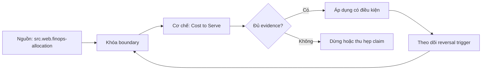

# Cost to Serve

> [!abstract] Câu hỏi trung tâm
> Làm sao dựng cost-to-serve có boundary, allocation policy, unit denominator và uncertainty đủ để so sánh hoặc đề xuất retirement mà không cắt nhầm giá trị?

## 1. Chốt boundary và kỳ đo

Cost model phải ghi product ID/version, environments, services/jobs/tables, support responsibilities, currency, effective rates, discounts/amortization, period và excluded items. Một pipeline dùng chung cho năm products không thể gán toàn bộ cho product đầu tiên được xem. Phân biệt actual billed cost, allocated cost, estimate và opportunity cost. Reconcile tổng direct + shared + unallocated với bill/ledger trong tolerance; nếu phần unallocated lớn, ranking product là provisional. Không trộn monthly run rate của product này với one-time migration cost của product khác.

## 2. Bốn nhóm chi phí có cấu trúc

Build/refresh compute gồm orchestration, warehouse/cluster jobs, network/egress và retries/backfills. Storage gồm tables, replicas, indexes, snapshots/backups và retention tiers. Serving gồm BI extracts, interactive SQL/API compute, cache, network và concurrency headroom. Labor/operations gồm build amortization nếu scope yêu cầu, on-call, incidents, support, governance, access reviews và vendor administration. Shared platform/license/observability phải direct, allocate hoặc báo unallocated; không làm nó biến mất. Roadmap nói labor thường lớn nhất nhưng đây chỉ là giả thuyết cần time evidence.

## 3. Allocation là policy có sensitivity

FinOps Allocation dùng accounts/tags/labels/derived metadata và chiến lược shared cost. Direct attribution ưu tiên resource/job/query tags có product ID. Shared cost có thể chia fixed, proportional theo usage/spend/queries/users hoặc proxy khác; mỗi method mang incentive và bias. Platform base cost có thể central fund nếu đó là quyết định minh bạch. Chạy sensitivity với ít nhất hai plausible policies; nếu retirement candidate đổi theo method, không kết luận từ một ranking. Báo allocation coverage và phần chưa phân bổ.

## 4. Labor estimate có evidence

Nguồn gồm ticket system, incident timeline, on-call events, deployment/change records và sampled time study; không hồi tưởng một con số đẹp. Gắn activity taxonomy: operate, support, governance, improvement, toil và product development. Tránh double-count một incident vào on-call và support hoặc phân toàn meeting time cho một product. Fully loaded rate là policy finance gồm salary/benefit/overhead hoặc internal standard; báo hours và rate tách riêng. Uncertainty range, confidence và missing logs quan trọng hơn giả chính xác tới đồng.

## 5. Unit economics nối cost với purpose

FinOps Unit Economics phân resource-efficiency unit và business unit. Product có thể theo cost per refresh/query/GB cho engineering và cost per active decision, case resolved hoặc eligible user served cho business. Denominator phải là value-bearing event đã định nghĩa, không dùng access grants. So trend trong cùng scope thường đáng tin hơn xếp hạng products phục vụ mục tiêu khác. Unit cost giảm vì denominator bị spam hoặc quality/freshness giảm là false economy; kèm SLO, correctness, adoption và risk guardrails.

## 6. Retirement là decision nhiều chiều

Candidate signals gồm không trace tới active decision, no confirmed consumer qua đủ cadence, duplicate contract, cost/risk cao so với replacement hoặc owner withdrawn. High cost-low use chưa đủ nếu product phục vụ rare regulatory/high-stakes event. Lập consumer inventory gồm offline exports, scheduled accounts và dormant cycles; so keep, optimize, merge, archive và retire. Phương án thay thế có compatibility/migration, retention/audit, notice, parallel window, removal proof và restore boundary. Stakeholder approval không sửa cost data sai.

## 7. Tối ưu có guardrails và test thay đổi

Mỗi action nêu mechanism: reduce refresh frequency, incrementalize, tier storage, right-size, cache, prune fields/retention hoặc giảm manual support bằng product fix. Dự báo savings với assumptions rồi đo realized savings và regression. Cắt freshness chỉ hợp lệ khi decision latency cho phép; cache không được phá security/semantic version; xóa history không vi phạm audit. Lab ba products lưu raw bills/usage/tickets, allocation table, unit metrics, sensitivity, alternative analysis và migration plan; chưa có evidence thì đề xuất retirement chỉ là hypothesis.

## 8. Ma trận kiểm chứng từng mệnh đề

Mọi kết luận cần raw artifact, version và failure signal. Một dashboard xanh, sync completed, catalog label hoặc bảng cost có số không tự chứng minh correctness, security, value hay readiness.

### 8.1. cost model có product boundary và period

**Mệnh đề cần kiểm.** cost model có product boundary và period.

**Cách kiểm.** Reconcile direct, shared và unallocated amounts với billing/usage/support artifacts. Chạy ít nhất hai allocation policies, hai unit denominators và one changed freshness constraint; lưu sensitivity, uncertainty và consumer migration analysis. Với mệnh đề này, ghi environment/product/policy version, input shape, expected observation, failure signal và boundary làm kết luận không còn đúng.

**Bằng chứng đạt cho `wiki.data-product.cost-to-serve`.** Lưu contract/policy, fixture hoặc event extract, command/query, raw output, numerator-denominator hoặc cost reconciliation, reviewer và artifact hash. Nếu chưa chạy lab trên hệ được phép, chỉ ghi protocol; không biến expected result thành evidence.

### 8.2. actual allocated estimate opportunity cost tách nhau

**Mệnh đề cần kiểm.** actual allocated estimate opportunity cost tách nhau.

**Cách kiểm.** Reconcile direct, shared và unallocated amounts với billing/usage/support artifacts. Chạy ít nhất hai allocation policies, hai unit denominators và one changed freshness constraint; lưu sensitivity, uncertainty và consumer migration analysis. Với mệnh đề này, ghi environment/product/policy version, input shape, expected observation, failure signal và boundary làm kết luận không còn đúng.

**Bằng chứng đạt cho `wiki.data-product.cost-to-serve`.** Lưu contract/policy, fixture hoặc event extract, command/query, raw output, numerator-denominator hoặc cost reconciliation, reviewer và artifact hash. Nếu chưa chạy lab trên hệ được phép, chỉ ghi protocol; không biến expected result thành evidence.

### 8.3. direct shared và unallocated phải reconcile

**Mệnh đề cần kiểm.** direct shared và unallocated phải reconcile.

**Cách kiểm.** Reconcile direct, shared và unallocated amounts với billing/usage/support artifacts. Chạy ít nhất hai allocation policies, hai unit denominators và one changed freshness constraint; lưu sensitivity, uncertainty và consumer migration analysis. Với mệnh đề này, ghi environment/product/policy version, input shape, expected observation, failure signal và boundary làm kết luận không còn đúng.

**Bằng chứng đạt cho `wiki.data-product.cost-to-serve`.** Lưu contract/policy, fixture hoặc event extract, command/query, raw output, numerator-denominator hoặc cost reconciliation, reviewer và artifact hash. Nếu chưa chạy lab trên hệ được phép, chỉ ghi protocol; không biến expected result thành evidence.

### 8.4. build compute gồm retry và backfill

**Mệnh đề cần kiểm.** build compute gồm retry và backfill.

**Cách kiểm.** Reconcile direct, shared và unallocated amounts với billing/usage/support artifacts. Chạy ít nhất hai allocation policies, hai unit denominators và one changed freshness constraint; lưu sensitivity, uncertainty và consumer migration analysis. Với mệnh đề này, ghi environment/product/policy version, input shape, expected observation, failure signal và boundary làm kết luận không còn đúng.

**Bằng chứng đạt cho `wiki.data-product.cost-to-serve`.** Lưu contract/policy, fixture hoặc event extract, command/query, raw output, numerator-denominator hoặc cost reconciliation, reviewer và artifact hash. Nếu chưa chạy lab trên hệ được phép, chỉ ghi protocol; không biến expected result thành evidence.

### 8.5. storage gồm backup snapshot và retention

**Mệnh đề cần kiểm.** storage gồm backup snapshot và retention.

**Cách kiểm.** Reconcile direct, shared và unallocated amounts với billing/usage/support artifacts. Chạy ít nhất hai allocation policies, hai unit denominators và one changed freshness constraint; lưu sensitivity, uncertainty và consumer migration analysis. Với mệnh đề này, ghi environment/product/policy version, input shape, expected observation, failure signal và boundary làm kết luận không còn đúng.

**Bằng chứng đạt cho `wiki.data-product.cost-to-serve`.** Lưu contract/policy, fixture hoặc event extract, command/query, raw output, numerator-denominator hoặc cost reconciliation, reviewer và artifact hash. Nếu chưa chạy lab trên hệ được phép, chỉ ghi protocol; không biến expected result thành evidence.

### 8.6. serving cost gồm BI SQL API cache và egress

**Mệnh đề cần kiểm.** serving cost gồm BI SQL API cache và egress.

**Cách kiểm.** Reconcile direct, shared và unallocated amounts với billing/usage/support artifacts. Chạy ít nhất hai allocation policies, hai unit denominators và one changed freshness constraint; lưu sensitivity, uncertainty và consumer migration analysis. Với mệnh đề này, ghi environment/product/policy version, input shape, expected observation, failure signal và boundary làm kết luận không còn đúng.

**Bằng chứng đạt cho `wiki.data-product.cost-to-serve`.** Lưu contract/policy, fixture hoặc event extract, command/query, raw output, numerator-denominator hoặc cost reconciliation, reviewer và artifact hash. Nếu chưa chạy lab trên hệ được phép, chỉ ghi protocol; không biến expected result thành evidence.

### 8.7. labor largest là hypothesis không phải fact

**Mệnh đề cần kiểm.** labor largest là hypothesis không phải fact.

**Cách kiểm.** Reconcile direct, shared và unallocated amounts với billing/usage/support artifacts. Chạy ít nhất hai allocation policies, hai unit denominators và one changed freshness constraint; lưu sensitivity, uncertainty và consumer migration analysis. Với mệnh đề này, ghi environment/product/policy version, input shape, expected observation, failure signal và boundary làm kết luận không còn đúng.

**Bằng chứng đạt cho `wiki.data-product.cost-to-serve`.** Lưu contract/policy, fixture hoặc event extract, command/query, raw output, numerator-denominator hoặc cost reconciliation, reviewer và artifact hash. Nếu chưa chạy lab trên hệ được phép, chỉ ghi protocol; không biến expected result thành evidence.

### 8.8. time evidence cần taxonomy và tránh double count

**Mệnh đề cần kiểm.** time evidence cần taxonomy và tránh double count.

**Cách kiểm.** Reconcile direct, shared và unallocated amounts với billing/usage/support artifacts. Chạy ít nhất hai allocation policies, hai unit denominators và one changed freshness constraint; lưu sensitivity, uncertainty và consumer migration analysis. Với mệnh đề này, ghi environment/product/policy version, input shape, expected observation, failure signal và boundary làm kết luận không còn đúng.

**Bằng chứng đạt cho `wiki.data-product.cost-to-serve`.** Lưu contract/policy, fixture hoặc event extract, command/query, raw output, numerator-denominator hoặc cost reconciliation, reviewer và artifact hash. Nếu chưa chạy lab trên hệ được phép, chỉ ghi protocol; không biến expected result thành evidence.

### 8.9. shared allocation method tạo bias

**Mệnh đề cần kiểm.** shared allocation method tạo bias.

**Cách kiểm.** Reconcile direct, shared và unallocated amounts với billing/usage/support artifacts. Chạy ít nhất hai allocation policies, hai unit denominators và one changed freshness constraint; lưu sensitivity, uncertainty và consumer migration analysis. Với mệnh đề này, ghi environment/product/policy version, input shape, expected observation, failure signal và boundary làm kết luận không còn đúng.

**Bằng chứng đạt cho `wiki.data-product.cost-to-serve`.** Lưu contract/policy, fixture hoặc event extract, command/query, raw output, numerator-denominator hoặc cost reconciliation, reviewer và artifact hash. Nếu chưa chạy lab trên hệ được phép, chỉ ghi protocol; không biến expected result thành evidence.

### 8.10. sensitivity test hai allocation policies

**Mệnh đề cần kiểm.** sensitivity test hai allocation policies.

**Cách kiểm.** Reconcile direct, shared và unallocated amounts với billing/usage/support artifacts. Chạy ít nhất hai allocation policies, hai unit denominators và one changed freshness constraint; lưu sensitivity, uncertainty và consumer migration analysis. Với mệnh đề này, ghi environment/product/policy version, input shape, expected observation, failure signal và boundary làm kết luận không còn đúng.

**Bằng chứng đạt cho `wiki.data-product.cost-to-serve`.** Lưu contract/policy, fixture hoặc event extract, command/query, raw output, numerator-denominator hoặc cost reconciliation, reviewer và artifact hash. Nếu chưa chạy lab trên hệ được phép, chỉ ghi protocol; không biến expected result thành evidence.

### 8.11. unit denominator là value-bearing event

**Mệnh đề cần kiểm.** unit denominator là value-bearing event.

**Cách kiểm.** Reconcile direct, shared và unallocated amounts với billing/usage/support artifacts. Chạy ít nhất hai allocation policies, hai unit denominators và one changed freshness constraint; lưu sensitivity, uncertainty và consumer migration analysis. Với mệnh đề này, ghi environment/product/policy version, input shape, expected observation, failure signal và boundary làm kết luận không còn đúng.

**Bằng chứng đạt cho `wiki.data-product.cost-to-serve`.** Lưu contract/policy, fixture hoặc event extract, command/query, raw output, numerator-denominator hoặc cost reconciliation, reviewer và artifact hash. Nếu chưa chạy lab trên hệ được phép, chỉ ghi protocol; không biến expected result thành evidence.

### 8.12. trend within scope an toàn hơn cross-product ranking

**Mệnh đề cần kiểm.** trend within scope an toàn hơn cross-product ranking.

**Cách kiểm.** Reconcile direct, shared và unallocated amounts với billing/usage/support artifacts. Chạy ít nhất hai allocation policies, hai unit denominators và one changed freshness constraint; lưu sensitivity, uncertainty và consumer migration analysis. Với mệnh đề này, ghi environment/product/policy version, input shape, expected observation, failure signal và boundary làm kết luận không còn đúng.

**Bằng chứng đạt cho `wiki.data-product.cost-to-serve`.** Lưu contract/policy, fixture hoặc event extract, command/query, raw output, numerator-denominator hoặc cost reconciliation, reviewer và artifact hash. Nếu chưa chạy lab trên hệ được phép, chỉ ghi protocol; không biến expected result thành evidence.

### 8.13. rare high-stakes product không bị xóa chỉ vì low use

**Mệnh đề cần kiểm.** rare high-stakes product không bị xóa chỉ vì low use.

**Cách kiểm.** Reconcile direct, shared và unallocated amounts với billing/usage/support artifacts. Chạy ít nhất hai allocation policies, hai unit denominators và one changed freshness constraint; lưu sensitivity, uncertainty và consumer migration analysis. Với mệnh đề này, ghi environment/product/policy version, input shape, expected observation, failure signal và boundary làm kết luận không còn đúng.

**Bằng chứng đạt cho `wiki.data-product.cost-to-serve`.** Lưu contract/policy, fixture hoặc event extract, command/query, raw output, numerator-denominator hoặc cost reconciliation, reviewer và artifact hash. Nếu chưa chạy lab trên hệ được phép, chỉ ghi protocol; không biến expected result thành evidence.

### 8.14. retirement inventory gồm offline and dormant consumers

**Mệnh đề cần kiểm.** retirement inventory gồm offline and dormant consumers.

**Cách kiểm.** Reconcile direct, shared và unallocated amounts với billing/usage/support artifacts. Chạy ít nhất hai allocation policies, hai unit denominators và one changed freshness constraint; lưu sensitivity, uncertainty và consumer migration analysis. Với mệnh đề này, ghi environment/product/policy version, input shape, expected observation, failure signal và boundary làm kết luận không còn đúng.

**Bằng chứng đạt cho `wiki.data-product.cost-to-serve`.** Lưu contract/policy, fixture hoặc event extract, command/query, raw output, numerator-denominator hoặc cost reconciliation, reviewer và artifact hash. Nếu chưa chạy lab trên hệ được phép, chỉ ghi protocol; không biến expected result thành evidence.

### 8.15. cost optimization cần freshness quality security guardrails

**Mệnh đề cần kiểm.** cost optimization cần freshness quality security guardrails.

**Cách kiểm.** Reconcile direct, shared và unallocated amounts với billing/usage/support artifacts. Chạy ít nhất hai allocation policies, hai unit denominators và one changed freshness constraint; lưu sensitivity, uncertainty và consumer migration analysis. Với mệnh đề này, ghi environment/product/policy version, input shape, expected observation, failure signal và boundary làm kết luận không còn đúng.

**Bằng chứng đạt cho `wiki.data-product.cost-to-serve`.** Lưu contract/policy, fixture hoặc event extract, command/query, raw output, numerator-denominator hoặc cost reconciliation, reviewer và artifact hash. Nếu chưa chạy lab trên hệ được phép, chỉ ghi protocol; không biến expected result thành evidence.

## 9. Quy trình phản biện

1. Chốt product, consumer, decision, environment và criticality trước khi chọn metric hoặc control.
2. Tách tool capability, configured policy, observed behavior và business outcome.
3. Ghi stable IDs, versions, time window, denominator, allocation hoặc identity rules.
4. Kiểm negative/failure path, overload, retry, stale state, hidden consumer và changed constraint.
5. Phân loại source fact, curriculum synthesis, organizational policy và untested hypothesis.
6. Lưu uncertainty, unallocated/unknown set và stop condition; không ép bảng phải cho kết luận.
7. Chưa có execution evidence thì giữ trạng thái `review`.

## 10. Câu hỏi tự kiểm tra

1. Invariant hoặc decision nào đang được bảo vệ?
2. Chủ thể, resource, event hay cost unit được định danh bằng gì?
3. Denominator, time window và unknown/unallocated set là gì?
4. Failure nào vẫn cho tín hiệu xanh hoặc completed?
5. Thay đổi nào làm policy, metric, allocation hoặc state transition phải xem lại?
6. Ai có quyền duyệt, ai vận hành và bằng chứng nào còn chưa chạy?

## 11. Giới hạn và điều chưa cho phép kết luận

- Chưa chạy security/load test, adoption analysis, cost allocation, reverse-ETL fault injection hoặc lifecycle exercise; note mô tả protocol và expected evidence.
- Tài liệu web được kiểm ngày 2026-10-01; feature, pricing, law/guidance và vendor behavior có thể đổi.
- Metrics, cost categories, shadow-system constraints và six-state lifecycle là curriculum synthesis; không gán nguyên văn cho một nguồn.
- Guidance privacy không thay legal review; performance/security examples không thay threat model và production authorization.
- Note giữ trạng thái `review` cho tới khi chủ dự án duyệt semantic meaning.

## Reference
1. [[SRC-FINOPS-ALLOCATION]]
2. [[SRC-FINOPS-UNIT-ECONOMICS]]
3. [[SRC-REIS-HOUSLEY-FUNDAMENTALS-DATA-ENGINEERING]]

## Source coverage

| Source slice | Nội dung sử dụng | Trạng thái |
|---|---|---|
| [[SRC-FINOPS-ALLOCATION]] | Khái niệm, mechanism hoặc governance boundary liên quan | Đã đọc locator trong source record; không suy ngoài phạm vi |
| [[SRC-FINOPS-UNIT-ECONOMICS]] | Khái niệm, mechanism hoặc governance boundary liên quan | Đã đọc locator trong source record; không suy ngoài phạm vi |
| [[SRC-REIS-HOUSLEY-FUNDAMENTALS-DATA-ENGINEERING]] | Khái niệm, mechanism hoặc governance boundary liên quan | Đã đọc locator trong source record; không suy ngoài phạm vi |

## Key takeaways
- Cost-to-serve phải reconcile direct/shared/unallocated, kiểm sensitivity và ghép unit cost với value guardrails.
- Mọi phép đo hoặc gate cần stable version, owner, denominator/scope và failure evidence.
- Signal dễ lấy không được dùng thay decision outcome, correctness hoặc user safety.
- Unknown consumers, unallocated costs, rejected rows và expired evidence phải hiển thị, không mặc định bằng zero.
- Chưa chạy lab thì artifact là tài liệu học thuật đã kiểm cấu trúc, không phải chứng nhận production.

<!-- ATOMIC-EXECUTION-CAPSULE:START -->

## Execution capsule: kiểm chứng `wiki.data-product.cost-to-serve`

> [!important] Phân loại mệnh đề
> Với `wiki.data-product.cost-to-serve`, sơ đồ, ví dụ và artifact về **Cost to Serve** là **synthesis để kiểm chứng**; chúng không phải trích dẫn hay case nguyên văn của nguồn.

### Sơ đồ cơ chế và điểm kiểm soát



Đọc sơ đồ `wiki.data-product.cost-to-serve` từ trái sang phải: source chỉ cung cấp claim ban đầu cho **Cost to Serve**; quyết định chỉ được đi tiếp sau khi boundary, evidence và điều kiện đảo quyết định đã hiện hữu.

### Ví dụ làm việc có thể bác bỏ

**Input.** Một đội cần trả lời: Làm sao dựng cost-to-serve có boundary, allocation policy, unit denominator và uncertainty đủ để so sánh hoặc đề xuất retirement mà không cắt nhầm giá trị? cho một phạm vi nhỏ, có owner và deadline rõ.

**Decision.** Đội áp dụng **Cost to Serve** trên control và variant chỉ khác một assumption; expected result và hard constraints được khóa trước khi chạy.

**Outcome.** Với `wiki.data-product.cost-to-serve`, nếu observation vi phạm hard constraint hoặc oracle độc lập không xác nhận **Cost to Serve**, đội thu hẹp claim hay đảo quyết định. Nếu đạt, kết luận vẫn kèm scope, version và review date; một lần thành công không được nâng thành quy luật phổ quát.

### Artifact thực thi tối thiểu

```sql
-- Verification harness for: Cost to Serve
WITH evidence AS (
    SELECT 'wiki.data-product.cost-to-serve' AS concept_id,
           'boundary_declared' AS check_name, 1 AS passed
    UNION ALL
    SELECT 'wiki.data-product.cost-to-serve', 'independent_oracle', 1
    UNION ALL
    SELECT 'wiki.data-product.cost-to-serve', 'reversal_trigger_recorded', 1
)
SELECT concept_id,
       MIN(passed) AS all_hard_checks_pass,
       COUNT(*) AS evidence_items
FROM evidence
GROUP BY concept_id
HAVING MIN(passed) = 1;
```

Artifact của `wiki.data-product.cost-to-serve` buộc người dùng ghi boundary, oracle và reversal trigger cho **Cost to Serve**. Các giá trị minh họa phải được thay bằng evidence thật trước khi dùng cho quyết định.

### Tự kiểm tra trước khi tái sử dụng

1. Bạn có thể trả lời `Làm sao dựng cost-to-serve có boundary, allocation policy, unit denominator và uncertainty đủ để so sánh hoặc đề xuất retirement mà không cắt nhầm giá trị?` bằng một câu mà không kéo thêm concept thứ hai không?
2. Source locator nào đỡ cho claim, và phần nào chỉ là synthesis trong note?
3. Observation nào khiến bạn dừng, thu hẹp hoặc đảo quyết định?
4. Artifact nào cho phép một reviewer độc lập tái hiện kết quả?

<!-- ATOMIC-EXECUTION-CAPSULE:END -->
