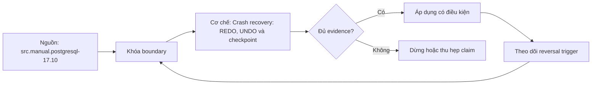

# Crash recovery: REDO, UNDO và checkpoint

> [!abstract] Câu hỏi trung tâm
> Sau crash, engine biết đọc WAL từ đâu, áp record nào và làm transaction dở dang biến mất bằng cơ chế nào mà không suy sai mô hình của DBMS?

## 1. Failure model phải nói trước

Transaction abort, process crash, OS/power crash và media loss là bốn failure classes khác nhau. Crash recovery thường giả định nonvolatile storage còn đọc được; disk/media loss cần backup/replica/PITR. Kill process không chứng minh khả năng chịu controller cache mất điện.

Recovery correctness cần atomicity, durability và structural consistency. Recovery time còn là mục tiêu vận hành. Một bài test chỉ restart thành công chưa chứng minh committed data còn đủ hoặc uncommitted effects không lộ.

## 2. Vì sao cần REDO

No-force policy cho phép transaction commit khi data pages còn dirty trong RAM, miễn WAL commit và changes đã bền vững. Crash làm mất RAM nên recovery phải REDO các changes có record nhưng data page chưa phản ánh.

PostgreSQL scan WAL từ redo location của checkpoint hợp lệ, so page LSN với record LSN và apply theo resource-manager rules. Full-page images sửa partial-page risk ở lần đổi đầu sau checkpoint. REDO phải idempotent hoặc có guard đủ để không áp sai state.

## 3. Vì sao mô hình tổng quát có UNDO

Steal policy cho phép page chứa thay đổi chưa commit được ghi xuống disk. Trong ARIES-style recovery, analysis tìm dirty pages và active transactions; REDO lặp lịch sử; UNDO lùi các loser transactions, ghi compensation log records để recovery có thể restart an toàn.

Đây là mô hình quan trọng nhưng không phải mô tả nguyên xi mọi engine. Shadow paging, no-steal, MVCC và append-only designs có cách khác. Bài giảng phải tách thuật toán tổng quát khỏi behavior của PostgreSQL.

## 4. PostgreSQL không có crash-time physical UNDO phase

PostgreSQL recovery phát lại WAL. Với transaction chưa commit khi crash, transaction status không có commit/abort bit nhưng transaction không còn chạy; visibility logic coi versions của nó là aborted/invisible. Sách *PostgreSQL 14 Internals* ghi rõ phase rollback cổ điển không cần trong PostgreSQL.

Dead tuples/versions không biến mất vật lý ngay. VACUUM sau đó thu hồi. Nói PostgreSQL undo các thay đổi chưa commit trong crash recovery là sai mức cơ chế, dù outcome logic là effects không visible. Rollback trong runtime và crash recovery cũng không nên gộp.

## 5. Checkpoint là giới hạn recovery work

Không thể replay WAL từ ngày tạo cluster. Checkpoint xác lập redo start mà trước đó required data changes đã được đưa tới data files theo protocol. WAL cũ chỉ được recycle khi không còn cần cho recovery, archive, backup hoặc replication.

Checkpoint không đơn giản là một timestamp. PostgreSQL lưu checkpoint record và `pg_control` trỏ tới completed checkpoint/redo location. Recovery đọc `pg_control`, record và scan tiến về phía trước.

## 6. Checkpoint PostgreSQL là một khoảng có pacing

Checkpointer đánh dấu/tập hợp pages dirty ở checkpoint start rồi ghi chúng trong thời gian trải rộng. Pages có thể tiếp tục bị sửa; pages mới dirty sau start thuộc chu kỳ khác theo cơ chế. Chỉ khi required pages và metadata được xử lý, checkpoint mới hoàn tất và recovery point mới được công nhận.

Vì vậy câu checkpoint đẩy mọi trang bẩn xuống ngay rồi ghi mốc gây hiểu sai burst và concurrency. PostgreSQL dùng `checkpoint_completion_target` để trải I/O; end-of-checkpoint sync vẫn có thể tạo stall tùy OS cache.

## 7. Checkpoint frequency trade-off

Checkpoint thường xuyên giảm lượng WAL cần redo và có thể giảm recovery duration, nhưng tăng write pressure và full-page images sau checkpoint. Checkpoint thưa giữ nhiều WAL, tăng recovery work và disk headroom requirement nhưng giảm tần suất flush cycles.

`checkpoint_timeout` và `max_wal_size` phối hợp trigger; `max_wal_size` là target, không phải hard guarantee. Archive lag, replication slot và recovery có thể giữ thêm WAL. Tuning phải dựa WAL generation rate, recovery objective, disk budget và foreground latency.

## 8. Background writer không thay checkpoint

Background writer làm sạch buffers có khả năng bị eviction để giảm backend writes. Checkpointer bảo đảm recovery boundary. Cùng ghi dirty pages nhưng mục tiêu khác. Chạy `CHECKPOINT` không đồng nghĩa evict pages khỏi buffer cache.

Metrics cần tách buffers checkpoint, clean/background và backend; tên view thay đổi theo PostgreSQL version. Backend fsync/write cao có thể chỉ cấu hình/write pressure chưa phù hợp, cần đọc cùng workload.

## 9. Ba crash timing case

Case A: transaction chưa commit. Sau restart, effects không visible; PostgreSQL có thể còn physical tuple version cho VACUUM. Case B: synchronous commit đã trả success. Commit WAL đã durable theo contract nên REDO phải giữ effects. Case C: crash đúng lúc commit; nếu client chưa nhận success, outcome có thể committed hoặc not committed tùy commit record flush/ack boundary.

Case C không được mô tả đơn giản phụ thuộc commit record có xuống disk từ phía application vì client không biết. Cần business transaction ID và reconciliation query. Retry phải idempotent hoặc dùng unique key/state machine.

## 10. Recovery log và evidence

PostgreSQL log báo interruption, redo start/end và time. `pg_controldata` cho cluster state/checkpoint locations; `pg_waldump` đọc record range khi có quyền. Application ledger cung cấp submitted/acknowledged IDs; database query cho survived IDs.

Đừng chỉ đo wall time bằng mắt. Lưu timestamps monotonic ngoài process, WAL distance, bytes, records, storage I/O/CPU và checkpoint config. Recovery may include startup work khác; ghi version và dataset.

## 11. Thiết kế thí nghiệm crash an toàn

Dùng disposable cluster, snapshot/seed tái tạo và không chứa dữ liệu thật. Client ghi durable ledger riêng với unique operation ID. Tạo ba cases bằng synchronization points hoặc repeated trials; kill immediate là crash model đã khai, không dùng graceful stop.

Sau restart, kiểm database ready, invariant, acknowledged set, ambiguous set, uncommitted set và logs. Chạy nhiều lần cho race case; một lần không đại diện timing window. Không gọi việc rút nguồn máy thật là lab mặc định.

## 12. Đo checkpoint interval và recovery

Chọn hai cấu hình đủ khác nhưng an toàn, cùng dataset/workload/WAL rate. Trước mỗi run recreate cluster/snapshot, chạy đến comparable WAL distance hoặc time, crash tại protocol giống nhau, đo recovery start-to-ready.

Thu foreground p95/p99, checkpoint write/sync time, requested/timed count, WAL bytes retained, full-page image/WAL volume và recovery time. Nếu một config tạo workload state khác, comparison không hợp lệ.

## 13. Recovery objective là cam kết vận hành

RTO không chỉ checkpoint interval: WAL volume, storage throughput, full-page images, CPU, recovery prefetch, corruption, archive access và standby topology cùng ảnh hưởng. RPO phụ thuộc sync/replication/backup contract, không suy từ RTO.

Định kỳ game day trên bản sao đại diện. Restore backup + WAL/PITR khác crash recovery tại chỗ; cần test riêng. Một startup nhanh không chứng minh backup usable.

Recovery benchmark còn phải tách thời gian engine phát lại WAL khỏi thời gian service thật sự sẵn sàng nhận traffic. Database có thể báo ready nhưng application connection pool, migrations, cache warm-up hoặc replica catch-up chưa hoàn tất. Vì vậy RTO kỹ thuật của PostgreSQL và RTO của dịch vụ là hai số có quan hệ nhưng không đồng nhất; runbook phải ghi rõ điểm bắt đầu và điểm kết thúc của từng số.

## 14. Fuzzy checkpoint và ARIES

Trong mô hình ARIES, fuzzy checkpoint cho phép transactions chạy, ghi begin/end checkpoint cùng dirty-page/transaction tables; analysis xác định redo start và losers. REDO repeats history rồi UNDO losers với CLRs.

PostgreSQL có online checkpoint và WAL redo nhưng không nên gọi toàn bộ implementation là ARIES rồi suy có identical phases. Dùng ARIES để hiểu design space; dùng PostgreSQL manual/internals để mô tả PostgreSQL.

## 15. Partial writes và full-page images

Crash giữa page write có thể tạo torn page. PostgreSQL full-page image ở lần sửa đầu sau checkpoint cho phép restore consistent page rồi apply later WAL. Tắt cơ chế cần storage guarantee tương ứng; benchmark không được đánh đổi correctness ngầm.

Data checksums giúp phát hiện một số corruption; không thay full-page images, backup hoặc redundancy. CRC WAL bảo vệ records; từng layer giải failure khác.

## 16. Các ngộ nhận cần loại

- Recovery luôn redo rồi undo: phụ thuộc engine; PostgreSQL không có crash-time physical undo phase cổ điển.
- Checkpoint dừng hệ và flush tức thì: PostgreSQL checkpoint được trải theo thời gian.
- Checkpoint xong thì cache rỗng: pages được ghi, không nhất thiết bị evict.
- Commit ACK mất thì transaction chắc chắn fail: outcome có thể bất định.
- Restart thành công là recovery đúng: cần invariant và ID reconciliation.
- RTO bằng checkpoint timeout: còn WAL rate và recovery throughput.

## 17. Câu hỏi tự kiểm tra

1. No-force tạo nhu cầu REDO thế nào?
2. ARIES UNDO khác PostgreSQL MVCC visibility ra sao?
3. Checkpoint redo location dùng để làm gì?
4. Case crash trong commit cần reconciliation vì sao?
5. Checkpoint thường hơn ảnh hưởng full-page WAL thế nào?
6. Background writer khác checkpointer ở mục tiêu nào?

## 18. Giới hạn và điều chưa cho phép kết luận

- Chưa chạy crash hoặc recovery-time experiment.
- Kill process không bao phủ power loss/media corruption.
- Không có số RTO/WAL/I/O; note chỉ định protocol.
- Mô hình ARIES lấy từ textbook/Petrov; PostgreSQL behavior lấy từ nguồn PostgreSQL.
- PITR, replica failover và backup restore nằm ngoài lab này.

## Reference
1. [[SRC-POSTGRESQL-17-10-MANUAL]]: checkpoint, WAL internals và REDO.
2. [[SRC-ROGOV-POSTGRESQL-14-INTERNALS]]: checkpoint interval, startup recovery và không cần rollback phase.
3. [[SRC-PETROV-DATABASE-INTERNALS-1E]]: steal/force, fuzzy checkpoint và ARIES.
4. [[SRC-SILBERSCHATZ-DATABASE-SYSTEM-CONCEPTS-7E]]: failure classification, log recovery, REDO/UNDO và checkpoint.

## Source coverage

| Source slice | Nội dung phải giữ | Vị trí trong note | Trạng thái |
|---|---|---|---|
| [[SRC-POSTGRESQL-17-10-MANUAL]], PDF 918-926 | WAL/checkpoint/REDO | §§2, 5-8, 15 | Đã giữ version-specific behavior |
| [[SRC-ROGOV-POSTGRESQL-14-INTERNALS]], PDF 164-196 | checkpoint phases, recovery, MVCC loser handling | §§4-12 | Đã sửa scaffold undo misconception |
| [[SRC-PETROV-DATABASE-INTERNALS-1E]], PDF 117-124 | ARIES/fuzzy checkpoint/steal-force | §§3, 14 | Đã gắn nhãn mô hình tổng quát |
| [[SRC-SILBERSCHATZ-DATABASE-SYSTEM-CONCEPTS-7E]], PDF 2418-2462 | failure/recovery/checkpoint algorithms | §§1-3, 9, 14 | Đã giữ assumptions |
| DE-L138 contract | ba crash cases và hai checkpoint cycles | §§9-12 | Chưa chạy, chuyển after-note |

## Key takeaways
- REDO phục hồi changes đã log nhưng data pages chưa bền vững.
- ARIES có analysis/redo/undo; PostgreSQL dùng REDO và MVCC status, không crash-time physical undo cổ điển.
- Checkpoint là protocol kéo recovery boundary, không phải flush tức thì đơn giản.
- Crash quanh commit tạo outcome ambiguity từ phía client.
- Recovery phải được kiểm bằng invariant, ID ledger, WAL distance và thời gian, không chỉ startup success.

<!-- ATOMIC-EXECUTION-CAPSULE:START -->

## Execution capsule: kiểm chứng `wiki.database.crash-recovery-redo-undo-checkpoints`

> [!important] Phân loại mệnh đề
> Với `wiki.database.crash-recovery-redo-undo-checkpoints`, sơ đồ, ví dụ và artifact về **Crash recovery: REDO, UNDO và checkpoint** là **synthesis để kiểm chứng**; chúng không phải trích dẫn hay case nguyên văn của nguồn.

### Sơ đồ cơ chế và điểm kiểm soát



Đọc sơ đồ `wiki.database.crash-recovery-redo-undo-checkpoints` từ trái sang phải: source chỉ cung cấp claim ban đầu cho **Crash recovery: REDO, UNDO và checkpoint**; quyết định chỉ được đi tiếp sau khi boundary, evidence và điều kiện đảo quyết định đã hiện hữu.

### Artifact thực thi tối thiểu

```sql
-- Verification harness for: Crash recovery: REDO, UNDO và checkpoint
WITH evidence AS (
    SELECT 'wiki.database.crash-recovery-redo-undo-checkpoints' AS concept_id,
           'boundary_declared' AS check_name, 1 AS passed
    UNION ALL
    SELECT 'wiki.database.crash-recovery-redo-undo-checkpoints', 'independent_oracle', 1
    UNION ALL
    SELECT 'wiki.database.crash-recovery-redo-undo-checkpoints', 'reversal_trigger_recorded', 1
)
SELECT concept_id,
       MIN(passed) AS all_hard_checks_pass,
       COUNT(*) AS evidence_items
FROM evidence
GROUP BY concept_id
HAVING MIN(passed) = 1;
```

Artifact của `wiki.database.crash-recovery-redo-undo-checkpoints` buộc người dùng ghi boundary, oracle và reversal trigger cho **Crash recovery: REDO, UNDO và checkpoint**. Các giá trị minh họa phải được thay bằng evidence thật trước khi dùng cho quyết định.

### Tự kiểm tra trước khi tái sử dụng

1. Bạn có thể trả lời `Crash recovery chọn điểm bắt đầu, REDO và xử lý transaction chưa commit thế nào, và PostgreSQL khác mô hình ARIES redo/undo ở đâu?` bằng một câu mà không kéo thêm concept thứ hai không?
2. Source locator nào đỡ cho claim, và phần nào chỉ là synthesis trong note?
3. Observation nào khiến bạn dừng, thu hẹp hoặc đảo quyết định?
4. Artifact nào cho phép một reviewer độc lập tái hiện kết quả?

<!-- ATOMIC-EXECUTION-CAPSULE:END -->
