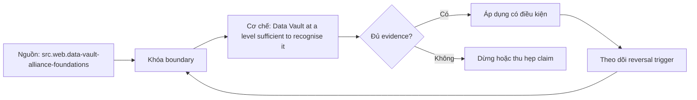

# Data Vault at a level sufficient to recognise it

> [!abstract] Câu hỏi trung tâm
> Nhận diện Hub–Link–Satellite, phân biệt Raw Vault với delivery model và đánh giá chi phí/phù hợp mà không tuyên bố năng lực triển khai Data Vault?

## 1. Hub

Hub đại diện business concept identity qua business key ổn định và metadata load/source; descriptive attributes không nằm trong Hub. Nhận diện bằng grain một business key duy nhất, không bằng tên bảng có tiền tố `HUB_`. Việc chọn sai business key bị automation nhân rộng rất nhanh.

## 2. Link

Link ghi association/unit of work giữa Hubs, thường là insert-only và mang các hub keys cùng load/source metadata. Relationship grain phải được phát biểu; Link không phải generic join table được tạo cho mọi FK. Dependent child, driving key và effectivity là các chủ đề nâng cao nằm ngoài năng lực triển khai của bài.

## 3. Satellite

Satellite chứa descriptive context và history gắn với Hub/Link, tách theo source, rate of change hoặc meaning khi cần. Load timestamp/hashdiff/record source hỗ trợ historization và provenance; chúng không tự sửa data quality hoặc identity semantics. Một parent có thể có nhiều Satellites và cần point-in-time logic để ghép state hiện hành.

## 4. Raw, Business và delivery

Raw Vault bảo toàn loaded source-aligned evidence; Business Vault thêm derived rules/structures có lineage; Information Mart/dimensional/semantic layer phục vụ consumption. Raw Vault không phải giao diện tối ưu cho analyst. Truy vấn customer current state có thể cần nhiều joins, latest-row logic và PIT/bridge acceleration.

## 5. Khi nào phù hợp

Data Vault có lý khi nhiều sources thay đổi, cần lineage/audit/history cao và tổ chức có automation, modeling discipline cùng delivery layer. Nó có thể quá nặng cho một source ổn định, team nhỏ, nhu cầu delivery nhanh hoặc không có metadata/automation. Chi phí gồm table/join proliferation, orchestration, testing, skill và nuôi thêm mart layer.

## 6. Ma trận kiểm chứng từng mệnh đề

Mỗi mệnh đề phải chuyển thành fixture, invariant và phép đối chiếu tái chạy được. Tên pattern, sơ đồ hoặc một query chạy không lỗi không tự chứng minh đúng grain và semantics.

### 6.1. Hub giữ stable business keys không giữ descriptors

**Mệnh đề cần kiểm.** Hub giữ stable business keys không giữ descriptors. **Thiết kế phép kiểm.** Cho một lược đồ không dán nhãn, xác định business keys, relationship grain, descriptive history và source metadata để nhận Hub–Link–Satellite. Viết current-state query, đếm joins và so ba bối cảnh theo audit/change/team/automation/delivery cost. **Bằng chứng đạt cho `wiki.data-modeling.data-vault-recognition`.** Lưu model/metric contract, seed data, SQL/notebook, raw output, row counts, distinct keys, unmatched rate và control totals. Nếu kết quả phụ thuộc engine, cutoff hoặc business policy, phải ghi điều kiện đó cùng phản ví dụ.

### 6.2. Link giữ relationship grain

**Mệnh đề cần kiểm.** Link giữ relationship grain. **Thiết kế phép kiểm.** Cho một lược đồ không dán nhãn, xác định business keys, relationship grain, descriptive history và source metadata để nhận Hub–Link–Satellite. Viết current-state query, đếm joins và so ba bối cảnh theo audit/change/team/automation/delivery cost. **Bằng chứng đạt cho `wiki.data-modeling.data-vault-recognition`.** Lưu model/metric contract, seed data, SQL/notebook, raw output, row counts, distinct keys, unmatched rate và control totals. Nếu kết quả phụ thuộc engine, cutoff hoặc business policy, phải ghi điều kiện đó cùng phản ví dụ.

### 6.3. Satellite giữ context/history và source metadata

**Mệnh đề cần kiểm.** Satellite giữ context/history và source metadata. **Thiết kế phép kiểm.** Cho một lược đồ không dán nhãn, xác định business keys, relationship grain, descriptive history và source metadata để nhận Hub–Link–Satellite. Viết current-state query, đếm joins và so ba bối cảnh theo audit/change/team/automation/delivery cost. **Bằng chứng đạt cho `wiki.data-modeling.data-vault-recognition`.** Lưu model/metric contract, seed data, SQL/notebook, raw output, row counts, distinct keys, unmatched rate và control totals. Nếu kết quả phụ thuộc engine, cutoff hoặc business policy, phải ghi điều kiện đó cùng phản ví dụ.

### 6.4. tên prefix không chứng minh object đúng pattern

**Mệnh đề cần kiểm.** tên prefix không chứng minh object đúng pattern. **Thiết kế phép kiểm.** Cho một lược đồ không dán nhãn, xác định business keys, relationship grain, descriptive history và source metadata để nhận Hub–Link–Satellite. Viết current-state query, đếm joins và so ba bối cảnh theo audit/change/team/automation/delivery cost. **Bằng chứng đạt cho `wiki.data-modeling.data-vault-recognition`.** Lưu model/metric contract, seed data, SQL/notebook, raw output, row counts, distinct keys, unmatched rate và control totals. Nếu kết quả phụ thuộc engine, cutoff hoặc business policy, phải ghi điều kiện đó cùng phản ví dụ.

### 6.5. Raw Vault không phải BI presentation layer

**Mệnh đề cần kiểm.** Raw Vault không phải BI presentation layer. **Thiết kế phép kiểm.** Cho một lược đồ không dán nhãn, xác định business keys, relationship grain, descriptive history và source metadata để nhận Hub–Link–Satellite. Viết current-state query, đếm joins và so ba bối cảnh theo audit/change/team/automation/delivery cost. **Bằng chứng đạt cho `wiki.data-modeling.data-vault-recognition`.** Lưu model/metric contract, seed data, SQL/notebook, raw output, row counts, distinct keys, unmatched rate và control totals. Nếu kết quả phụ thuộc engine, cutoff hoặc business policy, phải ghi điều kiện đó cùng phản ví dụ.

### 6.6. Business Vault phải giữ lineage của derived rules

**Mệnh đề cần kiểm.** Business Vault phải giữ lineage của derived rules. **Thiết kế phép kiểm.** Cho một lược đồ không dán nhãn, xác định business keys, relationship grain, descriptive history và source metadata để nhận Hub–Link–Satellite. Viết current-state query, đếm joins và so ba bối cảnh theo audit/change/team/automation/delivery cost. **Bằng chứng đạt cho `wiki.data-modeling.data-vault-recognition`.** Lưu model/metric contract, seed data, SQL/notebook, raw output, row counts, distinct keys, unmatched rate và control totals. Nếu kết quả phụ thuộc engine, cutoff hoặc business policy, phải ghi điều kiện đó cùng phản ví dụ.

### 6.7. Information Mart phục vụ consumption

**Mệnh đề cần kiểm.** Information Mart phục vụ consumption. **Thiết kế phép kiểm.** Cho một lược đồ không dán nhãn, xác định business keys, relationship grain, descriptive history và source metadata để nhận Hub–Link–Satellite. Viết current-state query, đếm joins và so ba bối cảnh theo audit/change/team/automation/delivery cost. **Bằng chứng đạt cho `wiki.data-modeling.data-vault-recognition`.** Lưu model/metric contract, seed data, SQL/notebook, raw output, row counts, distinct keys, unmatched rate và control totals. Nếu kết quả phụ thuộc engine, cutoff hoặc business policy, phải ghi điều kiện đó cùng phản ví dụ.

### 6.8. insert-only không tự bảo đảm data quality

**Mệnh đề cần kiểm.** insert-only không tự bảo đảm data quality. **Thiết kế phép kiểm.** Cho một lược đồ không dán nhãn, xác định business keys, relationship grain, descriptive history và source metadata để nhận Hub–Link–Satellite. Viết current-state query, đếm joins và so ba bối cảnh theo audit/change/team/automation/delivery cost. **Bằng chứng đạt cho `wiki.data-modeling.data-vault-recognition`.** Lưu model/metric contract, seed data, SQL/notebook, raw output, row counts, distinct keys, unmatched rate và control totals. Nếu kết quả phụ thuộc engine, cutoff hoặc business policy, phải ghi điều kiện đó cùng phản ví dụ.

### 6.9. hash key không sửa sai business identity

**Mệnh đề cần kiểm.** hash key không sửa sai business identity. **Thiết kế phép kiểm.** Cho một lược đồ không dán nhãn, xác định business keys, relationship grain, descriptive history và source metadata để nhận Hub–Link–Satellite. Viết current-state query, đếm joins và so ba bối cảnh theo audit/change/team/automation/delivery cost. **Bằng chứng đạt cho `wiki.data-modeling.data-vault-recognition`.** Lưu model/metric contract, seed data, SQL/notebook, raw output, row counts, distinct keys, unmatched rate và control totals. Nếu kết quả phụ thuộc engine, cutoff hoặc business policy, phải ghi điều kiện đó cùng phản ví dụ.

### 6.10. current-state query có latest-row logic

**Mệnh đề cần kiểm.** current-state query có latest-row logic. **Thiết kế phép kiểm.** Cho một lược đồ không dán nhãn, xác định business keys, relationship grain, descriptive history và source metadata để nhận Hub–Link–Satellite. Viết current-state query, đếm joins và so ba bối cảnh theo audit/change/team/automation/delivery cost. **Bằng chứng đạt cho `wiki.data-modeling.data-vault-recognition`.** Lưu model/metric contract, seed data, SQL/notebook, raw output, row counts, distinct keys, unmatched rate và control totals. Nếu kết quả phụ thuộc engine, cutoff hoặc business policy, phải ghi điều kiện đó cùng phản ví dụ.

### 6.11. PIT/bridge là access structures không đổi Raw Vault meaning

**Mệnh đề cần kiểm.** PIT/bridge là access structures không đổi Raw Vault meaning. **Thiết kế phép kiểm.** Cho một lược đồ không dán nhãn, xác định business keys, relationship grain, descriptive history và source metadata để nhận Hub–Link–Satellite. Viết current-state query, đếm joins và so ba bối cảnh theo audit/change/team/automation/delivery cost. **Bằng chứng đạt cho `wiki.data-modeling.data-vault-recognition`.** Lưu model/metric contract, seed data, SQL/notebook, raw output, row counts, distinct keys, unmatched rate và control totals. Nếu kết quả phụ thuộc engine, cutoff hoặc business policy, phải ghi điều kiện đó cùng phản ví dụ.

### 6.12. nhiều source thay đổi tăng giá trị auditability

**Mệnh đề cần kiểm.** nhiều source thay đổi tăng giá trị auditability. **Thiết kế phép kiểm.** Cho một lược đồ không dán nhãn, xác định business keys, relationship grain, descriptive history và source metadata để nhận Hub–Link–Satellite. Viết current-state query, đếm joins và so ba bối cảnh theo audit/change/team/automation/delivery cost. **Bằng chứng đạt cho `wiki.data-modeling.data-vault-recognition`.** Lưu model/metric contract, seed data, SQL/notebook, raw output, row counts, distinct keys, unmatched rate và control totals. Nếu kết quả phụ thuộc engine, cutoff hoặc business policy, phải ghi điều kiện đó cùng phản ví dụ.

### 6.13. team nhỏ có thể không gánh được hai delivery layers

**Mệnh đề cần kiểm.** team nhỏ có thể không gánh được hai delivery layers. **Thiết kế phép kiểm.** Cho một lược đồ không dán nhãn, xác định business keys, relationship grain, descriptive history và source metadata để nhận Hub–Link–Satellite. Viết current-state query, đếm joins và so ba bối cảnh theo audit/change/team/automation/delivery cost. **Bằng chứng đạt cho `wiki.data-modeling.data-vault-recognition`.** Lưu model/metric contract, seed data, SQL/notebook, raw output, row counts, distinct keys, unmatched rate và control totals. Nếu kết quả phụ thuộc engine, cutoff hoặc business policy, phải ghi điều kiện đó cùng phản ví dụ.

### 6.14. Data Vault không thay dimensional model cho BI

**Mệnh đề cần kiểm.** Data Vault không thay dimensional model cho BI. **Thiết kế phép kiểm.** Cho một lược đồ không dán nhãn, xác định business keys, relationship grain, descriptive history và source metadata để nhận Hub–Link–Satellite. Viết current-state query, đếm joins và so ba bối cảnh theo audit/change/team/automation/delivery cost. **Bằng chứng đạt cho `wiki.data-modeling.data-vault-recognition`.** Lưu model/metric contract, seed data, SQL/notebook, raw output, row counts, distinct keys, unmatched rate và control totals. Nếu kết quả phụ thuộc engine, cutoff hoặc business policy, phải ghi điều kiện đó cùng phản ví dụ.

### 6.15. bài này chỉ chứng minh recognition không implementation competence

**Mệnh đề cần kiểm.** bài này chỉ chứng minh recognition không implementation competence. **Thiết kế phép kiểm.** Cho một lược đồ không dán nhãn, xác định business keys, relationship grain, descriptive history và source metadata để nhận Hub–Link–Satellite. Viết current-state query, đếm joins và so ba bối cảnh theo audit/change/team/automation/delivery cost. **Bằng chứng đạt cho `wiki.data-modeling.data-vault-recognition`.** Lưu model/metric contract, seed data, SQL/notebook, raw output, row counts, distinct keys, unmatched rate và control totals. Nếu kết quả phụ thuộc engine, cutoff hoặc business policy, phải ghi điều kiện đó cùng phản ví dụ.

## 7. Quy trình phản biện

1. Viết business question, grain, identity, time semantics và aggregation contract.
2. Tách source fact, quyết định thiết kế và synthesis của giáo trình.
3. Dựng ca biên nhỏ nhất có thể làm query đúng cú pháp nhưng sai số.
4. Kiểm key, interval, cardinality và control total trước–sau transform/join.
5. Chạy replay, late data hoặc schema change phù hợp với bài; lưu failed run.
6. Phân biệt correctness, usability, performance và governance; một trục đạt không che lấp trục khác.
7. Ghi owner, version, policy và điều kiện làm lựa chọn hiện tại không còn đúng.

## 8. Câu hỏi tự kiểm tra

1. Pattern trong bài giải failure mode nào và không giải failure mode nào?
2. Row đại diện điều gì, có hiệu lực khi nào và được nhận dạng bằng gì?
3. Ca biên nào làm SUM, current-state lookup hoặc history query sai âm thầm?
4. Constraint/test nào bắt lỗi cấu trúc; phần ngữ nghĩa nào cần owner xác nhận?
5. Late data, correction, replay hoặc model change ảnh hưởng output đã công bố ra sao?
6. Nguồn nào hỗ trợ trực tiếp và phần nào là synthesis của bài?

## 9. Giới hạn và điều chưa cho phép kết luận

- Chưa chạy modeling lab, benchmark, late-data replay hay reconciliation; phép kiểm là protocol, không phải kết quả đã đo.
- Type number sau SCD Type 3 không hoàn toàn thống nhất giữa mọi tài liệu; implementation phải mô tả behavior.
- BigQuery guidance là engine-specific; không suy OBT luôn nhanh hoặc rẻ hơn.
- SQL Server system-versioned temporal table quản system time; business-valid time là trục khác.
- Bài Data Vault chỉ xác nhận khả năng nhận diện và đánh giá bối cảnh, không xác nhận năng lực triển khai DV2.

## Reference
1. [[SRC-DATA-VAULT-ALLIANCE-FOUNDATIONS]]
2. [[SRC-DATAVAULT-BUILDER-MAIN-DOCUMENTATION]]
3. [[SRC-KIMBALL-ROSS-DW-TOOLKIT-3E]]

## Source coverage

| Source slice | Nội dung sử dụng | Trạng thái |
|---|---|---|
| [[SRC-DATA-VAULT-ALLIANCE-FOUNDATIONS]] | Khái niệm, ranh giới và phản ví dụ liên quan đến bài | Đã đọc phạm vi có locator; không suy ngoài phạm vi |
| [[SRC-DATAVAULT-BUILDER-MAIN-DOCUMENTATION]] | Khái niệm, ranh giới và phản ví dụ liên quan đến bài | Đã đọc phạm vi có locator; không suy ngoài phạm vi |
| [[SRC-KIMBALL-ROSS-DW-TOOLKIT-3E]] | Khái niệm, ranh giới và phản ví dụ liên quan đến bài | Đã đọc phạm vi có locator; không suy ngoài phạm vi |

## Key takeaways
- Chọn pattern theo failure mode, grain, time và workload; không chọn theo tên gọi.
- Key/interval/cardinality đúng về cấu trúc vẫn cần business semantics và owner.
- History và restatement là data contract có tác động tới người dùng, không chỉ là ETL technique.
- Layout physical phải được so trên cùng workload và semantic output.
- Chưa chạy lab thì note là tài liệu học thuật đã truy nguồn, không phải chứng nhận production.

<!-- ATOMIC-EXECUTION-CAPSULE:START -->

## Execution capsule — kiểm chứng `wiki.data-modeling.data-vault-recognition`

> [!important] Phân loại mệnh đề
> Với `wiki.data-modeling.data-vault-recognition`, sơ đồ, ví dụ và artifact về **Data Vault at a level sufficient to recognise it** là **synthesis để kiểm chứng**; chúng không phải trích dẫn hay case nguyên văn của nguồn.

### Sơ đồ cơ chế và điểm kiểm soát



Đọc sơ đồ `wiki.data-modeling.data-vault-recognition` từ trái sang phải: source chỉ cung cấp claim ban đầu cho **Data Vault at a level sufficient to recognise it**; quyết định chỉ được đi tiếp sau khi boundary, evidence và điều kiện đảo quyết định đã hiện hữu.

### Artifact thực thi tối thiểu

```sql
-- Verification harness for: Data Vault at a level sufficient to recognise it
WITH evidence AS (
    SELECT 'wiki.data-modeling.data-vault-recognition' AS concept_id,
           'boundary_declared' AS check_name, 1 AS passed
    UNION ALL
    SELECT 'wiki.data-modeling.data-vault-recognition', 'independent_oracle', 1
    UNION ALL
    SELECT 'wiki.data-modeling.data-vault-recognition', 'reversal_trigger_recorded', 1
)
SELECT concept_id,
       MIN(passed) AS all_hard_checks_pass,
       COUNT(*) AS evidence_items
FROM evidence
GROUP BY concept_id
HAVING MIN(passed) = 1;
```

Artifact của `wiki.data-modeling.data-vault-recognition` buộc người dùng ghi boundary, oracle và reversal trigger cho **Data Vault at a level sufficient to recognise it**. Các giá trị minh họa phải được thay bằng evidence thật trước khi dùng cho quyết định.

### Tự kiểm tra trước khi tái sử dụng

1. Bạn có thể trả lời `Nhận diện Hub–Link–Satellite, phân biệt Raw Vault với delivery model và đánh giá chi phí/phù hợp mà không tuyên bố năng lực triển khai Data Vault?` bằng một câu mà không kéo thêm concept thứ hai không?
2. Source locator nào đỡ cho claim, và phần nào chỉ là synthesis trong note?
3. Observation nào khiến bạn dừng, thu hẹp hoặc đảo quyết định?
4. Artifact nào cho phép một reviewer độc lập tái hiện kết quả?

<!-- ATOMIC-EXECUTION-CAPSULE:END -->
