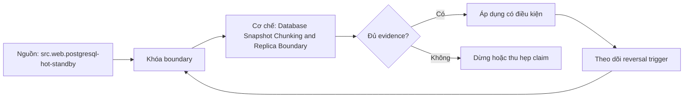

# Database Snapshot Chunking and Replica Boundary

> [!abstract] Câu hỏi trung tâm
> Chunk một database snapshot lớn và đọc replica thế nào để không trộn nhiều thời điểm?

## 1. Boundary first

A complete extract needs one source state: transaction snapshot, exported snapshot/SCN/LSN, or documented replica replay boundary. Running independent chunks at read committed can mix moments and miss/double rows under mutation. Capture boundary before chunk planning and include it in every chunk where engine supports. Otherwise document weaker semantics and reconcile/backfill.

## 2. Key-range chunking

Use indexed stable key ranges or hash/keyset partitions, not OFFSET over mutable table. Record lower/upper inclusive rules and expected ranges. Adaptive batch size responds to query time/rows/bytes while preserving boundaries. Composite/sparse keys need explicit successor predicates. Parallel chunks share snapshot or boundary; each lands with chunk ID and source boundary.

## 3. Source impact

Monitor query duration, connections, lock/wait, CPU/I/O, temp, transaction age, dead-row/version retention and replica WAL lag. Long snapshots can delay cleanup/bloat. Set statement/deadline, max concurrency and pause threshold with owner. Compare indexed range versus OFFSET using same boundary and plan. Source safety outranks extract speed.

## 4. Replica semantics

Standby data becomes visible after commit record replay; it lags primary and query snapshots see standby state. Boundary must be obtainable/validated on replica, not copied from a primary time the replica has not reached. Wait for replay position or choose replica high-water mark, then extract consistently. Standby queries can conflict with WAL replay or worsen lag; offload is not zero impact.

## 5. Mutation and deletes

Snapshot captures state at boundary but not changes after; pair with CDC handoff or subsequent increment. Bootstrap-to-log must avoid gap/overlap using engine-specific positions. Key-range retries within same snapshot are deterministic; after snapshot expiry/reconnect, restart or bounded reconcile because silently continuing on new state mixes boundaries. Hard deletes before boundary are absent by definition.

## 6. Lab

Create indexed large table with concurrent mutations. Acquire consistent boundary; run key-range chunks with adaptive sizes and ledger. Kill/retry chunks; concatenate and compare key/typed hash to source snapshot. Run OFFSET baseline and measure. Repeat on replica after waiting for measured replay boundary; introduce lag and prove primary wall-clock bound fails while replica-bound extraction matches. Enforce impact thresholds.

## 7. Ma trận kiểm chứng từng mệnh đề

Mỗi claim phải gắn source/entity boundary, exact fixture, checkpoint/input state, counterexample và independent reconciliation oracle. Connector chạy thành công hoặc API trả 2xx chưa chứng minh completeness.

### 7.1. Database-extract probe 1: snapshot/replay boundary, chunk range, source-impact metric và final oracle phải nối được

**Mệnh đề cần kiểm.** Database-extract probe 1: snapshot/replay boundary, chunk range, source-impact metric và final oracle phải nối được.

**Thiết kế phép thử cho `wiki.ingestion.database-snapshot-chunking-replica-boundary`.** Khóa source/API version, entity, grain/key, time boundary, schema, pagination/cursor configuration và failure schedule. Tạo positive, boundary và negative fixtures; thay đổi đúng một assumption. Lưu request/query, response/raw extract hash, checkpoint trước/sau, landing objects, target state và source-at-boundary oracle.

**Điều kiện chấp nhận cho `wiki.ingestion.database-snapshot-chunking-replica-boundary`.** Count, key set, typed field hash và delete state khớp contract; duplicates được giải thích và dedup có identity rõ. Observation, inference và unknown được báo riêng. Lab chưa chạy chỉ là protocol.

### 7.2. Database-extract probe 2: snapshot/replay boundary, chunk range, source-impact metric và final oracle phải nối được

**Mệnh đề cần kiểm.** Database-extract probe 2: snapshot/replay boundary, chunk range, source-impact metric và final oracle phải nối được.

**Thiết kế phép thử cho `wiki.ingestion.database-snapshot-chunking-replica-boundary`.** Khóa source/API version, entity, grain/key, time boundary, schema, pagination/cursor configuration và failure schedule. Tạo positive, boundary và negative fixtures; thay đổi đúng một assumption. Lưu request/query, response/raw extract hash, checkpoint trước/sau, landing objects, target state và source-at-boundary oracle.

**Điều kiện chấp nhận cho `wiki.ingestion.database-snapshot-chunking-replica-boundary`.** Count, key set, typed field hash và delete state khớp contract; duplicates được giải thích và dedup có identity rõ. Observation, inference và unknown được báo riêng. Lab chưa chạy chỉ là protocol.

### 7.3. Database-extract probe 3: snapshot/replay boundary, chunk range, source-impact metric và final oracle phải nối được

**Mệnh đề cần kiểm.** Database-extract probe 3: snapshot/replay boundary, chunk range, source-impact metric và final oracle phải nối được.

**Thiết kế phép thử cho `wiki.ingestion.database-snapshot-chunking-replica-boundary`.** Khóa source/API version, entity, grain/key, time boundary, schema, pagination/cursor configuration và failure schedule. Tạo positive, boundary và negative fixtures; thay đổi đúng một assumption. Lưu request/query, response/raw extract hash, checkpoint trước/sau, landing objects, target state và source-at-boundary oracle.

**Điều kiện chấp nhận cho `wiki.ingestion.database-snapshot-chunking-replica-boundary`.** Count, key set, typed field hash và delete state khớp contract; duplicates được giải thích và dedup có identity rõ. Observation, inference và unknown được báo riêng. Lab chưa chạy chỉ là protocol.

### 7.4. Database-extract probe 4: snapshot/replay boundary, chunk range, source-impact metric và final oracle phải nối được

**Mệnh đề cần kiểm.** Database-extract probe 4: snapshot/replay boundary, chunk range, source-impact metric và final oracle phải nối được.

**Thiết kế phép thử cho `wiki.ingestion.database-snapshot-chunking-replica-boundary`.** Khóa source/API version, entity, grain/key, time boundary, schema, pagination/cursor configuration và failure schedule. Tạo positive, boundary và negative fixtures; thay đổi đúng một assumption. Lưu request/query, response/raw extract hash, checkpoint trước/sau, landing objects, target state và source-at-boundary oracle.

**Điều kiện chấp nhận cho `wiki.ingestion.database-snapshot-chunking-replica-boundary`.** Count, key set, typed field hash và delete state khớp contract; duplicates được giải thích và dedup có identity rõ. Observation, inference và unknown được báo riêng. Lab chưa chạy chỉ là protocol.

### 7.5. Database-extract probe 5: snapshot/replay boundary, chunk range, source-impact metric và final oracle phải nối được

**Mệnh đề cần kiểm.** Database-extract probe 5: snapshot/replay boundary, chunk range, source-impact metric và final oracle phải nối được.

**Thiết kế phép thử cho `wiki.ingestion.database-snapshot-chunking-replica-boundary`.** Khóa source/API version, entity, grain/key, time boundary, schema, pagination/cursor configuration và failure schedule. Tạo positive, boundary và negative fixtures; thay đổi đúng một assumption. Lưu request/query, response/raw extract hash, checkpoint trước/sau, landing objects, target state và source-at-boundary oracle.

**Điều kiện chấp nhận cho `wiki.ingestion.database-snapshot-chunking-replica-boundary`.** Count, key set, typed field hash và delete state khớp contract; duplicates được giải thích và dedup có identity rõ. Observation, inference và unknown được báo riêng. Lab chưa chạy chỉ là protocol.

### 7.6. Database-extract probe 6: snapshot/replay boundary, chunk range, source-impact metric và final oracle phải nối được

**Mệnh đề cần kiểm.** Database-extract probe 6: snapshot/replay boundary, chunk range, source-impact metric và final oracle phải nối được.

**Thiết kế phép thử cho `wiki.ingestion.database-snapshot-chunking-replica-boundary`.** Khóa source/API version, entity, grain/key, time boundary, schema, pagination/cursor configuration và failure schedule. Tạo positive, boundary và negative fixtures; thay đổi đúng một assumption. Lưu request/query, response/raw extract hash, checkpoint trước/sau, landing objects, target state và source-at-boundary oracle.

**Điều kiện chấp nhận cho `wiki.ingestion.database-snapshot-chunking-replica-boundary`.** Count, key set, typed field hash và delete state khớp contract; duplicates được giải thích và dedup có identity rõ. Observation, inference và unknown được báo riêng. Lab chưa chạy chỉ là protocol.

### 7.7. Database-extract probe 7: snapshot/replay boundary, chunk range, source-impact metric và final oracle phải nối được

**Mệnh đề cần kiểm.** Database-extract probe 7: snapshot/replay boundary, chunk range, source-impact metric và final oracle phải nối được.

**Thiết kế phép thử cho `wiki.ingestion.database-snapshot-chunking-replica-boundary`.** Khóa source/API version, entity, grain/key, time boundary, schema, pagination/cursor configuration và failure schedule. Tạo positive, boundary và negative fixtures; thay đổi đúng một assumption. Lưu request/query, response/raw extract hash, checkpoint trước/sau, landing objects, target state và source-at-boundary oracle.

**Điều kiện chấp nhận cho `wiki.ingestion.database-snapshot-chunking-replica-boundary`.** Count, key set, typed field hash và delete state khớp contract; duplicates được giải thích và dedup có identity rõ. Observation, inference và unknown được báo riêng. Lab chưa chạy chỉ là protocol.

### 7.8. Database-extract probe 8: snapshot/replay boundary, chunk range, source-impact metric và final oracle phải nối được

**Mệnh đề cần kiểm.** Database-extract probe 8: snapshot/replay boundary, chunk range, source-impact metric và final oracle phải nối được.

**Thiết kế phép thử cho `wiki.ingestion.database-snapshot-chunking-replica-boundary`.** Khóa source/API version, entity, grain/key, time boundary, schema, pagination/cursor configuration và failure schedule. Tạo positive, boundary và negative fixtures; thay đổi đúng một assumption. Lưu request/query, response/raw extract hash, checkpoint trước/sau, landing objects, target state và source-at-boundary oracle.

**Điều kiện chấp nhận cho `wiki.ingestion.database-snapshot-chunking-replica-boundary`.** Count, key set, typed field hash và delete state khớp contract; duplicates được giải thích và dedup có identity rõ. Observation, inference và unknown được báo riêng. Lab chưa chạy chỉ là protocol.

### 7.9. Database-extract probe 9: snapshot/replay boundary, chunk range, source-impact metric và final oracle phải nối được

**Mệnh đề cần kiểm.** Database-extract probe 9: snapshot/replay boundary, chunk range, source-impact metric và final oracle phải nối được.

**Thiết kế phép thử cho `wiki.ingestion.database-snapshot-chunking-replica-boundary`.** Khóa source/API version, entity, grain/key, time boundary, schema, pagination/cursor configuration và failure schedule. Tạo positive, boundary và negative fixtures; thay đổi đúng một assumption. Lưu request/query, response/raw extract hash, checkpoint trước/sau, landing objects, target state và source-at-boundary oracle.

**Điều kiện chấp nhận cho `wiki.ingestion.database-snapshot-chunking-replica-boundary`.** Count, key set, typed field hash và delete state khớp contract; duplicates được giải thích và dedup có identity rõ. Observation, inference và unknown được báo riêng. Lab chưa chạy chỉ là protocol.

### 7.10. Database-extract probe 10: snapshot/replay boundary, chunk range, source-impact metric và final oracle phải nối được

**Mệnh đề cần kiểm.** Database-extract probe 10: snapshot/replay boundary, chunk range, source-impact metric và final oracle phải nối được.

**Thiết kế phép thử cho `wiki.ingestion.database-snapshot-chunking-replica-boundary`.** Khóa source/API version, entity, grain/key, time boundary, schema, pagination/cursor configuration và failure schedule. Tạo positive, boundary và negative fixtures; thay đổi đúng một assumption. Lưu request/query, response/raw extract hash, checkpoint trước/sau, landing objects, target state và source-at-boundary oracle.

**Điều kiện chấp nhận cho `wiki.ingestion.database-snapshot-chunking-replica-boundary`.** Count, key set, typed field hash và delete state khớp contract; duplicates được giải thích và dedup có identity rõ. Observation, inference và unknown được báo riêng. Lab chưa chạy chỉ là protocol.

### 7.11. Database-extract probe 11: snapshot/replay boundary, chunk range, source-impact metric và final oracle phải nối được

**Mệnh đề cần kiểm.** Database-extract probe 11: snapshot/replay boundary, chunk range, source-impact metric và final oracle phải nối được.

**Thiết kế phép thử cho `wiki.ingestion.database-snapshot-chunking-replica-boundary`.** Khóa source/API version, entity, grain/key, time boundary, schema, pagination/cursor configuration và failure schedule. Tạo positive, boundary và negative fixtures; thay đổi đúng một assumption. Lưu request/query, response/raw extract hash, checkpoint trước/sau, landing objects, target state và source-at-boundary oracle.

**Điều kiện chấp nhận cho `wiki.ingestion.database-snapshot-chunking-replica-boundary`.** Count, key set, typed field hash và delete state khớp contract; duplicates được giải thích và dedup có identity rõ. Observation, inference và unknown được báo riêng. Lab chưa chạy chỉ là protocol.

### 7.12. Database-extract probe 12: snapshot/replay boundary, chunk range, source-impact metric và final oracle phải nối được

**Mệnh đề cần kiểm.** Database-extract probe 12: snapshot/replay boundary, chunk range, source-impact metric và final oracle phải nối được.

**Thiết kế phép thử cho `wiki.ingestion.database-snapshot-chunking-replica-boundary`.** Khóa source/API version, entity, grain/key, time boundary, schema, pagination/cursor configuration và failure schedule. Tạo positive, boundary và negative fixtures; thay đổi đúng một assumption. Lưu request/query, response/raw extract hash, checkpoint trước/sau, landing objects, target state và source-at-boundary oracle.

**Điều kiện chấp nhận cho `wiki.ingestion.database-snapshot-chunking-replica-boundary`.** Count, key set, typed field hash và delete state khớp contract; duplicates được giải thích và dedup có identity rõ. Observation, inference và unknown được báo riêng. Lab chưa chạy chỉ là protocol.

### 7.13. Database-extract probe 13: snapshot/replay boundary, chunk range, source-impact metric và final oracle phải nối được

**Mệnh đề cần kiểm.** Database-extract probe 13: snapshot/replay boundary, chunk range, source-impact metric và final oracle phải nối được.

**Thiết kế phép thử cho `wiki.ingestion.database-snapshot-chunking-replica-boundary`.** Khóa source/API version, entity, grain/key, time boundary, schema, pagination/cursor configuration và failure schedule. Tạo positive, boundary và negative fixtures; thay đổi đúng một assumption. Lưu request/query, response/raw extract hash, checkpoint trước/sau, landing objects, target state và source-at-boundary oracle.

**Điều kiện chấp nhận cho `wiki.ingestion.database-snapshot-chunking-replica-boundary`.** Count, key set, typed field hash và delete state khớp contract; duplicates được giải thích và dedup có identity rõ. Observation, inference và unknown được báo riêng. Lab chưa chạy chỉ là protocol.

### 7.14. Database-extract probe 14: snapshot/replay boundary, chunk range, source-impact metric và final oracle phải nối được

**Mệnh đề cần kiểm.** Database-extract probe 14: snapshot/replay boundary, chunk range, source-impact metric và final oracle phải nối được.

**Thiết kế phép thử cho `wiki.ingestion.database-snapshot-chunking-replica-boundary`.** Khóa source/API version, entity, grain/key, time boundary, schema, pagination/cursor configuration và failure schedule. Tạo positive, boundary và negative fixtures; thay đổi đúng một assumption. Lưu request/query, response/raw extract hash, checkpoint trước/sau, landing objects, target state và source-at-boundary oracle.

**Điều kiện chấp nhận cho `wiki.ingestion.database-snapshot-chunking-replica-boundary`.** Count, key set, typed field hash và delete state khớp contract; duplicates được giải thích và dedup có identity rõ. Observation, inference và unknown được báo riêng. Lab chưa chạy chỉ là protocol.

### 7.15. Database-extract probe 15: snapshot/replay boundary, chunk range, source-impact metric và final oracle phải nối được

**Mệnh đề cần kiểm.** Database-extract probe 15: snapshot/replay boundary, chunk range, source-impact metric và final oracle phải nối được.

**Thiết kế phép thử cho `wiki.ingestion.database-snapshot-chunking-replica-boundary`.** Khóa source/API version, entity, grain/key, time boundary, schema, pagination/cursor configuration và failure schedule. Tạo positive, boundary và negative fixtures; thay đổi đúng một assumption. Lưu request/query, response/raw extract hash, checkpoint trước/sau, landing objects, target state và source-at-boundary oracle.

**Điều kiện chấp nhận cho `wiki.ingestion.database-snapshot-chunking-replica-boundary`.** Count, key set, typed field hash và delete state khớp contract; duplicates được giải thích và dedup có identity rõ. Observation, inference và unknown được báo riêng. Lab chưa chạy chỉ là protocol.

## 8. Quy trình phản biện

1. Chốt entity, grain, identity và immutable boundary.
2. Tách source fact, documentation claim và observed behavior.
3. Viết delete, retry, checkpoint và replay semantics trước code.
4. Dùng key/typed-hash reconciliation, không chỉ row count.
5. Pin version, retention, timezone, ordering và rate limits.
6. Ghi assumption bị falsify và extraction pattern thay thế.

## 9. Câu hỏi tự kiểm tra

1. Source thay đổi row/entity theo những operation nào?
2. Boundary nào định nghĩa complete?
3. Delete có xuất hiện trong interface không?
4. Cursor/order có total và immutable không?
5. Crash ở checkpoint boundary gây replay hay gap?
6. Bằng chứng nào chưa được chạy?

## 10. Giới hạn và điều chưa cho phép kết luận

- Chưa chạy mutation/pagination/watermark lab trên source thật.
- Product behavior phải pin version, retention và configuration.
- Decision matrices và failure protocols là synthesis của giáo trình.
- Note giữ trạng thái `review` tới khi chủ dự án duyệt.

## Reference
1. [[SRC-POSTGRESQL-HOT-STANDBY]]
2. [[SRC-POSTGRESQL-CONCURRENCY-CONTROL]]
3. [[SRC-KLEPPMANN-DDIA-1E]]
4. [[SRC-REIS-HOUSLEY-FUNDAMENTALS-DATA-ENGINEERING]]

## Source coverage

| Source slice | Nội dung sử dụng | Trạng thái |
|---|---|---|
| [[SRC-POSTGRESQL-HOT-STANDBY]] | Source/change/API contract hoặc engineering context | Đã đọc locator; không suy ngoài phạm vi |
| [[SRC-POSTGRESQL-CONCURRENCY-CONTROL]] | Source/change/API contract hoặc engineering context | Đã đọc locator; không suy ngoài phạm vi |
| [[SRC-KLEPPMANN-DDIA-1E]] | Source/change/API contract hoặc engineering context | Đã đọc locator; không suy ngoài phạm vi |
| [[SRC-REIS-HOUSLEY-FUNDAMENTALS-DATA-ENGINEERING]] | Source/change/API contract hoặc engineering context | Đã đọc locator; không suy ngoài phạm vi |

## Key takeaways
- Extraction pattern chỉ đúng khi source assumptions đúng.
- Completeness cần immutable boundary và reconciliation oracle.
- Retry/checkpoint ưu tiên replay có kiểm soát hơn silent gap.
- Connector không chuyển giao ownership về tính đúng.

<!-- ATOMIC-EXECUTION-CAPSULE:START -->

## Execution capsule: kiểm chứng `wiki.ingestion.database-snapshot-chunking-replica-boundary`

> [!important] Phân loại mệnh đề
> Với `wiki.ingestion.database-snapshot-chunking-replica-boundary`, sơ đồ, ví dụ và artifact về **Database Snapshot Chunking and Replica Boundary** là **synthesis để kiểm chứng**; chúng không phải trích dẫn hay case nguyên văn của nguồn.

### Sơ đồ cơ chế và điểm kiểm soát



Đọc sơ đồ `wiki.ingestion.database-snapshot-chunking-replica-boundary` từ trái sang phải: source chỉ cung cấp claim ban đầu cho **Database Snapshot Chunking and Replica Boundary**; quyết định chỉ được đi tiếp sau khi boundary, evidence và điều kiện đảo quyết định đã hiện hữu.

### Ví dụ làm việc có thể bác bỏ

**Input.** Một đội cần trả lời: Chunk một database snapshot lớn và đọc replica thế nào để không trộn nhiều thời điểm? cho một phạm vi nhỏ, có owner và deadline rõ.

**Decision.** Đội áp dụng **Database Snapshot Chunking and Replica Boundary** trên control và variant chỉ khác một assumption; expected result và hard constraints được khóa trước khi chạy.

**Outcome.** Với `wiki.ingestion.database-snapshot-chunking-replica-boundary`, nếu observation vi phạm hard constraint hoặc oracle độc lập không xác nhận **Database Snapshot Chunking and Replica Boundary**, đội thu hẹp claim hay đảo quyết định. Nếu đạt, kết luận vẫn kèm scope, version và review date; một lần thành công không được nâng thành quy luật phổ quát.

### Artifact thực thi tối thiểu

```sql
-- Verification harness for: Database Snapshot Chunking and Replica Boundary
WITH evidence AS (
    SELECT 'wiki.ingestion.database-snapshot-chunking-replica-boundary' AS concept_id,
           'boundary_declared' AS check_name, 1 AS passed
    UNION ALL
    SELECT 'wiki.ingestion.database-snapshot-chunking-replica-boundary', 'independent_oracle', 1
    UNION ALL
    SELECT 'wiki.ingestion.database-snapshot-chunking-replica-boundary', 'reversal_trigger_recorded', 1
)
SELECT concept_id,
       MIN(passed) AS all_hard_checks_pass,
       COUNT(*) AS evidence_items
FROM evidence
GROUP BY concept_id
HAVING MIN(passed) = 1;
```

Artifact của `wiki.ingestion.database-snapshot-chunking-replica-boundary` buộc người dùng ghi boundary, oracle và reversal trigger cho **Database Snapshot Chunking and Replica Boundary**. Các giá trị minh họa phải được thay bằng evidence thật trước khi dùng cho quyết định.

### Tự kiểm tra trước khi tái sử dụng

1. Bạn có thể trả lời `Chunk một database snapshot lớn và đọc replica thế nào để không trộn nhiều thời điểm?` bằng một câu mà không kéo thêm concept thứ hai không?
2. Source locator nào đỡ cho claim, và phần nào chỉ là synthesis trong note?
3. Observation nào khiến bạn dừng, thu hẹp hoặc đảo quyết định?
4. Artifact nào cho phép một reviewer độc lập tái hiện kết quả?

<!-- ATOMIC-EXECUTION-CAPSULE:END -->
