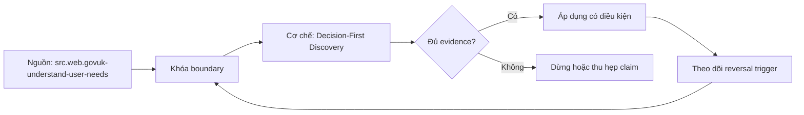

# Decision-First Discovery

> [!abstract] Câu hỏi trung tâm
> Làm sao chuyển lời nhắn mơ hồ thành decision contract gồm người quyết định, nhịp quyết định và action branches, đồng thời từ chối đúng yêu cầu không cần phân tích?

## 1. Bắt đầu từ decision event

Discovery xác định một thời điểm người hoặc hệ thống phải chọn hành động dưới uncertainty. Ghi decision statement theo động từ: allocate, approve, investigate, contact, pause, forecast. “Xem dashboard doanh thu” là solution/request, chưa phải decision. GOV.UK nhấn mạnh hiểu full context và problem thay vì solution; giáo trình mở rộng thành decision contract để dữ liệu phục vụ một hành vi quan sát được.

## 2. Bốn phần tối thiểu

Decision: lựa chọn cụ thể và alternatives. Decider: accountable role/person và quyền. Cadence/trigger: daily meeting, threshold event, case arrival hoặc planning cycle, cùng deadline. Action branches: nếu evidence ở ranges/scenarios khác nhau thì action nào đổi. Bổ sung constraints, reversibility, stakes và escalation. Nếu không có action branch khác nhau, output hiện chưa có decision value; có thể vẫn hữu ích cho learning/compliance nhưng phải đổi mục tiêu.

## 3. Ba loại request

Decision-backed analytics có action và cần evidence. Curiosity/exploration tìm hiểu để hình thành hypothesis; không giả là decision product, timebox và có learning question. Operational request muốn trigger transaction/workflow/alert, cần service/process design, SLA và control hơn dashboard. Cùng câu “cho tôi danh sách khách hàng rủi ro” có thể là analysis để phân bổ call, exploration để hiểu churn hoặc operation để tự động chặn account; xử lý khác nhau.

## 4. Phỏng vấn bằng evidence và phản ví dụ

Hỏi người dùng mô tả lần gần nhất quyết định được đưa: ai, thông tin gì, deadline, hậu quả và workaround. Dùng open questions trước, rồi hypothetical branches để test. Không hỏi “có muốn dashboard không”. Tách stated preference khỏi observed workflow; ghi assumptions cần xác minh. Include affected non-users và upstream operators, không chỉ executive requester.

## 5. Từ decision sang data contract

Map action branches tới concepts/metrics/dimensions, acceptable latency/freshness, confidence/quality và explanation needed. Cadence quyết data cutoff và delivery. Stakes quyết review, privacy và human-in-the-loop. Chỉ sau đó inventory datasets/variables. GOV.UK analytics guidance yêu cầu hỏi insight dẫn tới action nào, decision sẽ cải thiện ra sao và có giải pháp không dùng data nào; đây là gate trước build.

## 6. Từ chối hoặc chuyển hướng có trách nhiệm

Request không có changing action: hỏi mục đích learning/compliance; timebox exploration hoặc từ chối product build. Operational request: chuyển sang owner process/service với analytics hỗ trợ, không biến workflow thành dashboard. Data không đủ/maturity thấp: đề xuất evidence collection hoặc simpler descriptive tool. Từ chối nêu lý do, cost/opportunity và next evidence; không chỉ nói “không có giá trị”.

## 7. Lab năm yêu cầu

Mỗi request có interview transcript, four-part contract, classification, assumptions, non-goals, data implications và disposition. Ít nhất một no-action request phải bị từ chối/chuyển exploration; một operational request phải route đúng. Rubric chấm completeness và traceability, không chấm độ dài. Người chấm thay cadence/decider/action threshold để test contract có dẫn tới data/serving changes đúng hay không.

## 8. Ma trận kiểm chứng từng mệnh đề

Mỗi mệnh đề dưới đây cần observation, fixture hoặc artifact có thể lưu. Tên công nghệ, consensus hoặc output nhìn hợp lý không tự là bằng chứng.

### 8.1. dashboard request chưa phải decision

**Mệnh đề cần kiểm.** dashboard request chưa phải decision.

**Cách kiểm.** Phỏng vấn five requests, tạo decision contracts, phân loại analytics/exploration/operation và test changed cadence/decider/action. Một no-action request phải được từ chối hoặc chuyển hướng với evidence need. Với riêng mệnh đề này, ghi input/context, expected observation, failure signal và boundary làm kết luận không còn đúng.

**Bằng chứng đạt cho `wiki.data-product.decision-first-discovery`.** Lưu contract/decision version, fixture hoặc interview evidence, command/checklist output, reviewer và artifact hash. Nếu chưa thực hiện lab, trạng thái chỉ là protocol; không ghi thành kết quả đã quan sát.

### 8.2. decision phải có alternatives

**Mệnh đề cần kiểm.** decision phải có alternatives.

**Cách kiểm.** Phỏng vấn five requests, tạo decision contracts, phân loại analytics/exploration/operation và test changed cadence/decider/action. Một no-action request phải được từ chối hoặc chuyển hướng với evidence need. Với riêng mệnh đề này, ghi input/context, expected observation, failure signal và boundary làm kết luận không còn đúng.

**Bằng chứng đạt cho `wiki.data-product.decision-first-discovery`.** Lưu contract/decision version, fixture hoặc interview evidence, command/checklist output, reviewer và artifact hash. Nếu chưa thực hiện lab, trạng thái chỉ là protocol; không ghi thành kết quả đã quan sát.

### 8.3. decider cần authority

**Mệnh đề cần kiểm.** decider cần authority.

**Cách kiểm.** Phỏng vấn five requests, tạo decision contracts, phân loại analytics/exploration/operation và test changed cadence/decider/action. Một no-action request phải được từ chối hoặc chuyển hướng với evidence need. Với riêng mệnh đề này, ghi input/context, expected observation, failure signal và boundary làm kết luận không còn đúng.

**Bằng chứng đạt cho `wiki.data-product.decision-first-discovery`.** Lưu contract/decision version, fixture hoặc interview evidence, command/checklist output, reviewer và artifact hash. Nếu chưa thực hiện lab, trạng thái chỉ là protocol; không ghi thành kết quả đã quan sát.

### 8.4. cadence includes trigger and deadline

**Mệnh đề cần kiểm.** cadence includes trigger and deadline.

**Cách kiểm.** Phỏng vấn five requests, tạo decision contracts, phân loại analytics/exploration/operation và test changed cadence/decider/action. Một no-action request phải được từ chối hoặc chuyển hướng với evidence need. Với riêng mệnh đề này, ghi input/context, expected observation, failure signal và boundary làm kết luận không còn đúng.

**Bằng chứng đạt cho `wiki.data-product.decision-first-discovery`.** Lưu contract/decision version, fixture hoặc interview evidence, command/checklist output, reviewer và artifact hash. Nếu chưa thực hiện lab, trạng thái chỉ là protocol; không ghi thành kết quả đã quan sát.

### 8.5. action branches là strongest value test

**Mệnh đề cần kiểm.** action branches là strongest value test.

**Cách kiểm.** Phỏng vấn five requests, tạo decision contracts, phân loại analytics/exploration/operation và test changed cadence/decider/action. Một no-action request phải được từ chối hoặc chuyển hướng với evidence need. Với riêng mệnh đề này, ghi input/context, expected observation, failure signal và boundary làm kết luận không còn đúng.

**Bằng chứng đạt cho `wiki.data-product.decision-first-discovery`.** Lưu contract/decision version, fixture hoặc interview evidence, command/checklist output, reviewer và artifact hash. Nếu chưa thực hiện lab, trạng thái chỉ là protocol; không ghi thành kết quả đã quan sát.

### 8.6. no differing action means no current decision value

**Mệnh đề cần kiểm.** no differing action means no current decision value.

**Cách kiểm.** Phỏng vấn five requests, tạo decision contracts, phân loại analytics/exploration/operation và test changed cadence/decider/action. Một no-action request phải được từ chối hoặc chuyển hướng với evidence need. Với riêng mệnh đề này, ghi input/context, expected observation, failure signal và boundary làm kết luận không còn đúng.

**Bằng chứng đạt cho `wiki.data-product.decision-first-discovery`.** Lưu contract/decision version, fixture hoặc interview evidence, command/checklist output, reviewer và artifact hash. Nếu chưa thực hiện lab, trạng thái chỉ là protocol; không ghi thành kết quả đã quan sát.

### 8.7. exploration cần timebox and learning question

**Mệnh đề cần kiểm.** exploration cần timebox and learning question.

**Cách kiểm.** Phỏng vấn five requests, tạo decision contracts, phân loại analytics/exploration/operation và test changed cadence/decider/action. Một no-action request phải được từ chối hoặc chuyển hướng với evidence need. Với riêng mệnh đề này, ghi input/context, expected observation, failure signal và boundary làm kết luận không còn đúng.

**Bằng chứng đạt cho `wiki.data-product.decision-first-discovery`.** Lưu contract/decision version, fixture hoặc interview evidence, command/checklist output, reviewer và artifact hash. Nếu chưa thực hiện lab, trạng thái chỉ là protocol; không ghi thành kết quả đã quan sát.

### 8.8. operational request needs process SLA controls

**Mệnh đề cần kiểm.** operational request needs process SLA controls.

**Cách kiểm.** Phỏng vấn five requests, tạo decision contracts, phân loại analytics/exploration/operation và test changed cadence/decider/action. Một no-action request phải được từ chối hoặc chuyển hướng với evidence need. Với riêng mệnh đề này, ghi input/context, expected observation, failure signal và boundary làm kết luận không còn đúng.

**Bằng chứng đạt cho `wiki.data-product.decision-first-discovery`.** Lưu contract/decision version, fixture hoặc interview evidence, command/checklist output, reviewer và artifact hash. Nếu chưa thực hiện lab, trạng thái chỉ là protocol; không ghi thành kết quả đã quan sát.

### 8.9. last real decision reveals workflow evidence

**Mệnh đề cần kiểm.** last real decision reveals workflow evidence.

**Cách kiểm.** Phỏng vấn five requests, tạo decision contracts, phân loại analytics/exploration/operation và test changed cadence/decider/action. Một no-action request phải được từ chối hoặc chuyển hướng với evidence need. Với riêng mệnh đề này, ghi input/context, expected observation, failure signal và boundary làm kết luận không còn đúng.

**Bằng chứng đạt cho `wiki.data-product.decision-first-discovery`.** Lưu contract/decision version, fixture hoặc interview evidence, command/checklist output, reviewer và artifact hash. Nếu chưa thực hiện lab, trạng thái chỉ là protocol; không ghi thành kết quả đã quan sát.

### 8.10. open questions precede confirmation

**Mệnh đề cần kiểm.** open questions precede confirmation.

**Cách kiểm.** Phỏng vấn five requests, tạo decision contracts, phân loại analytics/exploration/operation và test changed cadence/decider/action. Một no-action request phải được từ chối hoặc chuyển hướng với evidence need. Với riêng mệnh đề này, ghi input/context, expected observation, failure signal và boundary làm kết luận không còn đúng.

**Bằng chứng đạt cho `wiki.data-product.decision-first-discovery`.** Lưu contract/decision version, fixture hoặc interview evidence, command/checklist output, reviewer và artifact hash. Nếu chưa thực hiện lab, trạng thái chỉ là protocol; không ghi thành kết quả đã quan sát.

### 8.11. affected non-users belong in discovery

**Mệnh đề cần kiểm.** affected non-users belong in discovery.

**Cách kiểm.** Phỏng vấn five requests, tạo decision contracts, phân loại analytics/exploration/operation và test changed cadence/decider/action. Một no-action request phải được từ chối hoặc chuyển hướng với evidence need. Với riêng mệnh đề này, ghi input/context, expected observation, failure signal và boundary làm kết luận không còn đúng.

**Bằng chứng đạt cho `wiki.data-product.decision-first-discovery`.** Lưu contract/decision version, fixture hoặc interview evidence, command/checklist output, reviewer và artifact hash. Nếu chưa thực hiện lab, trạng thái chỉ là protocol; không ghi thành kết quả đã quan sát.

### 8.12. data inventory follows decision contract

**Mệnh đề cần kiểm.** data inventory follows decision contract.

**Cách kiểm.** Phỏng vấn five requests, tạo decision contracts, phân loại analytics/exploration/operation và test changed cadence/decider/action. Một no-action request phải được từ chối hoặc chuyển hướng với evidence need. Với riêng mệnh đề này, ghi input/context, expected observation, failure signal và boundary làm kết luận không còn đúng.

**Bằng chứng đạt cho `wiki.data-product.decision-first-discovery`.** Lưu contract/decision version, fixture hoặc interview evidence, command/checklist output, reviewer và artifact hash. Nếu chưa thực hiện lab, trạng thái chỉ là protocol; không ghi thành kết quả đã quan sát.

### 8.13. stakes determine controls and human review

**Mệnh đề cần kiểm.** stakes determine controls and human review.

**Cách kiểm.** Phỏng vấn five requests, tạo decision contracts, phân loại analytics/exploration/operation và test changed cadence/decider/action. Một no-action request phải được từ chối hoặc chuyển hướng với evidence need. Với riêng mệnh đề này, ghi input/context, expected observation, failure signal và boundary làm kết luận không còn đúng.

**Bằng chứng đạt cho `wiki.data-product.decision-first-discovery`.** Lưu contract/decision version, fixture hoặc interview evidence, command/checklist output, reviewer và artifact hash. Nếu chưa thực hiện lab, trạng thái chỉ là protocol; không ghi thành kết quả đã quan sát.

### 8.14. non-data solution must be considered

**Mệnh đề cần kiểm.** non-data solution must be considered.

**Cách kiểm.** Phỏng vấn five requests, tạo decision contracts, phân loại analytics/exploration/operation và test changed cadence/decider/action. Một no-action request phải được từ chối hoặc chuyển hướng với evidence need. Với riêng mệnh đề này, ghi input/context, expected observation, failure signal và boundary làm kết luận không còn đúng.

**Bằng chứng đạt cho `wiki.data-product.decision-first-discovery`.** Lưu contract/decision version, fixture hoặc interview evidence, command/checklist output, reviewer và artifact hash. Nếu chưa thực hiện lab, trạng thái chỉ là protocol; không ghi thành kết quả đã quan sát.

### 8.15. refusal needs reason and next evidence

**Mệnh đề cần kiểm.** refusal needs reason and next evidence.

**Cách kiểm.** Phỏng vấn five requests, tạo decision contracts, phân loại analytics/exploration/operation và test changed cadence/decider/action. Một no-action request phải được từ chối hoặc chuyển hướng với evidence need. Với riêng mệnh đề này, ghi input/context, expected observation, failure signal và boundary làm kết luận không còn đúng.

**Bằng chứng đạt cho `wiki.data-product.decision-first-discovery`.** Lưu contract/decision version, fixture hoặc interview evidence, command/checklist output, reviewer và artifact hash. Nếu chưa thực hiện lab, trạng thái chỉ là protocol; không ghi thành kết quả đã quan sát.

## 9. Quy trình phản biện

1. Viết decision, consumer, contract và constraints trước khi chọn tool hoặc implementation.
2. Tách source fact, curriculum synthesis và organizational choice.
3. Dùng counterexample và changed constraint để kiểm quyết định có đảo đúng lúc.
4. Gắn mọi approval/certification với exact version, evidence và scope.
5. Kiểm cả valid path lẫn negative/failure path; không chỉ demo happy path.
6. Ghi limitation của telemetry, test environment và source authority.
7. Chưa có execution evidence thì giữ trạng thái `review`.

## 10. Câu hỏi tự kiểm tra

1. Decision hoặc invariant nào đang được bảo vệ?
2. Evidence nào độc lập với implementation đang được đánh giá?
3. Điều kiện nào làm lựa chọn hiện tại phải đảo?
4. Ai có quyền quyết nghĩa, ai triển khai và ai giữ quy trình?
5. Thay đổi nào ảnh hưởng consumer dù interface vẫn chạy?
6. Failure mode nào còn chưa có automated detector?

## 11. Giới hạn và điều chưa cho phép kết luận

- Chưa chạy các lab, migration, workload benchmark hoặc fault-injection; note mô tả protocol và expected evidence.
- Tài liệu sản phẩm web được kiểm ngày 2026-10-02; feature, syntax, license và integration có thể đổi.
- Các scorecard, lifecycle gates, failure matrix và decision contract là curriculum synthesis từ nguồn đã nêu; không gán nguyên văn cho một tác giả.
- Ví dụ tổ chức không thay discovery thực tế, threat model, cost model hoặc owner approval.
- Note giữ trạng thái `review` cho tới khi chủ dự án duyệt semantic meaning.

## Reference
1. [[SRC-GOVUK-UNDERSTAND-USER-NEEDS]]
2. [[SRC-GOVUK-DATA-ANALYTICS-TOOLS-GUIDANCE]]
3. [[SRC-SOMMERVILLE-SOFTWARE-ENGINEERING-10E]]
4. [[SRC-REIS-HOUSLEY-FUNDAMENTALS-DATA-ENGINEERING]]

## Source coverage

| Source slice | Nội dung sử dụng | Trạng thái |
|---|---|---|
| [[SRC-GOVUK-UNDERSTAND-USER-NEEDS]] | Khái niệm, cơ chế hoặc decision boundary liên quan | Đã đọc locator được ghi trong source record; không suy ngoài phạm vi |
| [[SRC-GOVUK-DATA-ANALYTICS-TOOLS-GUIDANCE]] | Khái niệm, cơ chế hoặc decision boundary liên quan | Đã đọc locator được ghi trong source record; không suy ngoài phạm vi |
| [[SRC-SOMMERVILLE-SOFTWARE-ENGINEERING-10E]] | Khái niệm, cơ chế hoặc decision boundary liên quan | Đã đọc locator được ghi trong source record; không suy ngoài phạm vi |
| [[SRC-REIS-HOUSLEY-FUNDAMENTALS-DATA-ENGINEERING]] | Khái niệm, cơ chế hoặc decision boundary liên quan | Đã đọc locator được ghi trong source record; không suy ngoài phạm vi |

## Key takeaways
- Chọn kiến trúc và data product từ decision/constraints, không từ độ mới của công nghệ.
- Metric governance cần versioned evidence, lifecycle gates và owner có quyền rõ.
- Failure matrix chỉ hữu dụng khi mỗi dòng có detector hoặc control kiểm được.
- Capstone là hồ sơ bằng chứng tích hợp, không phải bộ YAML hay dashboard trình diễn.
- Discovery phải cho phép kết luận không xây analytics product.

<!-- ATOMIC-EXECUTION-CAPSULE:START -->

## Execution capsule — kiểm chứng `wiki.data-product.decision-first-discovery`

> [!important] Phân loại mệnh đề
> Với `wiki.data-product.decision-first-discovery`, sơ đồ, ví dụ và artifact về **Decision-First Discovery** là **synthesis để kiểm chứng**; chúng không phải trích dẫn hay case nguyên văn của nguồn.

### Sơ đồ cơ chế và điểm kiểm soát



Đọc sơ đồ `wiki.data-product.decision-first-discovery` từ trái sang phải: source chỉ cung cấp claim ban đầu cho **Decision-First Discovery**; quyết định chỉ được đi tiếp sau khi boundary, evidence và điều kiện đảo quyết định đã hiện hữu.

### Artifact thực thi tối thiểu

```sql
-- Verification harness for: Decision-First Discovery
WITH evidence AS (
    SELECT 'wiki.data-product.decision-first-discovery' AS concept_id,
           'boundary_declared' AS check_name, 1 AS passed
    UNION ALL
    SELECT 'wiki.data-product.decision-first-discovery', 'independent_oracle', 1
    UNION ALL
    SELECT 'wiki.data-product.decision-first-discovery', 'reversal_trigger_recorded', 1
)
SELECT concept_id,
       MIN(passed) AS all_hard_checks_pass,
       COUNT(*) AS evidence_items
FROM evidence
GROUP BY concept_id
HAVING MIN(passed) = 1;
```

Artifact của `wiki.data-product.decision-first-discovery` buộc người dùng ghi boundary, oracle và reversal trigger cho **Decision-First Discovery**. Các giá trị minh họa phải được thay bằng evidence thật trước khi dùng cho quyết định.

### Tự kiểm tra trước khi tái sử dụng

1. Bạn có thể trả lời `Làm sao chuyển lời nhắn mơ hồ thành decision contract gồm người quyết định, nhịp quyết định và action branches, đồng thời từ chối đúng yêu cầu không cần phân tích?` bằng một câu mà không kéo thêm concept thứ hai không?
2. Source locator nào đỡ cho claim, và phần nào chỉ là synthesis trong note?
3. Observation nào khiến bạn dừng, thu hẹp hoặc đảo quyết định?
4. Artifact nào cho phép một reviewer độc lập tái hiện kết quả?

<!-- ATOMIC-EXECUTION-CAPSULE:END -->
