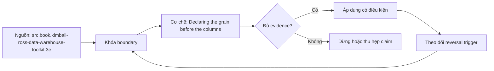

# Declaring the grain before the columns

> [!abstract] Câu hỏi trung tâm
> Phát biểu grain phải mô tả điều gì, kiểm bằng dữ liệu ra sao, và vì sao uniqueness test không tự chứng minh ngữ nghĩa của một row?

## 1. Grain là hợp đồng ngữ nghĩa

Grain trả lời một row đại diện chính xác cho business event, entity state hay periodic observation nào. Câu phải có đơn vị, phạm vi và thời gian: một order line khi đặt, một account ở cuối ngày, hay một lần chuyển trạng thái. Tên bảng và primary key chỉ là dấu hiệu kỹ thuật; chúng không thay tuyên bố ngữ nghĩa được business owner xác nhận.

## 2. Ba grain gần nhau nhưng khác

Order, order line và order-line status event tạo ba số dòng, key và measures khác nhau. Trộn order header amount vào line grain gây nhân tiền; ép status history vào một current-state row làm mất lịch sử. Grain mịn hỗ trợ drill-down nhưng tăng volume; grain tổng hợp giảm chi tiết và không thể phục hồi dimensions đã bỏ.

## 3. Kiểm bằng dữ liệu

Lập candidate business key từ grain, chạy group-by/having count lớn hơn một, kiểm null, time range và source duplicates. Duplicate bác bỏ key/grain hiện tại nhưng zero duplicate chưa chứng minh đúng: sample có thể chưa chứa ca biên. Cần profiling theo toàn kỳ, requirement interview và test cases như split shipment, return, correction.

## 4. Grain khác key

Grain là ý nghĩa; key là cách nhận dạng row ở grain đó. Nhiều physical keys có thể thực thi cùng grain, và surrogate key unique vẫn không chặn hai rows cùng business grain. Vì vậy lưu/enforce business key hoặc temporal uniqueness phù hợp; document exceptions có lý do thay vì nuốt bằng DISTINCT.

## 5. Join đổi grain

One-to-many join có thể nhân rows và measures; many-to-many bridge cần allocation hoặc impact semantics. Trước join ghi input grains, output grain và cardinality assertion. Sau join kiểm row count, distinct business keys, control totals và unmatched rates. Aggregate trước hoặc sau join chỉ hợp lệ nếu phép biến đổi bảo toàn measure ở grain mục tiêu.

## 6. Ma trận kiểm chứng từng mệnh đề

Mỗi mệnh đề phải được chuyển thành invariant, fixture và phép đối chiếu có thể chạy lại. Sơ đồ đẹp hoặc một truy vấn trả về kết quả không lỗi không tự chứng minh mô hình đúng ngữ nghĩa.

### 6.1. một order khác một order line về row count và measures

**Mệnh đề cần kiểm.** một order khác một order line về row count và measures. **Thiết kế phép kiểm.** Dựng fixture chứa trường hợp thường, split, return, correction và duplicate. Viết grain thành một câu, suy ra candidate business key, rồi đối chiếu row count, duplicate groups, null rate và control total trước–sau join. Kết quả đạt phải chỉ ra được phản ví dụ nào bác bỏ grain; không dùng việc không thấy duplicate trong sample để tuyên bố grain đúng. **Hồ sơ cần lưu.** Grain/model/metric contract, dữ liệu seed, SQL hoặc notebook, kết quả thô, control totals và giải thích ca biên. Nếu phép kiểm chỉ xác nhận cấu trúc mà không xác nhận semantics, kết luận phải ghi rõ giới hạn đó.

### 6.2. status event grain cần event sequence hoặc timestamp đủ phân biệt

**Mệnh đề cần kiểm.** status event grain cần event sequence hoặc timestamp đủ phân biệt. **Thiết kế phép kiểm.** Dựng fixture chứa trường hợp thường, split, return, correction và duplicate. Viết grain thành một câu, suy ra candidate business key, rồi đối chiếu row count, duplicate groups, null rate và control total trước–sau join. Kết quả đạt phải chỉ ra được phản ví dụ nào bác bỏ grain; không dùng việc không thấy duplicate trong sample để tuyên bố grain đúng. **Hồ sơ cần lưu.** Grain/model/metric contract, dữ liệu seed, SQL hoặc notebook, kết quả thô, control totals và giải thích ca biên. Nếu phép kiểm chỉ xác nhận cấu trúc mà không xác nhận semantics, kết luận phải ghi rõ giới hạn đó.

### 6.3. snapshot grain phải nêu kỳ và timezone/cutoff

**Mệnh đề cần kiểm.** snapshot grain phải nêu kỳ và timezone/cutoff. **Thiết kế phép kiểm.** Dựng fixture chứa trường hợp thường, split, return, correction và duplicate. Viết grain thành một câu, suy ra candidate business key, rồi đối chiếu row count, duplicate groups, null rate và control total trước–sau join. Kết quả đạt phải chỉ ra được phản ví dụ nào bác bỏ grain; không dùng việc không thấy duplicate trong sample để tuyên bố grain đúng. **Hồ sơ cần lưu.** Grain/model/metric contract, dữ liệu seed, SQL hoặc notebook, kết quả thô, control totals và giải thích ca biên. Nếu phép kiểm chỉ xác nhận cấu trúc mà không xác nhận semantics, kết luận phải ghi rõ giới hạn đó.

### 6.4. candidate key không null nhưng vẫn có thể sai nghĩa

**Mệnh đề cần kiểm.** candidate key không null nhưng vẫn có thể sai nghĩa. **Thiết kế phép kiểm.** Dựng fixture chứa trường hợp thường, split, return, correction và duplicate. Viết grain thành một câu, suy ra candidate business key, rồi đối chiếu row count, duplicate groups, null rate và control total trước–sau join. Kết quả đạt phải chỉ ra được phản ví dụ nào bác bỏ grain; không dùng việc không thấy duplicate trong sample để tuyên bố grain đúng. **Hồ sơ cần lưu.** Grain/model/metric contract, dữ liệu seed, SQL hoặc notebook, kết quả thô, control totals và giải thích ca biên. Nếu phép kiểm chỉ xác nhận cấu trúc mà không xác nhận semantics, kết luận phải ghi rõ giới hạn đó.

### 6.5. zero duplicates trên sample không chứng minh uniqueness dài hạn

**Mệnh đề cần kiểm.** zero duplicates trên sample không chứng minh uniqueness dài hạn. **Thiết kế phép kiểm.** Dựng fixture chứa trường hợp thường, split, return, correction và duplicate. Viết grain thành một câu, suy ra candidate business key, rồi đối chiếu row count, duplicate groups, null rate và control total trước–sau join. Kết quả đạt phải chỉ ra được phản ví dụ nào bác bỏ grain; không dùng việc không thấy duplicate trong sample để tuyên bố grain đúng. **Hồ sơ cần lưu.** Grain/model/metric contract, dữ liệu seed, SQL hoặc notebook, kết quả thô, control totals và giải thích ca biên. Nếu phép kiểm chỉ xác nhận cấu trúc mà không xác nhận semantics, kết luận phải ghi rõ giới hạn đó.

### 6.6. surrogate primary key có thể che duplicate business grain

**Mệnh đề cần kiểm.** surrogate primary key có thể che duplicate business grain. **Thiết kế phép kiểm.** Dựng fixture chứa trường hợp thường, split, return, correction và duplicate. Viết grain thành một câu, suy ra candidate business key, rồi đối chiếu row count, duplicate groups, null rate và control total trước–sau join. Kết quả đạt phải chỉ ra được phản ví dụ nào bác bỏ grain; không dùng việc không thấy duplicate trong sample để tuyên bố grain đúng. **Hồ sơ cần lưu.** Grain/model/metric contract, dữ liệu seed, SQL hoặc notebook, kết quả thô, control totals và giải thích ca biên. Nếu phép kiểm chỉ xác nhận cấu trúc mà không xác nhận semantics, kết luận phải ghi rõ giới hạn đó.

### 6.7. DISTINCT che join explosion nhưng không sửa model

**Mệnh đề cần kiểm.** DISTINCT che join explosion nhưng không sửa model. **Thiết kế phép kiểm.** Dựng fixture chứa trường hợp thường, split, return, correction và duplicate. Viết grain thành một câu, suy ra candidate business key, rồi đối chiếu row count, duplicate groups, null rate và control total trước–sau join. Kết quả đạt phải chỉ ra được phản ví dụ nào bác bỏ grain; không dùng việc không thấy duplicate trong sample để tuyên bố grain đúng. **Hồ sơ cần lưu.** Grain/model/metric contract, dữ liệu seed, SQL hoặc notebook, kết quả thô, control totals và giải thích ca biên. Nếu phép kiểm chỉ xác nhận cấu trúc mà không xác nhận semantics, kết luận phải ghi rõ giới hạn đó.

### 6.8. header amount lặp trên line grain gây double count

**Mệnh đề cần kiểm.** header amount lặp trên line grain gây double count. **Thiết kế phép kiểm.** Dựng fixture chứa trường hợp thường, split, return, correction và duplicate. Viết grain thành một câu, suy ra candidate business key, rồi đối chiếu row count, duplicate groups, null rate và control total trước–sau join. Kết quả đạt phải chỉ ra được phản ví dụ nào bác bỏ grain; không dùng việc không thấy duplicate trong sample để tuyên bố grain đúng. **Hồ sơ cần lưu.** Grain/model/metric contract, dữ liệu seed, SQL hoặc notebook, kết quả thô, control totals và giải thích ca biên. Nếu phép kiểm chỉ xác nhận cấu trúc mà không xác nhận semantics, kết luận phải ghi rõ giới hạn đó.

### 6.9. many-to-many join cần allocation hoặc impact-only semantics

**Mệnh đề cần kiểm.** many-to-many join cần allocation hoặc impact-only semantics. **Thiết kế phép kiểm.** Dựng fixture chứa trường hợp thường, split, return, correction và duplicate. Viết grain thành một câu, suy ra candidate business key, rồi đối chiếu row count, duplicate groups, null rate và control total trước–sau join. Kết quả đạt phải chỉ ra được phản ví dụ nào bác bỏ grain; không dùng việc không thấy duplicate trong sample để tuyên bố grain đúng. **Hồ sơ cần lưu.** Grain/model/metric contract, dữ liệu seed, SQL hoặc notebook, kết quả thô, control totals và giải thích ca biên. Nếu phép kiểm chỉ xác nhận cấu trúc mà không xác nhận semantics, kết luận phải ghi rõ giới hạn đó.

### 6.10. late correction có thể tạo version chứ không overwrite

**Mệnh đề cần kiểm.** late correction có thể tạo version chứ không overwrite. **Thiết kế phép kiểm.** Dựng fixture chứa trường hợp thường, split, return, correction và duplicate. Viết grain thành một câu, suy ra candidate business key, rồi đối chiếu row count, duplicate groups, null rate và control total trước–sau join. Kết quả đạt phải chỉ ra được phản ví dụ nào bác bỏ grain; không dùng việc không thấy duplicate trong sample để tuyên bố grain đúng. **Hồ sơ cần lưu.** Grain/model/metric contract, dữ liệu seed, SQL hoặc notebook, kết quả thô, control totals và giải thích ca biên. Nếu phép kiểm chỉ xác nhận cấu trúc mà không xác nhận semantics, kết luận phải ghi rõ giới hạn đó.

### 6.11. cancelled event có thuộc grain hay filter phải ghi rõ

**Mệnh đề cần kiểm.** cancelled event có thuộc grain hay filter phải ghi rõ. **Thiết kế phép kiểm.** Dựng fixture chứa trường hợp thường, split, return, correction và duplicate. Viết grain thành một câu, suy ra candidate business key, rồi đối chiếu row count, duplicate groups, null rate và control total trước–sau join. Kết quả đạt phải chỉ ra được phản ví dụ nào bác bỏ grain; không dùng việc không thấy duplicate trong sample để tuyên bố grain đúng. **Hồ sơ cần lưu.** Grain/model/metric contract, dữ liệu seed, SQL hoặc notebook, kết quả thô, control totals và giải thích ca biên. Nếu phép kiểm chỉ xác nhận cấu trúc mà không xác nhận semantics, kết luận phải ghi rõ giới hạn đó.

### 6.12. unknown member là row có semantics chứ không phải null tuỳ tiện

**Mệnh đề cần kiểm.** unknown member là row có semantics chứ không phải null tuỳ tiện. **Thiết kế phép kiểm.** Dựng fixture chứa trường hợp thường, split, return, correction và duplicate. Viết grain thành một câu, suy ra candidate business key, rồi đối chiếu row count, duplicate groups, null rate và control total trước–sau join. Kết quả đạt phải chỉ ra được phản ví dụ nào bác bỏ grain; không dùng việc không thấy duplicate trong sample để tuyên bố grain đúng. **Hồ sơ cần lưu.** Grain/model/metric contract, dữ liệu seed, SQL hoặc notebook, kết quả thô, control totals và giải thích ca biên. Nếu phép kiểm chỉ xác nhận cấu trúc mà không xác nhận semantics, kết luận phải ghi rõ giới hạn đó.

### 6.13. grain declaration phải được người thứ hai paraphrase cùng nghĩa

**Mệnh đề cần kiểm.** grain declaration phải được người thứ hai paraphrase cùng nghĩa. **Thiết kế phép kiểm.** Dựng fixture chứa trường hợp thường, split, return, correction và duplicate. Viết grain thành một câu, suy ra candidate business key, rồi đối chiếu row count, duplicate groups, null rate và control total trước–sau join. Kết quả đạt phải chỉ ra được phản ví dụ nào bác bỏ grain; không dùng việc không thấy duplicate trong sample để tuyên bố grain đúng. **Hồ sơ cần lưu.** Grain/model/metric contract, dữ liệu seed, SQL hoặc notebook, kết quả thô, control totals và giải thích ca biên. Nếu phép kiểm chỉ xác nhận cấu trúc mà không xác nhận semantics, kết luận phải ghi rõ giới hạn đó.

### 6.14. profiling phải bao phủ full business cycle

**Mệnh đề cần kiểm.** profiling phải bao phủ full business cycle. **Thiết kế phép kiểm.** Dựng fixture chứa trường hợp thường, split, return, correction và duplicate. Viết grain thành một câu, suy ra candidate business key, rồi đối chiếu row count, duplicate groups, null rate và control total trước–sau join. Kết quả đạt phải chỉ ra được phản ví dụ nào bác bỏ grain; không dùng việc không thấy duplicate trong sample để tuyên bố grain đúng. **Hồ sơ cần lưu.** Grain/model/metric contract, dữ liệu seed, SQL hoặc notebook, kết quả thô, control totals và giải thích ca biên. Nếu phép kiểm chỉ xác nhận cấu trúc mà không xác nhận semantics, kết luận phải ghi rõ giới hạn đó.

### 6.15. mỗi measure phải kiểm có đúng một value tại grain

**Mệnh đề cần kiểm.** mỗi measure phải kiểm có đúng một value tại grain. **Thiết kế phép kiểm.** Dựng fixture chứa trường hợp thường, split, return, correction và duplicate. Viết grain thành một câu, suy ra candidate business key, rồi đối chiếu row count, duplicate groups, null rate và control total trước–sau join. Kết quả đạt phải chỉ ra được phản ví dụ nào bác bỏ grain; không dùng việc không thấy duplicate trong sample để tuyên bố grain đúng. **Hồ sơ cần lưu.** Grain/model/metric contract, dữ liệu seed, SQL hoặc notebook, kết quả thô, control totals và giải thích ca biên. Nếu phép kiểm chỉ xác nhận cấu trúc mà không xác nhận semantics, kết luận phải ghi rõ giới hạn đó.

## 7. Quy trình phản biện mô hình

1. Viết business question, grain, identity, time semantics và invariant trước khi vẽ bảng.
2. Chỉ ra owner của định nghĩa và artifact nào là canonical.
3. Tách source fact, quyết định thiết kế và curriculum synthesis; không gán suy luận cho sách.
4. Dựng ca biên tối thiểu: duplicate, null, late correction, code reuse, many-to-many hoặc missing period tuỳ bài.
5. Đo row count, distinct business key, unmatched rate và control totals trước–sau mỗi phép biến đổi.
6. Thử replay/backfill và đổi cutoff; thiết kế không tái chạy được chưa đủ bằng chứng để vận hành.
7. Lưu quyết định, phản ví dụ và giới hạn; không xoá failed run vì nó là bằng chứng của failure boundary.

## 8. Câu hỏi tự kiểm tra

1. Row đại diện điều gì, được nhận dạng bằng gì và có hiệu lực khi nào?
2. Ca biên nhỏ nhất nào làm thiết kế cho ra số sai nhưng SQL vẫn hợp lệ?
3. Constraint/test nào bắt lỗi cấu trúc, và phần ngữ nghĩa nào vẫn cần owner xác nhận?
4. Late data, correction, replay và backfill làm model thay đổi ra sao?
5. Phần nào đến trực tiếp từ nguồn; phần nào là tổng hợp của giáo trình?
6. Artifact và phép kiểm nào cho phép người khác bác bỏ kết luận?

## 9. Giới hạn và điều chưa cho phép kết luận

- Chưa chạy profiling, merge/backfill hay reconciliation lab; các phép kiểm trong note là giao thức cần thực thi, không phải kết quả đã đo.
- Sample không có duplicate không chứng minh business uniqueness; schema hợp lệ không chứng minh đúng grain.
- HCMUT System Modeling cung cấp khung abstraction/perspective; phép ánh xạ conceptual–logical–physical trong bài là synthesis có ghi nhãn.
- DDIA và Silberschatz cung cấp ranh giới data model/database design; taxonomy dimensional chi tiết lấy Kimball–Ross làm nguồn chính.
- Không suy performance, dung lượng, threshold hoặc production readiness nếu chưa đo trên workload và engine mục tiêu.

## Reference
1. [[SRC-KIMBALL-ROSS-DW-TOOLKIT-3E]]
2. [[SRC-HCMUT-ENTITY-RELATIONSHIP-MODEL]]
3. [[SRC-SILBERSCHATZ-DATABASE-SYSTEM-CONCEPTS-7E]]

## Source coverage

| Source slice | Nội dung sử dụng | Trạng thái |
|---|---|---|
| [[SRC-KIMBALL-ROSS-DW-TOOLKIT-3E]] | Khái niệm, ranh giới và phản ví dụ liên quan đến bài | Đã đọc phạm vi có locator; không suy nội dung ngoài phạm vi |
| [[SRC-HCMUT-ENTITY-RELATIONSHIP-MODEL]] | Khái niệm, ranh giới và phản ví dụ liên quan đến bài | Đã đọc phạm vi có locator; không suy nội dung ngoài phạm vi |
| [[SRC-SILBERSCHATZ-DATABASE-SYSTEM-CONCEPTS-7E]] | Khái niệm, ranh giới và phản ví dụ liên quan đến bài | Đã đọc phạm vi có locator; không suy nội dung ngoài phạm vi |

## Key takeaways
- Bắt đầu từ business question, grain, identity, time và invariant; cột là hệ quả, không phải điểm xuất phát.
- Tách ngữ nghĩa, logical constraints và physical implementation để thay đổi có traceability.
- Key duy nhất, SQL chạy được hoặc diagram đẹp không tự chứng minh mô hình đúng.
- Mọi measure cần aggregation contract theo grain, dimension, unit, cutoff và late-data policy.
- Chưa chạy phép kiểm thì note là tài liệu học thuật đã truy nguồn, không phải chứng nhận production.

<!-- ATOMIC-EXECUTION-CAPSULE:START -->

## Execution capsule — kiểm chứng `wiki.data-modeling.declaring-grain`

> [!important] Phân loại mệnh đề
> Với `wiki.data-modeling.declaring-grain`, sơ đồ, ví dụ và artifact về **Declaring the grain before the columns** là **synthesis để kiểm chứng**; chúng không phải trích dẫn hay case nguyên văn của nguồn.

### Sơ đồ cơ chế và điểm kiểm soát



Đọc sơ đồ `wiki.data-modeling.declaring-grain` từ trái sang phải: source chỉ cung cấp claim ban đầu cho **Declaring the grain before the columns**; quyết định chỉ được đi tiếp sau khi boundary, evidence và điều kiện đảo quyết định đã hiện hữu.

### Artifact thực thi tối thiểu

```sql
-- Verification harness for: Declaring the grain before the columns
WITH evidence AS (
    SELECT 'wiki.data-modeling.declaring-grain' AS concept_id,
           'boundary_declared' AS check_name, 1 AS passed
    UNION ALL
    SELECT 'wiki.data-modeling.declaring-grain', 'independent_oracle', 1
    UNION ALL
    SELECT 'wiki.data-modeling.declaring-grain', 'reversal_trigger_recorded', 1
)
SELECT concept_id,
       MIN(passed) AS all_hard_checks_pass,
       COUNT(*) AS evidence_items
FROM evidence
GROUP BY concept_id
HAVING MIN(passed) = 1;
```

Artifact của `wiki.data-modeling.declaring-grain` buộc người dùng ghi boundary, oracle và reversal trigger cho **Declaring the grain before the columns**. Các giá trị minh họa phải được thay bằng evidence thật trước khi dùng cho quyết định.

### Tự kiểm tra trước khi tái sử dụng

1. Bạn có thể trả lời `Phát biểu grain phải mô tả điều gì, kiểm bằng dữ liệu ra sao, và vì sao uniqueness test không tự chứng minh ngữ nghĩa của một row?` bằng một câu mà không kéo thêm concept thứ hai không?
2. Source locator nào đỡ cho claim, và phần nào chỉ là synthesis trong note?
3. Observation nào khiến bạn dừng, thu hẹp hoặc đảo quyết định?
4. Artifact nào cho phép một reviewer độc lập tái hiện kết quả?

<!-- ATOMIC-EXECUTION-CAPSULE:END -->
