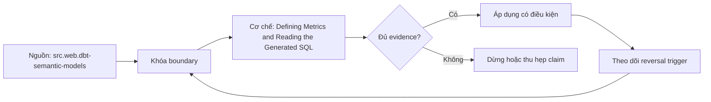

# Defining Metrics and Reading the Generated SQL

> [!abstract] Câu hỏi trung tâm
> Generated SQL cần được đọc theo checklist nào để chứng minh metric implementation khớp contract, graph và aggregation semantics?

## 1. Generated SQL là artifact kiểm toán

Declarative config chuyển complexity sang compiler, không loại bỏ nghĩa vụ kiểm. Generated SQL cho thấy engine đã hiểu graph/filter/time/aggregation ra sao. Nó là evidence theo exact config/tool version, không phải source of truth thay contract. Mỗi review lưu command, metric/dimensions, semantic manifest fingerprint, compiled SQL hash và warehouse dialect.

## 2. Điểm soi một: population

Tìm base relations, WHERE predicates, status/exclusion, join-induced filtering và time range. Intrinsic filters phải xuất hiện đúng scope; user filters không được vô tình trở thành permanent. Left join bị predicate ở WHERE có thể thành inner behavior. Row-level security/policy có thể thay population ngoài SQL text, nên environment/access context phải được ghi khi đối soát.

## 3. Điểm soi hai: join path và grain

Liệt kê joins theo order, keys, roles, join type và expected cardinality. Xác nhận selected entity path đúng business role, không chasm/fanout. Tìm pre-aggregation CTEs và output grain của từng stage. Count rows/distinct base keys sau edges trên fixture. Một SQL dài không mặc nhiên sai; một SQL ngắn không chứng minh correct path.

## 4. Điểm soi ba: aggregation

Với simple sum/count, xem grouping và null/empty behavior. Ratio phải aggregate numerator/denominator ở target grain rồi divide, không average precomputed ratios. Derived inputs phải align grain/filter/time. Cumulative cần time spine/window boundaries và re-aggregation behavior. Distinct/percentile/last-value cần operator/state đúng; final GROUP BY không sửa multiplication upstream.

## 5. Điểm soi bốn: time và filters

Xác nhận timestamp role, timezone conversion, date truncation, calendar join, start/end inclusivity, fiscal grain và missing periods. Cumulative query phải densify khi contract yêu cầu. Offset/derived periods phải đúng policy leap-day/partial period. Filter pushdown có thể đổi performance nhưng không được đổi semantics qua outer join hoặc window boundary.

## 6. Tìm injected defect bằng SQL

Tạo một thay đổi nhỏ: wrong entity role, missing intrinsic filter, SUM balance over time hoặc numerator filter mismatch. Không xem config diff; reviewer chỉ nhận contract và compiled SQL. Ghi line/CTE chứa divergence, predicted impact và fixture khiến impact quan sát được. Sau khi sửa, compiled diff phải thu hẹp đúng đoạn và oracle output trở lại đúng.

## 7. Execution plan là bước khác

MetricFlow compile/dataflow plan giải thích logical construction; warehouse EXPLAIN/ANALYZE cho physical operators, estimates, actual rows, buffers/bytes/shuffle tùy engine. Đọc plan của metric tốn nhất để tìm fanout rows, large scans, spill và poor filter pruning. Performance fix không được đổi contract; semantic parity test chạy trước/sau. Không chạy ANALYZE trên production query đắt nếu chưa có authority/budget.

## 8. Hồ sơ review bốn metrics

Mỗi simple, ratio, derived và cumulative metric có checklist 4 điểm, compiled SQL, oracle values và plan snapshot nếu an toàn. Review matrix có pass/fail/evidence locator, không dùng looks good. Tool command hiện hành có `--compile` hoặc `--explain` tùy engine/version; dùng help/docs đúng environment thay vì copy command cũ.

## 8. Ma trận kiểm chứng từng mệnh đề

Mọi mệnh đề dưới đây cần fixture, invariant, independent oracle và output lưu được. Compile thành công hoặc con số nhìn hợp lý không đủ làm bằng chứng.

### 8.1. compiled SQL phải gắn config/version fingerprint

**Mệnh đề cần kiểm.** compiled SQL phải gắn config/version fingerprint.

**Cách kiểm.** Compile four metric types, review population/path/aggregation/time-filter checklist và inject one hidden config defect. So compiled SQL/semantic result before-after; inspect warehouse plan only in safe bounded environment. Với mệnh đề này, ghi data shape gây lỗi, expected result và failure signal. Không dùng generated query làm oracle cho chính nó.

**Bằng chứng đạt cho `wiki.semantic-layer.read-generated-sql`.** Lưu contract/graph/config version, seed snapshot, command/SQL, raw output, row/multiplicity ledger và semantic diff. Nếu chưa chạy tool/lab, trạng thái chỉ là test protocol.

### 8.2. population filters phải đúng scope

**Mệnh đề cần kiểm.** population filters phải đúng scope.

**Cách kiểm.** Compile four metric types, review population/path/aggregation/time-filter checklist và inject one hidden config defect. So compiled SQL/semantic result before-after; inspect warehouse plan only in safe bounded environment. Với mệnh đề này, ghi data shape gây lỗi, expected result và failure signal. Không dùng generated query làm oracle cho chính nó.

**Bằng chứng đạt cho `wiki.semantic-layer.read-generated-sql`.** Lưu contract/graph/config version, seed snapshot, command/SQL, raw output, row/multiplicity ledger và semantic diff. Nếu chưa chạy tool/lab, trạng thái chỉ là test protocol.

### 8.3. outer join predicate placement có thể làm mất rows

**Mệnh đề cần kiểm.** outer join predicate placement có thể làm mất rows.

**Cách kiểm.** Compile four metric types, review population/path/aggregation/time-filter checklist và inject one hidden config defect. So compiled SQL/semantic result before-after; inspect warehouse plan only in safe bounded environment. Với mệnh đề này, ghi data shape gây lỗi, expected result và failure signal. Không dùng generated query làm oracle cho chính nó.

**Bằng chứng đạt cho `wiki.semantic-layer.read-generated-sql`.** Lưu contract/graph/config version, seed snapshot, command/SQL, raw output, row/multiplicity ledger và semantic diff. Nếu chưa chạy tool/lab, trạng thái chỉ là test protocol.

### 8.4. selected join path phải đúng entity role

**Mệnh đề cần kiểm.** selected join path phải đúng entity role.

**Cách kiểm.** Compile four metric types, review population/path/aggregation/time-filter checklist và inject one hidden config defect. So compiled SQL/semantic result before-after; inspect warehouse plan only in safe bounded environment. Với mệnh đề này, ghi data shape gây lỗi, expected result và failure signal. Không dùng generated query làm oracle cho chính nó.

**Bằng chứng đạt cho `wiki.semantic-layer.read-generated-sql`.** Lưu contract/graph/config version, seed snapshot, command/SQL, raw output, row/multiplicity ledger và semantic diff. Nếu chưa chạy tool/lab, trạng thái chỉ là test protocol.

### 8.5. preaggregation stage phải có declared grain

**Mệnh đề cần kiểm.** preaggregation stage phải có declared grain.

**Cách kiểm.** Compile four metric types, review population/path/aggregation/time-filter checklist và inject one hidden config defect. So compiled SQL/semantic result before-after; inspect warehouse plan only in safe bounded environment. Với mệnh đề này, ghi data shape gây lỗi, expected result và failure signal. Không dùng generated query làm oracle cho chính nó.

**Bằng chứng đạt cho `wiki.semantic-layer.read-generated-sql`.** Lưu contract/graph/config version, seed snapshot, command/SQL, raw output, row/multiplicity ledger và semantic diff. Nếu chưa chạy tool/lab, trạng thái chỉ là test protocol.

### 8.6. ratio aggregate components before division

**Mệnh đề cần kiểm.** ratio aggregate components before division.

**Cách kiểm.** Compile four metric types, review population/path/aggregation/time-filter checklist và inject one hidden config defect. So compiled SQL/semantic result before-after; inspect warehouse plan only in safe bounded environment. Với mệnh đề này, ghi data shape gây lỗi, expected result và failure signal. Không dùng generated query làm oracle cho chính nó.

**Bằng chứng đạt cho `wiki.semantic-layer.read-generated-sql`.** Lưu contract/graph/config version, seed snapshot, command/SQL, raw output, row/multiplicity ledger và semantic diff. Nếu chưa chạy tool/lab, trạng thái chỉ là test protocol.

### 8.7. derived inputs cần align grain/time/filter

**Mệnh đề cần kiểm.** derived inputs cần align grain/time/filter.

**Cách kiểm.** Compile four metric types, review population/path/aggregation/time-filter checklist và inject one hidden config defect. So compiled SQL/semantic result before-after; inspect warehouse plan only in safe bounded environment. Với mệnh đề này, ghi data shape gây lỗi, expected result và failure signal. Không dùng generated query làm oracle cho chính nó.

**Bằng chứng đạt cho `wiki.semantic-layer.read-generated-sql`.** Lưu contract/graph/config version, seed snapshot, command/SQL, raw output, row/multiplicity ledger và semantic diff. Nếu chưa chạy tool/lab, trạng thái chỉ là test protocol.

### 8.8. cumulative query cần correct spine/window

**Mệnh đề cần kiểm.** cumulative query cần correct spine/window.

**Cách kiểm.** Compile four metric types, review population/path/aggregation/time-filter checklist và inject one hidden config defect. So compiled SQL/semantic result before-after; inspect warehouse plan only in safe bounded environment. Với mệnh đề này, ghi data shape gây lỗi, expected result và failure signal. Không dùng generated query làm oracle cho chính nó.

**Bằng chứng đạt cho `wiki.semantic-layer.read-generated-sql`.** Lưu contract/graph/config version, seed snapshot, command/SQL, raw output, row/multiplicity ledger và semantic diff. Nếu chưa chạy tool/lab, trạng thái chỉ là test protocol.

### 8.9. distinct không được chữa fanout bằng chance

**Mệnh đề cần kiểm.** distinct không được chữa fanout bằng chance.

**Cách kiểm.** Compile four metric types, review population/path/aggregation/time-filter checklist và inject one hidden config defect. So compiled SQL/semantic result before-after; inspect warehouse plan only in safe bounded environment. Với mệnh đề này, ghi data shape gây lỗi, expected result và failure signal. Không dùng generated query làm oracle cho chính nó.

**Bằng chứng đạt cho `wiki.semantic-layer.read-generated-sql`.** Lưu contract/graph/config version, seed snapshot, command/SQL, raw output, row/multiplicity ledger và semantic diff. Nếu chưa chạy tool/lab, trạng thái chỉ là test protocol.

### 8.10. timezone conversion phải đúng order

**Mệnh đề cần kiểm.** timezone conversion phải đúng order.

**Cách kiểm.** Compile four metric types, review population/path/aggregation/time-filter checklist và inject one hidden config defect. So compiled SQL/semantic result before-after; inspect warehouse plan only in safe bounded environment. Với mệnh đề này, ghi data shape gây lỗi, expected result và failure signal. Không dùng generated query làm oracle cho chính nó.

**Bằng chứng đạt cho `wiki.semantic-layer.read-generated-sql`.** Lưu contract/graph/config version, seed snapshot, command/SQL, raw output, row/multiplicity ledger và semantic diff. Nếu chưa chạy tool/lab, trạng thái chỉ là test protocol.

### 8.11. injected defect phải được predicted và observed

**Mệnh đề cần kiểm.** injected defect phải được predicted và observed.

**Cách kiểm.** Compile four metric types, review population/path/aggregation/time-filter checklist và inject one hidden config defect. So compiled SQL/semantic result before-after; inspect warehouse plan only in safe bounded environment. Với mệnh đề này, ghi data shape gây lỗi, expected result và failure signal. Không dùng generated query làm oracle cho chính nó.

**Bằng chứng đạt cho `wiki.semantic-layer.read-generated-sql`.** Lưu contract/graph/config version, seed snapshot, command/SQL, raw output, row/multiplicity ledger và semantic diff. Nếu chưa chạy tool/lab, trạng thái chỉ là test protocol.

### 8.12. compiled diff phải giải thích semantic change

**Mệnh đề cần kiểm.** compiled diff phải giải thích semantic change.

**Cách kiểm.** Compile four metric types, review population/path/aggregation/time-filter checklist và inject one hidden config defect. So compiled SQL/semantic result before-after; inspect warehouse plan only in safe bounded environment. Với mệnh đề này, ghi data shape gây lỗi, expected result và failure signal. Không dùng generated query làm oracle cho chính nó.

**Bằng chứng đạt cho `wiki.semantic-layer.read-generated-sql`.** Lưu contract/graph/config version, seed snapshot, command/SQL, raw output, row/multiplicity ledger và semantic diff. Nếu chưa chạy tool/lab, trạng thái chỉ là test protocol.

### 8.13. dataflow plan khác warehouse execution plan

**Mệnh đề cần kiểm.** dataflow plan khác warehouse execution plan.

**Cách kiểm.** Compile four metric types, review population/path/aggregation/time-filter checklist và inject one hidden config defect. So compiled SQL/semantic result before-after; inspect warehouse plan only in safe bounded environment. Với mệnh đề này, ghi data shape gây lỗi, expected result và failure signal. Không dùng generated query làm oracle cho chính nó.

**Bằng chứng đạt cho `wiki.semantic-layer.read-generated-sql`.** Lưu contract/graph/config version, seed snapshot, command/SQL, raw output, row/multiplicity ledger và semantic diff. Nếu chưa chạy tool/lab, trạng thái chỉ là test protocol.

### 8.14. performance fix cần semantic parity

**Mệnh đề cần kiểm.** performance fix cần semantic parity.

**Cách kiểm.** Compile four metric types, review population/path/aggregation/time-filter checklist và inject one hidden config defect. So compiled SQL/semantic result before-after; inspect warehouse plan only in safe bounded environment. Với mệnh đề này, ghi data shape gây lỗi, expected result và failure signal. Không dùng generated query làm oracle cho chính nó.

**Bằng chứng đạt cho `wiki.semantic-layer.read-generated-sql`.** Lưu contract/graph/config version, seed snapshot, command/SQL, raw output, row/multiplicity ledger và semantic diff. Nếu chưa chạy tool/lab, trạng thái chỉ là test protocol.

### 8.15. compile flag phụ thuộc engine/version

**Mệnh đề cần kiểm.** compile flag phụ thuộc engine/version.

**Cách kiểm.** Compile four metric types, review population/path/aggregation/time-filter checklist và inject one hidden config defect. So compiled SQL/semantic result before-after; inspect warehouse plan only in safe bounded environment. Với mệnh đề này, ghi data shape gây lỗi, expected result và failure signal. Không dùng generated query làm oracle cho chính nó.

**Bằng chứng đạt cho `wiki.semantic-layer.read-generated-sql`.** Lưu contract/graph/config version, seed snapshot, command/SQL, raw output, row/multiplicity ledger và semantic diff. Nếu chưa chạy tool/lab, trạng thái chỉ là test protocol.

## 9. Quy trình phản biện

1. Viết population, grain, identities, time và aggregation trước tool syntax.
2. Gắn metric/dimension với qualified entity role và allowed path.
3. Đếm rows, distinct base keys, unmatched và match multiplicity sau từng join edge.
4. Dùng independent oracle từ atomic facts; so intermediate components trước final value.
5. Chạy invalid cases cùng valid siblings để bắt underblocking và overblocking.
6. Khóa exact tool/config/mart versions; compile output và diagnostics là version-specific evidence.
7. Lưu failed runs, limitations và trigger làm certification hết hiệu lực.

## 10. Câu hỏi tự kiểm tra

1. Join path nào được chọn và business role nào biện minh cho nó?
2. Base fact keys có bị nhân hoặc mất sau từng edge không?
3. Dimension có reachable, đúng grain và compatible với aggregation không?
4. Parse/validate/compile/reconciliation xác nhận những lớp khác nhau nào?
5. Generated SQL khác contract ở population, filter, path hay aggregation nào?
6. Bằng chứng nào độc lập với engine output đang được kiểm?

## 11. Giới hạn và điều chưa cho phép kết luận

- Chưa chạy MetricFlow, warehouse queries, execution plans hoặc labs; note mô tả protocol và expected evidence.
- dbt/MetricFlow docs được kiểm ngày 2026-10-01; commands và YAML phụ thuộc engine/version/environment.
- Thuật ngữ fan/chasm có thể khác giữa sản phẩm; invariant của bài là grain, multiplicity, population và semantic path.
- Kimball-Ross và PostgreSQL hỗ trợ modeling/SQL mechanics; compatibility/certification workflow là curriculum synthesis.
- Owner chưa phê duyệt semantic meaning nên note giữ trạng thái `review`.

## Reference
1. [[SRC-DBT-SEMANTIC-MODELS]]
2. [[SRC-POSTGRESQL-17-QUERY-EXPRESSIONS]]
3. [[SRC-KIMBALL-ROSS-DW-TOOLKIT-3E]]

## Source coverage

| Source slice | Nội dung sử dụng | Trạng thái |
|---|---|---|
| [[SRC-DBT-SEMANTIC-MODELS]] | Modeling, SQL behavior hoặc current product semantics liên quan | Đã đọc phạm vi có locator; không suy ngoài phạm vi |
| [[SRC-POSTGRESQL-17-QUERY-EXPRESSIONS]] | Modeling, SQL behavior hoặc current product semantics liên quan | Đã đọc phạm vi có locator; không suy ngoài phạm vi |
| [[SRC-KIMBALL-ROSS-DW-TOOLKIT-3E]] | Modeling, SQL behavior hoặc current product semantics liên quan | Đã đọc phạm vi có locator; không suy ngoài phạm vi |

## Key takeaways
- Join correctness phải được chứng minh bằng grain, multiplicity, unmatched ledger và independent oracle.
- Metric-dimension compatibility là rule ba trạng thái có lý do, không phải danh sách field tùy ý.
- Parse/validate/compile không thay reconciliation với business contract.
- Generated SQL phải được đọc theo population, path, aggregation và time/filter semantics.
- Chưa chạy protocol thì note là tài liệu học thuật có truy nguồn, không phải chứng nhận production.

<!-- ATOMIC-EXECUTION-CAPSULE:START -->

## Execution capsule: kiểm chứng `wiki.semantic-layer.read-generated-sql`

> [!important] Phân loại mệnh đề
> Với `wiki.semantic-layer.read-generated-sql`, sơ đồ, ví dụ và artifact về **Defining Metrics and Reading the Generated SQL** là **synthesis để kiểm chứng**; chúng không phải trích dẫn hay case nguyên văn của nguồn.

### Sơ đồ cơ chế và điểm kiểm soát



Đọc sơ đồ `wiki.semantic-layer.read-generated-sql` từ trái sang phải: source chỉ cung cấp claim ban đầu cho **Defining Metrics and Reading the Generated SQL**; quyết định chỉ được đi tiếp sau khi boundary, evidence và điều kiện đảo quyết định đã hiện hữu.

### Ví dụ làm việc có thể bác bỏ

**Input.** Một đội cần trả lời: Generated SQL cần được đọc theo checklist nào để chứng minh metric implementation khớp contract, graph và aggregation semantics? cho một phạm vi nhỏ, có owner và deadline rõ.

**Decision.** Đội áp dụng **Defining Metrics and Reading the Generated SQL** trên control và variant chỉ khác một assumption; expected result và hard constraints được khóa trước khi chạy.

**Outcome.** Với `wiki.semantic-layer.read-generated-sql`, nếu observation vi phạm hard constraint hoặc oracle độc lập không xác nhận **Defining Metrics and Reading the Generated SQL**, đội thu hẹp claim hay đảo quyết định. Nếu đạt, kết luận vẫn kèm scope, version và review date; một lần thành công không được nâng thành quy luật phổ quát.

### Artifact thực thi tối thiểu

```sql
-- Verification harness for: Defining Metrics and Reading the Generated SQL
WITH evidence AS (
    SELECT 'wiki.semantic-layer.read-generated-sql' AS concept_id,
           'boundary_declared' AS check_name, 1 AS passed
    UNION ALL
    SELECT 'wiki.semantic-layer.read-generated-sql', 'independent_oracle', 1
    UNION ALL
    SELECT 'wiki.semantic-layer.read-generated-sql', 'reversal_trigger_recorded', 1
)
SELECT concept_id,
       MIN(passed) AS all_hard_checks_pass,
       COUNT(*) AS evidence_items
FROM evidence
GROUP BY concept_id
HAVING MIN(passed) = 1;
```

Artifact của `wiki.semantic-layer.read-generated-sql` buộc người dùng ghi boundary, oracle và reversal trigger cho **Defining Metrics and Reading the Generated SQL**. Các giá trị minh họa phải được thay bằng evidence thật trước khi dùng cho quyết định.

### Tự kiểm tra trước khi tái sử dụng

1. Bạn có thể trả lời `Generated SQL cần được đọc theo checklist nào để chứng minh metric implementation khớp contract, graph và aggregation semantics?` bằng một câu mà không kéo thêm concept thứ hai không?
2. Source locator nào đỡ cho claim, và phần nào chỉ là synthesis trong note?
3. Observation nào khiến bạn dừng, thu hẹp hoặc đảo quyết định?
4. Artifact nào cho phép một reviewer độc lập tái hiện kết quả?

<!-- ATOMIC-EXECUTION-CAPSULE:END -->
