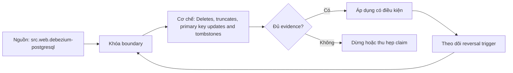

# Deletes, truncates, primary key updates and tombstones

> [!abstract] Câu hỏi trung tâm
> Delete, truncate, primary-key update và tombstone biểu diễn state transition khác nhau thế nào?

## 1. Delete identity

Delete chỉ áp dụng chắc chắn khi event key và before image đủ nhận diện row dưới replica-identity contract. Đừng bắt đầu bằng tên công cụ. Hãy bắt đầu bằng đối tượng được bảo vệ, boundary quan sát được và hậu quả nếu kết luận sai. Trong bài `Deletes, truncates, primary key updates and tombstones`, câu hỏi thực dụng là: Delete, truncate, primary-key update và tombstone biểu diễn state transition khác nhau thế nào? Ta ghi rõ grain, population, time window, owner và hành động sau failure; nếu một trường chưa biết thì đánh dấu unknown thay vì lấp bằng mặc định. Bằng chứng tối thiểu gồm fixture có version, cấu hình hoặc rule đã resolve, raw observation, expected result và limitation. Phần này là curriculum synthesis dựa trên các nguồn đã định danh, không phải lời hứa rằng mọi adapter hay deployment đều có cùng hành vi.

## 2. Tombstone

Tombstone là transport/log-compaction signal khác delete envelope; consumer phải định nghĩa rõ khi nào xóa state. Điểm khó không nằm ở cú pháp mà ở identity và scope. Hai phép đo cùng tên vẫn có thể nói về hai population hoặc hai thời điểm khác nhau. Trong bài `Deletes, truncates, primary key updates and tombstones`, câu hỏi thực dụng là: Delete, truncate, primary-key update và tombstone biểu diễn state transition khác nhau thế nào? Ta ghi rõ grain, population, time window, owner và hành động sau failure; nếu một trường chưa biết thì đánh dấu unknown thay vì lấp bằng mặc định. Bằng chứng tối thiểu gồm fixture có version, cấu hình hoặc rule đã resolve, raw observation, expected result và limitation. Phần này là curriculum synthesis dựa trên các nguồn đã định danh, không phải lời hứa rằng mọi adapter hay deployment đều có cùng hành vi.

## 3. Truncate

Truncate có scope cả table và có thể thiếu row keys, vì vậy không được xử lý như chuỗi delete thông thường. Một dashboard xanh chỉ là tín hiệu. Muốn biến nó thành bằng chứng phải giữ input, phiên bản, rule, trạng thái trước–sau và cách tính độc lập. Trong bài `Deletes, truncates, primary key updates and tombstones`, câu hỏi thực dụng là: Delete, truncate, primary-key update và tombstone biểu diễn state transition khác nhau thế nào? Ta ghi rõ grain, population, time window, owner và hành động sau failure; nếu một trường chưa biết thì đánh dấu unknown thay vì lấp bằng mặc định. Bằng chứng tối thiểu gồm fixture có version, cấu hình hoặc rule đã resolve, raw observation, expected result và limitation. Phần này là curriculum synthesis dựa trên các nguồn đã định danh, không phải lời hứa rằng mọi adapter hay deployment đều có cùng hành vi.

## 4. Primary-key update

Đổi primary key có thể hiện thành delete-key cũ cộng create-key mới hoặc connector-specific sequence cần kiểm bằng fixture. Thiết kế tốt phải chịu được counterexample. Hãy chủ động tạo case sát boundary, case thiếu dữ liệu và case replay thay vì chỉ chạy happy path. Trong bài `Deletes, truncates, primary key updates and tombstones`, câu hỏi thực dụng là: Delete, truncate, primary-key update và tombstone biểu diễn state transition khác nhau thế nào? Ta ghi rõ grain, population, time window, owner và hành động sau failure; nếu một trường chưa biết thì đánh dấu unknown thay vì lấp bằng mặc định. Bằng chứng tối thiểu gồm fixture có version, cấu hình hoặc rule đã resolve, raw observation, expected result và limitation. Phần này là curriculum synthesis dựa trên các nguồn đã định danh, không phải lời hứa rằng mọi adapter hay deployment đều có cùng hành vi.

## 5. Image fidelity

Before/after phụ thuộc source configuration, table key và connector version; null không tự chứng minh row rỗng. Chi phí vận hành thuộc contract. Một rule đúng nhưng quá đắt, quá ồn hoặc không có owner sẽ nhanh chóng bị tắt và mất tác dụng. Trong bài `Deletes, truncates, primary key updates and tombstones`, câu hỏi thực dụng là: Delete, truncate, primary-key update và tombstone biểu diễn state transition khác nhau thế nào? Ta ghi rõ grain, population, time window, owner và hành động sau failure; nếu một trường chưa biết thì đánh dấu unknown thay vì lấp bằng mặc định. Bằng chứng tối thiểu gồm fixture có version, cấu hình hoặc rule đã resolve, raw observation, expected result và limitation. Phần này là curriculum synthesis dựa trên các nguồn đã định danh, không phải lời hứa rằng mọi adapter hay deployment đều có cùng hành vi.

## 6. Mutation suite

Fixture phải bao gồm insert, update, delete, truncate, key change và replay rồi đối soát key multiset cuối. Kết luận cần có điều kiện đảo chiều. Khi volume, latency, nguồn thẩm quyền hoặc topology đổi, quyết định cũ phải được xem xét lại bằng cùng một oracle. Trong bài `Deletes, truncates, primary key updates and tombstones`, câu hỏi thực dụng là: Delete, truncate, primary-key update và tombstone biểu diễn state transition khác nhau thế nào? Ta ghi rõ grain, population, time window, owner và hành động sau failure; nếu một trường chưa biết thì đánh dấu unknown thay vì lấp bằng mặc định. Bằng chứng tối thiểu gồm fixture có version, cấu hình hoặc rule đã resolve, raw observation, expected result và limitation. Phần này là curriculum synthesis dựa trên các nguồn đã định danh, không phải lời hứa rằng mọi adapter hay deployment đều có cùng hành vi.

## 7. Ma trận kiểm chứng từng mệnh đề

Với `wiki.cdc.deletes-truncates-pk-tombstones`, command thành công không tự chứng minh dữ liệu đúng. Protocol riêng của bài là: Run a version-pinned CDC or Spark fixture, inject the declared mutation/failure and reconcile identities, positions, attempts and final state against an independent oracle. Mỗi probe dưới đây phải nối input boundary với failure signal và oracle có thể phản bác kết luận.

### 7.1. Deletes, truncates, primary key updates and tombstones: kiểm `Delete identity` bằng case 1, cụ thể delete chỉ áp dụng chắc chắn khi event key và before image đủ nhận diện row dưới replica-identity contract

**Mệnh đề cần kiểm.** Deletes, truncates, primary key updates and tombstones: kiểm `Delete identity` bằng case 1, cụ thể delete chỉ áp dụng chắc chắn khi event key và before image đủ nhận diện row dưới replica-identity contract.

**Thiết kế phép thử cho `wiki.cdc.deletes-truncates-pk-tombstones`.** Trong ngữ cảnh `wiki.cdc.deletes-truncates-pk-tombstones`, tạo positive control và negative control chỉ khác đúng một điều kiện. Khóa input snapshot, phiên bản và owner của rule; chạy đúng population được bài `Deletes, truncates, primary key updates and tombstones` công bố.

**Bằng chứng cần giữ.** Đối với probe 1 của `Deletes, truncates, primary key updates and tombstones`, giữ fixture, raw failing rows và lệnh tái hiện. Nếu chưa chạy lab, ghi expected evidence và giữ trạng thái review; không biến protocol thành observation.

### 7.2. Deletes, truncates, primary key updates and tombstones: kiểm `Tombstone` bằng case 2, cụ thể tombstone là transport/log-compaction signal khác delete envelope; consumer phải định nghĩa rõ khi nào xóa state

**Mệnh đề cần kiểm.** Deletes, truncates, primary key updates and tombstones: kiểm `Tombstone` bằng case 2, cụ thể tombstone là transport/log-compaction signal khác delete envelope; consumer phải định nghĩa rõ khi nào xóa state.

**Thiết kế phép thử cho `wiki.cdc.deletes-truncates-pk-tombstones`.** Trong ngữ cảnh `wiki.cdc.deletes-truncates-pk-tombstones`, đổi grain nhưng giữ tổng số dòng để lộ phép đo sai cấp. Khóa input snapshot, phiên bản và owner của rule; chạy đúng population được bài `Deletes, truncates, primary key updates and tombstones` công bố.

**Bằng chứng cần giữ.** Đối với probe 2 của `Deletes, truncates, primary key updates and tombstones`, báo numerator, denominator và key set ở cả hai grain. Nếu chưa chạy lab, ghi expected evidence và giữ trạng thái review; không biến protocol thành observation.

### 7.3. Deletes, truncates, primary key updates and tombstones: kiểm `Truncate` bằng case 3, cụ thể truncate có scope cả table và có thể thiếu row keys, vì vậy không được xử lý như chuỗi delete thông thường

**Mệnh đề cần kiểm.** Deletes, truncates, primary key updates and tombstones: kiểm `Truncate` bằng case 3, cụ thể truncate có scope cả table và có thể thiếu row keys, vì vậy không được xử lý như chuỗi delete thông thường.

**Thiết kế phép thử cho `wiki.cdc.deletes-truncates-pk-tombstones`.** Trong ngữ cảnh `wiki.cdc.deletes-truncates-pk-tombstones`, đưa một giá trị tới đúng boundary và một giá trị vượt boundary. Khóa input snapshot, phiên bản và owner của rule; chạy đúng population được bài `Deletes, truncates, primary key updates and tombstones` công bố.

**Bằng chứng cần giữ.** Đối với probe 3 của `Deletes, truncates, primary key updates and tombstones`, lưu hai observed values cùng rule đã resolve. Nếu chưa chạy lab, ghi expected evidence và giữ trạng thái review; không biến protocol thành observation.

### 7.4. Deletes, truncates, primary key updates and tombstones: kiểm `Primary-key update` bằng case 4, cụ thể đổi primary key có thể hiện thành delete-key cũ cộng create-key mới hoặc connector-specific sequence cần kiểm bằng fixture

**Mệnh đề cần kiểm.** Deletes, truncates, primary key updates and tombstones: kiểm `Primary-key update` bằng case 4, cụ thể đổi primary key có thể hiện thành delete-key cũ cộng create-key mới hoặc connector-specific sequence cần kiểm bằng fixture.

**Thiết kế phép thử cho `wiki.cdc.deletes-truncates-pk-tombstones`.** Trong ngữ cảnh `wiki.cdc.deletes-truncates-pk-tombstones`, kill tiến trình ngay trước rồi ngay sau durable side effect. Khóa input snapshot, phiên bản và owner của rule; chạy đúng population được bài `Deletes, truncates, primary key updates and tombstones` công bố.

**Bằng chứng cần giữ.** Đối với probe 4 của `Deletes, truncates, primary key updates and tombstones`, lưu checkpoint, external ledger và trạng thái sau restart. Nếu chưa chạy lab, ghi expected evidence và giữ trạng thái review; không biến protocol thành observation.

### 7.5. Deletes, truncates, primary key updates and tombstones: kiểm `Image fidelity` bằng case 5, cụ thể before/after phụ thuộc source configuration, table key và connector version; null không tự chứng minh row rỗng

**Mệnh đề cần kiểm.** Deletes, truncates, primary key updates and tombstones: kiểm `Image fidelity` bằng case 5, cụ thể before/after phụ thuộc source configuration, table key và connector version; null không tự chứng minh row rỗng.

**Thiết kế phép thử cho `wiki.cdc.deletes-truncates-pk-tombstones`.** Trong ngữ cảnh `wiki.cdc.deletes-truncates-pk-tombstones`, đảo thứ tự input và concurrency nhưng giữ logical population. Khóa input snapshot, phiên bản và owner của rule; chạy đúng population được bài `Deletes, truncates, primary key updates and tombstones` công bố.

**Bằng chứng cần giữ.** Đối với probe 5 của `Deletes, truncates, primary key updates and tombstones`, so canonical hash và business totals giữa các thứ tự. Nếu chưa chạy lab, ghi expected evidence và giữ trạng thái review; không biến protocol thành observation.

### 7.6. Deletes, truncates, primary key updates and tombstones: kiểm `Mutation suite` bằng case 6, cụ thể fixture phải bao gồm insert, update, delete, truncate, key change và replay rồi đối soát key multiset cuối

**Mệnh đề cần kiểm.** Deletes, truncates, primary key updates and tombstones: kiểm `Mutation suite` bằng case 6, cụ thể fixture phải bao gồm insert, update, delete, truncate, key change và replay rồi đối soát key multiset cuối.

**Thiết kế phép thử cho `wiki.cdc.deletes-truncates-pk-tombstones`.** Trong ngữ cảnh `wiki.cdc.deletes-truncates-pk-tombstones`, replay cùng identity với payload giống rồi payload xung đột. Khóa input snapshot, phiên bản và owner của rule; chạy đúng population được bài `Deletes, truncates, primary key updates and tombstones` công bố.

**Bằng chứng cần giữ.** Đối với probe 6 của `Deletes, truncates, primary key updates and tombstones`, tách duplicate replay khỏi identity collision bằng reason code. Nếu chưa chạy lab, ghi expected evidence và giữ trạng thái review; không biến protocol thành observation.

### 7.7. Deletes, truncates, primary key updates and tombstones: kiểm `Delete identity` bằng case 7, cụ thể delete chỉ áp dụng chắc chắn khi event key và before image đủ nhận diện row dưới replica-identity contract

**Mệnh đề cần kiểm.** Deletes, truncates, primary key updates and tombstones: kiểm `Delete identity` bằng case 7, cụ thể delete chỉ áp dụng chắc chắn khi event key và before image đủ nhận diện row dưới replica-identity contract.

**Thiết kế phép thử cho `wiki.cdc.deletes-truncates-pk-tombstones`.** Trong ngữ cảnh `wiki.cdc.deletes-truncates-pk-tombstones`, thêm record tới trễ trong horizon và ngoài horizon. Khóa input snapshot, phiên bản và owner của rule; chạy đúng population được bài `Deletes, truncates, primary key updates and tombstones` công bố.

**Bằng chứng cần giữ.** Đối với probe 7 của `Deletes, truncates, primary key updates and tombstones`, báo accepted-late, rejected-late và oldest outstanding timestamp. Nếu chưa chạy lab, ghi expected evidence và giữ trạng thái review; không biến protocol thành observation.

### 7.8. Deletes, truncates, primary key updates and tombstones: kiểm `Tombstone` bằng case 8, cụ thể tombstone là transport/log-compaction signal khác delete envelope; consumer phải định nghĩa rõ khi nào xóa state

**Mệnh đề cần kiểm.** Deletes, truncates, primary key updates and tombstones: kiểm `Tombstone` bằng case 8, cụ thể tombstone là transport/log-compaction signal khác delete envelope; consumer phải định nghĩa rõ khi nào xóa state.

**Thiết kế phép thử cho `wiki.cdc.deletes-truncates-pk-tombstones`.** Trong ngữ cảnh `wiki.cdc.deletes-truncates-pk-tombstones`, đổi schema theo một cách tương thích rồi một cách phá vỡ semantics. Khóa input snapshot, phiên bản và owner của rule; chạy đúng population được bài `Deletes, truncates, primary key updates and tombstones` công bố.

**Bằng chứng cần giữ.** Đối với probe 8 của `Deletes, truncates, primary key updates and tombstones`, giữ schema diff, classification và consumer-visible result. Nếu chưa chạy lab, ghi expected evidence và giữ trạng thái review; không biến protocol thành observation.

### 7.9. Deletes, truncates, primary key updates and tombstones: kiểm `Truncate` bằng case 9, cụ thể truncate có scope cả table và có thể thiếu row keys, vì vậy không được xử lý như chuỗi delete thông thường

**Mệnh đề cần kiểm.** Deletes, truncates, primary key updates and tombstones: kiểm `Truncate` bằng case 9, cụ thể truncate có scope cả table và có thể thiếu row keys, vì vậy không được xử lý như chuỗi delete thông thường.

**Thiết kế phép thử cho `wiki.cdc.deletes-truncates-pk-tombstones`.** Trong ngữ cảnh `wiki.cdc.deletes-truncates-pk-tombstones`, tạo missing và duplicate bù nhau để count tổng không đổi. Khóa input snapshot, phiên bản và owner của rule; chạy đúng population được bài `Deletes, truncates, primary key updates and tombstones` công bố.

**Bằng chứng cần giữ.** Đối với probe 9 của `Deletes, truncates, primary key updates and tombstones`, so key multiset và typed hashes thay vì chỉ row count. Nếu chưa chạy lab, ghi expected evidence và giữ trạng thái review; không biến protocol thành observation.

### 7.10. Deletes, truncates, primary key updates and tombstones: kiểm `Primary-key update` bằng case 10, cụ thể đổi primary key có thể hiện thành delete-key cũ cộng create-key mới hoặc connector-specific sequence cần kiểm bằng fixture

**Mệnh đề cần kiểm.** Deletes, truncates, primary key updates and tombstones: kiểm `Primary-key update` bằng case 10, cụ thể đổi primary key có thể hiện thành delete-key cũ cộng create-key mới hoặc connector-specific sequence cần kiểm bằng fixture.

**Thiết kế phép thử cho `wiki.cdc.deletes-truncates-pk-tombstones`.** Trong ngữ cảnh `wiki.cdc.deletes-truncates-pk-tombstones`, cho reviewer tái hiện chỉ từ evidence package. Khóa input snapshot, phiên bản và owner của rule; chạy đúng population được bài `Deletes, truncates, primary key updates and tombstones` công bố.

**Bằng chứng cần giữ.** Đối với probe 10 của `Deletes, truncates, primary key updates and tombstones`, package phải đủ để người khác dựng lại decision và limitation. Nếu chưa chạy lab, ghi expected evidence và giữ trạng thái review; không biến protocol thành observation.

### 7.11. Deletes, truncates, primary key updates and tombstones: kiểm `Image fidelity` bằng case 11, cụ thể before/after phụ thuộc source configuration, table key và connector version; null không tự chứng minh row rỗng

**Mệnh đề cần kiểm.** Deletes, truncates, primary key updates and tombstones: kiểm `Image fidelity` bằng case 11, cụ thể before/after phụ thuộc source configuration, table key và connector version; null không tự chứng minh row rỗng.

**Thiết kế phép thử cho `wiki.cdc.deletes-truncates-pk-tombstones`.** Trong ngữ cảnh `wiki.cdc.deletes-truncates-pk-tombstones`, so với oracle độc lập không dùng chung query hoặc parser. Khóa input snapshot, phiên bản và owner của rule; chạy đúng population được bài `Deletes, truncates, primary key updates and tombstones` công bố.

**Bằng chứng cần giữ.** Đối với probe 11 của `Deletes, truncates, primary key updates and tombstones`, independent result phải khớp ở grain đã công bố. Nếu chưa chạy lab, ghi expected evidence và giữ trạng thái review; không biến protocol thành observation.

### 7.12. Deletes, truncates, primary key updates and tombstones: kiểm `Mutation suite` bằng case 12, cụ thể fixture phải bao gồm insert, update, delete, truncate, key change và replay rồi đối soát key multiset cuối

**Mệnh đề cần kiểm.** Deletes, truncates, primary key updates and tombstones: kiểm `Mutation suite` bằng case 12, cụ thể fixture phải bao gồm insert, update, delete, truncate, key change và replay rồi đối soát key multiset cuối.

**Thiết kế phép thử cho `wiki.cdc.deletes-truncates-pk-tombstones`.** Trong ngữ cảnh `wiki.cdc.deletes-truncates-pk-tombstones`, chạy scope hẹp và population đầy đủ rồi công bố phần bị loại. Khóa input snapshot, phiên bản và owner của rule; chạy đúng population được bài `Deletes, truncates, primary key updates and tombstones` công bố.

**Bằng chứng cần giữ.** Đối với probe 12 của `Deletes, truncates, primary key updates and tombstones`, coverage phải nêu rõ excluded nodes, partitions hoặc incidents. Nếu chưa chạy lab, ghi expected evidence và giữ trạng thái review; không biến protocol thành observation.

### 7.13. Deletes, truncates, primary key updates and tombstones: kiểm `Delete identity` bằng case 13, cụ thể delete chỉ áp dụng chắc chắn khi event key và before image đủ nhận diện row dưới replica-identity contract

**Mệnh đề cần kiểm.** Deletes, truncates, primary key updates and tombstones: kiểm `Delete identity` bằng case 13, cụ thể delete chỉ áp dụng chắc chắn khi event key và before image đủ nhận diện row dưới replica-identity contract.

**Thiết kế phép thử cho `wiki.cdc.deletes-truncates-pk-tombstones`.** Trong ngữ cảnh `wiki.cdc.deletes-truncates-pk-tombstones`, thử timezone, precision hoặc partition ở hai phía của ranh giới. Khóa input snapshot, phiên bản và owner của rule; chạy đúng population được bài `Deletes, truncates, primary key updates and tombstones` công bố.

**Bằng chứng cần giữ.** Đối với probe 13 của `Deletes, truncates, primary key updates and tombstones`, UTC/local interval và rounding policy phải hiện trong output. Nếu chưa chạy lab, ghi expected evidence và giữ trạng thái review; không biến protocol thành observation.

### 7.14. Deletes, truncates, primary key updates and tombstones: kiểm `Tombstone` bằng case 14, cụ thể tombstone là transport/log-compaction signal khác delete envelope; consumer phải định nghĩa rõ khi nào xóa state

**Mệnh đề cần kiểm.** Deletes, truncates, primary key updates and tombstones: kiểm `Tombstone` bằng case 14, cụ thể tombstone là transport/log-compaction signal khác delete envelope; consumer phải định nghĩa rõ khi nào xóa state.

**Thiết kế phép thử cho `wiki.cdc.deletes-truncates-pk-tombstones`.** Trong ngữ cảnh `wiki.cdc.deletes-truncates-pk-tombstones`, đổi constraint đủ lớn để quyết định phải đảo. Khóa input snapshot, phiên bản và owner của rule; chạy đúng population được bài `Deletes, truncates, primary key updates and tombstones` công bố.

**Bằng chứng cần giữ.** Đối với probe 14 của `Deletes, truncates, primary key updates and tombstones`, ADR phải lưu changed constraint và reversal threshold. Nếu chưa chạy lab, ghi expected evidence và giữ trạng thái review; không biến protocol thành observation.

### 7.15. Deletes, truncates, primary key updates and tombstones: kiểm `Truncate` bằng case 15, cụ thể truncate có scope cả table và có thể thiếu row keys, vì vậy không được xử lý như chuỗi delete thông thường

**Mệnh đề cần kiểm.** Deletes, truncates, primary key updates and tombstones: kiểm `Truncate` bằng case 15, cụ thể truncate có scope cả table và có thể thiếu row keys, vì vậy không được xử lý như chuỗi delete thông thường.

**Thiết kế phép thử cho `wiki.cdc.deletes-truncates-pk-tombstones`.** Trong ngữ cảnh `wiki.cdc.deletes-truncates-pk-tombstones`, chạy lại từ môi trường sạch với versions và seed đã khóa. Khóa input snapshot, phiên bản và owner của rule; chạy đúng population được bài `Deletes, truncates, primary key updates and tombstones` công bố.

**Bằng chứng cần giữ.** Đối với probe 15 của `Deletes, truncates, primary key updates and tombstones`, canonical result phải ổn định hoặc mọi nondeterminism phải được giải thích. Nếu chưa chạy lab, ghi expected evidence và giữ trạng thái review; không biến protocol thành observation.

## 8. Quy trình phản biện

1. Viết consumer-visible invariant cho `Deletes, truncates, primary key updates and tombstones` trước khi chọn query hoặc tool.
2. Khóa grain, identity, population, time window và authoritative source.
3. Phân biệt declared configuration, executed state và published state.
4. Chạy negative control, replay hoặc changed-assumption case phù hợp.
5. Đối soát bằng oracle độc lập; công bố coverage và phần không quan sát được.
6. Gắn owner, hành động, reversal trigger và hạn review cho kết luận.

## 9. Câu hỏi tự kiểm tra

1. `Deletes, truncates, primary key updates and tombstones: kiểm `Delete identity` bằng case 1, cụ thể delete chỉ áp dụng chắc chắn khi event key và before image đủ nhận diện row dưới replica-identity contract` thất bại đầu tiên ở boundary nào?
2. Artifact nào mạnh nhất để trả lời `Deletes, truncates, primary key updates and tombstones: kiểm `Truncate` bằng case 3, cụ thể truncate có scope cả table và có thể thiếu row keys, vì vậy không được xử lý như chuỗi delete thông thường`?
3. Counterexample nhỏ nhất cho `Deletes, truncates, primary key updates and tombstones: kiểm `Mutation suite` bằng case 6, cụ thể fixture phải bao gồm insert, update, delete, truncate, key change và replay rồi đối soát key multiset cuối` gồm những state nào?
4. `Deletes, truncates, primary key updates and tombstones: kiểm `Truncate` bằng case 9, cụ thể truncate có scope cả table và có thể thiếu row keys, vì vậy không được xử lý như chuỗi delete thông thường` có thể xanh giả ra sao?
5. Constraint nào khiến quyết định ở `Deletes, truncates, primary key updates and tombstones: kiểm `Tombstone` bằng case 14, cụ thể tombstone là transport/log-compaction signal khác delete envelope; consumer phải định nghĩa rõ khi nào xóa state` phải đảo?
6. Phần nào của `Deletes, truncates, primary key updates and tombstones: kiểm `Truncate` bằng case 15, cụ thể truncate có scope cả table và có thể thiếu row keys, vì vậy không được xử lý như chuỗi delete thông thường` mới là protocol, chưa phải observation?

## 10. Giới hạn và điều chưa cho phép kết luận

- Lab của `Deletes, truncates, primary key updates and tombstones` chưa chạy trên hệ thống production; nội dung là giáo trình và expected evidence.
- Hành vi phụ thuộc phiên bản, connector, scheduler, warehouse và catalog configuration phải được kiểm lại.
- Các ma trận, ladder và threshold do giáo trình tổng hợp không được gán nguyên văn cho vendor.
- Note giữ trạng thái `review` cho tới khi owner duyệt semantics và learner artifact.

## Reference
1. [[SRC-DEBEZIUM-POSTGRESQL]]
2. [[SRC-POSTGRESQL-LOGICAL-DECODING]]

## Source coverage

| Source slice | Nội dung sử dụng | Trạng thái |
|---|---|---|
| [[SRC-DEBEZIUM-POSTGRESQL]] | Contract hoặc cơ chế liên quan trực tiếp tới `Deletes, truncates, primary key updates and tombstones` | Đã đọc locator; cần pin version khi chạy lab |
| [[SRC-POSTGRESQL-LOGICAL-DECODING]] | Contract hoặc cơ chế liên quan trực tiếp tới `Deletes, truncates, primary key updates and tombstones` | Đã đọc locator; cần pin version khi chạy lab |

## Key takeaways
- Delete envelope, truncate and tombstone are different state transitions.
- Với `wiki.cdc.deletes-truncates-pk-tombstones`, quality của kết luận phụ thuộc identity, coverage và oracle chứ không phụ thuộc màu dashboard.
- Câu hỏi `Delete, truncate, primary-key update và tombstone biểu diễn state transition khác nhau thế nào?` chỉ được trả lời trong scope và version đã ghi.
- Các source IDs `src.web.debezium-postgresql, src.web.postgresql-logical-decoding` đặt ranh giới cho source fact; phần còn lại là synthesis có nhãn.
- Trước khi lab chạy, đây là note đã kiểm cấu trúc và provenance, chưa phải chứng nhận production.

<!-- ATOMIC-EXECUTION-CAPSULE:START -->

## Execution capsule — kiểm chứng `wiki.cdc.deletes-truncates-pk-tombstones`

> [!important] Phân loại mệnh đề
> Với `wiki.cdc.deletes-truncates-pk-tombstones`, sơ đồ, ví dụ và artifact về **Deletes, truncates, primary key updates and tombstones** là **synthesis để kiểm chứng**; chúng không phải trích dẫn hay case nguyên văn của nguồn.

### Sơ đồ cơ chế và điểm kiểm soát



Đọc sơ đồ `wiki.cdc.deletes-truncates-pk-tombstones` từ trái sang phải: source chỉ cung cấp claim ban đầu cho **Deletes, truncates, primary key updates and tombstones**; quyết định chỉ được đi tiếp sau khi boundary, evidence và điều kiện đảo quyết định đã hiện hữu.

### Artifact thực thi tối thiểu

```sql
-- Verification harness for: Deletes, truncates, primary key updates and tombstones
WITH evidence AS (
    SELECT 'wiki.cdc.deletes-truncates-pk-tombstones' AS concept_id,
           'boundary_declared' AS check_name, 1 AS passed
    UNION ALL
    SELECT 'wiki.cdc.deletes-truncates-pk-tombstones', 'independent_oracle', 1
    UNION ALL
    SELECT 'wiki.cdc.deletes-truncates-pk-tombstones', 'reversal_trigger_recorded', 1
)
SELECT concept_id,
       MIN(passed) AS all_hard_checks_pass,
       COUNT(*) AS evidence_items
FROM evidence
GROUP BY concept_id
HAVING MIN(passed) = 1;
```

Artifact của `wiki.cdc.deletes-truncates-pk-tombstones` buộc người dùng ghi boundary, oracle và reversal trigger cho **Deletes, truncates, primary key updates and tombstones**. Các giá trị minh họa phải được thay bằng evidence thật trước khi dùng cho quyết định.

### Tự kiểm tra trước khi tái sử dụng

1. Bạn có thể trả lời `Delete, truncate, primary-key update và tombstone biểu diễn state transition khác nhau thế nào?` bằng một câu mà không kéo thêm concept thứ hai không?
2. Source locator nào đỡ cho claim, và phần nào chỉ là synthesis trong note?
3. Observation nào khiến bạn dừng, thu hẹp hoặc đảo quyết định?
4. Artifact nào cho phép một reviewer độc lập tái hiện kết quả?

<!-- ATOMIC-EXECUTION-CAPSULE:END -->
