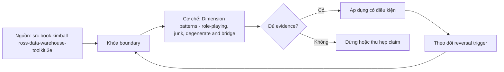

# Dimension patterns - role-playing, junk, degenerate and bridge

> [!abstract] Câu hỏi trung tâm
> Role-playing, junk, degenerate dimension và bridge giải bốn vấn đề khác nhau; làm sao nhận đúng mẫu và không nhân measures khi join?

## 1. Role-playing dimension

Một physical dimension được dùng qua nhiều quan hệ ngữ nghĩa, chẳng hạn order date, requested date và ship date. Mỗi role cần alias/view và tên cột rõ nghĩa; cùng date key không có nghĩa cùng business event. Không nhân bản dimension chỉ để đổi tên, vì như vậy làm tách governance và fiscal-calendar logic.

## 2. Degenerate dimension

Mã giao dịch như order number có thể nằm ngay trong fact khi không còn descriptive attributes tạo thành một dimension riêng. Nó vẫn hữu ích cho grouping, drill-through và đối chiếu với source. Degenerate không phải giấy phép nhét status code khó hiểu vào fact; code có nhãn, nhóm hoặc policy cần dimension.

## 3. Junk dimension

Các flag/indicator low-cardinality, tương đối độc lập, có thể gom thành một dimension nhỏ thay vì tăng độ rộng fact hoặc tạo hàng chục dimensions. Phải ước lượng Cartesian combinations và chỉ materialize combinations thực tế nếu không gian lớn. Không gom các thuộc tính có ownership, rate-of-change hay semantics khác nhau chỉ vì chúng ít giá trị.

## 4. Bridge

Bridge biểu diễn quan hệ many-to-many, multivalued dimension hoặc hierarchy path. Một fact có thể nối nhiều members, vì vậy SUM sau join sẽ nhân measure nếu không có allocation weight hoặc impact-only contract. Weight phải có hiệu lực theo thời gian và tổng bằng 1 trong phạm vi allocation; DISTINCT không sửa được sai semantics.

## 5. Chọn mẫu bằng failure mode

Role-playing giải bài toán nhiều vai của cùng domain; junk giải low-cardinality flags; degenerate giữ transaction identifier không có attributes; bridge giải multiplicity. Bốn mẫu không thay thế nhau. Review phải viết input/output grain, cardinality và control total trước khi chạy truy vấn.

## 6. Ma trận kiểm chứng từng mệnh đề

Mỗi mệnh đề phải chuyển thành fixture, invariant và phép đối chiếu tái chạy được. Tên pattern, sơ đồ hoặc một query chạy không lỗi không tự chứng minh đúng grain và semantics.

### 6.1. order date và ship date phải có role names riêng

**Mệnh đề cần kiểm.** order date và ship date phải có role names riêng. **Thiết kế phép kiểm.** Dựng một star có hai date roles, transaction number, sáu flags và multivalued sales reps. Ghi input/output grain, cardinality và control total; chạy query không allocation, có allocation và impact-only để chứng minh điểm khác. **Bằng chứng đạt cho `wiki.data-modeling.dimension-patterns`.** Lưu model/metric contract, seed data, SQL/notebook, raw output, row counts, distinct keys, unmatched rate và control totals. Nếu kết quả phụ thuộc engine, cutoff hoặc business policy, phải ghi điều kiện đó cùng phản ví dụ.

### 6.2. một physical date dimension có thể phục vụ nhiều role

**Mệnh đề cần kiểm.** một physical date dimension có thể phục vụ nhiều role. **Thiết kế phép kiểm.** Dựng một star có hai date roles, transaction number, sáu flags và multivalued sales reps. Ghi input/output grain, cardinality và control total; chạy query không allocation, có allocation và impact-only để chứng minh điểm khác. **Bằng chứng đạt cho `wiki.data-modeling.dimension-patterns`.** Lưu model/metric contract, seed data, SQL/notebook, raw output, row counts, distinct keys, unmatched rate và control totals. Nếu kết quả phụ thuộc engine, cutoff hoặc business policy, phải ghi điều kiện đó cùng phản ví dụ.

### 6.3. order number không có attributes là degenerate dimension

**Mệnh đề cần kiểm.** order number không có attributes là degenerate dimension. **Thiết kế phép kiểm.** Dựng một star có hai date roles, transaction number, sáu flags và multivalued sales reps. Ghi input/output grain, cardinality và control total; chạy query không allocation, có allocation và impact-only để chứng minh điểm khác. **Bằng chứng đạt cho `wiki.data-modeling.dimension-patterns`.** Lưu model/metric contract, seed data, SQL/notebook, raw output, row counts, distinct keys, unmatched rate và control totals. Nếu kết quả phụ thuộc engine, cutoff hoặc business policy, phải ghi điều kiện đó cùng phản ví dụ.

### 6.4. status code có nhãn không nên bị coi là degenerate

**Mệnh đề cần kiểm.** status code có nhãn không nên bị coi là degenerate. **Thiết kế phép kiểm.** Dựng một star có hai date roles, transaction number, sáu flags và multivalued sales reps. Ghi input/output grain, cardinality và control total; chạy query không allocation, có allocation và impact-only để chứng minh điểm khác. **Bằng chứng đạt cho `wiki.data-modeling.dimension-patterns`.** Lưu model/metric contract, seed data, SQL/notebook, raw output, row counts, distinct keys, unmatched rate và control totals. Nếu kết quả phụ thuộc engine, cutoff hoặc business policy, phải ghi điều kiện đó cùng phản ví dụ.

### 6.5. junk dimension phù hợp low-cardinality flags

**Mệnh đề cần kiểm.** junk dimension phù hợp low-cardinality flags. **Thiết kế phép kiểm.** Dựng một star có hai date roles, transaction number, sáu flags và multivalued sales reps. Ghi input/output grain, cardinality và control total; chạy query không allocation, có allocation và impact-only để chứng minh điểm khác. **Bằng chứng đạt cho `wiki.data-modeling.dimension-patterns`.** Lưu model/metric contract, seed data, SQL/notebook, raw output, row counts, distinct keys, unmatched rate và control totals. Nếu kết quả phụ thuộc engine, cutoff hoặc business policy, phải ghi điều kiện đó cùng phản ví dụ.

### 6.6. Cartesian combinations phải được ước lượng

**Mệnh đề cần kiểm.** Cartesian combinations phải được ước lượng. **Thiết kế phép kiểm.** Dựng một star có hai date roles, transaction number, sáu flags và multivalued sales reps. Ghi input/output grain, cardinality và control total; chạy query không allocation, có allocation và impact-only để chứng minh điểm khác. **Bằng chứng đạt cho `wiki.data-modeling.dimension-patterns`.** Lưu model/metric contract, seed data, SQL/notebook, raw output, row counts, distinct keys, unmatched rate và control totals. Nếu kết quả phụ thuộc engine, cutoff hoặc business policy, phải ghi điều kiện đó cùng phản ví dụ.

### 6.7. bridge làm tăng row count sau join

**Mệnh đề cần kiểm.** bridge làm tăng row count sau join. **Thiết kế phép kiểm.** Dựng một star có hai date roles, transaction number, sáu flags và multivalued sales reps. Ghi input/output grain, cardinality và control total; chạy query không allocation, có allocation và impact-only để chứng minh điểm khác. **Bằng chứng đạt cho `wiki.data-modeling.dimension-patterns`.** Lưu model/metric contract, seed data, SQL/notebook, raw output, row counts, distinct keys, unmatched rate và control totals. Nếu kết quả phụ thuộc engine, cutoff hoặc business policy, phải ghi điều kiện đó cùng phản ví dụ.

### 6.8. allocation weights phải có policy và hiệu lực

**Mệnh đề cần kiểm.** allocation weights phải có policy và hiệu lực. **Thiết kế phép kiểm.** Dựng một star có hai date roles, transaction number, sáu flags và multivalued sales reps. Ghi input/output grain, cardinality và control total; chạy query không allocation, có allocation và impact-only để chứng minh điểm khác. **Bằng chứng đạt cho `wiki.data-modeling.dimension-patterns`.** Lưu model/metric contract, seed data, SQL/notebook, raw output, row counts, distinct keys, unmatched rate và control totals. Nếu kết quả phụ thuộc engine, cutoff hoặc business policy, phải ghi điều kiện đó cùng phản ví dụ.

### 6.9. impact-only query không được giả vờ là allocation

**Mệnh đề cần kiểm.** impact-only query không được giả vờ là allocation. **Thiết kế phép kiểm.** Dựng một star có hai date roles, transaction number, sáu flags và multivalued sales reps. Ghi input/output grain, cardinality và control total; chạy query không allocation, có allocation và impact-only để chứng minh điểm khác. **Bằng chứng đạt cho `wiki.data-modeling.dimension-patterns`.** Lưu model/metric contract, seed data, SQL/notebook, raw output, row counts, distinct keys, unmatched rate và control totals. Nếu kết quả phụ thuộc engine, cutoff hoặc business policy, phải ghi điều kiện đó cùng phản ví dụ.

### 6.10. DISTINCT không sửa double counting

**Mệnh đề cần kiểm.** DISTINCT không sửa double counting. **Thiết kế phép kiểm.** Dựng một star có hai date roles, transaction number, sáu flags và multivalued sales reps. Ghi input/output grain, cardinality và control total; chạy query không allocation, có allocation và impact-only để chứng minh điểm khác. **Bằng chứng đạt cho `wiki.data-modeling.dimension-patterns`.** Lưu model/metric contract, seed data, SQL/notebook, raw output, row counts, distinct keys, unmatched rate và control totals. Nếu kết quả phụ thuộc engine, cutoff hoặc business policy, phải ghi điều kiện đó cùng phản ví dụ.

### 6.11. hierarchy bridge cần zero-length path khi contract yêu cầu

**Mệnh đề cần kiểm.** hierarchy bridge cần zero-length path khi contract yêu cầu. **Thiết kế phép kiểm.** Dựng một star có hai date roles, transaction number, sáu flags và multivalued sales reps. Ghi input/output grain, cardinality và control total; chạy query không allocation, có allocation và impact-only để chứng minh điểm khác. **Bằng chứng đạt cho `wiki.data-modeling.dimension-patterns`.** Lưu model/metric contract, seed data, SQL/notebook, raw output, row counts, distinct keys, unmatched rate và control totals. Nếu kết quả phụ thuộc engine, cutoff hoặc business policy, phải ghi điều kiện đó cùng phản ví dụ.

### 6.12. bridge history cần valid interval

**Mệnh đề cần kiểm.** bridge history cần valid interval. **Thiết kế phép kiểm.** Dựng một star có hai date roles, transaction number, sáu flags và multivalued sales reps. Ghi input/output grain, cardinality và control total; chạy query không allocation, có allocation và impact-only để chứng minh điểm khác. **Bằng chứng đạt cho `wiki.data-modeling.dimension-patterns`.** Lưu model/metric contract, seed data, SQL/notebook, raw output, row counts, distinct keys, unmatched rate và control totals. Nếu kết quả phụ thuộc engine, cutoff hoặc business policy, phải ghi điều kiện đó cùng phản ví dụ.

### 6.13. nhiều parent cần weighting hoặc non-additive interpretation

**Mệnh đề cần kiểm.** nhiều parent cần weighting hoặc non-additive interpretation. **Thiết kế phép kiểm.** Dựng một star có hai date roles, transaction number, sáu flags và multivalued sales reps. Ghi input/output grain, cardinality và control total; chạy query không allocation, có allocation và impact-only để chứng minh điểm khác. **Bằng chứng đạt cho `wiki.data-modeling.dimension-patterns`.** Lưu model/metric contract, seed data, SQL/notebook, raw output, row counts, distinct keys, unmatched rate và control totals. Nếu kết quả phụ thuộc engine, cutoff hoặc business policy, phải ghi điều kiện đó cùng phản ví dụ.

### 6.14. mỗi role cần semantic label

**Mệnh đề cần kiểm.** mỗi role cần semantic label. **Thiết kế phép kiểm.** Dựng một star có hai date roles, transaction number, sáu flags và multivalued sales reps. Ghi input/output grain, cardinality và control total; chạy query không allocation, có allocation và impact-only để chứng minh điểm khác. **Bằng chứng đạt cho `wiki.data-modeling.dimension-patterns`.** Lưu model/metric contract, seed data, SQL/notebook, raw output, row counts, distinct keys, unmatched rate và control totals. Nếu kết quả phụ thuộc engine, cutoff hoặc business policy, phải ghi điều kiện đó cùng phản ví dụ.

### 6.15. control total phải khớp trước và sau bridge

**Mệnh đề cần kiểm.** control total phải khớp trước và sau bridge. **Thiết kế phép kiểm.** Dựng một star có hai date roles, transaction number, sáu flags và multivalued sales reps. Ghi input/output grain, cardinality và control total; chạy query không allocation, có allocation và impact-only để chứng minh điểm khác. **Bằng chứng đạt cho `wiki.data-modeling.dimension-patterns`.** Lưu model/metric contract, seed data, SQL/notebook, raw output, row counts, distinct keys, unmatched rate và control totals. Nếu kết quả phụ thuộc engine, cutoff hoặc business policy, phải ghi điều kiện đó cùng phản ví dụ.

## 7. Quy trình phản biện

1. Viết business question, grain, identity, time semantics và aggregation contract.
2. Tách source fact, quyết định thiết kế và synthesis của giáo trình.
3. Dựng ca biên nhỏ nhất có thể làm query đúng cú pháp nhưng sai số.
4. Kiểm key, interval, cardinality và control total trước–sau transform/join.
5. Chạy replay, late data hoặc schema change phù hợp với bài; lưu failed run.
6. Phân biệt correctness, usability, performance và governance; một trục đạt không che lấp trục khác.
7. Ghi owner, version, policy và điều kiện làm lựa chọn hiện tại không còn đúng.

## 8. Câu hỏi tự kiểm tra

1. Pattern trong bài giải failure mode nào và không giải failure mode nào?
2. Row đại diện điều gì, có hiệu lực khi nào và được nhận dạng bằng gì?
3. Ca biên nào làm SUM, current-state lookup hoặc history query sai âm thầm?
4. Constraint/test nào bắt lỗi cấu trúc; phần ngữ nghĩa nào cần owner xác nhận?
5. Late data, correction, replay hoặc model change ảnh hưởng output đã công bố ra sao?
6. Nguồn nào hỗ trợ trực tiếp và phần nào là synthesis của bài?

## 9. Giới hạn và điều chưa cho phép kết luận

- Chưa chạy modeling lab, benchmark, late-data replay hay reconciliation; phép kiểm là protocol, không phải kết quả đã đo.
- Type number sau SCD Type 3 không hoàn toàn thống nhất giữa mọi tài liệu; implementation phải mô tả behavior.
- BigQuery guidance là engine-specific; không suy OBT luôn nhanh hoặc rẻ hơn.
- SQL Server system-versioned temporal table quản system time; business-valid time là trục khác.
- Bài Data Vault chỉ xác nhận khả năng nhận diện và đánh giá bối cảnh, không xác nhận năng lực triển khai DV2.

## Reference
1. [[SRC-KIMBALL-ROSS-DW-TOOLKIT-3E]]
2. [[SRC-ADAMSON-STAR-SCHEMA-COMPLETE-REFERENCE]]
3. [[SRC-SILBERSCHATZ-DATABASE-SYSTEM-CONCEPTS-7E]]

## Source coverage

| Source slice | Nội dung sử dụng | Trạng thái |
|---|---|---|
| [[SRC-KIMBALL-ROSS-DW-TOOLKIT-3E]] | Khái niệm, ranh giới và phản ví dụ liên quan đến bài | Đã đọc phạm vi có locator; không suy ngoài phạm vi |
| [[SRC-ADAMSON-STAR-SCHEMA-COMPLETE-REFERENCE]] | Khái niệm, ranh giới và phản ví dụ liên quan đến bài | Đã đọc phạm vi có locator; không suy ngoài phạm vi |
| [[SRC-SILBERSCHATZ-DATABASE-SYSTEM-CONCEPTS-7E]] | Khái niệm, ranh giới và phản ví dụ liên quan đến bài | Đã đọc phạm vi có locator; không suy ngoài phạm vi |

## Key takeaways
- Chọn pattern theo failure mode, grain, time và workload; không chọn theo tên gọi.
- Key/interval/cardinality đúng về cấu trúc vẫn cần business semantics và owner.
- History và restatement là data contract có tác động tới người dùng, không chỉ là ETL technique.
- Layout physical phải được so trên cùng workload và semantic output.
- Chưa chạy lab thì note là tài liệu học thuật đã truy nguồn, không phải chứng nhận production.

<!-- ATOMIC-EXECUTION-CAPSULE:START -->

## Execution capsule — kiểm chứng `wiki.data-modeling.dimension-patterns`

> [!important] Phân loại mệnh đề
> Với `wiki.data-modeling.dimension-patterns`, sơ đồ, ví dụ và artifact về **Dimension patterns - role-playing, junk, degenerate and bridge** là **synthesis để kiểm chứng**; chúng không phải trích dẫn hay case nguyên văn của nguồn.

### Sơ đồ cơ chế và điểm kiểm soát



Đọc sơ đồ `wiki.data-modeling.dimension-patterns` từ trái sang phải: source chỉ cung cấp claim ban đầu cho **Dimension patterns - role-playing, junk, degenerate and bridge**; quyết định chỉ được đi tiếp sau khi boundary, evidence và điều kiện đảo quyết định đã hiện hữu.

### Artifact thực thi tối thiểu

```sql
-- Verification harness for: Dimension patterns - role-playing, junk, degenerate and bridge
WITH evidence AS (
    SELECT 'wiki.data-modeling.dimension-patterns' AS concept_id,
           'boundary_declared' AS check_name, 1 AS passed
    UNION ALL
    SELECT 'wiki.data-modeling.dimension-patterns', 'independent_oracle', 1
    UNION ALL
    SELECT 'wiki.data-modeling.dimension-patterns', 'reversal_trigger_recorded', 1
)
SELECT concept_id,
       MIN(passed) AS all_hard_checks_pass,
       COUNT(*) AS evidence_items
FROM evidence
GROUP BY concept_id
HAVING MIN(passed) = 1;
```

Artifact của `wiki.data-modeling.dimension-patterns` buộc người dùng ghi boundary, oracle và reversal trigger cho **Dimension patterns - role-playing, junk, degenerate and bridge**. Các giá trị minh họa phải được thay bằng evidence thật trước khi dùng cho quyết định.

### Tự kiểm tra trước khi tái sử dụng

1. Bạn có thể trả lời `Role-playing, junk, degenerate dimension và bridge giải bốn vấn đề khác nhau; làm sao nhận đúng mẫu và không nhân measures khi join?` bằng một câu mà không kéo thêm concept thứ hai không?
2. Source locator nào đỡ cho claim, và phần nào chỉ là synthesis trong note?
3. Observation nào khiến bạn dừng, thu hẹp hoặc đảo quyết định?
4. Artifact nào cho phép một reviewer độc lập tái hiện kết quả?

<!-- ATOMIC-EXECUTION-CAPSULE:END -->
