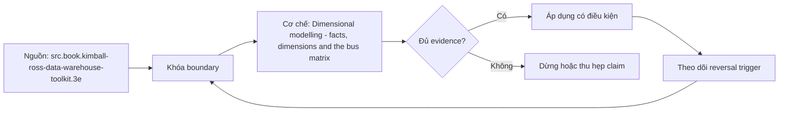

# Dimensional modelling - facts, dimensions and the bus matrix

> [!abstract] Câu hỏi trung tâm
> Facts, dimensions, conformed dimensions và bus matrix ghép thành kiến trúc dimensional có thể tích hợp nhiều business process như thế nào?

## 1. Mục tiêu dimensional model

Dimensional model ưu tiên query usability và performance ở presentation layer. Fact table đặt measurements/events ở declared grain cùng dimension foreign keys; dimension chứa descriptive context, labels và hierarchies. Dimension thường rộng/flat có chủ ý. Điều này không phủ nhận normalization cho operational integrity; hai model phục vụ workload khác.

## 2. Facts và dimensions

Fact thường numeric nhưng không phải mọi number là fact; postcode/account code là descriptors/identifiers. Fact phải đúng grain và có aggregation semantics. Dimension attribute phải đơn trị tại grain; multivalued relation cần bridge hoặc grain khác. Degenerate dimension là transaction identifier nằm trong fact khi không có thêm attributes.

## 3. Conformed dimensions

Dimension conformed có cùng keys, domain values, attribute meanings và governance để lọc/so sánh nhiều fact tables. Hai bảng cùng tên customer nhưng khác definition không conformed. Conformance có thể identical hoặc one là strict subset/rollup có mapping hợp lệ. Owner, change policy và tests quan trọng hơn copy schema.

## 4. Bus matrix

Rows là business processes/fact candidates; columns là dimensions; cells cho biết applicability/role. Matrix là planning/governance artifact: phát hiện common dimensions, delivery increments, gaps và conflicting vocabulary. Nó không thay detailed grain/model. Mỗi row cần grain statement; mỗi column cần definition và steward.

## 5. Integration boundary

Drill-across kết quả từ fact tables riêng qua conformed dimensions, không join two facts trực tiếp ở detail nếu gây many-to-many explosion. Shared date/product/customer cho consistent filters; measures vẫn giữ riêng. Bus matrix phải version theo domain evolution và ghi role-playing dimensions như order date/ship date.

## 6. Ma trận kiểm chứng từng mệnh đề

Mỗi mệnh đề phải được chuyển thành invariant, fixture và phép đối chiếu có thể chạy lại. Sơ đồ đẹp hoặc một truy vấn trả về kết quả không lỗi không tự chứng minh mô hình đúng ngữ nghĩa.

### 6.1. fact measure phải đúng declared grain

**Mệnh đề cần kiểm.** fact measure phải đúng declared grain. **Thiết kế phép kiểm.** Chọn hai business process dùng chung customer, product và date. Viết grain cho từng fact, data dictionary cho dimensions, rồi lập bus matrix và truy vấn drill-across. Đối chứng bằng direct fact-to-fact detail join. Bằng chứng đạt gồm row counts, control totals và chứng minh shared dimension thật sự cùng key/domain/meaning, không chỉ cùng tên cột. **Hồ sơ cần lưu.** Grain/model/metric contract, dữ liệu seed, SQL hoặc notebook, kết quả thô, control totals và giải thích ca biên. Nếu phép kiểm chỉ xác nhận cấu trúc mà không xác nhận semantics, kết luận phải ghi rõ giới hạn đó.

### 6.2. numeric identifier không tự thành measure

**Mệnh đề cần kiểm.** numeric identifier không tự thành measure. **Thiết kế phép kiểm.** Chọn hai business process dùng chung customer, product và date. Viết grain cho từng fact, data dictionary cho dimensions, rồi lập bus matrix và truy vấn drill-across. Đối chứng bằng direct fact-to-fact detail join. Bằng chứng đạt gồm row counts, control totals và chứng minh shared dimension thật sự cùng key/domain/meaning, không chỉ cùng tên cột. **Hồ sơ cần lưu.** Grain/model/metric contract, dữ liệu seed, SQL hoặc notebook, kết quả thô, control totals và giải thích ca biên. Nếu phép kiểm chỉ xác nhận cấu trúc mà không xác nhận semantics, kết luận phải ghi rõ giới hạn đó.

### 6.3. dimension attribute phải đơn trị tại fact grain

**Mệnh đề cần kiểm.** dimension attribute phải đơn trị tại fact grain. **Thiết kế phép kiểm.** Chọn hai business process dùng chung customer, product và date. Viết grain cho từng fact, data dictionary cho dimensions, rồi lập bus matrix và truy vấn drill-across. Đối chứng bằng direct fact-to-fact detail join. Bằng chứng đạt gồm row counts, control totals và chứng minh shared dimension thật sự cùng key/domain/meaning, không chỉ cùng tên cột. **Hồ sơ cần lưu.** Grain/model/metric contract, dữ liệu seed, SQL hoặc notebook, kết quả thô, control totals và giải thích ca biên. Nếu phép kiểm chỉ xác nhận cấu trúc mà không xác nhận semantics, kết luận phải ghi rõ giới hạn đó.

### 6.4. multivalued dimension cần bridge semantics

**Mệnh đề cần kiểm.** multivalued dimension cần bridge semantics. **Thiết kế phép kiểm.** Chọn hai business process dùng chung customer, product và date. Viết grain cho từng fact, data dictionary cho dimensions, rồi lập bus matrix và truy vấn drill-across. Đối chứng bằng direct fact-to-fact detail join. Bằng chứng đạt gồm row counts, control totals và chứng minh shared dimension thật sự cùng key/domain/meaning, không chỉ cùng tên cột. **Hồ sơ cần lưu.** Grain/model/metric contract, dữ liệu seed, SQL hoặc notebook, kết quả thô, control totals và giải thích ca biên. Nếu phép kiểm chỉ xác nhận cấu trúc mà không xác nhận semantics, kết luận phải ghi rõ giới hạn đó.

### 6.5. degenerate dimension không phải fact

**Mệnh đề cần kiểm.** degenerate dimension không phải fact. **Thiết kế phép kiểm.** Chọn hai business process dùng chung customer, product và date. Viết grain cho từng fact, data dictionary cho dimensions, rồi lập bus matrix và truy vấn drill-across. Đối chứng bằng direct fact-to-fact detail join. Bằng chứng đạt gồm row counts, control totals và chứng minh shared dimension thật sự cùng key/domain/meaning, không chỉ cùng tên cột. **Hồ sơ cần lưu.** Grain/model/metric contract, dữ liệu seed, SQL hoặc notebook, kết quả thô, control totals và giải thích ca biên. Nếu phép kiểm chỉ xác nhận cấu trúc mà không xác nhận semantics, kết luận phải ghi rõ giới hạn đó.

### 6.6. conformed dimension cần semantic chứ không chỉ column-name equality

**Mệnh đề cần kiểm.** conformed dimension cần semantic chứ không chỉ column-name equality. **Thiết kế phép kiểm.** Chọn hai business process dùng chung customer, product và date. Viết grain cho từng fact, data dictionary cho dimensions, rồi lập bus matrix và truy vấn drill-across. Đối chứng bằng direct fact-to-fact detail join. Bằng chứng đạt gồm row counts, control totals và chứng minh shared dimension thật sự cùng key/domain/meaning, không chỉ cùng tên cột. **Hồ sơ cần lưu.** Grain/model/metric contract, dữ liệu seed, SQL hoặc notebook, kết quả thô, control totals và giải thích ca biên. Nếu phép kiểm chỉ xác nhận cấu trúc mà không xác nhận semantics, kết luận phải ghi rõ giới hạn đó.

### 6.7. bus matrix row là process không department

**Mệnh đề cần kiểm.** bus matrix row là process không department. **Thiết kế phép kiểm.** Chọn hai business process dùng chung customer, product và date. Viết grain cho từng fact, data dictionary cho dimensions, rồi lập bus matrix và truy vấn drill-across. Đối chứng bằng direct fact-to-fact detail join. Bằng chứng đạt gồm row counts, control totals và chứng minh shared dimension thật sự cùng key/domain/meaning, không chỉ cùng tên cột. **Hồ sơ cần lưu.** Grain/model/metric contract, dữ liệu seed, SQL hoặc notebook, kết quả thô, control totals và giải thích ca biên. Nếu phép kiểm chỉ xác nhận cấu trúc mà không xác nhận semantics, kết luận phải ghi rõ giới hạn đó.

### 6.8. bus matrix cell không thay grain definition

**Mệnh đề cần kiểm.** bus matrix cell không thay grain definition. **Thiết kế phép kiểm.** Chọn hai business process dùng chung customer, product và date. Viết grain cho từng fact, data dictionary cho dimensions, rồi lập bus matrix và truy vấn drill-across. Đối chứng bằng direct fact-to-fact detail join. Bằng chứng đạt gồm row counts, control totals và chứng minh shared dimension thật sự cùng key/domain/meaning, không chỉ cùng tên cột. **Hồ sơ cần lưu.** Grain/model/metric contract, dữ liệu seed, SQL hoặc notebook, kết quả thô, control totals và giải thích ca biên. Nếu phép kiểm chỉ xác nhận cấu trúc mà không xác nhận semantics, kết luận phải ghi rõ giới hạn đó.

### 6.9. role-playing dates dùng một conformed dimension với roles

**Mệnh đề cần kiểm.** role-playing dates dùng một conformed dimension với roles. **Thiết kế phép kiểm.** Chọn hai business process dùng chung customer, product và date. Viết grain cho từng fact, data dictionary cho dimensions, rồi lập bus matrix và truy vấn drill-across. Đối chứng bằng direct fact-to-fact detail join. Bằng chứng đạt gồm row counts, control totals và chứng minh shared dimension thật sự cùng key/domain/meaning, không chỉ cùng tên cột. **Hồ sơ cần lưu.** Grain/model/metric contract, dữ liệu seed, SQL hoặc notebook, kết quả thô, control totals và giải thích ca biên. Nếu phép kiểm chỉ xác nhận cấu trúc mà không xác nhận semantics, kết luận phải ghi rõ giới hạn đó.

### 6.10. fact-to-fact detail join dễ tạo many-to-many explosion

**Mệnh đề cần kiểm.** fact-to-fact detail join dễ tạo many-to-many explosion. **Thiết kế phép kiểm.** Chọn hai business process dùng chung customer, product và date. Viết grain cho từng fact, data dictionary cho dimensions, rồi lập bus matrix và truy vấn drill-across. Đối chứng bằng direct fact-to-fact detail join. Bằng chứng đạt gồm row counts, control totals và chứng minh shared dimension thật sự cùng key/domain/meaning, không chỉ cùng tên cột. **Hồ sơ cần lưu.** Grain/model/metric contract, dữ liệu seed, SQL hoặc notebook, kết quả thô, control totals và giải thích ca biên. Nếu phép kiểm chỉ xác nhận cấu trúc mà không xác nhận semantics, kết luận phải ghi rõ giới hạn đó.

### 6.11. drill-across aggregate theo shared dimensions

**Mệnh đề cần kiểm.** drill-across aggregate theo shared dimensions. **Thiết kế phép kiểm.** Chọn hai business process dùng chung customer, product và date. Viết grain cho từng fact, data dictionary cho dimensions, rồi lập bus matrix và truy vấn drill-across. Đối chứng bằng direct fact-to-fact detail join. Bằng chứng đạt gồm row counts, control totals và chứng minh shared dimension thật sự cùng key/domain/meaning, không chỉ cùng tên cột. **Hồ sơ cần lưu.** Grain/model/metric contract, dữ liệu seed, SQL hoặc notebook, kết quả thô, control totals và giải thích ca biên. Nếu phép kiểm chỉ xác nhận cấu trúc mà không xác nhận semantics, kết luận phải ghi rõ giới hạn đó.

### 6.12. dimension denormalization là intentional presentation choice

**Mệnh đề cần kiểm.** dimension denormalization là intentional presentation choice. **Thiết kế phép kiểm.** Chọn hai business process dùng chung customer, product và date. Viết grain cho từng fact, data dictionary cho dimensions, rồi lập bus matrix và truy vấn drill-across. Đối chứng bằng direct fact-to-fact detail join. Bằng chứng đạt gồm row counts, control totals và chứng minh shared dimension thật sự cùng key/domain/meaning, không chỉ cùng tên cột. **Hồ sơ cần lưu.** Grain/model/metric contract, dữ liệu seed, SQL hoặc notebook, kết quả thô, control totals và giải thích ca biên. Nếu phép kiểm chỉ xác nhận cấu trúc mà không xác nhận semantics, kết luận phải ghi rõ giới hạn đó.

### 6.13. unknown members cần conformed handling

**Mệnh đề cần kiểm.** unknown members cần conformed handling. **Thiết kế phép kiểm.** Chọn hai business process dùng chung customer, product và date. Viết grain cho từng fact, data dictionary cho dimensions, rồi lập bus matrix và truy vấn drill-across. Đối chứng bằng direct fact-to-fact detail join. Bằng chứng đạt gồm row counts, control totals và chứng minh shared dimension thật sự cùng key/domain/meaning, không chỉ cùng tên cột. **Hồ sơ cần lưu.** Grain/model/metric contract, dữ liệu seed, SQL hoặc notebook, kết quả thô, control totals và giải thích ca biên. Nếu phép kiểm chỉ xác nhận cấu trúc mà không xác nhận semantics, kết luận phải ghi rõ giới hạn đó.

### 6.14. slowly changing policy phải nhất quán qua facts

**Mệnh đề cần kiểm.** slowly changing policy phải nhất quán qua facts. **Thiết kế phép kiểm.** Chọn hai business process dùng chung customer, product và date. Viết grain cho từng fact, data dictionary cho dimensions, rồi lập bus matrix và truy vấn drill-across. Đối chứng bằng direct fact-to-fact detail join. Bằng chứng đạt gồm row counts, control totals và chứng minh shared dimension thật sự cùng key/domain/meaning, không chỉ cùng tên cột. **Hồ sơ cần lưu.** Grain/model/metric contract, dữ liệu seed, SQL hoặc notebook, kết quả thô, control totals và giải thích ca biên. Nếu phép kiểm chỉ xác nhận cấu trúc mà không xác nhận semantics, kết luận phải ghi rõ giới hạn đó.

### 6.15. matrix cần owner/version/change review

**Mệnh đề cần kiểm.** matrix cần owner/version/change review. **Thiết kế phép kiểm.** Chọn hai business process dùng chung customer, product và date. Viết grain cho từng fact, data dictionary cho dimensions, rồi lập bus matrix và truy vấn drill-across. Đối chứng bằng direct fact-to-fact detail join. Bằng chứng đạt gồm row counts, control totals và chứng minh shared dimension thật sự cùng key/domain/meaning, không chỉ cùng tên cột. **Hồ sơ cần lưu.** Grain/model/metric contract, dữ liệu seed, SQL hoặc notebook, kết quả thô, control totals và giải thích ca biên. Nếu phép kiểm chỉ xác nhận cấu trúc mà không xác nhận semantics, kết luận phải ghi rõ giới hạn đó.

## 7. Quy trình phản biện mô hình

1. Viết business question, grain, identity, time semantics và invariant trước khi vẽ bảng.
2. Chỉ ra owner của định nghĩa và artifact nào là canonical.
3. Tách source fact, quyết định thiết kế và curriculum synthesis; không gán suy luận cho sách.
4. Dựng ca biên tối thiểu: duplicate, null, late correction, code reuse, many-to-many hoặc missing period tuỳ bài.
5. Đo row count, distinct business key, unmatched rate và control totals trước–sau mỗi phép biến đổi.
6. Thử replay/backfill và đổi cutoff; thiết kế không tái chạy được chưa đủ bằng chứng để vận hành.
7. Lưu quyết định, phản ví dụ và giới hạn; không xoá failed run vì nó là bằng chứng của failure boundary.

## 8. Câu hỏi tự kiểm tra

1. Row đại diện điều gì, được nhận dạng bằng gì và có hiệu lực khi nào?
2. Ca biên nhỏ nhất nào làm thiết kế cho ra số sai nhưng SQL vẫn hợp lệ?
3. Constraint/test nào bắt lỗi cấu trúc, và phần ngữ nghĩa nào vẫn cần owner xác nhận?
4. Late data, correction, replay và backfill làm model thay đổi ra sao?
5. Phần nào đến trực tiếp từ nguồn; phần nào là tổng hợp của giáo trình?
6. Artifact và phép kiểm nào cho phép người khác bác bỏ kết luận?

## 9. Giới hạn và điều chưa cho phép kết luận

- Chưa chạy profiling, merge/backfill hay reconciliation lab; các phép kiểm trong note là giao thức cần thực thi, không phải kết quả đã đo.
- Sample không có duplicate không chứng minh business uniqueness; schema hợp lệ không chứng minh đúng grain.
- HCMUT System Modeling cung cấp khung abstraction/perspective; phép ánh xạ conceptual–logical–physical trong bài là synthesis có ghi nhãn.
- DDIA và Silberschatz cung cấp ranh giới data model/database design; taxonomy dimensional chi tiết lấy Kimball–Ross làm nguồn chính.
- Không suy performance, dung lượng, threshold hoặc production readiness nếu chưa đo trên workload và engine mục tiêu.

## Reference
1. [[SRC-KIMBALL-ROSS-DW-TOOLKIT-3E]]
2. [[SRC-SILBERSCHATZ-DATABASE-SYSTEM-CONCEPTS-7E]]
3. [[SRC-KLEPPMANN-DDIA-1E]]

## Source coverage

| Source slice | Nội dung sử dụng | Trạng thái |
|---|---|---|
| [[SRC-KIMBALL-ROSS-DW-TOOLKIT-3E]] | Khái niệm, ranh giới và phản ví dụ liên quan đến bài | Đã đọc phạm vi có locator; không suy nội dung ngoài phạm vi |
| [[SRC-SILBERSCHATZ-DATABASE-SYSTEM-CONCEPTS-7E]] | Khái niệm, ranh giới và phản ví dụ liên quan đến bài | Đã đọc phạm vi có locator; không suy nội dung ngoài phạm vi |
| [[SRC-KLEPPMANN-DDIA-1E]] | Khái niệm, ranh giới và phản ví dụ liên quan đến bài | Đã đọc phạm vi có locator; không suy nội dung ngoài phạm vi |

## Key takeaways
- Bắt đầu từ business question, grain, identity, time và invariant; cột là hệ quả, không phải điểm xuất phát.
- Tách ngữ nghĩa, logical constraints và physical implementation để thay đổi có traceability.
- Key duy nhất, SQL chạy được hoặc diagram đẹp không tự chứng minh mô hình đúng.
- Mọi measure cần aggregation contract theo grain, dimension, unit, cutoff và late-data policy.
- Chưa chạy phép kiểm thì note là tài liệu học thuật đã truy nguồn, không phải chứng nhận production.

<!-- ATOMIC-EXECUTION-CAPSULE:START -->

## Execution capsule — kiểm chứng `wiki.data-modeling.facts-dimensions-bus-matrix`

> [!important] Phân loại mệnh đề
> Với `wiki.data-modeling.facts-dimensions-bus-matrix`, sơ đồ, ví dụ và artifact về **Dimensional modelling - facts, dimensions and the bus matrix** là **synthesis để kiểm chứng**; chúng không phải trích dẫn hay case nguyên văn của nguồn.

### Sơ đồ cơ chế và điểm kiểm soát



Đọc sơ đồ `wiki.data-modeling.facts-dimensions-bus-matrix` từ trái sang phải: source chỉ cung cấp claim ban đầu cho **Dimensional modelling - facts, dimensions and the bus matrix**; quyết định chỉ được đi tiếp sau khi boundary, evidence và điều kiện đảo quyết định đã hiện hữu.

### Artifact thực thi tối thiểu

```sql
-- Verification harness for: Dimensional modelling - facts, dimensions and the bus matrix
WITH evidence AS (
    SELECT 'wiki.data-modeling.facts-dimensions-bus-matrix' AS concept_id,
           'boundary_declared' AS check_name, 1 AS passed
    UNION ALL
    SELECT 'wiki.data-modeling.facts-dimensions-bus-matrix', 'independent_oracle', 1
    UNION ALL
    SELECT 'wiki.data-modeling.facts-dimensions-bus-matrix', 'reversal_trigger_recorded', 1
)
SELECT concept_id,
       MIN(passed) AS all_hard_checks_pass,
       COUNT(*) AS evidence_items
FROM evidence
GROUP BY concept_id
HAVING MIN(passed) = 1;
```

Artifact của `wiki.data-modeling.facts-dimensions-bus-matrix` buộc người dùng ghi boundary, oracle và reversal trigger cho **Dimensional modelling - facts, dimensions and the bus matrix**. Các giá trị minh họa phải được thay bằng evidence thật trước khi dùng cho quyết định.

### Tự kiểm tra trước khi tái sử dụng

1. Bạn có thể trả lời `Facts, dimensions, conformed dimensions và bus matrix ghép thành kiến trúc dimensional có thể tích hợp nhiều business process như thế nào?` bằng một câu mà không kéo thêm concept thứ hai không?
2. Source locator nào đỡ cho claim, và phần nào chỉ là synthesis trong note?
3. Observation nào khiến bạn dừng, thu hẹp hoặc đảo quyết định?
4. Artifact nào cho phép một reviewer độc lập tái hiện kết quả?

<!-- ATOMIC-EXECUTION-CAPSULE:END -->
