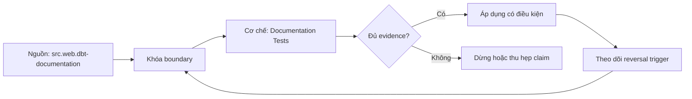

# Documentation Tests

> [!abstract] Câu hỏi trung tâm
> Làm sao biến tài liệu data product thành artifact có bốn nhóm kiểm tự động, mutation tests và merge gate nhưng vẫn giữ phần review cần phán đoán của con người?

## 1. Test contract thay vì test file tồn tại

Một README tồn tại hoặc site docs build thành công chỉ chứng minh pipeline tạo được artifact. Documentation test phải nối public contract với nội dung được công bố và hành vi người dùng. Bốn nhóm tối thiểu của bài là public-field coverage, executable examples, semantic-reference integrity và freshness-promise consistency. Mỗi rule có stable code, severity, owner, input artifacts, failure message và remediation link. Rule phải chỉ ra field/query/metric/schedule cụ thể; thông báo “docs invalid” không đủ để sửa.

## 2. Public-field coverage

Lấy public surface từ contract hoặc versioned schema, không từ toàn warehouse relation. So stable field IDs/names với description records; reject missing, placeholder, copy-paste trùng hoặc description không có business meaning theo policy. dbt introspection có thể hiện undocumented columns, vì vậy generated page vẫn cần completeness assertion. Khi field được remove/rename, docs entry cũ phải deprecate hoặc xóa theo version; orphan descriptions cũng là drift. Sensitive/internal fields không được ép document công khai chỉ để đạt coverage.

## 3. Executable examples

Extract code blocks được đánh dấu runnable, dựng environment/fixture và chạy bằng read-only principal. Assert parse/compile, execution, non-empty khi contract hứa có data, expected columns/types, grain/uniqueness và một semantic control total. Ví dụ parameterized phải có safe defaults; time-relative query cần fixed clock hoặc bounded assertion để tránh flaky. Test không chạy unrestricted query trên production. Snapshot output quá rộng dễ che drift; assertion chọn property liên quan mục đích ví dụ.

## 4. Semantic reference integrity

Mọi metric, dimension, enum, glossary term, owner và product version được nhắc phải resolve stable ID trong registry hiện hành. Text matching tên hiển thị không đủ vì rename/alias. Deprecated reference có thể cho warning trong cửa sổ nhưng fail sau deadline. Kiểm dependency graph phát hiện broken anchor, missing target và circular navigation; semantic meaning vẫn cần human review. Một metric tồn tại nhưng docs mô tả sai population không bị existence test phát hiện, nên semantic regression hoặc owner attestation vẫn cần.

## 5. Freshness promise consistency

Machine-readable docs promise gồm schedule/timezone, expected cutoff, SLO window, holiday/backfill semantics và incident behavior. So với orchestrator/config/service-level artifact, không so với một run gần nhất. Schedule match không chứng minh data thật sự fresh; operational monitor kiểm observed freshness là lớp khác. Nếu pipeline đổi từ hourly sang daily mà docs vẫn hourly, gate phải fail trong cùng change. Nếu emergency override có expiry, docs hiển thị trạng thái tạm và quay lại tự động.

## 6. Mutation testing và cửa chặn

Tiêm bốn mutations độc lập: public column không description; example query hỏng hoặc sai grain; metric ID đã retire; schedule thay không cập nhật promise. Mỗi mutation phải fail đúng rule code, còn baseline sạch phải pass. False positive/negative được lưu để cải tiến rules. GitHub required status check có thể chặn merge khi CI fail, nhưng chỉ sau khi branch protection cấu hình đúng; một job optional xanh/đỏ không tạo gate. Kiểm cả bypass authority và audit trail để tránh rule chỉ áp với contributor thường.

## 7. Ba phần bắt buộc review người

Thứ nhất, liệu discovery/context có trả đúng user need và tránh ngôn ngữ mơ hồ. Thứ hai, interpretation limits, causal caveat, trade-off và design rationale có đầy đủ hay không. Thứ ba, ví dụ có đại diện use case, dễ dùng và không khuyến khích practice nguy hiểm. Automated lint hỗ trợ nhưng không chứng minh clarity hoặc truth. Review có checklist, named reviewer, exact artifact hash và expiry; “đã đọc” không phải evidence. Escaped documentation defect phải tạo regression rule nếu có thể tự động hóa mà không làm rule quá nhiễu.

## 8. Ma trận kiểm chứng từng mệnh đề

Mỗi mệnh đề dưới đây cần artifact hoặc observation lưu được. Một trang tài liệu tồn tại, catalog có search box hoặc người dùng nói ‘dễ’ không tự là bằng chứng.

### 8.1. file existence không chứng minh documentation correctness

**Mệnh đề cần kiểm.** file existence không chứng minh documentation correctness.

**Cách kiểm.** Chạy baseline sạch rồi tiêm riêng bốn mutations: public field thiếu mô tả, example sai, retired metric và freshness promise lệch schedule. Mỗi mutation phải fail đúng stable rule code trong required merge gate; human-review findings được tách riêng. Với mệnh đề này, ghi participant/task hoặc artifact version, điều kiện đầu vào, expected observation, failure signal và yếu tố làm kết luận không còn đúng.

**Bằng chứng đạt cho `wiki.data-product.documentation-tests`.** Lưu protocol hoặc command, raw observations, numerator/denominator nếu có, exact product/docs version, reviewer và artifact hash. Nếu chưa chạy study/lab, chỉ ghi đây là protocol; không biến expected result thành kết quả quan sát.

### 8.2. public surface là oracle cho field coverage

**Mệnh đề cần kiểm.** public surface là oracle cho field coverage.

**Cách kiểm.** Chạy baseline sạch rồi tiêm riêng bốn mutations: public field thiếu mô tả, example sai, retired metric và freshness promise lệch schedule. Mỗi mutation phải fail đúng stable rule code trong required merge gate; human-review findings được tách riêng. Với mệnh đề này, ghi participant/task hoặc artifact version, điều kiện đầu vào, expected observation, failure signal và yếu tố làm kết luận không còn đúng.

**Bằng chứng đạt cho `wiki.data-product.documentation-tests`.** Lưu protocol hoặc command, raw observations, numerator/denominator nếu có, exact product/docs version, reviewer và artifact hash. Nếu chưa chạy study/lab, chỉ ghi đây là protocol; không biến expected result thành kết quả quan sát.

### 8.3. generated docs có thể chứa undocumented columns

**Mệnh đề cần kiểm.** generated docs có thể chứa undocumented columns.

**Cách kiểm.** Chạy baseline sạch rồi tiêm riêng bốn mutations: public field thiếu mô tả, example sai, retired metric và freshness promise lệch schedule. Mỗi mutation phải fail đúng stable rule code trong required merge gate; human-review findings được tách riêng. Với mệnh đề này, ghi participant/task hoặc artifact version, điều kiện đầu vào, expected observation, failure signal và yếu tố làm kết luận không còn đúng.

**Bằng chứng đạt cho `wiki.data-product.documentation-tests`.** Lưu protocol hoặc command, raw observations, numerator/denominator nếu có, exact product/docs version, reviewer và artifact hash. Nếu chưa chạy study/lab, chỉ ghi đây là protocol; không biến expected result thành kết quả quan sát.

### 8.4. orphan description cũng là drift

**Mệnh đề cần kiểm.** orphan description cũng là drift.

**Cách kiểm.** Chạy baseline sạch rồi tiêm riêng bốn mutations: public field thiếu mô tả, example sai, retired metric và freshness promise lệch schedule. Mỗi mutation phải fail đúng stable rule code trong required merge gate; human-review findings được tách riêng. Với mệnh đề này, ghi participant/task hoặc artifact version, điều kiện đầu vào, expected observation, failure signal và yếu tố làm kết luận không còn đúng.

**Bằng chứng đạt cho `wiki.data-product.documentation-tests`.** Lưu protocol hoặc command, raw observations, numerator/denominator nếu có, exact product/docs version, reviewer và artifact hash. Nếu chưa chạy study/lab, chỉ ghi đây là protocol; không biến expected result thành kết quả quan sát.

### 8.5. runnable example cần read-only fixture

**Mệnh đề cần kiểm.** runnable example cần read-only fixture.

**Cách kiểm.** Chạy baseline sạch rồi tiêm riêng bốn mutations: public field thiếu mô tả, example sai, retired metric và freshness promise lệch schedule. Mỗi mutation phải fail đúng stable rule code trong required merge gate; human-review findings được tách riêng. Với mệnh đề này, ghi participant/task hoặc artifact version, điều kiện đầu vào, expected observation, failure signal và yếu tố làm kết luận không còn đúng.

**Bằng chứng đạt cho `wiki.data-product.documentation-tests`.** Lưu protocol hoặc command, raw observations, numerator/denominator nếu có, exact product/docs version, reviewer và artifact hash. Nếu chưa chạy study/lab, chỉ ghi đây là protocol; không biến expected result thành kết quả quan sát.

### 8.6. example assertion kiểm grain và semantics

**Mệnh đề cần kiểm.** example assertion kiểm grain và semantics.

**Cách kiểm.** Chạy baseline sạch rồi tiêm riêng bốn mutations: public field thiếu mô tả, example sai, retired metric và freshness promise lệch schedule. Mỗi mutation phải fail đúng stable rule code trong required merge gate; human-review findings được tách riêng. Với mệnh đề này, ghi participant/task hoặc artifact version, điều kiện đầu vào, expected observation, failure signal và yếu tố làm kết luận không còn đúng.

**Bằng chứng đạt cho `wiki.data-product.documentation-tests`.** Lưu protocol hoặc command, raw observations, numerator/denominator nếu có, exact product/docs version, reviewer và artifact hash. Nếu chưa chạy study/lab, chỉ ghi đây là protocol; không biến expected result thành kết quả quan sát.

### 8.7. time-relative example cần fixed clock

**Mệnh đề cần kiểm.** time-relative example cần fixed clock.

**Cách kiểm.** Chạy baseline sạch rồi tiêm riêng bốn mutations: public field thiếu mô tả, example sai, retired metric và freshness promise lệch schedule. Mỗi mutation phải fail đúng stable rule code trong required merge gate; human-review findings được tách riêng. Với mệnh đề này, ghi participant/task hoặc artifact version, điều kiện đầu vào, expected observation, failure signal và yếu tố làm kết luận không còn đúng.

**Bằng chứng đạt cho `wiki.data-product.documentation-tests`.** Lưu protocol hoặc command, raw observations, numerator/denominator nếu có, exact product/docs version, reviewer và artifact hash. Nếu chưa chạy study/lab, chỉ ghi đây là protocol; không biến expected result thành kết quả quan sát.

### 8.8. metric references resolve stable IDs

**Mệnh đề cần kiểm.** metric references resolve stable IDs.

**Cách kiểm.** Chạy baseline sạch rồi tiêm riêng bốn mutations: public field thiếu mô tả, example sai, retired metric và freshness promise lệch schedule. Mỗi mutation phải fail đúng stable rule code trong required merge gate; human-review findings được tách riêng. Với mệnh đề này, ghi participant/task hoặc artifact version, điều kiện đầu vào, expected observation, failure signal và yếu tố làm kết luận không còn đúng.

**Bằng chứng đạt cho `wiki.data-product.documentation-tests`.** Lưu protocol hoặc command, raw observations, numerator/denominator nếu có, exact product/docs version, reviewer và artifact hash. Nếu chưa chạy study/lab, chỉ ghi đây là protocol; không biến expected result thành kết quả quan sát.

### 8.9. existence test không phát hiện wrong population

**Mệnh đề cần kiểm.** existence test không phát hiện wrong population.

**Cách kiểm.** Chạy baseline sạch rồi tiêm riêng bốn mutations: public field thiếu mô tả, example sai, retired metric và freshness promise lệch schedule. Mỗi mutation phải fail đúng stable rule code trong required merge gate; human-review findings được tách riêng. Với mệnh đề này, ghi participant/task hoặc artifact version, điều kiện đầu vào, expected observation, failure signal và yếu tố làm kết luận không còn đúng.

**Bằng chứng đạt cho `wiki.data-product.documentation-tests`.** Lưu protocol hoặc command, raw observations, numerator/denominator nếu có, exact product/docs version, reviewer và artifact hash. Nếu chưa chạy study/lab, chỉ ghi đây là protocol; không biến expected result thành kết quả quan sát.

### 8.10. freshness promise khác observed freshness

**Mệnh đề cần kiểm.** freshness promise khác observed freshness.

**Cách kiểm.** Chạy baseline sạch rồi tiêm riêng bốn mutations: public field thiếu mô tả, example sai, retired metric và freshness promise lệch schedule. Mỗi mutation phải fail đúng stable rule code trong required merge gate; human-review findings được tách riêng. Với mệnh đề này, ghi participant/task hoặc artifact version, điều kiện đầu vào, expected observation, failure signal và yếu tố làm kết luận không còn đúng.

**Bằng chứng đạt cho `wiki.data-product.documentation-tests`.** Lưu protocol hoặc command, raw observations, numerator/denominator nếu có, exact product/docs version, reviewer và artifact hash. Nếu chưa chạy study/lab, chỉ ghi đây là protocol; không biến expected result thành kết quả quan sát.

### 8.11. schedule change phải cập nhật docs trong same change

**Mệnh đề cần kiểm.** schedule change phải cập nhật docs trong same change.

**Cách kiểm.** Chạy baseline sạch rồi tiêm riêng bốn mutations: public field thiếu mô tả, example sai, retired metric và freshness promise lệch schedule. Mỗi mutation phải fail đúng stable rule code trong required merge gate; human-review findings được tách riêng. Với mệnh đề này, ghi participant/task hoặc artifact version, điều kiện đầu vào, expected observation, failure signal và yếu tố làm kết luận không còn đúng.

**Bằng chứng đạt cho `wiki.data-product.documentation-tests`.** Lưu protocol hoặc command, raw observations, numerator/denominator nếu có, exact product/docs version, reviewer và artifact hash. Nếu chưa chạy study/lab, chỉ ghi đây là protocol; không biến expected result thành kết quả quan sát.

### 8.12. mỗi mutation fail đúng rule code

**Mệnh đề cần kiểm.** mỗi mutation fail đúng rule code.

**Cách kiểm.** Chạy baseline sạch rồi tiêm riêng bốn mutations: public field thiếu mô tả, example sai, retired metric và freshness promise lệch schedule. Mỗi mutation phải fail đúng stable rule code trong required merge gate; human-review findings được tách riêng. Với mệnh đề này, ghi participant/task hoặc artifact version, điều kiện đầu vào, expected observation, failure signal và yếu tố làm kết luận không còn đúng.

**Bằng chứng đạt cho `wiki.data-product.documentation-tests`.** Lưu protocol hoặc command, raw observations, numerator/denominator nếu có, exact product/docs version, reviewer và artifact hash. Nếu chưa chạy study/lab, chỉ ghi đây là protocol; không biến expected result thành kết quả quan sát.

### 8.13. status check chỉ là gate khi required

**Mệnh đề cần kiểm.** status check chỉ là gate khi required.

**Cách kiểm.** Chạy baseline sạch rồi tiêm riêng bốn mutations: public field thiếu mô tả, example sai, retired metric và freshness promise lệch schedule. Mỗi mutation phải fail đúng stable rule code trong required merge gate; human-review findings được tách riêng. Với mệnh đề này, ghi participant/task hoặc artifact version, điều kiện đầu vào, expected observation, failure signal và yếu tố làm kết luận không còn đúng.

**Bằng chứng đạt cho `wiki.data-product.documentation-tests`.** Lưu protocol hoặc command, raw observations, numerator/denominator nếu có, exact product/docs version, reviewer và artifact hash. Nếu chưa chạy study/lab, chỉ ghi đây là protocol; không biến expected result thành kết quả quan sát.

### 8.14. human review giữ interpretation and clarity

**Mệnh đề cần kiểm.** human review giữ interpretation and clarity.

**Cách kiểm.** Chạy baseline sạch rồi tiêm riêng bốn mutations: public field thiếu mô tả, example sai, retired metric và freshness promise lệch schedule. Mỗi mutation phải fail đúng stable rule code trong required merge gate; human-review findings được tách riêng. Với mệnh đề này, ghi participant/task hoặc artifact version, điều kiện đầu vào, expected observation, failure signal và yếu tố làm kết luận không còn đúng.

**Bằng chứng đạt cho `wiki.data-product.documentation-tests`.** Lưu protocol hoặc command, raw observations, numerator/denominator nếu có, exact product/docs version, reviewer và artifact hash. Nếu chưa chạy study/lab, chỉ ghi đây là protocol; không biến expected result thành kết quả quan sát.

### 8.15. review gắn exact artifact hash

**Mệnh đề cần kiểm.** review gắn exact artifact hash.

**Cách kiểm.** Chạy baseline sạch rồi tiêm riêng bốn mutations: public field thiếu mô tả, example sai, retired metric và freshness promise lệch schedule. Mỗi mutation phải fail đúng stable rule code trong required merge gate; human-review findings được tách riêng. Với mệnh đề này, ghi participant/task hoặc artifact version, điều kiện đầu vào, expected observation, failure signal và yếu tố làm kết luận không còn đúng.

**Bằng chứng đạt cho `wiki.data-product.documentation-tests`.** Lưu protocol hoặc command, raw observations, numerator/denominator nếu có, exact product/docs version, reviewer và artifact hash. Nếu chưa chạy study/lab, chỉ ghi đây là protocol; không biến expected result thành kết quả quan sát.

## 9. Quy trình phản biện

1. Viết user need, task, persona, stakes và scope trước khi chọn catalog, tài liệu hoặc metric.
2. Tách source fact, curriculum synthesis, organizational policy và observation từ study.
3. Khóa task/protocol/oracle trước khi đo; mọi deviation phải được ghi.
4. Kiểm correct outcome và interpretation, không chỉ completion hoặc cảm nhận.
5. Phân loại lỗi theo cơ chế để sửa đúng lớp: metadata, docs, interface, trust, access hay skill.
6. Kiểm changed user group, changed task và degraded state trước khi khái quát.
7. Chưa có execution evidence thì giữ trạng thái `review`.

## 10. Câu hỏi tự kiểm tra

1. User task nào đang được hỗ trợ, và điều gì nằm ngoài scope?
2. Oracle nào xác định product hoặc kết quả đúng?
3. Số đo dùng denominator nào và loại invalid attempt theo rule nào?
4. Điểm nào cần automation, điểm nào bắt buộc human judgment?
5. Một kết quả nhanh nhưng sai nghĩa được phát hiện ở đâu?
6. Điều kiện nào làm kết luận từ sample hoặc catalog hiện tại không còn áp dụng?

## 11. Giới hạn và điều chưa cho phép kết luận

- Chưa chạy user study, catalog experiment, documentation CI hoặc support-boundary exercise; note mô tả protocol và expected evidence.
- Tài liệu web được kiểm ngày 2026-10-01; tính năng, giao diện, license và guidance có thể đổi.
- Bốn tầng documentation, bốn điều kiện self-service và bốn số đo của module là curriculum synthesis; không gán nguyên văn cho một nguồn.
- Cỡ mẫu nhỏ cho formative discovery không cho phép kết luận tỷ lệ toàn population hoặc statistical significance.
- Dữ liệu người tham gia, recording và screen capture cần consent, minimization, retention và access controls riêng.
- Note giữ trạng thái `review` cho tới khi chủ dự án duyệt semantic meaning.

## Reference
1. [[SRC-DBT-DOCUMENTATION]]
2. [[SRC-GITHUB-STATUS-CHECKS]]
3. [[SRC-SOMMERVILLE-SOFTWARE-ENGINEERING-10E]]

## Source coverage

| Source slice | Nội dung sử dụng | Trạng thái |
|---|---|---|
| [[SRC-DBT-DOCUMENTATION]] | Khái niệm, mechanism hoặc study boundary liên quan | Đã đọc locator trong source record; không suy ngoài phạm vi |
| [[SRC-GITHUB-STATUS-CHECKS]] | Khái niệm, mechanism hoặc study boundary liên quan | Đã đọc locator trong source record; không suy ngoài phạm vi |
| [[SRC-SOMMERVILLE-SOFTWARE-ENGINEERING-10E]] | Khái niệm, mechanism hoặc study boundary liên quan | Đã đọc locator trong source record; không suy ngoài phạm vi |

## Key takeaways
- Test contract/docs behavior bằng mutations và required gate; clarity cùng interpretation vẫn cần người review.
- Chỉ số phải gắn task, persona, product version, protocol và denominator.
- Correct completion gồm cả kết quả và cách diễn giải đúng; confident-wrong là failure nghiêm trọng.
- Công cụ catalog, docs generator và CI cung cấp mechanism, không tự chứng minh outcome.
- Chưa chạy study hoặc lab thì artifact là tài liệu học thuật đã kiểm cấu trúc, không phải chứng nhận thực tế.

<!-- ATOMIC-EXECUTION-CAPSULE:START -->

## Execution capsule — kiểm chứng `wiki.data-product.documentation-tests`

> [!important] Phân loại mệnh đề
> Với `wiki.data-product.documentation-tests`, sơ đồ, ví dụ và artifact về **Documentation Tests** là **synthesis để kiểm chứng**; chúng không phải trích dẫn hay case nguyên văn của nguồn.

### Sơ đồ cơ chế và điểm kiểm soát



Đọc sơ đồ `wiki.data-product.documentation-tests` từ trái sang phải: source chỉ cung cấp claim ban đầu cho **Documentation Tests**; quyết định chỉ được đi tiếp sau khi boundary, evidence và điều kiện đảo quyết định đã hiện hữu.

### Artifact thực thi tối thiểu

```sql
-- Verification harness for: Documentation Tests
WITH evidence AS (
    SELECT 'wiki.data-product.documentation-tests' AS concept_id,
           'boundary_declared' AS check_name, 1 AS passed
    UNION ALL
    SELECT 'wiki.data-product.documentation-tests', 'independent_oracle', 1
    UNION ALL
    SELECT 'wiki.data-product.documentation-tests', 'reversal_trigger_recorded', 1
)
SELECT concept_id,
       MIN(passed) AS all_hard_checks_pass,
       COUNT(*) AS evidence_items
FROM evidence
GROUP BY concept_id
HAVING MIN(passed) = 1;
```

Artifact của `wiki.data-product.documentation-tests` buộc người dùng ghi boundary, oracle và reversal trigger cho **Documentation Tests**. Các giá trị minh họa phải được thay bằng evidence thật trước khi dùng cho quyết định.

### Tự kiểm tra trước khi tái sử dụng

1. Bạn có thể trả lời `Làm sao biến tài liệu data product thành artifact có bốn nhóm kiểm tự động, mutation tests và merge gate nhưng vẫn giữ phần review cần phán đoán của con người?` bằng một câu mà không kéo thêm concept thứ hai không?
2. Source locator nào đỡ cho claim, và phần nào chỉ là synthesis trong note?
3. Observation nào khiến bạn dừng, thu hẹp hoặc đảo quyết định?
4. Artifact nào cho phép một reviewer độc lập tái hiện kết quả?

<!-- ATOMIC-EXECUTION-CAPSULE:END -->
