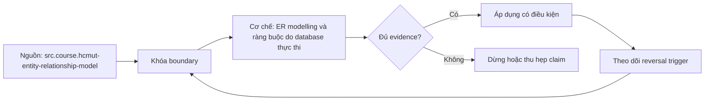

# ER modelling và ràng buộc do database thực thi

> [!abstract] Câu hỏi trung tâm
> Từ noun/verb/rule trong nghiệp vụ, làm sao xác định entity, relationship, cardinality, participation và chuyển chúng thành schema có thể bác bỏ dữ liệu sai bằng phép thử?

## 1. Conceptual model trước table

ER model mô tả domain độc lập tương đối với DBMS. Entity là thứ có identity riêng; attribute mô tả nó; relationship liên kết các entity theo rule. Không biến mọi danh từ thành table và mọi động từ thành cột. Cần hỏi lifecycle, identity, ownership, optionality và history.

Tên phải theo ubiquitous language đã xác nhận. `Order`, `OrderLine`, `Product` khác nghĩa; “customer” có thể là account, legal party hoặc contact. Nếu từ vựng mơ hồ, schema chính xác về cú pháp vẫn sai domain.

## 2. Entity và value object

Entity được nhận dạng xuyên thời gian dù thuộc tính đổi. Value object được xác định bởi giá trị và thường không có identity độc lập. Address có thể là snapshot trên order hoặc entity dùng lại; hai lựa chọn cho lifecycle/update semantics khác nhau.

Chọn key dựa trên identity rule. Surrogate key hữu ích cho reference ổn định, nhưng alternate natural key vẫn phải được ghi/enforce nếu domain cấm trùng. Không chọn auto-increment rồi coi bài toán identity đã xong.

## 3. Attribute và domain

Mỗi attribute cần type, unit, nullability, valid range, default semantics và sensitivity. `amount numeric` thiếu currency; `timestamp` thiếu timezone/meaning; `status text` thiếu allowed transitions. Derived attribute có thể tính thay vì lưu; nếu lưu để tối ưu, phải có writer/repair rule.

Multi-valued attribute thường thành relation riêng. Composite attribute có thể tách theo nhu cầu query/constraint. Không nhồi danh sách ID vào CSV/JSON nếu cần referential integrity và join độc lập.

## 4. Cardinality và participation

Cardinality ratio nêu maximum: 1:1, 1:N, M:N. Participation nêu minimum: bắt buộc hay tùy chọn. Hai khái niệm không thay nhau. “Một order có ít nhất một line” không được bảo đảm chỉ bằng FK từ line tới order; FK bảo đảm line có order, nhưng không bảo đảm order có line sau commit nếu workflow cho phép tạo order trước.

Ghi min..max ở cả hai phía và câu nghiệp vụ. Với temporal state, rule có thể khác theo status; draft order rỗng hợp lệ nhưng submitted order phải có line, đòi transaction/workflow constraint.

## 5. Quan hệ 1:1

Đặt FK ở phía phụ thuộc/optional, thêm UNIQUE để giới hạn một row. PK-as-FK phù hợp extension table có cùng lifecycle. Nếu không UNIQUE, schema thực tế là 1:N dù diagram ghi 1:1.

Hai table 1:1 có lý do khi security, optional large payload, lifecycle hoặc subtype khác. Tách chỉ vì “nhiều cột” có thể tăng join mà không có boundary thật.

## 6. Quan hệ 1:N

FK nằm ở phía N. Nullability thể hiện optional participation của child với parent. Index FK thường cần cho join và parent delete/update performance, nhưng PostgreSQL không tự động tạo index trên referencing columns; phải đo và thêm theo workload.

FK type/column order phải tương thích referenced key. Composite FK phải giữ cùng domain. Không dùng application check `parent exists` thay FK vì concurrent delete có thể tạo orphan.

## 7. Quan hệ M:N và associative entity

M:N cần junction table chứa hai FK. Composite PK `(left_id,right_id)` chặn duplicate pair khi một quan hệ duy nhất. Nếu quan hệ có identity/lifecycle riêng, có thể thêm surrogate ID nhưng vẫn UNIQUE pair hoặc business key.

Junction thường có attributes: quantity, role, valid_from, price-at-order. Chúng thuộc relationship, không tùy tiện đặt vào một parent. Ví dụ OrderLine nối Order–Product nhưng quantity/unit_price là trạng thái của lần mua.

## 8. Weak entity và identifying relationship

Weak entity phụ thuộc owner để nhận dạng; partial key chỉ unique trong owner. Ví dụ line_number unique trong order: PK `(order_id,line_number)`. Surrogate line_id có thể dùng nhưng constraint cặp vẫn giữ rule. Delete lifecycle thường gắn owner, song cascade phải được cân nhắc history/audit.

## 9. Bốn constraint nền

- PRIMARY KEY: identity được chọn, unique + not null.
- FOREIGN KEY: reference phải tồn tại theo action.
- UNIQUE: alternate key hoặc combination cấm trùng.
- CHECK: predicate local-row như quantity > 0.

NOT NULL cũng là constraint cốt lõi. Default không thay validation; default sai có thể tạo dữ liệu hợp lệ cú pháp nhưng sai nghĩa. Cross-row/aggregate invariant có thể cần exclusion constraint, deferred trigger, transaction protocol hoặc redesign.

## 10. Delete actions là domain policy

`RESTRICT/NO ACTION` chặn xóa parent còn child; `CASCADE` xóa children; `SET NULL` tách liên kết nếu nullable; `SET DEFAULT` chỉ hợp lệ nếu default reference tồn tại. Không chọn theo tiện lợi.

Order history thường không được cascade khi xóa customer. Có thể restrict, soft-delete/anonymize customer, hoặc snapshot legal fields. Session/token thuộc account lifecycle có thể cascade. Viết table quyết định: parent event, child meaning, retention, action, recovery.

PostgreSQL phân biệt timing của NO ACTION/RESTRICT trong trường hợp deferrability; kiểm docs và test transaction thực tế, không dùng tên như từ đồng nghĩa tuyệt đối.

## 11. Tám negative tests

Cho hệ đặt hàng, test: duplicate order business key; NULL required customer; orphan order customer; duplicate product SKU; negative line quantity; orphan line product; duplicate product trong cùng order nếu rule cấm; invalid status/value. Mỗi test ghi constraint name và SQLSTATE/expected class.

Thêm ba delete tests với restrict, cascade, set null trên sandbox schema. Kiểm row counts trước/sau và transaction rollback. Error message của application có thể thân thiện, nhưng database rejection mới chứng minh mọi write path.

## 12. Khi cố ý không đặt FK

Không có FK chỉ được chấp nhận với lý do và control thay thế, chẳng hạn:

1. cross-database/distributed ownership không thể enforce local FK;
2. append-only analytic ingestion cần nạp out-of-order và quarantine/reconcile;
3. polymorphic reference không biểu diễn bằng FK đơn giản—thường là dấu hiệu cần redesign.

“FK chậm” chưa phải bằng chứng. Cần benchmark, orphan SLO, reconciliation query, owner, alert và repair protocol. Warehouse có thể không enforce FK vật lý nhưng vẫn phải khai báo logical relationships và quality tests.

## 13. Constraint migration

Trước khi thêm constraint vào dữ liệu cũ, profile duplicates, nulls, orphans và invalid ranges. Lập cleanup mapping; không delete tùy tiện. Với PostgreSQL, có thể dùng staged validation tùy constraint; kiểm lock/time trên bản version thật.

Deploy application compatible trước, backfill, add/validate constraint, rồi xóa compatibility path. Rollback không được làm mất dữ liệu. Constraint name ổn định giúp map error và vận hành.

## 14. Schema review checklist

Mỗi table có grain một câu; mỗi key có business rationale; mỗi relation có min/max và lifecycle; mỗi nullable column có meaning; mỗi cascade có impact; mỗi denormalized/derived field có writer; mỗi missing FK có compensating control; mỗi sensitive attribute có classification.

Diagram phải khớp migration chạy được. Review diagram mà không inspect DDL dễ bỏ sót UNIQUE, nullability và delete action.

## 14.1. Case study: order, product và fulfillment

Một order thuộc một customer tại thời điểm đặt; order có nhiều lines; mỗi line tham chiếu product nhưng giữ unit price snapshot. Product có thể đổi tên/giá sau này mà order history không đổi. `(order_id,line_number)` là natural composite identity của line; nếu dùng `order_line_id`, vẫn UNIQUE cặp đó. Quantity CHECK > 0, currency/amount có domain rõ, customer/order/product references có delete policy khác nhau.

Order–Product nhìn ngoài là M:N nhưng associative entity OrderLine có quantity, unit_price, tax class và fulfillment status. Đặt quantity ở Product sẽ sai vì thuộc lần mua. Cascade Order→OrderLine có thể hợp lệ nếu draft order thật sự được hard-delete; nhưng production order thuộc retention có thể không được delete mà chuyển trạng thái. Product delete thường restrict/retire để không mất reference lịch sử. Customer privacy request có thể anonymize personal fields trong khi giữ accounting record.

Một rule “submitted order phải có ít nhất một line” không được FK bảo đảm. Service transaction có thể lock order, kiểm line count rồi transition status; deferred constraint trigger là lựa chọn khác nhưng phức tạp. Negative test phải thử bypass application bằng direct SQL. Concurrent submit/add/remove line cần transaction-isolation test, nếu không check-then-transition có race.

## 14.2. Traceability từ câu nghiệp vụ tới DDL

Tạo matrix gồm rule ID, câu nghiệp vụ, ER element, DDL constraint/index, application error, negative test và owner. Ví dụ `ORD-07: SKU duy nhất trong catalog active` có thể không là UNIQUE đơn giản nếu SKU tái sử dụng theo effective interval; model temporal key/exclusion rule thay vì ép toàn lịch sử. Matrix làm lộ rule chưa enforce hoặc constraint không có nguồn nghiệp vụ.

Schema review cũng hỏi recovery: cascade nhầm có restore path không; migration constraint fail thì quarantine ở đâu; orphan reconciliation chạy tần suất nào. DDL đúng không đủ nếu vận hành không nhìn thấy violation ở các boundary không enforce được.

## 15. Câu hỏi tự kiểm tra

1. Vì sao FK từ child không bảo đảm parent có ít nhất một child?
2. Junction table khi nào cần attributes và surrogate ID?
3. 1:1 cần constraint nào ngoài FK?
4. Cascade delete order history gây lỗi domain gì?
5. Ba trường hợp không có FK cần control thay thế nào?
6. Tám negative tests map vào constraint nào?

## 16. Giới hạn và điều chưa cho phép kết luận

- ER diagram không biểu diễn đầy đủ workflow/temporal invariant.
- Constraint examples theo PostgreSQL 17; DBMS khác phải kiểm action/deferrability.
- Không có FK không mặc nhiên sai, nhưng thiếu reconciliation/owner là lỗ hổng.
- Soft delete, temporal schema và multi-tenant isolation cần thiết kế riêng.

## Reference
1. [[SRC-HCMUT-ENTITY-RELATIONSHIP-MODEL]] — PDF 27–50.
2. [[SRC-HCMUT-RELATIONAL-DATA-MODEL]] — PDF 4–28.
3. [[SRC-POSTGRESQL-17-CONSTRAINTS]] — constraints và FK actions.

## Source coverage

| Source slice | Nội dung phải giữ | Vị trí trong note | Trạng thái |
|---|---|---|---|
| [[SRC-HCMUT-ENTITY-RELATIONSHIP-MODEL]], PDF 27–50 | entity, relationship, cardinality, participation, weak entity | §§1–8 | Đã trình bày và nối lifecycle |
| [[SRC-HCMUT-RELATIONAL-DATA-MODEL]], PDF 4–28 | keys và integrity constraints | §§2, 9 | Đã giữ distinction conceptual/relational |
| [[SRC-POSTGRESQL-17-CONSTRAINTS]] | PK, UNIQUE, CHECK, FK | §§9–13 | Đã ghi scope PostgreSQL 17 |
| Tổng hợp DE-L116 | negative tests, no-FK decision, migration | §§11–14 | Đã ghi thành evidence kiểm được |

## Key takeaways
- Cardinality và participation là hai trục khác nhau.
- M:N cần junction; attributes của relationship nằm ở junction.
- Constraint trong database bảo vệ mọi write path và concurrency.
- Delete action là lifecycle policy, không phải tùy chọn cú pháp.
- Bỏ FK cần lý do đo được, reconciliation, owner và repair path.

<!-- ATOMIC-EXECUTION-CAPSULE:START -->

## Execution capsule — kiểm chứng `wiki.database.er-modelling-database-enforcement`

> [!important] Phân loại mệnh đề
> Với `wiki.database.er-modelling-database-enforcement`, sơ đồ, ví dụ và artifact về **ER modelling và ràng buộc do database thực thi** là **synthesis để kiểm chứng**; chúng không phải trích dẫn hay case nguyên văn của nguồn.

### Sơ đồ cơ chế và điểm kiểm soát



Đọc sơ đồ `wiki.database.er-modelling-database-enforcement` từ trái sang phải: source chỉ cung cấp claim ban đầu cho **ER modelling và ràng buộc do database thực thi**; quyết định chỉ được đi tiếp sau khi boundary, evidence và điều kiện đảo quyết định đã hiện hữu.

### Artifact thực thi tối thiểu

```sql
-- Verification harness for: ER modelling và ràng buộc do database thực thi
WITH evidence AS (
    SELECT 'wiki.database.er-modelling-database-enforcement' AS concept_id,
           'boundary_declared' AS check_name, 1 AS passed
    UNION ALL
    SELECT 'wiki.database.er-modelling-database-enforcement', 'independent_oracle', 1
    UNION ALL
    SELECT 'wiki.database.er-modelling-database-enforcement', 'reversal_trigger_recorded', 1
)
SELECT concept_id,
       MIN(passed) AS all_hard_checks_pass,
       COUNT(*) AS evidence_items
FROM evidence
GROUP BY concept_id
HAVING MIN(passed) = 1;
```

Artifact của `wiki.database.er-modelling-database-enforcement` buộc người dùng ghi boundary, oracle và reversal trigger cho **ER modelling và ràng buộc do database thực thi**. Các giá trị minh họa phải được thay bằng evidence thật trước khi dùng cho quyết định.

### Tự kiểm tra trước khi tái sử dụng

1. Bạn có thể trả lời `Chuyển mô tả nghiệp vụ thành ER model và PostgreSQL constraints thế nào để mọi write path cùng bị chặn khi tạo trạng thái sai?` bằng một câu mà không kéo thêm concept thứ hai không?
2. Source locator nào đỡ cho claim, và phần nào chỉ là synthesis trong note?
3. Observation nào khiến bạn dừng, thu hẹp hoặc đảo quyết định?
4. Artifact nào cho phép một reviewer độc lập tái hiện kết quả?

<!-- ATOMIC-EXECUTION-CAPSULE:END -->
