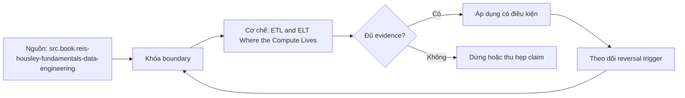

# ETL and ELT Where the Compute Lives

> [!abstract] Câu hỏi trung tâm
> Phân biệt ETL và ELT bằng nơi, thời điểm và trust boundary của compute như thế nào thay vì tranh luận theo khẩu hiệu?

## 1. Định nghĩa bằng execution path

ETL biến đổi trước khi load vào analytical target; ELT load representation sớm rồi biến đổi trong warehouse/lakehouse/engine đích. Cả hai đều có extract, validate, transform và publish; khác placement/order của compute và persistence boundaries. Một pipeline thường hybrid: tokenize trước load, normalize raw-to-staging trong target, aggregate sau đó.

## 2. Năm trục quyết định

Data gravity/egress, source and target compute capacity, security/privacy boundary, latency/replay requirements và tooling/governance. Thêm transformation complexity, skill set, observability, portability và unit cost. Không chọn vì cloud warehouse “mạnh” hoặc ETL “cũ”. Mỗi criterion có measurement, constraint và reversal condition.

## 3. ETL trade-offs

Pre-load transform giảm dữ liệu nhạy cảm/volume vào target và cho phép specialized compute, nhưng dễ mất raw replay evidence, tăng bespoke runtime và tạo coupled extraction-transform failure. Nếu transform sai trước khi giữ nguồn, repair khó. ETL tốt cần immutable input or re-extract contract, versioned code, rejects/quarantine và reconciliation trước/sau.

## 4. ELT trade-offs

Land-first giữ fidelity/replay và tận dụng scalable target SQL, lineage/testing ecosystem; đổi lại raw-zone access/retention, storage/scan cost và target lock-in. “Load raw” vẫn phải qua security, integrity và envelope controls. ELT không cho phép publish partial models hoặc bỏ source impact. Compute location không tự quyết correctness.

## 5. Benchmark đúng câu hỏi

Dùng cùng input boundary, transformation semantics và output oracle; đo end-to-end freshness, source load, bytes moved, target compute, cost, failure recovery và operator effort. Whole-stack comparison được ghi đúng phạm vi. Query benchmark bỏ qua extraction, landing và recovery không đủ để quyết định architecture.

## 6. Decision case

Với PII-heavy API, database CDC và large files, lập two feasible designs và hybrid. Chọn per stage, ghi rejected options, trust boundary, failure windows, replay path, SLO/cost envelope. ADR chỉ được duyệt khi changed constraint như region, egress price hoặc target capacity làm lựa chọn có thể đảo.

## 7. Ma trận kiểm chứng từng mệnh đề

Mỗi claim phải gắn source/entity boundary, exact fixture, checkpoint/input state, counterexample và independent reconciliation oracle. Connector chạy thành công hoặc API trả 2xx chưa chứng minh completeness.

### 7.1. ETL-ELT probe 1: compute boundary, persisted state, security constraint, recovery path và cost/SLO evidence phải rõ

**Mệnh đề cần kiểm.** ETL-ELT probe 1: compute boundary, persisted state, security constraint, recovery path và cost/SLO evidence phải rõ.

**Thiết kế phép thử cho `wiki.transformation.etl-elt-compute-location`.** Khóa source/API version, entity, grain/key, time boundary, schema, pagination/cursor configuration và failure schedule. Tạo positive, boundary và negative fixtures; thay đổi đúng một assumption. Lưu request/query, response/raw extract hash, checkpoint trước/sau, landing objects, target state và source-at-boundary oracle.

**Điều kiện chấp nhận cho `wiki.transformation.etl-elt-compute-location`.** Count, key set, typed field hash và delete state khớp contract; duplicates được giải thích và dedup có identity rõ. Observation, inference và unknown được báo riêng. Lab chưa chạy chỉ là protocol.

### 7.2. ETL-ELT probe 2: compute boundary, persisted state, security constraint, recovery path và cost/SLO evidence phải rõ

**Mệnh đề cần kiểm.** ETL-ELT probe 2: compute boundary, persisted state, security constraint, recovery path và cost/SLO evidence phải rõ.

**Thiết kế phép thử cho `wiki.transformation.etl-elt-compute-location`.** Khóa source/API version, entity, grain/key, time boundary, schema, pagination/cursor configuration và failure schedule. Tạo positive, boundary và negative fixtures; thay đổi đúng một assumption. Lưu request/query, response/raw extract hash, checkpoint trước/sau, landing objects, target state và source-at-boundary oracle.

**Điều kiện chấp nhận cho `wiki.transformation.etl-elt-compute-location`.** Count, key set, typed field hash và delete state khớp contract; duplicates được giải thích và dedup có identity rõ. Observation, inference và unknown được báo riêng. Lab chưa chạy chỉ là protocol.

### 7.3. ETL-ELT probe 3: compute boundary, persisted state, security constraint, recovery path và cost/SLO evidence phải rõ

**Mệnh đề cần kiểm.** ETL-ELT probe 3: compute boundary, persisted state, security constraint, recovery path và cost/SLO evidence phải rõ.

**Thiết kế phép thử cho `wiki.transformation.etl-elt-compute-location`.** Khóa source/API version, entity, grain/key, time boundary, schema, pagination/cursor configuration và failure schedule. Tạo positive, boundary và negative fixtures; thay đổi đúng một assumption. Lưu request/query, response/raw extract hash, checkpoint trước/sau, landing objects, target state và source-at-boundary oracle.

**Điều kiện chấp nhận cho `wiki.transformation.etl-elt-compute-location`.** Count, key set, typed field hash và delete state khớp contract; duplicates được giải thích và dedup có identity rõ. Observation, inference và unknown được báo riêng. Lab chưa chạy chỉ là protocol.

### 7.4. ETL-ELT probe 4: compute boundary, persisted state, security constraint, recovery path và cost/SLO evidence phải rõ

**Mệnh đề cần kiểm.** ETL-ELT probe 4: compute boundary, persisted state, security constraint, recovery path và cost/SLO evidence phải rõ.

**Thiết kế phép thử cho `wiki.transformation.etl-elt-compute-location`.** Khóa source/API version, entity, grain/key, time boundary, schema, pagination/cursor configuration và failure schedule. Tạo positive, boundary và negative fixtures; thay đổi đúng một assumption. Lưu request/query, response/raw extract hash, checkpoint trước/sau, landing objects, target state và source-at-boundary oracle.

**Điều kiện chấp nhận cho `wiki.transformation.etl-elt-compute-location`.** Count, key set, typed field hash và delete state khớp contract; duplicates được giải thích và dedup có identity rõ. Observation, inference và unknown được báo riêng. Lab chưa chạy chỉ là protocol.

### 7.5. ETL-ELT probe 5: compute boundary, persisted state, security constraint, recovery path và cost/SLO evidence phải rõ

**Mệnh đề cần kiểm.** ETL-ELT probe 5: compute boundary, persisted state, security constraint, recovery path và cost/SLO evidence phải rõ.

**Thiết kế phép thử cho `wiki.transformation.etl-elt-compute-location`.** Khóa source/API version, entity, grain/key, time boundary, schema, pagination/cursor configuration và failure schedule. Tạo positive, boundary và negative fixtures; thay đổi đúng một assumption. Lưu request/query, response/raw extract hash, checkpoint trước/sau, landing objects, target state và source-at-boundary oracle.

**Điều kiện chấp nhận cho `wiki.transformation.etl-elt-compute-location`.** Count, key set, typed field hash và delete state khớp contract; duplicates được giải thích và dedup có identity rõ. Observation, inference và unknown được báo riêng. Lab chưa chạy chỉ là protocol.

### 7.6. ETL-ELT probe 6: compute boundary, persisted state, security constraint, recovery path và cost/SLO evidence phải rõ

**Mệnh đề cần kiểm.** ETL-ELT probe 6: compute boundary, persisted state, security constraint, recovery path và cost/SLO evidence phải rõ.

**Thiết kế phép thử cho `wiki.transformation.etl-elt-compute-location`.** Khóa source/API version, entity, grain/key, time boundary, schema, pagination/cursor configuration và failure schedule. Tạo positive, boundary và negative fixtures; thay đổi đúng một assumption. Lưu request/query, response/raw extract hash, checkpoint trước/sau, landing objects, target state và source-at-boundary oracle.

**Điều kiện chấp nhận cho `wiki.transformation.etl-elt-compute-location`.** Count, key set, typed field hash và delete state khớp contract; duplicates được giải thích và dedup có identity rõ. Observation, inference và unknown được báo riêng. Lab chưa chạy chỉ là protocol.

### 7.7. ETL-ELT probe 7: compute boundary, persisted state, security constraint, recovery path và cost/SLO evidence phải rõ

**Mệnh đề cần kiểm.** ETL-ELT probe 7: compute boundary, persisted state, security constraint, recovery path và cost/SLO evidence phải rõ.

**Thiết kế phép thử cho `wiki.transformation.etl-elt-compute-location`.** Khóa source/API version, entity, grain/key, time boundary, schema, pagination/cursor configuration và failure schedule. Tạo positive, boundary và negative fixtures; thay đổi đúng một assumption. Lưu request/query, response/raw extract hash, checkpoint trước/sau, landing objects, target state và source-at-boundary oracle.

**Điều kiện chấp nhận cho `wiki.transformation.etl-elt-compute-location`.** Count, key set, typed field hash và delete state khớp contract; duplicates được giải thích và dedup có identity rõ. Observation, inference và unknown được báo riêng. Lab chưa chạy chỉ là protocol.

### 7.8. ETL-ELT probe 8: compute boundary, persisted state, security constraint, recovery path và cost/SLO evidence phải rõ

**Mệnh đề cần kiểm.** ETL-ELT probe 8: compute boundary, persisted state, security constraint, recovery path và cost/SLO evidence phải rõ.

**Thiết kế phép thử cho `wiki.transformation.etl-elt-compute-location`.** Khóa source/API version, entity, grain/key, time boundary, schema, pagination/cursor configuration và failure schedule. Tạo positive, boundary và negative fixtures; thay đổi đúng một assumption. Lưu request/query, response/raw extract hash, checkpoint trước/sau, landing objects, target state và source-at-boundary oracle.

**Điều kiện chấp nhận cho `wiki.transformation.etl-elt-compute-location`.** Count, key set, typed field hash và delete state khớp contract; duplicates được giải thích và dedup có identity rõ. Observation, inference và unknown được báo riêng. Lab chưa chạy chỉ là protocol.

### 7.9. ETL-ELT probe 9: compute boundary, persisted state, security constraint, recovery path và cost/SLO evidence phải rõ

**Mệnh đề cần kiểm.** ETL-ELT probe 9: compute boundary, persisted state, security constraint, recovery path và cost/SLO evidence phải rõ.

**Thiết kế phép thử cho `wiki.transformation.etl-elt-compute-location`.** Khóa source/API version, entity, grain/key, time boundary, schema, pagination/cursor configuration và failure schedule. Tạo positive, boundary và negative fixtures; thay đổi đúng một assumption. Lưu request/query, response/raw extract hash, checkpoint trước/sau, landing objects, target state và source-at-boundary oracle.

**Điều kiện chấp nhận cho `wiki.transformation.etl-elt-compute-location`.** Count, key set, typed field hash và delete state khớp contract; duplicates được giải thích và dedup có identity rõ. Observation, inference và unknown được báo riêng. Lab chưa chạy chỉ là protocol.

### 7.10. ETL-ELT probe 10: compute boundary, persisted state, security constraint, recovery path và cost/SLO evidence phải rõ

**Mệnh đề cần kiểm.** ETL-ELT probe 10: compute boundary, persisted state, security constraint, recovery path và cost/SLO evidence phải rõ.

**Thiết kế phép thử cho `wiki.transformation.etl-elt-compute-location`.** Khóa source/API version, entity, grain/key, time boundary, schema, pagination/cursor configuration và failure schedule. Tạo positive, boundary và negative fixtures; thay đổi đúng một assumption. Lưu request/query, response/raw extract hash, checkpoint trước/sau, landing objects, target state và source-at-boundary oracle.

**Điều kiện chấp nhận cho `wiki.transformation.etl-elt-compute-location`.** Count, key set, typed field hash và delete state khớp contract; duplicates được giải thích và dedup có identity rõ. Observation, inference và unknown được báo riêng. Lab chưa chạy chỉ là protocol.

### 7.11. ETL-ELT probe 11: compute boundary, persisted state, security constraint, recovery path và cost/SLO evidence phải rõ

**Mệnh đề cần kiểm.** ETL-ELT probe 11: compute boundary, persisted state, security constraint, recovery path và cost/SLO evidence phải rõ.

**Thiết kế phép thử cho `wiki.transformation.etl-elt-compute-location`.** Khóa source/API version, entity, grain/key, time boundary, schema, pagination/cursor configuration và failure schedule. Tạo positive, boundary và negative fixtures; thay đổi đúng một assumption. Lưu request/query, response/raw extract hash, checkpoint trước/sau, landing objects, target state và source-at-boundary oracle.

**Điều kiện chấp nhận cho `wiki.transformation.etl-elt-compute-location`.** Count, key set, typed field hash và delete state khớp contract; duplicates được giải thích và dedup có identity rõ. Observation, inference và unknown được báo riêng. Lab chưa chạy chỉ là protocol.

### 7.12. ETL-ELT probe 12: compute boundary, persisted state, security constraint, recovery path và cost/SLO evidence phải rõ

**Mệnh đề cần kiểm.** ETL-ELT probe 12: compute boundary, persisted state, security constraint, recovery path và cost/SLO evidence phải rõ.

**Thiết kế phép thử cho `wiki.transformation.etl-elt-compute-location`.** Khóa source/API version, entity, grain/key, time boundary, schema, pagination/cursor configuration và failure schedule. Tạo positive, boundary và negative fixtures; thay đổi đúng một assumption. Lưu request/query, response/raw extract hash, checkpoint trước/sau, landing objects, target state và source-at-boundary oracle.

**Điều kiện chấp nhận cho `wiki.transformation.etl-elt-compute-location`.** Count, key set, typed field hash và delete state khớp contract; duplicates được giải thích và dedup có identity rõ. Observation, inference và unknown được báo riêng. Lab chưa chạy chỉ là protocol.

### 7.13. ETL-ELT probe 13: compute boundary, persisted state, security constraint, recovery path và cost/SLO evidence phải rõ

**Mệnh đề cần kiểm.** ETL-ELT probe 13: compute boundary, persisted state, security constraint, recovery path và cost/SLO evidence phải rõ.

**Thiết kế phép thử cho `wiki.transformation.etl-elt-compute-location`.** Khóa source/API version, entity, grain/key, time boundary, schema, pagination/cursor configuration và failure schedule. Tạo positive, boundary và negative fixtures; thay đổi đúng một assumption. Lưu request/query, response/raw extract hash, checkpoint trước/sau, landing objects, target state và source-at-boundary oracle.

**Điều kiện chấp nhận cho `wiki.transformation.etl-elt-compute-location`.** Count, key set, typed field hash và delete state khớp contract; duplicates được giải thích và dedup có identity rõ. Observation, inference và unknown được báo riêng. Lab chưa chạy chỉ là protocol.

### 7.14. ETL-ELT probe 14: compute boundary, persisted state, security constraint, recovery path và cost/SLO evidence phải rõ

**Mệnh đề cần kiểm.** ETL-ELT probe 14: compute boundary, persisted state, security constraint, recovery path và cost/SLO evidence phải rõ.

**Thiết kế phép thử cho `wiki.transformation.etl-elt-compute-location`.** Khóa source/API version, entity, grain/key, time boundary, schema, pagination/cursor configuration và failure schedule. Tạo positive, boundary và negative fixtures; thay đổi đúng một assumption. Lưu request/query, response/raw extract hash, checkpoint trước/sau, landing objects, target state và source-at-boundary oracle.

**Điều kiện chấp nhận cho `wiki.transformation.etl-elt-compute-location`.** Count, key set, typed field hash và delete state khớp contract; duplicates được giải thích và dedup có identity rõ. Observation, inference và unknown được báo riêng. Lab chưa chạy chỉ là protocol.

### 7.15. ETL-ELT probe 15: compute boundary, persisted state, security constraint, recovery path và cost/SLO evidence phải rõ

**Mệnh đề cần kiểm.** ETL-ELT probe 15: compute boundary, persisted state, security constraint, recovery path và cost/SLO evidence phải rõ.

**Thiết kế phép thử cho `wiki.transformation.etl-elt-compute-location`.** Khóa source/API version, entity, grain/key, time boundary, schema, pagination/cursor configuration và failure schedule. Tạo positive, boundary và negative fixtures; thay đổi đúng một assumption. Lưu request/query, response/raw extract hash, checkpoint trước/sau, landing objects, target state và source-at-boundary oracle.

**Điều kiện chấp nhận cho `wiki.transformation.etl-elt-compute-location`.** Count, key set, typed field hash và delete state khớp contract; duplicates được giải thích và dedup có identity rõ. Observation, inference và unknown được báo riêng. Lab chưa chạy chỉ là protocol.

## 8. Quy trình phản biện

1. Chốt entity, grain, identity và immutable boundary.
2. Tách source fact, documentation claim và observed behavior.
3. Viết delete, retry, checkpoint và replay semantics trước code.
4. Dùng key/typed-hash reconciliation, không chỉ row count.
5. Pin version, retention, timezone, ordering và rate limits.
6. Ghi assumption bị falsify và extraction pattern thay thế.

## 9. Câu hỏi tự kiểm tra

1. Source thay đổi row/entity theo những operation nào?
2. Boundary nào định nghĩa complete?
3. Delete có xuất hiện trong interface không?
4. Cursor/order có total và immutable không?
5. Crash ở checkpoint boundary gây replay hay gap?
6. Bằng chứng nào chưa được chạy?

## 10. Giới hạn và điều chưa cho phép kết luận

- Chưa chạy mutation/pagination/watermark lab trên source thật.
- Product behavior phải pin version, retention và configuration.
- Decision matrices và failure protocols là synthesis của giáo trình.
- Note giữ trạng thái `review` tới khi chủ dự án duyệt.

## Reference
1. [[SRC-REIS-HOUSLEY-FUNDAMENTALS-DATA-ENGINEERING]]
2. [[SRC-KLEPPMANN-DDIA-1E]]

## Source coverage

| Source slice | Nội dung sử dụng | Trạng thái |
|---|---|---|
| [[SRC-REIS-HOUSLEY-FUNDAMENTALS-DATA-ENGINEERING]] | Source/change/API contract hoặc engineering context | Đã đọc locator; không suy ngoài phạm vi |
| [[SRC-KLEPPMANN-DDIA-1E]] | Source/change/API contract hoặc engineering context | Đã đọc locator; không suy ngoài phạm vi |

## Key takeaways
- Extraction pattern chỉ đúng khi source assumptions đúng.
- Completeness cần immutable boundary và reconciliation oracle.
- Retry/checkpoint ưu tiên replay có kiểm soát hơn silent gap.
- Connector không chuyển giao ownership về tính đúng.

<!-- ATOMIC-EXECUTION-CAPSULE:START -->

## Execution capsule — kiểm chứng `wiki.transformation.etl-elt-compute-location`

> [!important] Phân loại mệnh đề
> Với `wiki.transformation.etl-elt-compute-location`, sơ đồ, ví dụ và artifact về **ETL and ELT Where the Compute Lives** là **synthesis để kiểm chứng**; chúng không phải trích dẫn hay case nguyên văn của nguồn.

### Sơ đồ cơ chế và điểm kiểm soát



Đọc sơ đồ `wiki.transformation.etl-elt-compute-location` từ trái sang phải: source chỉ cung cấp claim ban đầu cho **ETL and ELT Where the Compute Lives**; quyết định chỉ được đi tiếp sau khi boundary, evidence và điều kiện đảo quyết định đã hiện hữu.

### Artifact thực thi tối thiểu

```sql
-- Verification harness for: ETL and ELT Where the Compute Lives
WITH evidence AS (
    SELECT 'wiki.transformation.etl-elt-compute-location' AS concept_id,
           'boundary_declared' AS check_name, 1 AS passed
    UNION ALL
    SELECT 'wiki.transformation.etl-elt-compute-location', 'independent_oracle', 1
    UNION ALL
    SELECT 'wiki.transformation.etl-elt-compute-location', 'reversal_trigger_recorded', 1
)
SELECT concept_id,
       MIN(passed) AS all_hard_checks_pass,
       COUNT(*) AS evidence_items
FROM evidence
GROUP BY concept_id
HAVING MIN(passed) = 1;
```

Artifact của `wiki.transformation.etl-elt-compute-location` buộc người dùng ghi boundary, oracle và reversal trigger cho **ETL and ELT Where the Compute Lives**. Các giá trị minh họa phải được thay bằng evidence thật trước khi dùng cho quyết định.

### Tự kiểm tra trước khi tái sử dụng

1. Bạn có thể trả lời `Phân biệt ETL và ELT bằng nơi, thời điểm và trust boundary của compute như thế nào thay vì tranh luận theo khẩu hiệu?` bằng một câu mà không kéo thêm concept thứ hai không?
2. Source locator nào đỡ cho claim, và phần nào chỉ là synthesis trong note?
3. Observation nào khiến bạn dừng, thu hẹp hoặc đảo quyết định?
4. Artifact nào cho phép một reviewer độc lập tái hiện kết quả?

<!-- ATOMIC-EXECUTION-CAPSULE:END -->
