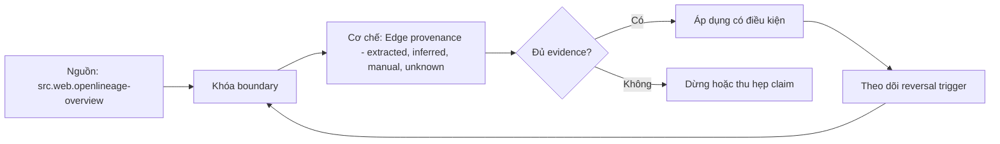

# Edge provenance - extracted, inferred, manual, unknown

> [!abstract] Câu hỏi trung tâm
> Mỗi lineage edge phải mang provenance và confidence nào để người dùng phân biệt extracted, inferred, manual và unknown?

## 1. Extracted edge

Đến từ explicit runtime event hoặc declared artifact; phải lưu producer, method, version, run/snapshot và locator. Đừng bắt đầu bằng tên công cụ. Hãy bắt đầu bằng đối tượng được bảo vệ, boundary quan sát được và hậu quả nếu kết luận sai. Trong bài `Edge provenance - extracted, inferred, manual, unknown`, câu hỏi thực dụng là: Mỗi lineage edge phải mang provenance và confidence nào để người dùng phân biệt extracted, inferred, manual và unknown? Ta ghi rõ grain, population, time window, owner và hành động sau failure; nếu một trường chưa biết thì đánh dấu unknown thay vì lấp bằng mặc định. Bằng chứng tối thiểu gồm fixture có version, cấu hình hoặc rule đã resolve, raw observation, expected result và limitation. Phần này là curriculum synthesis dựa trên các nguồn đã định danh, không phải lời hứa rằng mọi adapter hay deployment đều có cùng hành vi.

## 2. Inferred edge

Parser, name match hoặc query analysis tạo hypothesis; confidence và unsupported constructs phải hiện rõ. Điểm khó không nằm ở cú pháp mà ở identity và scope. Hai phép đo cùng tên vẫn có thể nói về hai population hoặc hai thời điểm khác nhau. Trong bài `Edge provenance - extracted, inferred, manual, unknown`, câu hỏi thực dụng là: Mỗi lineage edge phải mang provenance và confidence nào để người dùng phân biệt extracted, inferred, manual và unknown? Ta ghi rõ grain, population, time window, owner và hành động sau failure; nếu một trường chưa biết thì đánh dấu unknown thay vì lấp bằng mặc định. Bằng chứng tối thiểu gồm fixture có version, cấu hình hoặc rule đã resolve, raw observation, expected result và limitation. Phần này là curriculum synthesis dựa trên các nguồn đã định danh, không phải lời hứa rằng mọi adapter hay deployment đều có cùng hành vi.

## 3. Manual edge

Human assertion cần author, rationale, scope, effective/review dates và conflict policy với automation. Một dashboard xanh chỉ là tín hiệu. Muốn biến nó thành bằng chứng phải giữ input, phiên bản, rule, trạng thái trước-sau và cách tính độc lập. Trong bài `Edge provenance - extracted, inferred, manual, unknown`, câu hỏi thực dụng là: Mỗi lineage edge phải mang provenance và confidence nào để người dùng phân biệt extracted, inferred, manual và unknown? Ta ghi rõ grain, population, time window, owner và hành động sau failure; nếu một trường chưa biết thì đánh dấu unknown thay vì lấp bằng mặc định. Bằng chứng tối thiểu gồm fixture có version, cấu hình hoặc rule đã resolve, raw observation, expected result và limitation. Phần này là curriculum synthesis dựa trên các nguồn đã định danh, không phải lời hứa rằng mọi adapter hay deployment đều có cùng hành vi.

## 4. Unknown state

Thiếu edge không đồng nghĩa no dependency; unknown là trạng thái hợp lệ khi extraction không quan sát được. Thiết kế tốt phải chịu được counterexample. Hãy chủ động tạo case sát boundary, case thiếu dữ liệu và case replay thay vì chỉ chạy happy path. Trong bài `Edge provenance - extracted, inferred, manual, unknown`, câu hỏi thực dụng là: Mỗi lineage edge phải mang provenance và confidence nào để người dùng phân biệt extracted, inferred, manual và unknown? Ta ghi rõ grain, population, time window, owner và hành động sau failure; nếu một trường chưa biết thì đánh dấu unknown thay vì lấp bằng mặc định. Bằng chứng tối thiểu gồm fixture có version, cấu hình hoặc rule đã resolve, raw observation, expected result và limitation. Phần này là curriculum synthesis dựa trên các nguồn đã định danh, không phải lời hứa rằng mọi adapter hay deployment đều có cùng hành vi.

## 5. Conflict resolution

Không chọn edge mới nhất một cách mù quáng; authority, method, temporal scope và evidence quyết định current view. Chi phí vận hành thuộc contract. Một rule đúng nhưng quá đắt, quá ồn hoặc không có owner sẽ nhanh chóng bị tắt và mất tác dụng. Trong bài `Edge provenance - extracted, inferred, manual, unknown`, câu hỏi thực dụng là: Mỗi lineage edge phải mang provenance và confidence nào để người dùng phân biệt extracted, inferred, manual và unknown? Ta ghi rõ grain, population, time window, owner và hành động sau failure; nếu một trường chưa biết thì đánh dấu unknown thay vì lấp bằng mặc định. Bằng chứng tối thiểu gồm fixture có version, cấu hình hoặc rule đã resolve, raw observation, expected result và limitation. Phần này là curriculum synthesis dựa trên các nguồn đã định danh, không phải lời hứa rằng mọi adapter hay deployment đều có cùng hành vi.

## 6. Provenance tests

Fixture tạo true, false, ambiguous và stale edges; UI/API phải giữ origin, confidence và abstain khi không đủ bằng chứng. Kết luận cần có điều kiện đảo chiều. Khi volume, latency, nguồn thẩm quyền hoặc topology đổi, quyết định cũ phải được xem xét lại bằng cùng một oracle. Trong bài `Edge provenance - extracted, inferred, manual, unknown`, câu hỏi thực dụng là: Mỗi lineage edge phải mang provenance và confidence nào để người dùng phân biệt extracted, inferred, manual và unknown? Ta ghi rõ grain, population, time window, owner và hành động sau failure; nếu một trường chưa biết thì đánh dấu unknown thay vì lấp bằng mặc định. Bằng chứng tối thiểu gồm fixture có version, cấu hình hoặc rule đã resolve, raw observation, expected result và limitation. Phần này là curriculum synthesis dựa trên các nguồn đã định danh, không phải lời hứa rằng mọi adapter hay deployment đều có cùng hành vi.

## 7. Ma trận kiểm chứng từng mệnh đề

Với `wiki.metadata.edge-provenance-confidence`, command thành công không tự chứng minh dữ liệu đúng. Protocol riêng của bài là: Chạy connector/parser/event fixture có expected entity-edge manifest, tiêm partial failure hoặc ambiguity và đo missing/extra/unknown theo producer. Mỗi probe dưới đây phải nối input boundary với failure signal và oracle có thể phản bác kết luận.

### 7.1. Edge provenance - extracted, inferred, manual, unknown: kiểm `Extracted edge` bằng case 1, cụ thể đến từ explicit runtime event hoặc declared artifact; phải lưu producer, method, version, run/snapshot và locator

**Mệnh đề cần kiểm.** Edge provenance - extracted, inferred, manual, unknown: kiểm `Extracted edge` bằng case 1, cụ thể đến từ explicit runtime event hoặc declared artifact; phải lưu producer, method, version, run/snapshot và locator.

**Thiết kế phép thử cho `wiki.metadata.edge-provenance-confidence`.** Trong ngữ cảnh `wiki.metadata.edge-provenance-confidence`, tạo positive control và negative control chỉ khác đúng một điều kiện. Khóa input snapshot, phiên bản và owner của rule; chạy đúng population được bài `Edge provenance - extracted, inferred, manual, unknown` công bố.

**Bằng chứng cần giữ.** Đối với probe 1 của `Edge provenance - extracted, inferred, manual, unknown`, giữ fixture, raw failing rows và lệnh tái hiện. Nếu chưa chạy lab, ghi expected evidence và giữ trạng thái review; không biến protocol thành observation.

### 7.2. Edge provenance - extracted, inferred, manual, unknown: kiểm `Inferred edge` bằng case 2, cụ thể parser, name match hoặc query analysis tạo hypothesis; confidence và unsupported constructs phải hiện rõ

**Mệnh đề cần kiểm.** Edge provenance - extracted, inferred, manual, unknown: kiểm `Inferred edge` bằng case 2, cụ thể parser, name match hoặc query analysis tạo hypothesis; confidence và unsupported constructs phải hiện rõ.

**Thiết kế phép thử cho `wiki.metadata.edge-provenance-confidence`.** Trong ngữ cảnh `wiki.metadata.edge-provenance-confidence`, đổi grain nhưng giữ tổng số dòng để lộ phép đo sai cấp. Khóa input snapshot, phiên bản và owner của rule; chạy đúng population được bài `Edge provenance - extracted, inferred, manual, unknown` công bố.

**Bằng chứng cần giữ.** Đối với probe 2 của `Edge provenance - extracted, inferred, manual, unknown`, báo numerator, denominator và key set ở cả hai grain. Nếu chưa chạy lab, ghi expected evidence và giữ trạng thái review; không biến protocol thành observation.

### 7.3. Edge provenance - extracted, inferred, manual, unknown: kiểm `Manual edge` bằng case 3, cụ thể human assertion cần author, rationale, scope, effective/review dates và conflict policy với automation

**Mệnh đề cần kiểm.** Edge provenance - extracted, inferred, manual, unknown: kiểm `Manual edge` bằng case 3, cụ thể human assertion cần author, rationale, scope, effective/review dates và conflict policy với automation.

**Thiết kế phép thử cho `wiki.metadata.edge-provenance-confidence`.** Trong ngữ cảnh `wiki.metadata.edge-provenance-confidence`, đưa một giá trị tới đúng boundary và một giá trị vượt boundary. Khóa input snapshot, phiên bản và owner của rule; chạy đúng population được bài `Edge provenance - extracted, inferred, manual, unknown` công bố.

**Bằng chứng cần giữ.** Đối với probe 3 của `Edge provenance - extracted, inferred, manual, unknown`, lưu hai observed values cùng rule đã resolve. Nếu chưa chạy lab, ghi expected evidence và giữ trạng thái review; không biến protocol thành observation.

### 7.4. Edge provenance - extracted, inferred, manual, unknown: kiểm `Unknown state` bằng case 4, cụ thể thiếu edge không đồng nghĩa no dependency; unknown là trạng thái hợp lệ khi extraction không quan sát được

**Mệnh đề cần kiểm.** Edge provenance - extracted, inferred, manual, unknown: kiểm `Unknown state` bằng case 4, cụ thể thiếu edge không đồng nghĩa no dependency; unknown là trạng thái hợp lệ khi extraction không quan sát được.

**Thiết kế phép thử cho `wiki.metadata.edge-provenance-confidence`.** Trong ngữ cảnh `wiki.metadata.edge-provenance-confidence`, kill tiến trình ngay trước rồi ngay sau durable side effect. Khóa input snapshot, phiên bản và owner của rule; chạy đúng population được bài `Edge provenance - extracted, inferred, manual, unknown` công bố.

**Bằng chứng cần giữ.** Đối với probe 4 của `Edge provenance - extracted, inferred, manual, unknown`, lưu checkpoint, external ledger và trạng thái sau restart. Nếu chưa chạy lab, ghi expected evidence và giữ trạng thái review; không biến protocol thành observation.

### 7.5. Edge provenance - extracted, inferred, manual, unknown: kiểm `Conflict resolution` bằng case 5, cụ thể không chọn edge mới nhất một cách mù quáng; authority, method, temporal scope và evidence quyết định current view

**Mệnh đề cần kiểm.** Edge provenance - extracted, inferred, manual, unknown: kiểm `Conflict resolution` bằng case 5, cụ thể không chọn edge mới nhất một cách mù quáng; authority, method, temporal scope và evidence quyết định current view.

**Thiết kế phép thử cho `wiki.metadata.edge-provenance-confidence`.** Trong ngữ cảnh `wiki.metadata.edge-provenance-confidence`, đảo thứ tự input và concurrency nhưng giữ logical population. Khóa input snapshot, phiên bản và owner của rule; chạy đúng population được bài `Edge provenance - extracted, inferred, manual, unknown` công bố.

**Bằng chứng cần giữ.** Đối với probe 5 của `Edge provenance - extracted, inferred, manual, unknown`, so canonical hash và business totals giữa các thứ tự. Nếu chưa chạy lab, ghi expected evidence và giữ trạng thái review; không biến protocol thành observation.

### 7.6. Edge provenance - extracted, inferred, manual, unknown: kiểm `Provenance tests` bằng case 6, cụ thể fixture tạo true, false, ambiguous và stale edges; ui/api phải giữ origin, confidence và abstain khi không đủ bằng chứng

**Mệnh đề cần kiểm.** Edge provenance - extracted, inferred, manual, unknown: kiểm `Provenance tests` bằng case 6, cụ thể fixture tạo true, false, ambiguous và stale edges; ui/api phải giữ origin, confidence và abstain khi không đủ bằng chứng.

**Thiết kế phép thử cho `wiki.metadata.edge-provenance-confidence`.** Trong ngữ cảnh `wiki.metadata.edge-provenance-confidence`, replay cùng identity với payload giống rồi payload xung đột. Khóa input snapshot, phiên bản và owner của rule; chạy đúng population được bài `Edge provenance - extracted, inferred, manual, unknown` công bố.

**Bằng chứng cần giữ.** Đối với probe 6 của `Edge provenance - extracted, inferred, manual, unknown`, tách duplicate replay khỏi identity collision bằng reason code. Nếu chưa chạy lab, ghi expected evidence và giữ trạng thái review; không biến protocol thành observation.

### 7.7. Edge provenance - extracted, inferred, manual, unknown: kiểm `Extracted edge` bằng case 7, cụ thể đến từ explicit runtime event hoặc declared artifact; phải lưu producer, method, version, run/snapshot và locator

**Mệnh đề cần kiểm.** Edge provenance - extracted, inferred, manual, unknown: kiểm `Extracted edge` bằng case 7, cụ thể đến từ explicit runtime event hoặc declared artifact; phải lưu producer, method, version, run/snapshot và locator.

**Thiết kế phép thử cho `wiki.metadata.edge-provenance-confidence`.** Trong ngữ cảnh `wiki.metadata.edge-provenance-confidence`, thêm record tới trễ trong horizon và ngoài horizon. Khóa input snapshot, phiên bản và owner của rule; chạy đúng population được bài `Edge provenance - extracted, inferred, manual, unknown` công bố.

**Bằng chứng cần giữ.** Đối với probe 7 của `Edge provenance - extracted, inferred, manual, unknown`, báo accepted-late, rejected-late và oldest outstanding timestamp. Nếu chưa chạy lab, ghi expected evidence và giữ trạng thái review; không biến protocol thành observation.

### 7.8. Edge provenance - extracted, inferred, manual, unknown: kiểm `Inferred edge` bằng case 8, cụ thể parser, name match hoặc query analysis tạo hypothesis; confidence và unsupported constructs phải hiện rõ

**Mệnh đề cần kiểm.** Edge provenance - extracted, inferred, manual, unknown: kiểm `Inferred edge` bằng case 8, cụ thể parser, name match hoặc query analysis tạo hypothesis; confidence và unsupported constructs phải hiện rõ.

**Thiết kế phép thử cho `wiki.metadata.edge-provenance-confidence`.** Trong ngữ cảnh `wiki.metadata.edge-provenance-confidence`, đổi schema theo một cách tương thích rồi một cách phá vỡ semantics. Khóa input snapshot, phiên bản và owner của rule; chạy đúng population được bài `Edge provenance - extracted, inferred, manual, unknown` công bố.

**Bằng chứng cần giữ.** Đối với probe 8 của `Edge provenance - extracted, inferred, manual, unknown`, giữ schema diff, classification và consumer-visible result. Nếu chưa chạy lab, ghi expected evidence và giữ trạng thái review; không biến protocol thành observation.

### 7.9. Edge provenance - extracted, inferred, manual, unknown: kiểm `Manual edge` bằng case 9, cụ thể human assertion cần author, rationale, scope, effective/review dates và conflict policy với automation

**Mệnh đề cần kiểm.** Edge provenance - extracted, inferred, manual, unknown: kiểm `Manual edge` bằng case 9, cụ thể human assertion cần author, rationale, scope, effective/review dates và conflict policy với automation.

**Thiết kế phép thử cho `wiki.metadata.edge-provenance-confidence`.** Trong ngữ cảnh `wiki.metadata.edge-provenance-confidence`, tạo missing và duplicate bù nhau để count tổng không đổi. Khóa input snapshot, phiên bản và owner của rule; chạy đúng population được bài `Edge provenance - extracted, inferred, manual, unknown` công bố.

**Bằng chứng cần giữ.** Đối với probe 9 của `Edge provenance - extracted, inferred, manual, unknown`, so key multiset và typed hashes thay vì chỉ row count. Nếu chưa chạy lab, ghi expected evidence và giữ trạng thái review; không biến protocol thành observation.

### 7.10. Edge provenance - extracted, inferred, manual, unknown: kiểm `Unknown state` bằng case 10, cụ thể thiếu edge không đồng nghĩa no dependency; unknown là trạng thái hợp lệ khi extraction không quan sát được

**Mệnh đề cần kiểm.** Edge provenance - extracted, inferred, manual, unknown: kiểm `Unknown state` bằng case 10, cụ thể thiếu edge không đồng nghĩa no dependency; unknown là trạng thái hợp lệ khi extraction không quan sát được.

**Thiết kế phép thử cho `wiki.metadata.edge-provenance-confidence`.** Trong ngữ cảnh `wiki.metadata.edge-provenance-confidence`, cho reviewer tái hiện chỉ từ evidence package. Khóa input snapshot, phiên bản và owner của rule; chạy đúng population được bài `Edge provenance - extracted, inferred, manual, unknown` công bố.

**Bằng chứng cần giữ.** Đối với probe 10 của `Edge provenance - extracted, inferred, manual, unknown`, package phải đủ để người khác dựng lại decision và limitation. Nếu chưa chạy lab, ghi expected evidence và giữ trạng thái review; không biến protocol thành observation.

### 7.11. Edge provenance - extracted, inferred, manual, unknown: kiểm `Conflict resolution` bằng case 11, cụ thể không chọn edge mới nhất một cách mù quáng; authority, method, temporal scope và evidence quyết định current view

**Mệnh đề cần kiểm.** Edge provenance - extracted, inferred, manual, unknown: kiểm `Conflict resolution` bằng case 11, cụ thể không chọn edge mới nhất một cách mù quáng; authority, method, temporal scope và evidence quyết định current view.

**Thiết kế phép thử cho `wiki.metadata.edge-provenance-confidence`.** Trong ngữ cảnh `wiki.metadata.edge-provenance-confidence`, so với oracle độc lập không dùng chung query hoặc parser. Khóa input snapshot, phiên bản và owner của rule; chạy đúng population được bài `Edge provenance - extracted, inferred, manual, unknown` công bố.

**Bằng chứng cần giữ.** Đối với probe 11 của `Edge provenance - extracted, inferred, manual, unknown`, independent result phải khớp ở grain đã công bố. Nếu chưa chạy lab, ghi expected evidence và giữ trạng thái review; không biến protocol thành observation.

### 7.12. Edge provenance - extracted, inferred, manual, unknown: kiểm `Provenance tests` bằng case 12, cụ thể fixture tạo true, false, ambiguous và stale edges; ui/api phải giữ origin, confidence và abstain khi không đủ bằng chứng

**Mệnh đề cần kiểm.** Edge provenance - extracted, inferred, manual, unknown: kiểm `Provenance tests` bằng case 12, cụ thể fixture tạo true, false, ambiguous và stale edges; ui/api phải giữ origin, confidence và abstain khi không đủ bằng chứng.

**Thiết kế phép thử cho `wiki.metadata.edge-provenance-confidence`.** Trong ngữ cảnh `wiki.metadata.edge-provenance-confidence`, chạy scope hẹp và population đầy đủ rồi công bố phần bị loại. Khóa input snapshot, phiên bản và owner của rule; chạy đúng population được bài `Edge provenance - extracted, inferred, manual, unknown` công bố.

**Bằng chứng cần giữ.** Đối với probe 12 của `Edge provenance - extracted, inferred, manual, unknown`, coverage phải nêu rõ excluded nodes, partitions hoặc incidents. Nếu chưa chạy lab, ghi expected evidence và giữ trạng thái review; không biến protocol thành observation.

### 7.13. Edge provenance - extracted, inferred, manual, unknown: kiểm `Extracted edge` bằng case 13, cụ thể đến từ explicit runtime event hoặc declared artifact; phải lưu producer, method, version, run/snapshot và locator

**Mệnh đề cần kiểm.** Edge provenance - extracted, inferred, manual, unknown: kiểm `Extracted edge` bằng case 13, cụ thể đến từ explicit runtime event hoặc declared artifact; phải lưu producer, method, version, run/snapshot và locator.

**Thiết kế phép thử cho `wiki.metadata.edge-provenance-confidence`.** Trong ngữ cảnh `wiki.metadata.edge-provenance-confidence`, thử timezone, precision hoặc partition ở hai phía của ranh giới. Khóa input snapshot, phiên bản và owner của rule; chạy đúng population được bài `Edge provenance - extracted, inferred, manual, unknown` công bố.

**Bằng chứng cần giữ.** Đối với probe 13 của `Edge provenance - extracted, inferred, manual, unknown`, UTC/local interval và rounding policy phải hiện trong output. Nếu chưa chạy lab, ghi expected evidence và giữ trạng thái review; không biến protocol thành observation.

### 7.14. Edge provenance - extracted, inferred, manual, unknown: kiểm `Inferred edge` bằng case 14, cụ thể parser, name match hoặc query analysis tạo hypothesis; confidence và unsupported constructs phải hiện rõ

**Mệnh đề cần kiểm.** Edge provenance - extracted, inferred, manual, unknown: kiểm `Inferred edge` bằng case 14, cụ thể parser, name match hoặc query analysis tạo hypothesis; confidence và unsupported constructs phải hiện rõ.

**Thiết kế phép thử cho `wiki.metadata.edge-provenance-confidence`.** Trong ngữ cảnh `wiki.metadata.edge-provenance-confidence`, đổi constraint đủ lớn để quyết định phải đảo. Khóa input snapshot, phiên bản và owner của rule; chạy đúng population được bài `Edge provenance - extracted, inferred, manual, unknown` công bố.

**Bằng chứng cần giữ.** Đối với probe 14 của `Edge provenance - extracted, inferred, manual, unknown`, ADR phải lưu changed constraint và reversal threshold. Nếu chưa chạy lab, ghi expected evidence và giữ trạng thái review; không biến protocol thành observation.

### 7.15. Edge provenance - extracted, inferred, manual, unknown: kiểm `Manual edge` bằng case 15, cụ thể human assertion cần author, rationale, scope, effective/review dates và conflict policy với automation

**Mệnh đề cần kiểm.** Edge provenance - extracted, inferred, manual, unknown: kiểm `Manual edge` bằng case 15, cụ thể human assertion cần author, rationale, scope, effective/review dates và conflict policy với automation.

**Thiết kế phép thử cho `wiki.metadata.edge-provenance-confidence`.** Trong ngữ cảnh `wiki.metadata.edge-provenance-confidence`, chạy lại từ môi trường sạch với versions và seed đã khóa. Khóa input snapshot, phiên bản và owner của rule; chạy đúng population được bài `Edge provenance - extracted, inferred, manual, unknown` công bố.

**Bằng chứng cần giữ.** Đối với probe 15 của `Edge provenance - extracted, inferred, manual, unknown`, canonical result phải ổn định hoặc mọi nondeterminism phải được giải thích. Nếu chưa chạy lab, ghi expected evidence và giữ trạng thái review; không biến protocol thành observation.

## 8. Quy trình phản biện

1. Viết consumer-visible invariant cho `Edge provenance - extracted, inferred, manual, unknown` trước khi chọn query hoặc tool.
2. Khóa grain, identity, population, time window và authoritative source.
3. Phân biệt declared configuration, executed state và published state.
4. Chạy negative control, replay hoặc changed-assumption case phù hợp.
5. Đối soát bằng oracle độc lập; công bố coverage và phần không quan sát được.
6. Gắn owner, hành động, reversal trigger và hạn review cho kết luận.

## 9. Câu hỏi tự kiểm tra

1. `Edge provenance - extracted, inferred, manual, unknown: kiểm `Extracted edge` bằng case 1, cụ thể đến từ explicit runtime event hoặc declared artifact; phải lưu producer, method, version, run/snapshot và locator` thất bại đầu tiên ở boundary nào?
2. Artifact nào mạnh nhất để trả lời `Edge provenance - extracted, inferred, manual, unknown: kiểm `Manual edge` bằng case 3, cụ thể human assertion cần author, rationale, scope, effective/review dates và conflict policy với automation`?
3. Counterexample nhỏ nhất cho `Edge provenance - extracted, inferred, manual, unknown: kiểm `Provenance tests` bằng case 6, cụ thể fixture tạo true, false, ambiguous và stale edges; ui/api phải giữ origin, confidence và abstain khi không đủ bằng chứng` gồm những state nào?
4. `Edge provenance - extracted, inferred, manual, unknown: kiểm `Manual edge` bằng case 9, cụ thể human assertion cần author, rationale, scope, effective/review dates và conflict policy với automation` có thể xanh giả ra sao?
5. Constraint nào khiến quyết định ở `Edge provenance - extracted, inferred, manual, unknown: kiểm `Inferred edge` bằng case 14, cụ thể parser, name match hoặc query analysis tạo hypothesis; confidence và unsupported constructs phải hiện rõ` phải đảo?
6. Phần nào của `Edge provenance - extracted, inferred, manual, unknown: kiểm `Manual edge` bằng case 15, cụ thể human assertion cần author, rationale, scope, effective/review dates và conflict policy với automation` mới là protocol, chưa phải observation?

## 10. Giới hạn và điều chưa cho phép kết luận

- Lab của `Edge provenance - extracted, inferred, manual, unknown` chưa chạy trên hệ thống production; nội dung là giáo trình và expected evidence.
- Hành vi phụ thuộc phiên bản, connector, scheduler, warehouse và catalog configuration phải được kiểm lại.
- Các ma trận, ladder và threshold do giáo trình tổng hợp không được gán nguyên văn cho vendor.
- Note giữ trạng thái `review` cho tới khi owner duyệt semantics và learner artifact.

## Reference
1. [[SRC-OPENLINEAGE-OVERVIEW]]
2. [[SRC-OPENLINEAGE-FACETS]]
3. [[SRC-DATAHUB-LINEAGE]]

## Source coverage

| Source slice | Nội dung sử dụng | Trạng thái |
|---|---|---|
| [[SRC-OPENLINEAGE-OVERVIEW]] | Contract hoặc cơ chế liên quan trực tiếp tới `Edge provenance - extracted, inferred, manual, unknown` | Đã đọc locator; cần pin version khi chạy lab |
| [[SRC-OPENLINEAGE-FACETS]] | Contract hoặc cơ chế liên quan trực tiếp tới `Edge provenance - extracted, inferred, manual, unknown` | Đã đọc locator; cần pin version khi chạy lab |
| [[SRC-DATAHUB-LINEAGE]] | Contract hoặc cơ chế liên quan trực tiếp tới `Edge provenance - extracted, inferred, manual, unknown` | Đã đọc locator; cần pin version khi chạy lab |

## Key takeaways
- Edge không có provenance/confidence chỉ là đường vẽ, chưa phải bằng chứng.
- Với `wiki.metadata.edge-provenance-confidence`, quality của kết luận phụ thuộc identity, coverage và oracle chứ không phụ thuộc màu dashboard.
- Câu hỏi `Mỗi lineage edge phải mang provenance và confidence nào để người dùng phân biệt extracted, inferred, manual và unknown?` chỉ được trả lời trong scope và version đã ghi.
- Các source IDs `src.web.openlineage-overview, src.web.openlineage-facets, src.web.datahub-lineage` đặt ranh giới cho source fact; phần còn lại là synthesis có nhãn.
- Trước khi lab chạy, đây là note đã kiểm cấu trúc và provenance, chưa phải chứng nhận production.

<!-- ATOMIC-EXECUTION-CAPSULE:START -->

## Execution capsule: kiểm chứng `wiki.metadata.edge-provenance-confidence`

> [!important] Phân loại mệnh đề
> Với `wiki.metadata.edge-provenance-confidence`, sơ đồ, ví dụ và artifact về **Edge provenance - extracted, inferred, manual, unknown** là **synthesis để kiểm chứng**; chúng không phải trích dẫn hay case nguyên văn của nguồn.

### Sơ đồ cơ chế và điểm kiểm soát



Đọc sơ đồ `wiki.metadata.edge-provenance-confidence` từ trái sang phải: source chỉ cung cấp claim ban đầu cho **Edge provenance - extracted, inferred, manual, unknown**; quyết định chỉ được đi tiếp sau khi boundary, evidence và điều kiện đảo quyết định đã hiện hữu.

### Artifact thực thi tối thiểu

```sql
-- Verification harness for: Edge provenance - extracted, inferred, manual, unknown
WITH evidence AS (
    SELECT 'wiki.metadata.edge-provenance-confidence' AS concept_id,
           'boundary_declared' AS check_name, 1 AS passed
    UNION ALL
    SELECT 'wiki.metadata.edge-provenance-confidence', 'independent_oracle', 1
    UNION ALL
    SELECT 'wiki.metadata.edge-provenance-confidence', 'reversal_trigger_recorded', 1
)
SELECT concept_id,
       MIN(passed) AS all_hard_checks_pass,
       COUNT(*) AS evidence_items
FROM evidence
GROUP BY concept_id
HAVING MIN(passed) = 1;
```

Artifact của `wiki.metadata.edge-provenance-confidence` buộc người dùng ghi boundary, oracle và reversal trigger cho **Edge provenance - extracted, inferred, manual, unknown**. Các giá trị minh họa phải được thay bằng evidence thật trước khi dùng cho quyết định.

### Tự kiểm tra trước khi tái sử dụng

1. Bạn có thể trả lời `Mỗi lineage edge phải mang provenance và confidence nào để người dùng phân biệt extracted, inferred, manual và unknown?` bằng một câu mà không kéo thêm concept thứ hai không?
2. Source locator nào đỡ cho claim, và phần nào chỉ là synthesis trong note?
3. Observation nào khiến bạn dừng, thu hẹp hoặc đảo quyết định?
4. Artifact nào cho phép một reviewer độc lập tái hiện kết quả?

<!-- ATOMIC-EXECUTION-CAPSULE:END -->
