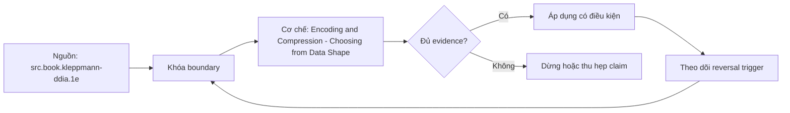

# Encoding and Compression - Choosing from Data Shape

> [!abstract] Câu hỏi trung tâm
> Chọn encoding và block codec theo distribution, order, range, nulls và execution path như thế nào, rồi chứng minh bằng size, decode throughput và query measurements?

## 1. Encoding và compression là hai lớp

Encoding biểu diễn values bằng cấu trúc khai thác semantics/pattern: dictionary indices, runs, frame-of-reference/bit packing, deltas hoặc definition/null levels. General block codec như LZ4/Zstd nhận byte stream sau encoding và tìm redundancy rộng hơn. Format có thể xếp hai lớp; metadata phải ghi encoding/codec để reader giải mã. So `PLAIN+Zstd` với `dictionary+Zstd` khác cả encoding; không được gán toàn bộ chênh lệch cho codec. CPU cost gồm encode, decode và khả năng operator làm việc trước/full materialization.

## 2. Dictionary phụ thuộc economics của dictionary

Dictionary lưu distinct values rồi thay mỗi occurrence bằng index. Nó thường tốt khi distinct set nhỏ so với rows và values đủ rộng, nhưng 'low cardinality' cần định lượng: dictionary bytes, index bit width, page scope, fallback và access pattern. Cột gần unique có dictionary overhead và random lookup/cache cost. Distribution skew có thể giúp dù cardinality tuyệt đối không rất thấp. Benchmark báo distinct count/ratio, value lengths, dictionary size, index width và fallback pages; không chỉ ratio cuối.

## 3. RLE phụ thuộc runs và sort order

Run-length encoding lưu value hoặc code cùng run length, nên hiệu quả dựa average/percentile run length, không chỉ cardinality. Cùng value frequencies nhưng shuffle ngẫu nhiên phá runs; sort theo column tạo runs dài. Sort toàn row để giữ alignment, không sort từng column độc lập. Primary sort key thường hưởng mạnh nhất; keys sau có runs ngắn dần. Thay sort order còn đổi pruning, ingest/merge cost và queries khác, nên improvement RLE không đủ quyết định sort key.

## 4. Bit packing và delta

Bit packing cần width đủ cho value range hoặc frame-of-reference residual; một outlier có thể nâng width của block/page. Partition thành miniblocks giúp thích nghi nhưng thêm headers. Delta lưu differences; monotonic timestamp chỉ là case thuận lợi, điều kiện thật là deltas có range nhỏ/predictable. Parquet DELTA_BINARY_PACKED dùng minimum delta và per-miniblock bit widths, khác mô tả đơn giản 'timestamp tăng thì delta tốt'. Signed mapping, first value, padding và exceptions đều có cost. Báo block size và outlier behavior.

## 5. Null representation và semantics

Null bitmap/definition levels tách presence khỏi payload, nhưng null distribution vẫn ảnh hưởng RLE/bit packing và filters. SQL NULL khác empty string, zero hoặc missing nested field; encoding không được làm mất distinction. Nested Parquet dùng repetition/definition levels, phức tạp hơn một bitmap. Null-heavy column có thể nhỏ nhưng query `IS NULL` vẫn phụ thuộc statistics/operator. Fixture cần all-null, alternating-null, long null runs và sparse non-null cases; verify decoded equality trước performance.

## 6. Decode speed và compute on encoded data

Giảm bytes có thể tăng speed khi I/O/memory bandwidth là bottleneck, nhưng codec mạnh có thể chuyển bottleneck sang CPU. 'Nén mạnh nhất không nhanh nhất' là khả năng, không phải quy luật. Dictionary comparisons, bitmap operations hoặc RLE aggregates có thể chạy trên encoded representation nếu engine/operator hỗ trợ; không mặc định mọi expression làm vậy. Inspect plan/profile/source documentation hoặc microbenchmark operator-specific. Đo encode time, size, decode throughput, query CPU/wall, bytes read và peak memory.

## 7. Ma trận thí nghiệm

Tạo ít nhất bốn columns: low-cardinality shuffled strings; same values sorted into runs; narrow-range integers có outliers; monotonic timestamps có jitter. Thêm null patterns. Với mỗi candidate encoding và codec level, xác minh round-trip hash/count/min/max, lấy encoded size, total file/page metadata, encode/decode time và representative query time. Randomize run order, warm-up riêng, lặp nhiều lần. Nếu writer không cho force encoding, dùng format inspection để ghi actual selection hoặc một encoder harness nhỏ; không giả option đã được áp. Chọn per-column configuration theo Pareto frontier và workload constraint.

## 8. Ma trận kiểm chứng từng mệnh đề

Mỗi kết luận cần input, observation và failure signal có thể lưu. Tên sản phẩm, file nhỏ, query nhanh hoặc presentation thuyết phục không tự chứng minh cơ chế hay năng lực.

### 8.1. encoding khác general block compression

**Mệnh đề cần kiểm.** encoding khác general block compression.

**Cách kiểm.** Tạo distributions có kiểm soát, force hoặc inspect actual encoding, verify round-trip rồi đo size, encode/decode, query CPU/wall và memory. Đổi order, cardinality, range, null pattern và outlier để tìm reversal point. Với mệnh đề này, ghi dataset/contract version, environment, controlled variables, expected observation, failure signal và boundary làm kết luận mất hiệu lực.

**Bằng chứng đạt cho `wiki.olap.encoding-compression-data-shape`.** Lưu fixture hoặc source slice, command/query/protocol, raw output, counters/diff, reviewer và artifact hash. Nếu lab chưa chạy trên môi trường được phép, chỉ ghi protocol và expected result; không viết như kết quả đã quan sát.

### 8.2. dictionary cần tính dictionary bytes và index width

**Mệnh đề cần kiểm.** dictionary cần tính dictionary bytes và index width.

**Cách kiểm.** Tạo distributions có kiểm soát, force hoặc inspect actual encoding, verify round-trip rồi đo size, encode/decode, query CPU/wall và memory. Đổi order, cardinality, range, null pattern và outlier để tìm reversal point. Với mệnh đề này, ghi dataset/contract version, environment, controlled variables, expected observation, failure signal và boundary làm kết luận mất hiệu lực.

**Bằng chứng đạt cho `wiki.olap.encoding-compression-data-shape`.** Lưu fixture hoặc source slice, command/query/protocol, raw output, counters/diff, reviewer và artifact hash. Nếu lab chưa chạy trên môi trường được phép, chỉ ghi protocol và expected result; không viết như kết quả đã quan sát.

### 8.3. low cardinality không có một ngưỡng phổ quát

**Mệnh đề cần kiểm.** low cardinality không có một ngưỡng phổ quát.

**Cách kiểm.** Tạo distributions có kiểm soát, force hoặc inspect actual encoding, verify round-trip rồi đo size, encode/decode, query CPU/wall và memory. Đổi order, cardinality, range, null pattern và outlier để tìm reversal point. Với mệnh đề này, ghi dataset/contract version, environment, controlled variables, expected observation, failure signal và boundary làm kết luận mất hiệu lực.

**Bằng chứng đạt cho `wiki.olap.encoding-compression-data-shape`.** Lưu fixture hoặc source slice, command/query/protocol, raw output, counters/diff, reviewer và artifact hash. Nếu lab chưa chạy trên môi trường được phép, chỉ ghi protocol và expected result; không viết như kết quả đã quan sát.

### 8.4. RLE phụ thuộc run length và row sort order

**Mệnh đề cần kiểm.** RLE phụ thuộc run length và row sort order.

**Cách kiểm.** Tạo distributions có kiểm soát, force hoặc inspect actual encoding, verify round-trip rồi đo size, encode/decode, query CPU/wall và memory. Đổi order, cardinality, range, null pattern và outlier để tìm reversal point. Với mệnh đề này, ghi dataset/contract version, environment, controlled variables, expected observation, failure signal và boundary làm kết luận mất hiệu lực.

**Bằng chứng đạt cho `wiki.olap.encoding-compression-data-shape`.** Lưu fixture hoặc source slice, command/query/protocol, raw output, counters/diff, reviewer và artifact hash. Nếu lab chưa chạy trên môi trường được phép, chỉ ghi protocol và expected result; không viết như kết quả đã quan sát.

### 8.5. sort mỗi column độc lập làm mất row alignment

**Mệnh đề cần kiểm.** sort mỗi column độc lập làm mất row alignment.

**Cách kiểm.** Tạo distributions có kiểm soát, force hoặc inspect actual encoding, verify round-trip rồi đo size, encode/decode, query CPU/wall và memory. Đổi order, cardinality, range, null pattern và outlier để tìm reversal point. Với mệnh đề này, ghi dataset/contract version, environment, controlled variables, expected observation, failure signal và boundary làm kết luận mất hiệu lực.

**Bằng chứng đạt cho `wiki.olap.encoding-compression-data-shape`.** Lưu fixture hoặc source slice, command/query/protocol, raw output, counters/diff, reviewer và artifact hash. Nếu lab chưa chạy trên môi trường được phép, chỉ ghi protocol và expected result; không viết như kết quả đã quan sát.

### 8.6. bit width phụ thuộc range và outliers trong block

**Mệnh đề cần kiểm.** bit width phụ thuộc range và outliers trong block.

**Cách kiểm.** Tạo distributions có kiểm soát, force hoặc inspect actual encoding, verify round-trip rồi đo size, encode/decode, query CPU/wall và memory. Đổi order, cardinality, range, null pattern và outlier để tìm reversal point. Với mệnh đề này, ghi dataset/contract version, environment, controlled variables, expected observation, failure signal và boundary làm kết luận mất hiệu lực.

**Bằng chứng đạt cho `wiki.olap.encoding-compression-data-shape`.** Lưu fixture hoặc source slice, command/query/protocol, raw output, counters/diff, reviewer và artifact hash. Nếu lab chưa chạy trên môi trường được phép, chỉ ghi protocol và expected result; không viết như kết quả đã quan sát.

### 8.7. delta hiệu quả khi residual deltas có range nhỏ

**Mệnh đề cần kiểm.** delta hiệu quả khi residual deltas có range nhỏ.

**Cách kiểm.** Tạo distributions có kiểm soát, force hoặc inspect actual encoding, verify round-trip rồi đo size, encode/decode, query CPU/wall và memory. Đổi order, cardinality, range, null pattern và outlier để tìm reversal point. Với mệnh đề này, ghi dataset/contract version, environment, controlled variables, expected observation, failure signal và boundary làm kết luận mất hiệu lực.

**Bằng chứng đạt cho `wiki.olap.encoding-compression-data-shape`.** Lưu fixture hoặc source slice, command/query/protocol, raw output, counters/diff, reviewer và artifact hash. Nếu lab chưa chạy trên môi trường được phép, chỉ ghi protocol và expected result; không viết như kết quả đã quan sát.

### 8.8. Parquet delta dùng blocks miniblocks và minimum delta

**Mệnh đề cần kiểm.** Parquet delta dùng blocks miniblocks và minimum delta.

**Cách kiểm.** Tạo distributions có kiểm soát, force hoặc inspect actual encoding, verify round-trip rồi đo size, encode/decode, query CPU/wall và memory. Đổi order, cardinality, range, null pattern và outlier để tìm reversal point. Với mệnh đề này, ghi dataset/contract version, environment, controlled variables, expected observation, failure signal và boundary làm kết luận mất hiệu lực.

**Bằng chứng đạt cho `wiki.olap.encoding-compression-data-shape`.** Lưu fixture hoặc source slice, command/query/protocol, raw output, counters/diff, reviewer và artifact hash. Nếu lab chưa chạy trên môi trường được phép, chỉ ghi protocol và expected result; không viết như kết quả đã quan sát.

### 8.9. null bitmap không được đồng nhất null với zero

**Mệnh đề cần kiểm.** null bitmap không được đồng nhất null với zero.

**Cách kiểm.** Tạo distributions có kiểm soát, force hoặc inspect actual encoding, verify round-trip rồi đo size, encode/decode, query CPU/wall và memory. Đổi order, cardinality, range, null pattern và outlier để tìm reversal point. Với mệnh đề này, ghi dataset/contract version, environment, controlled variables, expected observation, failure signal và boundary làm kết luận mất hiệu lực.

**Bằng chứng đạt cho `wiki.olap.encoding-compression-data-shape`.** Lưu fixture hoặc source slice, command/query/protocol, raw output, counters/diff, reviewer và artifact hash. Nếu lab chưa chạy trên môi trường được phép, chỉ ghi protocol và expected result; không viết như kết quả đã quan sát.

### 8.10. nested definition levels phức tạp hơn một null bitmap

**Mệnh đề cần kiểm.** nested definition levels phức tạp hơn một null bitmap.

**Cách kiểm.** Tạo distributions có kiểm soát, force hoặc inspect actual encoding, verify round-trip rồi đo size, encode/decode, query CPU/wall và memory. Đổi order, cardinality, range, null pattern và outlier để tìm reversal point. Với mệnh đề này, ghi dataset/contract version, environment, controlled variables, expected observation, failure signal và boundary làm kết luận mất hiệu lực.

**Bằng chứng đạt cho `wiki.olap.encoding-compression-data-shape`.** Lưu fixture hoặc source slice, command/query/protocol, raw output, counters/diff, reviewer và artifact hash. Nếu lab chưa chạy trên môi trường được phép, chỉ ghi protocol và expected result; không viết như kết quả đã quan sát.

### 8.11. codec mạnh nhất không mặc nhiên chậm hay nhanh nhất

**Mệnh đề cần kiểm.** codec mạnh nhất không mặc nhiên chậm hay nhanh nhất.

**Cách kiểm.** Tạo distributions có kiểm soát, force hoặc inspect actual encoding, verify round-trip rồi đo size, encode/decode, query CPU/wall và memory. Đổi order, cardinality, range, null pattern và outlier để tìm reversal point. Với mệnh đề này, ghi dataset/contract version, environment, controlled variables, expected observation, failure signal và boundary làm kết luận mất hiệu lực.

**Bằng chứng đạt cho `wiki.olap.encoding-compression-data-shape`.** Lưu fixture hoặc source slice, command/query/protocol, raw output, counters/diff, reviewer và artifact hash. Nếu lab chưa chạy trên môi trường được phép, chỉ ghi protocol và expected result; không viết như kết quả đã quan sát.

### 8.12. compute on encoded data là engine operator specific

**Mệnh đề cần kiểm.** compute on encoded data là engine operator specific.

**Cách kiểm.** Tạo distributions có kiểm soát, force hoặc inspect actual encoding, verify round-trip rồi đo size, encode/decode, query CPU/wall và memory. Đổi order, cardinality, range, null pattern và outlier để tìm reversal point. Với mệnh đề này, ghi dataset/contract version, environment, controlled variables, expected observation, failure signal và boundary làm kết luận mất hiệu lực.

**Bằng chứng đạt cho `wiki.olap.encoding-compression-data-shape`.** Lưu fixture hoặc source slice, command/query/protocol, raw output, counters/diff, reviewer và artifact hash. Nếu lab chưa chạy trên môi trường được phép, chỉ ghi protocol và expected result; không viết như kết quả đã quan sát.

### 8.13. round-trip correctness đi trước benchmark

**Mệnh đề cần kiểm.** round-trip correctness đi trước benchmark.

**Cách kiểm.** Tạo distributions có kiểm soát, force hoặc inspect actual encoding, verify round-trip rồi đo size, encode/decode, query CPU/wall và memory. Đổi order, cardinality, range, null pattern và outlier để tìm reversal point. Với mệnh đề này, ghi dataset/contract version, environment, controlled variables, expected observation, failure signal và boundary làm kết luận mất hiệu lực.

**Bằng chứng đạt cho `wiki.olap.encoding-compression-data-shape`.** Lưu fixture hoặc source slice, command/query/protocol, raw output, counters/diff, reviewer và artifact hash. Nếu lab chưa chạy trên môi trường được phép, chỉ ghi protocol và expected result; không viết như kết quả đã quan sát.

### 8.14. actual writer encoding phải được inspect

**Mệnh đề cần kiểm.** actual writer encoding phải được inspect.

**Cách kiểm.** Tạo distributions có kiểm soát, force hoặc inspect actual encoding, verify round-trip rồi đo size, encode/decode, query CPU/wall và memory. Đổi order, cardinality, range, null pattern và outlier để tìm reversal point. Với mệnh đề này, ghi dataset/contract version, environment, controlled variables, expected observation, failure signal và boundary làm kết luận mất hiệu lực.

**Bằng chứng đạt cho `wiki.olap.encoding-compression-data-shape`.** Lưu fixture hoặc source slice, command/query/protocol, raw output, counters/diff, reviewer và artifact hash. Nếu lab chưa chạy trên môi trường được phép, chỉ ghi protocol và expected result; không viết như kết quả đã quan sát.

### 8.15. lựa chọn cuối dựa Pareto frontier và workload constraints

**Mệnh đề cần kiểm.** lựa chọn cuối dựa Pareto frontier và workload constraints.

**Cách kiểm.** Tạo distributions có kiểm soát, force hoặc inspect actual encoding, verify round-trip rồi đo size, encode/decode, query CPU/wall và memory. Đổi order, cardinality, range, null pattern và outlier để tìm reversal point. Với mệnh đề này, ghi dataset/contract version, environment, controlled variables, expected observation, failure signal và boundary làm kết luận mất hiệu lực.

**Bằng chứng đạt cho `wiki.olap.encoding-compression-data-shape`.** Lưu fixture hoặc source slice, command/query/protocol, raw output, counters/diff, reviewer và artifact hash. Nếu lab chưa chạy trên môi trường được phép, chỉ ghi protocol và expected result; không viết như kết quả đã quan sát.

## 9. Quy trình phản biện

1. Chốt decision hoặc workload, grain, version và constraints trước khi chọn implementation.
2. Tách logical semantics, physical mechanism, observed metric và business conclusion.
3. Khóa controlled variables; ghi rõ confounders còn lại và instrumentation boundary.
4. Kiểm correctness trước performance, đồng thời giữ negative và changed-constraint cases.
5. Phân loại source fact, curriculum synthesis, engine-specific behavior và untested hypothesis.
6. Dùng raw artifacts và independent oracle khi kết quả do chính implementation sinh ra.
7. Chưa có execution evidence thì giữ trạng thái `review`.

## 10. Câu hỏi tự kiểm tra

1. Invariant, decision hoặc workload characteristic trung tâm là gì?
2. Biến nào được giữ cố định và biến nào được thay đổi?
3. Counter nào đo đúng mechanism thay vì chỉ đo wall-clock?
4. Một kết quả xanh nhưng sai semantics có thể xuất hiện bằng cách nào?
5. Điều kiện nào làm lựa chọn hiện tại phải đảo?
6. Kết luận nào mới là protocol, chưa phải evidence quan sát được?

## 11. Giới hạn và điều chưa cho phép kết luận

- Chưa chạy capstone với người dùng thật, Gate 5 với hội đồng, benchmark engines hoặc compression matrix; note mô tả protocol và expected evidence.
- Tài liệu web được kiểm ngày 2026-10-01; format, encoding support, storage version và engine behavior có thể đổi.
- Rubric, tám hạng mục capstone và ma trận kiểm chứng là curriculum synthesis; không gán nguyên văn cho một nguồn.
- Kết quả microbenchmark chỉ áp cho dataset, version, configuration, cache và workload đã ghi; không chứng minh ưu thế phổ quát.
- Note giữ trạng thái `review` cho tới khi chủ dự án duyệt semantic meaning.

## Reference
1. [[SRC-KLEPPMANN-DDIA-1E]]
2. [[SRC-APACHE-PARQUET-ENCODINGS]]
3. [[SRC-DUCKDB-STORAGE-AND-COMPRESSION]]
4. [[SRC-CSTORE-COLUMN-ORIENTED-DBMS]]

## Source coverage

| Source slice | Nội dung sử dụng | Trạng thái |
|---|---|---|
| [[SRC-KLEPPMANN-DDIA-1E]] | Khái niệm, mechanism hoặc evidence boundary liên quan | Đã đọc locator được ghi trong source record; không suy ngoài phạm vi |
| [[SRC-APACHE-PARQUET-ENCODINGS]] | Khái niệm, mechanism hoặc evidence boundary liên quan | Đã đọc locator được ghi trong source record; không suy ngoài phạm vi |
| [[SRC-DUCKDB-STORAGE-AND-COMPRESSION]] | Khái niệm, mechanism hoặc evidence boundary liên quan | Đã đọc locator được ghi trong source record; không suy ngoài phạm vi |
| [[SRC-CSTORE-COLUMN-ORIENTED-DBMS]] | Khái niệm, mechanism hoặc evidence boundary liên quan | Đã đọc locator được ghi trong source record; không suy ngoài phạm vi |

## Key takeaways
- Encoding chọn theo data shape ở block/page và execution path; block codec là lớp riêng, cần đo size lẫn CPU/query behavior.
- Correctness, scope và exact version đi trước performance hoặc approval.
- Một proxy dễ lấy không được dùng thay consumer outcome, physical counter hoặc independent reconciliation.
- Counterexample và changed constraint phải làm kết luận đảo khi assumptions không còn đúng.
- Chưa chạy lab thì artifact là giáo trình đã kiểm cấu trúc, không phải chứng nhận production hay benchmark result.

<!-- ATOMIC-EXECUTION-CAPSULE:START -->

## Execution capsule: kiểm chứng `wiki.olap.encoding-compression-data-shape`

> [!important] Phân loại mệnh đề
> Với `wiki.olap.encoding-compression-data-shape`, sơ đồ, ví dụ và artifact về **Encoding and Compression - Choosing from Data Shape** là **synthesis để kiểm chứng**; chúng không phải trích dẫn hay case nguyên văn của nguồn.

### Sơ đồ cơ chế và điểm kiểm soát



Đọc sơ đồ `wiki.olap.encoding-compression-data-shape` từ trái sang phải: source chỉ cung cấp claim ban đầu cho **Encoding and Compression - Choosing from Data Shape**; quyết định chỉ được đi tiếp sau khi boundary, evidence và điều kiện đảo quyết định đã hiện hữu.

### Ví dụ làm việc có thể bác bỏ

**Input.** Một đội cần trả lời: Chọn encoding và block codec theo distribution, order, range, nulls và execution path như thế nào, rồi chứng minh bằng size, decode throughput và query measurements? cho một phạm vi nhỏ, có owner và deadline rõ.

**Decision.** Đội áp dụng **Encoding and Compression - Choosing from Data Shape** trên control và variant chỉ khác một assumption; expected result và hard constraints được khóa trước khi chạy.

**Outcome.** Với `wiki.olap.encoding-compression-data-shape`, nếu observation vi phạm hard constraint hoặc oracle độc lập không xác nhận **Encoding and Compression - Choosing from Data Shape**, đội thu hẹp claim hay đảo quyết định. Nếu đạt, kết luận vẫn kèm scope, version và review date; một lần thành công không được nâng thành quy luật phổ quát.

### Artifact thực thi tối thiểu

```sql
-- Verification harness for: Encoding and Compression - Choosing from Data Shape
WITH evidence AS (
    SELECT 'wiki.olap.encoding-compression-data-shape' AS concept_id,
           'boundary_declared' AS check_name, 1 AS passed
    UNION ALL
    SELECT 'wiki.olap.encoding-compression-data-shape', 'independent_oracle', 1
    UNION ALL
    SELECT 'wiki.olap.encoding-compression-data-shape', 'reversal_trigger_recorded', 1
)
SELECT concept_id,
       MIN(passed) AS all_hard_checks_pass,
       COUNT(*) AS evidence_items
FROM evidence
GROUP BY concept_id
HAVING MIN(passed) = 1;
```

Artifact của `wiki.olap.encoding-compression-data-shape` buộc người dùng ghi boundary, oracle và reversal trigger cho **Encoding and Compression - Choosing from Data Shape**. Các giá trị minh họa phải được thay bằng evidence thật trước khi dùng cho quyết định.

### Tự kiểm tra trước khi tái sử dụng

1. Bạn có thể trả lời `Chọn encoding và block codec theo distribution, order, range, nulls và execution path như thế nào, rồi chứng minh bằng size, decode throughput và query measurements?` bằng một câu mà không kéo thêm concept thứ hai không?
2. Source locator nào đỡ cho claim, và phần nào chỉ là synthesis trong note?
3. Observation nào khiến bạn dừng, thu hẹp hoặc đảo quyết định?
4. Artifact nào cho phép một reviewer độc lập tái hiện kết quả?

<!-- ATOMIC-EXECUTION-CAPSULE:END -->
