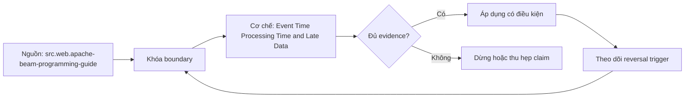

# Event Time Processing Time and Late Data

> [!abstract] Câu hỏi trung tâm
> Tách event time, processing time, watermark và allowed lateness thế nào để kết quả cửa sổ vừa có deadline vừa có correction policy?

## 1. Ba đồng hồ không thay thế nhau

Event time thuộc bản thân sự kiện; ingestion time đánh dấu lúc nền tảng nhận; processing time là clock của operator đang xử lý. Một order xảy ra 10:00, tới broker 10:07 và được aggregate 10:09 mang ba giá trị khác nhau. Dùng processing time cho business window khiến network delay đổi doanh thu theo giờ. Dùng event time không tự giải quyết clock sai, duplicate hoặc event không có timestamp đáng tin. Contract phải nêu field, timezone, precision, producer authority và hành vi khi thiếu hoặc vượt phạm vi.

## 2. Watermark là ước lượng tiến độ

Watermark biểu diễn ước lượng rằng event sớm hơn mốc đã phần lớn xuất hiện; với source heuristic nó không phải lời hứa tuyệt đối. Watermark chậm giữ state lâu và tăng latency; quá nhanh biến event hợp lệ thành late data. Minimum watermark qua nhiều partitions bị giữ bởi partition im lặng hoặc lagging. Thiết kế cần idle-partition rule, skew metric và cách phục hồi khi source replay. Không lấy max observed event time trừ một hằng số làm universal watermark nếu chưa đo distribution của lateness.

## 3. Window trigger accumulation

Window gán event vào phạm vi event-time; trigger quyết định khi nào phát pane. Early firing giảm latency nhưng mang kết quả chưa đầy đủ. On-time firing theo watermark vẫn có thể được sửa bởi late firing. Accumulating mode phát lại aggregate tích lũy; discarding mode chỉ phát phần mới, nên downstream upsert/append semantics phải khớp. Session windows còn có thể merge khi event muộn nối hai session. Consumer cần version hoặc pane identity để không cộng đôi các revision.

## 4. Allowed lateness và finality

Allowed lateness là khoảng hệ thống giữ state và chấp nhận correction sau watermark, không phải thời gian chờ trước khi xử lý. Chọn nó từ observed delay, business correction horizon, state cost và compliance. Event tới sau horizon cần dead-letter, offline backfill hoặc explicit discard metric. Dashboard phải phân biệt early, on-time, late-accepted và too-late. Từ `allowed lateness = 2 days` không được suy ra dữ liệu hoàn tất tuyệt đối sau hai ngày nếu source có backdated corrections dài hơn.

## 5. Publication contract

Mỗi output mang window start/end, pane timing, revision hoặc deterministic key và completeness state. Append-only sink cần changelog/retraction semantics; upsert sink dùng window plus group key và monotonic version. Notification chỉ gửi khi policy cho phép preliminary hoặc final. Backfill phải viết cùng semantic key để correction thay thế thay vì nhân bản. Reconciliation so event population theo fixed source boundary, không so stream đang chạy với snapshot muộn hơn.

## 6. Failure lab

Fixture tạo ordered, out-of-order, duplicate, clock-skewed và too-late events trên hai partitions, gồm một partition im lặng. Chạy watermark/trigger policies, ghi panes và state retention. Oracle recompute toàn bộ theo event time tại fixed boundary. Inject restart và replay để kiểm sink converges. Đạt khi early result được gắn provisional, late correction cập nhật đúng, too-late được đếm và không event nào biến mất mà không có disposition.

## 7. Ma trận kiểm chứng từng mệnh đề

Trong `Event Time Processing Time and Late Data`, mỗi claim phải nối được tới input boundary, compiled hoặc executed artifact, trạng thái trước–sau, failure signal và independent oracle. Một command kết thúc với exit code 0 không tự chứng minh dữ liệu đúng, đầy đủ hoặc phù hợp với consumer contract. Protocol nền của bài này: Dựng fixture và project tối thiểu có exact graph/input boundary; chạy command hoặc protocol theo thứ tự, rồi đối soát relation, key set, typed hash và business invariant với full/reference computation.

### 7.1. Time-semantics probe 1: clock, window, watermark, pane identity và correction oracle phải rõ

**Mệnh đề cần kiểm.** Time-semantics probe 1: clock, window, watermark, pane identity và correction oracle phải rõ.

**Thiết kế phép thử cho `wiki.transformation.event-processing-time-late-data`.** Với `Time-semantics probe 1: clock, window, watermark, pane identity và correction oracle phải rõ`, Bắt đầu bằng ca nhỏ nhất có thể làm mệnh đề sai; chỉ thêm dữ liệu sau khi failure signal đã xuất hiện đúng chỗ. Cách này phân biệt một assertion có lực với một bài demo chỉ đi qua happy path. Khóa versions, target và input boundary có liên quan; lưu command, compiled SQL hoặc scheduler context cùng query IDs và timestamps.

**Bằng chứng cần giữ.** Hồ sơ của `Time-semantics probe 1: clock, window, watermark, pane identity và correction oracle phải rõ` phải cho thấy: Giữ fixture tối thiểu, raw failure rows và câu lệnh tái hiện; ảnh chụp màn hình một trạng thái xanh không đủ. Nếu sandbox chưa chạy, mục này vẫn là protocol; không đổi expected result thành observation.

### 7.2. Time-semantics probe 2: clock, window, watermark, pane identity và correction oracle phải rõ

**Mệnh đề cần kiểm.** Time-semantics probe 2: clock, window, watermark, pane identity và correction oracle phải rõ.

**Thiết kế phép thử cho `wiki.transformation.event-processing-time-late-data`.** Với `Time-semantics probe 2: clock, window, watermark, pane identity và correction oracle phải rõ`, Giữ nguyên input rồi đổi đúng một tham số cấu hình liên quan. Nếu output đổi theo nhiều hướng cùng lúc, phép thử chưa cô lập được nguyên nhân và phải thu hẹp lại. Khóa versions, target và input boundary có liên quan; lưu command, compiled SQL hoặc scheduler context cùng query IDs và timestamps.

**Bằng chứng cần giữ.** Hồ sơ của `Time-semantics probe 2: clock, window, watermark, pane identity và correction oracle phải rõ` phải cho thấy: Báo cả giá trị trước–sau của tham số, compiled artifact và diff đầu ra để reviewer thấy biến nào thực sự đổi. Nếu sandbox chưa chạy, mục này vẫn là protocol; không đổi expected result thành observation.

### 7.3. Time-semantics probe 3: clock, window, watermark, pane identity và correction oracle phải rõ

**Mệnh đề cần kiểm.** Time-semantics probe 3: clock, window, watermark, pane identity và correction oracle phải rõ.

**Thiết kế phép thử cho `wiki.transformation.event-processing-time-late-data`.** Với `Time-semantics probe 3: clock, window, watermark, pane identity và correction oracle phải rõ`, Chạy cặp đối chứng: một input phải được chấp nhận và một input chỉ lệch tại boundary phải bị chặn hoặc được phân loại. Hai ca dùng chung code path để tránh so hai hệ thống khác nhau. Khóa versions, target và input boundary có liên quan; lưu command, compiled SQL hoặc scheduler context cùng query IDs và timestamps.

**Bằng chứng cần giữ.** Hồ sơ của `Time-semantics probe 3: clock, window, watermark, pane identity và correction oracle phải rõ` phải cho thấy: Pass khi positive control đi qua, negative control dừng đúng lớp và không có side effect ngoài scope. Nếu sandbox chưa chạy, mục này vẫn là protocol; không đổi expected result thành observation.

### 7.4. Time-semantics probe 4: clock, window, watermark, pane identity và correction oracle phải rõ

**Mệnh đề cần kiểm.** Time-semantics probe 4: clock, window, watermark, pane identity và correction oracle phải rõ.

**Thiết kế phép thử cho `wiki.transformation.event-processing-time-late-data`.** Với `Time-semantics probe 4: clock, window, watermark, pane identity và correction oracle phải rõ`, Đặt kill point ngay trước và ngay sau durable boundary. So trạng thái sau restart để biết hệ thống tạo replay có kiểm soát, silent gap hay một trạng thái nửa vời mà dashboard không báo. Khóa versions, target và input boundary có liên quan; lưu command, compiled SQL hoặc scheduler context cùng query IDs và timestamps.

**Bằng chứng cần giữ.** Hồ sơ của `Time-semantics probe 4: clock, window, watermark, pane identity và correction oracle phải rõ` phải cho thấy: Run ledger phải cho biết commit/checkpoint nào bền vững; sau rerun, key set và side-effect ledger cùng hội tụ. Nếu sandbox chưa chạy, mục này vẫn là protocol; không đổi expected result thành observation.

### 7.5. Time-semantics probe 5: clock, window, watermark, pane identity và correction oracle phải rõ

**Mệnh đề cần kiểm.** Time-semantics probe 5: clock, window, watermark, pane identity và correction oracle phải rõ.

**Thiết kế phép thử cho `wiki.transformation.event-processing-time-late-data`.** Với `Time-semantics probe 5: clock, window, watermark, pane identity và correction oracle phải rõ`, Đảo thứ tự input và thay concurrency nhưng giữ logical population. Kết quả khác nhau cho thấy thiết kế đang phụ thuộc physical order hoặc race thay vì contract đã công bố. Khóa versions, target và input boundary có liên quan; lưu command, compiled SQL hoặc scheduler context cùng query IDs và timestamps.

**Bằng chứng cần giữ.** Hồ sơ của `Time-semantics probe 5: clock, window, watermark, pane identity và correction oracle phải rõ` phải cho thấy: Hash chuẩn hóa và business totals phải giống nhau giữa các thứ tự; chênh lệch được giữ như finding, không làm tròn mất. Nếu sandbox chưa chạy, mục này vẫn là protocol; không đổi expected result thành observation.

### 7.6. Time-semantics probe 6: clock, window, watermark, pane identity và correction oracle phải rõ

**Mệnh đề cần kiểm.** Time-semantics probe 6: clock, window, watermark, pane identity và correction oracle phải rõ.

**Thiết kế phép thử cho `wiki.transformation.event-processing-time-late-data`.** Với `Time-semantics probe 6: clock, window, watermark, pane identity và correction oracle phải rõ`, Cho cùng logical identity xuất hiện hai lần: trước hết cùng payload, sau đó payload khác. Trường hợp đầu phải hội tụ; trường hợp sau phải lộ collision thay vì âm thầm chọn một bản. Khóa versions, target và input boundary có liên quan; lưu command, compiled SQL hoặc scheduler context cùng query IDs và timestamps.

**Bằng chứng cần giữ.** Hồ sơ của `Time-semantics probe 6: clock, window, watermark, pane identity và correction oracle phải rõ` phải cho thấy: Same-content replay được đếm nhưng không nhân state; different-content collision có reason code và đường xử lý riêng. Nếu sandbox chưa chạy, mục này vẫn là protocol; không đổi expected result thành observation.

### 7.7. Time-semantics probe 7: clock, window, watermark, pane identity và correction oracle phải rõ

**Mệnh đề cần kiểm.** Time-semantics probe 7: clock, window, watermark, pane identity và correction oracle phải rõ.

**Thiết kế phép thử cho `wiki.transformation.event-processing-time-late-data`.** Với `Time-semantics probe 7: clock, window, watermark, pane identity và correction oracle phải rõ`, Mở rộng fixture bằng một record tới trễ ngay trong horizon và một record nằm ngoài horizon. Ghi rõ record nào được sửa, record nào bị loại và metric nào khiến operator biết có mất coverage. Khóa versions, target và input boundary có liên quan; lưu command, compiled SQL hoặc scheduler context cùng query IDs và timestamps.

**Bằng chứng cần giữ.** Hồ sơ của `Time-semantics probe 7: clock, window, watermark, pane identity và correction oracle phải rõ` phải cho thấy: Evidence ghi accepted-late, rejected-late và oldest outstanding timestamp; thiếu một nhóm được báo là coverage gap. Nếu sandbox chưa chạy, mục này vẫn là protocol; không đổi expected result thành observation.

### 7.8. Time-semantics probe 8: clock, window, watermark, pane identity và correction oracle phải rõ

**Mệnh đề cần kiểm.** Time-semantics probe 8: clock, window, watermark, pane identity và correction oracle phải rõ.

**Thiết kế phép thử cho `wiki.transformation.event-processing-time-late-data`.** Với `Time-semantics probe 8: clock, window, watermark, pane identity và correction oracle phải rõ`, Dùng một schema change tương thích và một thay đổi phá vỡ key, type hoặc meaning. Kết quả phải chỉ ra khác biệt giữa parse được, chạy được và vẫn giữ đúng semantics. Khóa versions, target và input boundary có liên quan; lưu command, compiled SQL hoặc scheduler context cùng query IDs và timestamps.

**Bằng chứng cần giữ.** Hồ sơ của `Time-semantics probe 8: clock, window, watermark, pane identity và correction oracle phải rõ` phải cho thấy: Lưu schema trước–sau, classification, compiled SQL và target state; một migration chạy xong nhưng đổi meaning vẫn fail. Nếu sandbox chưa chạy, mục này vẫn là protocol; không đổi expected result thành observation.

### 7.9. Time-semantics probe 9: clock, window, watermark, pane identity và correction oracle phải rõ

**Mệnh đề cần kiểm.** Time-semantics probe 9: clock, window, watermark, pane identity và correction oracle phải rõ.

**Thiết kế phép thử cho `wiki.transformation.event-processing-time-late-data`.** Với `Time-semantics probe 9: clock, window, watermark, pane identity và correction oracle phải rõ`, Tạo bảng rỗng, bảng một row và bảng có duplicate bù cho missing row. Đây là ba ca dễ làm count hoặc aggregate xanh dù invariant thực tế đã hỏng. Khóa versions, target và input boundary có liên quan; lưu command, compiled SQL hoặc scheduler context cùng query IDs và timestamps.

**Bằng chứng cần giữ.** Hồ sơ của `Time-semantics probe 9: clock, window, watermark, pane identity và correction oracle phải rõ` phải cho thấy: Oracle so count, key multiset và typed hashes. Ca missing-plus-duplicate phải bị phát hiện dù tổng row count không đổi. Nếu sandbox chưa chạy, mục này vẫn là protocol; không đổi expected result thành observation.

### 7.10. Time-semantics probe 10: clock, window, watermark, pane identity và correction oracle phải rõ

**Mệnh đề cần kiểm.** Time-semantics probe 10: clock, window, watermark, pane identity và correction oracle phải rõ.

**Thiết kế phép thử cho `wiki.transformation.event-processing-time-late-data`.** Với `Time-semantics probe 10: clock, window, watermark, pane identity và correction oracle phải rõ`, Cho reviewer chỉ artifacts, không cho xem lời giải thích của tác giả. Nếu họ không dựng lại được input, decision và diff thì evidence package chưa đủ để bàn giao. Khóa versions, target và input boundary có liên quan; lưu command, compiled SQL hoặc scheduler context cùng query IDs và timestamps.

**Bằng chứng cần giữ.** Hồ sơ của `Time-semantics probe 10: clock, window, watermark, pane identity và correction oracle phải rõ` phải cho thấy: Artifact package đạt khi reviewer tái hiện đúng diff và chỉ ra được limitation mà không cần hỏi tác giả về state ẩn. Nếu sandbox chưa chạy, mục này vẫn là protocol; không đổi expected result thành observation.

### 7.11. Time-semantics probe 11: clock, window, watermark, pane identity và correction oracle phải rõ

**Mệnh đề cần kiểm.** Time-semantics probe 11: clock, window, watermark, pane identity và correction oracle phải rõ.

**Thiết kế phép thử cho `wiki.transformation.event-processing-time-late-data`.** Với `Time-semantics probe 11: clock, window, watermark, pane identity và correction oracle phải rõ`, So output với một cách tính độc lập không tái sử dụng macro, filter hoặc intermediate relation đang được kiểm. Hai phép tính dùng chung lỗi chỉ tạo sự đồng thuận giả. Khóa versions, target và input boundary có liên quan; lưu command, compiled SQL hoặc scheduler context cùng query IDs và timestamps.

**Bằng chứng cần giữ.** Hồ sơ của `Time-semantics probe 11: clock, window, watermark, pane identity và correction oracle phải rõ` phải cho thấy: Independent result phải khớp ở key/grain đã định; nếu chỉ khớp aggregate cao hơn thì drill-down chưa hoàn tất. Nếu sandbox chưa chạy, mục này vẫn là protocol; không đổi expected result thành observation.

### 7.12. Time-semantics probe 12: clock, window, watermark, pane identity và correction oracle phải rõ

**Mệnh đề cần kiểm.** Time-semantics probe 12: clock, window, watermark, pane identity và correction oracle phải rõ.

**Thiết kế phép thử cho `wiki.transformation.event-processing-time-late-data`.** Với `Time-semantics probe 12: clock, window, watermark, pane identity và correction oracle phải rõ`, Thử trên hai scope: selection hẹp dùng trong CI và population đầy đủ dùng khi phát hành. Ghi phần coverage bị bỏ qua; tốc độ của CI không được biến thành tuyên bố kiểm toàn bộ dữ liệu. Khóa versions, target và input boundary có liên quan; lưu command, compiled SQL hoặc scheduler context cùng query IDs và timestamps.

**Bằng chứng cần giữ.** Hồ sơ của `Time-semantics probe 12: clock, window, watermark, pane identity và correction oracle phải rõ` phải cho thấy: Kết quả nêu numerator, denominator và excluded nodes/partitions; không dùng từ `all` khi selection không phủ toàn graph. Nếu sandbox chưa chạy, mục này vẫn là protocol; không đổi expected result thành observation.

### 7.13. Time-semantics probe 13: clock, window, watermark, pane identity và correction oracle phải rõ

**Mệnh đề cần kiểm.** Time-semantics probe 13: clock, window, watermark, pane identity và correction oracle phải rõ.

**Thiết kế phép thử cho `wiki.transformation.event-processing-time-late-data`.** Với `Time-semantics probe 13: clock, window, watermark, pane identity và correction oracle phải rõ`, Đẩy một giá trị tới sát giới hạn precision, timezone, partition hoặc threshold. Boundary phải được viết half-open hay inclusive rõ ràng, không suy từ một ví dụ ở giữa khoảng. Khóa versions, target và input boundary có liên quan; lưu command, compiled SQL hoặc scheduler context cùng query IDs và timestamps.

**Bằng chứng cần giữ.** Hồ sơ của `Time-semantics probe 13: clock, window, watermark, pane identity và correction oracle phải rõ` phải cho thấy: Hai phía của boundary đều có expected result và raw observation. Sai đúng một đơn vị phải làm test fail có chẩn đoán. Nếu sandbox chưa chạy, mục này vẫn là protocol; không đổi expected result thành observation.

### 7.14. Time-semantics probe 14: clock, window, watermark, pane identity và correction oracle phải rõ

**Mệnh đề cần kiểm.** Time-semantics probe 14: clock, window, watermark, pane identity và correction oracle phải rõ.

**Thiết kế phép thử cho `wiki.transformation.event-processing-time-late-data`.** Với `Time-semantics probe 14: clock, window, watermark, pane identity và correction oracle phải rõ`, Thay constraint quan trọng nhất bằng giá trị đủ để decision phải đảo. Nếu thiết kế vẫn đưa cùng lựa chọn mà không giải thích, decision rule đang là khẩu hiệu chứ chưa phải rule. Khóa versions, target và input boundary có liên quan; lưu command, compiled SQL hoặc scheduler context cùng query IDs và timestamps.

**Bằng chứng cần giữ.** Hồ sơ của `Time-semantics probe 14: clock, window, watermark, pane identity và correction oracle phải rõ` phải cho thấy: ADR hoặc rule chỉ pass khi changed constraint tạo lựa chọn mới đúng như đã dự báo và reversal threshold được lưu. Nếu sandbox chưa chạy, mục này vẫn là protocol; không đổi expected result thành observation.

### 7.15. Time-semantics probe 15: clock, window, watermark, pane identity và correction oracle phải rõ

**Mệnh đề cần kiểm.** Time-semantics probe 15: clock, window, watermark, pane identity và correction oracle phải rõ.

**Thiết kế phép thử cho `wiki.transformation.event-processing-time-late-data`.** Với `Time-semantics probe 15: clock, window, watermark, pane identity và correction oracle phải rõ`, Lặp lại phép thử từ môi trường sạch bằng seed và versions đã lưu. Một kết quả chỉ tái hiện được trên workspace của tác giả không đủ làm release evidence. Khóa versions, target và input boundary có liên quan; lưu command, compiled SQL hoặc scheduler context cùng query IDs và timestamps.

**Bằng chứng cần giữ.** Hồ sơ của `Time-semantics probe 15: clock, window, watermark, pane identity và correction oracle phải rõ` phải cho thấy: Lần chạy sạch phải tạo cùng canonical state; khác biệt do timestamp, file order hoặc generated IDs phải được loại hoặc giải thích. Nếu sandbox chưa chạy, mục này vẫn là protocol; không đổi expected result thành observation.

## 8. Quy trình phản biện

Áp dụng sáu bước sau cho `Event Time Processing Time and Late Data`; nếu một bước không phù hợp, ghi lý do thay vì bỏ qua im lặng.

1. Với `wiki.transformation.event-processing-time-late-data`, chốt grain, identity, time boundary và consumer-visible invariant trước câu lệnh.
2. Tách parse/compile state, warehouse execution và publication state.
3. Pin dbt core, adapter, warehouse hoặc orchestrator version cùng configuration có ảnh hưởng.
4. Kiểm correctness bằng key set, typed hash và business invariant trước performance.
5. Chạy negative case, kill point hoặc changed assumption; green path đơn lẻ không đủ.
6. Phân loại source fact, project convention, curriculum synthesis và untested hypothesis.

## 9. Câu hỏi tự kiểm tra

1. `Time-semantics probe 1: clock, window, watermark, pane identity và correction oracle phải rõ` sẽ thất bại trước tiên ở boundary nào?
2. Với `Time-semantics probe 2: clock, window, watermark, pane identity và correction oracle phải rõ`, artifact nào là nguồn bằng chứng mạnh nhất?
3. Counterexample nhỏ nhất cho `Time-semantics probe 3: clock, window, watermark, pane identity và correction oracle phải rõ` gồm những row hoặc state nào?
4. `Time-semantics probe 4: clock, window, watermark, pane identity và correction oracle phải rõ` có thể xanh giả trong tình huống nào?
5. Version, adapter, timezone hoặc state nào làm `Time-semantics probe 5: clock, window, watermark, pane identity và correction oracle phải rõ` đổi nghĩa?
6. Phần nào của `Time-semantics probe 6: clock, window, watermark, pane identity và correction oracle phải rõ` hiện mới là protocol, chưa phải observation?

## 10. Giới hạn và điều chưa cho phép kết luận

- Lab của `Event Time Processing Time and Late Data` chưa chạy trên warehouse, dbt project hoặc orchestrator production; các mục kiểm chứng vẫn là protocol và expected evidence.
- Các claim gắn `wiki.transformation.event-processing-time-late-data` phải kiểm lại theo dbt core, adapter, warehouse và scheduler version được chọn.
- Decision matrix, failure campaign và ngưỡng review là curriculum synthesis, không phải cam kết của vendor.
- Note giữ trạng thái `review` cho tới khi chủ dự án duyệt semantic meaning và learner artifact.

## Reference
1. [[SRC-APACHE-BEAM-PROGRAMMING-GUIDE]]
2. [[SRC-KLEPPMANN-DDIA-1E]]

## Source coverage

| Source slice | Nội dung sử dụng | Trạng thái |
|---|---|---|
| [[SRC-APACHE-BEAM-PROGRAMMING-GUIDE]] | Cơ chế, contract hoặc giới hạn liên quan | Đã đọc locator; claim theo version/configuration |
| [[SRC-KLEPPMANN-DDIA-1E]] | Cơ chế, contract hoặc giới hạn liên quan | Đã đọc locator; claim theo version/configuration |

## Key takeaways
- Event-time correctness là policy gồm timestamp authority, watermark, trigger, lateness và revision-aware sink; thiếu một mắt xích sẽ tạo kết quả có vẻ cuối cùng nhưng còn đổi.
- Với `Event Time Processing Time and Late Data`, compiled intent và observed state phải được lưu tách biệt; trộn hai lớp sẽ che failure window.
- Oracle của bài phải bám câu hỏi trung tâm: Tách event time, processing time, watermark và allowed lateness thế nào để kết quả cửa sổ vừa có deadline vừa có correction policy?
- Các source IDs `src.web.apache-beam-programming-guide, src.book.kleppmann-ddia.1e` đặt ranh giới cho claim; phần synthesis không được gán nguyên văn cho vendor.
- Trước khi lab chạy, note này là giáo trình đã kiểm cấu trúc và provenance, chưa phải chứng nhận production.

<!-- ATOMIC-EXECUTION-CAPSULE:START -->

## Execution capsule — kiểm chứng `wiki.transformation.event-processing-time-late-data`

> [!important] Phân loại mệnh đề
> Với `wiki.transformation.event-processing-time-late-data`, sơ đồ, ví dụ và artifact về **Event Time Processing Time and Late Data** là **synthesis để kiểm chứng**; chúng không phải trích dẫn hay case nguyên văn của nguồn.

### Sơ đồ cơ chế và điểm kiểm soát



Đọc sơ đồ `wiki.transformation.event-processing-time-late-data` từ trái sang phải: source chỉ cung cấp claim ban đầu cho **Event Time Processing Time and Late Data**; quyết định chỉ được đi tiếp sau khi boundary, evidence và điều kiện đảo quyết định đã hiện hữu.

### Artifact thực thi tối thiểu

```sql
-- Verification harness for: Event Time Processing Time and Late Data
WITH evidence AS (
    SELECT 'wiki.transformation.event-processing-time-late-data' AS concept_id,
           'boundary_declared' AS check_name, 1 AS passed
    UNION ALL
    SELECT 'wiki.transformation.event-processing-time-late-data', 'independent_oracle', 1
    UNION ALL
    SELECT 'wiki.transformation.event-processing-time-late-data', 'reversal_trigger_recorded', 1
)
SELECT concept_id,
       MIN(passed) AS all_hard_checks_pass,
       COUNT(*) AS evidence_items
FROM evidence
GROUP BY concept_id
HAVING MIN(passed) = 1;
```

Artifact của `wiki.transformation.event-processing-time-late-data` buộc người dùng ghi boundary, oracle và reversal trigger cho **Event Time Processing Time and Late Data**. Các giá trị minh họa phải được thay bằng evidence thật trước khi dùng cho quyết định.

### Tự kiểm tra trước khi tái sử dụng

1. Bạn có thể trả lời `Tách event time, processing time, watermark và allowed lateness thế nào để kết quả cửa sổ vừa có deadline vừa có correction policy?` bằng một câu mà không kéo thêm concept thứ hai không?
2. Source locator nào đỡ cho claim, và phần nào chỉ là synthesis trong note?
3. Observation nào khiến bạn dừng, thu hẹp hoặc đảo quyết định?
4. Artifact nào cho phép một reviewer độc lập tái hiện kết quả?

<!-- ATOMIC-EXECUTION-CAPSULE:END -->
