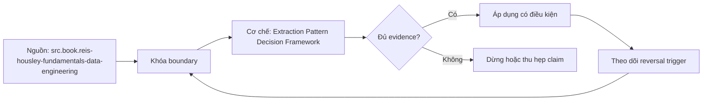

# Extraction Pattern Decision Framework

> [!abstract] Câu hỏi trung tâm
> Chọn full snapshot, watermark, CDC, pagination hay file delivery dựa trên semantics và constraints nào?

## 1. Patterns and guarantees

Full snapshot rereads current state; snapshot diff can infer changes between comparable boundaries. High watermark queries rows after cursor and depends on strong assumptions. Log CDC consumes committed change records including deletes where configured. API cursor/pagination follows service contract. File drop follows producer delivery protocol. Webhook is notification/delivery, often requiring reconciliation. Connector product wraps patterns but does not strengthen source semantics.

## 2. Decision inputs

Use change operations, stable identity, total ordering, delete visibility, history/retention, volume, latency SLO, source load, replay/backfill, schema behavior, rate limits and permissions. Pattern is rejected if a required assumption is false, not rescued by convenience. Example: hard delete plus no tombstone invalidates timestamp incremental for complete replica unless periodic snapshot diff closes gap.

## 3. Full snapshot and diff

Strong for bootstrap and reconciliation; expensive at scale and needs immutable/consistent boundary. Diff needs keys and comparable snapshots. It detects disappearance but cannot reconstruct multiple intermediate transitions. Source load, transaction duration and replica lag matter. Chunking must preserve boundary. Full refresh replace can provide simple recovery if destination publication atomic.

## 4. Watermark and CDC

Watermark is low infrastructure but misses updates without cursor change, hard deletes and rows at ambiguous boundary if predicate/tie/checkpoint wrong. Overlap+dedup reduces late-arrival risk but cannot reveal invisible deletes. CDC gives ordered committed operations and delete evidence, but needs snapshot-to-log handoff, retention monitoring, schema/DDL handling, idempotent application and source privileges.

## 5. API and files

Offset pagination is vulnerable under mutable ordering; keyset needs stable unique order; opaque cursor may hold server snapshot/state but expires and must be checkpointed. File delivery needs manifest, completion marker, checksum, naming/identity and resend policy. Rate limit, retry and partial-response errors shape extraction. Backfill access may differ from ongoing interface.

## 6. ADR for four sources

For each source, list feasible patterns, hard constraints, assumptions/tests, recovery/replay, delete handling and reconciliation. Run decisive probes: monotonicity, mutation coverage, retention, pagination under inserts, file completeness. Select with evidence and reversal condition. Own correctness even when buying connector: vendor support/SLAs do not replace contract validation.

## 7. Ma trận kiểm chứng từng mệnh đề

Mỗi claim phải gắn source/entity boundary, exact fixture, checkpoint/input state, counterexample và independent reconciliation oracle. Connector chạy thành công hoặc API trả 2xx chưa chứng minh completeness.

### 7.1. Pattern-decision probe 1: source semantics, rejected options, assumptions, validation và recovery must be explicit

**Mệnh đề cần kiểm.** Pattern-decision probe 1: source semantics, rejected options, assumptions, validation và recovery must be explicit.

**Thiết kế phép thử cho `wiki.ingestion.extraction-pattern-decision-framework`.** Khóa source/API version, entity, grain/key, time boundary, schema, pagination/cursor configuration và failure schedule. Tạo positive, boundary và negative fixtures; thay đổi đúng một assumption. Lưu request/query, response/raw extract hash, checkpoint trước/sau, landing objects, target state và source-at-boundary oracle.

**Điều kiện chấp nhận cho `wiki.ingestion.extraction-pattern-decision-framework`.** Count, key set, typed field hash và delete state khớp contract; duplicates được giải thích và dedup có identity rõ. Observation, inference và unknown được báo riêng. Lab chưa chạy chỉ là protocol.

### 7.2. Pattern-decision probe 2: source semantics, rejected options, assumptions, validation và recovery must be explicit

**Mệnh đề cần kiểm.** Pattern-decision probe 2: source semantics, rejected options, assumptions, validation và recovery must be explicit.

**Thiết kế phép thử cho `wiki.ingestion.extraction-pattern-decision-framework`.** Khóa source/API version, entity, grain/key, time boundary, schema, pagination/cursor configuration và failure schedule. Tạo positive, boundary và negative fixtures; thay đổi đúng một assumption. Lưu request/query, response/raw extract hash, checkpoint trước/sau, landing objects, target state và source-at-boundary oracle.

**Điều kiện chấp nhận cho `wiki.ingestion.extraction-pattern-decision-framework`.** Count, key set, typed field hash và delete state khớp contract; duplicates được giải thích và dedup có identity rõ. Observation, inference và unknown được báo riêng. Lab chưa chạy chỉ là protocol.

### 7.3. Pattern-decision probe 3: source semantics, rejected options, assumptions, validation và recovery must be explicit

**Mệnh đề cần kiểm.** Pattern-decision probe 3: source semantics, rejected options, assumptions, validation và recovery must be explicit.

**Thiết kế phép thử cho `wiki.ingestion.extraction-pattern-decision-framework`.** Khóa source/API version, entity, grain/key, time boundary, schema, pagination/cursor configuration và failure schedule. Tạo positive, boundary và negative fixtures; thay đổi đúng một assumption. Lưu request/query, response/raw extract hash, checkpoint trước/sau, landing objects, target state và source-at-boundary oracle.

**Điều kiện chấp nhận cho `wiki.ingestion.extraction-pattern-decision-framework`.** Count, key set, typed field hash và delete state khớp contract; duplicates được giải thích và dedup có identity rõ. Observation, inference và unknown được báo riêng. Lab chưa chạy chỉ là protocol.

### 7.4. Pattern-decision probe 4: source semantics, rejected options, assumptions, validation và recovery must be explicit

**Mệnh đề cần kiểm.** Pattern-decision probe 4: source semantics, rejected options, assumptions, validation và recovery must be explicit.

**Thiết kế phép thử cho `wiki.ingestion.extraction-pattern-decision-framework`.** Khóa source/API version, entity, grain/key, time boundary, schema, pagination/cursor configuration và failure schedule. Tạo positive, boundary và negative fixtures; thay đổi đúng một assumption. Lưu request/query, response/raw extract hash, checkpoint trước/sau, landing objects, target state và source-at-boundary oracle.

**Điều kiện chấp nhận cho `wiki.ingestion.extraction-pattern-decision-framework`.** Count, key set, typed field hash và delete state khớp contract; duplicates được giải thích và dedup có identity rõ. Observation, inference và unknown được báo riêng. Lab chưa chạy chỉ là protocol.

### 7.5. Pattern-decision probe 5: source semantics, rejected options, assumptions, validation và recovery must be explicit

**Mệnh đề cần kiểm.** Pattern-decision probe 5: source semantics, rejected options, assumptions, validation và recovery must be explicit.

**Thiết kế phép thử cho `wiki.ingestion.extraction-pattern-decision-framework`.** Khóa source/API version, entity, grain/key, time boundary, schema, pagination/cursor configuration và failure schedule. Tạo positive, boundary và negative fixtures; thay đổi đúng một assumption. Lưu request/query, response/raw extract hash, checkpoint trước/sau, landing objects, target state và source-at-boundary oracle.

**Điều kiện chấp nhận cho `wiki.ingestion.extraction-pattern-decision-framework`.** Count, key set, typed field hash và delete state khớp contract; duplicates được giải thích và dedup có identity rõ. Observation, inference và unknown được báo riêng. Lab chưa chạy chỉ là protocol.

### 7.6. Pattern-decision probe 6: source semantics, rejected options, assumptions, validation và recovery must be explicit

**Mệnh đề cần kiểm.** Pattern-decision probe 6: source semantics, rejected options, assumptions, validation và recovery must be explicit.

**Thiết kế phép thử cho `wiki.ingestion.extraction-pattern-decision-framework`.** Khóa source/API version, entity, grain/key, time boundary, schema, pagination/cursor configuration và failure schedule. Tạo positive, boundary và negative fixtures; thay đổi đúng một assumption. Lưu request/query, response/raw extract hash, checkpoint trước/sau, landing objects, target state và source-at-boundary oracle.

**Điều kiện chấp nhận cho `wiki.ingestion.extraction-pattern-decision-framework`.** Count, key set, typed field hash và delete state khớp contract; duplicates được giải thích và dedup có identity rõ. Observation, inference và unknown được báo riêng. Lab chưa chạy chỉ là protocol.

### 7.7. Pattern-decision probe 7: source semantics, rejected options, assumptions, validation và recovery must be explicit

**Mệnh đề cần kiểm.** Pattern-decision probe 7: source semantics, rejected options, assumptions, validation và recovery must be explicit.

**Thiết kế phép thử cho `wiki.ingestion.extraction-pattern-decision-framework`.** Khóa source/API version, entity, grain/key, time boundary, schema, pagination/cursor configuration và failure schedule. Tạo positive, boundary và negative fixtures; thay đổi đúng một assumption. Lưu request/query, response/raw extract hash, checkpoint trước/sau, landing objects, target state và source-at-boundary oracle.

**Điều kiện chấp nhận cho `wiki.ingestion.extraction-pattern-decision-framework`.** Count, key set, typed field hash và delete state khớp contract; duplicates được giải thích và dedup có identity rõ. Observation, inference và unknown được báo riêng. Lab chưa chạy chỉ là protocol.

### 7.8. Pattern-decision probe 8: source semantics, rejected options, assumptions, validation và recovery must be explicit

**Mệnh đề cần kiểm.** Pattern-decision probe 8: source semantics, rejected options, assumptions, validation và recovery must be explicit.

**Thiết kế phép thử cho `wiki.ingestion.extraction-pattern-decision-framework`.** Khóa source/API version, entity, grain/key, time boundary, schema, pagination/cursor configuration và failure schedule. Tạo positive, boundary và negative fixtures; thay đổi đúng một assumption. Lưu request/query, response/raw extract hash, checkpoint trước/sau, landing objects, target state và source-at-boundary oracle.

**Điều kiện chấp nhận cho `wiki.ingestion.extraction-pattern-decision-framework`.** Count, key set, typed field hash và delete state khớp contract; duplicates được giải thích và dedup có identity rõ. Observation, inference và unknown được báo riêng. Lab chưa chạy chỉ là protocol.

### 7.9. Pattern-decision probe 9: source semantics, rejected options, assumptions, validation và recovery must be explicit

**Mệnh đề cần kiểm.** Pattern-decision probe 9: source semantics, rejected options, assumptions, validation và recovery must be explicit.

**Thiết kế phép thử cho `wiki.ingestion.extraction-pattern-decision-framework`.** Khóa source/API version, entity, grain/key, time boundary, schema, pagination/cursor configuration và failure schedule. Tạo positive, boundary và negative fixtures; thay đổi đúng một assumption. Lưu request/query, response/raw extract hash, checkpoint trước/sau, landing objects, target state và source-at-boundary oracle.

**Điều kiện chấp nhận cho `wiki.ingestion.extraction-pattern-decision-framework`.** Count, key set, typed field hash và delete state khớp contract; duplicates được giải thích và dedup có identity rõ. Observation, inference và unknown được báo riêng. Lab chưa chạy chỉ là protocol.

### 7.10. Pattern-decision probe 10: source semantics, rejected options, assumptions, validation và recovery must be explicit

**Mệnh đề cần kiểm.** Pattern-decision probe 10: source semantics, rejected options, assumptions, validation và recovery must be explicit.

**Thiết kế phép thử cho `wiki.ingestion.extraction-pattern-decision-framework`.** Khóa source/API version, entity, grain/key, time boundary, schema, pagination/cursor configuration và failure schedule. Tạo positive, boundary và negative fixtures; thay đổi đúng một assumption. Lưu request/query, response/raw extract hash, checkpoint trước/sau, landing objects, target state và source-at-boundary oracle.

**Điều kiện chấp nhận cho `wiki.ingestion.extraction-pattern-decision-framework`.** Count, key set, typed field hash và delete state khớp contract; duplicates được giải thích và dedup có identity rõ. Observation, inference và unknown được báo riêng. Lab chưa chạy chỉ là protocol.

### 7.11. Pattern-decision probe 11: source semantics, rejected options, assumptions, validation và recovery must be explicit

**Mệnh đề cần kiểm.** Pattern-decision probe 11: source semantics, rejected options, assumptions, validation và recovery must be explicit.

**Thiết kế phép thử cho `wiki.ingestion.extraction-pattern-decision-framework`.** Khóa source/API version, entity, grain/key, time boundary, schema, pagination/cursor configuration và failure schedule. Tạo positive, boundary và negative fixtures; thay đổi đúng một assumption. Lưu request/query, response/raw extract hash, checkpoint trước/sau, landing objects, target state và source-at-boundary oracle.

**Điều kiện chấp nhận cho `wiki.ingestion.extraction-pattern-decision-framework`.** Count, key set, typed field hash và delete state khớp contract; duplicates được giải thích và dedup có identity rõ. Observation, inference và unknown được báo riêng. Lab chưa chạy chỉ là protocol.

### 7.12. Pattern-decision probe 12: source semantics, rejected options, assumptions, validation và recovery must be explicit

**Mệnh đề cần kiểm.** Pattern-decision probe 12: source semantics, rejected options, assumptions, validation và recovery must be explicit.

**Thiết kế phép thử cho `wiki.ingestion.extraction-pattern-decision-framework`.** Khóa source/API version, entity, grain/key, time boundary, schema, pagination/cursor configuration và failure schedule. Tạo positive, boundary và negative fixtures; thay đổi đúng một assumption. Lưu request/query, response/raw extract hash, checkpoint trước/sau, landing objects, target state và source-at-boundary oracle.

**Điều kiện chấp nhận cho `wiki.ingestion.extraction-pattern-decision-framework`.** Count, key set, typed field hash và delete state khớp contract; duplicates được giải thích và dedup có identity rõ. Observation, inference và unknown được báo riêng. Lab chưa chạy chỉ là protocol.

### 7.13. Pattern-decision probe 13: source semantics, rejected options, assumptions, validation và recovery must be explicit

**Mệnh đề cần kiểm.** Pattern-decision probe 13: source semantics, rejected options, assumptions, validation và recovery must be explicit.

**Thiết kế phép thử cho `wiki.ingestion.extraction-pattern-decision-framework`.** Khóa source/API version, entity, grain/key, time boundary, schema, pagination/cursor configuration và failure schedule. Tạo positive, boundary và negative fixtures; thay đổi đúng một assumption. Lưu request/query, response/raw extract hash, checkpoint trước/sau, landing objects, target state và source-at-boundary oracle.

**Điều kiện chấp nhận cho `wiki.ingestion.extraction-pattern-decision-framework`.** Count, key set, typed field hash và delete state khớp contract; duplicates được giải thích và dedup có identity rõ. Observation, inference và unknown được báo riêng. Lab chưa chạy chỉ là protocol.

### 7.14. Pattern-decision probe 14: source semantics, rejected options, assumptions, validation và recovery must be explicit

**Mệnh đề cần kiểm.** Pattern-decision probe 14: source semantics, rejected options, assumptions, validation và recovery must be explicit.

**Thiết kế phép thử cho `wiki.ingestion.extraction-pattern-decision-framework`.** Khóa source/API version, entity, grain/key, time boundary, schema, pagination/cursor configuration và failure schedule. Tạo positive, boundary và negative fixtures; thay đổi đúng một assumption. Lưu request/query, response/raw extract hash, checkpoint trước/sau, landing objects, target state và source-at-boundary oracle.

**Điều kiện chấp nhận cho `wiki.ingestion.extraction-pattern-decision-framework`.** Count, key set, typed field hash và delete state khớp contract; duplicates được giải thích và dedup có identity rõ. Observation, inference và unknown được báo riêng. Lab chưa chạy chỉ là protocol.

### 7.15. Pattern-decision probe 15: source semantics, rejected options, assumptions, validation và recovery must be explicit

**Mệnh đề cần kiểm.** Pattern-decision probe 15: source semantics, rejected options, assumptions, validation và recovery must be explicit.

**Thiết kế phép thử cho `wiki.ingestion.extraction-pattern-decision-framework`.** Khóa source/API version, entity, grain/key, time boundary, schema, pagination/cursor configuration và failure schedule. Tạo positive, boundary và negative fixtures; thay đổi đúng một assumption. Lưu request/query, response/raw extract hash, checkpoint trước/sau, landing objects, target state và source-at-boundary oracle.

**Điều kiện chấp nhận cho `wiki.ingestion.extraction-pattern-decision-framework`.** Count, key set, typed field hash và delete state khớp contract; duplicates được giải thích và dedup có identity rõ. Observation, inference và unknown được báo riêng. Lab chưa chạy chỉ là protocol.

## 8. Quy trình phản biện

1. Chốt entity, grain, identity và immutable boundary.
2. Tách source fact, documentation claim và observed behavior.
3. Viết delete, retry, checkpoint và replay semantics trước code.
4. Dùng key/typed-hash reconciliation, không chỉ row count.
5. Pin version, retention, timezone, ordering và rate limits.
6. Ghi assumption bị falsify và extraction pattern thay thế.

## 9. Câu hỏi tự kiểm tra

1. Source thay đổi row/entity theo những operation nào?
2. Boundary nào định nghĩa complete?
3. Delete có xuất hiện trong interface không?
4. Cursor/order có total và immutable không?
5. Crash ở checkpoint boundary gây replay hay gap?
6. Bằng chứng nào chưa được chạy?

## 10. Giới hạn và điều chưa cho phép kết luận

- Chưa chạy mutation/pagination/watermark lab trên source thật.
- Product behavior phải pin version, retention và configuration.
- Decision matrices và failure protocols là synthesis của giáo trình.
- Note giữ trạng thái `review` tới khi chủ dự án duyệt.

## Reference
1. [[SRC-REIS-HOUSLEY-FUNDAMENTALS-DATA-ENGINEERING]]
2. [[SRC-MICROSOFT-SQL-SERVER-CDC]]
3. [[SRC-AIRBYTE-INCREMENTAL-APPEND-DEDUPED]]
4. [[SRC-KLEPPMANN-DDIA-1E]]

## Source coverage

| Source slice | Nội dung sử dụng | Trạng thái |
|---|---|---|
| [[SRC-REIS-HOUSLEY-FUNDAMENTALS-DATA-ENGINEERING]] | Source/change/API contract hoặc engineering context | Đã đọc locator; không suy ngoài phạm vi |
| [[SRC-MICROSOFT-SQL-SERVER-CDC]] | Source/change/API contract hoặc engineering context | Đã đọc locator; không suy ngoài phạm vi |
| [[SRC-AIRBYTE-INCREMENTAL-APPEND-DEDUPED]] | Source/change/API contract hoặc engineering context | Đã đọc locator; không suy ngoài phạm vi |
| [[SRC-KLEPPMANN-DDIA-1E]] | Source/change/API contract hoặc engineering context | Đã đọc locator; không suy ngoài phạm vi |

## Key takeaways
- Extraction pattern chỉ đúng khi source assumptions đúng.
- Completeness cần immutable boundary và reconciliation oracle.
- Retry/checkpoint ưu tiên replay có kiểm soát hơn silent gap.
- Connector không chuyển giao ownership về tính đúng.

<!-- ATOMIC-EXECUTION-CAPSULE:START -->

## Execution capsule: kiểm chứng `wiki.ingestion.extraction-pattern-decision-framework`

> [!important] Phân loại mệnh đề
> Với `wiki.ingestion.extraction-pattern-decision-framework`, sơ đồ, ví dụ và artifact về **Extraction Pattern Decision Framework** là **synthesis để kiểm chứng**; chúng không phải trích dẫn hay case nguyên văn của nguồn.

### Sơ đồ cơ chế và điểm kiểm soát



Đọc sơ đồ `wiki.ingestion.extraction-pattern-decision-framework` từ trái sang phải: source chỉ cung cấp claim ban đầu cho **Extraction Pattern Decision Framework**; quyết định chỉ được đi tiếp sau khi boundary, evidence và điều kiện đảo quyết định đã hiện hữu.

### Ví dụ làm việc có thể bác bỏ

**Input.** Một đội cần trả lời: Chọn full snapshot, watermark, CDC, pagination hay file delivery dựa trên semantics và constraints nào? cho một phạm vi nhỏ, có owner và deadline rõ.

**Decision.** Đội áp dụng **Extraction Pattern Decision Framework** trên control và variant chỉ khác một assumption; expected result và hard constraints được khóa trước khi chạy.

**Outcome.** Với `wiki.ingestion.extraction-pattern-decision-framework`, nếu observation vi phạm hard constraint hoặc oracle độc lập không xác nhận **Extraction Pattern Decision Framework**, đội thu hẹp claim hay đảo quyết định. Nếu đạt, kết luận vẫn kèm scope, version và review date; một lần thành công không được nâng thành quy luật phổ quát.

### Artifact thực thi tối thiểu

```sql
-- Verification harness for: Extraction Pattern Decision Framework
WITH evidence AS (
    SELECT 'wiki.ingestion.extraction-pattern-decision-framework' AS concept_id,
           'boundary_declared' AS check_name, 1 AS passed
    UNION ALL
    SELECT 'wiki.ingestion.extraction-pattern-decision-framework', 'independent_oracle', 1
    UNION ALL
    SELECT 'wiki.ingestion.extraction-pattern-decision-framework', 'reversal_trigger_recorded', 1
)
SELECT concept_id,
       MIN(passed) AS all_hard_checks_pass,
       COUNT(*) AS evidence_items
FROM evidence
GROUP BY concept_id
HAVING MIN(passed) = 1;
```

Artifact của `wiki.ingestion.extraction-pattern-decision-framework` buộc người dùng ghi boundary, oracle và reversal trigger cho **Extraction Pattern Decision Framework**. Các giá trị minh họa phải được thay bằng evidence thật trước khi dùng cho quyết định.

### Tự kiểm tra trước khi tái sử dụng

1. Bạn có thể trả lời `Chọn full snapshot, watermark, CDC, pagination hay file delivery dựa trên semantics và constraints nào?` bằng một câu mà không kéo thêm concept thứ hai không?
2. Source locator nào đỡ cho claim, và phần nào chỉ là synthesis trong note?
3. Observation nào khiến bạn dừng, thu hẹp hoặc đảo quyết định?
4. Artifact nào cho phép một reviewer độc lập tái hiện kết quả?

<!-- ATOMIC-EXECUTION-CAPSULE:END -->
