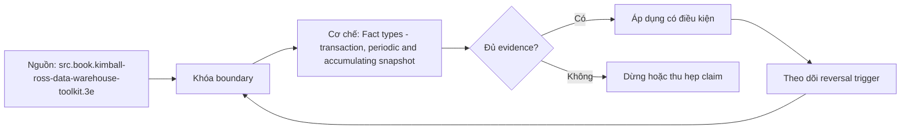

# Fact types - transaction, periodic and accumulating snapshot

> [!abstract] Câu hỏi trung tâm
> Transaction, periodic snapshot và accumulating snapshot khác nhau ở grain, load rhythm, update semantics và câu hỏi nghiệp vụ nào?

## 1. Transaction fact

Một row cho event ở thời điểm xảy ra; thường insert-only sau khi posted. Nó trả lời chuyện gì xảy ra, ở đâu, với ai và bao nhiêu. Grain phải là event detail thấp nhất hữu dụng. Không có row nghĩa là event không xảy ra hoặc chưa được capture; không suy state tại một ngày chỉ từ event nếu business logic phức tạp.

## 2. Periodic snapshot

Một row cho entity/cohort tại end-of-period đều đặn, kể cả kỳ có thể không có event theo design. Phù hợp balances, inventory và trendable status. Load là insert per period; prior periods giữ lại. Snapshot có thể chứa semi-additive measures nên time aggregation phải dùng ending/average/min/max theo contract.

## 3. Accumulating snapshot

Một row theo pipeline instance, có nhiều milestone dates và được revisit/update khi lifecycle tiến triển. Hợp với process hữu hạn, predictable stages như order fulfillment/claim. Grain không phải mỗi milestone; là một pipeline instance ở lowest tracked detail. Long-lived/open-ended process có thể không phù hợp.

## 4. Idempotency và backfill

Transaction load dedupe theo event identity; periodic snapshot replace/merge một entity-period; accumulating snapshot upsert deterministic milestone state. Backfill phải cho cùng output với sequential run ở cùng cutoff. Late event có thể sửa milestone và derived lags; audit update/source watermark để phân biệt replay với business correction.

## 5. Complementary models

Một domain thường cần cả event fact và snapshot fact. Transaction giữ chi tiết/audit; periodic cho state trend; accumulating cho cycle time. Redundancy có chủ ý nhưng reconciliation phải định nghĩa source-of-truth và equations. Factless fact table ghi occurrence/coverage/relationship để đếm khi không có numeric measure.

## 6. Ma trận kiểm chứng từng mệnh đề

Mỗi mệnh đề phải được chuyển thành invariant, fixture và phép đối chiếu có thể chạy lại. Sơ đồ đẹp hoặc một truy vấn trả về kết quả không lỗi không tự chứng minh mô hình đúng ngữ nghĩa.

### 6.1. transaction fact có grain một event occurrence

**Mệnh đề cần kiểm.** transaction fact có grain một event occurrence. **Thiết kế phép kiểm.** Phát cùng một event stream vào ba thiết kế: transaction, periodic snapshot và accumulating snapshot. Chạy normal load, replay, late event và backfill tại cùng cutoff. Bằng chứng đạt là grain/key không bị nhân, state/milestone được reconcile với event ledger và rerun tạo cùng output theo policy restatement đã ghi. **Hồ sơ cần lưu.** Grain/model/metric contract, dữ liệu seed, SQL hoặc notebook, kết quả thô, control totals và giải thích ca biên. Nếu phép kiểm chỉ xác nhận cấu trúc mà không xác nhận semantics, kết luận phải ghi rõ giới hạn đó.

### 6.2. periodic snapshot cần explicit period/cutoff/timezone

**Mệnh đề cần kiểm.** periodic snapshot cần explicit period/cutoff/timezone. **Thiết kế phép kiểm.** Phát cùng một event stream vào ba thiết kế: transaction, periodic snapshot và accumulating snapshot. Chạy normal load, replay, late event và backfill tại cùng cutoff. Bằng chứng đạt là grain/key không bị nhân, state/milestone được reconcile với event ledger và rerun tạo cùng output theo policy restatement đã ghi. **Hồ sơ cần lưu.** Grain/model/metric contract, dữ liệu seed, SQL hoặc notebook, kết quả thô, control totals và giải thích ca biên. Nếu phép kiểm chỉ xác nhận cấu trúc mà không xác nhận semantics, kết luận phải ghi rõ giới hạn đó.

### 6.3. accumulating snapshot update existing pipeline row

**Mệnh đề cần kiểm.** accumulating snapshot update existing pipeline row. **Thiết kế phép kiểm.** Phát cùng một event stream vào ba thiết kế: transaction, periodic snapshot và accumulating snapshot. Chạy normal load, replay, late event và backfill tại cùng cutoff. Bằng chứng đạt là grain/key không bị nhân, state/milestone được reconcile với event ledger và rerun tạo cùng output theo policy restatement đã ghi. **Hồ sơ cần lưu.** Grain/model/metric contract, dữ liệu seed, SQL hoặc notebook, kết quả thô, control totals và giải thích ca biên. Nếu phép kiểm chỉ xác nhận cấu trúc mà không xác nhận semantics, kết luận phải ghi rõ giới hạn đó.

### 6.4. nhiều date columns không tự chứng minh accumulating snapshot

**Mệnh đề cần kiểm.** nhiều date columns không tự chứng minh accumulating snapshot. **Thiết kế phép kiểm.** Phát cùng một event stream vào ba thiết kế: transaction, periodic snapshot và accumulating snapshot. Chạy normal load, replay, late event và backfill tại cùng cutoff. Bằng chứng đạt là grain/key không bị nhân, state/milestone được reconcile với event ledger và rerun tạo cùng output theo policy restatement đã ghi. **Hồ sơ cần lưu.** Grain/model/metric contract, dữ liệu seed, SQL hoặc notebook, kết quả thô, control totals và giải thích ca biên. Nếu phép kiểm chỉ xác nhận cấu trúc mà không xác nhận semantics, kết luận phải ghi rõ giới hạn đó.

### 6.5. balance không suy đơn giản từ transaction khi business rules phức tạp

**Mệnh đề cần kiểm.** balance không suy đơn giản từ transaction khi business rules phức tạp. **Thiết kế phép kiểm.** Phát cùng một event stream vào ba thiết kế: transaction, periodic snapshot và accumulating snapshot. Chạy normal load, replay, late event và backfill tại cùng cutoff. Bằng chứng đạt là grain/key không bị nhân, state/milestone được reconcile với event ledger và rerun tạo cùng output theo policy restatement đã ghi. **Hồ sơ cần lưu.** Grain/model/metric contract, dữ liệu seed, SQL hoặc notebook, kết quả thô, control totals và giải thích ca biên. Nếu phép kiểm chỉ xác nhận cấu trúc mà không xác nhận semantics, kết luận phải ghi rõ giới hạn đó.

### 6.6. periodic snapshot có thể cần dense rows cho zero/no-activity

**Mệnh đề cần kiểm.** periodic snapshot có thể cần dense rows cho zero/no-activity. **Thiết kế phép kiểm.** Phát cùng một event stream vào ba thiết kế: transaction, periodic snapshot và accumulating snapshot. Chạy normal load, replay, late event và backfill tại cùng cutoff. Bằng chứng đạt là grain/key không bị nhân, state/milestone được reconcile với event ledger và rerun tạo cùng output theo policy restatement đã ghi. **Hồ sơ cần lưu.** Grain/model/metric contract, dữ liệu seed, SQL hoặc notebook, kết quả thô, control totals và giải thích ca biên. Nếu phép kiểm chỉ xác nhận cấu trúc mà không xác nhận semantics, kết luận phải ghi rõ giới hạn đó.

### 6.7. late event có thể sửa prior snapshot theo restatement policy

**Mệnh đề cần kiểm.** late event có thể sửa prior snapshot theo restatement policy. **Thiết kế phép kiểm.** Phát cùng một event stream vào ba thiết kế: transaction, periodic snapshot và accumulating snapshot. Chạy normal load, replay, late event và backfill tại cùng cutoff. Bằng chứng đạt là grain/key không bị nhân, state/milestone được reconcile với event ledger và rerun tạo cùng output theo policy restatement đã ghi. **Hồ sơ cần lưu.** Grain/model/metric contract, dữ liệu seed, SQL hoặc notebook, kết quả thô, control totals và giải thích ca biên. Nếu phép kiểm chỉ xác nhận cấu trúc mà không xác nhận semantics, kết luận phải ghi rõ giới hạn đó.

### 6.8. backfill phải idempotent và cutoff-aware

**Mệnh đề cần kiểm.** backfill phải idempotent và cutoff-aware. **Thiết kế phép kiểm.** Phát cùng một event stream vào ba thiết kế: transaction, periodic snapshot và accumulating snapshot. Chạy normal load, replay, late event và backfill tại cùng cutoff. Bằng chứng đạt là grain/key không bị nhân, state/milestone được reconcile với event ledger và rerun tạo cùng output theo policy restatement đã ghi. **Hồ sơ cần lưu.** Grain/model/metric contract, dữ liệu seed, SQL hoặc notebook, kết quả thô, control totals và giải thích ca biên. Nếu phép kiểm chỉ xác nhận cấu trúc mà không xác nhận semantics, kết luận phải ghi rõ giới hạn đó.

### 6.9. transaction dedupe cần stable event identity

**Mệnh đề cần kiểm.** transaction dedupe cần stable event identity. **Thiết kế phép kiểm.** Phát cùng một event stream vào ba thiết kế: transaction, periodic snapshot và accumulating snapshot. Chạy normal load, replay, late event và backfill tại cùng cutoff. Bằng chứng đạt là grain/key không bị nhân, state/milestone được reconcile với event ledger và rerun tạo cùng output theo policy restatement đã ghi. **Hồ sơ cần lưu.** Grain/model/metric contract, dữ liệu seed, SQL hoặc notebook, kết quả thô, control totals và giải thích ca biên. Nếu phép kiểm chỉ xác nhận cấu trúc mà không xác nhận semantics, kết luận phải ghi rõ giới hạn đó.

### 6.10. accumulating milestone update cần monotonicity hoặc correction rule

**Mệnh đề cần kiểm.** accumulating milestone update cần monotonicity hoặc correction rule. **Thiết kế phép kiểm.** Phát cùng một event stream vào ba thiết kế: transaction, periodic snapshot và accumulating snapshot. Chạy normal load, replay, late event và backfill tại cùng cutoff. Bằng chứng đạt là grain/key không bị nhân, state/milestone được reconcile với event ledger và rerun tạo cùng output theo policy restatement đã ghi. **Hồ sơ cần lưu.** Grain/model/metric contract, dữ liệu seed, SQL hoặc notebook, kết quả thô, control totals và giải thích ca biên. Nếu phép kiểm chỉ xác nhận cấu trúc mà không xác nhận semantics, kết luận phải ghi rõ giới hạn đó.

### 6.11. cycle time tính từ milestone timestamps và null handling

**Mệnh đề cần kiểm.** cycle time tính từ milestone timestamps và null handling. **Thiết kế phép kiểm.** Phát cùng một event stream vào ba thiết kế: transaction, periodic snapshot và accumulating snapshot. Chạy normal load, replay, late event và backfill tại cùng cutoff. Bằng chứng đạt là grain/key không bị nhân, state/milestone được reconcile với event ledger và rerun tạo cùng output theo policy restatement đã ghi. **Hồ sơ cần lưu.** Grain/model/metric contract, dữ liệu seed, SQL hoặc notebook, kết quả thô, control totals và giải thích ca biên. Nếu phép kiểm chỉ xác nhận cấu trúc mà không xác nhận semantics, kết luận phải ghi rõ giới hạn đó.

### 6.12. factless fact ghi occurrence hoặc coverage

**Mệnh đề cần kiểm.** factless fact ghi occurrence hoặc coverage. **Thiết kế phép kiểm.** Phát cùng một event stream vào ba thiết kế: transaction, periodic snapshot và accumulating snapshot. Chạy normal load, replay, late event và backfill tại cùng cutoff. Bằng chứng đạt là grain/key không bị nhân, state/milestone được reconcile với event ledger và rerun tạo cùng output theo policy restatement đã ghi. **Hồ sơ cần lưu.** Grain/model/metric contract, dữ liệu seed, SQL hoặc notebook, kết quả thô, control totals và giải thích ca biên. Nếu phép kiểm chỉ xác nhận cấu trúc mà không xác nhận semantics, kết luận phải ghi rõ giới hạn đó.

### 6.13. companion fact tables cần reconciliation equation

**Mệnh đề cần kiểm.** companion fact tables cần reconciliation equation. **Thiết kế phép kiểm.** Phát cùng một event stream vào ba thiết kế: transaction, periodic snapshot và accumulating snapshot. Chạy normal load, replay, late event và backfill tại cùng cutoff. Bằng chứng đạt là grain/key không bị nhân, state/milestone được reconcile với event ledger và rerun tạo cùng output theo policy restatement đã ghi. **Hồ sơ cần lưu.** Grain/model/metric contract, dữ liệu seed, SQL hoặc notebook, kết quả thô, control totals và giải thích ca biên. Nếu phép kiểm chỉ xác nhận cấu trúc mà không xác nhận semantics, kết luận phải ghi rõ giới hạn đó.

### 6.14. snapshot retention khác raw event retention

**Mệnh đề cần kiểm.** snapshot retention khác raw event retention. **Thiết kế phép kiểm.** Phát cùng một event stream vào ba thiết kế: transaction, periodic snapshot và accumulating snapshot. Chạy normal load, replay, late event và backfill tại cùng cutoff. Bằng chứng đạt là grain/key không bị nhân, state/milestone được reconcile với event ledger và rerun tạo cùng output theo policy restatement đã ghi. **Hồ sơ cần lưu.** Grain/model/metric contract, dữ liệu seed, SQL hoặc notebook, kết quả thô, control totals và giải thích ca biên. Nếu phép kiểm chỉ xác nhận cấu trúc mà không xác nhận semantics, kết luận phải ghi rõ giới hạn đó.

### 6.15. chọn loại theo question chứ theo table-name convention

**Mệnh đề cần kiểm.** chọn loại theo question chứ theo table-name convention. **Thiết kế phép kiểm.** Phát cùng một event stream vào ba thiết kế: transaction, periodic snapshot và accumulating snapshot. Chạy normal load, replay, late event và backfill tại cùng cutoff. Bằng chứng đạt là grain/key không bị nhân, state/milestone được reconcile với event ledger và rerun tạo cùng output theo policy restatement đã ghi. **Hồ sơ cần lưu.** Grain/model/metric contract, dữ liệu seed, SQL hoặc notebook, kết quả thô, control totals và giải thích ca biên. Nếu phép kiểm chỉ xác nhận cấu trúc mà không xác nhận semantics, kết luận phải ghi rõ giới hạn đó.

## 7. Quy trình phản biện mô hình

1. Viết business question, grain, identity, time semantics và invariant trước khi vẽ bảng.
2. Chỉ ra owner của định nghĩa và artifact nào là canonical.
3. Tách source fact, quyết định thiết kế và curriculum synthesis; không gán suy luận cho sách.
4. Dựng ca biên tối thiểu: duplicate, null, late correction, code reuse, many-to-many hoặc missing period tuỳ bài.
5. Đo row count, distinct business key, unmatched rate và control totals trước–sau mỗi phép biến đổi.
6. Thử replay/backfill và đổi cutoff; thiết kế không tái chạy được chưa đủ bằng chứng để vận hành.
7. Lưu quyết định, phản ví dụ và giới hạn; không xoá failed run vì nó là bằng chứng của failure boundary.

## 8. Câu hỏi tự kiểm tra

1. Row đại diện điều gì, được nhận dạng bằng gì và có hiệu lực khi nào?
2. Ca biên nhỏ nhất nào làm thiết kế cho ra số sai nhưng SQL vẫn hợp lệ?
3. Constraint/test nào bắt lỗi cấu trúc, và phần ngữ nghĩa nào vẫn cần owner xác nhận?
4. Late data, correction, replay và backfill làm model thay đổi ra sao?
5. Phần nào đến trực tiếp từ nguồn; phần nào là tổng hợp của giáo trình?
6. Artifact và phép kiểm nào cho phép người khác bác bỏ kết luận?

## 9. Giới hạn và điều chưa cho phép kết luận

- Chưa chạy profiling, merge/backfill hay reconciliation lab; các phép kiểm trong note là giao thức cần thực thi, không phải kết quả đã đo.
- Sample không có duplicate không chứng minh business uniqueness; schema hợp lệ không chứng minh đúng grain.
- HCMUT System Modeling cung cấp khung abstraction/perspective; phép ánh xạ conceptual–logical–physical trong bài là synthesis có ghi nhãn.
- DDIA và Silberschatz cung cấp ranh giới data model/database design; taxonomy dimensional chi tiết lấy Kimball–Ross làm nguồn chính.
- Không suy performance, dung lượng, threshold hoặc production readiness nếu chưa đo trên workload và engine mục tiêu.

## Reference
1. [[SRC-KIMBALL-ROSS-DW-TOOLKIT-3E]]
2. [[SRC-SILBERSCHATZ-DATABASE-SYSTEM-CONCEPTS-7E]]
3. [[SRC-KLEPPMANN-DDIA-1E]]

## Source coverage

| Source slice | Nội dung sử dụng | Trạng thái |
|---|---|---|
| [[SRC-KIMBALL-ROSS-DW-TOOLKIT-3E]] | Khái niệm, ranh giới và phản ví dụ liên quan đến bài | Đã đọc phạm vi có locator; không suy nội dung ngoài phạm vi |
| [[SRC-SILBERSCHATZ-DATABASE-SYSTEM-CONCEPTS-7E]] | Khái niệm, ranh giới và phản ví dụ liên quan đến bài | Đã đọc phạm vi có locator; không suy nội dung ngoài phạm vi |
| [[SRC-KLEPPMANN-DDIA-1E]] | Khái niệm, ranh giới và phản ví dụ liên quan đến bài | Đã đọc phạm vi có locator; không suy nội dung ngoài phạm vi |

## Key takeaways
- Bắt đầu từ business question, grain, identity, time và invariant; cột là hệ quả, không phải điểm xuất phát.
- Tách ngữ nghĩa, logical constraints và physical implementation để thay đổi có traceability.
- Key duy nhất, SQL chạy được hoặc diagram đẹp không tự chứng minh mô hình đúng.
- Mọi measure cần aggregation contract theo grain, dimension, unit, cutoff và late-data policy.
- Chưa chạy phép kiểm thì note là tài liệu học thuật đã truy nguồn, không phải chứng nhận production.

<!-- ATOMIC-EXECUTION-CAPSULE:START -->

## Execution capsule — kiểm chứng `wiki.data-modeling.fact-table-types`

> [!important] Phân loại mệnh đề
> Với `wiki.data-modeling.fact-table-types`, sơ đồ, ví dụ và artifact về **Fact types - transaction, periodic and accumulating snapshot** là **synthesis để kiểm chứng**; chúng không phải trích dẫn hay case nguyên văn của nguồn.

### Sơ đồ cơ chế và điểm kiểm soát



Đọc sơ đồ `wiki.data-modeling.fact-table-types` từ trái sang phải: source chỉ cung cấp claim ban đầu cho **Fact types - transaction, periodic and accumulating snapshot**; quyết định chỉ được đi tiếp sau khi boundary, evidence và điều kiện đảo quyết định đã hiện hữu.

### Artifact thực thi tối thiểu

```sql
-- Verification harness for: Fact types - transaction, periodic and accumulating snapshot
WITH evidence AS (
    SELECT 'wiki.data-modeling.fact-table-types' AS concept_id,
           'boundary_declared' AS check_name, 1 AS passed
    UNION ALL
    SELECT 'wiki.data-modeling.fact-table-types', 'independent_oracle', 1
    UNION ALL
    SELECT 'wiki.data-modeling.fact-table-types', 'reversal_trigger_recorded', 1
)
SELECT concept_id,
       MIN(passed) AS all_hard_checks_pass,
       COUNT(*) AS evidence_items
FROM evidence
GROUP BY concept_id
HAVING MIN(passed) = 1;
```

Artifact của `wiki.data-modeling.fact-table-types` buộc người dùng ghi boundary, oracle và reversal trigger cho **Fact types - transaction, periodic and accumulating snapshot**. Các giá trị minh họa phải được thay bằng evidence thật trước khi dùng cho quyết định.

### Tự kiểm tra trước khi tái sử dụng

1. Bạn có thể trả lời `Transaction, periodic snapshot và accumulating snapshot khác nhau ở grain, load rhythm, update semantics và câu hỏi nghiệp vụ nào?` bằng một câu mà không kéo thêm concept thứ hai không?
2. Source locator nào đỡ cho claim, và phần nào chỉ là synthesis trong note?
3. Observation nào khiến bạn dừng, thu hẹp hoặc đảo quyết định?
4. Artifact nào cho phép một reviewer độc lập tái hiện kết quả?

<!-- ATOMIC-EXECUTION-CAPSULE:END -->
