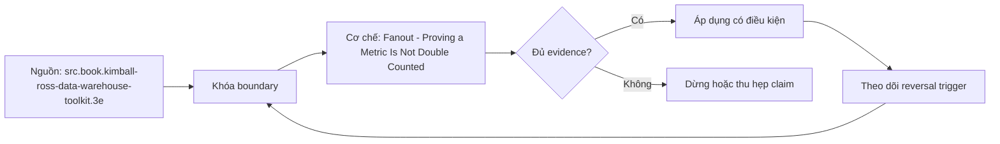

# Fanout - Proving a Metric Is Not Double Counted

> [!abstract] Câu hỏi trung tâm
> Một metric cần hồ sơ bằng chứng nào để chứng minh mọi join path bảo toàn grain và control totals ở nhiều mức gộp?

## 1. Nghĩa vụ chứng minh

“Không thấy số lạ” không phải bằng chứng. Mỗi metric phải có fanout proof gắn với contract version và semantic graph version. Proof xác nhận population, grain, join cardinality, row multiplicity và aggregate output trên fixture có ca biên. Một lần kiểm ở detail grain không đủ vì duplicate có thể collapse khi group hoặc chỉ lộ khi slice theo dimension khác.

## 2. Bước một: grain ledger

Liệt kê từng relation/model tham gia, một row đại diện gì, business key, time validity và expected uniqueness. Ghi metric base grain và requested output grains. Với SCD join, key gồm business identity cùng effective interval; uniqueness chỉ trên surrogate key không chứng minh one-match-at-event-time. Bridge cần impact/allocation semantics và expected weight sum.

## 3. Bước hai: row-count và multiplicity ledger

Trước và sau từng edge, ghi row count, distinct base fact key, unmatched facts, matches per base key, max/p95 multiplicity và keys có >1 matches. Với expected many-to-one, bất kỳ base key có >1 right match là failure. Với expected many-to-many, multiplication có thể hợp lệ nhưng measure chỉ được aggregate theo allocation/impact contract. Không đợi đến final query mới tìm edge gây bùng.

## 4. Bước ba: independent oracle

Oracle query đọc fact gốc tối thiểu, áp đúng population/time/filter nhưng không reuse generated SQL, semantic view hoặc cùng macro. So eligible fact IDs, numerator/denominator và totals. Nếu oracle dùng chung join path đang kiểm, hai bên có thể cùng sai. Lưu oracle version và review độc lập; hand calculation trên fixture nhỏ giúp phát hiện logic chung bị sao chép.

## 5. Bước bốn: ba mức gộp

Kiểm ở base/detail, một middle grouping như customer-month và một coarse grouping như region-quarter/all-period. Thêm dimension có khả năng gây path change. So exact sets/totals, không chỉ rounded dashboard. Ratio so components trước final ratio; distinct count so entity sets; semi-additive balance kiểm allowed time operator. Mức gộp phải xuất phát từ usage thật và failure mode, không chọn ba mức tương đương.

## 6. Sửa và tái chứng nhận

Fix có thể đổi relationship/cardinality, pre-aggregate, thêm bridge allocation, đổi allowed dimension hoặc tách query. Sau sửa phải chạy lại cả proof suite và negative case; không chỉ query từng fail. Semantic graph/model change, mart grain change, SCD policy hoặc new dimension cần invalidate certification có liên quan. Catalog entry ghi evidence fingerprint, certified version, reviewer, expiration/trigger.

## 7. Ba metric trong bài lab

Một additive revenue metric qua many-to-one dimensions; một bridge-allocated metric; một deliberately broken metric qua duplicated dimension hoặc chasm. Mỗi metric có proof table ba grains. Broken metric phải định lượng inflation absolute/relative và list offending keys. Hai metrics sạch vẫn phải có negative control chứng minh harness bắt được duplicate khi seed được thay đổi.

## 8. Ma trận kiểm chứng từng mệnh đề

Mọi mệnh đề dưới đây cần fixture, invariant, independent oracle và output lưu được. Compile thành công hoặc con số nhìn hợp lý không đủ làm bằng chứng.

### 8.1. grain statement phải có business key và time semantics

**Mệnh đề cần kiểm.** grain statement phải có business key và time semantics.

**Cách kiểm.** Lập grain/multiplicity ledger per edge, independent oracle và three-grain reconciliation cho ba metrics. Seed một duplicate để chứng minh negative control bắt được; fingerprint certificate theo model/contract version. Với mệnh đề này, ghi data shape gây lỗi, expected result và failure signal. Không dùng generated query làm oracle cho chính nó.

**Bằng chứng đạt cho `wiki.semantic-layer.fanout-proof`.** Lưu contract/graph/config version, seed snapshot, command/SQL, raw output, row/multiplicity ledger và semantic diff. Nếu chưa chạy tool/lab, trạng thái chỉ là test protocol.

### 8.2. surrogate uniqueness không chứng minh one temporal match

**Mệnh đề cần kiểm.** surrogate uniqueness không chứng minh one temporal match.

**Cách kiểm.** Lập grain/multiplicity ledger per edge, independent oracle và three-grain reconciliation cho ba metrics. Seed một duplicate để chứng minh negative control bắt được; fingerprint certificate theo model/contract version. Với mệnh đề này, ghi data shape gây lỗi, expected result và failure signal. Không dùng generated query làm oracle cho chính nó.

**Bằng chứng đạt cho `wiki.semantic-layer.fanout-proof`.** Lưu contract/graph/config version, seed snapshot, command/SQL, raw output, row/multiplicity ledger và semantic diff. Nếu chưa chạy tool/lab, trạng thái chỉ là test protocol.

### 8.3. row count phải ghi sau từng edge

**Mệnh đề cần kiểm.** row count phải ghi sau từng edge.

**Cách kiểm.** Lập grain/multiplicity ledger per edge, independent oracle và three-grain reconciliation cho ba metrics. Seed một duplicate để chứng minh negative control bắt được; fingerprint certificate theo model/contract version. Với mệnh đề này, ghi data shape gây lỗi, expected result và failure signal. Không dùng generated query làm oracle cho chính nó.

**Bằng chứng đạt cho `wiki.semantic-layer.fanout-proof`.** Lưu contract/graph/config version, seed snapshot, command/SQL, raw output, row/multiplicity ledger và semantic diff. Nếu chưa chạy tool/lab, trạng thái chỉ là test protocol.

### 8.4. distinct fact key phải được bảo toàn khi contract yêu cầu

**Mệnh đề cần kiểm.** distinct fact key phải được bảo toàn khi contract yêu cầu.

**Cách kiểm.** Lập grain/multiplicity ledger per edge, independent oracle và three-grain reconciliation cho ba metrics. Seed một duplicate để chứng minh negative control bắt được; fingerprint certificate theo model/contract version. Với mệnh đề này, ghi data shape gây lỗi, expected result và failure signal. Không dùng generated query làm oracle cho chính nó.

**Bằng chứng đạt cho `wiki.semantic-layer.fanout-proof`.** Lưu contract/graph/config version, seed snapshot, command/SQL, raw output, row/multiplicity ledger và semantic diff. Nếu chưa chạy tool/lab, trạng thái chỉ là test protocol.

### 8.5. unmatched facts là failure riêng với fanout

**Mệnh đề cần kiểm.** unmatched facts là failure riêng với fanout.

**Cách kiểm.** Lập grain/multiplicity ledger per edge, independent oracle và three-grain reconciliation cho ba metrics. Seed một duplicate để chứng minh negative control bắt được; fingerprint certificate theo model/contract version. Với mệnh đề này, ghi data shape gây lỗi, expected result và failure signal. Không dùng generated query làm oracle cho chính nó.

**Bằng chứng đạt cho `wiki.semantic-layer.fanout-proof`.** Lưu contract/graph/config version, seed snapshot, command/SQL, raw output, row/multiplicity ledger và semantic diff. Nếu chưa chạy tool/lab, trạng thái chỉ là test protocol.

### 8.6. multiplicity distribution tốt hơn chỉ max

**Mệnh đề cần kiểm.** multiplicity distribution tốt hơn chỉ max.

**Cách kiểm.** Lập grain/multiplicity ledger per edge, independent oracle và three-grain reconciliation cho ba metrics. Seed một duplicate để chứng minh negative control bắt được; fingerprint certificate theo model/contract version. Với mệnh đề này, ghi data shape gây lỗi, expected result và failure signal. Không dùng generated query làm oracle cho chính nó.

**Bằng chứng đạt cho `wiki.semantic-layer.fanout-proof`.** Lưu contract/graph/config version, seed snapshot, command/SQL, raw output, row/multiplicity ledger và semantic diff. Nếu chưa chạy tool/lab, trạng thái chỉ là test protocol.

### 8.7. bridge cần allocation hoặc impact contract

**Mệnh đề cần kiểm.** bridge cần allocation hoặc impact contract.

**Cách kiểm.** Lập grain/multiplicity ledger per edge, independent oracle và three-grain reconciliation cho ba metrics. Seed một duplicate để chứng minh negative control bắt được; fingerprint certificate theo model/contract version. Với mệnh đề này, ghi data shape gây lỗi, expected result và failure signal. Không dùng generated query làm oracle cho chính nó.

**Bằng chứng đạt cho `wiki.semantic-layer.fanout-proof`.** Lưu contract/graph/config version, seed snapshot, command/SQL, raw output, row/multiplicity ledger và semantic diff. Nếu chưa chạy tool/lab, trạng thái chỉ là test protocol.

### 8.8. oracle không được reuse generated SQL

**Mệnh đề cần kiểm.** oracle không được reuse generated SQL.

**Cách kiểm.** Lập grain/multiplicity ledger per edge, independent oracle và three-grain reconciliation cho ba metrics. Seed một duplicate để chứng minh negative control bắt được; fingerprint certificate theo model/contract version. Với mệnh đề này, ghi data shape gây lỗi, expected result và failure signal. Không dùng generated query làm oracle cho chính nó.

**Bằng chứng đạt cho `wiki.semantic-layer.fanout-proof`.** Lưu contract/graph/config version, seed snapshot, command/SQL, raw output, row/multiplicity ledger và semantic diff. Nếu chưa chạy tool/lab, trạng thái chỉ là test protocol.

### 8.9. ratio phải compare components

**Mệnh đề cần kiểm.** ratio phải compare components.

**Cách kiểm.** Lập grain/multiplicity ledger per edge, independent oracle và three-grain reconciliation cho ba metrics. Seed một duplicate để chứng minh negative control bắt được; fingerprint certificate theo model/contract version. Với mệnh đề này, ghi data shape gây lỗi, expected result và failure signal. Không dùng generated query làm oracle cho chính nó.

**Bằng chứng đạt cho `wiki.semantic-layer.fanout-proof`.** Lưu contract/graph/config version, seed snapshot, command/SQL, raw output, row/multiplicity ledger và semantic diff. Nếu chưa chạy tool/lab, trạng thái chỉ là test protocol.

### 8.10. distinct metric phải compare entity sets

**Mệnh đề cần kiểm.** distinct metric phải compare entity sets.

**Cách kiểm.** Lập grain/multiplicity ledger per edge, independent oracle và three-grain reconciliation cho ba metrics. Seed một duplicate để chứng minh negative control bắt được; fingerprint certificate theo model/contract version. Với mệnh đề này, ghi data shape gây lỗi, expected result và failure signal. Không dùng generated query làm oracle cho chính nó.

**Bằng chứng đạt cho `wiki.semantic-layer.fanout-proof`.** Lưu contract/graph/config version, seed snapshot, command/SQL, raw output, row/multiplicity ledger và semantic diff. Nếu chưa chạy tool/lab, trạng thái chỉ là test protocol.

### 8.11. three grains phải khác failure exposure

**Mệnh đề cần kiểm.** three grains phải khác failure exposure.

**Cách kiểm.** Lập grain/multiplicity ledger per edge, independent oracle và three-grain reconciliation cho ba metrics. Seed một duplicate để chứng minh negative control bắt được; fingerprint certificate theo model/contract version. Với mệnh đề này, ghi data shape gây lỗi, expected result và failure signal. Không dùng generated query làm oracle cho chính nó.

**Bằng chứng đạt cho `wiki.semantic-layer.fanout-proof`.** Lưu contract/graph/config version, seed snapshot, command/SQL, raw output, row/multiplicity ledger và semantic diff. Nếu chưa chạy tool/lab, trạng thái chỉ là test protocol.

### 8.12. negative control chứng minh harness nhạy

**Mệnh đề cần kiểm.** negative control chứng minh harness nhạy.

**Cách kiểm.** Lập grain/multiplicity ledger per edge, independent oracle và three-grain reconciliation cho ba metrics. Seed một duplicate để chứng minh negative control bắt được; fingerprint certificate theo model/contract version. Với mệnh đề này, ghi data shape gây lỗi, expected result và failure signal. Không dùng generated query làm oracle cho chính nó.

**Bằng chứng đạt cho `wiki.semantic-layer.fanout-proof`.** Lưu contract/graph/config version, seed snapshot, command/SQL, raw output, row/multiplicity ledger và semantic diff. Nếu chưa chạy tool/lab, trạng thái chỉ là test protocol.

### 8.13. model change phải invalidate certificate

**Mệnh đề cần kiểm.** model change phải invalidate certificate.

**Cách kiểm.** Lập grain/multiplicity ledger per edge, independent oracle và three-grain reconciliation cho ba metrics. Seed một duplicate để chứng minh negative control bắt được; fingerprint certificate theo model/contract version. Với mệnh đề này, ghi data shape gây lỗi, expected result và failure signal. Không dùng generated query làm oracle cho chính nó.

**Bằng chứng đạt cho `wiki.semantic-layer.fanout-proof`.** Lưu contract/graph/config version, seed snapshot, command/SQL, raw output, row/multiplicity ledger và semantic diff. Nếu chưa chạy tool/lab, trạng thái chỉ là test protocol.

### 8.14. certificate cần version reviewer fingerprint

**Mệnh đề cần kiểm.** certificate cần version reviewer fingerprint.

**Cách kiểm.** Lập grain/multiplicity ledger per edge, independent oracle và three-grain reconciliation cho ba metrics. Seed một duplicate để chứng minh negative control bắt được; fingerprint certificate theo model/contract version. Với mệnh đề này, ghi data shape gây lỗi, expected result và failure signal. Không dùng generated query làm oracle cho chính nó.

**Bằng chứng đạt cho `wiki.semantic-layer.fanout-proof`.** Lưu contract/graph/config version, seed snapshot, command/SQL, raw output, row/multiplicity ledger và semantic diff. Nếu chưa chạy tool/lab, trạng thái chỉ là test protocol.

### 8.15. rounding không được che semantic delta

**Mệnh đề cần kiểm.** rounding không được che semantic delta.

**Cách kiểm.** Lập grain/multiplicity ledger per edge, independent oracle và three-grain reconciliation cho ba metrics. Seed một duplicate để chứng minh negative control bắt được; fingerprint certificate theo model/contract version. Với mệnh đề này, ghi data shape gây lỗi, expected result và failure signal. Không dùng generated query làm oracle cho chính nó.

**Bằng chứng đạt cho `wiki.semantic-layer.fanout-proof`.** Lưu contract/graph/config version, seed snapshot, command/SQL, raw output, row/multiplicity ledger và semantic diff. Nếu chưa chạy tool/lab, trạng thái chỉ là test protocol.

## 9. Quy trình phản biện

1. Viết population, grain, identities, time và aggregation trước tool syntax.
2. Gắn metric/dimension với qualified entity role và allowed path.
3. Đếm rows, distinct base keys, unmatched và match multiplicity sau từng join edge.
4. Dùng independent oracle từ atomic facts; so intermediate components trước final value.
5. Chạy invalid cases cùng valid siblings để bắt underblocking và overblocking.
6. Khóa exact tool/config/mart versions; compile output và diagnostics là version-specific evidence.
7. Lưu failed runs, limitations và trigger làm certification hết hiệu lực.

## 10. Câu hỏi tự kiểm tra

1. Join path nào được chọn và business role nào biện minh cho nó?
2. Base fact keys có bị nhân hoặc mất sau từng edge không?
3. Dimension có reachable, đúng grain và compatible với aggregation không?
4. Parse/validate/compile/reconciliation xác nhận những lớp khác nhau nào?
5. Generated SQL khác contract ở population, filter, path hay aggregation nào?
6. Bằng chứng nào độc lập với engine output đang được kiểm?

## 11. Giới hạn và điều chưa cho phép kết luận

- Chưa chạy MetricFlow, warehouse queries, execution plans hoặc labs; note mô tả protocol và expected evidence.
- dbt/MetricFlow docs được kiểm ngày 2026-10-01; commands và YAML phụ thuộc engine/version/environment.
- Thuật ngữ fan/chasm có thể khác giữa sản phẩm; invariant của bài là grain, multiplicity, population và semantic path.
- Kimball–Ross và PostgreSQL hỗ trợ modeling/SQL mechanics; compatibility/certification workflow là curriculum synthesis.
- Owner chưa phê duyệt semantic meaning nên note giữ trạng thái `review`.

## Reference
1. [[SRC-KIMBALL-ROSS-DW-TOOLKIT-3E]]
2. [[SRC-DBT-SEMANTIC-MODELS]]
3. [[SRC-POSTGRESQL-17-AGGREGATE-FUNCTIONS]]

## Source coverage

| Source slice | Nội dung sử dụng | Trạng thái |
|---|---|---|
| [[SRC-KIMBALL-ROSS-DW-TOOLKIT-3E]] | Modeling, SQL behavior hoặc current product semantics liên quan | Đã đọc phạm vi có locator; không suy ngoài phạm vi |
| [[SRC-DBT-SEMANTIC-MODELS]] | Modeling, SQL behavior hoặc current product semantics liên quan | Đã đọc phạm vi có locator; không suy ngoài phạm vi |
| [[SRC-POSTGRESQL-17-AGGREGATE-FUNCTIONS]] | Modeling, SQL behavior hoặc current product semantics liên quan | Đã đọc phạm vi có locator; không suy ngoài phạm vi |

## Key takeaways
- Join correctness phải được chứng minh bằng grain, multiplicity, unmatched ledger và independent oracle.
- Metric–dimension compatibility là rule ba trạng thái có lý do, không phải danh sách field tùy ý.
- Parse/validate/compile không thay reconciliation với business contract.
- Generated SQL phải được đọc theo population, path, aggregation và time/filter semantics.
- Chưa chạy protocol thì note là tài liệu học thuật có truy nguồn, không phải chứng nhận production.

<!-- ATOMIC-EXECUTION-CAPSULE:START -->

## Execution capsule — kiểm chứng `wiki.semantic-layer.fanout-proof`

> [!important] Phân loại mệnh đề
> Với `wiki.semantic-layer.fanout-proof`, sơ đồ, ví dụ và artifact về **Fanout - Proving a Metric Is Not Double Counted** là **synthesis để kiểm chứng**; chúng không phải trích dẫn hay case nguyên văn của nguồn.

### Sơ đồ cơ chế và điểm kiểm soát



Đọc sơ đồ `wiki.semantic-layer.fanout-proof` từ trái sang phải: source chỉ cung cấp claim ban đầu cho **Fanout - Proving a Metric Is Not Double Counted**; quyết định chỉ được đi tiếp sau khi boundary, evidence và điều kiện đảo quyết định đã hiện hữu.

### Ví dụ làm việc có thể bác bỏ

**Input.** Một đội cần trả lời: “Một metric cần hồ sơ bằng chứng nào để chứng minh mọi join path bảo toàn grain và control totals ở nhiều mức gộp?” cho một phạm vi nhỏ, có owner và deadline rõ.

**Decision.** Đội áp dụng **Fanout - Proving a Metric Is Not Double Counted** trên control và variant chỉ khác một assumption; expected result và hard constraints được khóa trước khi chạy.

**Outcome.** Với `wiki.semantic-layer.fanout-proof`, nếu observation vi phạm hard constraint hoặc oracle độc lập không xác nhận **Fanout - Proving a Metric Is Not Double Counted**, đội thu hẹp claim hay đảo quyết định. Nếu đạt, kết luận vẫn kèm scope, version và review date; một lần thành công không được nâng thành quy luật phổ quát.

### Artifact thực thi tối thiểu

```sql
-- Verification harness for: Fanout - Proving a Metric Is Not Double Counted
WITH evidence AS (
    SELECT 'wiki.semantic-layer.fanout-proof' AS concept_id,
           'boundary_declared' AS check_name, 1 AS passed
    UNION ALL
    SELECT 'wiki.semantic-layer.fanout-proof', 'independent_oracle', 1
    UNION ALL
    SELECT 'wiki.semantic-layer.fanout-proof', 'reversal_trigger_recorded', 1
)
SELECT concept_id,
       MIN(passed) AS all_hard_checks_pass,
       COUNT(*) AS evidence_items
FROM evidence
GROUP BY concept_id
HAVING MIN(passed) = 1;
```

Artifact của `wiki.semantic-layer.fanout-proof` buộc người dùng ghi boundary, oracle và reversal trigger cho **Fanout - Proving a Metric Is Not Double Counted**. Các giá trị minh họa phải được thay bằng evidence thật trước khi dùng cho quyết định.

### Tự kiểm tra trước khi tái sử dụng

1. Bạn có thể trả lời `Một metric cần hồ sơ bằng chứng nào để chứng minh mọi join path bảo toàn grain và control totals ở nhiều mức gộp?` bằng một câu mà không kéo thêm concept thứ hai không?
2. Source locator nào đỡ cho claim, và phần nào chỉ là synthesis trong note?
3. Observation nào khiến bạn dừng, thu hẹp hoặc đảo quyết định?
4. Artifact nào cho phép một reviewer độc lập tái hiện kết quả?

<!-- ATOMIC-EXECUTION-CAPSULE:END -->
