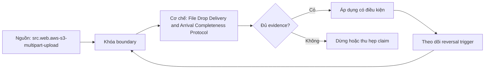

# File Drop Delivery and Arrival Completeness Protocol

> [!abstract] Câu hỏi trung tâm
> Một file drop protocol chứng minh complete batch, integrity và duplicate identity như thế nào?

## 1. Four-step protocol

Producer creates batch identity/manifest, uploads objects under staging or multipart sessions, validates checksums/schema/counts, then publishes immutable ready marker/manifest pointer. Consumer reads only published batch, verifies all declared objects, lands idempotently and records acknowledgment. Object existence is not readiness. For single object, complete multipart publishes object; multi-file business batch still needs explicit manifest completion.

## 2. Manifest contract

Manifest contains batch ID, producer/version, extract boundary, expected object names/versions, byte sizes, content checksums, record counts where trustworthy, schema ID, created/completed timestamps and resend/supersedes rules. Sign or protect manifest where threat model requires. Consumer validates path traversal and unexpected extras. Manifest itself gets immutable identity/hash.

## 3. Integrity layers

Transport/object checksum catches byte corruption; file parser catches malformed format; schema validation catches shape/type; row/business reconciliation catches semantic loss; manifest count catches missing file. ETag is not universally whole-object MD5, especially multipart. Use explicit algorithm/type and compare stored/retrieved checksum. Compression/archive bombs and max size are security controls.

## 4. Duplicate and collision

Same filename can be same content retry, different-content collision or legitimate new version. Identity uses producer batch ID plus checksum/object version, not filename alone. Same ID/different hash quarantines; same ID/same hash idempotently acknowledges. Consumer ledger states discovered, validating, accepted, quarantined, published. Never overwrite accepted raw evidence silently.

## 5. Arrival completeness

A batch is complete when published manifest exists and every declared object/version passes verification; quiet period or count-by-directory is weaker heuristic. Missing file keeps batch pending then alerts/expires by contract. Unexpected file is quarantined or ignored per policy, never silently absorbed. Late file requires new manifest/version. Completion marker must be published last.

## 6. Failure matrix

Inject incomplete multipart/staging upload, same name different bytes, checksum mismatch, and manifest missing one object. Add duplicate ready marker and consumer crash after landing before acknowledgment. Verify state transition, no premature complete, deterministic replay and exact raw/object ledger. Measure small-file aggregation separately; aggregation must preserve source-file lineage and batch reconciliation.

## 7. Ma trận kiểm chứng từng mệnh đề

Mỗi claim phải gắn source/entity boundary, exact fixture, checkpoint/input state, counterexample và independent reconciliation oracle. Connector chạy thành công hoặc API trả 2xx chưa chứng minh completeness.

### 7.1. File-delivery probe 1: batch ID, manifest item, checksum layer, state transition và completeness oracle phải rõ

**Mệnh đề cần kiểm.** File-delivery probe 1: batch ID, manifest item, checksum layer, state transition và completeness oracle phải rõ.

**Thiết kế phép thử cho `wiki.ingestion.file-drop-delivery-arrival-completeness`.** Khóa source/API version, entity, grain/key, time boundary, schema, pagination/cursor configuration và failure schedule. Tạo positive, boundary và negative fixtures; thay đổi đúng một assumption. Lưu request/query, response/raw extract hash, checkpoint trước/sau, landing objects, target state và source-at-boundary oracle.

**Điều kiện chấp nhận cho `wiki.ingestion.file-drop-delivery-arrival-completeness`.** Count, key set, typed field hash và delete state khớp contract; duplicates được giải thích và dedup có identity rõ. Observation, inference và unknown được báo riêng. Lab chưa chạy chỉ là protocol.

### 7.2. File-delivery probe 2: batch ID, manifest item, checksum layer, state transition và completeness oracle phải rõ

**Mệnh đề cần kiểm.** File-delivery probe 2: batch ID, manifest item, checksum layer, state transition và completeness oracle phải rõ.

**Thiết kế phép thử cho `wiki.ingestion.file-drop-delivery-arrival-completeness`.** Khóa source/API version, entity, grain/key, time boundary, schema, pagination/cursor configuration và failure schedule. Tạo positive, boundary và negative fixtures; thay đổi đúng một assumption. Lưu request/query, response/raw extract hash, checkpoint trước/sau, landing objects, target state và source-at-boundary oracle.

**Điều kiện chấp nhận cho `wiki.ingestion.file-drop-delivery-arrival-completeness`.** Count, key set, typed field hash và delete state khớp contract; duplicates được giải thích và dedup có identity rõ. Observation, inference và unknown được báo riêng. Lab chưa chạy chỉ là protocol.

### 7.3. File-delivery probe 3: batch ID, manifest item, checksum layer, state transition và completeness oracle phải rõ

**Mệnh đề cần kiểm.** File-delivery probe 3: batch ID, manifest item, checksum layer, state transition và completeness oracle phải rõ.

**Thiết kế phép thử cho `wiki.ingestion.file-drop-delivery-arrival-completeness`.** Khóa source/API version, entity, grain/key, time boundary, schema, pagination/cursor configuration và failure schedule. Tạo positive, boundary và negative fixtures; thay đổi đúng một assumption. Lưu request/query, response/raw extract hash, checkpoint trước/sau, landing objects, target state và source-at-boundary oracle.

**Điều kiện chấp nhận cho `wiki.ingestion.file-drop-delivery-arrival-completeness`.** Count, key set, typed field hash và delete state khớp contract; duplicates được giải thích và dedup có identity rõ. Observation, inference và unknown được báo riêng. Lab chưa chạy chỉ là protocol.

### 7.4. File-delivery probe 4: batch ID, manifest item, checksum layer, state transition và completeness oracle phải rõ

**Mệnh đề cần kiểm.** File-delivery probe 4: batch ID, manifest item, checksum layer, state transition và completeness oracle phải rõ.

**Thiết kế phép thử cho `wiki.ingestion.file-drop-delivery-arrival-completeness`.** Khóa source/API version, entity, grain/key, time boundary, schema, pagination/cursor configuration và failure schedule. Tạo positive, boundary và negative fixtures; thay đổi đúng một assumption. Lưu request/query, response/raw extract hash, checkpoint trước/sau, landing objects, target state và source-at-boundary oracle.

**Điều kiện chấp nhận cho `wiki.ingestion.file-drop-delivery-arrival-completeness`.** Count, key set, typed field hash và delete state khớp contract; duplicates được giải thích và dedup có identity rõ. Observation, inference và unknown được báo riêng. Lab chưa chạy chỉ là protocol.

### 7.5. File-delivery probe 5: batch ID, manifest item, checksum layer, state transition và completeness oracle phải rõ

**Mệnh đề cần kiểm.** File-delivery probe 5: batch ID, manifest item, checksum layer, state transition và completeness oracle phải rõ.

**Thiết kế phép thử cho `wiki.ingestion.file-drop-delivery-arrival-completeness`.** Khóa source/API version, entity, grain/key, time boundary, schema, pagination/cursor configuration và failure schedule. Tạo positive, boundary và negative fixtures; thay đổi đúng một assumption. Lưu request/query, response/raw extract hash, checkpoint trước/sau, landing objects, target state và source-at-boundary oracle.

**Điều kiện chấp nhận cho `wiki.ingestion.file-drop-delivery-arrival-completeness`.** Count, key set, typed field hash và delete state khớp contract; duplicates được giải thích và dedup có identity rõ. Observation, inference và unknown được báo riêng. Lab chưa chạy chỉ là protocol.

### 7.6. File-delivery probe 6: batch ID, manifest item, checksum layer, state transition và completeness oracle phải rõ

**Mệnh đề cần kiểm.** File-delivery probe 6: batch ID, manifest item, checksum layer, state transition và completeness oracle phải rõ.

**Thiết kế phép thử cho `wiki.ingestion.file-drop-delivery-arrival-completeness`.** Khóa source/API version, entity, grain/key, time boundary, schema, pagination/cursor configuration và failure schedule. Tạo positive, boundary và negative fixtures; thay đổi đúng một assumption. Lưu request/query, response/raw extract hash, checkpoint trước/sau, landing objects, target state và source-at-boundary oracle.

**Điều kiện chấp nhận cho `wiki.ingestion.file-drop-delivery-arrival-completeness`.** Count, key set, typed field hash và delete state khớp contract; duplicates được giải thích và dedup có identity rõ. Observation, inference và unknown được báo riêng. Lab chưa chạy chỉ là protocol.

### 7.7. File-delivery probe 7: batch ID, manifest item, checksum layer, state transition và completeness oracle phải rõ

**Mệnh đề cần kiểm.** File-delivery probe 7: batch ID, manifest item, checksum layer, state transition và completeness oracle phải rõ.

**Thiết kế phép thử cho `wiki.ingestion.file-drop-delivery-arrival-completeness`.** Khóa source/API version, entity, grain/key, time boundary, schema, pagination/cursor configuration và failure schedule. Tạo positive, boundary và negative fixtures; thay đổi đúng một assumption. Lưu request/query, response/raw extract hash, checkpoint trước/sau, landing objects, target state và source-at-boundary oracle.

**Điều kiện chấp nhận cho `wiki.ingestion.file-drop-delivery-arrival-completeness`.** Count, key set, typed field hash và delete state khớp contract; duplicates được giải thích và dedup có identity rõ. Observation, inference và unknown được báo riêng. Lab chưa chạy chỉ là protocol.

### 7.8. File-delivery probe 8: batch ID, manifest item, checksum layer, state transition và completeness oracle phải rõ

**Mệnh đề cần kiểm.** File-delivery probe 8: batch ID, manifest item, checksum layer, state transition và completeness oracle phải rõ.

**Thiết kế phép thử cho `wiki.ingestion.file-drop-delivery-arrival-completeness`.** Khóa source/API version, entity, grain/key, time boundary, schema, pagination/cursor configuration và failure schedule. Tạo positive, boundary và negative fixtures; thay đổi đúng một assumption. Lưu request/query, response/raw extract hash, checkpoint trước/sau, landing objects, target state và source-at-boundary oracle.

**Điều kiện chấp nhận cho `wiki.ingestion.file-drop-delivery-arrival-completeness`.** Count, key set, typed field hash và delete state khớp contract; duplicates được giải thích và dedup có identity rõ. Observation, inference và unknown được báo riêng. Lab chưa chạy chỉ là protocol.

### 7.9. File-delivery probe 9: batch ID, manifest item, checksum layer, state transition và completeness oracle phải rõ

**Mệnh đề cần kiểm.** File-delivery probe 9: batch ID, manifest item, checksum layer, state transition và completeness oracle phải rõ.

**Thiết kế phép thử cho `wiki.ingestion.file-drop-delivery-arrival-completeness`.** Khóa source/API version, entity, grain/key, time boundary, schema, pagination/cursor configuration và failure schedule. Tạo positive, boundary và negative fixtures; thay đổi đúng một assumption. Lưu request/query, response/raw extract hash, checkpoint trước/sau, landing objects, target state và source-at-boundary oracle.

**Điều kiện chấp nhận cho `wiki.ingestion.file-drop-delivery-arrival-completeness`.** Count, key set, typed field hash và delete state khớp contract; duplicates được giải thích và dedup có identity rõ. Observation, inference và unknown được báo riêng. Lab chưa chạy chỉ là protocol.

### 7.10. File-delivery probe 10: batch ID, manifest item, checksum layer, state transition và completeness oracle phải rõ

**Mệnh đề cần kiểm.** File-delivery probe 10: batch ID, manifest item, checksum layer, state transition và completeness oracle phải rõ.

**Thiết kế phép thử cho `wiki.ingestion.file-drop-delivery-arrival-completeness`.** Khóa source/API version, entity, grain/key, time boundary, schema, pagination/cursor configuration và failure schedule. Tạo positive, boundary và negative fixtures; thay đổi đúng một assumption. Lưu request/query, response/raw extract hash, checkpoint trước/sau, landing objects, target state và source-at-boundary oracle.

**Điều kiện chấp nhận cho `wiki.ingestion.file-drop-delivery-arrival-completeness`.** Count, key set, typed field hash và delete state khớp contract; duplicates được giải thích và dedup có identity rõ. Observation, inference và unknown được báo riêng. Lab chưa chạy chỉ là protocol.

### 7.11. File-delivery probe 11: batch ID, manifest item, checksum layer, state transition và completeness oracle phải rõ

**Mệnh đề cần kiểm.** File-delivery probe 11: batch ID, manifest item, checksum layer, state transition và completeness oracle phải rõ.

**Thiết kế phép thử cho `wiki.ingestion.file-drop-delivery-arrival-completeness`.** Khóa source/API version, entity, grain/key, time boundary, schema, pagination/cursor configuration và failure schedule. Tạo positive, boundary và negative fixtures; thay đổi đúng một assumption. Lưu request/query, response/raw extract hash, checkpoint trước/sau, landing objects, target state và source-at-boundary oracle.

**Điều kiện chấp nhận cho `wiki.ingestion.file-drop-delivery-arrival-completeness`.** Count, key set, typed field hash và delete state khớp contract; duplicates được giải thích và dedup có identity rõ. Observation, inference và unknown được báo riêng. Lab chưa chạy chỉ là protocol.

### 7.12. File-delivery probe 12: batch ID, manifest item, checksum layer, state transition và completeness oracle phải rõ

**Mệnh đề cần kiểm.** File-delivery probe 12: batch ID, manifest item, checksum layer, state transition và completeness oracle phải rõ.

**Thiết kế phép thử cho `wiki.ingestion.file-drop-delivery-arrival-completeness`.** Khóa source/API version, entity, grain/key, time boundary, schema, pagination/cursor configuration và failure schedule. Tạo positive, boundary và negative fixtures; thay đổi đúng một assumption. Lưu request/query, response/raw extract hash, checkpoint trước/sau, landing objects, target state và source-at-boundary oracle.

**Điều kiện chấp nhận cho `wiki.ingestion.file-drop-delivery-arrival-completeness`.** Count, key set, typed field hash và delete state khớp contract; duplicates được giải thích và dedup có identity rõ. Observation, inference và unknown được báo riêng. Lab chưa chạy chỉ là protocol.

### 7.13. File-delivery probe 13: batch ID, manifest item, checksum layer, state transition và completeness oracle phải rõ

**Mệnh đề cần kiểm.** File-delivery probe 13: batch ID, manifest item, checksum layer, state transition và completeness oracle phải rõ.

**Thiết kế phép thử cho `wiki.ingestion.file-drop-delivery-arrival-completeness`.** Khóa source/API version, entity, grain/key, time boundary, schema, pagination/cursor configuration và failure schedule. Tạo positive, boundary và negative fixtures; thay đổi đúng một assumption. Lưu request/query, response/raw extract hash, checkpoint trước/sau, landing objects, target state và source-at-boundary oracle.

**Điều kiện chấp nhận cho `wiki.ingestion.file-drop-delivery-arrival-completeness`.** Count, key set, typed field hash và delete state khớp contract; duplicates được giải thích và dedup có identity rõ. Observation, inference và unknown được báo riêng. Lab chưa chạy chỉ là protocol.

### 7.14. File-delivery probe 14: batch ID, manifest item, checksum layer, state transition và completeness oracle phải rõ

**Mệnh đề cần kiểm.** File-delivery probe 14: batch ID, manifest item, checksum layer, state transition và completeness oracle phải rõ.

**Thiết kế phép thử cho `wiki.ingestion.file-drop-delivery-arrival-completeness`.** Khóa source/API version, entity, grain/key, time boundary, schema, pagination/cursor configuration và failure schedule. Tạo positive, boundary và negative fixtures; thay đổi đúng một assumption. Lưu request/query, response/raw extract hash, checkpoint trước/sau, landing objects, target state và source-at-boundary oracle.

**Điều kiện chấp nhận cho `wiki.ingestion.file-drop-delivery-arrival-completeness`.** Count, key set, typed field hash và delete state khớp contract; duplicates được giải thích và dedup có identity rõ. Observation, inference và unknown được báo riêng. Lab chưa chạy chỉ là protocol.

### 7.15. File-delivery probe 15: batch ID, manifest item, checksum layer, state transition và completeness oracle phải rõ

**Mệnh đề cần kiểm.** File-delivery probe 15: batch ID, manifest item, checksum layer, state transition và completeness oracle phải rõ.

**Thiết kế phép thử cho `wiki.ingestion.file-drop-delivery-arrival-completeness`.** Khóa source/API version, entity, grain/key, time boundary, schema, pagination/cursor configuration và failure schedule. Tạo positive, boundary và negative fixtures; thay đổi đúng một assumption. Lưu request/query, response/raw extract hash, checkpoint trước/sau, landing objects, target state và source-at-boundary oracle.

**Điều kiện chấp nhận cho `wiki.ingestion.file-drop-delivery-arrival-completeness`.** Count, key set, typed field hash và delete state khớp contract; duplicates được giải thích và dedup có identity rõ. Observation, inference và unknown được báo riêng. Lab chưa chạy chỉ là protocol.

## 8. Quy trình phản biện

1. Chốt entity, grain, identity và immutable boundary.
2. Tách source fact, documentation claim và observed behavior.
3. Viết delete, retry, checkpoint và replay semantics trước code.
4. Dùng key/typed-hash reconciliation, không chỉ row count.
5. Pin version, retention, timezone, ordering và rate limits.
6. Ghi assumption bị falsify và extraction pattern thay thế.

## 9. Câu hỏi tự kiểm tra

1. Source thay đổi row/entity theo những operation nào?
2. Boundary nào định nghĩa complete?
3. Delete có xuất hiện trong interface không?
4. Cursor/order có total và immutable không?
5. Crash ở checkpoint boundary gây replay hay gap?
6. Bằng chứng nào chưa được chạy?

## 10. Giới hạn và điều chưa cho phép kết luận

- Chưa chạy mutation/pagination/watermark lab trên source thật.
- Product behavior phải pin version, retention và configuration.
- Decision matrices và failure protocols là synthesis của giáo trình.
- Note giữ trạng thái `review` tới khi chủ dự án duyệt.

## Reference
1. [[SRC-AWS-S3-MULTIPART-UPLOAD]]
2. [[SRC-AWS-S3-OBJECT-CHECKSUMS]]
3. [[SRC-REIS-HOUSLEY-FUNDAMENTALS-DATA-ENGINEERING]]

## Source coverage

| Source slice | Nội dung sử dụng | Trạng thái |
|---|---|---|
| [[SRC-AWS-S3-MULTIPART-UPLOAD]] | Source/change/API contract hoặc engineering context | Đã đọc locator; không suy ngoài phạm vi |
| [[SRC-AWS-S3-OBJECT-CHECKSUMS]] | Source/change/API contract hoặc engineering context | Đã đọc locator; không suy ngoài phạm vi |
| [[SRC-REIS-HOUSLEY-FUNDAMENTALS-DATA-ENGINEERING]] | Source/change/API contract hoặc engineering context | Đã đọc locator; không suy ngoài phạm vi |

## Key takeaways
- Extraction pattern chỉ đúng khi source assumptions đúng.
- Completeness cần immutable boundary và reconciliation oracle.
- Retry/checkpoint ưu tiên replay có kiểm soát hơn silent gap.
- Connector không chuyển giao ownership về tính đúng.

<!-- ATOMIC-EXECUTION-CAPSULE:START -->

## Execution capsule: kiểm chứng `wiki.ingestion.file-drop-delivery-arrival-completeness`

> [!important] Phân loại mệnh đề
> Với `wiki.ingestion.file-drop-delivery-arrival-completeness`, sơ đồ, ví dụ và artifact về **File Drop Delivery and Arrival Completeness Protocol** là **synthesis để kiểm chứng**; chúng không phải trích dẫn hay case nguyên văn của nguồn.

### Sơ đồ cơ chế và điểm kiểm soát



Đọc sơ đồ `wiki.ingestion.file-drop-delivery-arrival-completeness` từ trái sang phải: source chỉ cung cấp claim ban đầu cho **File Drop Delivery and Arrival Completeness Protocol**; quyết định chỉ được đi tiếp sau khi boundary, evidence và điều kiện đảo quyết định đã hiện hữu.

### Ví dụ làm việc có thể bác bỏ

**Input.** Một đội cần trả lời: Một file drop protocol chứng minh complete batch, integrity và duplicate identity như thế nào? cho một phạm vi nhỏ, có owner và deadline rõ.

**Decision.** Đội áp dụng **File Drop Delivery and Arrival Completeness Protocol** trên control và variant chỉ khác một assumption; expected result và hard constraints được khóa trước khi chạy.

**Outcome.** Với `wiki.ingestion.file-drop-delivery-arrival-completeness`, nếu observation vi phạm hard constraint hoặc oracle độc lập không xác nhận **File Drop Delivery and Arrival Completeness Protocol**, đội thu hẹp claim hay đảo quyết định. Nếu đạt, kết luận vẫn kèm scope, version và review date; một lần thành công không được nâng thành quy luật phổ quát.

### Artifact thực thi tối thiểu

```sql
-- Verification harness for: File Drop Delivery and Arrival Completeness Protocol
WITH evidence AS (
    SELECT 'wiki.ingestion.file-drop-delivery-arrival-completeness' AS concept_id,
           'boundary_declared' AS check_name, 1 AS passed
    UNION ALL
    SELECT 'wiki.ingestion.file-drop-delivery-arrival-completeness', 'independent_oracle', 1
    UNION ALL
    SELECT 'wiki.ingestion.file-drop-delivery-arrival-completeness', 'reversal_trigger_recorded', 1
)
SELECT concept_id,
       MIN(passed) AS all_hard_checks_pass,
       COUNT(*) AS evidence_items
FROM evidence
GROUP BY concept_id
HAVING MIN(passed) = 1;
```

Artifact của `wiki.ingestion.file-drop-delivery-arrival-completeness` buộc người dùng ghi boundary, oracle và reversal trigger cho **File Drop Delivery and Arrival Completeness Protocol**. Các giá trị minh họa phải được thay bằng evidence thật trước khi dùng cho quyết định.

### Tự kiểm tra trước khi tái sử dụng

1. Bạn có thể trả lời `Một file drop protocol chứng minh complete batch, integrity và duplicate identity như thế nào?` bằng một câu mà không kéo thêm concept thứ hai không?
2. Source locator nào đỡ cho claim, và phần nào chỉ là synthesis trong note?
3. Observation nào khiến bạn dừng, thu hẹp hoặc đảo quyết định?
4. Artifact nào cho phép một reviewer độc lập tái hiện kết quả?

<!-- ATOMIC-EXECUTION-CAPSULE:END -->
