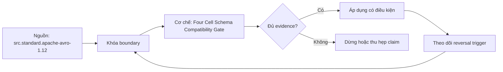

# Four Cell Schema Compatibility Gate

> [!abstract] Câu hỏi trung tâm
> Dựng compatibility gate bốn ô, nhiều phiên bản và semantic oracles để quyết định thứ tự rollout thế nào?

## 1. Bốn ô nền

W_old→R_old và W_new→R_new kiểm self consistency; W_old→R_new là backward-reader direction; W_new→R_old là forward-reader direction. Tên backward/forward dễ gây nhầm nên report luôn writer/reader versions. Mỗi cell kiểm encode, decode, canonical typed value, invariants và unknown preservation. Success status không đủ nếu output silently defaulted, truncated or dropped.

## 2. Latest so với transitive

Non-transitive registry modes thường compare new schema với selected latest/history rule; transitive checks all prior versions. Pairwise adjacent compatibility không bảo đảm v3 với v1. Golden matrix cho N versions có N×N cells hoặc bounded supported window được công bố. Retention/replay horizon quyết định old writers/readers nào còn in scope. Không test unsupported versions rồi tuyên full history.

## 3. Compatibility và rollout

Backward compatibility cho phép deploy readers that understand old data before new writers emit new data. Forward compatibility supports old readers consuming new writers, subject to format semantics. Full supports either direction structurally; application dependencies vẫn có order. Rolling fleet có mixed versions, retries, rollback and stored historical records, nên deployment plan specifies expand, observe, migrate/backfill, contract and rollback windows.

## 4. Golden records

Golden corpus covers present/absent/null/default, min/max numeric, unknown enum, unicode, logical timestamps/decimals, nested/repeated, deprecated fields and malformed cases. Store source schema ID, writer bytes hash and expected canonical meaning. Do not regenerate all goldens with new code in same change; that erases independent oracle. Add records with each incident and field semantic.

## 5. Registry gate boundary

Registry rejects structurally incompatible registrations according to configured subject/mode/history. It cannot prove deployment order executed, all languages behave alike, relays preserve unknowns, semantic units unchanged, data migration succeeded or producer uses registered schema. CI combines registry dry-run/API with executable generated-code matrix and semantic assertions. Enforcement NONE or wrong subject strategy is explicit failure.

## 6. Injected failures

Inject Avro reader field without default/rename without verified alias, Protobuf field-number reuse, and semantic unit change that structural checker accepts. Gate must block first two through structural/wire tests and third through invariant oracle. Error names exact failing W_i→R_j cell, format, schema fingerprints and assertion. Done when chosen mode maps to rollout order and all three failure classes are visible before merge.

## 7. Ma trận kiểm chứng từng mệnh đề

Mỗi claim cần fixture, versioned contract, counterexample và oracle ở đúng tầng. Parse/decode success, registry acceptance hoặc feature name không tự chứng minh semantic correctness.

### 7.1. Compatibility gate case 1 phải ghi writer-reader cell, version history, structural result và semantic result

**Mệnh đề cần kiểm.** Compatibility gate case 1 phải ghi writer-reader cell, version history, structural result và semantic result.

**Protocol cho `wiki.serialization.four-cell-schema-compatibility-gate`.** Khóa source/schema versions, producer-consumer path, configuration và canonical meaning. Chạy positive, boundary và negative fixtures; lưu raw bytes/files, hashes, logs, typed output và exact failing cell. Đổi một assumption rồi ghi reversal condition.

**Bằng chứng đạt cho `wiki.serialization.four-cell-schema-compatibility-gate`.** Kết quả structural và semantic được báo riêng, có independent oracle, repetitions khi đo performance, reviewer và limitation. Lab chưa chạy chỉ được ghi protocol, không ghi expected behavior như observation.

### 7.2. Compatibility gate case 2 phải ghi writer-reader cell, version history, structural result và semantic result

**Mệnh đề cần kiểm.** Compatibility gate case 2 phải ghi writer-reader cell, version history, structural result và semantic result.

**Protocol cho `wiki.serialization.four-cell-schema-compatibility-gate`.** Khóa source/schema versions, producer-consumer path, configuration và canonical meaning. Chạy positive, boundary và negative fixtures; lưu raw bytes/files, hashes, logs, typed output và exact failing cell. Đổi một assumption rồi ghi reversal condition.

**Bằng chứng đạt cho `wiki.serialization.four-cell-schema-compatibility-gate`.** Kết quả structural và semantic được báo riêng, có independent oracle, repetitions khi đo performance, reviewer và limitation. Lab chưa chạy chỉ được ghi protocol, không ghi expected behavior như observation.

### 7.3. Compatibility gate case 3 phải ghi writer-reader cell, version history, structural result và semantic result

**Mệnh đề cần kiểm.** Compatibility gate case 3 phải ghi writer-reader cell, version history, structural result và semantic result.

**Protocol cho `wiki.serialization.four-cell-schema-compatibility-gate`.** Khóa source/schema versions, producer-consumer path, configuration và canonical meaning. Chạy positive, boundary và negative fixtures; lưu raw bytes/files, hashes, logs, typed output và exact failing cell. Đổi một assumption rồi ghi reversal condition.

**Bằng chứng đạt cho `wiki.serialization.four-cell-schema-compatibility-gate`.** Kết quả structural và semantic được báo riêng, có independent oracle, repetitions khi đo performance, reviewer và limitation. Lab chưa chạy chỉ được ghi protocol, không ghi expected behavior như observation.

### 7.4. Compatibility gate case 4 phải ghi writer-reader cell, version history, structural result và semantic result

**Mệnh đề cần kiểm.** Compatibility gate case 4 phải ghi writer-reader cell, version history, structural result và semantic result.

**Protocol cho `wiki.serialization.four-cell-schema-compatibility-gate`.** Khóa source/schema versions, producer-consumer path, configuration và canonical meaning. Chạy positive, boundary và negative fixtures; lưu raw bytes/files, hashes, logs, typed output và exact failing cell. Đổi một assumption rồi ghi reversal condition.

**Bằng chứng đạt cho `wiki.serialization.four-cell-schema-compatibility-gate`.** Kết quả structural và semantic được báo riêng, có independent oracle, repetitions khi đo performance, reviewer và limitation. Lab chưa chạy chỉ được ghi protocol, không ghi expected behavior như observation.

### 7.5. Compatibility gate case 5 phải ghi writer-reader cell, version history, structural result và semantic result

**Mệnh đề cần kiểm.** Compatibility gate case 5 phải ghi writer-reader cell, version history, structural result và semantic result.

**Protocol cho `wiki.serialization.four-cell-schema-compatibility-gate`.** Khóa source/schema versions, producer-consumer path, configuration và canonical meaning. Chạy positive, boundary và negative fixtures; lưu raw bytes/files, hashes, logs, typed output và exact failing cell. Đổi một assumption rồi ghi reversal condition.

**Bằng chứng đạt cho `wiki.serialization.four-cell-schema-compatibility-gate`.** Kết quả structural và semantic được báo riêng, có independent oracle, repetitions khi đo performance, reviewer và limitation. Lab chưa chạy chỉ được ghi protocol, không ghi expected behavior như observation.

### 7.6. Compatibility gate case 6 phải ghi writer-reader cell, version history, structural result và semantic result

**Mệnh đề cần kiểm.** Compatibility gate case 6 phải ghi writer-reader cell, version history, structural result và semantic result.

**Protocol cho `wiki.serialization.four-cell-schema-compatibility-gate`.** Khóa source/schema versions, producer-consumer path, configuration và canonical meaning. Chạy positive, boundary và negative fixtures; lưu raw bytes/files, hashes, logs, typed output và exact failing cell. Đổi một assumption rồi ghi reversal condition.

**Bằng chứng đạt cho `wiki.serialization.four-cell-schema-compatibility-gate`.** Kết quả structural và semantic được báo riêng, có independent oracle, repetitions khi đo performance, reviewer và limitation. Lab chưa chạy chỉ được ghi protocol, không ghi expected behavior như observation.

### 7.7. Compatibility gate case 7 phải ghi writer-reader cell, version history, structural result và semantic result

**Mệnh đề cần kiểm.** Compatibility gate case 7 phải ghi writer-reader cell, version history, structural result và semantic result.

**Protocol cho `wiki.serialization.four-cell-schema-compatibility-gate`.** Khóa source/schema versions, producer-consumer path, configuration và canonical meaning. Chạy positive, boundary và negative fixtures; lưu raw bytes/files, hashes, logs, typed output và exact failing cell. Đổi một assumption rồi ghi reversal condition.

**Bằng chứng đạt cho `wiki.serialization.four-cell-schema-compatibility-gate`.** Kết quả structural và semantic được báo riêng, có independent oracle, repetitions khi đo performance, reviewer và limitation. Lab chưa chạy chỉ được ghi protocol, không ghi expected behavior như observation.

### 7.8. Compatibility gate case 8 phải ghi writer-reader cell, version history, structural result và semantic result

**Mệnh đề cần kiểm.** Compatibility gate case 8 phải ghi writer-reader cell, version history, structural result và semantic result.

**Protocol cho `wiki.serialization.four-cell-schema-compatibility-gate`.** Khóa source/schema versions, producer-consumer path, configuration và canonical meaning. Chạy positive, boundary và negative fixtures; lưu raw bytes/files, hashes, logs, typed output và exact failing cell. Đổi một assumption rồi ghi reversal condition.

**Bằng chứng đạt cho `wiki.serialization.four-cell-schema-compatibility-gate`.** Kết quả structural và semantic được báo riêng, có independent oracle, repetitions khi đo performance, reviewer và limitation. Lab chưa chạy chỉ được ghi protocol, không ghi expected behavior như observation.

### 7.9. Compatibility gate case 9 phải ghi writer-reader cell, version history, structural result và semantic result

**Mệnh đề cần kiểm.** Compatibility gate case 9 phải ghi writer-reader cell, version history, structural result và semantic result.

**Protocol cho `wiki.serialization.four-cell-schema-compatibility-gate`.** Khóa source/schema versions, producer-consumer path, configuration và canonical meaning. Chạy positive, boundary và negative fixtures; lưu raw bytes/files, hashes, logs, typed output và exact failing cell. Đổi một assumption rồi ghi reversal condition.

**Bằng chứng đạt cho `wiki.serialization.four-cell-schema-compatibility-gate`.** Kết quả structural và semantic được báo riêng, có independent oracle, repetitions khi đo performance, reviewer và limitation. Lab chưa chạy chỉ được ghi protocol, không ghi expected behavior như observation.

### 7.10. Compatibility gate case 10 phải ghi writer-reader cell, version history, structural result và semantic result

**Mệnh đề cần kiểm.** Compatibility gate case 10 phải ghi writer-reader cell, version history, structural result và semantic result.

**Protocol cho `wiki.serialization.four-cell-schema-compatibility-gate`.** Khóa source/schema versions, producer-consumer path, configuration và canonical meaning. Chạy positive, boundary và negative fixtures; lưu raw bytes/files, hashes, logs, typed output và exact failing cell. Đổi một assumption rồi ghi reversal condition.

**Bằng chứng đạt cho `wiki.serialization.four-cell-schema-compatibility-gate`.** Kết quả structural và semantic được báo riêng, có independent oracle, repetitions khi đo performance, reviewer và limitation. Lab chưa chạy chỉ được ghi protocol, không ghi expected behavior như observation.

### 7.11. Compatibility gate case 11 phải ghi writer-reader cell, version history, structural result và semantic result

**Mệnh đề cần kiểm.** Compatibility gate case 11 phải ghi writer-reader cell, version history, structural result và semantic result.

**Protocol cho `wiki.serialization.four-cell-schema-compatibility-gate`.** Khóa source/schema versions, producer-consumer path, configuration và canonical meaning. Chạy positive, boundary và negative fixtures; lưu raw bytes/files, hashes, logs, typed output và exact failing cell. Đổi một assumption rồi ghi reversal condition.

**Bằng chứng đạt cho `wiki.serialization.four-cell-schema-compatibility-gate`.** Kết quả structural và semantic được báo riêng, có independent oracle, repetitions khi đo performance, reviewer và limitation. Lab chưa chạy chỉ được ghi protocol, không ghi expected behavior như observation.

### 7.12. Compatibility gate case 12 phải ghi writer-reader cell, version history, structural result và semantic result

**Mệnh đề cần kiểm.** Compatibility gate case 12 phải ghi writer-reader cell, version history, structural result và semantic result.

**Protocol cho `wiki.serialization.four-cell-schema-compatibility-gate`.** Khóa source/schema versions, producer-consumer path, configuration và canonical meaning. Chạy positive, boundary và negative fixtures; lưu raw bytes/files, hashes, logs, typed output và exact failing cell. Đổi một assumption rồi ghi reversal condition.

**Bằng chứng đạt cho `wiki.serialization.four-cell-schema-compatibility-gate`.** Kết quả structural và semantic được báo riêng, có independent oracle, repetitions khi đo performance, reviewer và limitation. Lab chưa chạy chỉ được ghi protocol, không ghi expected behavior như observation.

### 7.13. Compatibility gate case 13 phải ghi writer-reader cell, version history, structural result và semantic result

**Mệnh đề cần kiểm.** Compatibility gate case 13 phải ghi writer-reader cell, version history, structural result và semantic result.

**Protocol cho `wiki.serialization.four-cell-schema-compatibility-gate`.** Khóa source/schema versions, producer-consumer path, configuration và canonical meaning. Chạy positive, boundary và negative fixtures; lưu raw bytes/files, hashes, logs, typed output và exact failing cell. Đổi một assumption rồi ghi reversal condition.

**Bằng chứng đạt cho `wiki.serialization.four-cell-schema-compatibility-gate`.** Kết quả structural và semantic được báo riêng, có independent oracle, repetitions khi đo performance, reviewer và limitation. Lab chưa chạy chỉ được ghi protocol, không ghi expected behavior như observation.

### 7.14. Compatibility gate case 14 phải ghi writer-reader cell, version history, structural result và semantic result

**Mệnh đề cần kiểm.** Compatibility gate case 14 phải ghi writer-reader cell, version history, structural result và semantic result.

**Protocol cho `wiki.serialization.four-cell-schema-compatibility-gate`.** Khóa source/schema versions, producer-consumer path, configuration và canonical meaning. Chạy positive, boundary và negative fixtures; lưu raw bytes/files, hashes, logs, typed output và exact failing cell. Đổi một assumption rồi ghi reversal condition.

**Bằng chứng đạt cho `wiki.serialization.four-cell-schema-compatibility-gate`.** Kết quả structural và semantic được báo riêng, có independent oracle, repetitions khi đo performance, reviewer và limitation. Lab chưa chạy chỉ được ghi protocol, không ghi expected behavior như observation.

### 7.15. Compatibility gate case 15 phải ghi writer-reader cell, version history, structural result và semantic result

**Mệnh đề cần kiểm.** Compatibility gate case 15 phải ghi writer-reader cell, version history, structural result và semantic result.

**Protocol cho `wiki.serialization.four-cell-schema-compatibility-gate`.** Khóa source/schema versions, producer-consumer path, configuration và canonical meaning. Chạy positive, boundary và negative fixtures; lưu raw bytes/files, hashes, logs, typed output và exact failing cell. Đổi một assumption rồi ghi reversal condition.

**Bằng chứng đạt cho `wiki.serialization.four-cell-schema-compatibility-gate`.** Kết quả structural và semantic được báo riêng, có independent oracle, repetitions khi đo performance, reviewer và limitation. Lab chưa chạy chỉ được ghi protocol, không ghi expected behavior như observation.

## 8. Quy trình phản biện

1. Tách syntax/wire, structural compatibility, generated API và business semantics.
2. Ghi direction bằng writer–reader versions, không chỉ dùng nhãn backward/forward.
3. Khóa canonical meaning và negative fixtures trước implementation.
4. Giữ source bytes/schema fingerprints để tái hiện.
5. Mọi default, cache, inference hoặc registry policy đều là explicit configuration.
6. Viết rollout, rollback và reversal condition trước merge.

## 9. Câu hỏi tự kiểm tra

1. Identity nằm ở name, position, field number hay stable ID?
2. Parser biết điều gì và application phải biết điều gì?
3. Cell/version nào chưa được test?
4. Decode sạch có thể sai nghĩa ở đâu?
5. Intermediate system có làm mất thông tin không?
6. Evidence nào mới là protocol?

## 10. Giới hạn và điều chưa cho phép kết luận

- Chưa chạy benchmark engine hoặc compatibility matrix bằng libraries/registry thật.
- Specifications được kiểm ngày 2026-10-01; library, generated API và registry behavior cần pin version.
- Curriculum matrices là synthesis; không gán nguyên văn cho một source.
- Note giữ trạng thái `review` tới khi chủ dự án duyệt.

## Reference
1. [[SRC-APACHE-AVRO-1-12-SPEC]]
2. [[SRC-PROTOBUF-PROTO3-GUIDE]]
3. [[SRC-CONFLUENT-SCHEMA-EVOLUTION]]

## Source coverage

| Source slice | Nội dung sử dụng | Trạng thái |
|---|---|---|
| [[SRC-APACHE-AVRO-1-12-SPEC]] | Normative rule, architecture boundary hoặc decision evidence | Đã đọc locator; không suy ngoài phạm vi |
| [[SRC-PROTOBUF-PROTO3-GUIDE]] | Normative rule, architecture boundary hoặc decision evidence | Đã đọc locator; không suy ngoài phạm vi |
| [[SRC-CONFLUENT-SCHEMA-EVOLUTION]] | Normative rule, architecture boundary hoặc decision evidence | Đã đọc locator; không suy ngoài phạm vi |

## Key takeaways
- Structural success và semantic correctness là hai gates riêng.
- Writer–reader direction, version history và exact fixtures phải hiện trong evidence.
- Defaults, aliases, unknown fields và registry modes có scope cụ thể; không dùng như bảo đảm chung.
- Chưa chạy lab thì note là giáo trình/protocol, chưa phải production certification.

<!-- ATOMIC-EXECUTION-CAPSULE:START -->

## Execution capsule — kiểm chứng `wiki.serialization.four-cell-schema-compatibility-gate`

> [!important] Phân loại mệnh đề
> Với `wiki.serialization.four-cell-schema-compatibility-gate`, sơ đồ, ví dụ và artifact về **Four Cell Schema Compatibility Gate** là **synthesis để kiểm chứng**; chúng không phải trích dẫn hay case nguyên văn của nguồn.

### Sơ đồ cơ chế và điểm kiểm soát



Đọc sơ đồ `wiki.serialization.four-cell-schema-compatibility-gate` từ trái sang phải: source chỉ cung cấp claim ban đầu cho **Four Cell Schema Compatibility Gate**; quyết định chỉ được đi tiếp sau khi boundary, evidence và điều kiện đảo quyết định đã hiện hữu.

### Artifact thực thi tối thiểu

```sql
-- Verification harness for: Four Cell Schema Compatibility Gate
WITH evidence AS (
    SELECT 'wiki.serialization.four-cell-schema-compatibility-gate' AS concept_id,
           'boundary_declared' AS check_name, 1 AS passed
    UNION ALL
    SELECT 'wiki.serialization.four-cell-schema-compatibility-gate', 'independent_oracle', 1
    UNION ALL
    SELECT 'wiki.serialization.four-cell-schema-compatibility-gate', 'reversal_trigger_recorded', 1
)
SELECT concept_id,
       MIN(passed) AS all_hard_checks_pass,
       COUNT(*) AS evidence_items
FROM evidence
GROUP BY concept_id
HAVING MIN(passed) = 1;
```

Artifact của `wiki.serialization.four-cell-schema-compatibility-gate` buộc người dùng ghi boundary, oracle và reversal trigger cho **Four Cell Schema Compatibility Gate**. Các giá trị minh họa phải được thay bằng evidence thật trước khi dùng cho quyết định.

### Tự kiểm tra trước khi tái sử dụng

1. Bạn có thể trả lời `Dựng compatibility gate bốn ô, nhiều phiên bản và semantic oracles để quyết định thứ tự rollout thế nào?` bằng một câu mà không kéo thêm concept thứ hai không?
2. Source locator nào đỡ cho claim, và phần nào chỉ là synthesis trong note?
3. Observation nào khiến bạn dừng, thu hẹp hoặc đảo quyết định?
4. Artifact nào cho phép một reviewer độc lập tái hiện kết quả?

<!-- ATOMIC-EXECUTION-CAPSULE:END -->
