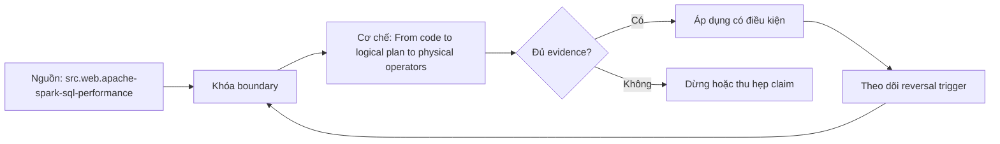

# From code to logical plan to physical operators

> [!abstract] Câu hỏi trung tâm
> Spark SQL biến code thành analyzed/optimized logical plan và physical operators như thế nào, và evidence nào chứng minh plan đã chạy?

## 1. Parsing and analysis

Unresolved syntax trở thành analyzed plan khi catalog, attributes, functions và types được resolve trong session context. Đừng bắt đầu bằng tên công cụ. Hãy bắt đầu bằng đối tượng được bảo vệ, boundary quan sát được và hậu quả nếu kết luận sai. Trong bài `From code to logical plan to physical operators`, câu hỏi thực dụng là: Spark SQL biến code thành analyzed/optimized logical plan và physical operators như thế nào, và evidence nào chứng minh plan đã chạy? Ta ghi rõ grain, population, time window, owner và hành động sau failure; nếu một trường chưa biết thì đánh dấu unknown thay vì lấp bằng mặc định. Bằng chứng tối thiểu gồm fixture có version, cấu hình hoặc rule đã resolve, raw observation, expected result và limitation. Phần này là curriculum synthesis dựa trên các nguồn đã định danh, không phải lời hứa rằng mọi adapter hay deployment đều có cùng hành vi.

## 2. Logical optimization

Optimizer rewrite relational expressions theo equivalence rules; logical plan chưa chỉ ra exact runtime operator. Điểm khó không nằm ở cú pháp mà ở identity và scope. Hai phép đo cùng tên vẫn có thể nói về hai population hoặc hai thời điểm khác nhau. Trong bài `From code to logical plan to physical operators`, câu hỏi thực dụng là: Spark SQL biến code thành analyzed/optimized logical plan và physical operators như thế nào, và evidence nào chứng minh plan đã chạy? Ta ghi rõ grain, population, time window, owner và hành động sau failure; nếu một trường chưa biết thì đánh dấu unknown thay vì lấp bằng mặc định. Bằng chứng tối thiểu gồm fixture có version, cấu hình hoặc rule đã resolve, raw observation, expected result và limitation. Phần này là curriculum synthesis dựa trên các nguồn đã định danh, không phải lời hứa rằng mọi adapter hay deployment đều có cùng hành vi.

## 3. Physical planning

Planner chọn candidate strategies và cost/statistics/configuration ảnh hưởng physical operators được chọn. Một dashboard xanh chỉ là tín hiệu. Muốn biến nó thành bằng chứng phải giữ input, phiên bản, rule, trạng thái trước-sau và cách tính độc lập. Trong bài `From code to logical plan to physical operators`, câu hỏi thực dụng là: Spark SQL biến code thành analyzed/optimized logical plan và physical operators như thế nào, và evidence nào chứng minh plan đã chạy? Ta ghi rõ grain, population, time window, owner và hành động sau failure; nếu một trường chưa biết thì đánh dấu unknown thay vì lấp bằng mặc định. Bằng chứng tối thiểu gồm fixture có version, cấu hình hoặc rule đã resolve, raw observation, expected result và limitation. Phần này là curriculum synthesis dựa trên các nguồn đã định danh, không phải lời hứa rằng mọi adapter hay deployment đều có cùng hành vi.

## 4. Execution operators

Scan, filter, project, aggregate, join, exchange và code generation thực thi theo partition/task boundaries. Thiết kế tốt phải chịu được counterexample. Hãy chủ động tạo case sát boundary, case thiếu dữ liệu và case replay thay vì chỉ chạy happy path. Trong bài `From code to logical plan to physical operators`, câu hỏi thực dụng là: Spark SQL biến code thành analyzed/optimized logical plan và physical operators như thế nào, và evidence nào chứng minh plan đã chạy? Ta ghi rõ grain, population, time window, owner và hành động sau failure; nếu một trường chưa biết thì đánh dấu unknown thay vì lấp bằng mặc định. Bằng chứng tối thiểu gồm fixture có version, cấu hình hoặc rule đã resolve, raw observation, expected result và limitation. Phần này là curriculum synthesis dựa trên các nguồn đã định danh, không phải lời hứa rằng mọi adapter hay deployment đều có cùng hành vi.

## 5. Adaptive plan

AQE có thể thay physical plan bằng runtime statistics; initial plan không luôn là final executed plan. Chi phí vận hành thuộc contract. Một rule đúng nhưng quá đắt, quá ồn hoặc không có owner sẽ nhanh chóng bị tắt và mất tác dụng. Trong bài `From code to logical plan to physical operators`, câu hỏi thực dụng là: Spark SQL biến code thành analyzed/optimized logical plan và physical operators như thế nào, và evidence nào chứng minh plan đã chạy? Ta ghi rõ grain, population, time window, owner và hành động sau failure; nếu một trường chưa biết thì đánh dấu unknown thay vì lấp bằng mặc định. Bằng chứng tối thiểu gồm fixture có version, cấu hình hoặc rule đã resolve, raw observation, expected result và limitation. Phần này là curriculum synthesis dựa trên các nguồn đã định danh, không phải lời hứa rằng mọi adapter hay deployment đều có cùng hành vi.

## 6. Explain proof

Giữ parsed/analyzed/optimized/physical plans, configs, statistics, final adaptive plan và operator metrics cùng query ID. Kết luận cần có điều kiện đảo chiều. Khi volume, latency, nguồn thẩm quyền hoặc topology đổi, quyết định cũ phải được xem xét lại bằng cùng một oracle. Trong bài `From code to logical plan to physical operators`, câu hỏi thực dụng là: Spark SQL biến code thành analyzed/optimized logical plan và physical operators như thế nào, và evidence nào chứng minh plan đã chạy? Ta ghi rõ grain, population, time window, owner và hành động sau failure; nếu một trường chưa biết thì đánh dấu unknown thay vì lấp bằng mặc định. Bằng chứng tối thiểu gồm fixture có version, cấu hình hoặc rule đã resolve, raw observation, expected result và limitation. Phần này là curriculum synthesis dựa trên các nguồn đã định danh, không phải lời hứa rằng mọi adapter hay deployment đều có cùng hành vi.

## 7. Ma trận kiểm chứng từng mệnh đề

Với `wiki.spark.logical-physical-plan`, command thành công không tự chứng minh dữ liệu đúng. Protocol riêng của bài là: Run a version-pinned Spark fixture with fixed inputs, capture explain/UI/event-log evidence, inject one changed constraint and reconcile output hashes plus operator/task metrics. Mỗi probe dưới đây phải nối input boundary với failure signal và oracle có thể phản bác kết luận.

### 7.1. From code to logical plan to physical operators: kiểm `Parsing and analysis` bằng case 1, cụ thể unresolved syntax trở thành analyzed plan khi catalog, attributes, functions và types được resolve trong session context

**Mệnh đề cần kiểm.** From code to logical plan to physical operators: kiểm `Parsing and analysis` bằng case 1, cụ thể unresolved syntax trở thành analyzed plan khi catalog, attributes, functions và types được resolve trong session context.

**Thiết kế phép thử cho `wiki.spark.logical-physical-plan`.** Trong ngữ cảnh `wiki.spark.logical-physical-plan`, tạo positive control và negative control chỉ khác đúng một điều kiện. Khóa input snapshot, phiên bản và owner của rule; chạy đúng population được bài `From code to logical plan to physical operators` công bố.

**Bằng chứng cần giữ.** Đối với probe 1 của `From code to logical plan to physical operators`, giữ fixture, raw failing rows và lệnh tái hiện. Nếu chưa chạy lab, ghi expected evidence và giữ trạng thái review; không biến protocol thành observation.

### 7.2. From code to logical plan to physical operators: kiểm `Logical optimization` bằng case 2, cụ thể optimizer rewrite relational expressions theo equivalence rules; logical plan chưa chỉ ra exact runtime operator

**Mệnh đề cần kiểm.** From code to logical plan to physical operators: kiểm `Logical optimization` bằng case 2, cụ thể optimizer rewrite relational expressions theo equivalence rules; logical plan chưa chỉ ra exact runtime operator.

**Thiết kế phép thử cho `wiki.spark.logical-physical-plan`.** Trong ngữ cảnh `wiki.spark.logical-physical-plan`, đổi grain nhưng giữ tổng số dòng để lộ phép đo sai cấp. Khóa input snapshot, phiên bản và owner của rule; chạy đúng population được bài `From code to logical plan to physical operators` công bố.

**Bằng chứng cần giữ.** Đối với probe 2 của `From code to logical plan to physical operators`, báo numerator, denominator và key set ở cả hai grain. Nếu chưa chạy lab, ghi expected evidence và giữ trạng thái review; không biến protocol thành observation.

### 7.3. From code to logical plan to physical operators: kiểm `Physical planning` bằng case 3, cụ thể planner chọn candidate strategies và cost/statistics/configuration ảnh hưởng physical operators được chọn

**Mệnh đề cần kiểm.** From code to logical plan to physical operators: kiểm `Physical planning` bằng case 3, cụ thể planner chọn candidate strategies và cost/statistics/configuration ảnh hưởng physical operators được chọn.

**Thiết kế phép thử cho `wiki.spark.logical-physical-plan`.** Trong ngữ cảnh `wiki.spark.logical-physical-plan`, đưa một giá trị tới đúng boundary và một giá trị vượt boundary. Khóa input snapshot, phiên bản và owner của rule; chạy đúng population được bài `From code to logical plan to physical operators` công bố.

**Bằng chứng cần giữ.** Đối với probe 3 của `From code to logical plan to physical operators`, lưu hai observed values cùng rule đã resolve. Nếu chưa chạy lab, ghi expected evidence và giữ trạng thái review; không biến protocol thành observation.

### 7.4. From code to logical plan to physical operators: kiểm `Execution operators` bằng case 4, cụ thể scan, filter, project, aggregate, join, exchange và code generation thực thi theo partition/task boundaries

**Mệnh đề cần kiểm.** From code to logical plan to physical operators: kiểm `Execution operators` bằng case 4, cụ thể scan, filter, project, aggregate, join, exchange và code generation thực thi theo partition/task boundaries.

**Thiết kế phép thử cho `wiki.spark.logical-physical-plan`.** Trong ngữ cảnh `wiki.spark.logical-physical-plan`, kill tiến trình ngay trước rồi ngay sau durable side effect. Khóa input snapshot, phiên bản và owner của rule; chạy đúng population được bài `From code to logical plan to physical operators` công bố.

**Bằng chứng cần giữ.** Đối với probe 4 của `From code to logical plan to physical operators`, lưu checkpoint, external ledger và trạng thái sau restart. Nếu chưa chạy lab, ghi expected evidence và giữ trạng thái review; không biến protocol thành observation.

### 7.5. From code to logical plan to physical operators: kiểm `Adaptive plan` bằng case 5, cụ thể aqe có thể thay physical plan bằng runtime statistics; initial plan không luôn là final executed plan

**Mệnh đề cần kiểm.** From code to logical plan to physical operators: kiểm `Adaptive plan` bằng case 5, cụ thể aqe có thể thay physical plan bằng runtime statistics; initial plan không luôn là final executed plan.

**Thiết kế phép thử cho `wiki.spark.logical-physical-plan`.** Trong ngữ cảnh `wiki.spark.logical-physical-plan`, đảo thứ tự input và concurrency nhưng giữ logical population. Khóa input snapshot, phiên bản và owner của rule; chạy đúng population được bài `From code to logical plan to physical operators` công bố.

**Bằng chứng cần giữ.** Đối với probe 5 của `From code to logical plan to physical operators`, so canonical hash và business totals giữa các thứ tự. Nếu chưa chạy lab, ghi expected evidence và giữ trạng thái review; không biến protocol thành observation.

### 7.6. From code to logical plan to physical operators: kiểm `Explain proof` bằng case 6, cụ thể giữ parsed/analyzed/optimized/physical plans, configs, statistics, final adaptive plan và operator metrics cùng query id

**Mệnh đề cần kiểm.** From code to logical plan to physical operators: kiểm `Explain proof` bằng case 6, cụ thể giữ parsed/analyzed/optimized/physical plans, configs, statistics, final adaptive plan và operator metrics cùng query id.

**Thiết kế phép thử cho `wiki.spark.logical-physical-plan`.** Trong ngữ cảnh `wiki.spark.logical-physical-plan`, replay cùng identity với payload giống rồi payload xung đột. Khóa input snapshot, phiên bản và owner của rule; chạy đúng population được bài `From code to logical plan to physical operators` công bố.

**Bằng chứng cần giữ.** Đối với probe 6 của `From code to logical plan to physical operators`, tách duplicate replay khỏi identity collision bằng reason code. Nếu chưa chạy lab, ghi expected evidence và giữ trạng thái review; không biến protocol thành observation.

### 7.7. From code to logical plan to physical operators: kiểm `Parsing and analysis` bằng case 7, cụ thể unresolved syntax trở thành analyzed plan khi catalog, attributes, functions và types được resolve trong session context

**Mệnh đề cần kiểm.** From code to logical plan to physical operators: kiểm `Parsing and analysis` bằng case 7, cụ thể unresolved syntax trở thành analyzed plan khi catalog, attributes, functions và types được resolve trong session context.

**Thiết kế phép thử cho `wiki.spark.logical-physical-plan`.** Trong ngữ cảnh `wiki.spark.logical-physical-plan`, thêm record tới trễ trong horizon và ngoài horizon. Khóa input snapshot, phiên bản và owner của rule; chạy đúng population được bài `From code to logical plan to physical operators` công bố.

**Bằng chứng cần giữ.** Đối với probe 7 của `From code to logical plan to physical operators`, báo accepted-late, rejected-late và oldest outstanding timestamp. Nếu chưa chạy lab, ghi expected evidence và giữ trạng thái review; không biến protocol thành observation.

### 7.8. From code to logical plan to physical operators: kiểm `Logical optimization` bằng case 8, cụ thể optimizer rewrite relational expressions theo equivalence rules; logical plan chưa chỉ ra exact runtime operator

**Mệnh đề cần kiểm.** From code to logical plan to physical operators: kiểm `Logical optimization` bằng case 8, cụ thể optimizer rewrite relational expressions theo equivalence rules; logical plan chưa chỉ ra exact runtime operator.

**Thiết kế phép thử cho `wiki.spark.logical-physical-plan`.** Trong ngữ cảnh `wiki.spark.logical-physical-plan`, đổi schema theo một cách tương thích rồi một cách phá vỡ semantics. Khóa input snapshot, phiên bản và owner của rule; chạy đúng population được bài `From code to logical plan to physical operators` công bố.

**Bằng chứng cần giữ.** Đối với probe 8 của `From code to logical plan to physical operators`, giữ schema diff, classification và consumer-visible result. Nếu chưa chạy lab, ghi expected evidence và giữ trạng thái review; không biến protocol thành observation.

### 7.9. From code to logical plan to physical operators: kiểm `Physical planning` bằng case 9, cụ thể planner chọn candidate strategies và cost/statistics/configuration ảnh hưởng physical operators được chọn

**Mệnh đề cần kiểm.** From code to logical plan to physical operators: kiểm `Physical planning` bằng case 9, cụ thể planner chọn candidate strategies và cost/statistics/configuration ảnh hưởng physical operators được chọn.

**Thiết kế phép thử cho `wiki.spark.logical-physical-plan`.** Trong ngữ cảnh `wiki.spark.logical-physical-plan`, tạo missing và duplicate bù nhau để count tổng không đổi. Khóa input snapshot, phiên bản và owner của rule; chạy đúng population được bài `From code to logical plan to physical operators` công bố.

**Bằng chứng cần giữ.** Đối với probe 9 của `From code to logical plan to physical operators`, so key multiset và typed hashes thay vì chỉ row count. Nếu chưa chạy lab, ghi expected evidence và giữ trạng thái review; không biến protocol thành observation.

### 7.10. From code to logical plan to physical operators: kiểm `Execution operators` bằng case 10, cụ thể scan, filter, project, aggregate, join, exchange và code generation thực thi theo partition/task boundaries

**Mệnh đề cần kiểm.** From code to logical plan to physical operators: kiểm `Execution operators` bằng case 10, cụ thể scan, filter, project, aggregate, join, exchange và code generation thực thi theo partition/task boundaries.

**Thiết kế phép thử cho `wiki.spark.logical-physical-plan`.** Trong ngữ cảnh `wiki.spark.logical-physical-plan`, cho reviewer tái hiện chỉ từ evidence package. Khóa input snapshot, phiên bản và owner của rule; chạy đúng population được bài `From code to logical plan to physical operators` công bố.

**Bằng chứng cần giữ.** Đối với probe 10 của `From code to logical plan to physical operators`, package phải đủ để người khác dựng lại decision và limitation. Nếu chưa chạy lab, ghi expected evidence và giữ trạng thái review; không biến protocol thành observation.

### 7.11. From code to logical plan to physical operators: kiểm `Adaptive plan` bằng case 11, cụ thể aqe có thể thay physical plan bằng runtime statistics; initial plan không luôn là final executed plan

**Mệnh đề cần kiểm.** From code to logical plan to physical operators: kiểm `Adaptive plan` bằng case 11, cụ thể aqe có thể thay physical plan bằng runtime statistics; initial plan không luôn là final executed plan.

**Thiết kế phép thử cho `wiki.spark.logical-physical-plan`.** Trong ngữ cảnh `wiki.spark.logical-physical-plan`, so với oracle độc lập không dùng chung query hoặc parser. Khóa input snapshot, phiên bản và owner của rule; chạy đúng population được bài `From code to logical plan to physical operators` công bố.

**Bằng chứng cần giữ.** Đối với probe 11 của `From code to logical plan to physical operators`, independent result phải khớp ở grain đã công bố. Nếu chưa chạy lab, ghi expected evidence và giữ trạng thái review; không biến protocol thành observation.

### 7.12. From code to logical plan to physical operators: kiểm `Explain proof` bằng case 12, cụ thể giữ parsed/analyzed/optimized/physical plans, configs, statistics, final adaptive plan và operator metrics cùng query id

**Mệnh đề cần kiểm.** From code to logical plan to physical operators: kiểm `Explain proof` bằng case 12, cụ thể giữ parsed/analyzed/optimized/physical plans, configs, statistics, final adaptive plan và operator metrics cùng query id.

**Thiết kế phép thử cho `wiki.spark.logical-physical-plan`.** Trong ngữ cảnh `wiki.spark.logical-physical-plan`, chạy scope hẹp và population đầy đủ rồi công bố phần bị loại. Khóa input snapshot, phiên bản và owner của rule; chạy đúng population được bài `From code to logical plan to physical operators` công bố.

**Bằng chứng cần giữ.** Đối với probe 12 của `From code to logical plan to physical operators`, coverage phải nêu rõ excluded nodes, partitions hoặc incidents. Nếu chưa chạy lab, ghi expected evidence và giữ trạng thái review; không biến protocol thành observation.

### 7.13. From code to logical plan to physical operators: kiểm `Parsing and analysis` bằng case 13, cụ thể unresolved syntax trở thành analyzed plan khi catalog, attributes, functions và types được resolve trong session context

**Mệnh đề cần kiểm.** From code to logical plan to physical operators: kiểm `Parsing and analysis` bằng case 13, cụ thể unresolved syntax trở thành analyzed plan khi catalog, attributes, functions và types được resolve trong session context.

**Thiết kế phép thử cho `wiki.spark.logical-physical-plan`.** Trong ngữ cảnh `wiki.spark.logical-physical-plan`, thử timezone, precision hoặc partition ở hai phía của ranh giới. Khóa input snapshot, phiên bản và owner của rule; chạy đúng population được bài `From code to logical plan to physical operators` công bố.

**Bằng chứng cần giữ.** Đối với probe 13 của `From code to logical plan to physical operators`, UTC/local interval và rounding policy phải hiện trong output. Nếu chưa chạy lab, ghi expected evidence và giữ trạng thái review; không biến protocol thành observation.

### 7.14. From code to logical plan to physical operators: kiểm `Logical optimization` bằng case 14, cụ thể optimizer rewrite relational expressions theo equivalence rules; logical plan chưa chỉ ra exact runtime operator

**Mệnh đề cần kiểm.** From code to logical plan to physical operators: kiểm `Logical optimization` bằng case 14, cụ thể optimizer rewrite relational expressions theo equivalence rules; logical plan chưa chỉ ra exact runtime operator.

**Thiết kế phép thử cho `wiki.spark.logical-physical-plan`.** Trong ngữ cảnh `wiki.spark.logical-physical-plan`, đổi constraint đủ lớn để quyết định phải đảo. Khóa input snapshot, phiên bản và owner của rule; chạy đúng population được bài `From code to logical plan to physical operators` công bố.

**Bằng chứng cần giữ.** Đối với probe 14 của `From code to logical plan to physical operators`, ADR phải lưu changed constraint và reversal threshold. Nếu chưa chạy lab, ghi expected evidence và giữ trạng thái review; không biến protocol thành observation.

### 7.15. From code to logical plan to physical operators: kiểm `Physical planning` bằng case 15, cụ thể planner chọn candidate strategies và cost/statistics/configuration ảnh hưởng physical operators được chọn

**Mệnh đề cần kiểm.** From code to logical plan to physical operators: kiểm `Physical planning` bằng case 15, cụ thể planner chọn candidate strategies và cost/statistics/configuration ảnh hưởng physical operators được chọn.

**Thiết kế phép thử cho `wiki.spark.logical-physical-plan`.** Trong ngữ cảnh `wiki.spark.logical-physical-plan`, chạy lại từ môi trường sạch với versions và seed đã khóa. Khóa input snapshot, phiên bản và owner của rule; chạy đúng population được bài `From code to logical plan to physical operators` công bố.

**Bằng chứng cần giữ.** Đối với probe 15 của `From code to logical plan to physical operators`, canonical result phải ổn định hoặc mọi nondeterminism phải được giải thích. Nếu chưa chạy lab, ghi expected evidence và giữ trạng thái review; không biến protocol thành observation.

## 8. Quy trình phản biện

1. Viết consumer-visible invariant cho `From code to logical plan to physical operators` trước khi chọn query hoặc tool.
2. Khóa grain, identity, population, time window và authoritative source.
3. Phân biệt declared configuration, executed state và published state.
4. Chạy negative control, replay hoặc changed-assumption case phù hợp.
5. Đối soát bằng oracle độc lập; công bố coverage và phần không quan sát được.
6. Gắn owner, hành động, reversal trigger và hạn review cho kết luận.

## 9. Câu hỏi tự kiểm tra

1. `From code to logical plan to physical operators: kiểm `Parsing and analysis` bằng case 1, cụ thể unresolved syntax trở thành analyzed plan khi catalog, attributes, functions và types được resolve trong session context` thất bại đầu tiên ở boundary nào?
2. Artifact nào mạnh nhất để trả lời `From code to logical plan to physical operators: kiểm `Physical planning` bằng case 3, cụ thể planner chọn candidate strategies và cost/statistics/configuration ảnh hưởng physical operators được chọn`?
3. Counterexample nhỏ nhất cho `From code to logical plan to physical operators: kiểm `Explain proof` bằng case 6, cụ thể giữ parsed/analyzed/optimized/physical plans, configs, statistics, final adaptive plan và operator metrics cùng query id` gồm những state nào?
4. `From code to logical plan to physical operators: kiểm `Physical planning` bằng case 9, cụ thể planner chọn candidate strategies và cost/statistics/configuration ảnh hưởng physical operators được chọn` có thể xanh giả ra sao?
5. Constraint nào khiến quyết định ở `From code to logical plan to physical operators: kiểm `Logical optimization` bằng case 14, cụ thể optimizer rewrite relational expressions theo equivalence rules; logical plan chưa chỉ ra exact runtime operator` phải đảo?
6. Phần nào của `From code to logical plan to physical operators: kiểm `Physical planning` bằng case 15, cụ thể planner chọn candidate strategies và cost/statistics/configuration ảnh hưởng physical operators được chọn` mới là protocol, chưa phải observation?

## 10. Giới hạn và điều chưa cho phép kết luận

- Lab của `From code to logical plan to physical operators` chưa chạy trên hệ thống production; nội dung là giáo trình và expected evidence.
- Hành vi phụ thuộc phiên bản, connector, scheduler, warehouse và catalog configuration phải được kiểm lại.
- Các ma trận, ladder và threshold do giáo trình tổng hợp không được gán nguyên văn cho vendor.
- Note giữ trạng thái `review` cho tới khi owner duyệt semantics và learner artifact.

## Reference
1. [[SRC-APACHE-SPARK-SQL-PERFORMANCE]]

## Source coverage

| Source slice | Nội dung sử dụng | Trạng thái |
|---|---|---|
| [[SRC-APACHE-SPARK-SQL-PERFORMANCE]] | Contract hoặc cơ chế liên quan trực tiếp tới `From code to logical plan to physical operators` | Đã đọc locator; cần pin version khi chạy lab |

## Key takeaways
- The executed adaptive physical plan, not source code alone, is the runtime claim.
- Với `wiki.spark.logical-physical-plan`, quality của kết luận phụ thuộc identity, coverage và oracle chứ không phụ thuộc màu dashboard.
- Câu hỏi `Spark SQL biến code thành analyzed/optimized logical plan và physical operators như thế nào, và evidence nào chứng minh plan đã chạy?` chỉ được trả lời trong scope và version đã ghi.
- Các source IDs `src.web.apache-spark-sql-performance` đặt ranh giới cho source fact; phần còn lại là synthesis có nhãn.
- Trước khi lab chạy, đây là note đã kiểm cấu trúc và provenance, chưa phải chứng nhận production.

<!-- ATOMIC-EXECUTION-CAPSULE:START -->

## Execution capsule: kiểm chứng `wiki.spark.logical-physical-plan`

> [!important] Phân loại mệnh đề
> Với `wiki.spark.logical-physical-plan`, sơ đồ, ví dụ và artifact về **From code to logical plan to physical operators** là **synthesis để kiểm chứng**; chúng không phải trích dẫn hay case nguyên văn của nguồn.

### Sơ đồ cơ chế và điểm kiểm soát



Đọc sơ đồ `wiki.spark.logical-physical-plan` từ trái sang phải: source chỉ cung cấp claim ban đầu cho **From code to logical plan to physical operators**; quyết định chỉ được đi tiếp sau khi boundary, evidence và điều kiện đảo quyết định đã hiện hữu.

### Artifact thực thi tối thiểu

```sql
-- Verification harness for: From code to logical plan to physical operators
WITH evidence AS (
    SELECT 'wiki.spark.logical-physical-plan' AS concept_id,
           'boundary_declared' AS check_name, 1 AS passed
    UNION ALL
    SELECT 'wiki.spark.logical-physical-plan', 'independent_oracle', 1
    UNION ALL
    SELECT 'wiki.spark.logical-physical-plan', 'reversal_trigger_recorded', 1
)
SELECT concept_id,
       MIN(passed) AS all_hard_checks_pass,
       COUNT(*) AS evidence_items
FROM evidence
GROUP BY concept_id
HAVING MIN(passed) = 1;
```

Artifact của `wiki.spark.logical-physical-plan` buộc người dùng ghi boundary, oracle và reversal trigger cho **From code to logical plan to physical operators**. Các giá trị minh họa phải được thay bằng evidence thật trước khi dùng cho quyết định.

### Tự kiểm tra trước khi tái sử dụng

1. Bạn có thể trả lời `Spark SQL biến code thành analyzed/optimized logical plan và physical operators như thế nào, và evidence nào chứng minh plan đã chạy?` bằng một câu mà không kéo thêm concept thứ hai không?
2. Source locator nào đỡ cho claim, và phần nào chỉ là synthesis trong note?
3. Observation nào khiến bạn dừng, thu hẹp hoặc đảo quyết định?
4. Artifact nào cho phép một reviewer độc lập tái hiện kết quả?

<!-- ATOMIC-EXECUTION-CAPSULE:END -->
