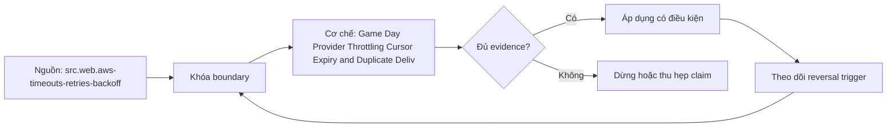

# Game Day Provider Throttling Cursor Expiry and Duplicate Delivery

> [!abstract] Câu hỏi trung tâm
> Một game day ingestion chứng minh khả năng phát hiện, cô lập và phục hồi ba lỗi nhà cung cấp mà không gây mất hoặc nhân dữ liệu thế nào?

## 1. Game day không phải demo

Chốt hypothesis, steady-state baseline, blast radius, synthetic source/destination, observers, abort authority và stop thresholds trước injection. Không làm trên production khi chưa có approval. Success là phát hiện đúng, giữ invariant, phục hồi và thu evidence; không phải pipeline không báo lỗi. Timeline dùng một clock chuẩn và correlation IDs.

## 2. Kịch bản throttling

Provider trả 429 theo burst/quota, có và không Retry-After. Client phải classify đúng, obey bounded backoff+jitter, giảm concurrency, giữ deadline/retry budget và không khuếch đại tải. Đo request amplification, in-flight, recovery, source errors và freshness burn. Nested retries bị tắt hoặc accounting chung.

## 3. Kịch bản cursor expiry

Opaque cursor hết hạn giữa run; client không chế token. Recovery theo source contract: refresh snapshot/session, resume từ safe typed boundary hoặc restart bounded window rồi dedup/reconcile. Lưu last durable page, filter/order/config và token age. Nếu provider không bảo đảm snapshot, completeness chỉ được kết luận sau key/range reconciliation.

## 4. Kịch bản duplicate delivery

Phát cùng record/page/batch hai lần, rồi same identity different payload. Same identity same content phải idempotent; different content là collision/quarantine. Dedup identity phải gồm source/entity/business key/version hoặc batch boundary, không chỉ payload hash. Đo accepted, replayed, rejected và residual duplicates theo target grain.

## 5. Quan sát và điều hành

Alert phải dẫn tới runbook action: throttle, pause, refresh auth/cursor, quarantine hoặc replay. Dashboard nối provider status, limiter/retry state, checkpoint, landing ledger, target publish và reconciliation. Operator không chỉnh checkpoint trực tiếp ngoài audited procedure. Communication phân biệt impact thực, risk và unknown.

## 6. After-action review

So expected với observed timeline, detection/recovery time, SLO burn và data diff. Ghi control thất bại, contributing conditions, owner/deadline và verification test; không quy lỗi cá nhân. Rerun targeted scenario sau remediation. Chưa có exact input/output hashes và checkpoint states thì exercise chưa chứng minh data correctness.

## 7. Ma trận kiểm chứng từng mệnh đề

Mỗi claim phải gắn source/entity boundary, exact fixture, checkpoint/input state, counterexample và independent reconciliation oracle. Connector chạy thành công hoặc API trả 2xx chưa chứng minh completeness.

### 7.1. Game-day probe 1: injection, expected state, stop rule, observed evidence và reconciliation oracle phải đủ

**Mệnh đề cần kiểm.** Game-day probe 1: injection, expected state, stop rule, observed evidence và reconciliation oracle phải đủ.

**Thiết kế phép thử cho `wiki.ingestion.game-day-throttling-cursor-expiry-duplicates`.** Khóa source/API version, entity, grain/key, time boundary, schema, pagination/cursor configuration và failure schedule. Tạo positive, boundary và negative fixtures; thay đổi đúng một assumption. Lưu request/query, response/raw extract hash, checkpoint trước/sau, landing objects, target state và source-at-boundary oracle.

**Điều kiện chấp nhận cho `wiki.ingestion.game-day-throttling-cursor-expiry-duplicates`.** Count, key set, typed field hash và delete state khớp contract; duplicates được giải thích và dedup có identity rõ. Observation, inference và unknown được báo riêng. Lab chưa chạy chỉ là protocol.

### 7.2. Game-day probe 2: injection, expected state, stop rule, observed evidence và reconciliation oracle phải đủ

**Mệnh đề cần kiểm.** Game-day probe 2: injection, expected state, stop rule, observed evidence và reconciliation oracle phải đủ.

**Thiết kế phép thử cho `wiki.ingestion.game-day-throttling-cursor-expiry-duplicates`.** Khóa source/API version, entity, grain/key, time boundary, schema, pagination/cursor configuration và failure schedule. Tạo positive, boundary và negative fixtures; thay đổi đúng một assumption. Lưu request/query, response/raw extract hash, checkpoint trước/sau, landing objects, target state và source-at-boundary oracle.

**Điều kiện chấp nhận cho `wiki.ingestion.game-day-throttling-cursor-expiry-duplicates`.** Count, key set, typed field hash và delete state khớp contract; duplicates được giải thích và dedup có identity rõ. Observation, inference và unknown được báo riêng. Lab chưa chạy chỉ là protocol.

### 7.3. Game-day probe 3: injection, expected state, stop rule, observed evidence và reconciliation oracle phải đủ

**Mệnh đề cần kiểm.** Game-day probe 3: injection, expected state, stop rule, observed evidence và reconciliation oracle phải đủ.

**Thiết kế phép thử cho `wiki.ingestion.game-day-throttling-cursor-expiry-duplicates`.** Khóa source/API version, entity, grain/key, time boundary, schema, pagination/cursor configuration và failure schedule. Tạo positive, boundary và negative fixtures; thay đổi đúng một assumption. Lưu request/query, response/raw extract hash, checkpoint trước/sau, landing objects, target state và source-at-boundary oracle.

**Điều kiện chấp nhận cho `wiki.ingestion.game-day-throttling-cursor-expiry-duplicates`.** Count, key set, typed field hash và delete state khớp contract; duplicates được giải thích và dedup có identity rõ. Observation, inference và unknown được báo riêng. Lab chưa chạy chỉ là protocol.

### 7.4. Game-day probe 4: injection, expected state, stop rule, observed evidence và reconciliation oracle phải đủ

**Mệnh đề cần kiểm.** Game-day probe 4: injection, expected state, stop rule, observed evidence và reconciliation oracle phải đủ.

**Thiết kế phép thử cho `wiki.ingestion.game-day-throttling-cursor-expiry-duplicates`.** Khóa source/API version, entity, grain/key, time boundary, schema, pagination/cursor configuration và failure schedule. Tạo positive, boundary và negative fixtures; thay đổi đúng một assumption. Lưu request/query, response/raw extract hash, checkpoint trước/sau, landing objects, target state và source-at-boundary oracle.

**Điều kiện chấp nhận cho `wiki.ingestion.game-day-throttling-cursor-expiry-duplicates`.** Count, key set, typed field hash và delete state khớp contract; duplicates được giải thích và dedup có identity rõ. Observation, inference và unknown được báo riêng. Lab chưa chạy chỉ là protocol.

### 7.5. Game-day probe 5: injection, expected state, stop rule, observed evidence và reconciliation oracle phải đủ

**Mệnh đề cần kiểm.** Game-day probe 5: injection, expected state, stop rule, observed evidence và reconciliation oracle phải đủ.

**Thiết kế phép thử cho `wiki.ingestion.game-day-throttling-cursor-expiry-duplicates`.** Khóa source/API version, entity, grain/key, time boundary, schema, pagination/cursor configuration và failure schedule. Tạo positive, boundary và negative fixtures; thay đổi đúng một assumption. Lưu request/query, response/raw extract hash, checkpoint trước/sau, landing objects, target state và source-at-boundary oracle.

**Điều kiện chấp nhận cho `wiki.ingestion.game-day-throttling-cursor-expiry-duplicates`.** Count, key set, typed field hash và delete state khớp contract; duplicates được giải thích và dedup có identity rõ. Observation, inference và unknown được báo riêng. Lab chưa chạy chỉ là protocol.

### 7.6. Game-day probe 6: injection, expected state, stop rule, observed evidence và reconciliation oracle phải đủ

**Mệnh đề cần kiểm.** Game-day probe 6: injection, expected state, stop rule, observed evidence và reconciliation oracle phải đủ.

**Thiết kế phép thử cho `wiki.ingestion.game-day-throttling-cursor-expiry-duplicates`.** Khóa source/API version, entity, grain/key, time boundary, schema, pagination/cursor configuration và failure schedule. Tạo positive, boundary và negative fixtures; thay đổi đúng một assumption. Lưu request/query, response/raw extract hash, checkpoint trước/sau, landing objects, target state và source-at-boundary oracle.

**Điều kiện chấp nhận cho `wiki.ingestion.game-day-throttling-cursor-expiry-duplicates`.** Count, key set, typed field hash và delete state khớp contract; duplicates được giải thích và dedup có identity rõ. Observation, inference và unknown được báo riêng. Lab chưa chạy chỉ là protocol.

### 7.7. Game-day probe 7: injection, expected state, stop rule, observed evidence và reconciliation oracle phải đủ

**Mệnh đề cần kiểm.** Game-day probe 7: injection, expected state, stop rule, observed evidence và reconciliation oracle phải đủ.

**Thiết kế phép thử cho `wiki.ingestion.game-day-throttling-cursor-expiry-duplicates`.** Khóa source/API version, entity, grain/key, time boundary, schema, pagination/cursor configuration và failure schedule. Tạo positive, boundary và negative fixtures; thay đổi đúng một assumption. Lưu request/query, response/raw extract hash, checkpoint trước/sau, landing objects, target state và source-at-boundary oracle.

**Điều kiện chấp nhận cho `wiki.ingestion.game-day-throttling-cursor-expiry-duplicates`.** Count, key set, typed field hash và delete state khớp contract; duplicates được giải thích và dedup có identity rõ. Observation, inference và unknown được báo riêng. Lab chưa chạy chỉ là protocol.

### 7.8. Game-day probe 8: injection, expected state, stop rule, observed evidence và reconciliation oracle phải đủ

**Mệnh đề cần kiểm.** Game-day probe 8: injection, expected state, stop rule, observed evidence và reconciliation oracle phải đủ.

**Thiết kế phép thử cho `wiki.ingestion.game-day-throttling-cursor-expiry-duplicates`.** Khóa source/API version, entity, grain/key, time boundary, schema, pagination/cursor configuration và failure schedule. Tạo positive, boundary và negative fixtures; thay đổi đúng một assumption. Lưu request/query, response/raw extract hash, checkpoint trước/sau, landing objects, target state và source-at-boundary oracle.

**Điều kiện chấp nhận cho `wiki.ingestion.game-day-throttling-cursor-expiry-duplicates`.** Count, key set, typed field hash và delete state khớp contract; duplicates được giải thích và dedup có identity rõ. Observation, inference và unknown được báo riêng. Lab chưa chạy chỉ là protocol.

### 7.9. Game-day probe 9: injection, expected state, stop rule, observed evidence và reconciliation oracle phải đủ

**Mệnh đề cần kiểm.** Game-day probe 9: injection, expected state, stop rule, observed evidence và reconciliation oracle phải đủ.

**Thiết kế phép thử cho `wiki.ingestion.game-day-throttling-cursor-expiry-duplicates`.** Khóa source/API version, entity, grain/key, time boundary, schema, pagination/cursor configuration và failure schedule. Tạo positive, boundary và negative fixtures; thay đổi đúng một assumption. Lưu request/query, response/raw extract hash, checkpoint trước/sau, landing objects, target state và source-at-boundary oracle.

**Điều kiện chấp nhận cho `wiki.ingestion.game-day-throttling-cursor-expiry-duplicates`.** Count, key set, typed field hash và delete state khớp contract; duplicates được giải thích và dedup có identity rõ. Observation, inference và unknown được báo riêng. Lab chưa chạy chỉ là protocol.

### 7.10. Game-day probe 10: injection, expected state, stop rule, observed evidence và reconciliation oracle phải đủ

**Mệnh đề cần kiểm.** Game-day probe 10: injection, expected state, stop rule, observed evidence và reconciliation oracle phải đủ.

**Thiết kế phép thử cho `wiki.ingestion.game-day-throttling-cursor-expiry-duplicates`.** Khóa source/API version, entity, grain/key, time boundary, schema, pagination/cursor configuration và failure schedule. Tạo positive, boundary và negative fixtures; thay đổi đúng một assumption. Lưu request/query, response/raw extract hash, checkpoint trước/sau, landing objects, target state và source-at-boundary oracle.

**Điều kiện chấp nhận cho `wiki.ingestion.game-day-throttling-cursor-expiry-duplicates`.** Count, key set, typed field hash và delete state khớp contract; duplicates được giải thích và dedup có identity rõ. Observation, inference và unknown được báo riêng. Lab chưa chạy chỉ là protocol.

### 7.11. Game-day probe 11: injection, expected state, stop rule, observed evidence và reconciliation oracle phải đủ

**Mệnh đề cần kiểm.** Game-day probe 11: injection, expected state, stop rule, observed evidence và reconciliation oracle phải đủ.

**Thiết kế phép thử cho `wiki.ingestion.game-day-throttling-cursor-expiry-duplicates`.** Khóa source/API version, entity, grain/key, time boundary, schema, pagination/cursor configuration và failure schedule. Tạo positive, boundary và negative fixtures; thay đổi đúng một assumption. Lưu request/query, response/raw extract hash, checkpoint trước/sau, landing objects, target state và source-at-boundary oracle.

**Điều kiện chấp nhận cho `wiki.ingestion.game-day-throttling-cursor-expiry-duplicates`.** Count, key set, typed field hash và delete state khớp contract; duplicates được giải thích và dedup có identity rõ. Observation, inference và unknown được báo riêng. Lab chưa chạy chỉ là protocol.

### 7.12. Game-day probe 12: injection, expected state, stop rule, observed evidence và reconciliation oracle phải đủ

**Mệnh đề cần kiểm.** Game-day probe 12: injection, expected state, stop rule, observed evidence và reconciliation oracle phải đủ.

**Thiết kế phép thử cho `wiki.ingestion.game-day-throttling-cursor-expiry-duplicates`.** Khóa source/API version, entity, grain/key, time boundary, schema, pagination/cursor configuration và failure schedule. Tạo positive, boundary và negative fixtures; thay đổi đúng một assumption. Lưu request/query, response/raw extract hash, checkpoint trước/sau, landing objects, target state và source-at-boundary oracle.

**Điều kiện chấp nhận cho `wiki.ingestion.game-day-throttling-cursor-expiry-duplicates`.** Count, key set, typed field hash và delete state khớp contract; duplicates được giải thích và dedup có identity rõ. Observation, inference và unknown được báo riêng. Lab chưa chạy chỉ là protocol.

### 7.13. Game-day probe 13: injection, expected state, stop rule, observed evidence và reconciliation oracle phải đủ

**Mệnh đề cần kiểm.** Game-day probe 13: injection, expected state, stop rule, observed evidence và reconciliation oracle phải đủ.

**Thiết kế phép thử cho `wiki.ingestion.game-day-throttling-cursor-expiry-duplicates`.** Khóa source/API version, entity, grain/key, time boundary, schema, pagination/cursor configuration và failure schedule. Tạo positive, boundary và negative fixtures; thay đổi đúng một assumption. Lưu request/query, response/raw extract hash, checkpoint trước/sau, landing objects, target state và source-at-boundary oracle.

**Điều kiện chấp nhận cho `wiki.ingestion.game-day-throttling-cursor-expiry-duplicates`.** Count, key set, typed field hash và delete state khớp contract; duplicates được giải thích và dedup có identity rõ. Observation, inference và unknown được báo riêng. Lab chưa chạy chỉ là protocol.

### 7.14. Game-day probe 14: injection, expected state, stop rule, observed evidence và reconciliation oracle phải đủ

**Mệnh đề cần kiểm.** Game-day probe 14: injection, expected state, stop rule, observed evidence và reconciliation oracle phải đủ.

**Thiết kế phép thử cho `wiki.ingestion.game-day-throttling-cursor-expiry-duplicates`.** Khóa source/API version, entity, grain/key, time boundary, schema, pagination/cursor configuration và failure schedule. Tạo positive, boundary và negative fixtures; thay đổi đúng một assumption. Lưu request/query, response/raw extract hash, checkpoint trước/sau, landing objects, target state và source-at-boundary oracle.

**Điều kiện chấp nhận cho `wiki.ingestion.game-day-throttling-cursor-expiry-duplicates`.** Count, key set, typed field hash và delete state khớp contract; duplicates được giải thích và dedup có identity rõ. Observation, inference và unknown được báo riêng. Lab chưa chạy chỉ là protocol.

### 7.15. Game-day probe 15: injection, expected state, stop rule, observed evidence và reconciliation oracle phải đủ

**Mệnh đề cần kiểm.** Game-day probe 15: injection, expected state, stop rule, observed evidence và reconciliation oracle phải đủ.

**Thiết kế phép thử cho `wiki.ingestion.game-day-throttling-cursor-expiry-duplicates`.** Khóa source/API version, entity, grain/key, time boundary, schema, pagination/cursor configuration và failure schedule. Tạo positive, boundary và negative fixtures; thay đổi đúng một assumption. Lưu request/query, response/raw extract hash, checkpoint trước/sau, landing objects, target state và source-at-boundary oracle.

**Điều kiện chấp nhận cho `wiki.ingestion.game-day-throttling-cursor-expiry-duplicates`.** Count, key set, typed field hash và delete state khớp contract; duplicates được giải thích và dedup có identity rõ. Observation, inference và unknown được báo riêng. Lab chưa chạy chỉ là protocol.

## 8. Quy trình phản biện

1. Chốt entity, grain, identity và immutable boundary.
2. Tách source fact, documentation claim và observed behavior.
3. Viết delete, retry, checkpoint và replay semantics trước code.
4. Dùng key/typed-hash reconciliation, không chỉ row count.
5. Pin version, retention, timezone, ordering và rate limits.
6. Ghi assumption bị falsify và extraction pattern thay thế.

## 9. Câu hỏi tự kiểm tra

1. Source thay đổi row/entity theo những operation nào?
2. Boundary nào định nghĩa complete?
3. Delete có xuất hiện trong interface không?
4. Cursor/order có total và immutable không?
5. Crash ở checkpoint boundary gây replay hay gap?
6. Bằng chứng nào chưa được chạy?

## 10. Giới hạn và điều chưa cho phép kết luận

- Chưa chạy mutation/pagination/watermark lab trên source thật.
- Product behavior phải pin version, retention và configuration.
- Decision matrices và failure protocols là synthesis của giáo trình.
- Note giữ trạng thái `review` tới khi chủ dự án duyệt.

## Reference
1. [[SRC-AWS-TIMEOUTS-RETRIES-BACKOFF]]
2. [[SRC-AIRBYTE-SCHEMA-CHANGE-MANAGEMENT]]
3. [[SRC-REIS-HOUSLEY-FUNDAMENTALS-DATA-ENGINEERING]]
4. [[SRC-GOOGLE-SRE-POSTMORTEM-CULTURE]]

## Source coverage

| Source slice | Nội dung sử dụng | Trạng thái |
|---|---|---|
| [[SRC-AWS-TIMEOUTS-RETRIES-BACKOFF]] | Source/change/API contract hoặc engineering context | Đã đọc locator; không suy ngoài phạm vi |
| [[SRC-AIRBYTE-SCHEMA-CHANGE-MANAGEMENT]] | Source/change/API contract hoặc engineering context | Đã đọc locator; không suy ngoài phạm vi |
| [[SRC-REIS-HOUSLEY-FUNDAMENTALS-DATA-ENGINEERING]] | Source/change/API contract hoặc engineering context | Đã đọc locator; không suy ngoài phạm vi |
| [[SRC-GOOGLE-SRE-POSTMORTEM-CULTURE]] | Source/change/API contract hoặc engineering context | Đã đọc locator; không suy ngoài phạm vi |

## Key takeaways
- Extraction pattern chỉ đúng khi source assumptions đúng.
- Completeness cần immutable boundary và reconciliation oracle.
- Retry/checkpoint ưu tiên replay có kiểm soát hơn silent gap.
- Connector không chuyển giao ownership về tính đúng.

<!-- ATOMIC-EXECUTION-CAPSULE:START -->

## Execution capsule: kiểm chứng `wiki.ingestion.game-day-throttling-cursor-expiry-duplicates`

> [!important] Phân loại mệnh đề
> Với `wiki.ingestion.game-day-throttling-cursor-expiry-duplicates`, sơ đồ, ví dụ và artifact về **Game Day Provider Throttling Cursor Expiry and Duplicate Delivery** là **synthesis để kiểm chứng**; chúng không phải trích dẫn hay case nguyên văn của nguồn.

### Sơ đồ cơ chế và điểm kiểm soát



Đọc sơ đồ `wiki.ingestion.game-day-throttling-cursor-expiry-duplicates` từ trái sang phải: source chỉ cung cấp claim ban đầu cho **Game Day Provider Throttling Cursor Expiry and Duplicate Delivery**; quyết định chỉ được đi tiếp sau khi boundary, evidence và điều kiện đảo quyết định đã hiện hữu.

### Ví dụ làm việc có thể bác bỏ

**Input.** Một đội cần trả lời: Một game day ingestion chứng minh khả năng phát hiện, cô lập và phục hồi ba lỗi nhà cung cấp mà không gây mất hoặc nhân dữ liệu thế nào? cho một phạm vi nhỏ, có owner và deadline rõ.

**Decision.** Đội áp dụng **Game Day Provider Throttling Cursor Expiry and Duplicate Delivery** trên control và variant chỉ khác một assumption; expected result và hard constraints được khóa trước khi chạy.

**Outcome.** Với `wiki.ingestion.game-day-throttling-cursor-expiry-duplicates`, nếu observation vi phạm hard constraint hoặc oracle độc lập không xác nhận **Game Day Provider Throttling Cursor Expiry and Duplicate Delivery**, đội thu hẹp claim hay đảo quyết định. Nếu đạt, kết luận vẫn kèm scope, version và review date; một lần thành công không được nâng thành quy luật phổ quát.

### Artifact thực thi tối thiểu

```sql
-- Verification harness for: Game Day Provider Throttling Cursor Expiry and Duplicate Delivery
WITH evidence AS (
    SELECT 'wiki.ingestion.game-day-throttling-cursor-expiry-duplicates' AS concept_id,
           'boundary_declared' AS check_name, 1 AS passed
    UNION ALL
    SELECT 'wiki.ingestion.game-day-throttling-cursor-expiry-duplicates', 'independent_oracle', 1
    UNION ALL
    SELECT 'wiki.ingestion.game-day-throttling-cursor-expiry-duplicates', 'reversal_trigger_recorded', 1
)
SELECT concept_id,
       MIN(passed) AS all_hard_checks_pass,
       COUNT(*) AS evidence_items
FROM evidence
GROUP BY concept_id
HAVING MIN(passed) = 1;
```

Artifact của `wiki.ingestion.game-day-throttling-cursor-expiry-duplicates` buộc người dùng ghi boundary, oracle và reversal trigger cho **Game Day Provider Throttling Cursor Expiry and Duplicate Delivery**. Các giá trị minh họa phải được thay bằng evidence thật trước khi dùng cho quyết định.

### Tự kiểm tra trước khi tái sử dụng

1. Bạn có thể trả lời `Một game day ingestion chứng minh khả năng phát hiện, cô lập và phục hồi ba lỗi nhà cung cấp mà không gây mất hoặc nhân dữ liệu thế nào?` bằng một câu mà không kéo thêm concept thứ hai không?
2. Source locator nào đỡ cho claim, và phần nào chỉ là synthesis trong note?
3. Observation nào khiến bạn dừng, thu hẹp hoặc đảo quyết định?
4. Artifact nào cho phép một reviewer độc lập tái hiện kết quả?

<!-- ATOMIC-EXECUTION-CAPSULE:END -->
