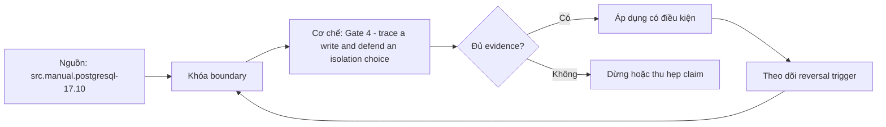

# Gate 4 - trace a write and defend an isolation choice

> [!abstract] Câu hỏi trung tâm
> Gate 4 phải buộc người học tạo bằng chứng gì để chứng minh hiểu write path, SQL plans, isolation, locks, recovery và vận hành thay vì nhớ thuật ngữ?

## 1. Gate đo năng lực tích hợp

Cổng không dạy khái niệm mới. Nó kiểm người học nối SQL statement, planner/executor, page/buffer, WAL, commit, checkpoint và recovery; đồng thời bảo vệ isolation theo anomaly và thực hiện restore. Điểm chỉ có ý nghĩa khi evidence artifact tái kiểm được. Phần bắt buộc có floor riêng để tổng điểm không che lỗ hổng an toàn.

## 2. Phần A: trace write

Bài làm phải phân biệt logical statement, tuple/page mutation, dirty buffer, WAL record/LSN, WAL flush trước data page, commit acknowledgment, checkpoint và crash replay. Không yêu cầu engine internals giả tạo như mọi INSERT đều có cùng số WAL record. Diagram phải chỉ sync boundary và điều kiện durability theo cấu hình.

## 3. Phần B: plan evidence

Hai query tuning bắt đầu bằng EXPLAIN ANALYZE BUFFERS có dữ liệu seed cố định, giữ result equivalence và so plan/counters trước sau. Không chấm chỉ bằng latency một lần. Candidate phải giải thích cardinality, access path, join, sort/spill và trade-off write/storage của index/rewrite.

## 4. Phần C: isolation proof

Mỗi invariant có concurrent schedule với barriers, snapshots/reads, writes, commit/abort và final assertion. Chọn Read Committed, Repeatable Read, Serializable, explicit lock hoặc constraint dựa anomaly. Abort đúng thiết kế được chấp nhận nếu retry contract đầy đủ. Sequential test không chứng minh concurrency control.

## 5. Phần D-F

Restore phần D cần target, operation ledger, RPO/RTO, reconciliation. Lock diagnosis phần E cần holder-waiter graph, resource và safe resolution. Operations phần F cần metrics, threshold derivation và lead time. Môi trường phải cô lập; phần recovery/kill/lock không chạy trên shared hoặc production database.

## 6. Rubric và remediation

Rubric tách factual correctness, mechanism, evidence, reproducibility, safety và communication. C/D có floor vì isolation/recovery là năng lực không được bù bằng SQL. Vi phạm safety hoặc fabricate output là critical failure. Remediation nhắm đúng dimension: đọc lại, lab có scaffold, retest bằng dataset/schedule mới, không cho chép lại cùng đáp án.

## 7. Ma trận kiểm chứng từng mệnh đề

Mỗi mệnh đề dưới đây phải được kiểm bằng một schedule hoặc phép đo có điều kiện đầu vào rõ ràng. Không dùng một ảnh màn hình cuối làm bằng chứng thay cho lệnh, timestamp, cấu hình và raw output.

### 7.1. write trace phải chỉ WAL-before-data rule và commit flush boundary

**Giả thuyết.** write trace phải chỉ WAL-before-data rule và commit flush boundary. **Cách kiểm.** Cố định phiên bản database, cấu hình, dữ liệu seed và thứ tự thao tác; ghi operation ID, transaction/session ID, thời điểm bắt đầu-kết thúc và trạng thái commit/abort. **Đối chứng.** Chạy một biến thể bỏ đúng yếu tố đang xét, không đổi đồng thời nhiều tham số. **Bằng chứng đạt cho `wiki.assessment.gate-4-database-internals`.** Lưu command/script, raw result và counter trước-sau; giải thích cơ chế tạo ra quan sát. Một lần không tái hiện không đủ bác bỏ hiện tượng concurrency; cần barrier xác định và lặp có giới hạn.

### 7.2. checkpoint không đồng nghĩa mọi dirty page đều durable ngay tại một điểm giản đơn

**Giả thuyết.** checkpoint không đồng nghĩa mọi dirty page đều durable ngay tại một điểm giản đơn. **Cách kiểm.** Cố định phiên bản database, cấu hình, dữ liệu seed và thứ tự thao tác; ghi operation ID, transaction/session ID, thời điểm bắt đầu-kết thúc và trạng thái commit/abort. **Đối chứng.** Chạy một biến thể bỏ đúng yếu tố đang xét, không đổi đồng thời nhiều tham số. **Bằng chứng đạt cho `wiki.assessment.gate-4-database-internals`.** Lưu command/script, raw result và counter trước-sau; giải thích cơ chế tạo ra quan sát. Một lần không tái hiện không đủ bác bỏ hiện tượng concurrency; cần barrier xác định và lặp có giới hạn.

### 7.3. plan tuning phải chứng minh result equivalence

**Giả thuyết.** plan tuning phải chứng minh result equivalence. **Cách kiểm.** Cố định phiên bản database, cấu hình, dữ liệu seed và thứ tự thao tác; ghi operation ID, transaction/session ID, thời điểm bắt đầu-kết thúc và trạng thái commit/abort. **Đối chứng.** Chạy một biến thể bỏ đúng yếu tố đang xét, không đổi đồng thời nhiều tham số. **Bằng chứng đạt cho `wiki.assessment.gate-4-database-internals`.** Lưu command/script, raw result và counter trước-sau; giải thích cơ chế tạo ra quan sát. Một lần không tái hiện không đủ bác bỏ hiện tượng concurrency; cần barrier xác định và lặp có giới hạn.

### 7.4. một latency sample không đủ đánh giá plan

**Giả thuyết.** một latency sample không đủ đánh giá plan. **Cách kiểm.** Cố định phiên bản database, cấu hình, dữ liệu seed và thứ tự thao tác; ghi operation ID, transaction/session ID, thời điểm bắt đầu-kết thúc và trạng thái commit/abort. **Đối chứng.** Chạy một biến thể bỏ đúng yếu tố đang xét, không đổi đồng thời nhiều tham số. **Bằng chứng đạt cho `wiki.assessment.gate-4-database-internals`.** Lưu command/script, raw result và counter trước-sau; giải thích cơ chế tạo ra quan sát. Một lần không tái hiện không đủ bác bỏ hiện tượng concurrency; cần barrier xác định và lặp có giới hạn.

### 7.5. index nhanh read nhưng tăng write/storage/maintenance

**Giả thuyết.** index nhanh read nhưng tăng write/storage/maintenance. **Cách kiểm.** Cố định phiên bản database, cấu hình, dữ liệu seed và thứ tự thao tác; ghi operation ID, transaction/session ID, thời điểm bắt đầu-kết thúc và trạng thái commit/abort. **Đối chứng.** Chạy một biến thể bỏ đúng yếu tố đang xét, không đổi đồng thời nhiều tham số. **Bằng chứng đạt cho `wiki.assessment.gate-4-database-internals`.** Lưu command/script, raw result và counter trước-sau; giải thích cơ chế tạo ra quan sát. Một lần không tái hiện không đủ bác bỏ hiện tượng concurrency; cần barrier xác định và lặp có giới hạn.

### 7.6. isolation phải chọn từ invariant và anomaly

**Giả thuyết.** isolation phải chọn từ invariant và anomaly. **Cách kiểm.** Cố định phiên bản database, cấu hình, dữ liệu seed và thứ tự thao tác; ghi operation ID, transaction/session ID, thời điểm bắt đầu-kết thúc và trạng thái commit/abort. **Đối chứng.** Chạy một biến thể bỏ đúng yếu tố đang xét, không đổi đồng thời nhiều tham số. **Bằng chứng đạt cho `wiki.assessment.gate-4-database-internals`.** Lưu command/script, raw result và counter trước-sau; giải thích cơ chế tạo ra quan sát. Một lần không tái hiện không đủ bác bỏ hiện tượng concurrency; cần barrier xác định và lặp có giới hạn.

### 7.7. sequential execution không tái hiện write skew

**Giả thuyết.** sequential execution không tái hiện write skew. **Cách kiểm.** Cố định phiên bản database, cấu hình, dữ liệu seed và thứ tự thao tác; ghi operation ID, transaction/session ID, thời điểm bắt đầu-kết thúc và trạng thái commit/abort. **Đối chứng.** Chạy một biến thể bỏ đúng yếu tố đang xét, không đổi đồng thời nhiều tham số. **Bằng chứng đạt cho `wiki.assessment.gate-4-database-internals`.** Lưu command/script, raw result và counter trước-sau; giải thích cơ chế tạo ra quan sát. Một lần không tái hiện không đủ bác bỏ hiện tượng concurrency; cần barrier xác định và lặp có giới hạn.

### 7.8. serialization abort có thể là kết quả đúng

**Giả thuyết.** serialization abort có thể là kết quả đúng. **Cách kiểm.** Cố định phiên bản database, cấu hình, dữ liệu seed và thứ tự thao tác; ghi operation ID, transaction/session ID, thời điểm bắt đầu-kết thúc và trạng thái commit/abort. **Đối chứng.** Chạy một biến thể bỏ đúng yếu tố đang xét, không đổi đồng thời nhiều tham số. **Bằng chứng đạt cho `wiki.assessment.gate-4-database-internals`.** Lưu command/script, raw result và counter trước-sau; giải thích cơ chế tạo ra quan sát. Một lần không tái hiện không đủ bác bỏ hiện tượng concurrency; cần barrier xác định và lặp có giới hạn.

### 7.9. retry phải chạy lại logical transaction từ snapshot mới

**Giả thuyết.** retry phải chạy lại logical transaction từ snapshot mới. **Cách kiểm.** Cố định phiên bản database, cấu hình, dữ liệu seed và thứ tự thao tác; ghi operation ID, transaction/session ID, thời điểm bắt đầu-kết thúc và trạng thái commit/abort. **Đối chứng.** Chạy một biến thể bỏ đúng yếu tố đang xét, không đổi đồng thời nhiều tham số. **Bằng chứng đạt cho `wiki.assessment.gate-4-database-internals`.** Lưu command/script, raw result và counter trước-sau; giải thích cơ chế tạo ra quan sát. Một lần không tái hiện không đủ bác bỏ hiện tượng concurrency; cần barrier xác định và lặp có giới hạn.

### 7.10. restore cần ledger và reconciliation

**Giả thuyết.** restore cần ledger và reconciliation. **Cách kiểm.** Cố định phiên bản database, cấu hình, dữ liệu seed và thứ tự thao tác; ghi operation ID, transaction/session ID, thời điểm bắt đầu-kết thúc và trạng thái commit/abort. **Đối chứng.** Chạy một biến thể bỏ đúng yếu tố đang xét, không đổi đồng thời nhiều tham số. **Bằng chứng đạt cho `wiki.assessment.gate-4-database-internals`.** Lưu command/script, raw result và counter trước-sau; giải thích cơ chế tạo ra quan sát. Một lần không tái hiện không đủ bác bỏ hiện tượng concurrency; cần barrier xác định và lặp có giới hạn.

### 7.11. lock diagnosis phải dựng blocker chain

**Giả thuyết.** lock diagnosis phải dựng blocker chain. **Cách kiểm.** Cố định phiên bản database, cấu hình, dữ liệu seed và thứ tự thao tác; ghi operation ID, transaction/session ID, thời điểm bắt đầu-kết thúc và trạng thái commit/abort. **Đối chứng.** Chạy một biến thể bỏ đúng yếu tố đang xét, không đổi đồng thời nhiều tham số. **Bằng chứng đạt cho `wiki.assessment.gate-4-database-internals`.** Lưu command/script, raw result và counter trước-sau; giải thích cơ chế tạo ra quan sát. Một lần không tái hiện không đủ bác bỏ hiện tượng concurrency; cần barrier xác định và lặp có giới hạn.

### 7.12. operations threshold phải có baseline

**Giả thuyết.** operations threshold phải có baseline. **Cách kiểm.** Cố định phiên bản database, cấu hình, dữ liệu seed và thứ tự thao tác; ghi operation ID, transaction/session ID, thời điểm bắt đầu-kết thúc và trạng thái commit/abort. **Đối chứng.** Chạy một biến thể bỏ đúng yếu tố đang xét, không đổi đồng thời nhiều tham số. **Bằng chứng đạt cho `wiki.assessment.gate-4-database-internals`.** Lưu command/script, raw result và counter trước-sau; giải thích cơ chế tạo ra quan sát. Một lần không tái hiện không đủ bác bỏ hiện tượng concurrency; cần barrier xác định và lặp có giới hạn.

### 7.13. critical safety failure không được bù bằng tổng điểm

**Giả thuyết.** critical safety failure không được bù bằng tổng điểm. **Cách kiểm.** Cố định phiên bản database, cấu hình, dữ liệu seed và thứ tự thao tác; ghi operation ID, transaction/session ID, thời điểm bắt đầu-kết thúc và trạng thái commit/abort. **Đối chứng.** Chạy một biến thể bỏ đúng yếu tố đang xét, không đổi đồng thời nhiều tham số. **Bằng chứng đạt cho `wiki.assessment.gate-4-database-internals`.** Lưu command/script, raw result và counter trước-sau; giải thích cơ chế tạo ra quan sát. Một lần không tái hiện không đủ bác bỏ hiện tượng concurrency; cần barrier xác định và lặp có giới hạn.

### 7.14. dataset retest phải khác practice case

**Giả thuyết.** dataset retest phải khác practice case. **Cách kiểm.** Cố định phiên bản database, cấu hình, dữ liệu seed và thứ tự thao tác; ghi operation ID, transaction/session ID, thời điểm bắt đầu-kết thúc và trạng thái commit/abort. **Đối chứng.** Chạy một biến thể bỏ đúng yếu tố đang xét, không đổi đồng thời nhiều tham số. **Bằng chứng đạt cho `wiki.assessment.gate-4-database-internals`.** Lưu command/script, raw result và counter trước-sau; giải thích cơ chế tạo ra quan sát. Một lần không tái hiện không đủ bác bỏ hiện tượng concurrency; cần barrier xác định và lặp có giới hạn.

### 7.15. artifact thiếu raw output không đạt reproducibility

**Giả thuyết.** artifact thiếu raw output không đạt reproducibility. **Cách kiểm.** Cố định phiên bản database, cấu hình, dữ liệu seed và thứ tự thao tác; ghi operation ID, transaction/session ID, thời điểm bắt đầu-kết thúc và trạng thái commit/abort. **Đối chứng.** Chạy một biến thể bỏ đúng yếu tố đang xét, không đổi đồng thời nhiều tham số. **Bằng chứng đạt cho `wiki.assessment.gate-4-database-internals`.** Lưu command/script, raw result và counter trước-sau; giải thích cơ chế tạo ra quan sát. Một lần không tái hiện không đủ bác bỏ hiện tượng concurrency; cần barrier xác định và lặp có giới hạn.

## 8. Khung chẩn đoán

1. Viết hiện tượng quan sát được và mốc thời gian, không nhảy thẳng tới nguyên nhân.
2. Ghi exact DBMS/version, topology, isolation/durability mode và workload.
3. Dựng state hoặc dependency graph nhỏ nhất giải thích hiện tượng.
4. Thu evidence ở cả client, engine và storage/replica nếu có.
5. Nêu giả thuyết có dự đoán phân biệt được; đổi một biến và chạy lại.
6. Phân biệt biện pháp giảm triệu chứng, sửa nguyên nhân và control ngăn tái diễn.
7. Giữ failed run; không xoá evidence chỉ vì kết quả không như dự kiến.

## 9. Câu hỏi tự kiểm tra

1. Contract chính của cơ chế trong bài là gì và failure class nào nằm ngoài contract?
2. Counter hoặc graph nào phân biệt symptom với root cause?
3. Một phát biểu nào chỉ đúng cho PostgreSQL, không được khái quát thành SQL chung?
4. Abort hoặc stale read khi nào là hành vi đúng theo cấu hình?
5. Lab cần barrier, operation ID và đối chứng nào để tái hiện được?
6. Biện pháp vận hành nào nguy hiểm nếu áp dụng trực tiếp lên production?

## 10. Giới hạn và điều chưa cho phép kết luận

- Chưa chạy lab database; mọi số đo phải được học viên tạo trong môi trường cô lập.
- Hành vi theo version/dialect phải kiểm manual đúng hệ; note không thay runbook production.
- Không suy benchmark, ngưỡng alert hay SLO phổ quát từ sách.
- Không coi synchronous, serializable, vacuum hoặc partitioning là bảo đảm tuyệt đối ngoài cấu hình và failure model đã nêu.

## Reference
1. [[SRC-POSTGRESQL-17-10-MANUAL]]
2. [[SRC-MASTERING-POSTGRESQL-17-6E]]
3. [[SRC-ROGOV-POSTGRESQL-14-INTERNALS]]
4. [[SRC-SILBERSCHATZ-DATABASE-SYSTEM-CONCEPTS-7E]]
5. [[SRC-PETROV-DATABASE-INTERNALS-1E]]

## Source coverage

| Source slice | Nội dung sử dụng | Trạng thái |
|---|---|---|
| [[SRC-POSTGRESQL-17-10-MANUAL]] | Cơ chế, ranh giới và phản ví dụ liên quan đến bài | Đã đọc phạm vi có locator và diễn giải |
| [[SRC-MASTERING-POSTGRESQL-17-6E]] | Cơ chế, ranh giới và phản ví dụ liên quan đến bài | Đã đọc phạm vi có locator và diễn giải |
| [[SRC-ROGOV-POSTGRESQL-14-INTERNALS]] | Cơ chế, ranh giới và phản ví dụ liên quan đến bài | Đã đọc phạm vi có locator và diễn giải |
| [[SRC-SILBERSCHATZ-DATABASE-SYSTEM-CONCEPTS-7E]] | Cơ chế, ranh giới và phản ví dụ liên quan đến bài | Đã đọc phạm vi có locator và diễn giải |
| [[SRC-PETROV-DATABASE-INTERNALS-1E]] | Cơ chế, ranh giới và phản ví dụ liên quan đến bài | Đã đọc phạm vi có locator và diễn giải |

## Key takeaways
- Bắt đầu từ invariant/failure model và bằng chứng, không bắt đầu từ tên tính năng.
- Phân biệt contract chung với hành vi PostgreSQL cụ thể.
- Concurrency và failover test phải có schedule, operation ID và raw output tái lập được.
- Một control làm giảm rủi ro này có thể tăng latency, abort, coordination hoặc chi phí vận hành khác.
- Chưa chạy lab thì trạng thái là tài liệu học thuật đã kiểm cấu trúc, không phải chứng nhận production.

<!-- ATOMIC-EXECUTION-CAPSULE:START -->

## Execution capsule: kiểm chứng `wiki.assessment.gate-4-database-internals`

> [!important] Phân loại mệnh đề
> Với `wiki.assessment.gate-4-database-internals`, sơ đồ, ví dụ và artifact về **Gate 4 - trace a write and defend an isolation choice** là **synthesis để kiểm chứng**; chúng không phải trích dẫn hay case nguyên văn của nguồn.

### Sơ đồ cơ chế và điểm kiểm soát



Đọc sơ đồ `wiki.assessment.gate-4-database-internals` từ trái sang phải: source chỉ cung cấp claim ban đầu cho **Gate 4 - trace a write and defend an isolation choice**; quyết định chỉ được đi tiếp sau khi boundary, evidence và điều kiện đảo quyết định đã hiện hữu.

### Artifact thực thi tối thiểu

```sql
-- Verification harness for: Gate 4 - trace a write and defend an isolation choice
WITH evidence AS (
    SELECT 'wiki.assessment.gate-4-database-internals' AS concept_id,
           'boundary_declared' AS check_name, 1 AS passed
    UNION ALL
    SELECT 'wiki.assessment.gate-4-database-internals', 'independent_oracle', 1
    UNION ALL
    SELECT 'wiki.assessment.gate-4-database-internals', 'reversal_trigger_recorded', 1
)
SELECT concept_id,
       MIN(passed) AS all_hard_checks_pass,
       COUNT(*) AS evidence_items
FROM evidence
GROUP BY concept_id
HAVING MIN(passed) = 1;
```

Artifact của `wiki.assessment.gate-4-database-internals` buộc người dùng ghi boundary, oracle và reversal trigger cho **Gate 4 - trace a write and defend an isolation choice**. Các giá trị minh họa phải được thay bằng evidence thật trước khi dùng cho quyết định.

### Tự kiểm tra trước khi tái sử dụng

1. Bạn có thể trả lời `Gate 4 phải buộc người học tạo bằng chứng gì để chứng minh hiểu write path, SQL plans, isolation, locks, recovery và vận hành thay vì nhớ thuật ngữ?` bằng một câu mà không kéo thêm concept thứ hai không?
2. Source locator nào đỡ cho claim, và phần nào chỉ là synthesis trong note?
3. Observation nào khiến bạn dừng, thu hẹp hoặc đảo quyết định?
4. Artifact nào cho phép một reviewer độc lập tái hiện kết quả?

<!-- ATOMIC-EXECUTION-CAPSULE:END -->
