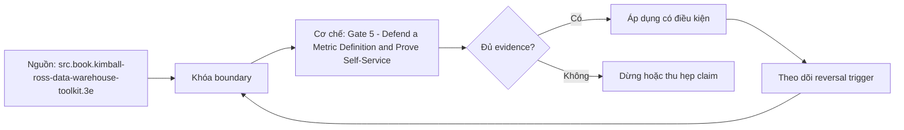

# Gate 5 - Defend a Metric Definition and Prove Self-Service

> [!abstract] Câu hỏi trung tâm
> Cổng Phase 5 phải tổ chức đề, oracle, đối soát, chấm điểm và automatic-fail như thế nào để đo năng lực bảo vệ metric thay vì khả năng trình diễn?

## 1. Cổng đo năng lực tích hợp

Gate 5 không dạy kiến thức mới. Nó kiểm chuỗi năng lực từ M11 đến M13: grain và keys; dimensional model và time behavior; metric contract; join/fanout proof; compatibility; documentation và task-based self-service. Người học nhận một case, atomic tables, edge-case fixture và consumer task. Output là hồ sơ có thể đối soát, không phải slide. Hội đồng đánh giá exact version của definitions, SQL, fixture và usability record; mọi sửa đổi sau giờ làm bài được đánh dấu riêng.

## 2. Phần A: grain và phép đếm

Với mỗi table, thí sinh viết một câu grain có entity, event/snapshot và time basis; chỉ ra candidate key hoặc uniqueness expectation. Phép đếm gồm row count, distinct business key, duplicate groups, null key và unmatched relationships. Grain statement không được mô tả column list. Một bảng account-month và account-event có thể cùng chứa account_id nhưng không cùng grain. Điểm chỉ được cấp khi statement khớp observations trên fixture; nếu data vi phạm, thí sinh phải phân biệt intended contract với observed defect.

## 3. Phần B: hợp đồng và oracle độc lập

Ba metrics cần contract sáu phần: population, expression, time, grain/aggregation, exclusions/edge behavior và owner/version. Hội đồng viết reconciliation query từ contract và atomic sources, không đọc implementation query trước. So numerator, denominator, final value và included key set ở ba aggregation levels. Tolerance chỉ dùng khi data type/rounding contract cho phép; exact integer counts không được che lệch bằng tolerance. Mismatch tạo diff rows để chẩn đoán, không chỉ một boolean fail.

## 4. Phần C và D: fanout cùng compatibility

Fanout proof theo bốn bước: chốt base grain, phân tích join multiplicity, so row/distinct-key/control totals trước-sau, rồi sửa bằng pre-aggregation, dedup contract hoặc bridge weighting. Một chasm trap được cài sẵn để phát hiện việc join hai fact streams qua dimensions rồi aggregate. Compatibility matrix là artifact cưỡng chế được: metric × dimension/path, allow/deny/conditional, reason code và test query. Declared compatibility mà compiler không enforce vẫn cần test; compiler denial sai cũng là defect.

## 5. Phần E: tự phục vụ bằng task evidence

Người thứ hai thực hiện tác vụ từ discovery tới kết quả và explain-back mà không nhận lời giải miệng. Ghi task success đúng, time, abandonment/assistance và confidence-versus-correctness; access grant, dashboard count hoặc click không thay thế. Protocol nêu participant profile, starting point, product version và allowed help. Một người dùng được hệ thống nhưng hiểu sai grain là failure. Dữ liệu cá nhân của participant chỉ thu khi có consent và retention rule; trong lớp ưu tiên observer sheet không chứa thông tin thừa.

## 6. Phần F và phiên chất vấn

Reviewer chọn ngẫu nhiên một metric và yêu cầu truy ngược về decision, action branch, concept, field, test và consumer limitation. Tiếp đó thay một constraint: cutoff đổi, late event xuất hiện, dimension effective time đổi hoặc population loại một segment. Thí sinh phải chỉ ra artifacts/tests bị ảnh hưởng trước khi sửa SQL. Chất vấn không chấm sự tự tin; điểm dựa trên causal chain, artifact locator và khả năng nói 'chưa đủ bằng chứng'. Reviewer không tiết lộ oracle query cho tới khi bản nộp đã được fingerprint.

## 7. Rubric và automatic zero

Tổng 100 điểm: A20, B25, C20, D15, E15, F5; đạt tổng ít nhất 70, đồng thời B và C mỗi phần ít nhất 60%. Một metric không khớp oracle làm phần B của metric đó bằng zero, không kéo toàn bài về zero nếu rubric không nói vậy. Silent double count hoặc thiếu fanout proof bị xử lý trong C. Vanity evidence làm E bằng zero. Rubric cần examples cho full/partial/no credit, two-reviewer calibration và appeal bằng artifact, tránh chấm theo phong cách trình bày.

## 8. Ma trận kiểm chứng từng mệnh đề

Mỗi kết luận cần input, observation và failure signal có thể lưu. Tên sản phẩm, file nhỏ, query nhanh hoặc presentation thuyết phục không tự chứng minh cơ chế hay năng lực.

### 8.1. gate không đưa nội dung mới

**Mệnh đề cần kiểm.** gate không đưa nội dung mới.

**Cách kiểm.** Fingerprint submission rồi chạy examiner-owned oracle ở ba grains, fanout/chasm fixture, executable compatibility tests và task-based self-service observation. Áp rubric/automatic-zero đúng phần đã công bố. Với mệnh đề này, ghi dataset/contract version, environment, controlled variables, expected observation, failure signal và boundary làm kết luận mất hiệu lực.

**Bằng chứng đạt cho `wiki.data-product.gate-5-metric-self-service`.** Lưu fixture hoặc source slice, command/query/protocol, raw output, counters/diff, reviewer và artifact hash. Nếu lab chưa chạy trên môi trường được phép, chỉ ghi protocol và expected result; không viết như kết quả đã quan sát.

### 8.2. grain statement có entity event snapshot và time basis

**Mệnh đề cần kiểm.** grain statement có entity event snapshot và time basis.

**Cách kiểm.** Fingerprint submission rồi chạy examiner-owned oracle ở ba grains, fanout/chasm fixture, executable compatibility tests và task-based self-service observation. Áp rubric/automatic-zero đúng phần đã công bố. Với mệnh đề này, ghi dataset/contract version, environment, controlled variables, expected observation, failure signal và boundary làm kết luận mất hiệu lực.

**Bằng chứng đạt cho `wiki.data-product.gate-5-metric-self-service`.** Lưu fixture hoặc source slice, command/query/protocol, raw output, counters/diff, reviewer và artifact hash. Nếu lab chưa chạy trên môi trường được phép, chỉ ghi protocol và expected result; không viết như kết quả đã quan sát.

### 8.3. observed defect khác intended contract

**Mệnh đề cần kiểm.** observed defect khác intended contract.

**Cách kiểm.** Fingerprint submission rồi chạy examiner-owned oracle ở ba grains, fanout/chasm fixture, executable compatibility tests và task-based self-service observation. Áp rubric/automatic-zero đúng phần đã công bố. Với mệnh đề này, ghi dataset/contract version, environment, controlled variables, expected observation, failure signal và boundary làm kết luận mất hiệu lực.

**Bằng chứng đạt cho `wiki.data-product.gate-5-metric-self-service`.** Lưu fixture hoặc source slice, command/query/protocol, raw output, counters/diff, reviewer và artifact hash. Nếu lab chưa chạy trên môi trường được phép, chỉ ghi protocol và expected result; không viết như kết quả đã quan sát.

### 8.4. oracle được viết độc lập từ contract

**Mệnh đề cần kiểm.** oracle được viết độc lập từ contract.

**Cách kiểm.** Fingerprint submission rồi chạy examiner-owned oracle ở ba grains, fanout/chasm fixture, executable compatibility tests và task-based self-service observation. Áp rubric/automatic-zero đúng phần đã công bố. Với mệnh đề này, ghi dataset/contract version, environment, controlled variables, expected observation, failure signal và boundary làm kết luận mất hiệu lực.

**Bằng chứng đạt cho `wiki.data-product.gate-5-metric-self-service`.** Lưu fixture hoặc source slice, command/query/protocol, raw output, counters/diff, reviewer và artifact hash. Nếu lab chưa chạy trên môi trường được phép, chỉ ghi protocol và expected result; không viết như kết quả đã quan sát.

### 8.5. reconciliation so included key set không chỉ final scalar

**Mệnh đề cần kiểm.** reconciliation so included key set không chỉ final scalar.

**Cách kiểm.** Fingerprint submission rồi chạy examiner-owned oracle ở ba grains, fanout/chasm fixture, executable compatibility tests và task-based self-service observation. Áp rubric/automatic-zero đúng phần đã công bố. Với mệnh đề này, ghi dataset/contract version, environment, controlled variables, expected observation, failure signal và boundary làm kết luận mất hiệu lực.

**Bằng chứng đạt cho `wiki.data-product.gate-5-metric-self-service`.** Lưu fixture hoặc source slice, command/query/protocol, raw output, counters/diff, reviewer và artifact hash. Nếu lab chưa chạy trên môi trường được phép, chỉ ghi protocol và expected result; không viết như kết quả đã quan sát.

### 8.6. tolerance chỉ dùng khi contract cho phép

**Mệnh đề cần kiểm.** tolerance chỉ dùng khi contract cho phép.

**Cách kiểm.** Fingerprint submission rồi chạy examiner-owned oracle ở ba grains, fanout/chasm fixture, executable compatibility tests và task-based self-service observation. Áp rubric/automatic-zero đúng phần đã công bố. Với mệnh đề này, ghi dataset/contract version, environment, controlled variables, expected observation, failure signal và boundary làm kết luận mất hiệu lực.

**Bằng chứng đạt cho `wiki.data-product.gate-5-metric-self-service`.** Lưu fixture hoặc source slice, command/query/protocol, raw output, counters/diff, reviewer và artifact hash. Nếu lab chưa chạy trên môi trường được phép, chỉ ghi protocol và expected result; không viết như kết quả đã quan sát.

### 8.7. fanout proof có before after counts

**Mệnh đề cần kiểm.** fanout proof có before after counts.

**Cách kiểm.** Fingerprint submission rồi chạy examiner-owned oracle ở ba grains, fanout/chasm fixture, executable compatibility tests và task-based self-service observation. Áp rubric/automatic-zero đúng phần đã công bố. Với mệnh đề này, ghi dataset/contract version, environment, controlled variables, expected observation, failure signal và boundary làm kết luận mất hiệu lực.

**Bằng chứng đạt cho `wiki.data-product.gate-5-metric-self-service`.** Lưu fixture hoặc source slice, command/query/protocol, raw output, counters/diff, reviewer và artifact hash. Nếu lab chưa chạy trên môi trường được phép, chỉ ghi protocol và expected result; không viết như kết quả đã quan sát.

### 8.8. chasm trap dùng hai fact streams

**Mệnh đề cần kiểm.** chasm trap dùng hai fact streams.

**Cách kiểm.** Fingerprint submission rồi chạy examiner-owned oracle ở ba grains, fanout/chasm fixture, executable compatibility tests và task-based self-service observation. Áp rubric/automatic-zero đúng phần đã công bố. Với mệnh đề này, ghi dataset/contract version, environment, controlled variables, expected observation, failure signal và boundary làm kết luận mất hiệu lực.

**Bằng chứng đạt cho `wiki.data-product.gate-5-metric-self-service`.** Lưu fixture hoặc source slice, command/query/protocol, raw output, counters/diff, reviewer và artifact hash. Nếu lab chưa chạy trên môi trường được phép, chỉ ghi protocol và expected result; không viết như kết quả đã quan sát.

### 8.9. compatibility matrix có reason code và executable test

**Mệnh đề cần kiểm.** compatibility matrix có reason code và executable test.

**Cách kiểm.** Fingerprint submission rồi chạy examiner-owned oracle ở ba grains, fanout/chasm fixture, executable compatibility tests và task-based self-service observation. Áp rubric/automatic-zero đúng phần đã công bố. Với mệnh đề này, ghi dataset/contract version, environment, controlled variables, expected observation, failure signal và boundary làm kết luận mất hiệu lực.

**Bằng chứng đạt cho `wiki.data-product.gate-5-metric-self-service`.** Lưu fixture hoặc source slice, command/query/protocol, raw output, counters/diff, reviewer và artifact hash. Nếu lab chưa chạy trên môi trường được phép, chỉ ghi protocol và expected result; không viết như kết quả đã quan sát.

### 8.10. compiler green không thay reconciliation

**Mệnh đề cần kiểm.** compiler green không thay reconciliation.

**Cách kiểm.** Fingerprint submission rồi chạy examiner-owned oracle ở ba grains, fanout/chasm fixture, executable compatibility tests và task-based self-service observation. Áp rubric/automatic-zero đúng phần đã công bố. Với mệnh đề này, ghi dataset/contract version, environment, controlled variables, expected observation, failure signal và boundary làm kết luận mất hiệu lực.

**Bằng chứng đạt cho `wiki.data-product.gate-5-metric-self-service`.** Lưu fixture hoặc source slice, command/query/protocol, raw output, counters/diff, reviewer và artifact hash. Nếu lab chưa chạy trên môi trường được phép, chỉ ghi protocol và expected result; không viết như kết quả đã quan sát.

### 8.11. self-service task cần explain-back correctness

**Mệnh đề cần kiểm.** self-service task cần explain-back correctness.

**Cách kiểm.** Fingerprint submission rồi chạy examiner-owned oracle ở ba grains, fanout/chasm fixture, executable compatibility tests và task-based self-service observation. Áp rubric/automatic-zero đúng phần đã công bố. Với mệnh đề này, ghi dataset/contract version, environment, controlled variables, expected observation, failure signal và boundary làm kết luận mất hiệu lực.

**Bằng chứng đạt cho `wiki.data-product.gate-5-metric-self-service`.** Lưu fixture hoặc source slice, command/query/protocol, raw output, counters/diff, reviewer và artifact hash. Nếu lab chưa chạy trên môi trường được phép, chỉ ghi protocol và expected result; không viết như kết quả đã quan sát.

### 8.12. access count và dashboard count không chứng minh self-service

**Mệnh đề cần kiểm.** access count và dashboard count không chứng minh self-service.

**Cách kiểm.** Fingerprint submission rồi chạy examiner-owned oracle ở ba grains, fanout/chasm fixture, executable compatibility tests và task-based self-service observation. Áp rubric/automatic-zero đúng phần đã công bố. Với mệnh đề này, ghi dataset/contract version, environment, controlled variables, expected observation, failure signal và boundary làm kết luận mất hiệu lực.

**Bằng chứng đạt cho `wiki.data-product.gate-5-metric-self-service`.** Lưu fixture hoặc source slice, command/query/protocol, raw output, counters/diff, reviewer và artifact hash. Nếu lab chưa chạy trên môi trường được phép, chỉ ghi protocol và expected result; không viết như kết quả đã quan sát.

### 8.13. changed constraint test đánh giá impact analysis

**Mệnh đề cần kiểm.** changed constraint test đánh giá impact analysis.

**Cách kiểm.** Fingerprint submission rồi chạy examiner-owned oracle ở ba grains, fanout/chasm fixture, executable compatibility tests và task-based self-service observation. Áp rubric/automatic-zero đúng phần đã công bố. Với mệnh đề này, ghi dataset/contract version, environment, controlled variables, expected observation, failure signal và boundary làm kết luận mất hiệu lực.

**Bằng chứng đạt cho `wiki.data-product.gate-5-metric-self-service`.** Lưu fixture hoặc source slice, command/query/protocol, raw output, counters/diff, reviewer và artifact hash. Nếu lab chưa chạy trên môi trường được phép, chỉ ghi protocol và expected result; không viết như kết quả đã quan sát.

### 8.14. rubric chấm evidence không chấm sự tự tin

**Mệnh đề cần kiểm.** rubric chấm evidence không chấm sự tự tin.

**Cách kiểm.** Fingerprint submission rồi chạy examiner-owned oracle ở ba grains, fanout/chasm fixture, executable compatibility tests và task-based self-service observation. Áp rubric/automatic-zero đúng phần đã công bố. Với mệnh đề này, ghi dataset/contract version, environment, controlled variables, expected observation, failure signal và boundary làm kết luận mất hiệu lực.

**Bằng chứng đạt cho `wiki.data-product.gate-5-metric-self-service`.** Lưu fixture hoặc source slice, command/query/protocol, raw output, counters/diff, reviewer và artifact hash. Nếu lab chưa chạy trên môi trường được phép, chỉ ghi protocol và expected result; không viết như kết quả đã quan sát.

### 8.15. automatic zero áp đúng phần đã công bố

**Mệnh đề cần kiểm.** automatic zero áp đúng phần đã công bố.

**Cách kiểm.** Fingerprint submission rồi chạy examiner-owned oracle ở ba grains, fanout/chasm fixture, executable compatibility tests và task-based self-service observation. Áp rubric/automatic-zero đúng phần đã công bố. Với mệnh đề này, ghi dataset/contract version, environment, controlled variables, expected observation, failure signal và boundary làm kết luận mất hiệu lực.

**Bằng chứng đạt cho `wiki.data-product.gate-5-metric-self-service`.** Lưu fixture hoặc source slice, command/query/protocol, raw output, counters/diff, reviewer và artifact hash. Nếu lab chưa chạy trên môi trường được phép, chỉ ghi protocol và expected result; không viết như kết quả đã quan sát.

## 9. Quy trình phản biện

1. Chốt decision hoặc workload, grain, version và constraints trước khi chọn implementation.
2. Tách logical semantics, physical mechanism, observed metric và business conclusion.
3. Khóa controlled variables; ghi rõ confounders còn lại và instrumentation boundary.
4. Kiểm correctness trước performance, đồng thời giữ negative và changed-constraint cases.
5. Phân loại source fact, curriculum synthesis, engine-specific behavior và untested hypothesis.
6. Dùng raw artifacts và independent oracle khi kết quả do chính implementation sinh ra.
7. Chưa có execution evidence thì giữ trạng thái `review`.

## 10. Câu hỏi tự kiểm tra

1. Invariant, decision hoặc workload characteristic trung tâm là gì?
2. Biến nào được giữ cố định và biến nào được thay đổi?
3. Counter nào đo đúng mechanism thay vì chỉ đo wall-clock?
4. Một kết quả xanh nhưng sai semantics có thể xuất hiện bằng cách nào?
5. Điều kiện nào làm lựa chọn hiện tại phải đảo?
6. Kết luận nào mới là protocol, chưa phải evidence quan sát được?

## 11. Giới hạn và điều chưa cho phép kết luận

- Chưa chạy capstone với người dùng thật, Gate 5 với hội đồng, benchmark engines hoặc compression matrix; note mô tả protocol và expected evidence.
- Tài liệu web được kiểm ngày 2026-10-01; format, encoding support, storage version và engine behavior có thể đổi.
- Rubric, tám hạng mục capstone và ma trận kiểm chứng là curriculum synthesis; không gán nguyên văn cho một nguồn.
- Kết quả microbenchmark chỉ áp cho dataset, version, configuration, cache và workload đã ghi; không chứng minh ưu thế phổ quát.
- Note giữ trạng thái `review` cho tới khi chủ dự án duyệt semantic meaning.

## Reference
1. [[SRC-KIMBALL-ROSS-DW-TOOLKIT-3E]]
2. [[SRC-DBT-SEMANTIC-MODELS]]
3. [[SRC-GOVUK-USABILITY-BENCHMARKING]]

## Source coverage

| Source slice | Nội dung sử dụng | Trạng thái |
|---|---|---|
| [[SRC-KIMBALL-ROSS-DW-TOOLKIT-3E]] | Khái niệm, mechanism hoặc evidence boundary liên quan | Đã đọc locator được ghi trong source record; không suy ngoài phạm vi |
| [[SRC-DBT-SEMANTIC-MODELS]] | Khái niệm, mechanism hoặc evidence boundary liên quan | Đã đọc locator được ghi trong source record; không suy ngoài phạm vi |
| [[SRC-GOVUK-USABILITY-BENCHMARKING]] | Khái niệm, mechanism hoặc evidence boundary liên quan | Đã đọc locator được ghi trong source record; không suy ngoài phạm vi |

## Key takeaways
- Gate 5 đo bằng oracle độc lập, fanout proof và task correctness; compiler xanh hoặc trình bày tự tin không thay bằng chứng.
- Correctness, scope và exact version đi trước performance hoặc approval.
- Một proxy dễ lấy không được dùng thay consumer outcome, physical counter hoặc independent reconciliation.
- Counterexample và changed constraint phải làm kết luận đảo khi assumptions không còn đúng.
- Chưa chạy lab thì artifact là giáo trình đã kiểm cấu trúc, không phải chứng nhận production hay benchmark result.

<!-- ATOMIC-EXECUTION-CAPSULE:START -->

## Execution capsule: kiểm chứng `wiki.data-product.gate-5-metric-self-service`

> [!important] Phân loại mệnh đề
> Với `wiki.data-product.gate-5-metric-self-service`, sơ đồ, ví dụ và artifact về **Gate 5 - Defend a Metric Definition and Prove Self-Service** là **synthesis để kiểm chứng**; chúng không phải trích dẫn hay case nguyên văn của nguồn.

### Sơ đồ cơ chế và điểm kiểm soát



Đọc sơ đồ `wiki.data-product.gate-5-metric-self-service` từ trái sang phải: source chỉ cung cấp claim ban đầu cho **Gate 5 - Defend a Metric Definition and Prove Self-Service**; quyết định chỉ được đi tiếp sau khi boundary, evidence và điều kiện đảo quyết định đã hiện hữu.

### Ví dụ làm việc có thể bác bỏ

**Input.** Một đội cần trả lời: Cổng Phase 5 phải tổ chức đề, oracle, đối soát, chấm điểm và automatic-fail như thế nào để đo năng lực bảo vệ metric thay vì khả năng trình diễn? cho một phạm vi nhỏ, có owner và deadline rõ.

**Decision.** Đội áp dụng **Gate 5 - Defend a Metric Definition and Prove Self-Service** trên control và variant chỉ khác một assumption; expected result và hard constraints được khóa trước khi chạy.

**Outcome.** Với `wiki.data-product.gate-5-metric-self-service`, nếu observation vi phạm hard constraint hoặc oracle độc lập không xác nhận **Gate 5 - Defend a Metric Definition and Prove Self-Service**, đội thu hẹp claim hay đảo quyết định. Nếu đạt, kết luận vẫn kèm scope, version và review date; một lần thành công không được nâng thành quy luật phổ quát.

### Artifact thực thi tối thiểu

```sql
-- Verification harness for: Gate 5 - Defend a Metric Definition and Prove Self-Service
WITH evidence AS (
    SELECT 'wiki.data-product.gate-5-metric-self-service' AS concept_id,
           'boundary_declared' AS check_name, 1 AS passed
    UNION ALL
    SELECT 'wiki.data-product.gate-5-metric-self-service', 'independent_oracle', 1
    UNION ALL
    SELECT 'wiki.data-product.gate-5-metric-self-service', 'reversal_trigger_recorded', 1
)
SELECT concept_id,
       MIN(passed) AS all_hard_checks_pass,
       COUNT(*) AS evidence_items
FROM evidence
GROUP BY concept_id
HAVING MIN(passed) = 1;
```

Artifact của `wiki.data-product.gate-5-metric-self-service` buộc người dùng ghi boundary, oracle và reversal trigger cho **Gate 5 - Defend a Metric Definition and Prove Self-Service**. Các giá trị minh họa phải được thay bằng evidence thật trước khi dùng cho quyết định.

### Tự kiểm tra trước khi tái sử dụng

1. Bạn có thể trả lời `Cổng Phase 5 phải tổ chức đề, oracle, đối soát, chấm điểm và automatic-fail như thế nào để đo năng lực bảo vệ metric thay vì khả năng trình diễn?` bằng một câu mà không kéo thêm concept thứ hai không?
2. Source locator nào đỡ cho claim, và phần nào chỉ là synthesis trong note?
3. Observation nào khiến bạn dừng, thu hẹp hoặc đảo quyết định?
4. Artifact nào cho phép một reviewer độc lập tái hiện kết quả?

<!-- ATOMIC-EXECUTION-CAPSULE:END -->
