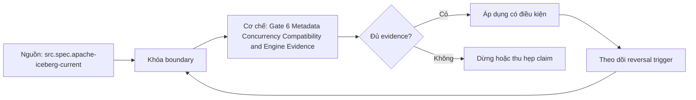

# Gate 6 Metadata Concurrency Compatibility and Engine Evidence

> [!abstract] Câu hỏi trung tâm
> Một bài cổng chứng minh được metadata lineage, atomic concurrency, schema compatibility và engine decision ra sao?

## 1. Evidence pack

Candidate nộp immutable evidence pack: environment/versions, dataset/schema hashes, commands/config, current/base snapshot IDs, metadata paths/hashes, plans/counters, raw compatibility bytes và canonical outputs. Screenshots không thay machine-readable artifacts. Mỗi answer claim trỏ artifact/run ID. Files hoặc logs thiếu lineage không được dùng để suy. Gate chấm năng lực giải thích và tái hiện, không chấm độ dài.

## 2. Columnar attribution

Phần A tách projection pushdown, row-group/file pruning, page skipping và encoding/compression/vectorized execution. Mỗi mechanism có controlled comparison, correctness hash và metric riêng. Latency alone không phân biệt cache/CPU/I/O. Candidate nêu metric unavailable là unknown. Writer geometry/recommendation có workload threshold và reversal condition.

## 3. Distributed diagnosis

Phần B phân queue delay khỏi execution, skew khỏi uniform saturation, spill khỏi source/network throttling. Timeline đồng bộ stage/task/worker and scheduler metrics. Diagnosis nêu causal chain và counterfactual intervention; symptom list không đạt. Không cần production outage thật; controlled trace/fixture đủ nếu provenance rõ.

## 4. Metadata và concurrent write

Phần C trace catalog pointer→metadata JSON→snapshot→manifest list→manifest→data/delete file và one row visibility. Phần D chạy concurrent operations, capture base/candidate/current, exact conflict validation, retry path và final-state reconciliation. Xóa file bằng tay phá format invariants nên điểm zero. Atomic visibility chỉ table boundary; candidate phải nêu retained-snapshot/orphan implications.

## 5. Compatibility và engine ADR

Phần E dùng writer-reader 4-cell matrix plus multi-version history, structural and semantic oracles; Avro defaults/aliases hoặc Protobuf tags được giải thích đúng format. Phần F chọn engine từ workload contract, hard constraints, measured evidence, cost boundary và reversals. Feature list/vendor claim không thay benchmark. Every recommendation has uncertainty and unsupported alternatives.

## 6. Rubric và remediation

Threshold tổng 70/100 nhưng C,D floor 60% bảo vệ core correctness. Evidence missing, fabricated lab claim hoặc canonical mismatch là critical failure. Reviewer independently replays sample hashes/metadata path and one compatibility cell. Remediation maps failed competency to specific lab, not generic reread. Gate version pins specs/tool versions; owner approval remains separate from test pass.

## 7. Ma trận kiểm chứng từng mệnh đề

Mỗi claim phải chỉ rõ metadata scope, writer/reader version, exact fixture, counterexample và oracle. File parse được, plan có predicate hoặc metadata tồn tại chưa đủ để kết luận physical I/O hay semantic result đúng.

### 7.1. Gate-6 probe 1: claim, artifact locator, independent oracle, critical failure và remediation phải kiểm được

**Mệnh đề cần kiểm.** Gate-6 probe 1: claim, artifact locator, independent oracle, critical failure và remediation phải kiểm được.

**Thiết kế phép thử cho `wiki.storage.gate6-metadata-concurrency-compatibility-engine-evidence`.** Khóa schema, dataset hash, writer/reader/engine versions, storage backend, cache state và configuration. Tạo positive fixture, boundary fixture và negative/counterexample; thay đổi đúng một biến. Lưu footer hoặc metadata-tree locator, query plan, scan counters, requested/transferred bytes nếu có, typed result hash, logs và run ID. Khi công cụ không quan sát được một tầng, ghi `unknown` thay vì suy từ latency hoặc output count.

**Điều kiện chấp nhận cho `wiki.storage.gate6-metadata-concurrency-compatibility-engine-evidence`.** Canonical result phải khớp trước khi so hiệu năng. Observation phải lặp lại trên số run đã định, chỉ ra đơn vị bị loại và cơ chế chịu trách nhiệm. Báo riêng source fact, phần tổng hợp của giáo trình và giả định theo implementation. Chưa chạy lab thì mục này là protocol, chưa phải kết quả thực nghiệm.

### 7.2. Gate-6 probe 2: claim, artifact locator, independent oracle, critical failure và remediation phải kiểm được

**Mệnh đề cần kiểm.** Gate-6 probe 2: claim, artifact locator, independent oracle, critical failure và remediation phải kiểm được.

**Thiết kế phép thử cho `wiki.storage.gate6-metadata-concurrency-compatibility-engine-evidence`.** Khóa schema, dataset hash, writer/reader/engine versions, storage backend, cache state và configuration. Tạo positive fixture, boundary fixture và negative/counterexample; thay đổi đúng một biến. Lưu footer hoặc metadata-tree locator, query plan, scan counters, requested/transferred bytes nếu có, typed result hash, logs và run ID. Khi công cụ không quan sát được một tầng, ghi `unknown` thay vì suy từ latency hoặc output count.

**Điều kiện chấp nhận cho `wiki.storage.gate6-metadata-concurrency-compatibility-engine-evidence`.** Canonical result phải khớp trước khi so hiệu năng. Observation phải lặp lại trên số run đã định, chỉ ra đơn vị bị loại và cơ chế chịu trách nhiệm. Báo riêng source fact, phần tổng hợp của giáo trình và giả định theo implementation. Chưa chạy lab thì mục này là protocol, chưa phải kết quả thực nghiệm.

### 7.3. Gate-6 probe 3: claim, artifact locator, independent oracle, critical failure và remediation phải kiểm được

**Mệnh đề cần kiểm.** Gate-6 probe 3: claim, artifact locator, independent oracle, critical failure và remediation phải kiểm được.

**Thiết kế phép thử cho `wiki.storage.gate6-metadata-concurrency-compatibility-engine-evidence`.** Khóa schema, dataset hash, writer/reader/engine versions, storage backend, cache state và configuration. Tạo positive fixture, boundary fixture và negative/counterexample; thay đổi đúng một biến. Lưu footer hoặc metadata-tree locator, query plan, scan counters, requested/transferred bytes nếu có, typed result hash, logs và run ID. Khi công cụ không quan sát được một tầng, ghi `unknown` thay vì suy từ latency hoặc output count.

**Điều kiện chấp nhận cho `wiki.storage.gate6-metadata-concurrency-compatibility-engine-evidence`.** Canonical result phải khớp trước khi so hiệu năng. Observation phải lặp lại trên số run đã định, chỉ ra đơn vị bị loại và cơ chế chịu trách nhiệm. Báo riêng source fact, phần tổng hợp của giáo trình và giả định theo implementation. Chưa chạy lab thì mục này là protocol, chưa phải kết quả thực nghiệm.

### 7.4. Gate-6 probe 4: claim, artifact locator, independent oracle, critical failure và remediation phải kiểm được

**Mệnh đề cần kiểm.** Gate-6 probe 4: claim, artifact locator, independent oracle, critical failure và remediation phải kiểm được.

**Thiết kế phép thử cho `wiki.storage.gate6-metadata-concurrency-compatibility-engine-evidence`.** Khóa schema, dataset hash, writer/reader/engine versions, storage backend, cache state và configuration. Tạo positive fixture, boundary fixture và negative/counterexample; thay đổi đúng một biến. Lưu footer hoặc metadata-tree locator, query plan, scan counters, requested/transferred bytes nếu có, typed result hash, logs và run ID. Khi công cụ không quan sát được một tầng, ghi `unknown` thay vì suy từ latency hoặc output count.

**Điều kiện chấp nhận cho `wiki.storage.gate6-metadata-concurrency-compatibility-engine-evidence`.** Canonical result phải khớp trước khi so hiệu năng. Observation phải lặp lại trên số run đã định, chỉ ra đơn vị bị loại và cơ chế chịu trách nhiệm. Báo riêng source fact, phần tổng hợp của giáo trình và giả định theo implementation. Chưa chạy lab thì mục này là protocol, chưa phải kết quả thực nghiệm.

### 7.5. Gate-6 probe 5: claim, artifact locator, independent oracle, critical failure và remediation phải kiểm được

**Mệnh đề cần kiểm.** Gate-6 probe 5: claim, artifact locator, independent oracle, critical failure và remediation phải kiểm được.

**Thiết kế phép thử cho `wiki.storage.gate6-metadata-concurrency-compatibility-engine-evidence`.** Khóa schema, dataset hash, writer/reader/engine versions, storage backend, cache state và configuration. Tạo positive fixture, boundary fixture và negative/counterexample; thay đổi đúng một biến. Lưu footer hoặc metadata-tree locator, query plan, scan counters, requested/transferred bytes nếu có, typed result hash, logs và run ID. Khi công cụ không quan sát được một tầng, ghi `unknown` thay vì suy từ latency hoặc output count.

**Điều kiện chấp nhận cho `wiki.storage.gate6-metadata-concurrency-compatibility-engine-evidence`.** Canonical result phải khớp trước khi so hiệu năng. Observation phải lặp lại trên số run đã định, chỉ ra đơn vị bị loại và cơ chế chịu trách nhiệm. Báo riêng source fact, phần tổng hợp của giáo trình và giả định theo implementation. Chưa chạy lab thì mục này là protocol, chưa phải kết quả thực nghiệm.

### 7.6. Gate-6 probe 6: claim, artifact locator, independent oracle, critical failure và remediation phải kiểm được

**Mệnh đề cần kiểm.** Gate-6 probe 6: claim, artifact locator, independent oracle, critical failure và remediation phải kiểm được.

**Thiết kế phép thử cho `wiki.storage.gate6-metadata-concurrency-compatibility-engine-evidence`.** Khóa schema, dataset hash, writer/reader/engine versions, storage backend, cache state và configuration. Tạo positive fixture, boundary fixture và negative/counterexample; thay đổi đúng một biến. Lưu footer hoặc metadata-tree locator, query plan, scan counters, requested/transferred bytes nếu có, typed result hash, logs và run ID. Khi công cụ không quan sát được một tầng, ghi `unknown` thay vì suy từ latency hoặc output count.

**Điều kiện chấp nhận cho `wiki.storage.gate6-metadata-concurrency-compatibility-engine-evidence`.** Canonical result phải khớp trước khi so hiệu năng. Observation phải lặp lại trên số run đã định, chỉ ra đơn vị bị loại và cơ chế chịu trách nhiệm. Báo riêng source fact, phần tổng hợp của giáo trình và giả định theo implementation. Chưa chạy lab thì mục này là protocol, chưa phải kết quả thực nghiệm.

### 7.7. Gate-6 probe 7: claim, artifact locator, independent oracle, critical failure và remediation phải kiểm được

**Mệnh đề cần kiểm.** Gate-6 probe 7: claim, artifact locator, independent oracle, critical failure và remediation phải kiểm được.

**Thiết kế phép thử cho `wiki.storage.gate6-metadata-concurrency-compatibility-engine-evidence`.** Khóa schema, dataset hash, writer/reader/engine versions, storage backend, cache state và configuration. Tạo positive fixture, boundary fixture và negative/counterexample; thay đổi đúng một biến. Lưu footer hoặc metadata-tree locator, query plan, scan counters, requested/transferred bytes nếu có, typed result hash, logs và run ID. Khi công cụ không quan sát được một tầng, ghi `unknown` thay vì suy từ latency hoặc output count.

**Điều kiện chấp nhận cho `wiki.storage.gate6-metadata-concurrency-compatibility-engine-evidence`.** Canonical result phải khớp trước khi so hiệu năng. Observation phải lặp lại trên số run đã định, chỉ ra đơn vị bị loại và cơ chế chịu trách nhiệm. Báo riêng source fact, phần tổng hợp của giáo trình và giả định theo implementation. Chưa chạy lab thì mục này là protocol, chưa phải kết quả thực nghiệm.

### 7.8. Gate-6 probe 8: claim, artifact locator, independent oracle, critical failure và remediation phải kiểm được

**Mệnh đề cần kiểm.** Gate-6 probe 8: claim, artifact locator, independent oracle, critical failure và remediation phải kiểm được.

**Thiết kế phép thử cho `wiki.storage.gate6-metadata-concurrency-compatibility-engine-evidence`.** Khóa schema, dataset hash, writer/reader/engine versions, storage backend, cache state và configuration. Tạo positive fixture, boundary fixture và negative/counterexample; thay đổi đúng một biến. Lưu footer hoặc metadata-tree locator, query plan, scan counters, requested/transferred bytes nếu có, typed result hash, logs và run ID. Khi công cụ không quan sát được một tầng, ghi `unknown` thay vì suy từ latency hoặc output count.

**Điều kiện chấp nhận cho `wiki.storage.gate6-metadata-concurrency-compatibility-engine-evidence`.** Canonical result phải khớp trước khi so hiệu năng. Observation phải lặp lại trên số run đã định, chỉ ra đơn vị bị loại và cơ chế chịu trách nhiệm. Báo riêng source fact, phần tổng hợp của giáo trình và giả định theo implementation. Chưa chạy lab thì mục này là protocol, chưa phải kết quả thực nghiệm.

### 7.9. Gate-6 probe 9: claim, artifact locator, independent oracle, critical failure và remediation phải kiểm được

**Mệnh đề cần kiểm.** Gate-6 probe 9: claim, artifact locator, independent oracle, critical failure và remediation phải kiểm được.

**Thiết kế phép thử cho `wiki.storage.gate6-metadata-concurrency-compatibility-engine-evidence`.** Khóa schema, dataset hash, writer/reader/engine versions, storage backend, cache state và configuration. Tạo positive fixture, boundary fixture và negative/counterexample; thay đổi đúng một biến. Lưu footer hoặc metadata-tree locator, query plan, scan counters, requested/transferred bytes nếu có, typed result hash, logs và run ID. Khi công cụ không quan sát được một tầng, ghi `unknown` thay vì suy từ latency hoặc output count.

**Điều kiện chấp nhận cho `wiki.storage.gate6-metadata-concurrency-compatibility-engine-evidence`.** Canonical result phải khớp trước khi so hiệu năng. Observation phải lặp lại trên số run đã định, chỉ ra đơn vị bị loại và cơ chế chịu trách nhiệm. Báo riêng source fact, phần tổng hợp của giáo trình và giả định theo implementation. Chưa chạy lab thì mục này là protocol, chưa phải kết quả thực nghiệm.

### 7.10. Gate-6 probe 10: claim, artifact locator, independent oracle, critical failure và remediation phải kiểm được

**Mệnh đề cần kiểm.** Gate-6 probe 10: claim, artifact locator, independent oracle, critical failure và remediation phải kiểm được.

**Thiết kế phép thử cho `wiki.storage.gate6-metadata-concurrency-compatibility-engine-evidence`.** Khóa schema, dataset hash, writer/reader/engine versions, storage backend, cache state và configuration. Tạo positive fixture, boundary fixture và negative/counterexample; thay đổi đúng một biến. Lưu footer hoặc metadata-tree locator, query plan, scan counters, requested/transferred bytes nếu có, typed result hash, logs và run ID. Khi công cụ không quan sát được một tầng, ghi `unknown` thay vì suy từ latency hoặc output count.

**Điều kiện chấp nhận cho `wiki.storage.gate6-metadata-concurrency-compatibility-engine-evidence`.** Canonical result phải khớp trước khi so hiệu năng. Observation phải lặp lại trên số run đã định, chỉ ra đơn vị bị loại và cơ chế chịu trách nhiệm. Báo riêng source fact, phần tổng hợp của giáo trình và giả định theo implementation. Chưa chạy lab thì mục này là protocol, chưa phải kết quả thực nghiệm.

### 7.11. Gate-6 probe 11: claim, artifact locator, independent oracle, critical failure và remediation phải kiểm được

**Mệnh đề cần kiểm.** Gate-6 probe 11: claim, artifact locator, independent oracle, critical failure và remediation phải kiểm được.

**Thiết kế phép thử cho `wiki.storage.gate6-metadata-concurrency-compatibility-engine-evidence`.** Khóa schema, dataset hash, writer/reader/engine versions, storage backend, cache state và configuration. Tạo positive fixture, boundary fixture và negative/counterexample; thay đổi đúng một biến. Lưu footer hoặc metadata-tree locator, query plan, scan counters, requested/transferred bytes nếu có, typed result hash, logs và run ID. Khi công cụ không quan sát được một tầng, ghi `unknown` thay vì suy từ latency hoặc output count.

**Điều kiện chấp nhận cho `wiki.storage.gate6-metadata-concurrency-compatibility-engine-evidence`.** Canonical result phải khớp trước khi so hiệu năng. Observation phải lặp lại trên số run đã định, chỉ ra đơn vị bị loại và cơ chế chịu trách nhiệm. Báo riêng source fact, phần tổng hợp của giáo trình và giả định theo implementation. Chưa chạy lab thì mục này là protocol, chưa phải kết quả thực nghiệm.

### 7.12. Gate-6 probe 12: claim, artifact locator, independent oracle, critical failure và remediation phải kiểm được

**Mệnh đề cần kiểm.** Gate-6 probe 12: claim, artifact locator, independent oracle, critical failure và remediation phải kiểm được.

**Thiết kế phép thử cho `wiki.storage.gate6-metadata-concurrency-compatibility-engine-evidence`.** Khóa schema, dataset hash, writer/reader/engine versions, storage backend, cache state và configuration. Tạo positive fixture, boundary fixture và negative/counterexample; thay đổi đúng một biến. Lưu footer hoặc metadata-tree locator, query plan, scan counters, requested/transferred bytes nếu có, typed result hash, logs và run ID. Khi công cụ không quan sát được một tầng, ghi `unknown` thay vì suy từ latency hoặc output count.

**Điều kiện chấp nhận cho `wiki.storage.gate6-metadata-concurrency-compatibility-engine-evidence`.** Canonical result phải khớp trước khi so hiệu năng. Observation phải lặp lại trên số run đã định, chỉ ra đơn vị bị loại và cơ chế chịu trách nhiệm. Báo riêng source fact, phần tổng hợp của giáo trình và giả định theo implementation. Chưa chạy lab thì mục này là protocol, chưa phải kết quả thực nghiệm.

### 7.13. Gate-6 probe 13: claim, artifact locator, independent oracle, critical failure và remediation phải kiểm được

**Mệnh đề cần kiểm.** Gate-6 probe 13: claim, artifact locator, independent oracle, critical failure và remediation phải kiểm được.

**Thiết kế phép thử cho `wiki.storage.gate6-metadata-concurrency-compatibility-engine-evidence`.** Khóa schema, dataset hash, writer/reader/engine versions, storage backend, cache state và configuration. Tạo positive fixture, boundary fixture và negative/counterexample; thay đổi đúng một biến. Lưu footer hoặc metadata-tree locator, query plan, scan counters, requested/transferred bytes nếu có, typed result hash, logs và run ID. Khi công cụ không quan sát được một tầng, ghi `unknown` thay vì suy từ latency hoặc output count.

**Điều kiện chấp nhận cho `wiki.storage.gate6-metadata-concurrency-compatibility-engine-evidence`.** Canonical result phải khớp trước khi so hiệu năng. Observation phải lặp lại trên số run đã định, chỉ ra đơn vị bị loại và cơ chế chịu trách nhiệm. Báo riêng source fact, phần tổng hợp của giáo trình và giả định theo implementation. Chưa chạy lab thì mục này là protocol, chưa phải kết quả thực nghiệm.

### 7.14. Gate-6 probe 14: claim, artifact locator, independent oracle, critical failure và remediation phải kiểm được

**Mệnh đề cần kiểm.** Gate-6 probe 14: claim, artifact locator, independent oracle, critical failure và remediation phải kiểm được.

**Thiết kế phép thử cho `wiki.storage.gate6-metadata-concurrency-compatibility-engine-evidence`.** Khóa schema, dataset hash, writer/reader/engine versions, storage backend, cache state và configuration. Tạo positive fixture, boundary fixture và negative/counterexample; thay đổi đúng một biến. Lưu footer hoặc metadata-tree locator, query plan, scan counters, requested/transferred bytes nếu có, typed result hash, logs và run ID. Khi công cụ không quan sát được một tầng, ghi `unknown` thay vì suy từ latency hoặc output count.

**Điều kiện chấp nhận cho `wiki.storage.gate6-metadata-concurrency-compatibility-engine-evidence`.** Canonical result phải khớp trước khi so hiệu năng. Observation phải lặp lại trên số run đã định, chỉ ra đơn vị bị loại và cơ chế chịu trách nhiệm. Báo riêng source fact, phần tổng hợp của giáo trình và giả định theo implementation. Chưa chạy lab thì mục này là protocol, chưa phải kết quả thực nghiệm.

### 7.15. Gate-6 probe 15: claim, artifact locator, independent oracle, critical failure và remediation phải kiểm được

**Mệnh đề cần kiểm.** Gate-6 probe 15: claim, artifact locator, independent oracle, critical failure và remediation phải kiểm được.

**Thiết kế phép thử cho `wiki.storage.gate6-metadata-concurrency-compatibility-engine-evidence`.** Khóa schema, dataset hash, writer/reader/engine versions, storage backend, cache state và configuration. Tạo positive fixture, boundary fixture và negative/counterexample; thay đổi đúng một biến. Lưu footer hoặc metadata-tree locator, query plan, scan counters, requested/transferred bytes nếu có, typed result hash, logs và run ID. Khi công cụ không quan sát được một tầng, ghi `unknown` thay vì suy từ latency hoặc output count.

**Điều kiện chấp nhận cho `wiki.storage.gate6-metadata-concurrency-compatibility-engine-evidence`.** Canonical result phải khớp trước khi so hiệu năng. Observation phải lặp lại trên số run đã định, chỉ ra đơn vị bị loại và cơ chế chịu trách nhiệm. Báo riêng source fact, phần tổng hợp của giáo trình và giả định theo implementation. Chưa chạy lab thì mục này là protocol, chưa phải kết quả thực nghiệm.

## 8. Quy trình phản biện

1. Xác định tầng đang nói: object store, file, table metadata, catalog hay engine.
2. Viết identity và publication boundary trước khi bàn hiệu năng.
3. Tách metadata presence, planner intent, executed pruning và physical I/O.
4. Kiểm semantic result bằng typed oracle trước benchmark.
5. Pin version, configuration, cache state và metric definition.
6. Ghi counterexample, limitation và reversal condition cho recommendation.

## 9. Câu hỏi tự kiểm tra

1. Đơn vị đang xét là file, row group, column chunk, page, manifest hay snapshot?
2. Metadata nào authoritative và lấy từ locator nào?
3. Reader có dùng metadata hay chỉ có khả năng dùng?
4. Parse/decode thành công có che semantic mismatch không?
5. Failure ở trước hay sau publication boundary?
6. Bằng chứng nào còn là protocol chưa chạy?

## 10. Giới hạn và điều chưa cho phép kết luận

- Chưa chạy Parquet footer/page-index lab hoặc Iceberg metadata trace trên engine/catalog thật.
- Đặc tả được kiểm ngày 2026-10-02; implementation behavior phải pin version.
- Matrices và lab protocols là synthesis của giáo trình, không gán nguyên văn cho một nguồn.
- Note giữ trạng thái `review` tới khi chủ dự án duyệt.

## Reference
1. [[SRC-APACHE-ICEBERG-SPEC]]
2. [[SRC-APACHE-ICEBERG-RELIABILITY]]
3. [[SRC-APACHE-ICEBERG-MAINTENANCE]]
4. [[SRC-APACHE-AVRO-1-12-SPEC]]
5. [[SRC-PROTOBUF-PROTO3-GUIDE]]
6. [[SRC-CONFLUENT-SCHEMA-EVOLUTION]]

## Source coverage

| Source slice | Nội dung sử dụng | Trạng thái |
|---|---|---|
| [[SRC-APACHE-ICEBERG-SPEC]] | Format/table contract, implementation boundary hoặc workload context | Đã đọc locator; không suy ngoài phạm vi |
| [[SRC-APACHE-ICEBERG-RELIABILITY]] | Format/table contract, implementation boundary hoặc workload context | Đã đọc locator; không suy ngoài phạm vi |
| [[SRC-APACHE-ICEBERG-MAINTENANCE]] | Format/table contract, implementation boundary hoặc workload context | Đã đọc locator; không suy ngoài phạm vi |
| [[SRC-APACHE-AVRO-1-12-SPEC]] | Format/table contract, implementation boundary hoặc workload context | Đã đọc locator; không suy ngoài phạm vi |
| [[SRC-PROTOBUF-PROTO3-GUIDE]] | Format/table contract, implementation boundary hoặc workload context | Đã đọc locator; không suy ngoài phạm vi |
| [[SRC-CONFLUENT-SCHEMA-EVOLUTION]] | Format/table contract, implementation boundary hoặc workload context | Đã đọc locator; không suy ngoài phạm vi |

## Key takeaways
- Mọi claim phải đúng tầng và đúng granularity.
- Metadata hiện diện, planner intent, executed pruning và physical I/O là bốn bằng chứng khác nhau.
- Semantic oracle được kiểm trước performance attribution.
- Chưa chạy lab thì note cung cấp giáo trình và protocol, chưa phải certification cho production.

<!-- ATOMIC-EXECUTION-CAPSULE:START -->

## Execution capsule — kiểm chứng `wiki.storage.gate6-metadata-concurrency-compatibility-engine-evidence`

> [!important] Phân loại mệnh đề
> Với `wiki.storage.gate6-metadata-concurrency-compatibility-engine-evidence`, sơ đồ, ví dụ và artifact về **Gate 6 Metadata Concurrency Compatibility and Engine Evidence** là **synthesis để kiểm chứng**; chúng không phải trích dẫn hay case nguyên văn của nguồn.

### Sơ đồ cơ chế và điểm kiểm soát



Đọc sơ đồ `wiki.storage.gate6-metadata-concurrency-compatibility-engine-evidence` từ trái sang phải: source chỉ cung cấp claim ban đầu cho **Gate 6 Metadata Concurrency Compatibility and Engine Evidence**; quyết định chỉ được đi tiếp sau khi boundary, evidence và điều kiện đảo quyết định đã hiện hữu.

### Ví dụ làm việc có thể bác bỏ

**Input.** Một đội cần trả lời: “Một bài cổng chứng minh được metadata lineage, atomic concurrency, schema compatibility và engine decision ra sao?” cho một phạm vi nhỏ, có owner và deadline rõ.

**Decision.** Đội áp dụng **Gate 6 Metadata Concurrency Compatibility and Engine Evidence** trên control và variant chỉ khác một assumption; expected result và hard constraints được khóa trước khi chạy.

**Outcome.** Với `wiki.storage.gate6-metadata-concurrency-compatibility-engine-evidence`, nếu observation vi phạm hard constraint hoặc oracle độc lập không xác nhận **Gate 6 Metadata Concurrency Compatibility and Engine Evidence**, đội thu hẹp claim hay đảo quyết định. Nếu đạt, kết luận vẫn kèm scope, version và review date; một lần thành công không được nâng thành quy luật phổ quát.

### Artifact thực thi tối thiểu

```sql
-- Verification harness for: Gate 6 Metadata Concurrency Compatibility and Engine Evidence
WITH evidence AS (
    SELECT 'wiki.storage.gate6-metadata-concurrency-compatibility-engine-evidence' AS concept_id,
           'boundary_declared' AS check_name, 1 AS passed
    UNION ALL
    SELECT 'wiki.storage.gate6-metadata-concurrency-compatibility-engine-evidence', 'independent_oracle', 1
    UNION ALL
    SELECT 'wiki.storage.gate6-metadata-concurrency-compatibility-engine-evidence', 'reversal_trigger_recorded', 1
)
SELECT concept_id,
       MIN(passed) AS all_hard_checks_pass,
       COUNT(*) AS evidence_items
FROM evidence
GROUP BY concept_id
HAVING MIN(passed) = 1;
```

Artifact của `wiki.storage.gate6-metadata-concurrency-compatibility-engine-evidence` buộc người dùng ghi boundary, oracle và reversal trigger cho **Gate 6 Metadata Concurrency Compatibility and Engine Evidence**. Các giá trị minh họa phải được thay bằng evidence thật trước khi dùng cho quyết định.

### Tự kiểm tra trước khi tái sử dụng

1. Bạn có thể trả lời `Một bài cổng chứng minh được metadata lineage, atomic concurrency, schema compatibility và engine decision ra sao?` bằng một câu mà không kéo thêm concept thứ hai không?
2. Source locator nào đỡ cho claim, và phần nào chỉ là synthesis trong note?
3. Observation nào khiến bạn dừng, thu hẹp hoặc đảo quyết định?
4. Artifact nào cho phép một reviewer độc lập tái hiện kết quả?

<!-- ATOMIC-EXECUTION-CAPSULE:END -->
