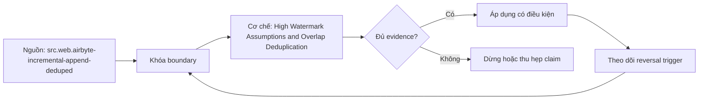

# High Watermark Assumptions and Overlap Deduplication

> [!abstract] Câu hỏi trung tâm
> Một high-watermark extractor cần năm giả định nào và kiểm chúng bằng failure injection ra sao?

## 1. Năm giả định

Một: cursor orders every relevant row/change in extraction scope. Hai: every relevant mutation advances cursor. Ba: boundary ties have deterministic unique tie-breaker or inclusive replay. Bốn: deletions are visible elsewhere or explicitly out of scope. Năm: bootstrap, target publication and checkpoint advance form recoverable protocol. Timezone, precision and source retention qualify assumptions one-three.

## 2. Composite cursor

Use lexicographic `(cursor, stable_key)` when possible. Predicate requests greater than last tuple, ordered by same tuple. If cursor alone coarse/nonunique, `>` loses tied rows; `>=` replays boundary and demands idempotent dedup. Mutable key/cursor can move backward and evade query. Store typed values, source timezone and schema version, not formatted string only.

## 3. Overlap window

Query from checkpoint minus lookback to cover measured late visibility/clock skew, then dedup/upsert by key and source version. Window derives from observed latency distribution plus safety margin and incident/backfill policy. Larger window increases load and cannot fix unbounded late changes, hard deletes or mutation with unchanged cursor. Track oldest observed lateness and reconciliation misses to revise.

## 4. Checkpoint ordering

Extract page/chunk, validate/land durably, publish/reconcile according to contract, then atomically advance checkpoint. Advancing before durable publication creates silent gap on crash. Saving checkpoint too late replays data; idempotency should absorb. Checkpoint includes cursor/tie, source boundary, schema/config version and run ID. Empty target bootstrap is explicit state, not max(NULL) accident.

## 5. Five failure fixtures

Inject clock/cursor decrease, update without cursor change, many rows with identical boundary, hard delete and first run empty target. Also kill process before/after landing and checkpoint. For each run compare count, key set, per-field hash and delete state against source at fixed boundary. A passing row count can hide missing+duplicate cancellation; key/hash oracles required.

## 6. Operational limits

Monitor watermark lag, overlap rows, dedup rate, late-beyond-window count, source query duration and reconciliation residual. Pause when checkpoint falls outside CDC/source retention. Document maximum supported lateness and delete gap. If probes falsify assumptions, migrate to CDC, periodic snapshot diff or source-side audit rather than enlarging window indefinitely.

## 7. Ma trận kiểm chứng từng mệnh đề

Mỗi claim phải gắn source/entity boundary, exact fixture, checkpoint/input state, counterexample và independent reconciliation oracle. Connector chạy thành công hoặc API trả 2xx chưa chứng minh completeness.

### 7.1. Watermark probe 1: assumption, injected violation, checkpoint state, dedup identity và reconciliation evidence phải đủ

**Mệnh đề cần kiểm.** Watermark probe 1: assumption, injected violation, checkpoint state, dedup identity và reconciliation evidence phải đủ.

**Thiết kế phép thử cho `wiki.ingestion.high-watermark-assumptions-overlap-deduplication`.** Khóa source/API version, entity, grain/key, time boundary, schema, pagination/cursor configuration và failure schedule. Tạo positive, boundary và negative fixtures; thay đổi đúng một assumption. Lưu request/query, response/raw extract hash, checkpoint trước/sau, landing objects, target state và source-at-boundary oracle.

**Điều kiện chấp nhận cho `wiki.ingestion.high-watermark-assumptions-overlap-deduplication`.** Count, key set, typed field hash và delete state khớp contract; duplicates được giải thích và dedup có identity rõ. Observation, inference và unknown được báo riêng. Lab chưa chạy chỉ là protocol.

### 7.2. Watermark probe 2: assumption, injected violation, checkpoint state, dedup identity và reconciliation evidence phải đủ

**Mệnh đề cần kiểm.** Watermark probe 2: assumption, injected violation, checkpoint state, dedup identity và reconciliation evidence phải đủ.

**Thiết kế phép thử cho `wiki.ingestion.high-watermark-assumptions-overlap-deduplication`.** Khóa source/API version, entity, grain/key, time boundary, schema, pagination/cursor configuration và failure schedule. Tạo positive, boundary và negative fixtures; thay đổi đúng một assumption. Lưu request/query, response/raw extract hash, checkpoint trước/sau, landing objects, target state và source-at-boundary oracle.

**Điều kiện chấp nhận cho `wiki.ingestion.high-watermark-assumptions-overlap-deduplication`.** Count, key set, typed field hash và delete state khớp contract; duplicates được giải thích và dedup có identity rõ. Observation, inference và unknown được báo riêng. Lab chưa chạy chỉ là protocol.

### 7.3. Watermark probe 3: assumption, injected violation, checkpoint state, dedup identity và reconciliation evidence phải đủ

**Mệnh đề cần kiểm.** Watermark probe 3: assumption, injected violation, checkpoint state, dedup identity và reconciliation evidence phải đủ.

**Thiết kế phép thử cho `wiki.ingestion.high-watermark-assumptions-overlap-deduplication`.** Khóa source/API version, entity, grain/key, time boundary, schema, pagination/cursor configuration và failure schedule. Tạo positive, boundary và negative fixtures; thay đổi đúng một assumption. Lưu request/query, response/raw extract hash, checkpoint trước/sau, landing objects, target state và source-at-boundary oracle.

**Điều kiện chấp nhận cho `wiki.ingestion.high-watermark-assumptions-overlap-deduplication`.** Count, key set, typed field hash và delete state khớp contract; duplicates được giải thích và dedup có identity rõ. Observation, inference và unknown được báo riêng. Lab chưa chạy chỉ là protocol.

### 7.4. Watermark probe 4: assumption, injected violation, checkpoint state, dedup identity và reconciliation evidence phải đủ

**Mệnh đề cần kiểm.** Watermark probe 4: assumption, injected violation, checkpoint state, dedup identity và reconciliation evidence phải đủ.

**Thiết kế phép thử cho `wiki.ingestion.high-watermark-assumptions-overlap-deduplication`.** Khóa source/API version, entity, grain/key, time boundary, schema, pagination/cursor configuration và failure schedule. Tạo positive, boundary và negative fixtures; thay đổi đúng một assumption. Lưu request/query, response/raw extract hash, checkpoint trước/sau, landing objects, target state và source-at-boundary oracle.

**Điều kiện chấp nhận cho `wiki.ingestion.high-watermark-assumptions-overlap-deduplication`.** Count, key set, typed field hash và delete state khớp contract; duplicates được giải thích và dedup có identity rõ. Observation, inference và unknown được báo riêng. Lab chưa chạy chỉ là protocol.

### 7.5. Watermark probe 5: assumption, injected violation, checkpoint state, dedup identity và reconciliation evidence phải đủ

**Mệnh đề cần kiểm.** Watermark probe 5: assumption, injected violation, checkpoint state, dedup identity và reconciliation evidence phải đủ.

**Thiết kế phép thử cho `wiki.ingestion.high-watermark-assumptions-overlap-deduplication`.** Khóa source/API version, entity, grain/key, time boundary, schema, pagination/cursor configuration và failure schedule. Tạo positive, boundary và negative fixtures; thay đổi đúng một assumption. Lưu request/query, response/raw extract hash, checkpoint trước/sau, landing objects, target state và source-at-boundary oracle.

**Điều kiện chấp nhận cho `wiki.ingestion.high-watermark-assumptions-overlap-deduplication`.** Count, key set, typed field hash và delete state khớp contract; duplicates được giải thích và dedup có identity rõ. Observation, inference và unknown được báo riêng. Lab chưa chạy chỉ là protocol.

### 7.6. Watermark probe 6: assumption, injected violation, checkpoint state, dedup identity và reconciliation evidence phải đủ

**Mệnh đề cần kiểm.** Watermark probe 6: assumption, injected violation, checkpoint state, dedup identity và reconciliation evidence phải đủ.

**Thiết kế phép thử cho `wiki.ingestion.high-watermark-assumptions-overlap-deduplication`.** Khóa source/API version, entity, grain/key, time boundary, schema, pagination/cursor configuration và failure schedule. Tạo positive, boundary và negative fixtures; thay đổi đúng một assumption. Lưu request/query, response/raw extract hash, checkpoint trước/sau, landing objects, target state và source-at-boundary oracle.

**Điều kiện chấp nhận cho `wiki.ingestion.high-watermark-assumptions-overlap-deduplication`.** Count, key set, typed field hash và delete state khớp contract; duplicates được giải thích và dedup có identity rõ. Observation, inference và unknown được báo riêng. Lab chưa chạy chỉ là protocol.

### 7.7. Watermark probe 7: assumption, injected violation, checkpoint state, dedup identity và reconciliation evidence phải đủ

**Mệnh đề cần kiểm.** Watermark probe 7: assumption, injected violation, checkpoint state, dedup identity và reconciliation evidence phải đủ.

**Thiết kế phép thử cho `wiki.ingestion.high-watermark-assumptions-overlap-deduplication`.** Khóa source/API version, entity, grain/key, time boundary, schema, pagination/cursor configuration và failure schedule. Tạo positive, boundary và negative fixtures; thay đổi đúng một assumption. Lưu request/query, response/raw extract hash, checkpoint trước/sau, landing objects, target state và source-at-boundary oracle.

**Điều kiện chấp nhận cho `wiki.ingestion.high-watermark-assumptions-overlap-deduplication`.** Count, key set, typed field hash và delete state khớp contract; duplicates được giải thích và dedup có identity rõ. Observation, inference và unknown được báo riêng. Lab chưa chạy chỉ là protocol.

### 7.8. Watermark probe 8: assumption, injected violation, checkpoint state, dedup identity và reconciliation evidence phải đủ

**Mệnh đề cần kiểm.** Watermark probe 8: assumption, injected violation, checkpoint state, dedup identity và reconciliation evidence phải đủ.

**Thiết kế phép thử cho `wiki.ingestion.high-watermark-assumptions-overlap-deduplication`.** Khóa source/API version, entity, grain/key, time boundary, schema, pagination/cursor configuration và failure schedule. Tạo positive, boundary và negative fixtures; thay đổi đúng một assumption. Lưu request/query, response/raw extract hash, checkpoint trước/sau, landing objects, target state và source-at-boundary oracle.

**Điều kiện chấp nhận cho `wiki.ingestion.high-watermark-assumptions-overlap-deduplication`.** Count, key set, typed field hash và delete state khớp contract; duplicates được giải thích và dedup có identity rõ. Observation, inference và unknown được báo riêng. Lab chưa chạy chỉ là protocol.

### 7.9. Watermark probe 9: assumption, injected violation, checkpoint state, dedup identity và reconciliation evidence phải đủ

**Mệnh đề cần kiểm.** Watermark probe 9: assumption, injected violation, checkpoint state, dedup identity và reconciliation evidence phải đủ.

**Thiết kế phép thử cho `wiki.ingestion.high-watermark-assumptions-overlap-deduplication`.** Khóa source/API version, entity, grain/key, time boundary, schema, pagination/cursor configuration và failure schedule. Tạo positive, boundary và negative fixtures; thay đổi đúng một assumption. Lưu request/query, response/raw extract hash, checkpoint trước/sau, landing objects, target state và source-at-boundary oracle.

**Điều kiện chấp nhận cho `wiki.ingestion.high-watermark-assumptions-overlap-deduplication`.** Count, key set, typed field hash và delete state khớp contract; duplicates được giải thích và dedup có identity rõ. Observation, inference và unknown được báo riêng. Lab chưa chạy chỉ là protocol.

### 7.10. Watermark probe 10: assumption, injected violation, checkpoint state, dedup identity và reconciliation evidence phải đủ

**Mệnh đề cần kiểm.** Watermark probe 10: assumption, injected violation, checkpoint state, dedup identity và reconciliation evidence phải đủ.

**Thiết kế phép thử cho `wiki.ingestion.high-watermark-assumptions-overlap-deduplication`.** Khóa source/API version, entity, grain/key, time boundary, schema, pagination/cursor configuration và failure schedule. Tạo positive, boundary và negative fixtures; thay đổi đúng một assumption. Lưu request/query, response/raw extract hash, checkpoint trước/sau, landing objects, target state và source-at-boundary oracle.

**Điều kiện chấp nhận cho `wiki.ingestion.high-watermark-assumptions-overlap-deduplication`.** Count, key set, typed field hash và delete state khớp contract; duplicates được giải thích và dedup có identity rõ. Observation, inference và unknown được báo riêng. Lab chưa chạy chỉ là protocol.

### 7.11. Watermark probe 11: assumption, injected violation, checkpoint state, dedup identity và reconciliation evidence phải đủ

**Mệnh đề cần kiểm.** Watermark probe 11: assumption, injected violation, checkpoint state, dedup identity và reconciliation evidence phải đủ.

**Thiết kế phép thử cho `wiki.ingestion.high-watermark-assumptions-overlap-deduplication`.** Khóa source/API version, entity, grain/key, time boundary, schema, pagination/cursor configuration và failure schedule. Tạo positive, boundary và negative fixtures; thay đổi đúng một assumption. Lưu request/query, response/raw extract hash, checkpoint trước/sau, landing objects, target state và source-at-boundary oracle.

**Điều kiện chấp nhận cho `wiki.ingestion.high-watermark-assumptions-overlap-deduplication`.** Count, key set, typed field hash và delete state khớp contract; duplicates được giải thích và dedup có identity rõ. Observation, inference và unknown được báo riêng. Lab chưa chạy chỉ là protocol.

### 7.12. Watermark probe 12: assumption, injected violation, checkpoint state, dedup identity và reconciliation evidence phải đủ

**Mệnh đề cần kiểm.** Watermark probe 12: assumption, injected violation, checkpoint state, dedup identity và reconciliation evidence phải đủ.

**Thiết kế phép thử cho `wiki.ingestion.high-watermark-assumptions-overlap-deduplication`.** Khóa source/API version, entity, grain/key, time boundary, schema, pagination/cursor configuration và failure schedule. Tạo positive, boundary và negative fixtures; thay đổi đúng một assumption. Lưu request/query, response/raw extract hash, checkpoint trước/sau, landing objects, target state và source-at-boundary oracle.

**Điều kiện chấp nhận cho `wiki.ingestion.high-watermark-assumptions-overlap-deduplication`.** Count, key set, typed field hash và delete state khớp contract; duplicates được giải thích và dedup có identity rõ. Observation, inference và unknown được báo riêng. Lab chưa chạy chỉ là protocol.

### 7.13. Watermark probe 13: assumption, injected violation, checkpoint state, dedup identity và reconciliation evidence phải đủ

**Mệnh đề cần kiểm.** Watermark probe 13: assumption, injected violation, checkpoint state, dedup identity và reconciliation evidence phải đủ.

**Thiết kế phép thử cho `wiki.ingestion.high-watermark-assumptions-overlap-deduplication`.** Khóa source/API version, entity, grain/key, time boundary, schema, pagination/cursor configuration và failure schedule. Tạo positive, boundary và negative fixtures; thay đổi đúng một assumption. Lưu request/query, response/raw extract hash, checkpoint trước/sau, landing objects, target state và source-at-boundary oracle.

**Điều kiện chấp nhận cho `wiki.ingestion.high-watermark-assumptions-overlap-deduplication`.** Count, key set, typed field hash và delete state khớp contract; duplicates được giải thích và dedup có identity rõ. Observation, inference và unknown được báo riêng. Lab chưa chạy chỉ là protocol.

### 7.14. Watermark probe 14: assumption, injected violation, checkpoint state, dedup identity và reconciliation evidence phải đủ

**Mệnh đề cần kiểm.** Watermark probe 14: assumption, injected violation, checkpoint state, dedup identity và reconciliation evidence phải đủ.

**Thiết kế phép thử cho `wiki.ingestion.high-watermark-assumptions-overlap-deduplication`.** Khóa source/API version, entity, grain/key, time boundary, schema, pagination/cursor configuration và failure schedule. Tạo positive, boundary và negative fixtures; thay đổi đúng một assumption. Lưu request/query, response/raw extract hash, checkpoint trước/sau, landing objects, target state và source-at-boundary oracle.

**Điều kiện chấp nhận cho `wiki.ingestion.high-watermark-assumptions-overlap-deduplication`.** Count, key set, typed field hash và delete state khớp contract; duplicates được giải thích và dedup có identity rõ. Observation, inference và unknown được báo riêng. Lab chưa chạy chỉ là protocol.

### 7.15. Watermark probe 15: assumption, injected violation, checkpoint state, dedup identity và reconciliation evidence phải đủ

**Mệnh đề cần kiểm.** Watermark probe 15: assumption, injected violation, checkpoint state, dedup identity và reconciliation evidence phải đủ.

**Thiết kế phép thử cho `wiki.ingestion.high-watermark-assumptions-overlap-deduplication`.** Khóa source/API version, entity, grain/key, time boundary, schema, pagination/cursor configuration và failure schedule. Tạo positive, boundary và negative fixtures; thay đổi đúng một assumption. Lưu request/query, response/raw extract hash, checkpoint trước/sau, landing objects, target state và source-at-boundary oracle.

**Điều kiện chấp nhận cho `wiki.ingestion.high-watermark-assumptions-overlap-deduplication`.** Count, key set, typed field hash và delete state khớp contract; duplicates được giải thích và dedup có identity rõ. Observation, inference và unknown được báo riêng. Lab chưa chạy chỉ là protocol.

## 8. Quy trình phản biện

1. Chốt entity, grain, identity và immutable boundary.
2. Tách source fact, documentation claim và observed behavior.
3. Viết delete, retry, checkpoint và replay semantics trước code.
4. Dùng key/typed-hash reconciliation, không chỉ row count.
5. Pin version, retention, timezone, ordering và rate limits.
6. Ghi assumption bị falsify và extraction pattern thay thế.

## 9. Câu hỏi tự kiểm tra

1. Source thay đổi row/entity theo những operation nào?
2. Boundary nào định nghĩa complete?
3. Delete có xuất hiện trong interface không?
4. Cursor/order có total và immutable không?
5. Crash ở checkpoint boundary gây replay hay gap?
6. Bằng chứng nào chưa được chạy?

## 10. Giới hạn và điều chưa cho phép kết luận

- Chưa chạy mutation/pagination/watermark lab trên source thật.
- Product behavior phải pin version, retention và configuration.
- Decision matrices và failure protocols là synthesis của giáo trình.
- Note giữ trạng thái `review` tới khi chủ dự án duyệt.

## Reference
1. [[SRC-AIRBYTE-INCREMENTAL-APPEND-DEDUPED]]
2. [[SRC-MICROSOFT-SQL-SERVER-CDC]]
3. [[SRC-KLEPPMANN-DDIA-1E]]

## Source coverage

| Source slice | Nội dung sử dụng | Trạng thái |
|---|---|---|
| [[SRC-AIRBYTE-INCREMENTAL-APPEND-DEDUPED]] | Source/change/API contract hoặc engineering context | Đã đọc locator; không suy ngoài phạm vi |
| [[SRC-MICROSOFT-SQL-SERVER-CDC]] | Source/change/API contract hoặc engineering context | Đã đọc locator; không suy ngoài phạm vi |
| [[SRC-KLEPPMANN-DDIA-1E]] | Source/change/API contract hoặc engineering context | Đã đọc locator; không suy ngoài phạm vi |

## Key takeaways
- Extraction pattern chỉ đúng khi source assumptions đúng.
- Completeness cần immutable boundary và reconciliation oracle.
- Retry/checkpoint ưu tiên replay có kiểm soát hơn silent gap.
- Connector không chuyển giao ownership về tính đúng.

<!-- ATOMIC-EXECUTION-CAPSULE:START -->

## Execution capsule: kiểm chứng `wiki.ingestion.high-watermark-assumptions-overlap-deduplication`

> [!important] Phân loại mệnh đề
> Với `wiki.ingestion.high-watermark-assumptions-overlap-deduplication`, sơ đồ, ví dụ và artifact về **High Watermark Assumptions and Overlap Deduplication** là **synthesis để kiểm chứng**; chúng không phải trích dẫn hay case nguyên văn của nguồn.

### Sơ đồ cơ chế và điểm kiểm soát



Đọc sơ đồ `wiki.ingestion.high-watermark-assumptions-overlap-deduplication` từ trái sang phải: source chỉ cung cấp claim ban đầu cho **High Watermark Assumptions and Overlap Deduplication**; quyết định chỉ được đi tiếp sau khi boundary, evidence và điều kiện đảo quyết định đã hiện hữu.

### Ví dụ làm việc có thể bác bỏ

**Input.** Một đội cần trả lời: Một high-watermark extractor cần năm giả định nào và kiểm chúng bằng failure injection ra sao? cho một phạm vi nhỏ, có owner và deadline rõ.

**Decision.** Đội áp dụng **High Watermark Assumptions and Overlap Deduplication** trên control và variant chỉ khác một assumption; expected result và hard constraints được khóa trước khi chạy.

**Outcome.** Với `wiki.ingestion.high-watermark-assumptions-overlap-deduplication`, nếu observation vi phạm hard constraint hoặc oracle độc lập không xác nhận **High Watermark Assumptions and Overlap Deduplication**, đội thu hẹp claim hay đảo quyết định. Nếu đạt, kết luận vẫn kèm scope, version và review date; một lần thành công không được nâng thành quy luật phổ quát.

### Artifact thực thi tối thiểu

```sql
-- Verification harness for: High Watermark Assumptions and Overlap Deduplication
WITH evidence AS (
    SELECT 'wiki.ingestion.high-watermark-assumptions-overlap-deduplication' AS concept_id,
           'boundary_declared' AS check_name, 1 AS passed
    UNION ALL
    SELECT 'wiki.ingestion.high-watermark-assumptions-overlap-deduplication', 'independent_oracle', 1
    UNION ALL
    SELECT 'wiki.ingestion.high-watermark-assumptions-overlap-deduplication', 'reversal_trigger_recorded', 1
)
SELECT concept_id,
       MIN(passed) AS all_hard_checks_pass,
       COUNT(*) AS evidence_items
FROM evidence
GROUP BY concept_id
HAVING MIN(passed) = 1;
```

Artifact của `wiki.ingestion.high-watermark-assumptions-overlap-deduplication` buộc người dùng ghi boundary, oracle và reversal trigger cho **High Watermark Assumptions and Overlap Deduplication**. Các giá trị minh họa phải được thay bằng evidence thật trước khi dùng cho quyết định.

### Tự kiểm tra trước khi tái sử dụng

1. Bạn có thể trả lời `Một high-watermark extractor cần năm giả định nào và kiểm chúng bằng failure injection ra sao?` bằng một câu mà không kéo thêm concept thứ hai không?
2. Source locator nào đỡ cho claim, và phần nào chỉ là synthesis trong note?
3. Observation nào khiến bạn dừng, thu hẹp hoặc đảo quyết định?
4. Artifact nào cho phép một reviewer độc lập tái hiện kết quả?

<!-- ATOMIC-EXECUTION-CAPSULE:END -->
