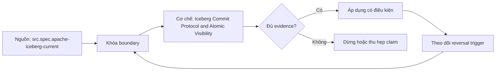

# Iceberg Commit Protocol and Atomic Visibility

> [!abstract] Câu hỏi trung tâm
> Files được ghi trước commit nhưng vì sao reader chỉ thấy một snapshot hoàn chỉnh?

## 1. Ba pha của write

Một write tạo data/delete files và metadata artifacts trước khi table state được công bố. Writer lập candidate snapshot/manifest tree trên base metadata đã load, rồi yêu cầu catalog atomically đổi current metadata location từ base sang candidate. Objects đã upload chưa thuộc table chỉ vì chúng tồn tại. Publication point là successful pointer swap. Tách prepare, validate và commit giúp xác định crash window, retry boundary và orphan candidates.

## 2. Reader snapshot isolation

Reader resolve current metadata location rồi bind query vào snapshot cụ thể. Writer khác có thể commit sau đó nhưng query đang chạy tiếp tục dùng snapshot đã chọn, trừ khi engine chủ động refresh/replan theo contract khác. Vì snapshot liệt kê complete live file set, reader không directory-list để chắp table state. Atomic visibility là old snapshot hoặc new snapshot; nó không bảo đảm multi-table atomicity, external side effects hay business correctness.

## 3. Crash trước và sau commit

Crash trước pointer swap để lại unreferenced files/metadata; table vẫn trỏ base snapshot. Crash sau successful swap nhưng trước client nhận response tạo outcome ambiguity: commit có thể đã thành công dù client thấy timeout. Retry mù có thể duplicate logical batch. Recovery phải query table history/snapshot summary hoặc application commit token, reconcile file/row identity rồi mới quyết định retry. Xóa objects theo job ID mà không reachability check có thể phá commit đã thành công.

## 4. Orphan xác định bằng reachability

Orphan là file không reachable từ retained snapshots/metadata theo format và không thuộc in-flight writer hợp lệ. Tuổi file chỉ là safety guard, không phải proof. Cleanup retention phải lớn hơn maximum write duration, delayed retry, clock uncertainty và operational recovery window. Inventory cần normalize URI schemes/authorities theo tool guidance. Dry run lưu candidate set; trước delete phải refresh metadata và dùng operation/catalog guarantees phù hợp.

## 5. Time travel và rollback

Retained snapshot history cho phép đọc state cũ hoặc rollback current reference, nhưng không hồi sinh files đã bị retention cleanup. Time travel verifies snapshot content; rollback là mutation tạo/đổi current state theo API semantics. Lab phải phân biệt `SELECT AS OF` với rollback, ghi snapshot IDs và key hashes. Snapshot expiration thay đổi recovery envelope; retention là product/operations decision, không chỉ cost setting.

## 6. Failure-injection lab

Khóa engine/catalog/object store versions. Ghi batch có unique business keys; dừng sau data files, sau manifests, trước pointer swap và sau swap trước acknowledgment nếu harness cho phép. Ở mỗi điểm ghi object inventory, current metadata pointer, snapshot history, referenced files và canonical key hash. Reader phải thấy base hoặc committed candidate, không partial set. Xác định orphan candidates bằng manifests; time travel về base và current phải đối soát. Chưa chạy được post-commit ambiguity thì ghi limitation.

## 7. Ma trận kiểm chứng từng mệnh đề

Mỗi claim phải chỉ rõ metadata scope, writer/reader version, exact fixture, counterexample và oracle. File parse được, plan có predicate hoặc metadata tồn tại chưa đủ để kết luận physical I/O hay semantic result đúng.

### 7.1. Commit-boundary probe 1: candidate files, base pointer, atomic swap, reader snapshot và recovery decision phải nối được

**Mệnh đề cần kiểm.** Commit-boundary probe 1: candidate files, base pointer, atomic swap, reader snapshot và recovery decision phải nối được.

**Thiết kế phép thử cho `wiki.storage.iceberg-commit-protocol-atomic-visibility`.** Khóa schema, dataset hash, writer/reader/engine versions, storage backend, cache state và configuration. Tạo positive fixture, boundary fixture và negative/counterexample; thay đổi đúng một biến. Lưu footer hoặc metadata-tree locator, query plan, scan counters, requested/transferred bytes nếu có, typed result hash, logs và run ID. Khi công cụ không quan sát được một tầng, ghi `unknown` thay vì suy từ latency hoặc output count.

**Điều kiện chấp nhận cho `wiki.storage.iceberg-commit-protocol-atomic-visibility`.** Canonical result phải khớp trước khi so hiệu năng. Observation phải lặp lại trên số run đã định, chỉ ra đơn vị bị loại và cơ chế chịu trách nhiệm. Báo riêng source fact, phần tổng hợp của giáo trình và giả định theo implementation. Chưa chạy lab thì mục này là protocol, chưa phải kết quả thực nghiệm.

### 7.2. Commit-boundary probe 2: candidate files, base pointer, atomic swap, reader snapshot và recovery decision phải nối được

**Mệnh đề cần kiểm.** Commit-boundary probe 2: candidate files, base pointer, atomic swap, reader snapshot và recovery decision phải nối được.

**Thiết kế phép thử cho `wiki.storage.iceberg-commit-protocol-atomic-visibility`.** Khóa schema, dataset hash, writer/reader/engine versions, storage backend, cache state và configuration. Tạo positive fixture, boundary fixture và negative/counterexample; thay đổi đúng một biến. Lưu footer hoặc metadata-tree locator, query plan, scan counters, requested/transferred bytes nếu có, typed result hash, logs và run ID. Khi công cụ không quan sát được một tầng, ghi `unknown` thay vì suy từ latency hoặc output count.

**Điều kiện chấp nhận cho `wiki.storage.iceberg-commit-protocol-atomic-visibility`.** Canonical result phải khớp trước khi so hiệu năng. Observation phải lặp lại trên số run đã định, chỉ ra đơn vị bị loại và cơ chế chịu trách nhiệm. Báo riêng source fact, phần tổng hợp của giáo trình và giả định theo implementation. Chưa chạy lab thì mục này là protocol, chưa phải kết quả thực nghiệm.

### 7.3. Commit-boundary probe 3: candidate files, base pointer, atomic swap, reader snapshot và recovery decision phải nối được

**Mệnh đề cần kiểm.** Commit-boundary probe 3: candidate files, base pointer, atomic swap, reader snapshot và recovery decision phải nối được.

**Thiết kế phép thử cho `wiki.storage.iceberg-commit-protocol-atomic-visibility`.** Khóa schema, dataset hash, writer/reader/engine versions, storage backend, cache state và configuration. Tạo positive fixture, boundary fixture và negative/counterexample; thay đổi đúng một biến. Lưu footer hoặc metadata-tree locator, query plan, scan counters, requested/transferred bytes nếu có, typed result hash, logs và run ID. Khi công cụ không quan sát được một tầng, ghi `unknown` thay vì suy từ latency hoặc output count.

**Điều kiện chấp nhận cho `wiki.storage.iceberg-commit-protocol-atomic-visibility`.** Canonical result phải khớp trước khi so hiệu năng. Observation phải lặp lại trên số run đã định, chỉ ra đơn vị bị loại và cơ chế chịu trách nhiệm. Báo riêng source fact, phần tổng hợp của giáo trình và giả định theo implementation. Chưa chạy lab thì mục này là protocol, chưa phải kết quả thực nghiệm.

### 7.4. Commit-boundary probe 4: candidate files, base pointer, atomic swap, reader snapshot và recovery decision phải nối được

**Mệnh đề cần kiểm.** Commit-boundary probe 4: candidate files, base pointer, atomic swap, reader snapshot và recovery decision phải nối được.

**Thiết kế phép thử cho `wiki.storage.iceberg-commit-protocol-atomic-visibility`.** Khóa schema, dataset hash, writer/reader/engine versions, storage backend, cache state và configuration. Tạo positive fixture, boundary fixture và negative/counterexample; thay đổi đúng một biến. Lưu footer hoặc metadata-tree locator, query plan, scan counters, requested/transferred bytes nếu có, typed result hash, logs và run ID. Khi công cụ không quan sát được một tầng, ghi `unknown` thay vì suy từ latency hoặc output count.

**Điều kiện chấp nhận cho `wiki.storage.iceberg-commit-protocol-atomic-visibility`.** Canonical result phải khớp trước khi so hiệu năng. Observation phải lặp lại trên số run đã định, chỉ ra đơn vị bị loại và cơ chế chịu trách nhiệm. Báo riêng source fact, phần tổng hợp của giáo trình và giả định theo implementation. Chưa chạy lab thì mục này là protocol, chưa phải kết quả thực nghiệm.

### 7.5. Commit-boundary probe 5: candidate files, base pointer, atomic swap, reader snapshot và recovery decision phải nối được

**Mệnh đề cần kiểm.** Commit-boundary probe 5: candidate files, base pointer, atomic swap, reader snapshot và recovery decision phải nối được.

**Thiết kế phép thử cho `wiki.storage.iceberg-commit-protocol-atomic-visibility`.** Khóa schema, dataset hash, writer/reader/engine versions, storage backend, cache state và configuration. Tạo positive fixture, boundary fixture và negative/counterexample; thay đổi đúng một biến. Lưu footer hoặc metadata-tree locator, query plan, scan counters, requested/transferred bytes nếu có, typed result hash, logs và run ID. Khi công cụ không quan sát được một tầng, ghi `unknown` thay vì suy từ latency hoặc output count.

**Điều kiện chấp nhận cho `wiki.storage.iceberg-commit-protocol-atomic-visibility`.** Canonical result phải khớp trước khi so hiệu năng. Observation phải lặp lại trên số run đã định, chỉ ra đơn vị bị loại và cơ chế chịu trách nhiệm. Báo riêng source fact, phần tổng hợp của giáo trình và giả định theo implementation. Chưa chạy lab thì mục này là protocol, chưa phải kết quả thực nghiệm.

### 7.6. Commit-boundary probe 6: candidate files, base pointer, atomic swap, reader snapshot và recovery decision phải nối được

**Mệnh đề cần kiểm.** Commit-boundary probe 6: candidate files, base pointer, atomic swap, reader snapshot và recovery decision phải nối được.

**Thiết kế phép thử cho `wiki.storage.iceberg-commit-protocol-atomic-visibility`.** Khóa schema, dataset hash, writer/reader/engine versions, storage backend, cache state và configuration. Tạo positive fixture, boundary fixture và negative/counterexample; thay đổi đúng một biến. Lưu footer hoặc metadata-tree locator, query plan, scan counters, requested/transferred bytes nếu có, typed result hash, logs và run ID. Khi công cụ không quan sát được một tầng, ghi `unknown` thay vì suy từ latency hoặc output count.

**Điều kiện chấp nhận cho `wiki.storage.iceberg-commit-protocol-atomic-visibility`.** Canonical result phải khớp trước khi so hiệu năng. Observation phải lặp lại trên số run đã định, chỉ ra đơn vị bị loại và cơ chế chịu trách nhiệm. Báo riêng source fact, phần tổng hợp của giáo trình và giả định theo implementation. Chưa chạy lab thì mục này là protocol, chưa phải kết quả thực nghiệm.

### 7.7. Commit-boundary probe 7: candidate files, base pointer, atomic swap, reader snapshot và recovery decision phải nối được

**Mệnh đề cần kiểm.** Commit-boundary probe 7: candidate files, base pointer, atomic swap, reader snapshot và recovery decision phải nối được.

**Thiết kế phép thử cho `wiki.storage.iceberg-commit-protocol-atomic-visibility`.** Khóa schema, dataset hash, writer/reader/engine versions, storage backend, cache state và configuration. Tạo positive fixture, boundary fixture và negative/counterexample; thay đổi đúng một biến. Lưu footer hoặc metadata-tree locator, query plan, scan counters, requested/transferred bytes nếu có, typed result hash, logs và run ID. Khi công cụ không quan sát được một tầng, ghi `unknown` thay vì suy từ latency hoặc output count.

**Điều kiện chấp nhận cho `wiki.storage.iceberg-commit-protocol-atomic-visibility`.** Canonical result phải khớp trước khi so hiệu năng. Observation phải lặp lại trên số run đã định, chỉ ra đơn vị bị loại và cơ chế chịu trách nhiệm. Báo riêng source fact, phần tổng hợp của giáo trình và giả định theo implementation. Chưa chạy lab thì mục này là protocol, chưa phải kết quả thực nghiệm.

### 7.8. Commit-boundary probe 8: candidate files, base pointer, atomic swap, reader snapshot và recovery decision phải nối được

**Mệnh đề cần kiểm.** Commit-boundary probe 8: candidate files, base pointer, atomic swap, reader snapshot và recovery decision phải nối được.

**Thiết kế phép thử cho `wiki.storage.iceberg-commit-protocol-atomic-visibility`.** Khóa schema, dataset hash, writer/reader/engine versions, storage backend, cache state và configuration. Tạo positive fixture, boundary fixture và negative/counterexample; thay đổi đúng một biến. Lưu footer hoặc metadata-tree locator, query plan, scan counters, requested/transferred bytes nếu có, typed result hash, logs và run ID. Khi công cụ không quan sát được một tầng, ghi `unknown` thay vì suy từ latency hoặc output count.

**Điều kiện chấp nhận cho `wiki.storage.iceberg-commit-protocol-atomic-visibility`.** Canonical result phải khớp trước khi so hiệu năng. Observation phải lặp lại trên số run đã định, chỉ ra đơn vị bị loại và cơ chế chịu trách nhiệm. Báo riêng source fact, phần tổng hợp của giáo trình và giả định theo implementation. Chưa chạy lab thì mục này là protocol, chưa phải kết quả thực nghiệm.

### 7.9. Commit-boundary probe 9: candidate files, base pointer, atomic swap, reader snapshot và recovery decision phải nối được

**Mệnh đề cần kiểm.** Commit-boundary probe 9: candidate files, base pointer, atomic swap, reader snapshot và recovery decision phải nối được.

**Thiết kế phép thử cho `wiki.storage.iceberg-commit-protocol-atomic-visibility`.** Khóa schema, dataset hash, writer/reader/engine versions, storage backend, cache state và configuration. Tạo positive fixture, boundary fixture và negative/counterexample; thay đổi đúng một biến. Lưu footer hoặc metadata-tree locator, query plan, scan counters, requested/transferred bytes nếu có, typed result hash, logs và run ID. Khi công cụ không quan sát được một tầng, ghi `unknown` thay vì suy từ latency hoặc output count.

**Điều kiện chấp nhận cho `wiki.storage.iceberg-commit-protocol-atomic-visibility`.** Canonical result phải khớp trước khi so hiệu năng. Observation phải lặp lại trên số run đã định, chỉ ra đơn vị bị loại và cơ chế chịu trách nhiệm. Báo riêng source fact, phần tổng hợp của giáo trình và giả định theo implementation. Chưa chạy lab thì mục này là protocol, chưa phải kết quả thực nghiệm.

### 7.10. Commit-boundary probe 10: candidate files, base pointer, atomic swap, reader snapshot và recovery decision phải nối được

**Mệnh đề cần kiểm.** Commit-boundary probe 10: candidate files, base pointer, atomic swap, reader snapshot và recovery decision phải nối được.

**Thiết kế phép thử cho `wiki.storage.iceberg-commit-protocol-atomic-visibility`.** Khóa schema, dataset hash, writer/reader/engine versions, storage backend, cache state và configuration. Tạo positive fixture, boundary fixture và negative/counterexample; thay đổi đúng một biến. Lưu footer hoặc metadata-tree locator, query plan, scan counters, requested/transferred bytes nếu có, typed result hash, logs và run ID. Khi công cụ không quan sát được một tầng, ghi `unknown` thay vì suy từ latency hoặc output count.

**Điều kiện chấp nhận cho `wiki.storage.iceberg-commit-protocol-atomic-visibility`.** Canonical result phải khớp trước khi so hiệu năng. Observation phải lặp lại trên số run đã định, chỉ ra đơn vị bị loại và cơ chế chịu trách nhiệm. Báo riêng source fact, phần tổng hợp của giáo trình và giả định theo implementation. Chưa chạy lab thì mục này là protocol, chưa phải kết quả thực nghiệm.

### 7.11. Commit-boundary probe 11: candidate files, base pointer, atomic swap, reader snapshot và recovery decision phải nối được

**Mệnh đề cần kiểm.** Commit-boundary probe 11: candidate files, base pointer, atomic swap, reader snapshot và recovery decision phải nối được.

**Thiết kế phép thử cho `wiki.storage.iceberg-commit-protocol-atomic-visibility`.** Khóa schema, dataset hash, writer/reader/engine versions, storage backend, cache state và configuration. Tạo positive fixture, boundary fixture và negative/counterexample; thay đổi đúng một biến. Lưu footer hoặc metadata-tree locator, query plan, scan counters, requested/transferred bytes nếu có, typed result hash, logs và run ID. Khi công cụ không quan sát được một tầng, ghi `unknown` thay vì suy từ latency hoặc output count.

**Điều kiện chấp nhận cho `wiki.storage.iceberg-commit-protocol-atomic-visibility`.** Canonical result phải khớp trước khi so hiệu năng. Observation phải lặp lại trên số run đã định, chỉ ra đơn vị bị loại và cơ chế chịu trách nhiệm. Báo riêng source fact, phần tổng hợp của giáo trình và giả định theo implementation. Chưa chạy lab thì mục này là protocol, chưa phải kết quả thực nghiệm.

### 7.12. Commit-boundary probe 12: candidate files, base pointer, atomic swap, reader snapshot và recovery decision phải nối được

**Mệnh đề cần kiểm.** Commit-boundary probe 12: candidate files, base pointer, atomic swap, reader snapshot và recovery decision phải nối được.

**Thiết kế phép thử cho `wiki.storage.iceberg-commit-protocol-atomic-visibility`.** Khóa schema, dataset hash, writer/reader/engine versions, storage backend, cache state và configuration. Tạo positive fixture, boundary fixture và negative/counterexample; thay đổi đúng một biến. Lưu footer hoặc metadata-tree locator, query plan, scan counters, requested/transferred bytes nếu có, typed result hash, logs và run ID. Khi công cụ không quan sát được một tầng, ghi `unknown` thay vì suy từ latency hoặc output count.

**Điều kiện chấp nhận cho `wiki.storage.iceberg-commit-protocol-atomic-visibility`.** Canonical result phải khớp trước khi so hiệu năng. Observation phải lặp lại trên số run đã định, chỉ ra đơn vị bị loại và cơ chế chịu trách nhiệm. Báo riêng source fact, phần tổng hợp của giáo trình và giả định theo implementation. Chưa chạy lab thì mục này là protocol, chưa phải kết quả thực nghiệm.

### 7.13. Commit-boundary probe 13: candidate files, base pointer, atomic swap, reader snapshot và recovery decision phải nối được

**Mệnh đề cần kiểm.** Commit-boundary probe 13: candidate files, base pointer, atomic swap, reader snapshot và recovery decision phải nối được.

**Thiết kế phép thử cho `wiki.storage.iceberg-commit-protocol-atomic-visibility`.** Khóa schema, dataset hash, writer/reader/engine versions, storage backend, cache state và configuration. Tạo positive fixture, boundary fixture và negative/counterexample; thay đổi đúng một biến. Lưu footer hoặc metadata-tree locator, query plan, scan counters, requested/transferred bytes nếu có, typed result hash, logs và run ID. Khi công cụ không quan sát được một tầng, ghi `unknown` thay vì suy từ latency hoặc output count.

**Điều kiện chấp nhận cho `wiki.storage.iceberg-commit-protocol-atomic-visibility`.** Canonical result phải khớp trước khi so hiệu năng. Observation phải lặp lại trên số run đã định, chỉ ra đơn vị bị loại và cơ chế chịu trách nhiệm. Báo riêng source fact, phần tổng hợp của giáo trình và giả định theo implementation. Chưa chạy lab thì mục này là protocol, chưa phải kết quả thực nghiệm.

### 7.14. Commit-boundary probe 14: candidate files, base pointer, atomic swap, reader snapshot và recovery decision phải nối được

**Mệnh đề cần kiểm.** Commit-boundary probe 14: candidate files, base pointer, atomic swap, reader snapshot và recovery decision phải nối được.

**Thiết kế phép thử cho `wiki.storage.iceberg-commit-protocol-atomic-visibility`.** Khóa schema, dataset hash, writer/reader/engine versions, storage backend, cache state và configuration. Tạo positive fixture, boundary fixture và negative/counterexample; thay đổi đúng một biến. Lưu footer hoặc metadata-tree locator, query plan, scan counters, requested/transferred bytes nếu có, typed result hash, logs và run ID. Khi công cụ không quan sát được một tầng, ghi `unknown` thay vì suy từ latency hoặc output count.

**Điều kiện chấp nhận cho `wiki.storage.iceberg-commit-protocol-atomic-visibility`.** Canonical result phải khớp trước khi so hiệu năng. Observation phải lặp lại trên số run đã định, chỉ ra đơn vị bị loại và cơ chế chịu trách nhiệm. Báo riêng source fact, phần tổng hợp của giáo trình và giả định theo implementation. Chưa chạy lab thì mục này là protocol, chưa phải kết quả thực nghiệm.

### 7.15. Commit-boundary probe 15: candidate files, base pointer, atomic swap, reader snapshot và recovery decision phải nối được

**Mệnh đề cần kiểm.** Commit-boundary probe 15: candidate files, base pointer, atomic swap, reader snapshot và recovery decision phải nối được.

**Thiết kế phép thử cho `wiki.storage.iceberg-commit-protocol-atomic-visibility`.** Khóa schema, dataset hash, writer/reader/engine versions, storage backend, cache state và configuration. Tạo positive fixture, boundary fixture và negative/counterexample; thay đổi đúng một biến. Lưu footer hoặc metadata-tree locator, query plan, scan counters, requested/transferred bytes nếu có, typed result hash, logs và run ID. Khi công cụ không quan sát được một tầng, ghi `unknown` thay vì suy từ latency hoặc output count.

**Điều kiện chấp nhận cho `wiki.storage.iceberg-commit-protocol-atomic-visibility`.** Canonical result phải khớp trước khi so hiệu năng. Observation phải lặp lại trên số run đã định, chỉ ra đơn vị bị loại và cơ chế chịu trách nhiệm. Báo riêng source fact, phần tổng hợp của giáo trình và giả định theo implementation. Chưa chạy lab thì mục này là protocol, chưa phải kết quả thực nghiệm.

## 8. Quy trình phản biện

1. Xác định tầng đang nói: object store, file, table metadata, catalog hay engine.
2. Viết identity và publication boundary trước khi bàn hiệu năng.
3. Tách metadata presence, planner intent, executed pruning và physical I/O.
4. Kiểm semantic result bằng typed oracle trước benchmark.
5. Pin version, configuration, cache state và metric definition.
6. Ghi counterexample, limitation và reversal condition cho recommendation.

## 9. Câu hỏi tự kiểm tra

1. Đơn vị đang xét là file, row group, column chunk, page, manifest hay snapshot?
2. Metadata nào authoritative và lấy từ locator nào?
3. Reader có dùng metadata hay chỉ có khả năng dùng?
4. Parse/decode thành công có che semantic mismatch không?
5. Failure ở trước hay sau publication boundary?
6. Bằng chứng nào còn là protocol chưa chạy?

## 10. Giới hạn và điều chưa cho phép kết luận

- Chưa chạy Parquet footer/page-index lab hoặc Iceberg metadata trace trên engine/catalog thật.
- Đặc tả được kiểm ngày 2026-10-02; implementation behavior phải pin version.
- Matrices và lab protocols là synthesis của giáo trình, không gán nguyên văn cho một nguồn.
- Note giữ trạng thái `review` tới khi chủ dự án duyệt.

## Reference
1. [[SRC-APACHE-ICEBERG-SPEC]]
2. [[SRC-APACHE-ICEBERG-RELIABILITY]]

## Source coverage

| Source slice | Nội dung sử dụng | Trạng thái |
|---|---|---|
| [[SRC-APACHE-ICEBERG-SPEC]] | Format/table contract, implementation boundary hoặc workload context | Đã đọc locator; không suy ngoài phạm vi |
| [[SRC-APACHE-ICEBERG-RELIABILITY]] | Format/table contract, implementation boundary hoặc workload context | Đã đọc locator; không suy ngoài phạm vi |

## Key takeaways
- Mọi claim phải đúng tầng và đúng granularity.
- Metadata hiện diện, planner intent, executed pruning và physical I/O là bốn bằng chứng khác nhau.
- Semantic oracle được kiểm trước performance attribution.
- Chưa chạy lab thì note cung cấp giáo trình và protocol, chưa phải certification cho production.

<!-- ATOMIC-EXECUTION-CAPSULE:START -->

## Execution capsule: kiểm chứng `wiki.storage.iceberg-commit-protocol-atomic-visibility`

> [!important] Phân loại mệnh đề
> Với `wiki.storage.iceberg-commit-protocol-atomic-visibility`, sơ đồ, ví dụ và artifact về **Iceberg Commit Protocol and Atomic Visibility** là **synthesis để kiểm chứng**; chúng không phải trích dẫn hay case nguyên văn của nguồn.

### Sơ đồ cơ chế và điểm kiểm soát



Đọc sơ đồ `wiki.storage.iceberg-commit-protocol-atomic-visibility` từ trái sang phải: source chỉ cung cấp claim ban đầu cho **Iceberg Commit Protocol and Atomic Visibility**; quyết định chỉ được đi tiếp sau khi boundary, evidence và điều kiện đảo quyết định đã hiện hữu.

### Ví dụ làm việc có thể bác bỏ

**Input.** Một đội cần trả lời: Files được ghi trước commit nhưng vì sao reader chỉ thấy một snapshot hoàn chỉnh? cho một phạm vi nhỏ, có owner và deadline rõ.

**Decision.** Đội áp dụng **Iceberg Commit Protocol and Atomic Visibility** trên control và variant chỉ khác một assumption; expected result và hard constraints được khóa trước khi chạy.

**Outcome.** Với `wiki.storage.iceberg-commit-protocol-atomic-visibility`, nếu observation vi phạm hard constraint hoặc oracle độc lập không xác nhận **Iceberg Commit Protocol and Atomic Visibility**, đội thu hẹp claim hay đảo quyết định. Nếu đạt, kết luận vẫn kèm scope, version và review date; một lần thành công không được nâng thành quy luật phổ quát.

### Artifact thực thi tối thiểu

```sql
-- Verification harness for: Iceberg Commit Protocol and Atomic Visibility
WITH evidence AS (
    SELECT 'wiki.storage.iceberg-commit-protocol-atomic-visibility' AS concept_id,
           'boundary_declared' AS check_name, 1 AS passed
    UNION ALL
    SELECT 'wiki.storage.iceberg-commit-protocol-atomic-visibility', 'independent_oracle', 1
    UNION ALL
    SELECT 'wiki.storage.iceberg-commit-protocol-atomic-visibility', 'reversal_trigger_recorded', 1
)
SELECT concept_id,
       MIN(passed) AS all_hard_checks_pass,
       COUNT(*) AS evidence_items
FROM evidence
GROUP BY concept_id
HAVING MIN(passed) = 1;
```

Artifact của `wiki.storage.iceberg-commit-protocol-atomic-visibility` buộc người dùng ghi boundary, oracle và reversal trigger cho **Iceberg Commit Protocol and Atomic Visibility**. Các giá trị minh họa phải được thay bằng evidence thật trước khi dùng cho quyết định.

### Tự kiểm tra trước khi tái sử dụng

1. Bạn có thể trả lời `Files được ghi trước commit nhưng vì sao reader chỉ thấy một snapshot hoàn chỉnh?` bằng một câu mà không kéo thêm concept thứ hai không?
2. Source locator nào đỡ cho claim, và phần nào chỉ là synthesis trong note?
3. Observation nào khiến bạn dừng, thu hẹp hoặc đảo quyết định?
4. Artifact nào cho phép một reviewer độc lập tái hiện kết quả?

<!-- ATOMIC-EXECUTION-CAPSULE:END -->
