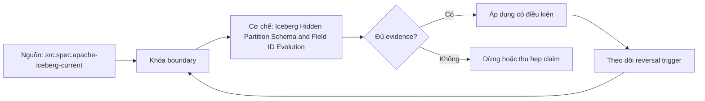

# Iceberg Hidden Partition Schema and Field ID Evolution

> [!abstract] Câu hỏi trung tâm
> Field IDs và partition specs cho phép dữ liệu cũ/mới cùng tồn tại mà query vẫn đúng thế nào?

## 1. Field identity

Iceberg assigns stable field IDs; data-file projection binds IDs rather than current names/positions. Rename changes display name while preserving ID, nên old files map đúng field. Drop rồi add cùng name tạo identity mới; không được đọc old values như field mới. Reorder không đổi identity. Type widening chỉ trong allowed promotions và partition transforms impose extra restrictions. External files thiếu IDs cần name mapping/careful migration.

## 2. Hidden partitioning

Partition spec defines transforms from source field IDs: identity, year/month/day/hour, bucket, truncate. Users query logical columns; planner projects predicate through each spec instead of yêu cầu path predicates. Partition values vẫn là metadata dùng pruning nhưng không phải application columns bắt buộc. Transform projection thường conservative, giữ candidate có thể match. Hidden partitioning giảm coupling giữa SQL và physical layout nhưng engine support cần verify.

## 3. Partition evolution

Đổi month sang day tạo spec mới cho writes mới; old files giữ old spec và layout. Planner split-plans files theo spec ID, derive filter tương ứng rồi union results. Evolution là metadata operation và không eagerly rewrite old files. Performance có thể heterogeneous; correctness oracle phủ boundary giữa old/new regions. Muốn homogenize layout phải compaction/rewrite riêng với cost/recovery plan.

## 4. Schema evolution boundary

Add, drop, rename, reorder và supported widen changes có format semantics. Default values, nested fields, map keys và partition sources có constraints. Format không phát hiện business meaning change giữ same type/ID, như cents sang dollars. Cross-engine connector có thể expose IDs khác, cache stale schema hoặc write older format version. Compatibility matrix phải có old/new writers/readers và semantic invariants.

## 5. Pruning qua nhiều specs

Query event_time range được transform thành month domain cho spec cũ và day domain cho spec mới. Manifest partition summaries và file entries dùng spec-specific tuples. Report files/manifests pruned riêng từng spec; total alone che regression ở one region. Boundary values quanh month/day, timezone and transform semantics cần fixtures. Query result phải reconcile canonical source independent of partitioning.

## 6. Evolution lab

Tạo table partitioned month, load old period; commit spec day, load new period without rewriting old files. Rename field giữ ID và widen allowed type. Capture schemas/specs by ID, metadata tree, file→spec mapping và plans. Query spans both periods plus boundaries; compare key/value hash with hand oracle. Verify old data via new name, no identity leakage after rename, and pruning counters in both specs. Negative test drop+add same name remains distinct.

## 7. Ma trận kiểm chứng từng mệnh đề

Mỗi claim phải chỉ rõ metadata scope, writer/reader version, exact fixture, counterexample và oracle. File parse được, plan có predicate hoặc metadata tồn tại chưa đủ để kết luận physical I/O hay semantic result đúng.

### 7.1. Evolution probe 1: field ID, spec ID, old/new file region, predicate transform và result oracle phải hiện đủ

**Mệnh đề cần kiểm.** Evolution probe 1: field ID, spec ID, old/new file region, predicate transform và result oracle phải hiện đủ.

**Thiết kế phép thử cho `wiki.storage.iceberg-hidden-partition-schema-field-id-evolution`.** Khóa schema, dataset hash, writer/reader/engine versions, storage backend, cache state và configuration. Tạo positive fixture, boundary fixture và negative/counterexample; thay đổi đúng một biến. Lưu footer hoặc metadata-tree locator, query plan, scan counters, requested/transferred bytes nếu có, typed result hash, logs và run ID. Khi công cụ không quan sát được một tầng, ghi `unknown` thay vì suy từ latency hoặc output count.

**Điều kiện chấp nhận cho `wiki.storage.iceberg-hidden-partition-schema-field-id-evolution`.** Canonical result phải khớp trước khi so hiệu năng. Observation phải lặp lại trên số run đã định, chỉ ra đơn vị bị loại và cơ chế chịu trách nhiệm. Báo riêng source fact, phần tổng hợp của giáo trình và giả định theo implementation. Chưa chạy lab thì mục này là protocol, chưa phải kết quả thực nghiệm.

### 7.2. Evolution probe 2: field ID, spec ID, old/new file region, predicate transform và result oracle phải hiện đủ

**Mệnh đề cần kiểm.** Evolution probe 2: field ID, spec ID, old/new file region, predicate transform và result oracle phải hiện đủ.

**Thiết kế phép thử cho `wiki.storage.iceberg-hidden-partition-schema-field-id-evolution`.** Khóa schema, dataset hash, writer/reader/engine versions, storage backend, cache state và configuration. Tạo positive fixture, boundary fixture và negative/counterexample; thay đổi đúng một biến. Lưu footer hoặc metadata-tree locator, query plan, scan counters, requested/transferred bytes nếu có, typed result hash, logs và run ID. Khi công cụ không quan sát được một tầng, ghi `unknown` thay vì suy từ latency hoặc output count.

**Điều kiện chấp nhận cho `wiki.storage.iceberg-hidden-partition-schema-field-id-evolution`.** Canonical result phải khớp trước khi so hiệu năng. Observation phải lặp lại trên số run đã định, chỉ ra đơn vị bị loại và cơ chế chịu trách nhiệm. Báo riêng source fact, phần tổng hợp của giáo trình và giả định theo implementation. Chưa chạy lab thì mục này là protocol, chưa phải kết quả thực nghiệm.

### 7.3. Evolution probe 3: field ID, spec ID, old/new file region, predicate transform và result oracle phải hiện đủ

**Mệnh đề cần kiểm.** Evolution probe 3: field ID, spec ID, old/new file region, predicate transform và result oracle phải hiện đủ.

**Thiết kế phép thử cho `wiki.storage.iceberg-hidden-partition-schema-field-id-evolution`.** Khóa schema, dataset hash, writer/reader/engine versions, storage backend, cache state và configuration. Tạo positive fixture, boundary fixture và negative/counterexample; thay đổi đúng một biến. Lưu footer hoặc metadata-tree locator, query plan, scan counters, requested/transferred bytes nếu có, typed result hash, logs và run ID. Khi công cụ không quan sát được một tầng, ghi `unknown` thay vì suy từ latency hoặc output count.

**Điều kiện chấp nhận cho `wiki.storage.iceberg-hidden-partition-schema-field-id-evolution`.** Canonical result phải khớp trước khi so hiệu năng. Observation phải lặp lại trên số run đã định, chỉ ra đơn vị bị loại và cơ chế chịu trách nhiệm. Báo riêng source fact, phần tổng hợp của giáo trình và giả định theo implementation. Chưa chạy lab thì mục này là protocol, chưa phải kết quả thực nghiệm.

### 7.4. Evolution probe 4: field ID, spec ID, old/new file region, predicate transform và result oracle phải hiện đủ

**Mệnh đề cần kiểm.** Evolution probe 4: field ID, spec ID, old/new file region, predicate transform và result oracle phải hiện đủ.

**Thiết kế phép thử cho `wiki.storage.iceberg-hidden-partition-schema-field-id-evolution`.** Khóa schema, dataset hash, writer/reader/engine versions, storage backend, cache state và configuration. Tạo positive fixture, boundary fixture và negative/counterexample; thay đổi đúng một biến. Lưu footer hoặc metadata-tree locator, query plan, scan counters, requested/transferred bytes nếu có, typed result hash, logs và run ID. Khi công cụ không quan sát được một tầng, ghi `unknown` thay vì suy từ latency hoặc output count.

**Điều kiện chấp nhận cho `wiki.storage.iceberg-hidden-partition-schema-field-id-evolution`.** Canonical result phải khớp trước khi so hiệu năng. Observation phải lặp lại trên số run đã định, chỉ ra đơn vị bị loại và cơ chế chịu trách nhiệm. Báo riêng source fact, phần tổng hợp của giáo trình và giả định theo implementation. Chưa chạy lab thì mục này là protocol, chưa phải kết quả thực nghiệm.

### 7.5. Evolution probe 5: field ID, spec ID, old/new file region, predicate transform và result oracle phải hiện đủ

**Mệnh đề cần kiểm.** Evolution probe 5: field ID, spec ID, old/new file region, predicate transform và result oracle phải hiện đủ.

**Thiết kế phép thử cho `wiki.storage.iceberg-hidden-partition-schema-field-id-evolution`.** Khóa schema, dataset hash, writer/reader/engine versions, storage backend, cache state và configuration. Tạo positive fixture, boundary fixture và negative/counterexample; thay đổi đúng một biến. Lưu footer hoặc metadata-tree locator, query plan, scan counters, requested/transferred bytes nếu có, typed result hash, logs và run ID. Khi công cụ không quan sát được một tầng, ghi `unknown` thay vì suy từ latency hoặc output count.

**Điều kiện chấp nhận cho `wiki.storage.iceberg-hidden-partition-schema-field-id-evolution`.** Canonical result phải khớp trước khi so hiệu năng. Observation phải lặp lại trên số run đã định, chỉ ra đơn vị bị loại và cơ chế chịu trách nhiệm. Báo riêng source fact, phần tổng hợp của giáo trình và giả định theo implementation. Chưa chạy lab thì mục này là protocol, chưa phải kết quả thực nghiệm.

### 7.6. Evolution probe 6: field ID, spec ID, old/new file region, predicate transform và result oracle phải hiện đủ

**Mệnh đề cần kiểm.** Evolution probe 6: field ID, spec ID, old/new file region, predicate transform và result oracle phải hiện đủ.

**Thiết kế phép thử cho `wiki.storage.iceberg-hidden-partition-schema-field-id-evolution`.** Khóa schema, dataset hash, writer/reader/engine versions, storage backend, cache state và configuration. Tạo positive fixture, boundary fixture và negative/counterexample; thay đổi đúng một biến. Lưu footer hoặc metadata-tree locator, query plan, scan counters, requested/transferred bytes nếu có, typed result hash, logs và run ID. Khi công cụ không quan sát được một tầng, ghi `unknown` thay vì suy từ latency hoặc output count.

**Điều kiện chấp nhận cho `wiki.storage.iceberg-hidden-partition-schema-field-id-evolution`.** Canonical result phải khớp trước khi so hiệu năng. Observation phải lặp lại trên số run đã định, chỉ ra đơn vị bị loại và cơ chế chịu trách nhiệm. Báo riêng source fact, phần tổng hợp của giáo trình và giả định theo implementation. Chưa chạy lab thì mục này là protocol, chưa phải kết quả thực nghiệm.

### 7.7. Evolution probe 7: field ID, spec ID, old/new file region, predicate transform và result oracle phải hiện đủ

**Mệnh đề cần kiểm.** Evolution probe 7: field ID, spec ID, old/new file region, predicate transform và result oracle phải hiện đủ.

**Thiết kế phép thử cho `wiki.storage.iceberg-hidden-partition-schema-field-id-evolution`.** Khóa schema, dataset hash, writer/reader/engine versions, storage backend, cache state và configuration. Tạo positive fixture, boundary fixture và negative/counterexample; thay đổi đúng một biến. Lưu footer hoặc metadata-tree locator, query plan, scan counters, requested/transferred bytes nếu có, typed result hash, logs và run ID. Khi công cụ không quan sát được một tầng, ghi `unknown` thay vì suy từ latency hoặc output count.

**Điều kiện chấp nhận cho `wiki.storage.iceberg-hidden-partition-schema-field-id-evolution`.** Canonical result phải khớp trước khi so hiệu năng. Observation phải lặp lại trên số run đã định, chỉ ra đơn vị bị loại và cơ chế chịu trách nhiệm. Báo riêng source fact, phần tổng hợp của giáo trình và giả định theo implementation. Chưa chạy lab thì mục này là protocol, chưa phải kết quả thực nghiệm.

### 7.8. Evolution probe 8: field ID, spec ID, old/new file region, predicate transform và result oracle phải hiện đủ

**Mệnh đề cần kiểm.** Evolution probe 8: field ID, spec ID, old/new file region, predicate transform và result oracle phải hiện đủ.

**Thiết kế phép thử cho `wiki.storage.iceberg-hidden-partition-schema-field-id-evolution`.** Khóa schema, dataset hash, writer/reader/engine versions, storage backend, cache state và configuration. Tạo positive fixture, boundary fixture và negative/counterexample; thay đổi đúng một biến. Lưu footer hoặc metadata-tree locator, query plan, scan counters, requested/transferred bytes nếu có, typed result hash, logs và run ID. Khi công cụ không quan sát được một tầng, ghi `unknown` thay vì suy từ latency hoặc output count.

**Điều kiện chấp nhận cho `wiki.storage.iceberg-hidden-partition-schema-field-id-evolution`.** Canonical result phải khớp trước khi so hiệu năng. Observation phải lặp lại trên số run đã định, chỉ ra đơn vị bị loại và cơ chế chịu trách nhiệm. Báo riêng source fact, phần tổng hợp của giáo trình và giả định theo implementation. Chưa chạy lab thì mục này là protocol, chưa phải kết quả thực nghiệm.

### 7.9. Evolution probe 9: field ID, spec ID, old/new file region, predicate transform và result oracle phải hiện đủ

**Mệnh đề cần kiểm.** Evolution probe 9: field ID, spec ID, old/new file region, predicate transform và result oracle phải hiện đủ.

**Thiết kế phép thử cho `wiki.storage.iceberg-hidden-partition-schema-field-id-evolution`.** Khóa schema, dataset hash, writer/reader/engine versions, storage backend, cache state và configuration. Tạo positive fixture, boundary fixture và negative/counterexample; thay đổi đúng một biến. Lưu footer hoặc metadata-tree locator, query plan, scan counters, requested/transferred bytes nếu có, typed result hash, logs và run ID. Khi công cụ không quan sát được một tầng, ghi `unknown` thay vì suy từ latency hoặc output count.

**Điều kiện chấp nhận cho `wiki.storage.iceberg-hidden-partition-schema-field-id-evolution`.** Canonical result phải khớp trước khi so hiệu năng. Observation phải lặp lại trên số run đã định, chỉ ra đơn vị bị loại và cơ chế chịu trách nhiệm. Báo riêng source fact, phần tổng hợp của giáo trình và giả định theo implementation. Chưa chạy lab thì mục này là protocol, chưa phải kết quả thực nghiệm.

### 7.10. Evolution probe 10: field ID, spec ID, old/new file region, predicate transform và result oracle phải hiện đủ

**Mệnh đề cần kiểm.** Evolution probe 10: field ID, spec ID, old/new file region, predicate transform và result oracle phải hiện đủ.

**Thiết kế phép thử cho `wiki.storage.iceberg-hidden-partition-schema-field-id-evolution`.** Khóa schema, dataset hash, writer/reader/engine versions, storage backend, cache state và configuration. Tạo positive fixture, boundary fixture và negative/counterexample; thay đổi đúng một biến. Lưu footer hoặc metadata-tree locator, query plan, scan counters, requested/transferred bytes nếu có, typed result hash, logs và run ID. Khi công cụ không quan sát được một tầng, ghi `unknown` thay vì suy từ latency hoặc output count.

**Điều kiện chấp nhận cho `wiki.storage.iceberg-hidden-partition-schema-field-id-evolution`.** Canonical result phải khớp trước khi so hiệu năng. Observation phải lặp lại trên số run đã định, chỉ ra đơn vị bị loại và cơ chế chịu trách nhiệm. Báo riêng source fact, phần tổng hợp của giáo trình và giả định theo implementation. Chưa chạy lab thì mục này là protocol, chưa phải kết quả thực nghiệm.

### 7.11. Evolution probe 11: field ID, spec ID, old/new file region, predicate transform và result oracle phải hiện đủ

**Mệnh đề cần kiểm.** Evolution probe 11: field ID, spec ID, old/new file region, predicate transform và result oracle phải hiện đủ.

**Thiết kế phép thử cho `wiki.storage.iceberg-hidden-partition-schema-field-id-evolution`.** Khóa schema, dataset hash, writer/reader/engine versions, storage backend, cache state và configuration. Tạo positive fixture, boundary fixture và negative/counterexample; thay đổi đúng một biến. Lưu footer hoặc metadata-tree locator, query plan, scan counters, requested/transferred bytes nếu có, typed result hash, logs và run ID. Khi công cụ không quan sát được một tầng, ghi `unknown` thay vì suy từ latency hoặc output count.

**Điều kiện chấp nhận cho `wiki.storage.iceberg-hidden-partition-schema-field-id-evolution`.** Canonical result phải khớp trước khi so hiệu năng. Observation phải lặp lại trên số run đã định, chỉ ra đơn vị bị loại và cơ chế chịu trách nhiệm. Báo riêng source fact, phần tổng hợp của giáo trình và giả định theo implementation. Chưa chạy lab thì mục này là protocol, chưa phải kết quả thực nghiệm.

### 7.12. Evolution probe 12: field ID, spec ID, old/new file region, predicate transform và result oracle phải hiện đủ

**Mệnh đề cần kiểm.** Evolution probe 12: field ID, spec ID, old/new file region, predicate transform và result oracle phải hiện đủ.

**Thiết kế phép thử cho `wiki.storage.iceberg-hidden-partition-schema-field-id-evolution`.** Khóa schema, dataset hash, writer/reader/engine versions, storage backend, cache state và configuration. Tạo positive fixture, boundary fixture và negative/counterexample; thay đổi đúng một biến. Lưu footer hoặc metadata-tree locator, query plan, scan counters, requested/transferred bytes nếu có, typed result hash, logs và run ID. Khi công cụ không quan sát được một tầng, ghi `unknown` thay vì suy từ latency hoặc output count.

**Điều kiện chấp nhận cho `wiki.storage.iceberg-hidden-partition-schema-field-id-evolution`.** Canonical result phải khớp trước khi so hiệu năng. Observation phải lặp lại trên số run đã định, chỉ ra đơn vị bị loại và cơ chế chịu trách nhiệm. Báo riêng source fact, phần tổng hợp của giáo trình và giả định theo implementation. Chưa chạy lab thì mục này là protocol, chưa phải kết quả thực nghiệm.

### 7.13. Evolution probe 13: field ID, spec ID, old/new file region, predicate transform và result oracle phải hiện đủ

**Mệnh đề cần kiểm.** Evolution probe 13: field ID, spec ID, old/new file region, predicate transform và result oracle phải hiện đủ.

**Thiết kế phép thử cho `wiki.storage.iceberg-hidden-partition-schema-field-id-evolution`.** Khóa schema, dataset hash, writer/reader/engine versions, storage backend, cache state và configuration. Tạo positive fixture, boundary fixture và negative/counterexample; thay đổi đúng một biến. Lưu footer hoặc metadata-tree locator, query plan, scan counters, requested/transferred bytes nếu có, typed result hash, logs và run ID. Khi công cụ không quan sát được một tầng, ghi `unknown` thay vì suy từ latency hoặc output count.

**Điều kiện chấp nhận cho `wiki.storage.iceberg-hidden-partition-schema-field-id-evolution`.** Canonical result phải khớp trước khi so hiệu năng. Observation phải lặp lại trên số run đã định, chỉ ra đơn vị bị loại và cơ chế chịu trách nhiệm. Báo riêng source fact, phần tổng hợp của giáo trình và giả định theo implementation. Chưa chạy lab thì mục này là protocol, chưa phải kết quả thực nghiệm.

### 7.14. Evolution probe 14: field ID, spec ID, old/new file region, predicate transform và result oracle phải hiện đủ

**Mệnh đề cần kiểm.** Evolution probe 14: field ID, spec ID, old/new file region, predicate transform và result oracle phải hiện đủ.

**Thiết kế phép thử cho `wiki.storage.iceberg-hidden-partition-schema-field-id-evolution`.** Khóa schema, dataset hash, writer/reader/engine versions, storage backend, cache state và configuration. Tạo positive fixture, boundary fixture và negative/counterexample; thay đổi đúng một biến. Lưu footer hoặc metadata-tree locator, query plan, scan counters, requested/transferred bytes nếu có, typed result hash, logs và run ID. Khi công cụ không quan sát được một tầng, ghi `unknown` thay vì suy từ latency hoặc output count.

**Điều kiện chấp nhận cho `wiki.storage.iceberg-hidden-partition-schema-field-id-evolution`.** Canonical result phải khớp trước khi so hiệu năng. Observation phải lặp lại trên số run đã định, chỉ ra đơn vị bị loại và cơ chế chịu trách nhiệm. Báo riêng source fact, phần tổng hợp của giáo trình và giả định theo implementation. Chưa chạy lab thì mục này là protocol, chưa phải kết quả thực nghiệm.

### 7.15. Evolution probe 15: field ID, spec ID, old/new file region, predicate transform và result oracle phải hiện đủ

**Mệnh đề cần kiểm.** Evolution probe 15: field ID, spec ID, old/new file region, predicate transform và result oracle phải hiện đủ.

**Thiết kế phép thử cho `wiki.storage.iceberg-hidden-partition-schema-field-id-evolution`.** Khóa schema, dataset hash, writer/reader/engine versions, storage backend, cache state và configuration. Tạo positive fixture, boundary fixture và negative/counterexample; thay đổi đúng một biến. Lưu footer hoặc metadata-tree locator, query plan, scan counters, requested/transferred bytes nếu có, typed result hash, logs và run ID. Khi công cụ không quan sát được một tầng, ghi `unknown` thay vì suy từ latency hoặc output count.

**Điều kiện chấp nhận cho `wiki.storage.iceberg-hidden-partition-schema-field-id-evolution`.** Canonical result phải khớp trước khi so hiệu năng. Observation phải lặp lại trên số run đã định, chỉ ra đơn vị bị loại và cơ chế chịu trách nhiệm. Báo riêng source fact, phần tổng hợp của giáo trình và giả định theo implementation. Chưa chạy lab thì mục này là protocol, chưa phải kết quả thực nghiệm.

## 8. Quy trình phản biện

1. Xác định tầng đang nói: object store, file, table metadata, catalog hay engine.
2. Viết identity và publication boundary trước khi bàn hiệu năng.
3. Tách metadata presence, planner intent, executed pruning và physical I/O.
4. Kiểm semantic result bằng typed oracle trước benchmark.
5. Pin version, configuration, cache state và metric definition.
6. Ghi counterexample, limitation và reversal condition cho recommendation.

## 9. Câu hỏi tự kiểm tra

1. Đơn vị đang xét là file, row group, column chunk, page, manifest hay snapshot?
2. Metadata nào authoritative và lấy từ locator nào?
3. Reader có dùng metadata hay chỉ có khả năng dùng?
4. Parse/decode thành công có che semantic mismatch không?
5. Failure ở trước hay sau publication boundary?
6. Bằng chứng nào còn là protocol chưa chạy?

## 10. Giới hạn và điều chưa cho phép kết luận

- Chưa chạy Parquet footer/page-index lab hoặc Iceberg metadata trace trên engine/catalog thật.
- Đặc tả được kiểm ngày 2026-10-02; implementation behavior phải pin version.
- Matrices và lab protocols là synthesis của giáo trình, không gán nguyên văn cho một nguồn.
- Note giữ trạng thái `review` tới khi chủ dự án duyệt.

## Reference
1. [[SRC-APACHE-ICEBERG-SPEC]]
2. [[SRC-APACHE-ICEBERG-EVOLUTION]]

## Source coverage

| Source slice | Nội dung sử dụng | Trạng thái |
|---|---|---|
| [[SRC-APACHE-ICEBERG-SPEC]] | Format/table contract, implementation boundary hoặc workload context | Đã đọc locator; không suy ngoài phạm vi |
| [[SRC-APACHE-ICEBERG-EVOLUTION]] | Format/table contract, implementation boundary hoặc workload context | Đã đọc locator; không suy ngoài phạm vi |

## Key takeaways
- Mọi claim phải đúng tầng và đúng granularity.
- Metadata hiện diện, planner intent, executed pruning và physical I/O là bốn bằng chứng khác nhau.
- Semantic oracle được kiểm trước performance attribution.
- Chưa chạy lab thì note cung cấp giáo trình và protocol, chưa phải certification cho production.

<!-- ATOMIC-EXECUTION-CAPSULE:START -->

## Execution capsule — kiểm chứng `wiki.storage.iceberg-hidden-partition-schema-field-id-evolution`

> [!important] Phân loại mệnh đề
> Với `wiki.storage.iceberg-hidden-partition-schema-field-id-evolution`, sơ đồ, ví dụ và artifact về **Iceberg Hidden Partition Schema and Field ID Evolution** là **synthesis để kiểm chứng**; chúng không phải trích dẫn hay case nguyên văn của nguồn.

### Sơ đồ cơ chế và điểm kiểm soát



Đọc sơ đồ `wiki.storage.iceberg-hidden-partition-schema-field-id-evolution` từ trái sang phải: source chỉ cung cấp claim ban đầu cho **Iceberg Hidden Partition Schema and Field ID Evolution**; quyết định chỉ được đi tiếp sau khi boundary, evidence và điều kiện đảo quyết định đã hiện hữu.

### Ví dụ làm việc có thể bác bỏ

**Input.** Một đội cần trả lời: “Field IDs và partition specs cho phép dữ liệu cũ/mới cùng tồn tại mà query vẫn đúng thế nào?” cho một phạm vi nhỏ, có owner và deadline rõ.

**Decision.** Đội áp dụng **Iceberg Hidden Partition Schema and Field ID Evolution** trên control và variant chỉ khác một assumption; expected result và hard constraints được khóa trước khi chạy.

**Outcome.** Với `wiki.storage.iceberg-hidden-partition-schema-field-id-evolution`, nếu observation vi phạm hard constraint hoặc oracle độc lập không xác nhận **Iceberg Hidden Partition Schema and Field ID Evolution**, đội thu hẹp claim hay đảo quyết định. Nếu đạt, kết luận vẫn kèm scope, version và review date; một lần thành công không được nâng thành quy luật phổ quát.

### Artifact thực thi tối thiểu

```sql
-- Verification harness for: Iceberg Hidden Partition Schema and Field ID Evolution
WITH evidence AS (
    SELECT 'wiki.storage.iceberg-hidden-partition-schema-field-id-evolution' AS concept_id,
           'boundary_declared' AS check_name, 1 AS passed
    UNION ALL
    SELECT 'wiki.storage.iceberg-hidden-partition-schema-field-id-evolution', 'independent_oracle', 1
    UNION ALL
    SELECT 'wiki.storage.iceberg-hidden-partition-schema-field-id-evolution', 'reversal_trigger_recorded', 1
)
SELECT concept_id,
       MIN(passed) AS all_hard_checks_pass,
       COUNT(*) AS evidence_items
FROM evidence
GROUP BY concept_id
HAVING MIN(passed) = 1;
```

Artifact của `wiki.storage.iceberg-hidden-partition-schema-field-id-evolution` buộc người dùng ghi boundary, oracle và reversal trigger cho **Iceberg Hidden Partition Schema and Field ID Evolution**. Các giá trị minh họa phải được thay bằng evidence thật trước khi dùng cho quyết định.

### Tự kiểm tra trước khi tái sử dụng

1. Bạn có thể trả lời `Field IDs và partition specs cho phép dữ liệu cũ/mới cùng tồn tại mà query vẫn đúng thế nào?` bằng một câu mà không kéo thêm concept thứ hai không?
2. Source locator nào đỡ cho claim, và phần nào chỉ là synthesis trong note?
3. Observation nào khiến bạn dừng, thu hẹp hoặc đảo quyết định?
4. Artifact nào cho phép một reviewer độc lập tái hiện kết quả?

<!-- ATOMIC-EXECUTION-CAPSULE:END -->
