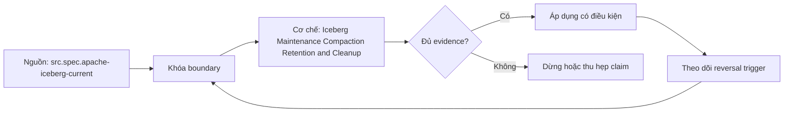

# Iceberg Maintenance Compaction Retention and Cleanup

> [!abstract] Câu hỏi trung tâm
> Compaction, delete-file maintenance, snapshot expiration và orphan cleanup chạy an toàn theo thứ tự nào?

## 1. Bốn công việc khác nhau

Data-file compaction rewrite many small files into fewer target files. Manifest rewrite reorganizes metadata for planning. Position-delete rewrite compacts/filter dangling delete records; dangling-file removal may remove whole delete files under defined conditions. Snapshot expiration removes history references and can delete files no longer reachable. Orphan cleanup targets unreferenced physical objects. Gộp các lệnh thành một chữ cleanup che khác biệt về correctness, rollback và concurrency.

## 2. Compaction concurrent writes

Rewrite operation selects input files on base snapshot and produces replacements. Commit validates selected inputs remain valid; concurrent append can coexist, nhưng concurrent delete/rewrite touching inputs may invalidate candidate. On retry, reusable outputs depend on validation and implementation. Final reconciliation requires same logical rows after applying deletes, plus concurrent writer delta exactly once. File count/latency improvement chỉ đo sau correctness.

## 3. Retention envelope

Snapshot retention derives from time-travel users, rollback RTO, delayed readers/jobs, branch/tag policy, audit/legal holds and maximum incident detection/recovery. Expiring snapshot removes it from metadata; files delete only when no retained reference. Minimum snapshots and age settings interact. Configuration example is not policy. Before expiration capture references, consumers and oldest required snapshot; after expiration verify intended snapshots gone and required ones readable.

## 4. Orphan cleanup safety

Unreferenced file may belong to in-progress writer. Official guidance warns retention shorter than maximum write duration can corrupt table. Safe lower bound includes longest write, retries, queue pauses, clock skew and operational margin. Normalize paths/schemes carefully. Run dry-run inventory, sample/classify candidates, refresh current tree, execute with bounded prefix and log deletes. Shared files or tables invalidate simple prefix ownership assumptions.

## 5. Delete files

Equality and position deletes have sequence/application rules. Compaction may materialize deletes into rewritten data files, while rewritePositionDeletes compacts delete files and filters dangling records for selected scope. Removing a delete file still applicable to live data resurrects rows. Oracle must compare business keys/values across snapshots, not raw data-file row counts. Measure delete-file count, metadata size, scan CPU/I/O and read amplification.

## 6. Maintenance project

Generate small files and delete files with known canonical state. Record baseline snapshots, row hash, file/manifest/delete counts, plan/scan metrics. Run compaction while controlled writer appends; reconcile both effects. Apply snapshot expiration with justified retention, test retained time travel. Dry-run then remove orphans with retention above observed maximum write plus margin. Roll back/read prior retained snapshot where policy permits. Store all operation IDs and exact candidate/deleted lists.

## 7. Ma trận kiểm chứng từng mệnh đề

Mỗi claim phải chỉ rõ metadata scope, writer/reader version, exact fixture, counterexample và oracle. File parse được, plan có predicate hoặc metadata tồn tại chưa đủ để kết luận physical I/O hay semantic result đúng.

### 7.1. Maintenance probe 1: operation scope, retained references, concurrent-write boundary, candidate set và row oracle phải rõ

**Mệnh đề cần kiểm.** Maintenance probe 1: operation scope, retained references, concurrent-write boundary, candidate set và row oracle phải rõ.

**Thiết kế phép thử cho `wiki.storage.iceberg-maintenance-compaction-retention-cleanup`.** Khóa schema, dataset hash, writer/reader/engine versions, storage backend, cache state và configuration. Tạo positive fixture, boundary fixture và negative/counterexample; thay đổi đúng một biến. Lưu footer hoặc metadata-tree locator, query plan, scan counters, requested/transferred bytes nếu có, typed result hash, logs và run ID. Khi công cụ không quan sát được một tầng, ghi `unknown` thay vì suy từ latency hoặc output count.

**Điều kiện chấp nhận cho `wiki.storage.iceberg-maintenance-compaction-retention-cleanup`.** Canonical result phải khớp trước khi so hiệu năng. Observation phải lặp lại trên số run đã định, chỉ ra đơn vị bị loại và cơ chế chịu trách nhiệm. Báo riêng source fact, phần tổng hợp của giáo trình và giả định theo implementation. Chưa chạy lab thì mục này là protocol, chưa phải kết quả thực nghiệm.

### 7.2. Maintenance probe 2: operation scope, retained references, concurrent-write boundary, candidate set và row oracle phải rõ

**Mệnh đề cần kiểm.** Maintenance probe 2: operation scope, retained references, concurrent-write boundary, candidate set và row oracle phải rõ.

**Thiết kế phép thử cho `wiki.storage.iceberg-maintenance-compaction-retention-cleanup`.** Khóa schema, dataset hash, writer/reader/engine versions, storage backend, cache state và configuration. Tạo positive fixture, boundary fixture và negative/counterexample; thay đổi đúng một biến. Lưu footer hoặc metadata-tree locator, query plan, scan counters, requested/transferred bytes nếu có, typed result hash, logs và run ID. Khi công cụ không quan sát được một tầng, ghi `unknown` thay vì suy từ latency hoặc output count.

**Điều kiện chấp nhận cho `wiki.storage.iceberg-maintenance-compaction-retention-cleanup`.** Canonical result phải khớp trước khi so hiệu năng. Observation phải lặp lại trên số run đã định, chỉ ra đơn vị bị loại và cơ chế chịu trách nhiệm. Báo riêng source fact, phần tổng hợp của giáo trình và giả định theo implementation. Chưa chạy lab thì mục này là protocol, chưa phải kết quả thực nghiệm.

### 7.3. Maintenance probe 3: operation scope, retained references, concurrent-write boundary, candidate set và row oracle phải rõ

**Mệnh đề cần kiểm.** Maintenance probe 3: operation scope, retained references, concurrent-write boundary, candidate set và row oracle phải rõ.

**Thiết kế phép thử cho `wiki.storage.iceberg-maintenance-compaction-retention-cleanup`.** Khóa schema, dataset hash, writer/reader/engine versions, storage backend, cache state và configuration. Tạo positive fixture, boundary fixture và negative/counterexample; thay đổi đúng một biến. Lưu footer hoặc metadata-tree locator, query plan, scan counters, requested/transferred bytes nếu có, typed result hash, logs và run ID. Khi công cụ không quan sát được một tầng, ghi `unknown` thay vì suy từ latency hoặc output count.

**Điều kiện chấp nhận cho `wiki.storage.iceberg-maintenance-compaction-retention-cleanup`.** Canonical result phải khớp trước khi so hiệu năng. Observation phải lặp lại trên số run đã định, chỉ ra đơn vị bị loại và cơ chế chịu trách nhiệm. Báo riêng source fact, phần tổng hợp của giáo trình và giả định theo implementation. Chưa chạy lab thì mục này là protocol, chưa phải kết quả thực nghiệm.

### 7.4. Maintenance probe 4: operation scope, retained references, concurrent-write boundary, candidate set và row oracle phải rõ

**Mệnh đề cần kiểm.** Maintenance probe 4: operation scope, retained references, concurrent-write boundary, candidate set và row oracle phải rõ.

**Thiết kế phép thử cho `wiki.storage.iceberg-maintenance-compaction-retention-cleanup`.** Khóa schema, dataset hash, writer/reader/engine versions, storage backend, cache state và configuration. Tạo positive fixture, boundary fixture và negative/counterexample; thay đổi đúng một biến. Lưu footer hoặc metadata-tree locator, query plan, scan counters, requested/transferred bytes nếu có, typed result hash, logs và run ID. Khi công cụ không quan sát được một tầng, ghi `unknown` thay vì suy từ latency hoặc output count.

**Điều kiện chấp nhận cho `wiki.storage.iceberg-maintenance-compaction-retention-cleanup`.** Canonical result phải khớp trước khi so hiệu năng. Observation phải lặp lại trên số run đã định, chỉ ra đơn vị bị loại và cơ chế chịu trách nhiệm. Báo riêng source fact, phần tổng hợp của giáo trình và giả định theo implementation. Chưa chạy lab thì mục này là protocol, chưa phải kết quả thực nghiệm.

### 7.5. Maintenance probe 5: operation scope, retained references, concurrent-write boundary, candidate set và row oracle phải rõ

**Mệnh đề cần kiểm.** Maintenance probe 5: operation scope, retained references, concurrent-write boundary, candidate set và row oracle phải rõ.

**Thiết kế phép thử cho `wiki.storage.iceberg-maintenance-compaction-retention-cleanup`.** Khóa schema, dataset hash, writer/reader/engine versions, storage backend, cache state và configuration. Tạo positive fixture, boundary fixture và negative/counterexample; thay đổi đúng một biến. Lưu footer hoặc metadata-tree locator, query plan, scan counters, requested/transferred bytes nếu có, typed result hash, logs và run ID. Khi công cụ không quan sát được một tầng, ghi `unknown` thay vì suy từ latency hoặc output count.

**Điều kiện chấp nhận cho `wiki.storage.iceberg-maintenance-compaction-retention-cleanup`.** Canonical result phải khớp trước khi so hiệu năng. Observation phải lặp lại trên số run đã định, chỉ ra đơn vị bị loại và cơ chế chịu trách nhiệm. Báo riêng source fact, phần tổng hợp của giáo trình và giả định theo implementation. Chưa chạy lab thì mục này là protocol, chưa phải kết quả thực nghiệm.

### 7.6. Maintenance probe 6: operation scope, retained references, concurrent-write boundary, candidate set và row oracle phải rõ

**Mệnh đề cần kiểm.** Maintenance probe 6: operation scope, retained references, concurrent-write boundary, candidate set và row oracle phải rõ.

**Thiết kế phép thử cho `wiki.storage.iceberg-maintenance-compaction-retention-cleanup`.** Khóa schema, dataset hash, writer/reader/engine versions, storage backend, cache state và configuration. Tạo positive fixture, boundary fixture và negative/counterexample; thay đổi đúng một biến. Lưu footer hoặc metadata-tree locator, query plan, scan counters, requested/transferred bytes nếu có, typed result hash, logs và run ID. Khi công cụ không quan sát được một tầng, ghi `unknown` thay vì suy từ latency hoặc output count.

**Điều kiện chấp nhận cho `wiki.storage.iceberg-maintenance-compaction-retention-cleanup`.** Canonical result phải khớp trước khi so hiệu năng. Observation phải lặp lại trên số run đã định, chỉ ra đơn vị bị loại và cơ chế chịu trách nhiệm. Báo riêng source fact, phần tổng hợp của giáo trình và giả định theo implementation. Chưa chạy lab thì mục này là protocol, chưa phải kết quả thực nghiệm.

### 7.7. Maintenance probe 7: operation scope, retained references, concurrent-write boundary, candidate set và row oracle phải rõ

**Mệnh đề cần kiểm.** Maintenance probe 7: operation scope, retained references, concurrent-write boundary, candidate set và row oracle phải rõ.

**Thiết kế phép thử cho `wiki.storage.iceberg-maintenance-compaction-retention-cleanup`.** Khóa schema, dataset hash, writer/reader/engine versions, storage backend, cache state và configuration. Tạo positive fixture, boundary fixture và negative/counterexample; thay đổi đúng một biến. Lưu footer hoặc metadata-tree locator, query plan, scan counters, requested/transferred bytes nếu có, typed result hash, logs và run ID. Khi công cụ không quan sát được một tầng, ghi `unknown` thay vì suy từ latency hoặc output count.

**Điều kiện chấp nhận cho `wiki.storage.iceberg-maintenance-compaction-retention-cleanup`.** Canonical result phải khớp trước khi so hiệu năng. Observation phải lặp lại trên số run đã định, chỉ ra đơn vị bị loại và cơ chế chịu trách nhiệm. Báo riêng source fact, phần tổng hợp của giáo trình và giả định theo implementation. Chưa chạy lab thì mục này là protocol, chưa phải kết quả thực nghiệm.

### 7.8. Maintenance probe 8: operation scope, retained references, concurrent-write boundary, candidate set và row oracle phải rõ

**Mệnh đề cần kiểm.** Maintenance probe 8: operation scope, retained references, concurrent-write boundary, candidate set và row oracle phải rõ.

**Thiết kế phép thử cho `wiki.storage.iceberg-maintenance-compaction-retention-cleanup`.** Khóa schema, dataset hash, writer/reader/engine versions, storage backend, cache state và configuration. Tạo positive fixture, boundary fixture và negative/counterexample; thay đổi đúng một biến. Lưu footer hoặc metadata-tree locator, query plan, scan counters, requested/transferred bytes nếu có, typed result hash, logs và run ID. Khi công cụ không quan sát được một tầng, ghi `unknown` thay vì suy từ latency hoặc output count.

**Điều kiện chấp nhận cho `wiki.storage.iceberg-maintenance-compaction-retention-cleanup`.** Canonical result phải khớp trước khi so hiệu năng. Observation phải lặp lại trên số run đã định, chỉ ra đơn vị bị loại và cơ chế chịu trách nhiệm. Báo riêng source fact, phần tổng hợp của giáo trình và giả định theo implementation. Chưa chạy lab thì mục này là protocol, chưa phải kết quả thực nghiệm.

### 7.9. Maintenance probe 9: operation scope, retained references, concurrent-write boundary, candidate set và row oracle phải rõ

**Mệnh đề cần kiểm.** Maintenance probe 9: operation scope, retained references, concurrent-write boundary, candidate set và row oracle phải rõ.

**Thiết kế phép thử cho `wiki.storage.iceberg-maintenance-compaction-retention-cleanup`.** Khóa schema, dataset hash, writer/reader/engine versions, storage backend, cache state và configuration. Tạo positive fixture, boundary fixture và negative/counterexample; thay đổi đúng một biến. Lưu footer hoặc metadata-tree locator, query plan, scan counters, requested/transferred bytes nếu có, typed result hash, logs và run ID. Khi công cụ không quan sát được một tầng, ghi `unknown` thay vì suy từ latency hoặc output count.

**Điều kiện chấp nhận cho `wiki.storage.iceberg-maintenance-compaction-retention-cleanup`.** Canonical result phải khớp trước khi so hiệu năng. Observation phải lặp lại trên số run đã định, chỉ ra đơn vị bị loại và cơ chế chịu trách nhiệm. Báo riêng source fact, phần tổng hợp của giáo trình và giả định theo implementation. Chưa chạy lab thì mục này là protocol, chưa phải kết quả thực nghiệm.

### 7.10. Maintenance probe 10: operation scope, retained references, concurrent-write boundary, candidate set và row oracle phải rõ

**Mệnh đề cần kiểm.** Maintenance probe 10: operation scope, retained references, concurrent-write boundary, candidate set và row oracle phải rõ.

**Thiết kế phép thử cho `wiki.storage.iceberg-maintenance-compaction-retention-cleanup`.** Khóa schema, dataset hash, writer/reader/engine versions, storage backend, cache state và configuration. Tạo positive fixture, boundary fixture và negative/counterexample; thay đổi đúng một biến. Lưu footer hoặc metadata-tree locator, query plan, scan counters, requested/transferred bytes nếu có, typed result hash, logs và run ID. Khi công cụ không quan sát được một tầng, ghi `unknown` thay vì suy từ latency hoặc output count.

**Điều kiện chấp nhận cho `wiki.storage.iceberg-maintenance-compaction-retention-cleanup`.** Canonical result phải khớp trước khi so hiệu năng. Observation phải lặp lại trên số run đã định, chỉ ra đơn vị bị loại và cơ chế chịu trách nhiệm. Báo riêng source fact, phần tổng hợp của giáo trình và giả định theo implementation. Chưa chạy lab thì mục này là protocol, chưa phải kết quả thực nghiệm.

### 7.11. Maintenance probe 11: operation scope, retained references, concurrent-write boundary, candidate set và row oracle phải rõ

**Mệnh đề cần kiểm.** Maintenance probe 11: operation scope, retained references, concurrent-write boundary, candidate set và row oracle phải rõ.

**Thiết kế phép thử cho `wiki.storage.iceberg-maintenance-compaction-retention-cleanup`.** Khóa schema, dataset hash, writer/reader/engine versions, storage backend, cache state và configuration. Tạo positive fixture, boundary fixture và negative/counterexample; thay đổi đúng một biến. Lưu footer hoặc metadata-tree locator, query plan, scan counters, requested/transferred bytes nếu có, typed result hash, logs và run ID. Khi công cụ không quan sát được một tầng, ghi `unknown` thay vì suy từ latency hoặc output count.

**Điều kiện chấp nhận cho `wiki.storage.iceberg-maintenance-compaction-retention-cleanup`.** Canonical result phải khớp trước khi so hiệu năng. Observation phải lặp lại trên số run đã định, chỉ ra đơn vị bị loại và cơ chế chịu trách nhiệm. Báo riêng source fact, phần tổng hợp của giáo trình và giả định theo implementation. Chưa chạy lab thì mục này là protocol, chưa phải kết quả thực nghiệm.

### 7.12. Maintenance probe 12: operation scope, retained references, concurrent-write boundary, candidate set và row oracle phải rõ

**Mệnh đề cần kiểm.** Maintenance probe 12: operation scope, retained references, concurrent-write boundary, candidate set và row oracle phải rõ.

**Thiết kế phép thử cho `wiki.storage.iceberg-maintenance-compaction-retention-cleanup`.** Khóa schema, dataset hash, writer/reader/engine versions, storage backend, cache state và configuration. Tạo positive fixture, boundary fixture và negative/counterexample; thay đổi đúng một biến. Lưu footer hoặc metadata-tree locator, query plan, scan counters, requested/transferred bytes nếu có, typed result hash, logs và run ID. Khi công cụ không quan sát được một tầng, ghi `unknown` thay vì suy từ latency hoặc output count.

**Điều kiện chấp nhận cho `wiki.storage.iceberg-maintenance-compaction-retention-cleanup`.** Canonical result phải khớp trước khi so hiệu năng. Observation phải lặp lại trên số run đã định, chỉ ra đơn vị bị loại và cơ chế chịu trách nhiệm. Báo riêng source fact, phần tổng hợp của giáo trình và giả định theo implementation. Chưa chạy lab thì mục này là protocol, chưa phải kết quả thực nghiệm.

### 7.13. Maintenance probe 13: operation scope, retained references, concurrent-write boundary, candidate set và row oracle phải rõ

**Mệnh đề cần kiểm.** Maintenance probe 13: operation scope, retained references, concurrent-write boundary, candidate set và row oracle phải rõ.

**Thiết kế phép thử cho `wiki.storage.iceberg-maintenance-compaction-retention-cleanup`.** Khóa schema, dataset hash, writer/reader/engine versions, storage backend, cache state và configuration. Tạo positive fixture, boundary fixture và negative/counterexample; thay đổi đúng một biến. Lưu footer hoặc metadata-tree locator, query plan, scan counters, requested/transferred bytes nếu có, typed result hash, logs và run ID. Khi công cụ không quan sát được một tầng, ghi `unknown` thay vì suy từ latency hoặc output count.

**Điều kiện chấp nhận cho `wiki.storage.iceberg-maintenance-compaction-retention-cleanup`.** Canonical result phải khớp trước khi so hiệu năng. Observation phải lặp lại trên số run đã định, chỉ ra đơn vị bị loại và cơ chế chịu trách nhiệm. Báo riêng source fact, phần tổng hợp của giáo trình và giả định theo implementation. Chưa chạy lab thì mục này là protocol, chưa phải kết quả thực nghiệm.

### 7.14. Maintenance probe 14: operation scope, retained references, concurrent-write boundary, candidate set và row oracle phải rõ

**Mệnh đề cần kiểm.** Maintenance probe 14: operation scope, retained references, concurrent-write boundary, candidate set và row oracle phải rõ.

**Thiết kế phép thử cho `wiki.storage.iceberg-maintenance-compaction-retention-cleanup`.** Khóa schema, dataset hash, writer/reader/engine versions, storage backend, cache state và configuration. Tạo positive fixture, boundary fixture và negative/counterexample; thay đổi đúng một biến. Lưu footer hoặc metadata-tree locator, query plan, scan counters, requested/transferred bytes nếu có, typed result hash, logs và run ID. Khi công cụ không quan sát được một tầng, ghi `unknown` thay vì suy từ latency hoặc output count.

**Điều kiện chấp nhận cho `wiki.storage.iceberg-maintenance-compaction-retention-cleanup`.** Canonical result phải khớp trước khi so hiệu năng. Observation phải lặp lại trên số run đã định, chỉ ra đơn vị bị loại và cơ chế chịu trách nhiệm. Báo riêng source fact, phần tổng hợp của giáo trình và giả định theo implementation. Chưa chạy lab thì mục này là protocol, chưa phải kết quả thực nghiệm.

### 7.15. Maintenance probe 15: operation scope, retained references, concurrent-write boundary, candidate set và row oracle phải rõ

**Mệnh đề cần kiểm.** Maintenance probe 15: operation scope, retained references, concurrent-write boundary, candidate set và row oracle phải rõ.

**Thiết kế phép thử cho `wiki.storage.iceberg-maintenance-compaction-retention-cleanup`.** Khóa schema, dataset hash, writer/reader/engine versions, storage backend, cache state và configuration. Tạo positive fixture, boundary fixture và negative/counterexample; thay đổi đúng một biến. Lưu footer hoặc metadata-tree locator, query plan, scan counters, requested/transferred bytes nếu có, typed result hash, logs và run ID. Khi công cụ không quan sát được một tầng, ghi `unknown` thay vì suy từ latency hoặc output count.

**Điều kiện chấp nhận cho `wiki.storage.iceberg-maintenance-compaction-retention-cleanup`.** Canonical result phải khớp trước khi so hiệu năng. Observation phải lặp lại trên số run đã định, chỉ ra đơn vị bị loại và cơ chế chịu trách nhiệm. Báo riêng source fact, phần tổng hợp của giáo trình và giả định theo implementation. Chưa chạy lab thì mục này là protocol, chưa phải kết quả thực nghiệm.

## 8. Quy trình phản biện

1. Xác định tầng đang nói: object store, file, table metadata, catalog hay engine.
2. Viết identity và publication boundary trước khi bàn hiệu năng.
3. Tách metadata presence, planner intent, executed pruning và physical I/O.
4. Kiểm semantic result bằng typed oracle trước benchmark.
5. Pin version, configuration, cache state và metric definition.
6. Ghi counterexample, limitation và reversal condition cho recommendation.

## 9. Câu hỏi tự kiểm tra

1. Đơn vị đang xét là file, row group, column chunk, page, manifest hay snapshot?
2. Metadata nào authoritative và lấy từ locator nào?
3. Reader có dùng metadata hay chỉ có khả năng dùng?
4. Parse/decode thành công có che semantic mismatch không?
5. Failure ở trước hay sau publication boundary?
6. Bằng chứng nào còn là protocol chưa chạy?

## 10. Giới hạn và điều chưa cho phép kết luận

- Chưa chạy Parquet footer/page-index lab hoặc Iceberg metadata trace trên engine/catalog thật.
- Đặc tả được kiểm ngày 2026-10-02; implementation behavior phải pin version.
- Matrices và lab protocols là synthesis của giáo trình, không gán nguyên văn cho một nguồn.
- Note giữ trạng thái `review` tới khi chủ dự án duyệt.

## Reference
1. [[SRC-APACHE-ICEBERG-SPEC]]
2. [[SRC-APACHE-ICEBERG-RELIABILITY]]
3. [[SRC-APACHE-ICEBERG-MAINTENANCE]]

## Source coverage

| Source slice | Nội dung sử dụng | Trạng thái |
|---|---|---|
| [[SRC-APACHE-ICEBERG-SPEC]] | Format/table contract, implementation boundary hoặc workload context | Đã đọc locator; không suy ngoài phạm vi |
| [[SRC-APACHE-ICEBERG-RELIABILITY]] | Format/table contract, implementation boundary hoặc workload context | Đã đọc locator; không suy ngoài phạm vi |
| [[SRC-APACHE-ICEBERG-MAINTENANCE]] | Format/table contract, implementation boundary hoặc workload context | Đã đọc locator; không suy ngoài phạm vi |

## Key takeaways
- Mọi claim phải đúng tầng và đúng granularity.
- Metadata hiện diện, planner intent, executed pruning và physical I/O là bốn bằng chứng khác nhau.
- Semantic oracle được kiểm trước performance attribution.
- Chưa chạy lab thì note cung cấp giáo trình và protocol, chưa phải certification cho production.

<!-- ATOMIC-EXECUTION-CAPSULE:START -->

## Execution capsule — kiểm chứng `wiki.storage.iceberg-maintenance-compaction-retention-cleanup`

> [!important] Phân loại mệnh đề
> Với `wiki.storage.iceberg-maintenance-compaction-retention-cleanup`, sơ đồ, ví dụ và artifact về **Iceberg Maintenance Compaction Retention and Cleanup** là **synthesis để kiểm chứng**; chúng không phải trích dẫn hay case nguyên văn của nguồn.

### Sơ đồ cơ chế và điểm kiểm soát



Đọc sơ đồ `wiki.storage.iceberg-maintenance-compaction-retention-cleanup` từ trái sang phải: source chỉ cung cấp claim ban đầu cho **Iceberg Maintenance Compaction Retention and Cleanup**; quyết định chỉ được đi tiếp sau khi boundary, evidence và điều kiện đảo quyết định đã hiện hữu.

### Ví dụ làm việc có thể bác bỏ

**Input.** Một đội cần trả lời: “Compaction, delete-file maintenance, snapshot expiration và orphan cleanup chạy an toàn theo thứ tự nào?” cho một phạm vi nhỏ, có owner và deadline rõ.

**Decision.** Đội áp dụng **Iceberg Maintenance Compaction Retention and Cleanup** trên control và variant chỉ khác một assumption; expected result và hard constraints được khóa trước khi chạy.

**Outcome.** Với `wiki.storage.iceberg-maintenance-compaction-retention-cleanup`, nếu observation vi phạm hard constraint hoặc oracle độc lập không xác nhận **Iceberg Maintenance Compaction Retention and Cleanup**, đội thu hẹp claim hay đảo quyết định. Nếu đạt, kết luận vẫn kèm scope, version và review date; một lần thành công không được nâng thành quy luật phổ quát.

### Artifact thực thi tối thiểu

```sql
-- Verification harness for: Iceberg Maintenance Compaction Retention and Cleanup
WITH evidence AS (
    SELECT 'wiki.storage.iceberg-maintenance-compaction-retention-cleanup' AS concept_id,
           'boundary_declared' AS check_name, 1 AS passed
    UNION ALL
    SELECT 'wiki.storage.iceberg-maintenance-compaction-retention-cleanup', 'independent_oracle', 1
    UNION ALL
    SELECT 'wiki.storage.iceberg-maintenance-compaction-retention-cleanup', 'reversal_trigger_recorded', 1
)
SELECT concept_id,
       MIN(passed) AS all_hard_checks_pass,
       COUNT(*) AS evidence_items
FROM evidence
GROUP BY concept_id
HAVING MIN(passed) = 1;
```

Artifact của `wiki.storage.iceberg-maintenance-compaction-retention-cleanup` buộc người dùng ghi boundary, oracle và reversal trigger cho **Iceberg Maintenance Compaction Retention and Cleanup**. Các giá trị minh họa phải được thay bằng evidence thật trước khi dùng cho quyết định.

### Tự kiểm tra trước khi tái sử dụng

1. Bạn có thể trả lời `Compaction, delete-file maintenance, snapshot expiration và orphan cleanup chạy an toàn theo thứ tự nào?` bằng một câu mà không kéo thêm concept thứ hai không?
2. Source locator nào đỡ cho claim, và phần nào chỉ là synthesis trong note?
3. Observation nào khiến bạn dừng, thu hẹp hoặc đảo quyết định?
4. Artifact nào cho phép một reviewer độc lập tái hiện kết quả?

<!-- ATOMIC-EXECUTION-CAPSULE:END -->
