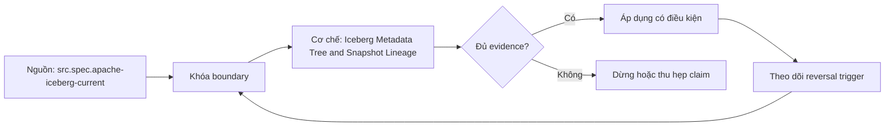

# Iceberg Metadata Tree and Snapshot Lineage

> [!abstract] Câu hỏi trung tâm
> Truy một data file hoặc một dòng từ current metadata pointer về snapshot và manifest như thế nào?

## 1. Gốc cây metadata

Catalog/table registration cung cấp current metadata location theo implementation contract. Metadata JSON giữ schema versions, partition specs, sort orders, properties, snapshot log, current snapshot ID và snapshot entries. Thay đổi table state tạo metadata file mới rồi atomically đổi pointer. File cũ vẫn tồn tại để history/recovery theo retention. Đọc một JSON bất kỳ trong directory không chứng minh nó current; phải bắt đầu từ catalog pointer hoặc version-hint contract đã xác minh.

## 2. Snapshot và manifest list

Snapshot đại diện table state tại một thời điểm và chứa snapshot ID, parent, sequence/timestamp, operation summary cùng manifest-list location. Mỗi snapshot có một manifest list. Manifest-list rows mô tả manifests, content type, partition summaries, file counts và sequence metadata; planner dùng summaries để loại manifests không liên quan. Snapshot không sao chép danh sách mọi data file trực tiếp, giúp metadata slow-changing được reuse giữa commits.

## 3. Manifest entries

Manifest liệt kê data hoặc delete files cùng status added/existing/deleted, snapshot/sequence lineage, partition tuple, record count, sizes, column metrics và file path. Live table set được diễn giải theo snapshot/manifests và status/sequence rules, không bằng union mù của mọi manifest từng thấy. Metrics hỗ trợ pruning nhưng bounds/null/NaN semantics và field IDs phải đúng. Delete files tham gia scan planning theo content/version rules; bỏ chúng khỏi trace có thể làm đọc thừa rows.

## 4. Từ row về snapshot

Một row không mang snapshot ID như business column mặc định. Trace bắt đầu từ query snapshot, xác định planned data file, row position/key rồi tìm manifest entry chứa file; manifest-list row chứa manifest; snapshot entry chứa manifest-list. Nếu file được reuse across snapshots, row thuộc state của nhiều snapshots. Câu đúng là row visible in snapshot X qua file F, không phải file/row được sinh duy nhất bởi X nếu lineage không chứng minh.

## 5. Pruning nhiều tầng

Predicate được bind vào field IDs và transforms. Partition summaries có thể bỏ manifests; manifest file metrics có thể bỏ data files; Parquet row-group/page metadata tiếp tục bỏ units trong file. Hidden partitioning cho planner transform logical predicate mà user không viết path partition. Mỗi tầng có false-positive boundary và counters khác nhau. Báo cáo ghi candidates trước/sau từng tầng; số file cuối cùng mở không tự cho biết tầng nào tạo lợi ích.

## 6. Lab ba commits

Tạo table, ghi ba commits với stable row IDs và thay đổi phân vùng có kiểm soát. Capture catalog pointer, metadata JSON hashes, current/parent snapshots, manifest-list rows, manifest entries và data-file footers. Chọn một row; trace query snapshot→manifest list→manifest→data file→row key. Chạy partition predicate, ghi manifests/data files bị loại trước mở file. Time travel về từng snapshot và đối soát canonical key set. Không sửa metadata bằng tay; mọi claim lưu exact locator/hash.

## 7. Ma trận kiểm chứng từng mệnh đề

Mỗi claim phải chỉ rõ metadata scope, writer/reader version, exact fixture, counterexample và oracle. File parse được, plan có predicate hoặc metadata tồn tại chưa đủ để kết luận physical I/O hay semantic result đúng.

### 7.1. Metadata-lineage probe 1: pointer, snapshot, manifest list, manifest entry và data-file evidence phải nối được

**Mệnh đề cần kiểm.** Metadata-lineage probe 1: pointer, snapshot, manifest list, manifest entry và data-file evidence phải nối được.

**Thiết kế phép thử cho `wiki.storage.iceberg-metadata-tree-snapshot-lineage`.** Khóa schema, dataset hash, writer/reader/engine versions, storage backend, cache state và configuration. Tạo positive fixture, boundary fixture và negative/counterexample; thay đổi đúng một biến. Lưu footer hoặc metadata-tree locator, query plan, scan counters, requested/transferred bytes nếu có, typed result hash, logs và run ID. Khi công cụ không quan sát được một tầng, ghi `unknown` thay vì suy từ latency hoặc output count.

**Điều kiện chấp nhận cho `wiki.storage.iceberg-metadata-tree-snapshot-lineage`.** Canonical result phải khớp trước khi so hiệu năng. Observation phải lặp lại trên số run đã định, chỉ ra đơn vị bị loại và cơ chế chịu trách nhiệm. Báo riêng source fact, phần tổng hợp của giáo trình và giả định theo implementation. Chưa chạy lab thì mục này là protocol, chưa phải kết quả thực nghiệm.

### 7.2. Metadata-lineage probe 2: pointer, snapshot, manifest list, manifest entry và data-file evidence phải nối được

**Mệnh đề cần kiểm.** Metadata-lineage probe 2: pointer, snapshot, manifest list, manifest entry và data-file evidence phải nối được.

**Thiết kế phép thử cho `wiki.storage.iceberg-metadata-tree-snapshot-lineage`.** Khóa schema, dataset hash, writer/reader/engine versions, storage backend, cache state và configuration. Tạo positive fixture, boundary fixture và negative/counterexample; thay đổi đúng một biến. Lưu footer hoặc metadata-tree locator, query plan, scan counters, requested/transferred bytes nếu có, typed result hash, logs và run ID. Khi công cụ không quan sát được một tầng, ghi `unknown` thay vì suy từ latency hoặc output count.

**Điều kiện chấp nhận cho `wiki.storage.iceberg-metadata-tree-snapshot-lineage`.** Canonical result phải khớp trước khi so hiệu năng. Observation phải lặp lại trên số run đã định, chỉ ra đơn vị bị loại và cơ chế chịu trách nhiệm. Báo riêng source fact, phần tổng hợp của giáo trình và giả định theo implementation. Chưa chạy lab thì mục này là protocol, chưa phải kết quả thực nghiệm.

### 7.3. Metadata-lineage probe 3: pointer, snapshot, manifest list, manifest entry và data-file evidence phải nối được

**Mệnh đề cần kiểm.** Metadata-lineage probe 3: pointer, snapshot, manifest list, manifest entry và data-file evidence phải nối được.

**Thiết kế phép thử cho `wiki.storage.iceberg-metadata-tree-snapshot-lineage`.** Khóa schema, dataset hash, writer/reader/engine versions, storage backend, cache state và configuration. Tạo positive fixture, boundary fixture và negative/counterexample; thay đổi đúng một biến. Lưu footer hoặc metadata-tree locator, query plan, scan counters, requested/transferred bytes nếu có, typed result hash, logs và run ID. Khi công cụ không quan sát được một tầng, ghi `unknown` thay vì suy từ latency hoặc output count.

**Điều kiện chấp nhận cho `wiki.storage.iceberg-metadata-tree-snapshot-lineage`.** Canonical result phải khớp trước khi so hiệu năng. Observation phải lặp lại trên số run đã định, chỉ ra đơn vị bị loại và cơ chế chịu trách nhiệm. Báo riêng source fact, phần tổng hợp của giáo trình và giả định theo implementation. Chưa chạy lab thì mục này là protocol, chưa phải kết quả thực nghiệm.

### 7.4. Metadata-lineage probe 4: pointer, snapshot, manifest list, manifest entry và data-file evidence phải nối được

**Mệnh đề cần kiểm.** Metadata-lineage probe 4: pointer, snapshot, manifest list, manifest entry và data-file evidence phải nối được.

**Thiết kế phép thử cho `wiki.storage.iceberg-metadata-tree-snapshot-lineage`.** Khóa schema, dataset hash, writer/reader/engine versions, storage backend, cache state và configuration. Tạo positive fixture, boundary fixture và negative/counterexample; thay đổi đúng một biến. Lưu footer hoặc metadata-tree locator, query plan, scan counters, requested/transferred bytes nếu có, typed result hash, logs và run ID. Khi công cụ không quan sát được một tầng, ghi `unknown` thay vì suy từ latency hoặc output count.

**Điều kiện chấp nhận cho `wiki.storage.iceberg-metadata-tree-snapshot-lineage`.** Canonical result phải khớp trước khi so hiệu năng. Observation phải lặp lại trên số run đã định, chỉ ra đơn vị bị loại và cơ chế chịu trách nhiệm. Báo riêng source fact, phần tổng hợp của giáo trình và giả định theo implementation. Chưa chạy lab thì mục này là protocol, chưa phải kết quả thực nghiệm.

### 7.5. Metadata-lineage probe 5: pointer, snapshot, manifest list, manifest entry và data-file evidence phải nối được

**Mệnh đề cần kiểm.** Metadata-lineage probe 5: pointer, snapshot, manifest list, manifest entry và data-file evidence phải nối được.

**Thiết kế phép thử cho `wiki.storage.iceberg-metadata-tree-snapshot-lineage`.** Khóa schema, dataset hash, writer/reader/engine versions, storage backend, cache state và configuration. Tạo positive fixture, boundary fixture và negative/counterexample; thay đổi đúng một biến. Lưu footer hoặc metadata-tree locator, query plan, scan counters, requested/transferred bytes nếu có, typed result hash, logs và run ID. Khi công cụ không quan sát được một tầng, ghi `unknown` thay vì suy từ latency hoặc output count.

**Điều kiện chấp nhận cho `wiki.storage.iceberg-metadata-tree-snapshot-lineage`.** Canonical result phải khớp trước khi so hiệu năng. Observation phải lặp lại trên số run đã định, chỉ ra đơn vị bị loại và cơ chế chịu trách nhiệm. Báo riêng source fact, phần tổng hợp của giáo trình và giả định theo implementation. Chưa chạy lab thì mục này là protocol, chưa phải kết quả thực nghiệm.

### 7.6. Metadata-lineage probe 6: pointer, snapshot, manifest list, manifest entry và data-file evidence phải nối được

**Mệnh đề cần kiểm.** Metadata-lineage probe 6: pointer, snapshot, manifest list, manifest entry và data-file evidence phải nối được.

**Thiết kế phép thử cho `wiki.storage.iceberg-metadata-tree-snapshot-lineage`.** Khóa schema, dataset hash, writer/reader/engine versions, storage backend, cache state và configuration. Tạo positive fixture, boundary fixture và negative/counterexample; thay đổi đúng một biến. Lưu footer hoặc metadata-tree locator, query plan, scan counters, requested/transferred bytes nếu có, typed result hash, logs và run ID. Khi công cụ không quan sát được một tầng, ghi `unknown` thay vì suy từ latency hoặc output count.

**Điều kiện chấp nhận cho `wiki.storage.iceberg-metadata-tree-snapshot-lineage`.** Canonical result phải khớp trước khi so hiệu năng. Observation phải lặp lại trên số run đã định, chỉ ra đơn vị bị loại và cơ chế chịu trách nhiệm. Báo riêng source fact, phần tổng hợp của giáo trình và giả định theo implementation. Chưa chạy lab thì mục này là protocol, chưa phải kết quả thực nghiệm.

### 7.7. Metadata-lineage probe 7: pointer, snapshot, manifest list, manifest entry và data-file evidence phải nối được

**Mệnh đề cần kiểm.** Metadata-lineage probe 7: pointer, snapshot, manifest list, manifest entry và data-file evidence phải nối được.

**Thiết kế phép thử cho `wiki.storage.iceberg-metadata-tree-snapshot-lineage`.** Khóa schema, dataset hash, writer/reader/engine versions, storage backend, cache state và configuration. Tạo positive fixture, boundary fixture và negative/counterexample; thay đổi đúng một biến. Lưu footer hoặc metadata-tree locator, query plan, scan counters, requested/transferred bytes nếu có, typed result hash, logs và run ID. Khi công cụ không quan sát được một tầng, ghi `unknown` thay vì suy từ latency hoặc output count.

**Điều kiện chấp nhận cho `wiki.storage.iceberg-metadata-tree-snapshot-lineage`.** Canonical result phải khớp trước khi so hiệu năng. Observation phải lặp lại trên số run đã định, chỉ ra đơn vị bị loại và cơ chế chịu trách nhiệm. Báo riêng source fact, phần tổng hợp của giáo trình và giả định theo implementation. Chưa chạy lab thì mục này là protocol, chưa phải kết quả thực nghiệm.

### 7.8. Metadata-lineage probe 8: pointer, snapshot, manifest list, manifest entry và data-file evidence phải nối được

**Mệnh đề cần kiểm.** Metadata-lineage probe 8: pointer, snapshot, manifest list, manifest entry và data-file evidence phải nối được.

**Thiết kế phép thử cho `wiki.storage.iceberg-metadata-tree-snapshot-lineage`.** Khóa schema, dataset hash, writer/reader/engine versions, storage backend, cache state và configuration. Tạo positive fixture, boundary fixture và negative/counterexample; thay đổi đúng một biến. Lưu footer hoặc metadata-tree locator, query plan, scan counters, requested/transferred bytes nếu có, typed result hash, logs và run ID. Khi công cụ không quan sát được một tầng, ghi `unknown` thay vì suy từ latency hoặc output count.

**Điều kiện chấp nhận cho `wiki.storage.iceberg-metadata-tree-snapshot-lineage`.** Canonical result phải khớp trước khi so hiệu năng. Observation phải lặp lại trên số run đã định, chỉ ra đơn vị bị loại và cơ chế chịu trách nhiệm. Báo riêng source fact, phần tổng hợp của giáo trình và giả định theo implementation. Chưa chạy lab thì mục này là protocol, chưa phải kết quả thực nghiệm.

### 7.9. Metadata-lineage probe 9: pointer, snapshot, manifest list, manifest entry và data-file evidence phải nối được

**Mệnh đề cần kiểm.** Metadata-lineage probe 9: pointer, snapshot, manifest list, manifest entry và data-file evidence phải nối được.

**Thiết kế phép thử cho `wiki.storage.iceberg-metadata-tree-snapshot-lineage`.** Khóa schema, dataset hash, writer/reader/engine versions, storage backend, cache state và configuration. Tạo positive fixture, boundary fixture và negative/counterexample; thay đổi đúng một biến. Lưu footer hoặc metadata-tree locator, query plan, scan counters, requested/transferred bytes nếu có, typed result hash, logs và run ID. Khi công cụ không quan sát được một tầng, ghi `unknown` thay vì suy từ latency hoặc output count.

**Điều kiện chấp nhận cho `wiki.storage.iceberg-metadata-tree-snapshot-lineage`.** Canonical result phải khớp trước khi so hiệu năng. Observation phải lặp lại trên số run đã định, chỉ ra đơn vị bị loại và cơ chế chịu trách nhiệm. Báo riêng source fact, phần tổng hợp của giáo trình và giả định theo implementation. Chưa chạy lab thì mục này là protocol, chưa phải kết quả thực nghiệm.

### 7.10. Metadata-lineage probe 10: pointer, snapshot, manifest list, manifest entry và data-file evidence phải nối được

**Mệnh đề cần kiểm.** Metadata-lineage probe 10: pointer, snapshot, manifest list, manifest entry và data-file evidence phải nối được.

**Thiết kế phép thử cho `wiki.storage.iceberg-metadata-tree-snapshot-lineage`.** Khóa schema, dataset hash, writer/reader/engine versions, storage backend, cache state và configuration. Tạo positive fixture, boundary fixture và negative/counterexample; thay đổi đúng một biến. Lưu footer hoặc metadata-tree locator, query plan, scan counters, requested/transferred bytes nếu có, typed result hash, logs và run ID. Khi công cụ không quan sát được một tầng, ghi `unknown` thay vì suy từ latency hoặc output count.

**Điều kiện chấp nhận cho `wiki.storage.iceberg-metadata-tree-snapshot-lineage`.** Canonical result phải khớp trước khi so hiệu năng. Observation phải lặp lại trên số run đã định, chỉ ra đơn vị bị loại và cơ chế chịu trách nhiệm. Báo riêng source fact, phần tổng hợp của giáo trình và giả định theo implementation. Chưa chạy lab thì mục này là protocol, chưa phải kết quả thực nghiệm.

### 7.11. Metadata-lineage probe 11: pointer, snapshot, manifest list, manifest entry và data-file evidence phải nối được

**Mệnh đề cần kiểm.** Metadata-lineage probe 11: pointer, snapshot, manifest list, manifest entry và data-file evidence phải nối được.

**Thiết kế phép thử cho `wiki.storage.iceberg-metadata-tree-snapshot-lineage`.** Khóa schema, dataset hash, writer/reader/engine versions, storage backend, cache state và configuration. Tạo positive fixture, boundary fixture và negative/counterexample; thay đổi đúng một biến. Lưu footer hoặc metadata-tree locator, query plan, scan counters, requested/transferred bytes nếu có, typed result hash, logs và run ID. Khi công cụ không quan sát được một tầng, ghi `unknown` thay vì suy từ latency hoặc output count.

**Điều kiện chấp nhận cho `wiki.storage.iceberg-metadata-tree-snapshot-lineage`.** Canonical result phải khớp trước khi so hiệu năng. Observation phải lặp lại trên số run đã định, chỉ ra đơn vị bị loại và cơ chế chịu trách nhiệm. Báo riêng source fact, phần tổng hợp của giáo trình và giả định theo implementation. Chưa chạy lab thì mục này là protocol, chưa phải kết quả thực nghiệm.

### 7.12. Metadata-lineage probe 12: pointer, snapshot, manifest list, manifest entry và data-file evidence phải nối được

**Mệnh đề cần kiểm.** Metadata-lineage probe 12: pointer, snapshot, manifest list, manifest entry và data-file evidence phải nối được.

**Thiết kế phép thử cho `wiki.storage.iceberg-metadata-tree-snapshot-lineage`.** Khóa schema, dataset hash, writer/reader/engine versions, storage backend, cache state và configuration. Tạo positive fixture, boundary fixture và negative/counterexample; thay đổi đúng một biến. Lưu footer hoặc metadata-tree locator, query plan, scan counters, requested/transferred bytes nếu có, typed result hash, logs và run ID. Khi công cụ không quan sát được một tầng, ghi `unknown` thay vì suy từ latency hoặc output count.

**Điều kiện chấp nhận cho `wiki.storage.iceberg-metadata-tree-snapshot-lineage`.** Canonical result phải khớp trước khi so hiệu năng. Observation phải lặp lại trên số run đã định, chỉ ra đơn vị bị loại và cơ chế chịu trách nhiệm. Báo riêng source fact, phần tổng hợp của giáo trình và giả định theo implementation. Chưa chạy lab thì mục này là protocol, chưa phải kết quả thực nghiệm.

### 7.13. Metadata-lineage probe 13: pointer, snapshot, manifest list, manifest entry và data-file evidence phải nối được

**Mệnh đề cần kiểm.** Metadata-lineage probe 13: pointer, snapshot, manifest list, manifest entry và data-file evidence phải nối được.

**Thiết kế phép thử cho `wiki.storage.iceberg-metadata-tree-snapshot-lineage`.** Khóa schema, dataset hash, writer/reader/engine versions, storage backend, cache state và configuration. Tạo positive fixture, boundary fixture và negative/counterexample; thay đổi đúng một biến. Lưu footer hoặc metadata-tree locator, query plan, scan counters, requested/transferred bytes nếu có, typed result hash, logs và run ID. Khi công cụ không quan sát được một tầng, ghi `unknown` thay vì suy từ latency hoặc output count.

**Điều kiện chấp nhận cho `wiki.storage.iceberg-metadata-tree-snapshot-lineage`.** Canonical result phải khớp trước khi so hiệu năng. Observation phải lặp lại trên số run đã định, chỉ ra đơn vị bị loại và cơ chế chịu trách nhiệm. Báo riêng source fact, phần tổng hợp của giáo trình và giả định theo implementation. Chưa chạy lab thì mục này là protocol, chưa phải kết quả thực nghiệm.

### 7.14. Metadata-lineage probe 14: pointer, snapshot, manifest list, manifest entry và data-file evidence phải nối được

**Mệnh đề cần kiểm.** Metadata-lineage probe 14: pointer, snapshot, manifest list, manifest entry và data-file evidence phải nối được.

**Thiết kế phép thử cho `wiki.storage.iceberg-metadata-tree-snapshot-lineage`.** Khóa schema, dataset hash, writer/reader/engine versions, storage backend, cache state và configuration. Tạo positive fixture, boundary fixture và negative/counterexample; thay đổi đúng một biến. Lưu footer hoặc metadata-tree locator, query plan, scan counters, requested/transferred bytes nếu có, typed result hash, logs và run ID. Khi công cụ không quan sát được một tầng, ghi `unknown` thay vì suy từ latency hoặc output count.

**Điều kiện chấp nhận cho `wiki.storage.iceberg-metadata-tree-snapshot-lineage`.** Canonical result phải khớp trước khi so hiệu năng. Observation phải lặp lại trên số run đã định, chỉ ra đơn vị bị loại và cơ chế chịu trách nhiệm. Báo riêng source fact, phần tổng hợp của giáo trình và giả định theo implementation. Chưa chạy lab thì mục này là protocol, chưa phải kết quả thực nghiệm.

### 7.15. Metadata-lineage probe 15: pointer, snapshot, manifest list, manifest entry và data-file evidence phải nối được

**Mệnh đề cần kiểm.** Metadata-lineage probe 15: pointer, snapshot, manifest list, manifest entry và data-file evidence phải nối được.

**Thiết kế phép thử cho `wiki.storage.iceberg-metadata-tree-snapshot-lineage`.** Khóa schema, dataset hash, writer/reader/engine versions, storage backend, cache state và configuration. Tạo positive fixture, boundary fixture và negative/counterexample; thay đổi đúng một biến. Lưu footer hoặc metadata-tree locator, query plan, scan counters, requested/transferred bytes nếu có, typed result hash, logs và run ID. Khi công cụ không quan sát được một tầng, ghi `unknown` thay vì suy từ latency hoặc output count.

**Điều kiện chấp nhận cho `wiki.storage.iceberg-metadata-tree-snapshot-lineage`.** Canonical result phải khớp trước khi so hiệu năng. Observation phải lặp lại trên số run đã định, chỉ ra đơn vị bị loại và cơ chế chịu trách nhiệm. Báo riêng source fact, phần tổng hợp của giáo trình và giả định theo implementation. Chưa chạy lab thì mục này là protocol, chưa phải kết quả thực nghiệm.

## 8. Quy trình phản biện

1. Xác định tầng đang nói: object store, file, table metadata, catalog hay engine.
2. Viết identity và publication boundary trước khi bàn hiệu năng.
3. Tách metadata presence, planner intent, executed pruning và physical I/O.
4. Kiểm semantic result bằng typed oracle trước benchmark.
5. Pin version, configuration, cache state và metric definition.
6. Ghi counterexample, limitation và reversal condition cho recommendation.

## 9. Câu hỏi tự kiểm tra

1. Đơn vị đang xét là file, row group, column chunk, page, manifest hay snapshot?
2. Metadata nào authoritative và lấy từ locator nào?
3. Reader có dùng metadata hay chỉ có khả năng dùng?
4. Parse/decode thành công có che semantic mismatch không?
5. Failure ở trước hay sau publication boundary?
6. Bằng chứng nào còn là protocol chưa chạy?

## 10. Giới hạn và điều chưa cho phép kết luận

- Chưa chạy Parquet footer/page-index lab hoặc Iceberg metadata trace trên engine/catalog thật.
- Đặc tả được kiểm ngày 2026-10-02; implementation behavior phải pin version.
- Matrices và lab protocols là synthesis của giáo trình, không gán nguyên văn cho một nguồn.
- Note giữ trạng thái `review` tới khi chủ dự án duyệt.

## Reference
1. [[SRC-APACHE-ICEBERG-SPEC]]
2. [[SRC-APACHE-ICEBERG-INTRODUCTION]]

## Source coverage

| Source slice | Nội dung sử dụng | Trạng thái |
|---|---|---|
| [[SRC-APACHE-ICEBERG-SPEC]] | Format/table contract, implementation boundary hoặc workload context | Đã đọc locator; không suy ngoài phạm vi |
| [[SRC-APACHE-ICEBERG-INTRODUCTION]] | Format/table contract, implementation boundary hoặc workload context | Đã đọc locator; không suy ngoài phạm vi |

## Key takeaways
- Mọi claim phải đúng tầng và đúng granularity.
- Metadata hiện diện, planner intent, executed pruning và physical I/O là bốn bằng chứng khác nhau.
- Semantic oracle được kiểm trước performance attribution.
- Chưa chạy lab thì note cung cấp giáo trình và protocol, chưa phải certification cho production.

<!-- ATOMIC-EXECUTION-CAPSULE:START -->

## Execution capsule — kiểm chứng `wiki.storage.iceberg-metadata-tree-snapshot-lineage`

> [!important] Phân loại mệnh đề
> Với `wiki.storage.iceberg-metadata-tree-snapshot-lineage`, sơ đồ, ví dụ và artifact về **Iceberg Metadata Tree and Snapshot Lineage** là **synthesis để kiểm chứng**; chúng không phải trích dẫn hay case nguyên văn của nguồn.

### Sơ đồ cơ chế và điểm kiểm soát



Đọc sơ đồ `wiki.storage.iceberg-metadata-tree-snapshot-lineage` từ trái sang phải: source chỉ cung cấp claim ban đầu cho **Iceberg Metadata Tree and Snapshot Lineage**; quyết định chỉ được đi tiếp sau khi boundary, evidence và điều kiện đảo quyết định đã hiện hữu.

### Ví dụ làm việc có thể bác bỏ

**Input.** Một đội cần trả lời: “Truy một data file hoặc một dòng từ current metadata pointer về snapshot và manifest như thế nào?” cho một phạm vi nhỏ, có owner và deadline rõ.

**Decision.** Đội áp dụng **Iceberg Metadata Tree and Snapshot Lineage** trên control và variant chỉ khác một assumption; expected result và hard constraints được khóa trước khi chạy.

**Outcome.** Với `wiki.storage.iceberg-metadata-tree-snapshot-lineage`, nếu observation vi phạm hard constraint hoặc oracle độc lập không xác nhận **Iceberg Metadata Tree and Snapshot Lineage**, đội thu hẹp claim hay đảo quyết định. Nếu đạt, kết luận vẫn kèm scope, version và review date; một lần thành công không được nâng thành quy luật phổ quát.

### Artifact thực thi tối thiểu

```sql
-- Verification harness for: Iceberg Metadata Tree and Snapshot Lineage
WITH evidence AS (
    SELECT 'wiki.storage.iceberg-metadata-tree-snapshot-lineage' AS concept_id,
           'boundary_declared' AS check_name, 1 AS passed
    UNION ALL
    SELECT 'wiki.storage.iceberg-metadata-tree-snapshot-lineage', 'independent_oracle', 1
    UNION ALL
    SELECT 'wiki.storage.iceberg-metadata-tree-snapshot-lineage', 'reversal_trigger_recorded', 1
)
SELECT concept_id,
       MIN(passed) AS all_hard_checks_pass,
       COUNT(*) AS evidence_items
FROM evidence
GROUP BY concept_id
HAVING MIN(passed) = 1;
```

Artifact của `wiki.storage.iceberg-metadata-tree-snapshot-lineage` buộc người dùng ghi boundary, oracle và reversal trigger cho **Iceberg Metadata Tree and Snapshot Lineage**. Các giá trị minh họa phải được thay bằng evidence thật trước khi dùng cho quyết định.

### Tự kiểm tra trước khi tái sử dụng

1. Bạn có thể trả lời `Truy một data file hoặc một dòng từ current metadata pointer về snapshot và manifest như thế nào?` bằng một câu mà không kéo thêm concept thứ hai không?
2. Source locator nào đỡ cho claim, và phần nào chỉ là synthesis trong note?
3. Observation nào khiến bạn dừng, thu hẹp hoặc đảo quyết định?
4. Artifact nào cho phép một reviewer độc lập tái hiện kết quả?

<!-- ATOMIC-EXECUTION-CAPSULE:END -->
