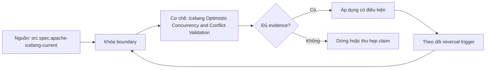

# Iceberg Optimistic Concurrency and Conflict Validation

> [!abstract] Câu hỏi trung tâm
> Concurrent Iceberg writes xung đột ở đâu và khi nào có thể rebase/retry an toàn?

## 1. Optimistic protocol

Hai writers đọc cùng base metadata, tạo immutable files và candidate metadata độc lập. Chỉ một compare-and-swap current metadata location thắng. Loser không được đổi pointer bằng candidate cũ; nó refresh current state, kiểm operation assumptions rồi re-apply metadata action khi safe. Atomic-swap conflict là concurrency signal, chưa đủ kết luận data conflict. Validation semantics của append, overwrite, row-level delete và rewrite khác nhau.

## 2. Append versus overlapping changes

Concurrent appends thường có thể rebase vì mỗi bên thêm disjoint new files, miễn operation constraints vẫn đúng. Dynamic overwrite, replace partitions, delete/update hoặc compaction có thể chạm files/rows mà commit khác đã thay đổi. Retry chỉ an toàn khi predicates/files/sequence assumptions được validate trên new base. Gọi mọi conflict là retryable gây lost update; gọi mọi CAS failure là fatal làm giảm concurrency vô ích.

## 3. Ba lớp conflict

Catalog conflict: current metadata pointer đổi trước swap. File-set conflict: files operation dự định rewrite/delete không còn live hoặc new matching files xuất hiện trong validation scope. Semantic conflict: hai writes hợp lệ ở format layer nhưng vi phạm business uniqueness, balance hoặc version rule. Format validation có thể bắt hai lớp đầu tùy operation/isolation; semantic conflict cần key/invariant reconciliation hoặc upstream coordination.

## 4. Retry budget

Retry loop có maximum attempts, elapsed deadline, exponential backoff+jitter và classification. Metadata planning có thể reuse manifests/data files nhưng candidate metadata/sequence phải cập nhật theo spec. Thundering herd làm catalog pressure tăng; throughput collapse cần đo commit latency, conflicts/attempt, attempts/commit và abandoned files. Sau budget exhaustion, operation báo failure có evidence; không che bằng infinite retry.

## 5. Không mất thay đổi

Success của hai clients không đủ chứng minh both effects present. Oracle xây expected key/file delta cho mỗi writer, đọc committed snapshot rồi reconcile union, deletes và invariants. Snapshot summaries hỗ trợ trace nhưng không thay row-level oracle. Với compaction, row/key set giữ nguyên dù files đổi. Với overwrite, explicit conflict policy quyết định serialized result. Test capture base/current/candidate snapshot IDs và exact validation error.

## 6. Concurrency lab

Chạy append/append, append versus partition overwrite, và compaction versus delete/rewrite trên cùng base barrier. Pin isolation/validation settings. Ghi winner, loser, retry path, files reused, orphans và final key hash. Tăng writers theo steps; đo throughput useful commits, p95 commit latency, conflict ratio và object/metadata amplification. Ngưỡng collapse là workload observation kèm environment, không universal constant. Map mỗi failure sang retry, re-plan hoặc human intervention.

## 7. Ma trận kiểm chứng từng mệnh đề

Mỗi claim phải chỉ rõ metadata scope, writer/reader version, exact fixture, counterexample và oracle. File parse được, plan có predicate hoặc metadata tồn tại chưa đủ để kết luận physical I/O hay semantic result đúng.

### 7.1. Concurrency probe 1: conflict layer, validation assumption, retry class và final-state oracle phải rõ

**Mệnh đề cần kiểm.** Concurrency probe 1: conflict layer, validation assumption, retry class và final-state oracle phải rõ.

**Thiết kế phép thử cho `wiki.storage.iceberg-optimistic-concurrency-conflict-validation`.** Khóa schema, dataset hash, writer/reader/engine versions, storage backend, cache state và configuration. Tạo positive fixture, boundary fixture và negative/counterexample; thay đổi đúng một biến. Lưu footer hoặc metadata-tree locator, query plan, scan counters, requested/transferred bytes nếu có, typed result hash, logs và run ID. Khi công cụ không quan sát được một tầng, ghi `unknown` thay vì suy từ latency hoặc output count.

**Điều kiện chấp nhận cho `wiki.storage.iceberg-optimistic-concurrency-conflict-validation`.** Canonical result phải khớp trước khi so hiệu năng. Observation phải lặp lại trên số run đã định, chỉ ra đơn vị bị loại và cơ chế chịu trách nhiệm. Báo riêng source fact, phần tổng hợp của giáo trình và giả định theo implementation. Chưa chạy lab thì mục này là protocol, chưa phải kết quả thực nghiệm.

### 7.2. Concurrency probe 2: conflict layer, validation assumption, retry class và final-state oracle phải rõ

**Mệnh đề cần kiểm.** Concurrency probe 2: conflict layer, validation assumption, retry class và final-state oracle phải rõ.

**Thiết kế phép thử cho `wiki.storage.iceberg-optimistic-concurrency-conflict-validation`.** Khóa schema, dataset hash, writer/reader/engine versions, storage backend, cache state và configuration. Tạo positive fixture, boundary fixture và negative/counterexample; thay đổi đúng một biến. Lưu footer hoặc metadata-tree locator, query plan, scan counters, requested/transferred bytes nếu có, typed result hash, logs và run ID. Khi công cụ không quan sát được một tầng, ghi `unknown` thay vì suy từ latency hoặc output count.

**Điều kiện chấp nhận cho `wiki.storage.iceberg-optimistic-concurrency-conflict-validation`.** Canonical result phải khớp trước khi so hiệu năng. Observation phải lặp lại trên số run đã định, chỉ ra đơn vị bị loại và cơ chế chịu trách nhiệm. Báo riêng source fact, phần tổng hợp của giáo trình và giả định theo implementation. Chưa chạy lab thì mục này là protocol, chưa phải kết quả thực nghiệm.

### 7.3. Concurrency probe 3: conflict layer, validation assumption, retry class và final-state oracle phải rõ

**Mệnh đề cần kiểm.** Concurrency probe 3: conflict layer, validation assumption, retry class và final-state oracle phải rõ.

**Thiết kế phép thử cho `wiki.storage.iceberg-optimistic-concurrency-conflict-validation`.** Khóa schema, dataset hash, writer/reader/engine versions, storage backend, cache state và configuration. Tạo positive fixture, boundary fixture và negative/counterexample; thay đổi đúng một biến. Lưu footer hoặc metadata-tree locator, query plan, scan counters, requested/transferred bytes nếu có, typed result hash, logs và run ID. Khi công cụ không quan sát được một tầng, ghi `unknown` thay vì suy từ latency hoặc output count.

**Điều kiện chấp nhận cho `wiki.storage.iceberg-optimistic-concurrency-conflict-validation`.** Canonical result phải khớp trước khi so hiệu năng. Observation phải lặp lại trên số run đã định, chỉ ra đơn vị bị loại và cơ chế chịu trách nhiệm. Báo riêng source fact, phần tổng hợp của giáo trình và giả định theo implementation. Chưa chạy lab thì mục này là protocol, chưa phải kết quả thực nghiệm.

### 7.4. Concurrency probe 4: conflict layer, validation assumption, retry class và final-state oracle phải rõ

**Mệnh đề cần kiểm.** Concurrency probe 4: conflict layer, validation assumption, retry class và final-state oracle phải rõ.

**Thiết kế phép thử cho `wiki.storage.iceberg-optimistic-concurrency-conflict-validation`.** Khóa schema, dataset hash, writer/reader/engine versions, storage backend, cache state và configuration. Tạo positive fixture, boundary fixture và negative/counterexample; thay đổi đúng một biến. Lưu footer hoặc metadata-tree locator, query plan, scan counters, requested/transferred bytes nếu có, typed result hash, logs và run ID. Khi công cụ không quan sát được một tầng, ghi `unknown` thay vì suy từ latency hoặc output count.

**Điều kiện chấp nhận cho `wiki.storage.iceberg-optimistic-concurrency-conflict-validation`.** Canonical result phải khớp trước khi so hiệu năng. Observation phải lặp lại trên số run đã định, chỉ ra đơn vị bị loại và cơ chế chịu trách nhiệm. Báo riêng source fact, phần tổng hợp của giáo trình và giả định theo implementation. Chưa chạy lab thì mục này là protocol, chưa phải kết quả thực nghiệm.

### 7.5. Concurrency probe 5: conflict layer, validation assumption, retry class và final-state oracle phải rõ

**Mệnh đề cần kiểm.** Concurrency probe 5: conflict layer, validation assumption, retry class và final-state oracle phải rõ.

**Thiết kế phép thử cho `wiki.storage.iceberg-optimistic-concurrency-conflict-validation`.** Khóa schema, dataset hash, writer/reader/engine versions, storage backend, cache state và configuration. Tạo positive fixture, boundary fixture và negative/counterexample; thay đổi đúng một biến. Lưu footer hoặc metadata-tree locator, query plan, scan counters, requested/transferred bytes nếu có, typed result hash, logs và run ID. Khi công cụ không quan sát được một tầng, ghi `unknown` thay vì suy từ latency hoặc output count.

**Điều kiện chấp nhận cho `wiki.storage.iceberg-optimistic-concurrency-conflict-validation`.** Canonical result phải khớp trước khi so hiệu năng. Observation phải lặp lại trên số run đã định, chỉ ra đơn vị bị loại và cơ chế chịu trách nhiệm. Báo riêng source fact, phần tổng hợp của giáo trình và giả định theo implementation. Chưa chạy lab thì mục này là protocol, chưa phải kết quả thực nghiệm.

### 7.6. Concurrency probe 6: conflict layer, validation assumption, retry class và final-state oracle phải rõ

**Mệnh đề cần kiểm.** Concurrency probe 6: conflict layer, validation assumption, retry class và final-state oracle phải rõ.

**Thiết kế phép thử cho `wiki.storage.iceberg-optimistic-concurrency-conflict-validation`.** Khóa schema, dataset hash, writer/reader/engine versions, storage backend, cache state và configuration. Tạo positive fixture, boundary fixture và negative/counterexample; thay đổi đúng một biến. Lưu footer hoặc metadata-tree locator, query plan, scan counters, requested/transferred bytes nếu có, typed result hash, logs và run ID. Khi công cụ không quan sát được một tầng, ghi `unknown` thay vì suy từ latency hoặc output count.

**Điều kiện chấp nhận cho `wiki.storage.iceberg-optimistic-concurrency-conflict-validation`.** Canonical result phải khớp trước khi so hiệu năng. Observation phải lặp lại trên số run đã định, chỉ ra đơn vị bị loại và cơ chế chịu trách nhiệm. Báo riêng source fact, phần tổng hợp của giáo trình và giả định theo implementation. Chưa chạy lab thì mục này là protocol, chưa phải kết quả thực nghiệm.

### 7.7. Concurrency probe 7: conflict layer, validation assumption, retry class và final-state oracle phải rõ

**Mệnh đề cần kiểm.** Concurrency probe 7: conflict layer, validation assumption, retry class và final-state oracle phải rõ.

**Thiết kế phép thử cho `wiki.storage.iceberg-optimistic-concurrency-conflict-validation`.** Khóa schema, dataset hash, writer/reader/engine versions, storage backend, cache state và configuration. Tạo positive fixture, boundary fixture và negative/counterexample; thay đổi đúng một biến. Lưu footer hoặc metadata-tree locator, query plan, scan counters, requested/transferred bytes nếu có, typed result hash, logs và run ID. Khi công cụ không quan sát được một tầng, ghi `unknown` thay vì suy từ latency hoặc output count.

**Điều kiện chấp nhận cho `wiki.storage.iceberg-optimistic-concurrency-conflict-validation`.** Canonical result phải khớp trước khi so hiệu năng. Observation phải lặp lại trên số run đã định, chỉ ra đơn vị bị loại và cơ chế chịu trách nhiệm. Báo riêng source fact, phần tổng hợp của giáo trình và giả định theo implementation. Chưa chạy lab thì mục này là protocol, chưa phải kết quả thực nghiệm.

### 7.8. Concurrency probe 8: conflict layer, validation assumption, retry class và final-state oracle phải rõ

**Mệnh đề cần kiểm.** Concurrency probe 8: conflict layer, validation assumption, retry class và final-state oracle phải rõ.

**Thiết kế phép thử cho `wiki.storage.iceberg-optimistic-concurrency-conflict-validation`.** Khóa schema, dataset hash, writer/reader/engine versions, storage backend, cache state và configuration. Tạo positive fixture, boundary fixture và negative/counterexample; thay đổi đúng một biến. Lưu footer hoặc metadata-tree locator, query plan, scan counters, requested/transferred bytes nếu có, typed result hash, logs và run ID. Khi công cụ không quan sát được một tầng, ghi `unknown` thay vì suy từ latency hoặc output count.

**Điều kiện chấp nhận cho `wiki.storage.iceberg-optimistic-concurrency-conflict-validation`.** Canonical result phải khớp trước khi so hiệu năng. Observation phải lặp lại trên số run đã định, chỉ ra đơn vị bị loại và cơ chế chịu trách nhiệm. Báo riêng source fact, phần tổng hợp của giáo trình và giả định theo implementation. Chưa chạy lab thì mục này là protocol, chưa phải kết quả thực nghiệm.

### 7.9. Concurrency probe 9: conflict layer, validation assumption, retry class và final-state oracle phải rõ

**Mệnh đề cần kiểm.** Concurrency probe 9: conflict layer, validation assumption, retry class và final-state oracle phải rõ.

**Thiết kế phép thử cho `wiki.storage.iceberg-optimistic-concurrency-conflict-validation`.** Khóa schema, dataset hash, writer/reader/engine versions, storage backend, cache state và configuration. Tạo positive fixture, boundary fixture và negative/counterexample; thay đổi đúng một biến. Lưu footer hoặc metadata-tree locator, query plan, scan counters, requested/transferred bytes nếu có, typed result hash, logs và run ID. Khi công cụ không quan sát được một tầng, ghi `unknown` thay vì suy từ latency hoặc output count.

**Điều kiện chấp nhận cho `wiki.storage.iceberg-optimistic-concurrency-conflict-validation`.** Canonical result phải khớp trước khi so hiệu năng. Observation phải lặp lại trên số run đã định, chỉ ra đơn vị bị loại và cơ chế chịu trách nhiệm. Báo riêng source fact, phần tổng hợp của giáo trình và giả định theo implementation. Chưa chạy lab thì mục này là protocol, chưa phải kết quả thực nghiệm.

### 7.10. Concurrency probe 10: conflict layer, validation assumption, retry class và final-state oracle phải rõ

**Mệnh đề cần kiểm.** Concurrency probe 10: conflict layer, validation assumption, retry class và final-state oracle phải rõ.

**Thiết kế phép thử cho `wiki.storage.iceberg-optimistic-concurrency-conflict-validation`.** Khóa schema, dataset hash, writer/reader/engine versions, storage backend, cache state và configuration. Tạo positive fixture, boundary fixture và negative/counterexample; thay đổi đúng một biến. Lưu footer hoặc metadata-tree locator, query plan, scan counters, requested/transferred bytes nếu có, typed result hash, logs và run ID. Khi công cụ không quan sát được một tầng, ghi `unknown` thay vì suy từ latency hoặc output count.

**Điều kiện chấp nhận cho `wiki.storage.iceberg-optimistic-concurrency-conflict-validation`.** Canonical result phải khớp trước khi so hiệu năng. Observation phải lặp lại trên số run đã định, chỉ ra đơn vị bị loại và cơ chế chịu trách nhiệm. Báo riêng source fact, phần tổng hợp của giáo trình và giả định theo implementation. Chưa chạy lab thì mục này là protocol, chưa phải kết quả thực nghiệm.

### 7.11. Concurrency probe 11: conflict layer, validation assumption, retry class và final-state oracle phải rõ

**Mệnh đề cần kiểm.** Concurrency probe 11: conflict layer, validation assumption, retry class và final-state oracle phải rõ.

**Thiết kế phép thử cho `wiki.storage.iceberg-optimistic-concurrency-conflict-validation`.** Khóa schema, dataset hash, writer/reader/engine versions, storage backend, cache state và configuration. Tạo positive fixture, boundary fixture và negative/counterexample; thay đổi đúng một biến. Lưu footer hoặc metadata-tree locator, query plan, scan counters, requested/transferred bytes nếu có, typed result hash, logs và run ID. Khi công cụ không quan sát được một tầng, ghi `unknown` thay vì suy từ latency hoặc output count.

**Điều kiện chấp nhận cho `wiki.storage.iceberg-optimistic-concurrency-conflict-validation`.** Canonical result phải khớp trước khi so hiệu năng. Observation phải lặp lại trên số run đã định, chỉ ra đơn vị bị loại và cơ chế chịu trách nhiệm. Báo riêng source fact, phần tổng hợp của giáo trình và giả định theo implementation. Chưa chạy lab thì mục này là protocol, chưa phải kết quả thực nghiệm.

### 7.12. Concurrency probe 12: conflict layer, validation assumption, retry class và final-state oracle phải rõ

**Mệnh đề cần kiểm.** Concurrency probe 12: conflict layer, validation assumption, retry class và final-state oracle phải rõ.

**Thiết kế phép thử cho `wiki.storage.iceberg-optimistic-concurrency-conflict-validation`.** Khóa schema, dataset hash, writer/reader/engine versions, storage backend, cache state và configuration. Tạo positive fixture, boundary fixture và negative/counterexample; thay đổi đúng một biến. Lưu footer hoặc metadata-tree locator, query plan, scan counters, requested/transferred bytes nếu có, typed result hash, logs và run ID. Khi công cụ không quan sát được một tầng, ghi `unknown` thay vì suy từ latency hoặc output count.

**Điều kiện chấp nhận cho `wiki.storage.iceberg-optimistic-concurrency-conflict-validation`.** Canonical result phải khớp trước khi so hiệu năng. Observation phải lặp lại trên số run đã định, chỉ ra đơn vị bị loại và cơ chế chịu trách nhiệm. Báo riêng source fact, phần tổng hợp của giáo trình và giả định theo implementation. Chưa chạy lab thì mục này là protocol, chưa phải kết quả thực nghiệm.

### 7.13. Concurrency probe 13: conflict layer, validation assumption, retry class và final-state oracle phải rõ

**Mệnh đề cần kiểm.** Concurrency probe 13: conflict layer, validation assumption, retry class và final-state oracle phải rõ.

**Thiết kế phép thử cho `wiki.storage.iceberg-optimistic-concurrency-conflict-validation`.** Khóa schema, dataset hash, writer/reader/engine versions, storage backend, cache state và configuration. Tạo positive fixture, boundary fixture và negative/counterexample; thay đổi đúng một biến. Lưu footer hoặc metadata-tree locator, query plan, scan counters, requested/transferred bytes nếu có, typed result hash, logs và run ID. Khi công cụ không quan sát được một tầng, ghi `unknown` thay vì suy từ latency hoặc output count.

**Điều kiện chấp nhận cho `wiki.storage.iceberg-optimistic-concurrency-conflict-validation`.** Canonical result phải khớp trước khi so hiệu năng. Observation phải lặp lại trên số run đã định, chỉ ra đơn vị bị loại và cơ chế chịu trách nhiệm. Báo riêng source fact, phần tổng hợp của giáo trình và giả định theo implementation. Chưa chạy lab thì mục này là protocol, chưa phải kết quả thực nghiệm.

### 7.14. Concurrency probe 14: conflict layer, validation assumption, retry class và final-state oracle phải rõ

**Mệnh đề cần kiểm.** Concurrency probe 14: conflict layer, validation assumption, retry class và final-state oracle phải rõ.

**Thiết kế phép thử cho `wiki.storage.iceberg-optimistic-concurrency-conflict-validation`.** Khóa schema, dataset hash, writer/reader/engine versions, storage backend, cache state và configuration. Tạo positive fixture, boundary fixture và negative/counterexample; thay đổi đúng một biến. Lưu footer hoặc metadata-tree locator, query plan, scan counters, requested/transferred bytes nếu có, typed result hash, logs và run ID. Khi công cụ không quan sát được một tầng, ghi `unknown` thay vì suy từ latency hoặc output count.

**Điều kiện chấp nhận cho `wiki.storage.iceberg-optimistic-concurrency-conflict-validation`.** Canonical result phải khớp trước khi so hiệu năng. Observation phải lặp lại trên số run đã định, chỉ ra đơn vị bị loại và cơ chế chịu trách nhiệm. Báo riêng source fact, phần tổng hợp của giáo trình và giả định theo implementation. Chưa chạy lab thì mục này là protocol, chưa phải kết quả thực nghiệm.

### 7.15. Concurrency probe 15: conflict layer, validation assumption, retry class và final-state oracle phải rõ

**Mệnh đề cần kiểm.** Concurrency probe 15: conflict layer, validation assumption, retry class và final-state oracle phải rõ.

**Thiết kế phép thử cho `wiki.storage.iceberg-optimistic-concurrency-conflict-validation`.** Khóa schema, dataset hash, writer/reader/engine versions, storage backend, cache state và configuration. Tạo positive fixture, boundary fixture và negative/counterexample; thay đổi đúng một biến. Lưu footer hoặc metadata-tree locator, query plan, scan counters, requested/transferred bytes nếu có, typed result hash, logs và run ID. Khi công cụ không quan sát được một tầng, ghi `unknown` thay vì suy từ latency hoặc output count.

**Điều kiện chấp nhận cho `wiki.storage.iceberg-optimistic-concurrency-conflict-validation`.** Canonical result phải khớp trước khi so hiệu năng. Observation phải lặp lại trên số run đã định, chỉ ra đơn vị bị loại và cơ chế chịu trách nhiệm. Báo riêng source fact, phần tổng hợp của giáo trình và giả định theo implementation. Chưa chạy lab thì mục này là protocol, chưa phải kết quả thực nghiệm.

## 8. Quy trình phản biện

1. Xác định tầng đang nói: object store, file, table metadata, catalog hay engine.
2. Viết identity và publication boundary trước khi bàn hiệu năng.
3. Tách metadata presence, planner intent, executed pruning và physical I/O.
4. Kiểm semantic result bằng typed oracle trước benchmark.
5. Pin version, configuration, cache state và metric definition.
6. Ghi counterexample, limitation và reversal condition cho recommendation.

## 9. Câu hỏi tự kiểm tra

1. Đơn vị đang xét là file, row group, column chunk, page, manifest hay snapshot?
2. Metadata nào authoritative và lấy từ locator nào?
3. Reader có dùng metadata hay chỉ có khả năng dùng?
4. Parse/decode thành công có che semantic mismatch không?
5. Failure ở trước hay sau publication boundary?
6. Bằng chứng nào còn là protocol chưa chạy?

## 10. Giới hạn và điều chưa cho phép kết luận

- Chưa chạy Parquet footer/page-index lab hoặc Iceberg metadata trace trên engine/catalog thật.
- Đặc tả được kiểm ngày 2026-10-02; implementation behavior phải pin version.
- Matrices và lab protocols là synthesis của giáo trình, không gán nguyên văn cho một nguồn.
- Note giữ trạng thái `review` tới khi chủ dự án duyệt.

## Reference
1. [[SRC-APACHE-ICEBERG-SPEC]]
2. [[SRC-APACHE-ICEBERG-RELIABILITY]]

## Source coverage

| Source slice | Nội dung sử dụng | Trạng thái |
|---|---|---|
| [[SRC-APACHE-ICEBERG-SPEC]] | Format/table contract, implementation boundary hoặc workload context | Đã đọc locator; không suy ngoài phạm vi |
| [[SRC-APACHE-ICEBERG-RELIABILITY]] | Format/table contract, implementation boundary hoặc workload context | Đã đọc locator; không suy ngoài phạm vi |

## Key takeaways
- Mọi claim phải đúng tầng và đúng granularity.
- Metadata hiện diện, planner intent, executed pruning và physical I/O là bốn bằng chứng khác nhau.
- Semantic oracle được kiểm trước performance attribution.
- Chưa chạy lab thì note cung cấp giáo trình và protocol, chưa phải certification cho production.

<!-- ATOMIC-EXECUTION-CAPSULE:START -->

## Execution capsule — kiểm chứng `wiki.storage.iceberg-optimistic-concurrency-conflict-validation`

> [!important] Phân loại mệnh đề
> Với `wiki.storage.iceberg-optimistic-concurrency-conflict-validation`, sơ đồ, ví dụ và artifact về **Iceberg Optimistic Concurrency and Conflict Validation** là **synthesis để kiểm chứng**; chúng không phải trích dẫn hay case nguyên văn của nguồn.

### Sơ đồ cơ chế và điểm kiểm soát



Đọc sơ đồ `wiki.storage.iceberg-optimistic-concurrency-conflict-validation` từ trái sang phải: source chỉ cung cấp claim ban đầu cho **Iceberg Optimistic Concurrency and Conflict Validation**; quyết định chỉ được đi tiếp sau khi boundary, evidence và điều kiện đảo quyết định đã hiện hữu.

### Ví dụ làm việc có thể bác bỏ

**Input.** Một đội cần trả lời: “Concurrent Iceberg writes xung đột ở đâu và khi nào có thể rebase/retry an toàn?” cho một phạm vi nhỏ, có owner và deadline rõ.

**Decision.** Đội áp dụng **Iceberg Optimistic Concurrency and Conflict Validation** trên control và variant chỉ khác một assumption; expected result và hard constraints được khóa trước khi chạy.

**Outcome.** Với `wiki.storage.iceberg-optimistic-concurrency-conflict-validation`, nếu observation vi phạm hard constraint hoặc oracle độc lập không xác nhận **Iceberg Optimistic Concurrency and Conflict Validation**, đội thu hẹp claim hay đảo quyết định. Nếu đạt, kết luận vẫn kèm scope, version và review date; một lần thành công không được nâng thành quy luật phổ quát.

### Artifact thực thi tối thiểu

```sql
-- Verification harness for: Iceberg Optimistic Concurrency and Conflict Validation
WITH evidence AS (
    SELECT 'wiki.storage.iceberg-optimistic-concurrency-conflict-validation' AS concept_id,
           'boundary_declared' AS check_name, 1 AS passed
    UNION ALL
    SELECT 'wiki.storage.iceberg-optimistic-concurrency-conflict-validation', 'independent_oracle', 1
    UNION ALL
    SELECT 'wiki.storage.iceberg-optimistic-concurrency-conflict-validation', 'reversal_trigger_recorded', 1
)
SELECT concept_id,
       MIN(passed) AS all_hard_checks_pass,
       COUNT(*) AS evidence_items
FROM evidence
GROUP BY concept_id
HAVING MIN(passed) = 1;
```

Artifact của `wiki.storage.iceberg-optimistic-concurrency-conflict-validation` buộc người dùng ghi boundary, oracle và reversal trigger cho **Iceberg Optimistic Concurrency and Conflict Validation**. Các giá trị minh họa phải được thay bằng evidence thật trước khi dùng cho quyết định.

### Tự kiểm tra trước khi tái sử dụng

1. Bạn có thể trả lời `Concurrent Iceberg writes xung đột ở đâu và khi nào có thể rebase/retry an toàn?` bằng một câu mà không kéo thêm concept thứ hai không?
2. Source locator nào đỡ cho claim, và phần nào chỉ là synthesis trong note?
3. Observation nào khiến bạn dừng, thu hẹp hoặc đảo quyết định?
4. Artifact nào cho phép một reviewer độc lập tái hiện kết quả?

<!-- ATOMIC-EXECUTION-CAPSULE:END -->
