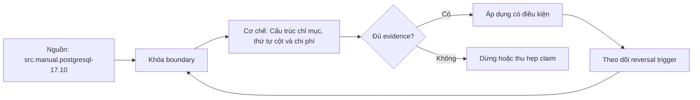

# Cấu trúc chỉ mục, thứ tự cột và chi phí

> [!abstract] Câu hỏi trung tâm
> Workload nào cần access path nào, thứ tự key và payload được chọn theo predicate/order ra sao, và evidence nào cho thấy portfolio đáng chi phí ghi, dung lượng và vận hành?

## 1. Chỉ mục là cấu trúc phụ có giá

Index lưu mapping từ key có thứ tự hoặc access-method-specific representation đến heap tuples. Nó tăng thêm cách tìm rows nhưng phải được tạo, lưu, cập nhật, vacuum và cache. Mỗi index là một bản sao cấu trúc phụ của dữ liệu, không phải metadata miễn phí.

Thiết kế bắt đầu từ workload: query frequency/latency/SLO, predicates, joins, order/group, projected columns, table size, write mix và concurrency. Cột xuất hiện trong WHERE mới là tín hiệu, chưa đủ để tạo index.

Portfolio tốt tối ưu tổng chi phí có trọng số, không từng query riêng. Hai indexes trùng prefix có thể redundant; một index đặc biệt cho query hiếm có thể không đáng.

## 2. B-tree mechanics

PostgreSQL B-tree là balanced tree với root/internal/leaf pages; leaf entries ordered theo index keys và trỏ heap tuples. Search equality/range đi từ root xuống leaf; leaf traversal hỗ trợ ordered scan. Split/bloat/cache locality ảnh hưởng vận hành.

B-tree hỗ trợ comparison operators theo operator class, equality/range, ordered output, min/max và prefix of ordering. Nó không tự tối ưu arbitrary function/pattern/type; operator class/collation quan trọng.

Heap vẫn lưu row version và visibility. Regular index scan fetch heap; index-only có điều kiện coverage/visibility.

## 3. Selectivity không phải quy tắc duy nhất

Index thường hữu ích khi predicate chọn ít rows, nhưng planner cân pages, correlation, cache, output order, LIMIT và index-only coverage. Query lấy nhiều rows có thể vẫn dùng index vì ORDER BY LIMIT; query chọn ít nhưng function/cast mismatch có thể không dùng.

Không có ngưỡng 5%/20% phổ quát. Dataset/hardware/cost model quyết định. Benchmark cả hot/cold cache và representative parameters.

Seq scan trên bảng nhỏ hoặc analytics là hợp lý. Mục tiêu là SLO/throughput, không tỷ lệ index usage tối đa.

## 4. Multicolumn B-tree và leftmost columns

Với B-tree `(a,b,c)`, equality constraints trên leading columns và inequality trên cột kế tiếp thường giới hạn contiguous scan tốt nhất. Query `a=?`, `(a,b)`, `(a,b,c)` là patterns tự nhiên. Predicate chỉ trên `b` thường không có conventional leading-key navigation.

Nhưng không được nói không bao giờ dùng: PostgreSQL 17 manual mô tả skip scan trong một số điều kiện, engine có thể lặp distinct leading values để khai thác later column khi dự kiến có lợi. Nó phụ thuộc NDV/selectivity/cost và có thể vẫn scan phần lớn index.

Lab index sai thứ tự không được dùng phải dựng data/workload và quan sát plan, không biến thành luật tuyệt đối. Kết luận đúng là order ảnh hưởng khả năng giới hạn scan và cost.

## 5. Chọn thứ tự cột

Quy tắc không đơn giản cột selectivity cao trước. Xem equality, range, ordering, grouping, join và query family. Thường đặt equality keys dùng chung trước, rồi range/order; nhưng một order khác có thể phục vụ nhiều queries hơn.

Ví dụ `(tenant_id, status, created_at DESC)` hỗ trợ tenant+status+time range/order. Nếu query chủ yếu tenant+time không status, status ở giữa có thể cản ordered range. Có thể cần `(tenant_id, created_at)` thay vì thêm mọi cột.

Thống kê query log để weight. Thiết kế indexes candidates rồi so portfolio, không đo từng index cô lập.

## 6. Ordering và mixed direction

B-tree scan tiến/lùi, nên index ascending có thể phục vụ reverse ordering toàn bộ. Mixed order như `ORDER BY x ASC, y DESC` có thể cần index direction tương ứng `(x ASC, y DESC)`; `(x,y)` không luôn tránh sort cho mixed request.

NULLS FIRST/LAST và collation cũng thuộc order semantics. Planner có thể dùng incremental sort khi prefix order có sẵn.

Index order chỉ bảo đảm path output khi plan chọn nó; final query vẫn cần ORDER BY cho contract.

## 7. Covering và INCLUDE

Key columns định search/order/uniqueness. INCLUDE columns là non-key payload để cover projection và mở khả năng index-only. Chúng không dùng cho search key và làm index rộng hơn.

Index-only scan cần query columns trong index và heap pages all-visible. Update-heavy table có heap fetch nhiều. Đo `Heap Fetches`, visibility/vacuum regime, buffers và index size.

Không INCLUDE large/wide columns vô tội vạ; index tuple size/storage/cache/write cost tăng. Uniqueness chỉ áp key, không INCLUDE.

## 8. Partial index

Partial index chỉ chứa rows thỏa predicate, giảm size/write cho subset. Hữu ích khi workload luôn query active/unprocessed/rare state và predicate có thể được planner chứng minh imply index predicate.

Parameterized queries và logically equivalent nhưng syntactically khó suy có thể không match partial index. Predicate phải stable/immutable theo rules. Data distribution thay đổi làm subset không còn nhỏ.

Partial unique index còn enforce conditional uniqueness, ví dụ unique email cho active users. Đây là invariant, không chỉ performance.

## 9. Expression index

Expression index lưu kết quả như `lower(email)` và phục vụ predicate cùng expression. Nó có thể enforce normalized uniqueness. Function cần phù hợp volatility/immutability; collation/type/cast phải match.

Expression index thêm compute cost trên write và storage. Nếu only need stats, expression statistics có thể phù hợp hơn. Nếu query có thể chuẩn hóa write vào generated/normalized column, so maintainability.

Đừng sửa sargability bằng index cho mọi wrapper; đôi khi rewrite predicate bảo toàn semantics tốt hơn.

## 10. Unique indexes và constraints

UNIQUE constraint thường được hỗ trợ bằng unique index và bảo vệ concurrency. Index performance và invariant ownership liên quan nhưng không đồng nhất: không drop index backing constraint chỉ vì `idx_scan=0`.

Primary/unique/FK relationships giúp correctness/planner. Redundant manually-created index trùng constraint index có thể bỏ sau dependency check.

NULL semantics (`NULLS DISTINCT` mặc định hay `NULLS NOT DISTINCT`) phải theo domain.

## 11. Bitmap combination và nhiều single indexes

PostgreSQL có thể combine indexes bằng bitmap AND/OR, nên hai single-column indexes đôi lúc phục vụ conjunction. Nhưng bitmap mất ordered output và có overhead; multicolumn index có thể tốt hơn frequent combination.

Ngược lại, multicolumn index không thay mọi single-column access. Portfolio design dựa query frequencies và alternate predicates.

Tạo index cho từng column rồi trông chờ bitmap là over-indexing phổ biến.

## 12. Write amplification

INSERT phải thêm entry vào mọi applicable index. UPDATE cột indexed cần index maintenance; nhiều indexes có thể làm HOT update không thực hiện được khi indexed columns đổi, tăng heap/index bloat và WAL. DELETE để dead entries cần vacuum cleanup.

Chi phí gồm CPU, random/page writes, WAL, replication/network, cache pollution, checkpoint/recovery, backup và storage. Đo write throughput/p95 latency, WAL bytes, table/index size, HOT ratio và vacuum behavior.

Không chỉ đo single-thread insert; concurrency và batch pattern quan trọng.

## 13. Build/rebuild vận hành

Regular `CREATE INDEX` có locking behavior; `CREATE INDEX CONCURRENTLY` giảm blocking writes nhưng chạy nhiều phases, tốn lâu/tài nguyên, có thể để invalid index nếu fail và không chạy trong transaction block theo restrictions. Tra manual đúng version.

Monitor progress, disk headroom, replication lag và invalid indexes. Reindex cũng có variants/trade-offs. Không tạo nhiều indexes lớn đồng thời mà không capacity budget.

Rollout: create one candidate, analyze, measure, observe, then next. Rollback là drop có kiểm soát sau dependency review.

## 14. Tìm index ít dùng

`pg_stat_user_indexes.idx_scan` và last scan/size giúp tìm candidates. Nhưng counters reset/restart, monitoring window có thể bỏ monthly/quarterly jobs, standby usage khác primary, constraint indexes có correctness role, planner stats queries có thể hiếm nhưng critical.

Zero scans là tín hiệu điều tra, không proof để drop. Xác định stats reset, full business cycle, query logs, dependencies, replicas và incident/maintenance workloads. Hypothetical/drop-in-staging test nếu có.

Sau drop, monitor SLO và có recreate definition/rollback.

## 15. Redundant và overlapping indexes

Exact duplicate indexes rõ ràng tốn chi phí. Prefix overlap như `(a)` và `(a,b)` có thể khiến `(a)` redundant cho search, nhưng index nhỏ hơn có cache/write/order lợi ích; unique/include/opclass/predicate khác làm không tương đương.

So definitions: access method, keys/order/collation/opclass, INCLUDE, predicate, uniqueness, validity. Không chỉ so column names.

Portfolio review cần workload evidence và benchmark after removal.

## 16. Lab với 50 truy vấn

Chuẩn hóa query log thành fingerprints, giữ frequency, latency distribution, rows, parameters classes và SLO. Chọn representative set thay vì 50 text duplicates. Lập matrix query→candidate index→expected benefit/cost.

Baseline trên fixed snapshot và controlled load. Tạo portfolio, ANALYZE, rerun cùng parameters/concurrency. Đo read p50/p95/p99, throughput, plans/buffers; chạy write workload trước/sau và đo WAL/storage/HOT.

Cố ý tạo `(a,b)` trong khi workload chỉ lọc b trên data khiến skip scan không lợi; chứng minh plan không chọn trong fixture đó, không tuyên bố universal.

## 17. Decision table

Mỗi candidate ghi query coverage, frequency/SLO, predicate/order, current plan, estimated benefit, index size, write rate, build lock/disk risk, redundancy và owner. Quyết định create/keep/drop/defer kèm evidence.

Một index đọc nhanh 10× có thể bị từ chối nếu query chạy mỗi tháng còn writes giảm 30%. Ngược lại, critical lookup hiếm có SLO cứng có thể đáng.

Không dùng một score mơ hồ; giữ raw metrics và priorities.

## 18. Anti-patterns

Các lỗi: index mọi WHERE column; selectivity cao luôn đặt đầu; bỏ qua skip scan nuance; covering index chứa mọi column; partial predicate không match query; function/cast khác expression; drop vì idx_scan zero; benchmark read không đo write; ép index scan khi seq scan đúng.

Một lỗi khác là thêm index để che estimate sai, rồi plan khác vẫn xấu khi parameter thay đổi.

## 19. Câu hỏi tự kiểm tra

1. Vì sao leftmost rule không nên phát biểu cột thứ hai tuyệt đối không dùng ở PostgreSQL 17?
2. INCLUDE khác key columns thế nào?
3. Index-only scan cần visibility condition gì?
4. Partial index predicate matching có giới hạn nào?
5. Write amplification gồm những chi phí nào?
6. Vì sao idx_scan=0 chưa đủ để drop?

## 20. Giới hạn và điều chưa cho phép kết luận

- Index usefulness phụ thuộc workload, data, cache, hardware và PostgreSQL version.
- Skip scan là cost-based và không bảo đảm được chọn.
- Statistics counters có thể reset và không phản ánh standby/seasonal traffic.
- Benchmark lab không chứng minh production capacity nếu concurrency khác.
- Bộ 50 query và write benchmark chưa chạy; evidence thuộc `after-note.md`.

## Reference
1. [[SRC-POSTGRESQL-17-10-MANUAL]]: multicolumn, expression, partial và index-only indexes.
2. [[SRC-MASTERING-POSTGRESQL-17-6E]]: index cost, combined/functional/partial indexes và runtime usage.
3. [[SRC-ROGOV-POSTGRESQL-14-INTERNALS]]: B-tree/index scan/index-only cost mechanisms.

## Source coverage

| Source slice | Nội dung phải giữ | Vị trí trong note | Trạng thái |
|---|---|---|---|
| [[SRC-POSTGRESQL-17-10-MANUAL]], PDF 488-498 | multicolumn/skip scan, expression, partial, index-only | §§4-10 | Đã giữ nuance 17.10 |
| [[SRC-MASTERING-POSTGRESQL-17-6E]], PDF 87-112, 198-202 | index design/cost/unused stats | §§1-18 | Đã bỏ ngưỡng cứng |
| [[SRC-ROGOV-POSTGRESQL-14-INTERNALS]], PDF 330-349 | index scan mechanisms/cost | §§2-7 | Đã đối chiếu manual 17.10 |
| Tổng hợp DE-L129 | 50-query portfolio, read/write evidence | §§16-18 | Đã thành decision protocol |

## Key takeaways
- Index là portfolio decision từ workload, không phải phản xạ cho từng WHERE column.
- Multicolumn order theo equality/range/order/query family; PostgreSQL 17 có skip-scan nuance.
- Covering/index-only còn phụ thuộc visibility, không chỉ danh sách cột.
- Mọi read gain phải đặt cạnh write, WAL, storage, vacuum và build risk.
- Index ít dùng chỉ là candidate review; constraint, resets và seasonal traffic phải được kiểm.

<!-- ATOMIC-EXECUTION-CAPSULE:START -->

## Execution capsule: kiểm chứng `wiki.database.index-structure-composite-order-cost`

> [!important] Phân loại mệnh đề
> Với `wiki.database.index-structure-composite-order-cost`, sơ đồ, ví dụ và artifact về **Cấu trúc chỉ mục, thứ tự cột và chi phí** là **synthesis để kiểm chứng**; chúng không phải trích dẫn hay case nguyên văn của nguồn.

### Sơ đồ cơ chế và điểm kiểm soát



Đọc sơ đồ `wiki.database.index-structure-composite-order-cost` từ trái sang phải: source chỉ cung cấp claim ban đầu cho **Cấu trúc chỉ mục, thứ tự cột và chi phí**; quyết định chỉ được đi tiếp sau khi boundary, evidence và điều kiện đảo quyết định đã hiện hữu.

### Artifact thực thi tối thiểu

```sql
-- Verification harness for: Cấu trúc chỉ mục, thứ tự cột và chi phí
WITH evidence AS (
    SELECT 'wiki.database.index-structure-composite-order-cost' AS concept_id,
           'boundary_declared' AS check_name, 1 AS passed
    UNION ALL
    SELECT 'wiki.database.index-structure-composite-order-cost', 'independent_oracle', 1
    UNION ALL
    SELECT 'wiki.database.index-structure-composite-order-cost', 'reversal_trigger_recorded', 1
)
SELECT concept_id,
       MIN(passed) AS all_hard_checks_pass,
       COUNT(*) AS evidence_items
FROM evidence
GROUP BY concept_id
HAVING MIN(passed) = 1;
```

Artifact của `wiki.database.index-structure-composite-order-cost` buộc người dùng ghi boundary, oracle và reversal trigger cho **Cấu trúc chỉ mục, thứ tự cột và chi phí**. Các giá trị minh họa phải được thay bằng evidence thật trước khi dùng cho quyết định.

### Tự kiểm tra trước khi tái sử dụng

1. Bạn có thể trả lời `Làm sao thiết kế portfolio chỉ mục từ workload, dự đoán cột/order/coverage, và định lượng cả read benefit lẫn write/storage cost?` bằng một câu mà không kéo thêm concept thứ hai không?
2. Source locator nào đỡ cho claim, và phần nào chỉ là synthesis trong note?
3. Observation nào khiến bạn dừng, thu hẹp hoặc đảo quyết định?
4. Artifact nào cho phép một reviewer độc lập tái hiện kết quả?

<!-- ATOMIC-EXECUTION-CAPSULE:END -->
