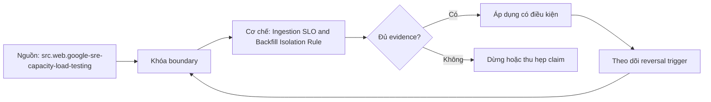

# Ingestion SLO and Backfill Isolation Rule

> [!abstract] Câu hỏi trung tâm
> Định nghĩa ingestion SLO và cô lập backfill thế nào để phục hồi lịch sử không phá dữ liệu mới?

## 1. SLI từ consumer deadline

Freshness đo event/source-boundary tới publish-ready, không lấy job success làm proxy. Completeness đo accepted expected units tại boundary; correctness dựa reconciliation residual; availability đo khả năng đọc published data. Chọn percentile/window, population và exclusions. Mỗi SLI có exact query, clocks, owner và data-delay semantics.

## 2. SLO và error budget

SLO là target theo rolling window cùng burn alerts; không phải 100% slogan. Tách daily path và historical backfill populations. Error budget giúp quyết định freeze change, giảm concurrency hoặc ưu tiên remediation. Một run xanh nhưng checkpoint lag tăng vẫn có thể vi phạm freshness. Dashboard phải hiển thị denominator và missing telemetry.

## 3. Backfill là workload khác

Backfill đọc volume lớn, dùng historical schema, có late/delete/restate semantics và tạo write amplification. Nó cần queue, worker pool, source quota, storage namespace, target compute và checkpoint riêng. Daily path giữ reserved capacity và priority. Không dùng cùng watermark state hoặc overwrite current publication bằng partial historical range.

## 4. Admission và isolation

Áp max in-flight, rate/compute budget, partition lease, pause threshold và maintenance window theo source/target. Capacity test xác định safe envelope; production backfill bắt đầu nhỏ và ramp theo lag/error signals. Khi daily freshness burn tăng, backfill tự giảm hoặc dừng. Isolation được chứng minh bằng noisy-neighbor experiment, không bằng tên queue.

## 5. Publication và reconciliation

Backfill ghi versioned partitions/table branch, reconcile theo range rồi atomic publish/swap. Nếu sửa lịch sử, policy nêu affected metrics, notification, restatement version và rollback. Idempotent range identity ngăn double apply. Daily and backfill overlap cần precedence hoặc same canonical merge rule; nếu không, kết quả phụ thuộc race.

## 6. SLO experiment

Chạy daily stream ở steady load; thêm backfill 1x, 2x, 4x trong sandbox. Đo p50/p95 freshness, source latency, throttling, target queue, checkpoint lag và reconciliation. Chứng minh daily SLO giữ trong envelope; inject backfill failure/restart và overlapping range. Ghi reversal threshold, chưa biến test thành universal capacity claim.

## 7. Ma trận kiểm chứng từng mệnh đề

Mỗi claim phải gắn source/entity boundary, exact fixture, checkpoint/input state, counterexample và independent reconciliation oracle. Connector chạy thành công hoặc API trả 2xx chưa chứng minh completeness.

### 7.1. Ingestion-SLO probe 1: SLI population, deadline, backfill resource, isolation signal và stop rule phải cụ thể

**Mệnh đề cần kiểm.** Ingestion-SLO probe 1: SLI population, deadline, backfill resource, isolation signal và stop rule phải cụ thể.

**Thiết kế phép thử cho `wiki.ingestion.ingestion-slo-backfill-isolation`.** Khóa source/API version, entity, grain/key, time boundary, schema, pagination/cursor configuration và failure schedule. Tạo positive, boundary và negative fixtures; thay đổi đúng một assumption. Lưu request/query, response/raw extract hash, checkpoint trước/sau, landing objects, target state và source-at-boundary oracle.

**Điều kiện chấp nhận cho `wiki.ingestion.ingestion-slo-backfill-isolation`.** Count, key set, typed field hash và delete state khớp contract; duplicates được giải thích và dedup có identity rõ. Observation, inference và unknown được báo riêng. Lab chưa chạy chỉ là protocol.

### 7.2. Ingestion-SLO probe 2: SLI population, deadline, backfill resource, isolation signal và stop rule phải cụ thể

**Mệnh đề cần kiểm.** Ingestion-SLO probe 2: SLI population, deadline, backfill resource, isolation signal và stop rule phải cụ thể.

**Thiết kế phép thử cho `wiki.ingestion.ingestion-slo-backfill-isolation`.** Khóa source/API version, entity, grain/key, time boundary, schema, pagination/cursor configuration và failure schedule. Tạo positive, boundary và negative fixtures; thay đổi đúng một assumption. Lưu request/query, response/raw extract hash, checkpoint trước/sau, landing objects, target state và source-at-boundary oracle.

**Điều kiện chấp nhận cho `wiki.ingestion.ingestion-slo-backfill-isolation`.** Count, key set, typed field hash và delete state khớp contract; duplicates được giải thích và dedup có identity rõ. Observation, inference và unknown được báo riêng. Lab chưa chạy chỉ là protocol.

### 7.3. Ingestion-SLO probe 3: SLI population, deadline, backfill resource, isolation signal và stop rule phải cụ thể

**Mệnh đề cần kiểm.** Ingestion-SLO probe 3: SLI population, deadline, backfill resource, isolation signal và stop rule phải cụ thể.

**Thiết kế phép thử cho `wiki.ingestion.ingestion-slo-backfill-isolation`.** Khóa source/API version, entity, grain/key, time boundary, schema, pagination/cursor configuration và failure schedule. Tạo positive, boundary và negative fixtures; thay đổi đúng một assumption. Lưu request/query, response/raw extract hash, checkpoint trước/sau, landing objects, target state và source-at-boundary oracle.

**Điều kiện chấp nhận cho `wiki.ingestion.ingestion-slo-backfill-isolation`.** Count, key set, typed field hash và delete state khớp contract; duplicates được giải thích và dedup có identity rõ. Observation, inference và unknown được báo riêng. Lab chưa chạy chỉ là protocol.

### 7.4. Ingestion-SLO probe 4: SLI population, deadline, backfill resource, isolation signal và stop rule phải cụ thể

**Mệnh đề cần kiểm.** Ingestion-SLO probe 4: SLI population, deadline, backfill resource, isolation signal và stop rule phải cụ thể.

**Thiết kế phép thử cho `wiki.ingestion.ingestion-slo-backfill-isolation`.** Khóa source/API version, entity, grain/key, time boundary, schema, pagination/cursor configuration và failure schedule. Tạo positive, boundary và negative fixtures; thay đổi đúng một assumption. Lưu request/query, response/raw extract hash, checkpoint trước/sau, landing objects, target state và source-at-boundary oracle.

**Điều kiện chấp nhận cho `wiki.ingestion.ingestion-slo-backfill-isolation`.** Count, key set, typed field hash và delete state khớp contract; duplicates được giải thích và dedup có identity rõ. Observation, inference và unknown được báo riêng. Lab chưa chạy chỉ là protocol.

### 7.5. Ingestion-SLO probe 5: SLI population, deadline, backfill resource, isolation signal và stop rule phải cụ thể

**Mệnh đề cần kiểm.** Ingestion-SLO probe 5: SLI population, deadline, backfill resource, isolation signal và stop rule phải cụ thể.

**Thiết kế phép thử cho `wiki.ingestion.ingestion-slo-backfill-isolation`.** Khóa source/API version, entity, grain/key, time boundary, schema, pagination/cursor configuration và failure schedule. Tạo positive, boundary và negative fixtures; thay đổi đúng một assumption. Lưu request/query, response/raw extract hash, checkpoint trước/sau, landing objects, target state và source-at-boundary oracle.

**Điều kiện chấp nhận cho `wiki.ingestion.ingestion-slo-backfill-isolation`.** Count, key set, typed field hash và delete state khớp contract; duplicates được giải thích và dedup có identity rõ. Observation, inference và unknown được báo riêng. Lab chưa chạy chỉ là protocol.

### 7.6. Ingestion-SLO probe 6: SLI population, deadline, backfill resource, isolation signal và stop rule phải cụ thể

**Mệnh đề cần kiểm.** Ingestion-SLO probe 6: SLI population, deadline, backfill resource, isolation signal và stop rule phải cụ thể.

**Thiết kế phép thử cho `wiki.ingestion.ingestion-slo-backfill-isolation`.** Khóa source/API version, entity, grain/key, time boundary, schema, pagination/cursor configuration và failure schedule. Tạo positive, boundary và negative fixtures; thay đổi đúng một assumption. Lưu request/query, response/raw extract hash, checkpoint trước/sau, landing objects, target state và source-at-boundary oracle.

**Điều kiện chấp nhận cho `wiki.ingestion.ingestion-slo-backfill-isolation`.** Count, key set, typed field hash và delete state khớp contract; duplicates được giải thích và dedup có identity rõ. Observation, inference và unknown được báo riêng. Lab chưa chạy chỉ là protocol.

### 7.7. Ingestion-SLO probe 7: SLI population, deadline, backfill resource, isolation signal và stop rule phải cụ thể

**Mệnh đề cần kiểm.** Ingestion-SLO probe 7: SLI population, deadline, backfill resource, isolation signal và stop rule phải cụ thể.

**Thiết kế phép thử cho `wiki.ingestion.ingestion-slo-backfill-isolation`.** Khóa source/API version, entity, grain/key, time boundary, schema, pagination/cursor configuration và failure schedule. Tạo positive, boundary và negative fixtures; thay đổi đúng một assumption. Lưu request/query, response/raw extract hash, checkpoint trước/sau, landing objects, target state và source-at-boundary oracle.

**Điều kiện chấp nhận cho `wiki.ingestion.ingestion-slo-backfill-isolation`.** Count, key set, typed field hash và delete state khớp contract; duplicates được giải thích và dedup có identity rõ. Observation, inference và unknown được báo riêng. Lab chưa chạy chỉ là protocol.

### 7.8. Ingestion-SLO probe 8: SLI population, deadline, backfill resource, isolation signal và stop rule phải cụ thể

**Mệnh đề cần kiểm.** Ingestion-SLO probe 8: SLI population, deadline, backfill resource, isolation signal và stop rule phải cụ thể.

**Thiết kế phép thử cho `wiki.ingestion.ingestion-slo-backfill-isolation`.** Khóa source/API version, entity, grain/key, time boundary, schema, pagination/cursor configuration và failure schedule. Tạo positive, boundary và negative fixtures; thay đổi đúng một assumption. Lưu request/query, response/raw extract hash, checkpoint trước/sau, landing objects, target state và source-at-boundary oracle.

**Điều kiện chấp nhận cho `wiki.ingestion.ingestion-slo-backfill-isolation`.** Count, key set, typed field hash và delete state khớp contract; duplicates được giải thích và dedup có identity rõ. Observation, inference và unknown được báo riêng. Lab chưa chạy chỉ là protocol.

### 7.9. Ingestion-SLO probe 9: SLI population, deadline, backfill resource, isolation signal và stop rule phải cụ thể

**Mệnh đề cần kiểm.** Ingestion-SLO probe 9: SLI population, deadline, backfill resource, isolation signal và stop rule phải cụ thể.

**Thiết kế phép thử cho `wiki.ingestion.ingestion-slo-backfill-isolation`.** Khóa source/API version, entity, grain/key, time boundary, schema, pagination/cursor configuration và failure schedule. Tạo positive, boundary và negative fixtures; thay đổi đúng một assumption. Lưu request/query, response/raw extract hash, checkpoint trước/sau, landing objects, target state và source-at-boundary oracle.

**Điều kiện chấp nhận cho `wiki.ingestion.ingestion-slo-backfill-isolation`.** Count, key set, typed field hash và delete state khớp contract; duplicates được giải thích và dedup có identity rõ. Observation, inference và unknown được báo riêng. Lab chưa chạy chỉ là protocol.

### 7.10. Ingestion-SLO probe 10: SLI population, deadline, backfill resource, isolation signal và stop rule phải cụ thể

**Mệnh đề cần kiểm.** Ingestion-SLO probe 10: SLI population, deadline, backfill resource, isolation signal và stop rule phải cụ thể.

**Thiết kế phép thử cho `wiki.ingestion.ingestion-slo-backfill-isolation`.** Khóa source/API version, entity, grain/key, time boundary, schema, pagination/cursor configuration và failure schedule. Tạo positive, boundary và negative fixtures; thay đổi đúng một assumption. Lưu request/query, response/raw extract hash, checkpoint trước/sau, landing objects, target state và source-at-boundary oracle.

**Điều kiện chấp nhận cho `wiki.ingestion.ingestion-slo-backfill-isolation`.** Count, key set, typed field hash và delete state khớp contract; duplicates được giải thích và dedup có identity rõ. Observation, inference và unknown được báo riêng. Lab chưa chạy chỉ là protocol.

### 7.11. Ingestion-SLO probe 11: SLI population, deadline, backfill resource, isolation signal và stop rule phải cụ thể

**Mệnh đề cần kiểm.** Ingestion-SLO probe 11: SLI population, deadline, backfill resource, isolation signal và stop rule phải cụ thể.

**Thiết kế phép thử cho `wiki.ingestion.ingestion-slo-backfill-isolation`.** Khóa source/API version, entity, grain/key, time boundary, schema, pagination/cursor configuration và failure schedule. Tạo positive, boundary và negative fixtures; thay đổi đúng một assumption. Lưu request/query, response/raw extract hash, checkpoint trước/sau, landing objects, target state và source-at-boundary oracle.

**Điều kiện chấp nhận cho `wiki.ingestion.ingestion-slo-backfill-isolation`.** Count, key set, typed field hash và delete state khớp contract; duplicates được giải thích và dedup có identity rõ. Observation, inference và unknown được báo riêng. Lab chưa chạy chỉ là protocol.

### 7.12. Ingestion-SLO probe 12: SLI population, deadline, backfill resource, isolation signal và stop rule phải cụ thể

**Mệnh đề cần kiểm.** Ingestion-SLO probe 12: SLI population, deadline, backfill resource, isolation signal và stop rule phải cụ thể.

**Thiết kế phép thử cho `wiki.ingestion.ingestion-slo-backfill-isolation`.** Khóa source/API version, entity, grain/key, time boundary, schema, pagination/cursor configuration và failure schedule. Tạo positive, boundary và negative fixtures; thay đổi đúng một assumption. Lưu request/query, response/raw extract hash, checkpoint trước/sau, landing objects, target state và source-at-boundary oracle.

**Điều kiện chấp nhận cho `wiki.ingestion.ingestion-slo-backfill-isolation`.** Count, key set, typed field hash và delete state khớp contract; duplicates được giải thích và dedup có identity rõ. Observation, inference và unknown được báo riêng. Lab chưa chạy chỉ là protocol.

### 7.13. Ingestion-SLO probe 13: SLI population, deadline, backfill resource, isolation signal và stop rule phải cụ thể

**Mệnh đề cần kiểm.** Ingestion-SLO probe 13: SLI population, deadline, backfill resource, isolation signal và stop rule phải cụ thể.

**Thiết kế phép thử cho `wiki.ingestion.ingestion-slo-backfill-isolation`.** Khóa source/API version, entity, grain/key, time boundary, schema, pagination/cursor configuration và failure schedule. Tạo positive, boundary và negative fixtures; thay đổi đúng một assumption. Lưu request/query, response/raw extract hash, checkpoint trước/sau, landing objects, target state và source-at-boundary oracle.

**Điều kiện chấp nhận cho `wiki.ingestion.ingestion-slo-backfill-isolation`.** Count, key set, typed field hash và delete state khớp contract; duplicates được giải thích và dedup có identity rõ. Observation, inference và unknown được báo riêng. Lab chưa chạy chỉ là protocol.

### 7.14. Ingestion-SLO probe 14: SLI population, deadline, backfill resource, isolation signal và stop rule phải cụ thể

**Mệnh đề cần kiểm.** Ingestion-SLO probe 14: SLI population, deadline, backfill resource, isolation signal và stop rule phải cụ thể.

**Thiết kế phép thử cho `wiki.ingestion.ingestion-slo-backfill-isolation`.** Khóa source/API version, entity, grain/key, time boundary, schema, pagination/cursor configuration và failure schedule. Tạo positive, boundary và negative fixtures; thay đổi đúng một assumption. Lưu request/query, response/raw extract hash, checkpoint trước/sau, landing objects, target state và source-at-boundary oracle.

**Điều kiện chấp nhận cho `wiki.ingestion.ingestion-slo-backfill-isolation`.** Count, key set, typed field hash và delete state khớp contract; duplicates được giải thích và dedup có identity rõ. Observation, inference và unknown được báo riêng. Lab chưa chạy chỉ là protocol.

### 7.15. Ingestion-SLO probe 15: SLI population, deadline, backfill resource, isolation signal và stop rule phải cụ thể

**Mệnh đề cần kiểm.** Ingestion-SLO probe 15: SLI population, deadline, backfill resource, isolation signal và stop rule phải cụ thể.

**Thiết kế phép thử cho `wiki.ingestion.ingestion-slo-backfill-isolation`.** Khóa source/API version, entity, grain/key, time boundary, schema, pagination/cursor configuration và failure schedule. Tạo positive, boundary và negative fixtures; thay đổi đúng một assumption. Lưu request/query, response/raw extract hash, checkpoint trước/sau, landing objects, target state và source-at-boundary oracle.

**Điều kiện chấp nhận cho `wiki.ingestion.ingestion-slo-backfill-isolation`.** Count, key set, typed field hash và delete state khớp contract; duplicates được giải thích và dedup có identity rõ. Observation, inference và unknown được báo riêng. Lab chưa chạy chỉ là protocol.

## 8. Quy trình phản biện

1. Chốt entity, grain, identity và immutable boundary.
2. Tách source fact, documentation claim và observed behavior.
3. Viết delete, retry, checkpoint và replay semantics trước code.
4. Dùng key/typed-hash reconciliation, không chỉ row count.
5. Pin version, retention, timezone, ordering và rate limits.
6. Ghi assumption bị falsify và extraction pattern thay thế.

## 9. Câu hỏi tự kiểm tra

1. Source thay đổi row/entity theo những operation nào?
2. Boundary nào định nghĩa complete?
3. Delete có xuất hiện trong interface không?
4. Cursor/order có total và immutable không?
5. Crash ở checkpoint boundary gây replay hay gap?
6. Bằng chứng nào chưa được chạy?

## 10. Giới hạn và điều chưa cho phép kết luận

- Chưa chạy mutation/pagination/watermark lab trên source thật.
- Product behavior phải pin version, retention và configuration.
- Decision matrices và failure protocols là synthesis của giáo trình.
- Note giữ trạng thái `review` tới khi chủ dự án duyệt.

## Reference
1. [[SRC-GOOGLE-SRE-CAPACITY-LOAD-TESTING]]
2. [[SRC-REIS-HOUSLEY-FUNDAMENTALS-DATA-ENGINEERING]]
3. [[SRC-AIRBYTE-SCHEMA-CHANGE-MANAGEMENT]]

## Source coverage

| Source slice | Nội dung sử dụng | Trạng thái |
|---|---|---|
| [[SRC-GOOGLE-SRE-CAPACITY-LOAD-TESTING]] | Source/change/API contract hoặc engineering context | Đã đọc locator; không suy ngoài phạm vi |
| [[SRC-REIS-HOUSLEY-FUNDAMENTALS-DATA-ENGINEERING]] | Source/change/API contract hoặc engineering context | Đã đọc locator; không suy ngoài phạm vi |
| [[SRC-AIRBYTE-SCHEMA-CHANGE-MANAGEMENT]] | Source/change/API contract hoặc engineering context | Đã đọc locator; không suy ngoài phạm vi |

## Key takeaways
- Extraction pattern chỉ đúng khi source assumptions đúng.
- Completeness cần immutable boundary và reconciliation oracle.
- Retry/checkpoint ưu tiên replay có kiểm soát hơn silent gap.
- Connector không chuyển giao ownership về tính đúng.

<!-- ATOMIC-EXECUTION-CAPSULE:START -->

## Execution capsule: kiểm chứng `wiki.ingestion.ingestion-slo-backfill-isolation`

> [!important] Phân loại mệnh đề
> Với `wiki.ingestion.ingestion-slo-backfill-isolation`, sơ đồ, ví dụ và artifact về **Ingestion SLO and Backfill Isolation Rule** là **synthesis để kiểm chứng**; chúng không phải trích dẫn hay case nguyên văn của nguồn.

### Sơ đồ cơ chế và điểm kiểm soát



Đọc sơ đồ `wiki.ingestion.ingestion-slo-backfill-isolation` từ trái sang phải: source chỉ cung cấp claim ban đầu cho **Ingestion SLO and Backfill Isolation Rule**; quyết định chỉ được đi tiếp sau khi boundary, evidence và điều kiện đảo quyết định đã hiện hữu.

### Ví dụ làm việc có thể bác bỏ

**Input.** Một đội cần trả lời: Định nghĩa ingestion SLO và cô lập backfill thế nào để phục hồi lịch sử không phá dữ liệu mới? cho một phạm vi nhỏ, có owner và deadline rõ.

**Decision.** Đội áp dụng **Ingestion SLO and Backfill Isolation Rule** trên control và variant chỉ khác một assumption; expected result và hard constraints được khóa trước khi chạy.

**Outcome.** Với `wiki.ingestion.ingestion-slo-backfill-isolation`, nếu observation vi phạm hard constraint hoặc oracle độc lập không xác nhận **Ingestion SLO and Backfill Isolation Rule**, đội thu hẹp claim hay đảo quyết định. Nếu đạt, kết luận vẫn kèm scope, version và review date; một lần thành công không được nâng thành quy luật phổ quát.

### Artifact thực thi tối thiểu

```sql
-- Verification harness for: Ingestion SLO and Backfill Isolation Rule
WITH evidence AS (
    SELECT 'wiki.ingestion.ingestion-slo-backfill-isolation' AS concept_id,
           'boundary_declared' AS check_name, 1 AS passed
    UNION ALL
    SELECT 'wiki.ingestion.ingestion-slo-backfill-isolation', 'independent_oracle', 1
    UNION ALL
    SELECT 'wiki.ingestion.ingestion-slo-backfill-isolation', 'reversal_trigger_recorded', 1
)
SELECT concept_id,
       MIN(passed) AS all_hard_checks_pass,
       COUNT(*) AS evidence_items
FROM evidence
GROUP BY concept_id
HAVING MIN(passed) = 1;
```

Artifact của `wiki.ingestion.ingestion-slo-backfill-isolation` buộc người dùng ghi boundary, oracle và reversal trigger cho **Ingestion SLO and Backfill Isolation Rule**. Các giá trị minh họa phải được thay bằng evidence thật trước khi dùng cho quyết định.

### Tự kiểm tra trước khi tái sử dụng

1. Bạn có thể trả lời `Định nghĩa ingestion SLO và cô lập backfill thế nào để phục hồi lịch sử không phá dữ liệu mới?` bằng một câu mà không kéo thêm concept thứ hai không?
2. Source locator nào đỡ cho claim, và phần nào chỉ là synthesis trong note?
3. Observation nào khiến bạn dừng, thu hẹp hoặc đảo quyết định?
4. Artifact nào cho phép một reviewer độc lập tái hiện kết quả?

<!-- ATOMIC-EXECUTION-CAPSULE:END -->
