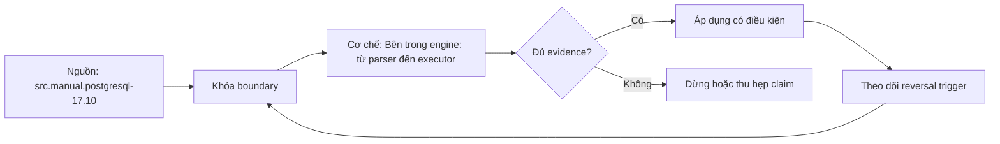

# Bên trong engine: từ parser đến executor

> [!abstract] Câu hỏi trung tâm
> Giai đoạn nào biến SQL text thành kết quả, mỗi giai đoạn nhận/trả representation gì, và làm sao chẩn đoán thay vì gọi chung mọi thứ là “optimizer”?

## 1. Query path là chuỗi biến đổi

Client gửi query text qua protocol. PostgreSQL parse thành cây cú pháp, phân giải tên/type thành query tree, rewrite theo rules, planner/optimizer tạo và chọn physical plan, executor chạy plan dưới transaction snapshot và trả rows. Ranh giới chi tiết trong code có thể phức tạp hơn mô hình năm bước, nhưng mô hình đủ để phân loại hiện tượng.

Mỗi giai đoạn có input/output khác. Syntax error không phải estimation error. Name resolution không phải index selection. Plan estimates không phải actual execution. Chẩn đoán đúng bắt đầu bằng hỏi artifact nào cho thấy giai đoạn nào.

Prepared statements thêm parse/bind/execute protocol và generic/custom plan; không làm mô hình cơ bản vô hiệu nhưng thêm lifecycle cần xét.

## 2. Parser

Parser kiểm grammar và dựng raw parse tree. Dấu phẩy thiếu, keyword sai vị trí, ngoặc không cân bằng bị phát hiện ở đây. Parser chưa quyết định bảng/cột thật có tồn tại hay không theo nghĩa semantic đầy đủ.

Hai SQL text khác nhau có thể parse thành trees khác nhưng sau rewrite/planning tạo plan tương đương. Không suy từ formatting/text rằng runtime sẽ khác.

Parser error position hữu ích nhưng dynamic SQL có thể làm offset khó đọc. Log parameterized query/template và version, tránh log secrets.

## 3. Parse analysis và name binding

Analyzer/binder phân giải table, column, function/operator overload, scope, types và coercions; output là transformed query tree. “Column does not exist”, ambiguous column, incompatible type hoặc function resolution thường thuộc đây.

`search_path` làm cùng unqualified name trỏ object khác. Production nên schema-qualify nơi cần và bảo vệ search_path, đặc biệt trong security-sensitive functions. Alias tạo scope; outer/inner references phải theo query level.

Implicit casts có thể đổi semantics/indexability. Binder chọn operator theo types; vì vậy inspect actual parameter types, không chỉ SQL text.

## 4. Rewrite system

PostgreSQL rewriter áp rules vào query tree. Views được biểu diễn bằng rules và mở rộng thành underlying relations/query. Rules có thể biến một query thành một hoặc nhiều queries. Planner nhận rewritten trees.

Rewrite không đồng nghĩa mọi algebraic optimization. Predicate pushdown, join reorder và access-path selection thuộc planner. Tách hai khái niệm tránh quy view expansion cho cost optimizer.

Hai query viết khác nhau có thể về equivalent representation/plan nhờ rewrite và planner transformations, nhưng equivalence bị giới hạn bởi NULL, outer join, volatility và side effects.

## 5. Planner và optimizer

Planner tạo candidate paths/plans: scan methods, join orders/algorithms, aggregation/sort strategies, parallelism. Nó ước lượng rows và cost từ statistics, predicates, constraints và cost constants; rồi chọn plan có estimated total/startup cost phù hợp objective.

Không chạy thử mọi candidate trên dữ liệu thật. Vì thế plan tối ưu theo model có thể chậm thực tế nếu cardinality, selectivity, cache/hardware assumptions hoặc parameter distribution sai.

Search space tăng nhanh theo số joins; PostgreSQL có controls như collapse limits và GEQO cho query lớn. Không ép join order trước khi hiểu estimation.

## 6. Cost không phải milliseconds

EXPLAIN `cost=startup..total` là đơn vị tương đối của mô hình, không phải thời gian. `seq_page_cost`, `random_page_cost`, `cpu_tuple_cost`, `cpu_operator_cost`, parallel costs và cache-size assumption ảnh hưởng so sánh paths.

Startup cost quan trọng khi consumer chỉ lấy ít rows/LIMIT; total cost cho toàn output. Một plan có startup thấp nhưng total cao có thể được chọn cho LIMIT. Cost không bao gồm mọi contention/network/client rendering.

Không hiệu chỉnh cost constants bằng cảm giác “SSD nhanh”. Benchmark representative I/O/cache, thay đổi có kiểm soát và xem portfolio plans. Giảm `random_page_cost` quá mức có thể đẩy index scans không phù hợp.

## 7. Cardinality là đầu vào trung tâm

Estimated rows truyền từ node con lên cha và ảnh hưởng join order, join algorithm, aggregation, memory và parallelism. Sai sớm có thể khuếch đại. Planner không “ngu” nếu statistics nói một predicate trả 10 rows nhưng thực tế một triệu.

Nguyên nhân gồm stale sample, skew, correlated columns, expressions thiếu stats, parameter/generic plan, data changes và model limitations. Cần tìm node đầu tiên estimate/actual lệch mạnh.

Không khẳng định “phần lớn query chậm do estimation” như fact phổ quát nếu không có số liệu workload. Estimation là một nguyên nhân quan trọng, bên cạnh blocking, I/O, bad SQL semantics, bloat, contention và configuration.

## 8. Executor

Executor khởi tạo plan-state tree rồi gọi nodes theo mô hình iterator/pull trong cách diễn giải phổ biến. Scan lấy tuples, filter, join, sort, aggregate; executor tương tác buffer manager, access methods, memory contexts, temp files và transaction visibility.

Actual rows, loops, timing, buffers và temp I/O chỉ có khi thực thi/đo thích hợp. `EXPLAIN ANALYZE` thật sự chạy statement; với DML phải dùng transaction rollback hoặc test environment để tránh mutation ngoài ý muốn.

Executor chịu ảnh hưởng runtime: cache state, concurrent load, lock waits, I/O latency, JIT và work_mem. Một plan giống nhau có thể có elapsed khác.

## 9. Result và client boundary

Server execution xong chưa chắc end-to-end xong. Serialize rows, network transfer, driver decoding và client rendering có chi phí. `EXPLAIN ANALYZE` không luôn phản ánh việc gửi toàn result như ứng dụng.

Query trả triệu rows có thể nhanh trong server nhưng chậm/tốn memory ở client. Đo server execution và end-to-end riêng. Cursor/fetch size ảnh hưởng memory và latency.

Không quy mọi latency sau query submit về executor nếu connection pool wait hoặc network chiếm phần lớn.

## 10. Prepared statement và plan cache

PostgreSQL có thể dùng custom plan dựa parameter hoặc generic plan sau nhiều executions nếu dự kiến có lợi. Data skew làm một generic plan tốt trung bình nhưng xấu cho hot/cold parameter cụ thể.

Parameter sniffing là thuật ngữ thường dùng ở hệ khác; với PostgreSQL cần nói chính xác generic/custom plan behavior. Capture prepared state, parameter types/values class và plan mode khi chẩn đoán.

Không chữa bằng literal hóa mọi query; sẽ tăng parse/plan overhead và giảm cache/security lợi ích.

## 11. Sáu hiện tượng và giai đoạn

Syntax error → parser. Column ambiguous/not found → analysis/binding. Query qua view biến thành base tables → rewrite. Plan đổi sau `ANALYZE` → planner nhận statistics mới. Hash join thay nested loop khi selectivity đổi → planner choice dựa estimates/cost. Sort spill/temp I/O trong actual run → executor thực thi physical operator dưới memory budget.

“Hai câu viết khác cùng plan” có thể do rewrite/planner normalization; cần xem query tree/plan, không gán một cách tuyệt đối. “Kết quả sai” trước hết kiểm SQL semantics/data, không mặc định executor bug.

Lab yêu cầu giải thích evidence cho mapping, không chỉ tên bước.

## 12. EXPLAIN và EXPLAIN ANALYZE

EXPLAIN hiển thị plan dự kiến với costs/rows/width. EXPLAIN ANALYZE chạy và thêm actual time/rows/loops. `BUFFERS`, `WAL`, `SETTINGS`, `VERBOSE`, format JSON cung cấp evidence bổ sung.

So estimated rows với actual rows × loops đúng ngữ cảnh. Một node có `actual rows` mỗi loop; tổng work liên quan loops. Timing instrumentation có overhead, đặc biệt node gọi nhiều lần.

Đừng so elapsed một lần. Warm/cold cache, load và parameter phải ghi. JSON plan hỗ trợ tự động diff nhưng format có thể đổi theo version.

## 13. Cấu hình cost và phần cứng

Đọc `SHOW seq_page_cost`, `random_page_cost`, `effective_cache_size`, `work_mem`, parallel settings. Đây là model assumptions/hints, không quota cache thật. `effective_cache_size` không allocate memory.

SSD thường thu hẹp chênh lệch random/sequential I/O, nhưng cache hierarchy và remote storage phức tạp. Benchmark representative workload trước tuning. Cost constants tương đối với nhau; thay một giá trị ảnh hưởng plan frontier.

`work_mem` không chỉ một lần mỗi connection; nhiều sort/hash nodes và concurrent queries có thể dùng nhiều lần. Không tăng toàn cluster chỉ để một query hết spill.

## 14. Từ hiện tượng đến giả thuyết

Quy trình: xác định latency/correctness symptom; tách pool/lock/network/server; capture query+parameters+snapshot; EXPLAIN; nếu an toàn dùng ANALYZE/BUFFERS; tìm node đầu tiên mismatch/spill/loops; kiểm stats/config/indexes; tạo một thay đổi; đo lại result parity và plan/runtime.

Mỗi hypothesis có predicted observation. “Stats cũ” dự đoán estimate đổi sau ANALYZE; “cost hardware lệch” dự đoán plan frontier đổi khi cost model chỉnh nhưng actual alternatives phải được benchmark.

Không stack ANALYZE + index + rewrite rồi tuyên bố nguyên nhân.

## 15. Optimizer controls là công cụ chẩn đoán

Tắt `enable_hashjoin` hoặc thay planner settings có thể buộc alternative để so, nhưng không nên là fix mặc định. Nếu alternative nhanh, câu hỏi tiếp là estimate/cost nào khiến planner không chọn.

Hints qua extension hoặc query rewrite có maintenance cost và có thể stale khi data đổi. Sửa statistics/schema/query model trước khi ép plan nếu có thể.

Plan stability tuyệt đối không phải mục tiêu; plan nên đổi khi data/workload đổi. Mục tiêu là predictable performance trong SLO.

## 16. Câu hỏi tự kiểm tra

1. Parser và binder phát hiện hai loại lỗi khác nhau nào?
2. View expansion thuộc rewrite hay executor?
3. Cost units khác milliseconds thế nào?
4. Vì sao cardinality error khuếch đại qua plan tree?
5. EXPLAIN ANALYZE có rủi ro gì với DML?
6. `effective_cache_size` có cấp phát cache không?

## 17. Giới hạn và điều chưa cho phép kết luận

- Mô hình năm bước là abstraction; code path PostgreSQL có thêm protocol/catalog/cache details.
- Cost constants và plan behavior là PostgreSQL/version/workload-specific.
- Không được khẳng định tỷ trọng nguyên nhân query chậm nếu chưa đo workload.
- EXPLAIN output không bao gồm toàn bộ client/network latency.
- Sáu hiện tượng lab chưa được thực thi; evidence thuộc `after-note.md`.

## Reference
1. [[SRC-POSTGRESQL-17-10-MANUAL]] — query path, EXPLAIN, planner statistics/configuration.
2. [[SRC-MASTERING-POSTGRESQL-17-6E]] — cost model, plans, optimizer và joins.

## Source coverage

| Source slice | Nội dung phải giữ | Vị trí trong note | Trạng thái |
|---|---|---|---|
| [[SRC-POSTGRESQL-17-10-MANUAL]], PDF 559–580, 2341–2347 | EXPLAIN, planner stats, query path | §§1–13 | Đã giữ stage boundaries |
| [[SRC-MASTERING-POSTGRESQL-17-6E]], PDF 223–270 | optimizer/cost/plan/join controls | §§5–15 | Đã tách heuristic khỏi evidence |
| Tổng hợp DE-L126 | six-phenomenon mapping, diagnostic workflow | §§11, 14–15 | Đã thành rubric kiểm được |

## Key takeaways
- Mỗi giai đoạn có representation và failure modes riêng; không gọi chung là optimizer.
- Planner chọn theo estimated cardinality và dimensionless costs, không chạy thử mọi plan.
- Executor runtime có cache, lock, memory và I/O; plan giống chưa chắc latency giống.
- Node estimate/actual lệch đầu tiên là điểm chẩn đoán quan trọng.
- Planner toggles dùng để thử giả thuyết, không phải fix mặc định.

<!-- ATOMIC-EXECUTION-CAPSULE:START -->

## Execution capsule — kiểm chứng `wiki.database.engine-parser-rewriter-planner-executor`

> [!important] Phân loại mệnh đề
> Với `wiki.database.engine-parser-rewriter-planner-executor`, sơ đồ, ví dụ và artifact về **Bên trong engine: từ parser đến executor** là **synthesis để kiểm chứng**; chúng không phải trích dẫn hay case nguyên văn của nguồn.

### Sơ đồ cơ chế và điểm kiểm soát



Đọc sơ đồ `wiki.database.engine-parser-rewriter-planner-executor` từ trái sang phải: source chỉ cung cấp claim ban đầu cho **Bên trong engine: từ parser đến executor**; quyết định chỉ được đi tiếp sau khi boundary, evidence và điều kiện đảo quyết định đã hiện hữu.

### Ví dụ làm việc có thể bác bỏ

**Input.** Một đội cần trả lời: “Một truy vấn đi qua parser, analyzer, rewriter, planner và executor như thế nào, và evidence nào quy một hiện tượng về đúng giai đoạn?” cho một phạm vi nhỏ, có owner và deadline rõ.

**Decision.** Đội áp dụng **Bên trong engine: từ parser đến executor** trên control và variant chỉ khác một assumption; expected result và hard constraints được khóa trước khi chạy.

**Outcome.** Với `wiki.database.engine-parser-rewriter-planner-executor`, nếu observation vi phạm hard constraint hoặc oracle độc lập không xác nhận **Bên trong engine: từ parser đến executor**, đội thu hẹp claim hay đảo quyết định. Nếu đạt, kết luận vẫn kèm scope, version và review date; một lần thành công không được nâng thành quy luật phổ quát.

### Artifact thực thi tối thiểu

```sql
-- Verification harness for: Bên trong engine: từ parser đến executor
WITH evidence AS (
    SELECT 'wiki.database.engine-parser-rewriter-planner-executor' AS concept_id,
           'boundary_declared' AS check_name, 1 AS passed
    UNION ALL
    SELECT 'wiki.database.engine-parser-rewriter-planner-executor', 'independent_oracle', 1
    UNION ALL
    SELECT 'wiki.database.engine-parser-rewriter-planner-executor', 'reversal_trigger_recorded', 1
)
SELECT concept_id,
       MIN(passed) AS all_hard_checks_pass,
       COUNT(*) AS evidence_items
FROM evidence
GROUP BY concept_id
HAVING MIN(passed) = 1;
```

Artifact của `wiki.database.engine-parser-rewriter-planner-executor` buộc người dùng ghi boundary, oracle và reversal trigger cho **Bên trong engine: từ parser đến executor**. Các giá trị minh họa phải được thay bằng evidence thật trước khi dùng cho quyết định.

### Tự kiểm tra trước khi tái sử dụng

1. Bạn có thể trả lời `Một truy vấn đi qua parser, analyzer, rewriter, planner và executor như thế nào, và evidence nào quy một hiện tượng về đúng giai đoạn?` bằng một câu mà không kéo thêm concept thứ hai không?
2. Source locator nào đỡ cho claim, và phần nào chỉ là synthesis trong note?
3. Observation nào khiến bạn dừng, thu hẹp hoặc đảo quyết định?
4. Artifact nào cho phép một reviewer độc lập tái hiện kết quả?

<!-- ATOMIC-EXECUTION-CAPSULE:END -->
