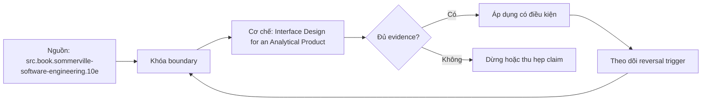

# Interface Design for an Analytical Product

> [!abstract] Câu hỏi trung tâm
> Làm sao thiết kế public analytical interface tối thiểu nhưng đủ trả ba business questions, ổn định trước thay đổi nội bộ và khó bị dùng sai?

## 1. Interface là phần consumer quan sát

Table/view schema, metric API, semantic query surface và exported file đều là contracts khi consumer code/process dựa vào. Internal staging columns không phải public chỉ vì tồn tại trong warehouse. Xác định consumer personas, questions, access pattern, latency và evolution capacity trước form. Một product có thể có multiple interfaces nhưng cùng semantic IDs; parity test bảo đảm không drift.

## 2. Chốt grain trước columns

Mỗi row/response cell đại diện entity/event/snapshot nào, time/as-of và uniqueness gì. Grain là phần interface vì consumer sẽ group/join dựa nó. Đổi grain nhưng giữ table name là semantic breaking change dù schema gần giống. Public keys, validity intervals và aggregation behavior được ghi. Example rows/queries cùng counterexample giúp consumer thấy duplicate hoặc missing semantics.

## 3. Minimal public surface

Expose fields cần cho approved questions và stable composition; giữ pipeline metadata, raw codes, security attributes và implementation intermediates internal. Mỗi public field tăng compatibility/security/documentation cost. Minimal không nghĩa thiếu diagnostic fields cần trust như data cutoff/version/quality flag. Decide public/internal bằng consumer need và misuse risk, không chỉ “dùng hiện tại”. Extension points có governance tránh request nào cũng thêm cột.

## 4. Information hiding và vocabulary

Sommerville dùng interface/representation hiding để giảm coupling; áp vào data product bằng stable business names/types và encapsulate source schema. Rename source column không làm public contract đổi. Business vocabulary có definition/domain/units; tránh vendor/source abbreviations. Consistency quan trọng nhưng name không cứu semantic ambiguity: `revenue` cần contract population/time/currency.

## 5. Ba misuse paths và design controls

Consumer SUM semi-additive balance qua time: expose approved metric/operator hoặc snapshot semantics. Join many-side làm fanout: provide safe keys/relationship metadata/pre-aggregated interface. Dùng stale/partial data như complete: expose cutoff/completeness and enforce freshness. Thêm row/column policy, allowed dimensions và type constraints. Docs hỗ trợ, nhưng controls/defaults/rejections ngăn lỗi tại boundary.

## 6. Consumer test và sufficiency

Ba business questions compile/query chỉ bằng public fields; no internal field required. Test two consumers independently, note clarifying questions and invalid attempts. Zero questions may mean names clear hoặc user đoán sai; require explain-back: consumer nêu grain, filter, time và limitations. Minimality test loại từng field xem questions còn trả được; security review xác nhận internal/sensitive fields absent.

## 7. Evolution strategy

Additive public field vẫn cần purpose, owner và compatibility analysis. Breaking grain/name/type/semantics uses new version/interface, parallel window and usage inventory. Contract tests run producer and representative consumers; query examples become executable fixtures. Interface decision record includes rejected fields, misuse controls và reversal trigger. Internal refactoring passes parity without consumer migration.

## 8. Ma trận kiểm chứng từng mệnh đề

Mỗi mệnh đề dưới đây cần observation, fixture hoặc artifact có thể lưu. Tên công nghệ, consensus hoặc output nhìn hợp lý không tự là bằng chứng.

### 8.1. interface defined by consumer observation

**Mệnh đề cần kiểm.** interface defined by consumer observation.

**Cách kiểm.** Design public/internal schema at declared grain; answer three business questions using public surface only. Run misuse attempts, explain-back, field-removal minimality and parity across two consumer interfaces. Với riêng mệnh đề này, ghi input/context, expected observation, failure signal và boundary làm kết luận không còn đúng.

**Bằng chứng đạt cho `wiki.data-product.interface-design`.** Lưu contract/decision version, fixture hoặc interview evidence, command/checklist output, reviewer và artifact hash. Nếu chưa thực hiện lab, trạng thái chỉ là protocol; không ghi thành kết quả đã quan sát.

### 8.2. internal column is not automatically public

**Mệnh đề cần kiểm.** internal column is not automatically public.

**Cách kiểm.** Design public/internal schema at declared grain; answer three business questions using public surface only. Run misuse attempts, explain-back, field-removal minimality and parity across two consumer interfaces. Với riêng mệnh đề này, ghi input/context, expected observation, failure signal và boundary làm kết luận không còn đúng.

**Bằng chứng đạt cho `wiki.data-product.interface-design`.** Lưu contract/decision version, fixture hoặc interview evidence, command/checklist output, reviewer và artifact hash. Nếu chưa thực hiện lab, trạng thái chỉ là protocol; không ghi thành kết quả đã quan sát.

### 8.3. grain belongs to public contract

**Mệnh đề cần kiểm.** grain belongs to public contract.

**Cách kiểm.** Design public/internal schema at declared grain; answer three business questions using public surface only. Run misuse attempts, explain-back, field-removal minimality and parity across two consumer interfaces. Với riêng mệnh đề này, ghi input/context, expected observation, failure signal và boundary làm kết luận không còn đúng.

**Bằng chứng đạt cho `wiki.data-product.interface-design`.** Lưu contract/decision version, fixture hoặc interview evidence, command/checklist output, reviewer và artifact hash. Nếu chưa thực hiện lab, trạng thái chỉ là protocol; không ghi thành kết quả đã quan sát.

### 8.4. grain change is semantic breaking

**Mệnh đề cần kiểm.** grain change is semantic breaking.

**Cách kiểm.** Design public/internal schema at declared grain; answer three business questions using public surface only. Run misuse attempts, explain-back, field-removal minimality and parity across two consumer interfaces. Với riêng mệnh đề này, ghi input/context, expected observation, failure signal và boundary làm kết luận không còn đúng.

**Bằng chứng đạt cho `wiki.data-product.interface-design`.** Lưu contract/decision version, fixture hoặc interview evidence, command/checklist output, reviewer và artifact hash. Nếu chưa thực hiện lab, trạng thái chỉ là protocol; không ghi thành kết quả đã quan sát.

### 8.5. minimal surface reduces compatibility burden

**Mệnh đề cần kiểm.** minimal surface reduces compatibility burden.

**Cách kiểm.** Design public/internal schema at declared grain; answer three business questions using public surface only. Run misuse attempts, explain-back, field-removal minimality and parity across two consumer interfaces. Với riêng mệnh đề này, ghi input/context, expected observation, failure signal và boundary làm kết luận không còn đúng.

**Bằng chứng đạt cho `wiki.data-product.interface-design`.** Lưu contract/decision version, fixture hoặc interview evidence, command/checklist output, reviewer và artifact hash. Nếu chưa thực hiện lab, trạng thái chỉ là protocol; không ghi thành kết quả đã quan sát.

### 8.6. minimal surface includes trust metadata when needed

**Mệnh đề cần kiểm.** minimal surface includes trust metadata when needed.

**Cách kiểm.** Design public/internal schema at declared grain; answer three business questions using public surface only. Run misuse attempts, explain-back, field-removal minimality and parity across two consumer interfaces. Với riêng mệnh đề này, ghi input/context, expected observation, failure signal và boundary làm kết luận không còn đúng.

**Bằng chứng đạt cho `wiki.data-product.interface-design`.** Lưu contract/decision version, fixture hoặc interview evidence, command/checklist output, reviewer và artifact hash. Nếu chưa thực hiện lab, trạng thái chỉ là protocol; không ghi thành kết quả đã quan sát.

### 8.7. source names should not leak by default

**Mệnh đề cần kiểm.** source names should not leak by default.

**Cách kiểm.** Design public/internal schema at declared grain; answer three business questions using public surface only. Run misuse attempts, explain-back, field-removal minimality and parity across two consumer interfaces. Với riêng mệnh đề này, ghi input/context, expected observation, failure signal và boundary làm kết luận không còn đúng.

**Bằng chứng đạt cho `wiki.data-product.interface-design`.** Lưu contract/decision version, fixture hoặc interview evidence, command/checklist output, reviewer và artifact hash. Nếu chưa thực hiện lab, trạng thái chỉ là protocol; không ghi thành kết quả đã quan sát.

### 8.8. business name does not replace definition

**Mệnh đề cần kiểm.** business name does not replace definition.

**Cách kiểm.** Design public/internal schema at declared grain; answer three business questions using public surface only. Run misuse attempts, explain-back, field-removal minimality and parity across two consumer interfaces. Với riêng mệnh đề này, ghi input/context, expected observation, failure signal và boundary làm kết luận không còn đúng.

**Bằng chứng đạt cho `wiki.data-product.interface-design`.** Lưu contract/decision version, fixture hoặc interview evidence, command/checklist output, reviewer và artifact hash. Nếu chưa thực hiện lab, trạng thái chỉ là protocol; không ghi thành kết quả đã quan sát.

### 8.9. semiadditive misuse needs operator control

**Mệnh đề cần kiểm.** semiadditive misuse needs operator control.

**Cách kiểm.** Design public/internal schema at declared grain; answer three business questions using public surface only. Run misuse attempts, explain-back, field-removal minimality and parity across two consumer interfaces. Với riêng mệnh đề này, ghi input/context, expected observation, failure signal và boundary làm kết luận không còn đúng.

**Bằng chứng đạt cho `wiki.data-product.interface-design`.** Lưu contract/decision version, fixture hoặc interview evidence, command/checklist output, reviewer và artifact hash. Nếu chưa thực hiện lab, trạng thái chỉ là protocol; không ghi thành kết quả đã quan sát.

### 8.10. fanout misuse needs safe joins

**Mệnh đề cần kiểm.** fanout misuse needs safe joins.

**Cách kiểm.** Design public/internal schema at declared grain; answer three business questions using public surface only. Run misuse attempts, explain-back, field-removal minimality and parity across two consumer interfaces. Với riêng mệnh đề này, ghi input/context, expected observation, failure signal và boundary làm kết luận không còn đúng.

**Bằng chứng đạt cho `wiki.data-product.interface-design`.** Lưu contract/decision version, fixture hoặc interview evidence, command/checklist output, reviewer và artifact hash. Nếu chưa thực hiện lab, trạng thái chỉ là protocol; không ghi thành kết quả đã quan sát.

### 8.11. freshness misuse needs cutoff semantics

**Mệnh đề cần kiểm.** freshness misuse needs cutoff semantics.

**Cách kiểm.** Design public/internal schema at declared grain; answer three business questions using public surface only. Run misuse attempts, explain-back, field-removal minimality and parity across two consumer interfaces. Với riêng mệnh đề này, ghi input/context, expected observation, failure signal và boundary làm kết luận không còn đúng.

**Bằng chứng đạt cho `wiki.data-product.interface-design`.** Lưu contract/decision version, fixture hoặc interview evidence, command/checklist output, reviewer và artifact hash. Nếu chưa thực hiện lab, trạng thái chỉ là protocol; không ghi thành kết quả đã quan sát.

### 8.12. docs alone do not prevent misuse

**Mệnh đề cần kiểm.** docs alone do not prevent misuse.

**Cách kiểm.** Design public/internal schema at declared grain; answer three business questions using public surface only. Run misuse attempts, explain-back, field-removal minimality and parity across two consumer interfaces. Với riêng mệnh đề này, ghi input/context, expected observation, failure signal và boundary làm kết luận không còn đúng.

**Bằng chứng đạt cho `wiki.data-product.interface-design`.** Lưu contract/decision version, fixture hoặc interview evidence, command/checklist output, reviewer và artifact hash. Nếu chưa thực hiện lab, trạng thái chỉ là protocol; không ghi thành kết quả đã quan sát.

### 8.13. consumer must explain back grain and limits

**Mệnh đề cần kiểm.** consumer must explain back grain and limits.

**Cách kiểm.** Design public/internal schema at declared grain; answer three business questions using public surface only. Run misuse attempts, explain-back, field-removal minimality and parity across two consumer interfaces. Với riêng mệnh đề này, ghi input/context, expected observation, failure signal và boundary làm kết luận không còn đúng.

**Bằng chứng đạt cho `wiki.data-product.interface-design`.** Lưu contract/decision version, fixture hoặc interview evidence, command/checklist output, reviewer và artifact hash. Nếu chưa thực hiện lab, trạng thái chỉ là protocol; không ghi thành kết quả đã quan sát.

### 8.14. field removal test checks minimality

**Mệnh đề cần kiểm.** field removal test checks minimality.

**Cách kiểm.** Design public/internal schema at declared grain; answer three business questions using public surface only. Run misuse attempts, explain-back, field-removal minimality and parity across two consumer interfaces. Với riêng mệnh đề này, ghi input/context, expected observation, failure signal và boundary làm kết luận không còn đúng.

**Bằng chứng đạt cho `wiki.data-product.interface-design`.** Lưu contract/decision version, fixture hoặc interview evidence, command/checklist output, reviewer và artifact hash. Nếu chưa thực hiện lab, trạng thái chỉ là protocol; không ghi thành kết quả đã quan sát.

### 8.15. internal refactor needs parity tests

**Mệnh đề cần kiểm.** internal refactor needs parity tests.

**Cách kiểm.** Design public/internal schema at declared grain; answer three business questions using public surface only. Run misuse attempts, explain-back, field-removal minimality and parity across two consumer interfaces. Với riêng mệnh đề này, ghi input/context, expected observation, failure signal và boundary làm kết luận không còn đúng.

**Bằng chứng đạt cho `wiki.data-product.interface-design`.** Lưu contract/decision version, fixture hoặc interview evidence, command/checklist output, reviewer và artifact hash. Nếu chưa thực hiện lab, trạng thái chỉ là protocol; không ghi thành kết quả đã quan sát.

## 9. Quy trình phản biện

1. Viết decision, consumer, contract và constraints trước khi chọn tool hoặc implementation.
2. Tách source fact, curriculum synthesis và organizational choice.
3. Dùng counterexample và changed constraint để kiểm quyết định có đảo đúng lúc.
4. Gắn mọi approval/certification với exact version, evidence và scope.
5. Kiểm cả valid path lẫn negative/failure path; không chỉ demo happy path.
6. Ghi limitation của telemetry, test environment và source authority.
7. Chưa có execution evidence thì giữ trạng thái `review`.

## 10. Câu hỏi tự kiểm tra

1. Decision hoặc invariant nào đang được bảo vệ?
2. Evidence nào độc lập với implementation đang được đánh giá?
3. Điều kiện nào làm lựa chọn hiện tại phải đảo?
4. Ai có quyền quyết nghĩa, ai triển khai và ai giữ quy trình?
5. Thay đổi nào ảnh hưởng consumer dù interface vẫn chạy?
6. Failure mode nào còn chưa có automated detector?

## 11. Giới hạn và điều chưa cho phép kết luận

- Chưa chạy các lab, migration, workload benchmark hoặc fault-injection; note mô tả protocol và expected evidence.
- Tài liệu sản phẩm web được kiểm ngày 2026-10-02; feature, syntax, license và integration có thể đổi.
- Các scorecard, lifecycle gates, failure matrix và decision contract là curriculum synthesis từ nguồn đã nêu; không gán nguyên văn cho một tác giả.
- Ví dụ tổ chức không thay discovery thực tế, threat model, cost model hoặc owner approval.
- Note giữ trạng thái `review` cho tới khi chủ dự án duyệt semantic meaning.

## Reference
1. [[SRC-SOMMERVILLE-SOFTWARE-ENGINEERING-10E]]
2. [[SRC-GEEWAX-API-DESIGN-PATTERNS-1E]]
3. [[SRC-DEHGHANI-DATA-MESH-PRINCIPLES]]

## Source coverage

| Source slice | Nội dung sử dụng | Trạng thái |
|---|---|---|
| [[SRC-SOMMERVILLE-SOFTWARE-ENGINEERING-10E]] | Khái niệm, cơ chế hoặc decision boundary liên quan | Đã đọc locator được ghi trong source record; không suy ngoài phạm vi |
| [[SRC-GEEWAX-API-DESIGN-PATTERNS-1E]] | Khái niệm, cơ chế hoặc decision boundary liên quan | Đã đọc locator được ghi trong source record; không suy ngoài phạm vi |
| [[SRC-DEHGHANI-DATA-MESH-PRINCIPLES]] | Khái niệm, cơ chế hoặc decision boundary liên quan | Đã đọc locator được ghi trong source record; không suy ngoài phạm vi |

## Key takeaways
- Chọn kiến trúc và data product từ decision/constraints, không từ độ mới của công nghệ.
- Metric governance cần versioned evidence, lifecycle gates và owner có quyền rõ.
- Failure matrix chỉ hữu dụng khi mỗi dòng có detector hoặc control kiểm được.
- Capstone là hồ sơ bằng chứng tích hợp, không phải bộ YAML hay dashboard trình diễn.
- Discovery phải cho phép kết luận không xây analytics product.

<!-- ATOMIC-EXECUTION-CAPSULE:START -->

## Execution capsule — kiểm chứng `wiki.data-product.interface-design`

> [!important] Phân loại mệnh đề
> Với `wiki.data-product.interface-design`, sơ đồ, ví dụ và artifact về **Interface Design for an Analytical Product** là **synthesis để kiểm chứng**; chúng không phải trích dẫn hay case nguyên văn của nguồn.

### Sơ đồ cơ chế và điểm kiểm soát



Đọc sơ đồ `wiki.data-product.interface-design` từ trái sang phải: source chỉ cung cấp claim ban đầu cho **Interface Design for an Analytical Product**; quyết định chỉ được đi tiếp sau khi boundary, evidence và điều kiện đảo quyết định đã hiện hữu.

### Artifact thực thi tối thiểu

```sql
-- Verification harness for: Interface Design for an Analytical Product
WITH evidence AS (
    SELECT 'wiki.data-product.interface-design' AS concept_id,
           'boundary_declared' AS check_name, 1 AS passed
    UNION ALL
    SELECT 'wiki.data-product.interface-design', 'independent_oracle', 1
    UNION ALL
    SELECT 'wiki.data-product.interface-design', 'reversal_trigger_recorded', 1
)
SELECT concept_id,
       MIN(passed) AS all_hard_checks_pass,
       COUNT(*) AS evidence_items
FROM evidence
GROUP BY concept_id
HAVING MIN(passed) = 1;
```

Artifact của `wiki.data-product.interface-design` buộc người dùng ghi boundary, oracle và reversal trigger cho **Interface Design for an Analytical Product**. Các giá trị minh họa phải được thay bằng evidence thật trước khi dùng cho quyết định.

### Tự kiểm tra trước khi tái sử dụng

1. Bạn có thể trả lời `Làm sao thiết kế public analytical interface tối thiểu nhưng đủ trả ba business questions, ổn định trước thay đổi nội bộ và khó bị dùng sai?` bằng một câu mà không kéo thêm concept thứ hai không?
2. Source locator nào đỡ cho claim, và phần nào chỉ là synthesis trong note?
3. Observation nào khiến bạn dừng, thu hẹp hoặc đảo quyết định?
4. Artifact nào cho phép một reviewer độc lập tái hiện kết quả?

<!-- ATOMIC-EXECUTION-CAPSULE:END -->
