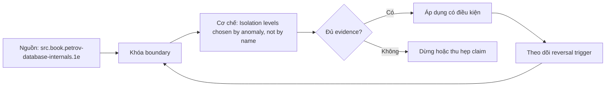

# Isolation levels chosen by anomaly, not by name

> [!abstract] Câu hỏi trung tâm
> Chọn isolation/locking theo invariant và anomaly cụ thể như thế nào thay vì tin tên mức cô lập?

## 1. Bắt đầu từ invariant

Isolation level là phương tiện. Trước hết viết invariant bằng predicate có thể kiểm, chỉ ra rows/ranges tham gia và schedule cạnh tranh. 'Không âm', 'còn ít nhất một bác sĩ trực' và 'một username duy nhất' có conflict shapes khác nhau. Nếu invariant đã là unique/check/foreign-key constraint thì ưu tiên engine enforcement; nếu predicate nhiều rows, cần serializable, explicit locking hoặc materialize conflict.

## 2. Các anomaly đọc

Dirty read đọc uncommitted data; nonrepeatable read thấy cùng row đổi sau commit khác; phantom thấy tập rows thoả predicate đổi. Đây là phenomena chuẩn nhưng không bao phủ mọi anomaly. PostgreSQL không thực thi Read Uncommitted riêng mà ánh xạ thành Read Committed; PostgreSQL Repeatable Read mạnh hơn minimum standard về phantom nhưng vẫn có serialization anomaly.

## 3. Lost update và write skew

Lost update xảy ra khi read-modify-write cạnh tranh làm một update che update kia. Atomic UPDATE hoặc row lock/compare-and-set có thể chặn theo case. Write skew xảy ra khi hai transaction đọc cùng predicate rồi ghi hai rows khác nhau; first-committer-wins trên cùng row không bắt được. Snapshot isolation do đó không đồng nghĩa serializable.

## 4. PostgreSQL theo từng mức

Read Committed snapshot theo statement và statement update có recheck/wait behavior. Repeatable Read cung cấp snapshot ổn định, ngăn dirty/nonrepeatable/phantom theo implementation nhưng có thể abort khi row đổi và vẫn cho write skew. Serializable dùng Serializable Snapshot Isolation, theo dõi dangerous structures/predicate dependencies và abort để bảo đảm serializable execution.

## 5. Ba cách chặn predicate anomaly

Một là chạy Serializable và retry serialization failures. Hai là explicit lock tất cả rows đại diện predicate, nhưng phải bảo đảm rows tồn tại và query/index thực sự bao phủ conflict; nonexistence khó khoá. Ba là materialize invariant thành một row/constraint/counter để concurrent changes cùng conflict. Mỗi cách có contention, complexity và correctness proof khác nhau.

## 6. Kiểm bằng schedule

Concurrency test phải có barrier: T1 đọc, T2 đọc, mỗi bên ghi, rồi commit theo thứ tự kiểm soát. Chạy tuần tự không kiểm isolation. Ghi result, SQLSTATE, committed set và invariant cuối. Abort có thể là kết quả đúng. So DBMS/version bằng evidence riêng vì cùng label không đảm bảo implementation details giống nhau.

## 7. Ma trận kiểm chứng từng mệnh đề

Mỗi mệnh đề dưới đây phải được kiểm bằng một schedule hoặc phép đo có điều kiện đầu vào rõ ràng. Không dùng một ảnh màn hình cuối làm bằng chứng thay cho lệnh, timestamp, cấu hình và raw output.

### 7.1. dirty read cần giá trị chưa commit chứ không chỉ giá trị cũ

**Giả thuyết.** dirty read cần giá trị chưa commit chứ không chỉ giá trị cũ. **Cách kiểm.** Cố định phiên bản database, cấu hình, dữ liệu seed và thứ tự thao tác; ghi operation ID, transaction/session ID, thời điểm bắt đầu-kết thúc và trạng thái commit/abort. **Đối chứng.** Chạy một biến thể bỏ đúng yếu tố đang xét, không đổi đồng thời nhiều tham số. **Bằng chứng đạt cho `wiki.database.isolation-levels-anomalies`.** Lưu command/script, raw result và counter trước-sau; giải thích cơ chế tạo ra quan sát. Một lần không tái hiện không đủ bác bỏ hiện tượng concurrency; cần barrier xác định và lặp có giới hạn.

### 7.2. nonrepeatable read cùng row khác phantom trên predicate set

**Giả thuyết.** nonrepeatable read cùng row khác phantom trên predicate set. **Cách kiểm.** Cố định phiên bản database, cấu hình, dữ liệu seed và thứ tự thao tác; ghi operation ID, transaction/session ID, thời điểm bắt đầu-kết thúc và trạng thái commit/abort. **Đối chứng.** Chạy một biến thể bỏ đúng yếu tố đang xét, không đổi đồng thời nhiều tham số. **Bằng chứng đạt cho `wiki.database.isolation-levels-anomalies`.** Lưu command/script, raw result và counter trước-sau; giải thích cơ chế tạo ra quan sát. Một lần không tái hiện không đủ bác bỏ hiện tượng concurrency; cần barrier xác định và lặp có giới hạn.

### 7.3. lost update có thể tránh bằng atomic increment mà không tăng toàn transaction lên serializable

**Giả thuyết.** lost update có thể tránh bằng atomic increment mà không tăng toàn transaction lên serializable. **Cách kiểm.** Cố định phiên bản database, cấu hình, dữ liệu seed và thứ tự thao tác; ghi operation ID, transaction/session ID, thời điểm bắt đầu-kết thúc và trạng thái commit/abort. **Đối chứng.** Chạy một biến thể bỏ đúng yếu tố đang xét, không đổi đồng thời nhiều tham số. **Bằng chứng đạt cho `wiki.database.isolation-levels-anomalies`.** Lưu command/script, raw result và counter trước-sau; giải thích cơ chế tạo ra quan sát. Một lần không tái hiện không đủ bác bỏ hiện tượng concurrency; cần barrier xác định và lặp có giới hạn.

### 7.4. write skew của hai bác sĩ ghi hai rows khác nhau vượt qua row-level conflict

**Giả thuyết.** write skew của hai bác sĩ ghi hai rows khác nhau vượt qua row-level conflict. **Cách kiểm.** Cố định phiên bản database, cấu hình, dữ liệu seed và thứ tự thao tác; ghi operation ID, transaction/session ID, thời điểm bắt đầu-kết thúc và trạng thái commit/abort. **Đối chứng.** Chạy một biến thể bỏ đúng yếu tố đang xét, không đổi đồng thời nhiều tham số. **Bằng chứng đạt cho `wiki.database.isolation-levels-anomalies`.** Lưu command/script, raw result và counter trước-sau; giải thích cơ chế tạo ra quan sát. Một lần không tái hiện không đủ bác bỏ hiện tượng concurrency; cần barrier xác định và lặp có giới hạn.

### 7.5. PostgreSQL Read Uncommitted hành xử như Read Committed

**Giả thuyết.** PostgreSQL Read Uncommitted hành xử như Read Committed. **Cách kiểm.** Cố định phiên bản database, cấu hình, dữ liệu seed và thứ tự thao tác; ghi operation ID, transaction/session ID, thời điểm bắt đầu-kết thúc và trạng thái commit/abort. **Đối chứng.** Chạy một biến thể bỏ đúng yếu tố đang xét, không đổi đồng thời nhiều tham số. **Bằng chứng đạt cho `wiki.database.isolation-levels-anomalies`.** Lưu command/script, raw result và counter trước-sau; giải thích cơ chế tạo ra quan sát. Một lần không tái hiện không đủ bác bỏ hiện tượng concurrency; cần barrier xác định và lặp có giới hạn.

### 7.6. Read Committed có snapshot theo command không theo transaction

**Giả thuyết.** Read Committed có snapshot theo command không theo transaction. **Cách kiểm.** Cố định phiên bản database, cấu hình, dữ liệu seed và thứ tự thao tác; ghi operation ID, transaction/session ID, thời điểm bắt đầu-kết thúc và trạng thái commit/abort. **Đối chứng.** Chạy một biến thể bỏ đúng yếu tố đang xét, không đổi đồng thời nhiều tham số. **Bằng chứng đạt cho `wiki.database.isolation-levels-anomalies`.** Lưu command/script, raw result và counter trước-sau; giải thích cơ chế tạo ra quan sát. Một lần không tái hiện không đủ bác bỏ hiện tượng concurrency; cần barrier xác định và lặp có giới hạn.

### 7.7. PostgreSQL Repeatable Read không có phantom theo bảng manual nhưng vẫn có serialization anomaly

**Giả thuyết.** PostgreSQL Repeatable Read không có phantom theo bảng manual nhưng vẫn có serialization anomaly. **Cách kiểm.** Cố định phiên bản database, cấu hình, dữ liệu seed và thứ tự thao tác; ghi operation ID, transaction/session ID, thời điểm bắt đầu-kết thúc và trạng thái commit/abort. **Đối chứng.** Chạy một biến thể bỏ đúng yếu tố đang xét, không đổi đồng thời nhiều tham số. **Bằng chứng đạt cho `wiki.database.isolation-levels-anomalies`.** Lưu command/script, raw result và counter trước-sau; giải thích cơ chế tạo ra quan sát. Một lần không tái hiện không đủ bác bỏ hiện tượng concurrency; cần barrier xác định và lặp có giới hạn.

### 7.8. Serializable có thể abort transaction hợp lệ cục bộ để giữ global serial order

**Giả thuyết.** Serializable có thể abort transaction hợp lệ cục bộ để giữ global serial order. **Cách kiểm.** Cố định phiên bản database, cấu hình, dữ liệu seed và thứ tự thao tác; ghi operation ID, transaction/session ID, thời điểm bắt đầu-kết thúc và trạng thái commit/abort. **Đối chứng.** Chạy một biến thể bỏ đúng yếu tố đang xét, không đổi đồng thời nhiều tham số. **Bằng chứng đạt cho `wiki.database.isolation-levels-anomalies`.** Lưu command/script, raw result và counter trước-sau; giải thích cơ chế tạo ra quan sát. Một lần không tái hiện không đủ bác bỏ hiện tượng concurrency; cần barrier xác định và lặp có giới hạn.

### 7.9. retry phải chạy lại toàn decision từ snapshot mới

**Giả thuyết.** retry phải chạy lại toàn decision từ snapshot mới. **Cách kiểm.** Cố định phiên bản database, cấu hình, dữ liệu seed và thứ tự thao tác; ghi operation ID, transaction/session ID, thời điểm bắt đầu-kết thúc và trạng thái commit/abort. **Đối chứng.** Chạy một biến thể bỏ đúng yếu tố đang xét, không đổi đồng thời nhiều tham số. **Bằng chứng đạt cho `wiki.database.isolation-levels-anomalies`.** Lưu command/script, raw result và counter trước-sau; giải thích cơ chế tạo ra quan sát. Một lần không tái hiện không đủ bác bỏ hiện tượng concurrency; cần barrier xác định và lặp có giới hạn.

### 7.10. SELECT FOR UPDATE chỉ khoá rows tìm thấy và không luôn bảo vệ absence

**Giả thuyết.** SELECT FOR UPDATE chỉ khoá rows tìm thấy và không luôn bảo vệ absence. **Cách kiểm.** Cố định phiên bản database, cấu hình, dữ liệu seed và thứ tự thao tác; ghi operation ID, transaction/session ID, thời điểm bắt đầu-kết thúc và trạng thái commit/abort. **Đối chứng.** Chạy một biến thể bỏ đúng yếu tố đang xét, không đổi đồng thời nhiều tham số. **Bằng chứng đạt cho `wiki.database.isolation-levels-anomalies`.** Lưu command/script, raw result và counter trước-sau; giải thích cơ chế tạo ra quan sát. Một lần không tái hiện không đủ bác bỏ hiện tượng concurrency; cần barrier xác định và lặp có giới hạn.

### 7.11. unique constraint là enforcement tốt hơn application pre-check cho uniqueness

**Giả thuyết.** unique constraint là enforcement tốt hơn application pre-check cho uniqueness. **Cách kiểm.** Cố định phiên bản database, cấu hình, dữ liệu seed và thứ tự thao tác; ghi operation ID, transaction/session ID, thời điểm bắt đầu-kết thúc và trạng thái commit/abort. **Đối chứng.** Chạy một biến thể bỏ đúng yếu tố đang xét, không đổi đồng thời nhiều tham số. **Bằng chứng đạt cho `wiki.database.isolation-levels-anomalies`.** Lưu command/script, raw result và counter trước-sau; giải thích cơ chế tạo ra quan sát. Một lần không tái hiện không đủ bác bỏ hiện tượng concurrency; cần barrier xác định và lặp có giới hạn.

### 7.12. predicate lock trong SSI không đồng nghĩa blocking row lock

**Giả thuyết.** predicate lock trong SSI không đồng nghĩa blocking row lock. **Cách kiểm.** Cố định phiên bản database, cấu hình, dữ liệu seed và thứ tự thao tác; ghi operation ID, transaction/session ID, thời điểm bắt đầu-kết thúc và trạng thái commit/abort. **Đối chứng.** Chạy một biến thể bỏ đúng yếu tố đang xét, không đổi đồng thời nhiều tham số. **Bằng chứng đạt cho `wiki.database.isolation-levels-anomalies`.** Lưu command/script, raw result và counter trước-sau; giải thích cơ chế tạo ra quan sát. Một lần không tái hiện không đủ bác bỏ hiện tượng concurrency; cần barrier xác định và lặp có giới hạn.

### 7.13. read-only serializable deferrable có semantics tối ưu riêng

**Giả thuyết.** read-only serializable deferrable có semantics tối ưu riêng. **Cách kiểm.** Cố định phiên bản database, cấu hình, dữ liệu seed và thứ tự thao tác; ghi operation ID, transaction/session ID, thời điểm bắt đầu-kết thúc và trạng thái commit/abort. **Đối chứng.** Chạy một biến thể bỏ đúng yếu tố đang xét, không đổi đồng thời nhiều tham số. **Bằng chứng đạt cho `wiki.database.isolation-levels-anomalies`.** Lưu command/script, raw result và counter trước-sau; giải thích cơ chế tạo ra quan sát. Một lần không tái hiện không đủ bác bỏ hiện tượng concurrency; cần barrier xác định và lặp có giới hạn.

### 7.14. test không có barrier cho kết quả không tái hiện được

**Giả thuyết.** test không có barrier cho kết quả không tái hiện được. **Cách kiểm.** Cố định phiên bản database, cấu hình, dữ liệu seed và thứ tự thao tác; ghi operation ID, transaction/session ID, thời điểm bắt đầu-kết thúc và trạng thái commit/abort. **Đối chứng.** Chạy một biến thể bỏ đúng yếu tố đang xét, không đổi đồng thời nhiều tham số. **Bằng chứng đạt cho `wiki.database.isolation-levels-anomalies`.** Lưu command/script, raw result và counter trước-sau; giải thích cơ chế tạo ra quan sát. Một lần không tái hiện không đủ bác bỏ hiện tượng concurrency; cần barrier xác định và lặp có giới hạn.

### 7.15. isolation choice phải ghi invariant, anomaly, mechanism và retry contract

**Giả thuyết.** isolation choice phải ghi invariant, anomaly, mechanism và retry contract. **Cách kiểm.** Cố định phiên bản database, cấu hình, dữ liệu seed và thứ tự thao tác; ghi operation ID, transaction/session ID, thời điểm bắt đầu-kết thúc và trạng thái commit/abort. **Đối chứng.** Chạy một biến thể bỏ đúng yếu tố đang xét, không đổi đồng thời nhiều tham số. **Bằng chứng đạt cho `wiki.database.isolation-levels-anomalies`.** Lưu command/script, raw result và counter trước-sau; giải thích cơ chế tạo ra quan sát. Một lần không tái hiện không đủ bác bỏ hiện tượng concurrency; cần barrier xác định và lặp có giới hạn.

## 8. Khung chẩn đoán

1. Viết hiện tượng quan sát được và mốc thời gian, không nhảy thẳng tới nguyên nhân.
2. Ghi exact DBMS/version, topology, isolation/durability mode và workload.
3. Dựng state hoặc dependency graph nhỏ nhất giải thích hiện tượng.
4. Thu evidence ở cả client, engine và storage/replica nếu có.
5. Nêu giả thuyết có dự đoán phân biệt được; đổi một biến và chạy lại.
6. Phân biệt biện pháp giảm triệu chứng, sửa nguyên nhân và control ngăn tái diễn.
7. Giữ failed run; không xoá evidence chỉ vì kết quả không như dự kiến.

## 9. Câu hỏi tự kiểm tra

1. Contract chính của cơ chế trong bài là gì và failure class nào nằm ngoài contract?
2. Counter hoặc graph nào phân biệt symptom với root cause?
3. Một phát biểu nào chỉ đúng cho PostgreSQL, không được khái quát thành SQL chung?
4. Abort hoặc stale read khi nào là hành vi đúng theo cấu hình?
5. Lab cần barrier, operation ID và đối chứng nào để tái hiện được?
6. Biện pháp vận hành nào nguy hiểm nếu áp dụng trực tiếp lên production?

## 10. Giới hạn và điều chưa cho phép kết luận

- Chưa chạy lab database; mọi số đo phải được học viên tạo trong môi trường cô lập.
- Hành vi theo version/dialect phải kiểm manual đúng hệ; note không thay runbook production.
- Không suy benchmark, ngưỡng alert hay SLO phổ quát từ sách.
- Không coi synchronous, serializable, vacuum hoặc partitioning là bảo đảm tuyệt đối ngoài cấu hình và failure model đã nêu.

## Reference
1. [[SRC-PETROV-DATABASE-INTERNALS-1E]]
2. [[SRC-SILBERSCHATZ-DATABASE-SYSTEM-CONCEPTS-7E]]
3. [[SRC-POSTGRESQL-17-10-MANUAL]]
4. [[SRC-ROGOV-POSTGRESQL-14-INTERNALS]]
5. [[SRC-KLEPPMANN-DDIA-1E]]

## Source coverage

| Source slice | Nội dung sử dụng | Trạng thái |
|---|---|---|
| [[SRC-PETROV-DATABASE-INTERNALS-1E]] | Cơ chế, ranh giới và phản ví dụ liên quan đến bài | Đã đọc phạm vi có locator và diễn giải |
| [[SRC-SILBERSCHATZ-DATABASE-SYSTEM-CONCEPTS-7E]] | Cơ chế, ranh giới và phản ví dụ liên quan đến bài | Đã đọc phạm vi có locator và diễn giải |
| [[SRC-POSTGRESQL-17-10-MANUAL]] | Cơ chế, ranh giới và phản ví dụ liên quan đến bài | Đã đọc phạm vi có locator và diễn giải |
| [[SRC-ROGOV-POSTGRESQL-14-INTERNALS]] | Cơ chế, ranh giới và phản ví dụ liên quan đến bài | Đã đọc phạm vi có locator và diễn giải |
| [[SRC-KLEPPMANN-DDIA-1E]] | Cơ chế, ranh giới và phản ví dụ liên quan đến bài | Đã đọc phạm vi có locator và diễn giải |

## Key takeaways
- Bắt đầu từ invariant/failure model và bằng chứng, không bắt đầu từ tên tính năng.
- Phân biệt contract chung với hành vi PostgreSQL cụ thể.
- Concurrency và failover test phải có schedule, operation ID và raw output tái lập được.
- Một control làm giảm rủi ro này có thể tăng latency, abort, coordination hoặc chi phí vận hành khác.
- Chưa chạy lab thì trạng thái là tài liệu học thuật đã kiểm cấu trúc, không phải chứng nhận production.

<!-- ATOMIC-EXECUTION-CAPSULE:START -->

## Execution capsule: kiểm chứng `wiki.database.isolation-levels-anomalies`

> [!important] Phân loại mệnh đề
> Với `wiki.database.isolation-levels-anomalies`, sơ đồ, ví dụ và artifact về **Isolation levels chosen by anomaly, not by name** là **synthesis để kiểm chứng**; chúng không phải trích dẫn hay case nguyên văn của nguồn.

### Sơ đồ cơ chế và điểm kiểm soát



Đọc sơ đồ `wiki.database.isolation-levels-anomalies` từ trái sang phải: source chỉ cung cấp claim ban đầu cho **Isolation levels chosen by anomaly, not by name**; quyết định chỉ được đi tiếp sau khi boundary, evidence và điều kiện đảo quyết định đã hiện hữu.

### Artifact thực thi tối thiểu

```sql
-- Verification harness for: Isolation levels chosen by anomaly, not by name
WITH evidence AS (
    SELECT 'wiki.database.isolation-levels-anomalies' AS concept_id,
           'boundary_declared' AS check_name, 1 AS passed
    UNION ALL
    SELECT 'wiki.database.isolation-levels-anomalies', 'independent_oracle', 1
    UNION ALL
    SELECT 'wiki.database.isolation-levels-anomalies', 'reversal_trigger_recorded', 1
)
SELECT concept_id,
       MIN(passed) AS all_hard_checks_pass,
       COUNT(*) AS evidence_items
FROM evidence
GROUP BY concept_id
HAVING MIN(passed) = 1;
```

Artifact của `wiki.database.isolation-levels-anomalies` buộc người dùng ghi boundary, oracle và reversal trigger cho **Isolation levels chosen by anomaly, not by name**. Các giá trị minh họa phải được thay bằng evidence thật trước khi dùng cho quyết định.

### Tự kiểm tra trước khi tái sử dụng

1. Bạn có thể trả lời `Chọn isolation/locking theo invariant và anomaly cụ thể như thế nào thay vì tin tên mức cô lập?` bằng một câu mà không kéo thêm concept thứ hai không?
2. Source locator nào đỡ cho claim, và phần nào chỉ là synthesis trong note?
3. Observation nào khiến bạn dừng, thu hẹp hoặc đảo quyết định?
4. Artifact nào cho phép một reviewer độc lập tái hiện kết quả?

<!-- ATOMIC-EXECUTION-CAPSULE:END -->
