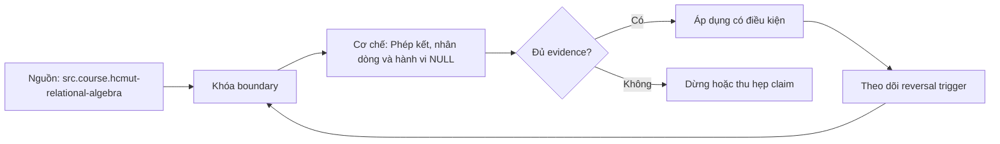

# Phép kết, nhân dòng và hành vi NULL

> [!abstract] Câu hỏi trung tâm
> Mỗi join biến grain/cardinality thế nào, row nào được bảo toàn, NULL match ra sao, và evidence nào chứng minh một báo cáo nhiều bảng không mất hoặc thổi phồng measure?

## 1. Join bắt đầu từ cặp row

Conceptually, cross join tạo mọi cặp R×S; qualified join giữ cặp mà ON là TRUE. PostgreSQL nêu N×M rows cho cross join. Physical engine không nhất thiết materialize product: hash/merge/nested-loop thực thi cùng logical relation theo plan.

Trước join, viết grain: “một row mỗi invoice”, “một row mỗi invoice line”, “một row mỗi product version”. Không biết grain thì không thể dự đoán multiplicity.

## 2. Inner join

Mỗi left row xuất hiện một lần cho mỗi right match. Zero match làm left row mất; nhiều match nhân row. Inner join phù hợp khi chỉ cần intersection theo condition. PK/FK không tự đảm bảo 1:1: FK phía child tạo nhiều children cho một parent.

Đếm unmatched keys trước khi inner join. Nếu mục tiêu giữ mọi invoice, inner join tới optional payment có thể làm mất unpaid invoices.

## 3. Left, right và full outer join

Left join thực hiện matches rồi thêm một null-extended row cho mỗi left row không match. Nó bảo toàn **ít nhất một output row** mỗi left row, không bảo đảm đúng một—multi-match vẫn nhân. Right là converse; full giữ unmatched cả hai phía.

Null-extended columns không phân biệt “không có match” với matched row có nullable column nếu chỉ kiểm một nullable field. Kiểm right-side key declared NOT NULL, hoặc marker rõ.

## 4. ON và WHERE với outer join

Right predicate trong ON quyết định row nào eligible để match nhưng vẫn preserve left row. Cùng predicate trong WHERE chạy sau join và loại null-extended rows vì UNKNOWN/FALSE. Đây là lỗi left join âm thầm thành inner-like.

Nếu yêu cầu “mọi customer và paid orders nếu có”, status nằm ON. Nếu yêu cầu “chỉ customer có paid order”, inner/EXISTS rõ hơn. Không chọn placement vì performance trước semantics.

## 5. Semi join

Semi join trả left row nếu tồn tại ít nhất một match, không trả right columns và không nhân left row. SQL thường biểu đạt bằng EXISTS. Dùng khi câu hỏi là existence: customer có order hay không.

Inner join + DISTINCT left columns có thể cho output giống nhưng làm thừa work và che duplicate. EXISTS truyền đạt grain đúng; optimizer có thể chọn semi-join plan.

## 6. Anti join

Anti join trả left rows không có match, thường bằng NOT EXISTS. `LEFT JOIN ... WHERE right.key IS NULL` có thể tương đương khi marker đúng, nhưng dễ sai nếu kiểm nullable non-key. `NOT IN` gặp NULL có thể UNKNOWN và trả kết quả bất ngờ.

Test anti join có right-side NULL, duplicate và empty set. Domain key nullable phải được xử lý có chủ đích.

## 7. NULL trong join condition

Equality `NULL = NULL` là UNKNOWN, nên không match. Coalesce cả hai NULL thành sentinel có thể làm mọi missing key match nhau và tạo explosion. `IS NOT DISTINCT FROM` cho null-safe match nhưng cũng gom all-null equivalence; chỉ dùng khi domain thật sự định nghĩa vậy.

Null key thường là data-quality issue hoặc optional relation. Đếm null rate, route quarantine hoặc giữ unmatched qua outer join; không giấu bằng sentinel không có provenance.

## 8. Fanout toán học

Với key k, output multiplicity cho inner equality join là:

$$
rows_{out}=\sum_k count_R(k)\times count_S(k)
$$

Nếu cả hai phía duplicate, fanout nhân chéo. Left join thêm left counts cho keys không match. Formula giúp dự đoán và xác định key nào gây bùng.

Profile `count(*) by key having count(*)>1` ở cả hai bên. Unique constraint là proof tốt hơn sample count cho intended 1-side.

## 9. Measure inflation

Invoice total lặp theo mỗi payment/tag/line match; SUM sau join bị nhân mà không error. Nếu join hai child collections độc lập như lines và payments qua invoice, output tạo line×payment combinations. Aggregate riêng từng child về invoice grain rồi join.

Không dùng SUM(DISTINCT amount) để chữa: hai invoice hợp lệ cùng amount sẽ bị gộp. DISTINCT operates value/output, không hiểu business identity.

## 10. Grain contract

Mỗi CTE/stage ghi:

- row grain;
- candidate/unique key;
- expected relationship với stage kế;
- expected row-count direction;
- measure additivity;
- allowed unmatched/null keys.

Join review so contract với DDL constraints và profiles. Nếu expected many-to-one nhưng right key không unique, fail trước khi báo cáo.

## 11. Đếm row sau từng bước

Lưu `count(*)`, `count(distinct business_key)`, unmatched count, duplicate-key count và sum of control measure. Row count tăng không tự là lỗi nếu join 1:N đúng; vấn đề là output grain có mong vậy không.

Một audit query nhóm theo left ID và đếm matches, báo distribution 0/1/>1. Top fanout keys giúp tìm late-arriving dimension, SCD overlap, duplicate master hoặc join condition thiếu hiệu lực thời gian.

## 12. Reconciliation tổng

Chọn control total từ authoritative base trước join: invoice amount, quantity hoặc count IDs. Sau pipeline, reconcile đúng grain và tolerance. Nếu currency/rounding, ghi unit và rule. “Tổng cuối giống dashboard cũ” không đủ nếu dashboard cũ cũng sai.

Kiểm both directions bằng anti-joins: base missing from output và output without base. Lưu reason categories cho legitimate exclusions.

## 13. Slowly changing và temporal join

Join fact với dimension version chỉ bằng natural key có thể match nhiều versions. Điều kiện cần effective interval: fact_time >= valid_from và < valid_to, đồng thời intervals không overlap. Boundary half-open tránh double-match tại timestamp chuyển phiên bản.

Nếu late-arriving fact trước earliest version, policy unknown member hoặc quarantine phải rõ. Coalesce current version làm sai lịch sử.

## 14. Many-to-many hợp lệ

Một quan hệ M:N thật cần bridge và allocation rule nếu cộng measure. Doanh thu sản phẩm gán nhiều campaign không thể cộng full revenue cho mỗi campaign rồi tổng toàn bộ. Dùng weight sum=1 hoặc nói metric non-additive across campaign.

Bridge duplicate pair cần key/constraint. Weight validation và effective dates là data quality rules.

## 15. NATURAL và USING

USING rõ danh sách common columns và suppress duplicate output key. NATURAL tự lấy mọi tên cột chung; schema thêm một cột cùng tên có thể đổi join mà query không đổi, nên rủi ro production. Ưu tiên ON/USING explicit.

Column naming không chứng minh semantic equality. Hai cột `status` không nên tự join.

## 16. Ghép năm bảng có kiểm chứng

Xây báo cáo doanh thu theo customer/product từ invoice, line, product, customer và optional adjustment/payment. Vẽ grain graph. Aggregate one-to-many measures đúng stage. Sau mỗi join lưu audit table. Tạo duplicate product version hoặc extra child để định lượng inflation factor.

Chuyển right predicate ON→WHERE và ghi lost left IDs. Đưa NULL key vào và ghi unmatched. Final control total phải bằng direct calculation từ invoice-line source theo cùng filters.

## 17. Plan và algorithms

Hash, merge, nested loop là physical implementations; correctness không phụ thuộc thuật toán nếu engine đúng. Plan choice ảnh hưởng performance và có thể phơi estimation error do correlation/skew. Compare estimated vs actual rows tại join nodes; sai lớn báo statistics/constraint/predicate issue.

Không dùng join hint/rewrite trước khi semantics/grain đúng. Một plan nhanh trả số sai không đạt.

## 17.1. Join audit ledger

Với mỗi edge trong join graph, lưu left/right grain, condition, expected cardinality, constraints chứng minh, row counts, distinct keys, null keys, unmatched, maximum/percentile matches và control totals. Ledger cho thấy fanout bắt đầu ở edge nào thay vì chỉ biết final sum sai. Một edge many-to-one phải fail audit nếu right match >1, dù final DISTINCT che được.

Thêm sample IDs cho các nhóm 0, 1 và >1 match. Với SCD, lưu intervals của offending key. Với bridge, lưu weight sum. Với optional relation, phân biệt legitimate unmatched với data-quality orphan. Reason code giúp remediation thay vì xóa row.

## 17.2. Case study năm bảng

Invoice có lines, customer, product_version và payments. Desired grain customer-product. Trước hết tính line revenue ở line grain; temporal join product version theo half-open interval và assert mỗi line đúng một version; join customer many-to-one; aggregate revenue về customer-product. Payments không được join vào line detail nếu chỉ cần paid status—dùng EXISTS hoặc aggregate payment về invoice trước.

Cố ý tạo hai product versions overlap cho một line: match count thành 2, revenue tăng gấp đôi. Cố ý tạo hai payments: direct join lines×payments nhân tiếp. `SELECT DISTINCT` không cứu SUM vì inflation xảy ra trước projection. Audit ledger bắt edge đầu tiên vi phạm. Fix constraint interval/aggregate grain rồi rerun reconciliation.

## 17.3. Bằng chứng mạnh và bằng chứng yếu

PK/UNIQUE/FK/exclusion constraint là bằng chứng schema về cardinality; profiling chỉ là bằng chứng trạng thái hiện tại. Row count trước/sau hữu ích nhưng có thể mất 10 row và nhân 10 row khác, tổng vẫn bằng. Control total có thể khớp trong khi phân bổ customer sai. Vì vậy cần constraint + match distribution + anti-join + per-key reconciliation + aggregate totals.

Kết luận “không mất, không nhân” phải ghi phạm vi dataset/snapshot và invariants. Nếu upstream chưa enforce unique, tạo data-quality gate và quarantine; không nâng sample sạch thành guarantee.

## 18. Câu hỏi tự kiểm tra

1. Left join bảo đảm “ít nhất một” hay “đúng một” output row mỗi left row?
2. Formula fanout theo key là gì?
3. EXISTS khác inner join + DISTINCT ở semantics/cardinality nào?
4. Vì sao SUM(DISTINCT amount) không chữa join multiplication?
5. Predicate right-side trong WHERE làm mất row ra sao?
6. Temporal join cần interval rule nào?

## 19. Giới hạn và điều chưa cho phép kết luận

- Row-count equality không tự chứng minh mapping đúng; wrong pairs có thể bù nhau.
- Control total equality không phát hiện mọi lỗi phân bổ theo dimension.
- Null-safe equality không tự là domain-correct.
- Plan/performance observations phụ thuộc PostgreSQL version, stats và data distribution.

## Reference
1. [[SRC-HCMUT-RELATIONAL-ALGEBRA]] — PDF 28–50.
2. [[SRC-HCMUT-SQL]] — PDF 61–79.
3. [[SRC-POSTGRESQL-17-QUERY-EXPRESSIONS]] — join types và ON/WHERE example.
4. [[SRC-POSTGRESQL-17-NULL-COMPARISON]] — NULL comparison semantics.

## Source coverage

| Source slice | Nội dung phải giữ | Vị trí trong note | Trạng thái |
|---|---|---|---|
| [[SRC-HCMUT-RELATIONAL-ALGEBRA]], PDF 28–50 | product, theta/equi/natural/outer join | §§1–6 | Đã nối formal operators với SQL |
| [[SRC-HCMUT-SQL]], PDF 61–79 | joined relations, aggregate/group | §§2–4, 9 | Đã giữ aggregate effect |
| [[SRC-POSTGRESQL-17-QUERY-EXPRESSIONS]] | join types, ON versus WHERE | §§2–6, 15 | Đã dùng official semantics |
| [[SRC-POSTGRESQL-17-NULL-COMPARISON]] | UNKNOWN/null-safe predicates | §§6–7 | Đã giữ giới hạn null-safe equality |
| Tổng hợp DE-L119 | grain, fanout, reconciliation, temporal join | §§8–17 | Đã ghi thành workflow kiểm được |

## Key takeaways
- Join multiplicity được quyết định bởi matches theo key, không bởi số table.
- Left join vẫn nhân row; WHERE trên right side có thể phá preservation.
- NULL equality không match; coalesce sentinel có thể tạo explosion.
- DISTINCT và SUM(DISTINCT) không sửa grain sai.
- Row counts, match distribution và authoritative control totals đều cần cho reconciliation.

<!-- ATOMIC-EXECUTION-CAPSULE:START -->

## Execution capsule — kiểm chứng `wiki.database.joins-duplicate-multiplication-null`

> [!important] Phân loại mệnh đề
> Với `wiki.database.joins-duplicate-multiplication-null`, sơ đồ, ví dụ và artifact về **Phép kết, nhân dòng và hành vi NULL** là **synthesis để kiểm chứng**; chúng không phải trích dẫn hay case nguyên văn của nguồn.

### Sơ đồ cơ chế và điểm kiểm soát



Đọc sơ đồ `wiki.database.joins-duplicate-multiplication-null` từ trái sang phải: source chỉ cung cấp claim ban đầu cho **Phép kết, nhân dòng và hành vi NULL**; quyết định chỉ được đi tiếp sau khi boundary, evidence và điều kiện đảo quyết định đã hiện hữu.

### Artifact thực thi tối thiểu

```sql
-- Verification harness for: Phép kết, nhân dòng và hành vi NULL
WITH evidence AS (
    SELECT 'wiki.database.joins-duplicate-multiplication-null' AS concept_id,
           'boundary_declared' AS check_name, 1 AS passed
    UNION ALL
    SELECT 'wiki.database.joins-duplicate-multiplication-null', 'independent_oracle', 1
    UNION ALL
    SELECT 'wiki.database.joins-duplicate-multiplication-null', 'reversal_trigger_recorded', 1
)
SELECT concept_id,
       MIN(passed) AS all_hard_checks_pass,
       COUNT(*) AS evidence_items
FROM evidence
GROUP BY concept_id
HAVING MIN(passed) = 1;
```

Artifact của `wiki.database.joins-duplicate-multiplication-null` buộc người dùng ghi boundary, oracle và reversal trigger cho **Phép kết, nhân dòng và hành vi NULL**. Các giá trị minh họa phải được thay bằng evidence thật trước khi dùng cho quyết định.

### Tự kiểm tra trước khi tái sử dụng

1. Bạn có thể trả lời `Làm sao viết và kiểm chứng join nhiều bảng để không mất row, không nhân measure, không phá outer semantics và không che lỗi bằng DISTINCT?` bằng một câu mà không kéo thêm concept thứ hai không?
2. Source locator nào đỡ cho claim, và phần nào chỉ là synthesis trong note?
3. Observation nào khiến bạn dừng, thu hẹp hoặc đảo quyết định?
4. Artifact nào cho phép một reviewer độc lập tái hiện kết quả?

<!-- ATOMIC-EXECUTION-CAPSULE:END -->
