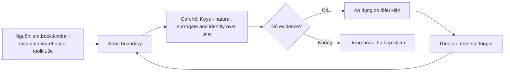

# Keys - natural, surrogate and identity over time

> [!abstract] Câu hỏi trung tâm
> Natural key, surrogate key và identity resolution phối hợp thế nào khi mã nghiệp vụ đổi, bị tái sử dụng hoặc hai bản ghi phải merge/split?

## 1. Ba lớp identity

Business/natural key do miền hoặc source cấp; warehouse surrogate key là identifier nội bộ ổn định cho row/version; canonical entity ID nối nhiều source records vào một identity nếu có resolution process. Không một loại nào tự thay thế hai loại còn lại. Source system và effective time thường là một phần của uniqueness scope.

## 2. Lý do dùng surrogate

Operational code có thể dài, thay đổi, trùng qua sources hoặc tái sử dụng. Integer surrogate làm fact FK nhỏ và tách lịch sử warehouse khỏi lifecycle source. Kimball dùng surrogate để biểu diễn unknown/not-applicable và SCD versions. Nhưng surrogate chỉ đảm bảo technical uniqueness; vẫn phải lưu business key và constraint/matching rule.

## 3. Uniqueness theo thời gian

Mã khách có thể unique tại một thời điểm nhưng tái cấp sau closure. Mô hình cần effective_from/effective_to, source và non-overlap constraint; unique(code) tuyệt đối có thể sai, còn bỏ constraint hoàn toàn cũng sai. Hai intervals cùng code không được overlap nếu contract là temporal uniqueness.

## 4. Merge và split

Khi hai source records hóa ra một người, không xóa lịch sử. Ghi mapping/identity link có provenance, effective time và decision version; facts có thể được interpreted theo identity hiện tại hoặc identity known-at-time. Split đảo một merge sai khó hơn và cần immutable lineage. Golden record không đồng nghĩa xoá source identities.

## 5. Hash key

Deterministic hash hỗ trợ distributed key generation nhưng cần canonicalization, delimiter/type/null rules, algorithm/version và collision plan. Null/empty/unknown không được trộn. Hash business key vẫn đổi khi business key đổi và không giải quyết entity resolution. Không tuyên bố collision impossible; dùng unique business constraint và kiểm collision.

## 6. Ma trận kiểm chứng từng mệnh đề

Mỗi mệnh đề phải được chuyển thành invariant, fixture và phép đối chiếu có thể chạy lại. Sơ đồ đẹp hoặc một truy vấn trả về kết quả không lỗi không tự chứng minh mô hình đúng ngữ nghĩa.

### 6.1. natural key phải kèm source namespace khi codes trùng

**Mệnh đề cần kiểm.** natural key phải kèm source namespace khi codes trùng. **Thiết kế phép kiểm.** Tạo identity timeline có code change, code reuse, hai source trùng mã, merge và split. Kiểm business uniqueness theo namespace/effective time, non-overlap, surrogate uniqueness và crosswalk lineage bằng truy vấn tái chạy. Bằng chứng đạt phải giữ được source identity, warehouse version và canonical identity mà không rewrite lịch sử. **Hồ sơ cần lưu.** Grain/model/metric contract, dữ liệu seed, SQL hoặc notebook, kết quả thô, control totals và giải thích ca biên. Nếu phép kiểm chỉ xác nhận cấu trúc mà không xác nhận semantics, kết luận phải ghi rõ giới hạn đó.

### 6.2. surrogate key không thay business-key reconciliation

**Mệnh đề cần kiểm.** surrogate key không thay business-key reconciliation. **Thiết kế phép kiểm.** Tạo identity timeline có code change, code reuse, hai source trùng mã, merge và split. Kiểm business uniqueness theo namespace/effective time, non-overlap, surrogate uniqueness và crosswalk lineage bằng truy vấn tái chạy. Bằng chứng đạt phải giữ được source identity, warehouse version và canonical identity mà không rewrite lịch sử. **Hồ sơ cần lưu.** Grain/model/metric contract, dữ liệu seed, SQL hoặc notebook, kết quả thô, control totals và giải thích ca biên. Nếu phép kiểm chỉ xác nhận cấu trúc mà không xác nhận semantics, kết luận phải ghi rõ giới hạn đó.

### 6.3. reused code cần temporal non-overlap

**Mệnh đề cần kiểm.** reused code cần temporal non-overlap. **Thiết kế phép kiểm.** Tạo identity timeline có code change, code reuse, hai source trùng mã, merge và split. Kiểm business uniqueness theo namespace/effective time, non-overlap, surrogate uniqueness và crosswalk lineage bằng truy vấn tái chạy. Bằng chứng đạt phải giữ được source identity, warehouse version và canonical identity mà không rewrite lịch sử. **Hồ sơ cần lưu.** Grain/model/metric contract, dữ liệu seed, SQL hoặc notebook, kết quả thô, control totals và giải thích ca biên. Nếu phép kiểm chỉ xác nhận cấu trúc mà không xác nhận semantics, kết luận phải ghi rõ giới hạn đó.

### 6.4. SCD version surrogate khác canonical entity identity

**Mệnh đề cần kiểm.** SCD version surrogate khác canonical entity identity. **Thiết kế phép kiểm.** Tạo identity timeline có code change, code reuse, hai source trùng mã, merge và split. Kiểm business uniqueness theo namespace/effective time, non-overlap, surrogate uniqueness và crosswalk lineage bằng truy vấn tái chạy. Bằng chứng đạt phải giữ được source identity, warehouse version và canonical identity mà không rewrite lịch sử. **Hồ sơ cần lưu.** Grain/model/metric contract, dữ liệu seed, SQL hoặc notebook, kết quả thô, control totals và giải thích ca biên. Nếu phép kiểm chỉ xác nhận cấu trúc mà không xác nhận semantics, kết luận phải ghi rõ giới hạn đó.

### 6.5. merge cần lineage thay vì delete duplicate

**Mệnh đề cần kiểm.** merge cần lineage thay vì delete duplicate. **Thiết kế phép kiểm.** Tạo identity timeline có code change, code reuse, hai source trùng mã, merge và split. Kiểm business uniqueness theo namespace/effective time, non-overlap, surrogate uniqueness và crosswalk lineage bằng truy vấn tái chạy. Bằng chứng đạt phải giữ được source identity, warehouse version và canonical identity mà không rewrite lịch sử. **Hồ sơ cần lưu.** Grain/model/metric contract, dữ liệu seed, SQL hoặc notebook, kết quả thô, control totals và giải thích ca biên. Nếu phép kiểm chỉ xác nhận cấu trúc mà không xác nhận semantics, kết luận phải ghi rõ giới hạn đó.

### 6.6. split cần đảo mapping theo effective period

**Mệnh đề cần kiểm.** split cần đảo mapping theo effective period. **Thiết kế phép kiểm.** Tạo identity timeline có code change, code reuse, hai source trùng mã, merge và split. Kiểm business uniqueness theo namespace/effective time, non-overlap, surrogate uniqueness và crosswalk lineage bằng truy vấn tái chạy. Bằng chứng đạt phải giữ được source identity, warehouse version và canonical identity mà không rewrite lịch sử. **Hồ sơ cần lưu.** Grain/model/metric contract, dữ liệu seed, SQL hoặc notebook, kết quả thô, control totals và giải thích ca biên. Nếu phép kiểm chỉ xác nhận cấu trúc mà không xác nhận semantics, kết luận phải ghi rõ giới hạn đó.

### 6.7. hash input phải có canonical null/delimiter/type rules

**Mệnh đề cần kiểm.** hash input phải có canonical null/delimiter/type rules. **Thiết kế phép kiểm.** Tạo identity timeline có code change, code reuse, hai source trùng mã, merge và split. Kiểm business uniqueness theo namespace/effective time, non-overlap, surrogate uniqueness và crosswalk lineage bằng truy vấn tái chạy. Bằng chứng đạt phải giữ được source identity, warehouse version và canonical identity mà không rewrite lịch sử. **Hồ sơ cần lưu.** Grain/model/metric contract, dữ liệu seed, SQL hoặc notebook, kết quả thô, control totals và giải thích ca biên. Nếu phép kiểm chỉ xác nhận cấu trúc mà không xác nhận semantics, kết luận phải ghi rõ giới hạn đó.

### 6.8. algorithm version phải được lưu khi hash thay đổi

**Mệnh đề cần kiểm.** algorithm version phải được lưu khi hash thay đổi. **Thiết kế phép kiểm.** Tạo identity timeline có code change, code reuse, hai source trùng mã, merge và split. Kiểm business uniqueness theo namespace/effective time, non-overlap, surrogate uniqueness và crosswalk lineage bằng truy vấn tái chạy. Bằng chứng đạt phải giữ được source identity, warehouse version và canonical identity mà không rewrite lịch sử. **Hồ sơ cần lưu.** Grain/model/metric contract, dữ liệu seed, SQL hoặc notebook, kết quả thô, control totals và giải thích ca biên. Nếu phép kiểm chỉ xác nhận cấu trúc mà không xác nhận semantics, kết luận phải ghi rõ giới hạn đó.

### 6.9. collision cần detection và resolution

**Mệnh đề cần kiểm.** collision cần detection và resolution. **Thiết kế phép kiểm.** Tạo identity timeline có code change, code reuse, hai source trùng mã, merge và split. Kiểm business uniqueness theo namespace/effective time, non-overlap, surrogate uniqueness và crosswalk lineage bằng truy vấn tái chạy. Bằng chứng đạt phải giữ được source identity, warehouse version và canonical identity mà không rewrite lịch sử. **Hồ sơ cần lưu.** Grain/model/metric contract, dữ liệu seed, SQL hoặc notebook, kết quả thô, control totals và giải thích ca biên. Nếu phép kiểm chỉ xác nhận cấu trúc mà không xác nhận semantics, kết luận phải ghi rõ giới hạn đó.

### 6.10. unknown member khác missing source key

**Mệnh đề cần kiểm.** unknown member khác missing source key. **Thiết kế phép kiểm.** Tạo identity timeline có code change, code reuse, hai source trùng mã, merge và split. Kiểm business uniqueness theo namespace/effective time, non-overlap, surrogate uniqueness và crosswalk lineage bằng truy vấn tái chạy. Bằng chứng đạt phải giữ được source identity, warehouse version và canonical identity mà không rewrite lịch sử. **Hồ sơ cần lưu.** Grain/model/metric contract, dữ liệu seed, SQL hoặc notebook, kết quả thô, control totals và giải thích ca biên. Nếu phép kiểm chỉ xác nhận cấu trúc mà không xác nhận semantics, kết luận phải ghi rõ giới hạn đó.

### 6.11. late-arriving dimension cần inferred/unknown handling

**Mệnh đề cần kiểm.** late-arriving dimension cần inferred/unknown handling. **Thiết kế phép kiểm.** Tạo identity timeline có code change, code reuse, hai source trùng mã, merge và split. Kiểm business uniqueness theo namespace/effective time, non-overlap, surrogate uniqueness và crosswalk lineage bằng truy vấn tái chạy. Bằng chứng đạt phải giữ được source identity, warehouse version và canonical identity mà không rewrite lịch sử. **Hồ sơ cần lưu.** Grain/model/metric contract, dữ liệu seed, SQL hoặc notebook, kết quả thô, control totals và giải thích ca biên. Nếu phép kiểm chỉ xác nhận cấu trúc mà không xác nhận semantics, kết luận phải ghi rõ giới hạn đó.

### 6.12. business key change không nên rewrite fact history tuỳ tiện

**Mệnh đề cần kiểm.** business key change không nên rewrite fact history tuỳ tiện. **Thiết kế phép kiểm.** Tạo identity timeline có code change, code reuse, hai source trùng mã, merge và split. Kiểm business uniqueness theo namespace/effective time, non-overlap, surrogate uniqueness và crosswalk lineage bằng truy vấn tái chạy. Bằng chứng đạt phải giữ được source identity, warehouse version và canonical identity mà không rewrite lịch sử. **Hồ sơ cần lưu.** Grain/model/metric contract, dữ liệu seed, SQL hoặc notebook, kết quả thô, control totals và giải thích ca biên. Nếu phép kiểm chỉ xác nhận cấu trúc mà không xác nhận semantics, kết luận phải ghi rõ giới hạn đó.

### 6.13. PII matching cần privacy/approval boundary

**Mệnh đề cần kiểm.** PII matching cần privacy/approval boundary. **Thiết kế phép kiểm.** Tạo identity timeline có code change, code reuse, hai source trùng mã, merge và split. Kiểm business uniqueness theo namespace/effective time, non-overlap, surrogate uniqueness và crosswalk lineage bằng truy vấn tái chạy. Bằng chứng đạt phải giữ được source identity, warehouse version và canonical identity mà không rewrite lịch sử. **Hồ sơ cần lưu.** Grain/model/metric contract, dữ liệu seed, SQL hoặc notebook, kết quả thô, control totals và giải thích ca biên. Nếu phép kiểm chỉ xác nhận cấu trúc mà không xác nhận semantics, kết luận phải ghi rõ giới hạn đó.

### 6.14. manual identity decision cần reviewer và evidence

**Mệnh đề cần kiểm.** manual identity decision cần reviewer và evidence. **Thiết kế phép kiểm.** Tạo identity timeline có code change, code reuse, hai source trùng mã, merge và split. Kiểm business uniqueness theo namespace/effective time, non-overlap, surrogate uniqueness và crosswalk lineage bằng truy vấn tái chạy. Bằng chứng đạt phải giữ được source identity, warehouse version và canonical identity mà không rewrite lịch sử. **Hồ sơ cần lưu.** Grain/model/metric contract, dữ liệu seed, SQL hoặc notebook, kết quả thô, control totals và giải thích ca biên. Nếu phép kiểm chỉ xác nhận cấu trúc mà không xác nhận semantics, kết luận phải ghi rõ giới hạn đó.

### 6.15. crosswalk table phải có uniqueness và temporal tests

**Mệnh đề cần kiểm.** crosswalk table phải có uniqueness và temporal tests. **Thiết kế phép kiểm.** Tạo identity timeline có code change, code reuse, hai source trùng mã, merge và split. Kiểm business uniqueness theo namespace/effective time, non-overlap, surrogate uniqueness và crosswalk lineage bằng truy vấn tái chạy. Bằng chứng đạt phải giữ được source identity, warehouse version và canonical identity mà không rewrite lịch sử. **Hồ sơ cần lưu.** Grain/model/metric contract, dữ liệu seed, SQL hoặc notebook, kết quả thô, control totals và giải thích ca biên. Nếu phép kiểm chỉ xác nhận cấu trúc mà không xác nhận semantics, kết luận phải ghi rõ giới hạn đó.

## 7. Quy trình phản biện mô hình

1. Viết business question, grain, identity, time semantics và invariant trước khi vẽ bảng.
2. Chỉ ra owner của định nghĩa và artifact nào là canonical.
3. Tách source fact, quyết định thiết kế và curriculum synthesis; không gán suy luận cho sách.
4. Dựng ca biên tối thiểu: duplicate, null, late correction, code reuse, many-to-many hoặc missing period tuỳ bài.
5. Đo row count, distinct business key, unmatched rate và control totals trước–sau mỗi phép biến đổi.
6. Thử replay/backfill và đổi cutoff; thiết kế không tái chạy được chưa đủ bằng chứng để vận hành.
7. Lưu quyết định, phản ví dụ và giới hạn; không xoá failed run vì nó là bằng chứng của failure boundary.

## 8. Câu hỏi tự kiểm tra

1. Row đại diện điều gì, được nhận dạng bằng gì và có hiệu lực khi nào?
2. Ca biên nhỏ nhất nào làm thiết kế cho ra số sai nhưng SQL vẫn hợp lệ?
3. Constraint/test nào bắt lỗi cấu trúc, và phần ngữ nghĩa nào vẫn cần owner xác nhận?
4. Late data, correction, replay và backfill làm model thay đổi ra sao?
5. Phần nào đến trực tiếp từ nguồn; phần nào là tổng hợp của giáo trình?
6. Artifact và phép kiểm nào cho phép người khác bác bỏ kết luận?

## 9. Giới hạn và điều chưa cho phép kết luận

- Chưa chạy profiling, merge/backfill hay reconciliation lab; các phép kiểm trong note là giao thức cần thực thi, không phải kết quả đã đo.
- Sample không có duplicate không chứng minh business uniqueness; schema hợp lệ không chứng minh đúng grain.
- HCMUT System Modeling cung cấp khung abstraction/perspective; phép ánh xạ conceptual–logical–physical trong bài là synthesis có ghi nhãn.
- DDIA và Silberschatz cung cấp ranh giới data model/database design; taxonomy dimensional chi tiết lấy Kimball–Ross làm nguồn chính.
- Không suy performance, dung lượng, threshold hoặc production readiness nếu chưa đo trên workload và engine mục tiêu.

## Reference
1. [[SRC-KIMBALL-ROSS-DW-TOOLKIT-3E]]
2. [[SRC-HCMUT-ENTITY-RELATIONSHIP-MODEL]]
3. [[SRC-SILBERSCHATZ-DATABASE-SYSTEM-CONCEPTS-7E]]

## Source coverage

| Source slice | Nội dung sử dụng | Trạng thái |
|---|---|---|
| [[SRC-KIMBALL-ROSS-DW-TOOLKIT-3E]] | Khái niệm, ranh giới và phản ví dụ liên quan đến bài | Đã đọc phạm vi có locator; không suy nội dung ngoài phạm vi |
| [[SRC-HCMUT-ENTITY-RELATIONSHIP-MODEL]] | Khái niệm, ranh giới và phản ví dụ liên quan đến bài | Đã đọc phạm vi có locator; không suy nội dung ngoài phạm vi |
| [[SRC-SILBERSCHATZ-DATABASE-SYSTEM-CONCEPTS-7E]] | Khái niệm, ranh giới và phản ví dụ liên quan đến bài | Đã đọc phạm vi có locator; không suy nội dung ngoài phạm vi |

## Key takeaways
- Bắt đầu từ business question, grain, identity, time và invariant; cột là hệ quả, không phải điểm xuất phát.
- Tách ngữ nghĩa, logical constraints và physical implementation để thay đổi có traceability.
- Key duy nhất, SQL chạy được hoặc diagram đẹp không tự chứng minh mô hình đúng.
- Mọi measure cần aggregation contract theo grain, dimension, unit, cutoff và late-data policy.
- Chưa chạy phép kiểm thì note là tài liệu học thuật đã truy nguồn, không phải chứng nhận production.

<!-- ATOMIC-EXECUTION-CAPSULE:START -->

## Execution capsule — kiểm chứng `wiki.data-modeling.keys-identity-over-time`

> [!important] Phân loại mệnh đề
> Với `wiki.data-modeling.keys-identity-over-time`, sơ đồ, ví dụ và artifact về **Keys - natural, surrogate and identity over time** là **synthesis để kiểm chứng**; chúng không phải trích dẫn hay case nguyên văn của nguồn.

### Sơ đồ cơ chế và điểm kiểm soát



Đọc sơ đồ `wiki.data-modeling.keys-identity-over-time` từ trái sang phải: source chỉ cung cấp claim ban đầu cho **Keys - natural, surrogate and identity over time**; quyết định chỉ được đi tiếp sau khi boundary, evidence và điều kiện đảo quyết định đã hiện hữu.

### Artifact thực thi tối thiểu

```sql
-- Verification harness for: Keys - natural, surrogate and identity over time
WITH evidence AS (
    SELECT 'wiki.data-modeling.keys-identity-over-time' AS concept_id,
           'boundary_declared' AS check_name, 1 AS passed
    UNION ALL
    SELECT 'wiki.data-modeling.keys-identity-over-time', 'independent_oracle', 1
    UNION ALL
    SELECT 'wiki.data-modeling.keys-identity-over-time', 'reversal_trigger_recorded', 1
)
SELECT concept_id,
       MIN(passed) AS all_hard_checks_pass,
       COUNT(*) AS evidence_items
FROM evidence
GROUP BY concept_id
HAVING MIN(passed) = 1;
```

Artifact của `wiki.data-modeling.keys-identity-over-time` buộc người dùng ghi boundary, oracle và reversal trigger cho **Keys - natural, surrogate and identity over time**. Các giá trị minh họa phải được thay bằng evidence thật trước khi dùng cho quyết định.

### Tự kiểm tra trước khi tái sử dụng

1. Bạn có thể trả lời `Natural key, surrogate key và identity resolution phối hợp thế nào khi mã nghiệp vụ đổi, bị tái sử dụng hoặc hai bản ghi phải merge/split?` bằng một câu mà không kéo thêm concept thứ hai không?
2. Source locator nào đỡ cho claim, và phần nào chỉ là synthesis trong note?
3. Observation nào khiến bạn dừng, thu hẹp hoặc đảo quyết định?
4. Artifact nào cho phép một reviewer độc lập tái hiện kết quả?

<!-- ATOMIC-EXECUTION-CAPSULE:END -->
