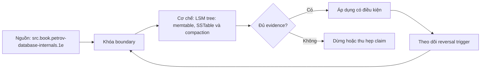

# LSM tree: memtable, SSTable và compaction

> [!abstract] Câu hỏi trung tâm
> Một bản ghi đi qua những trạng thái nào từ lúc được nhận đến lúc nằm trong SSTable, và hệ thống làm gì để đọc đúng, xoá đúng và phục hồi đúng khi có nhiều phiên bản bất biến?

## 1. Vấn đề mà LSM tree giải quyết

Một cấu trúc cập nhật tại chỗ phải tìm trang chứa bản ghi rồi sửa trang đó. Với tải ghi phân tán, thao tác này tạo nhiều lần đọc-sửa-ghi và có thể biến thành I/O ngẫu nhiên. LSM tree chọn hướng khác: nhận thay đổi vào cấu trúc có thứ tự trong bộ nhớ, ghi nhật ký để bảo đảm bền vững, rồi đẩy một chuỗi đã sắp xếp xuống các tệp bất biến.

Lợi ích không đến từ việc không ghi đĩa. Dữ liệu vẫn phải đi qua WAL, flush và nhiều lần compaction. Lợi ích nằm ở việc gom nhiều cập nhật nhỏ thành các lượt ghi lớn hơn, tuần tự hơn và dễ nén hơn. Cái giá là một khóa có thể tồn tại ở nhiều thành phần; đường đọc phải tìm, hợp nhất và phân giải phiên bản.

Do đó, câu LSM tối ưu ghi chỉ có nghĩa khi kèm workload, compaction policy, storage và độ trễ cần bảo vệ. Không có bảo đảm rằng mọi write đơn lẻ luôn nhanh hơn B-tree.

## 2. Các thành phần và đường đi của dữ liệu

Một triển khai điển hình có WAL/commit log, memtable đang nhận ghi, một hoặc nhiều immutable memtable đang flush, các SSTable trên đĩa, metadata/index thưa, Bloom filter và scheduler compaction. Manifest hoặc version set mô tả tập tệp nào tạo thành view hợp lệ hiện tại.

Đường ghi tối thiểu là: append record vào WAL theo durability policy; áp thay đổi vào memtable; acknowledge theo commit contract; khi memtable chạm ngưỡng, đổi sang memtable mới; flush memtable cũ thành SSTable; công bố SSTable nguyên tử vào read view; sau đó mới giải phóng memtable và đoạn WAL tương ứng.

Thứ tự trên là điều kiện đúng, không phải chi tiết triển khai tùy ý. Cắt WAL trước khi SSTable được công bố bền vững tạo cửa sổ mất dữ liệu. Bỏ memtable cũ khỏi read view trước khi SSTable mới sẵn sàng tạo cửa sổ đọc thiếu.

## 3. Memtable không chỉ là một cache

Memtable là thành phần mutable, có thứ tự và tham gia trực tiếp vào kết quả đọc. Nó có thể dùng red-black tree, AVL tree, skip list hoặc cấu trúc đồng thời tương đương. Nó cần hỗ trợ point lookup, ordered iteration và concurrent access theo contract của engine.

Vì nằm trong RAM, memtable tự nó không bền vững. WAL giữ đủ thông tin để dựng lại memtable sau crash. Khi memtable đạt ngưỡng, engine phải chuyển ghi mới sang memtable khác trong khi memtable cũ vẫn phục vụ đọc và đang được flush. Đã bắt đầu flush không đồng nghĩa đã an toàn để xoá WAL.

Ngưỡng memtable ảnh hưởng tần suất flush, số SSTable level 0, memory pressure và recovery log. Memtable lớn giảm số lần flush nhưng tăng RAM và thời gian phục hồi; memtable nhỏ tạo nhiều file nhỏ và compaction pressure. Không có kích thước mặc định đúng cho mọi workload.

## 4. SSTable và tính bất biến

SSTable là tệp chứa bản ghi sắp xếp theo khóa. Trong một tệp đã compact, một khóa thường chỉ còn phiên bản thắng theo rule của engine. Tính có thứ tự cho phép merge-sort tuyến tính, range scan và sparse index: index không cần giữ mọi khóa, chỉ cần điểm neo cho block rồi scan trong một khoảng nhỏ.

Tệp bất biến có thể được đọc đồng thời mà không cần sửa nội dung. Checksum, block index, compression metadata và Bloom filter được tạo cùng tệp. Một tệp chưa hoàn tất không được xuất hiện trong live version; thường engine ghi tệp mới, sync theo durability contract, rồi cập nhật manifest/version atomically.

SSTable không quy định một format duy nhất. Block size, compression, partitioning, index và filter thay đổi theo engine. Khi so sánh cần ghi phiên bản và cấu hình cụ thể.

## 5. Lookup qua nhiều nguồn

Point read thường tra memtable hiện tại, immutable memtable, rồi SSTable từ mới đến cũ hoặc theo level/range metadata. Kết quả đầu tiên chỉ được trả ngay nếu ordering và sequence-number semantics chứng minh không có phiên bản mới hơn ở nguồn khác. Range scan cần iterator trên nhiều nguồn và multiway merge.

Merge iterator giữ head của mỗi nguồn trong priority queue. Khi nhiều head có cùng khóa, reconciliation chọn record mới nhất theo sequence/timestamp contract và loại bản bị shadow. Cần phân biệt timestamp logic của engine với wall-clock time; dùng clock vật lý thiếu quy tắc có thể làm sai thứ tự.

Chi phí lookup phụ thuộc số nguồn phải chạm, cache/index/filter, overlap của key ranges và tỷ lệ khóa không tồn tại. Đọc phải tra mọi file là mô tả cực đoan, không tính metadata và Bloom filter.

## 6. Bloom filter hỗ trợ điều gì

Bloom filter có thể kết luận chắc chắn không có nhưng kết luận có thể có vẫn cần đọc SSTable. False positive làm tăng read work; false negative không được phép nếu filter được xây và dùng đúng. Kích thước bitset và số hash functions đổi memory, CPU và false-positive rate.

Filter hữu ích nhất cho negative point lookups hoặc khi có nhiều SSTable candidates. Nó không tự giải quyết range scan, không xóa read amplification do phiên bản trùng và không thay index block. Khi đo, cần tách filter check, false positives, data-block reads và cache hits.

## 7. Update, upsert và version precedence

LSM tree không nhất thiết tìm bản cũ khi ghi. Insert và update thường cùng tạo record mới. Vì nhiều phiên bản tồn tại, engine cần sequence number hoặc metadata thứ tự để xác định record thắng trong read và compaction.

Đây không tự động tạo đúng semantics cho compare-and-set, uniqueness hoặc conditional update. Những invariant đó cần concurrency-control/transaction layer. Storage layer biết phiên bản vật lý mới hơn chưa chắc biết business update hợp lệ.

Một read view phải cố định tập component/version trong suốt operation. Nếu compaction đổi file set giữa chừng mà iterator không có snapshot/version pin, range scan có thể trùng hoặc sót dữ liệu.

## 8. Tombstone và nguy cơ hồi sinh dữ liệu

Xóa một khóa bằng cách bỏ nó khỏi memtable là sai vì phiên bản cũ vẫn nằm trong SSTable. Engine ghi tombstone có thứ tự mới hơn để che các value cũ. Tombstone tham gia lookup và merge như một record có semantics xoá.

Không được bỏ tombstone ngay khi gặp trong một compaction cục bộ. Nếu còn SSTable ngoài input chứa value cũ, xóa tombstone sẽ làm value đó xuất hiện lại. Engine chỉ drop khi chứng minh đã bao phủ mọi phiên bản cũ liên quan; trong hệ phân tán còn phải xét replica lag, repair và grace period.

Range tombstone phức tạp hơn vì giao key ranges và file boundaries. Bài lab phải kiểm cả delete, update-after-delete và crash/restart; chỉ nhìn dung lượng giảm chưa chứng minh delete đúng.

## 9. Flush là một protocol chuyển trạng thái

Flush có tối thiểu bốn state: current memtable, immutable/flushing memtable, incomplete output và published SSTable. Ghi mới phải chuyển sang current mới trước khi old bị đóng. Old vẫn ở read view trong lúc output chưa hoàn tất. Output chỉ tham gia read sau validation và publication. WAL segment chỉ được retire sau durable publication.

Crash ở từng ranh giới phải có recovery rule: incomplete SSTable bị bỏ; memtable được replay từ WAL; published SSTable được nhận qua manifest; orphan file được phát hiện và dọn an toàn. Nếu format không có checksum/footer/manifest đủ mạnh, engine có thể nhận nhầm tệp ghi dở.

## 10. Compaction làm gì

Compaction chọn một tập SSTable, đọc tuần tự, merge/reconcile và ghi các SSTable mới. Nó loại record bị shadow, có thể drop tombstone khi đủ điều kiện, chia lại key ranges và giảm số nguồn đường đọc phải tra. Tệp cũ vẫn phục vụ read đang chạy cho đến khi version mới được công bố và không còn reader tham chiếu.

Trong khi compaction, cần thêm dung lượng cho cả input và output. Dung lượng trống không phải phần lãng phí tùy chọn; thiếu headroom có thể làm compaction dừng, L0 tăng và write stall. Nhiều compaction song song phải tránh input overlap hoặc có cơ chế ownership rõ.

Compaction là background work nhưng cạnh tranh I/O, CPU, cache và bandwidth với foreground traffic. Average throughput đẹp có thể che p99 spike hoặc write stall.

## 11. Leveled và size-tiered compaction

Leveled compaction tổ chức file thành levels. Level 0 thường cho phép range overlap; các level sau thường giữ key ranges không overlap trong cùng level. Dữ liệu đi dần sang level lớn hơn. Lookup có ít candidates hơn, space amplification thường được kiểm soát tốt hơn, nhưng dữ liệu có thể bị viết lại nhiều lần.

Size-tiered compaction nhóm các file có kích thước gần nhau. Nó có thể giảm rewrite work và phù hợp write-heavy workload, đổi lại giữ nhiều file/phiên bản hơn, làm read và space amplification cao hơn. Time-window compaction gom theo thời gian, hữu ích khi dữ liệu có TTL và partition thời gian rõ.

Tên policy không đủ để dự đoán. Fanout, level size ratio, file target size, tombstone policy và workload distribution quyết định kết quả.

## 12. Ghi tuần tự có ranh giới

SSTable output và WAL có thể tuần tự trong logical stream, nhưng hệ thật còn filesystem, nhiều streams, SSD flash translation layer, garbage collection và replication. Nhiều luồng tuần tự xen kẽ không nhất thiết tạo layout vật lý tuần tự. Compaction lại đọc/ghi khối lượng lớn và có thể gây write amplification ở tầng thiết bị.

Vì vậy không dùng mệnh đề ghi tuần tự luôn rẻ hơn. Trên HDD, seek thường tạo khác biệt lớn; trên SSD, queueing, erase blocks, controller cache, endurance và FTL quan trọng. Kết luận phải đến từ metrics trên stack mục tiêu.

## 13. Backpressure và compaction debt

Nếu tốc độ ingest vượt khả năng flush/compaction trong thời gian dài, L0 files và pending compaction bytes tăng. Read amplification tăng, disk headroom giảm, cuối cùng engine phải stall hoặc throttle writes. Tiếp tục nhận vô hạn không tạo thêm capacity.

Theo dõi flush rate, compaction input/output bytes, pending bytes, L0 count, tombstone density, stall time, disk utilization và foreground latency. Backpressure sớm giữ hệ ổn định tốt hơn đợi hết đĩa. Capacity plan phải dùng steady state và burst recovery, không chỉ peak ingest ngắn.

## 14. So sánh với B-tree đúng cách

B-tree thường có đường point read ngắn và cập nhật page tại chỗ; LSM gom ghi và giữ nhiều versions/components. Nhưng engine còn khác cache, concurrency, compression, WAL, indexes và transaction semantics. So PostgreSQL với RocksDB không phải phép thử thuần B-tree versus LSM.

Muốn tách cấu trúc, giữ key/value width, dataset, cache budget, durability, compression, concurrency và hardware càng tương đương càng tốt. Báo read/write/space amplification cùng latency, throughput, CPU và background debt. Một benchmark thiếu durability parity không hợp lệ.

## 15. Protocol khảo sát engine

Ghi engine/version/config. Xác định thư mục dữ liệu và mapping file ↔ level bằng công cụ chính thức; không sửa file. Tạo controlled writes/deletes; chụp manifest/table properties trước và sau flush. Kích hoạt compaction chỉ trong test instance, lưu log/metrics.

Với mỗi thời điểm, ghi memtable bytes, WAL position, SSTable count/size/range, Bloom statistics, compaction bytes và disk headroom. Đưa ra dự đoán trước: read candidates giảm, write bytes tăng, obsolete/tombstone space giảm. Sau chạy, đối chiếu; không điền số giả nếu công cụ không cung cấp metric.

## 16. Câu hỏi tự kiểm tra

1. Vì sao memtable vẫn cần WAL?
2. Flush phải giữ những read-view invariants nào?
3. Vì sao tombstone không được drop ở mọi compaction?
4. Bloom filter có thể trả lời chắc chắn hai trường hợp nào?
5. Leveled và size-tiered đổi read/write/space ra sao?
6. Khi nào sequential write không phản ánh pattern ở thiết bị?

## 17. Giới hạn và điều chưa cho phép kết luận

- Note mô tả họ LSM, không chứng nhận một format chung cho RocksDB, Cassandra, HBase hoặc engine khác.
- Không có benchmark nên chưa kết luận engine nào nhanh hơn.
- Clock/sequence, tombstone và compaction semantics phải kiểm theo phiên bản.
- Lab quan sát file/compaction chưa chạy; bằng chứng thực thi thuộc `after-note.md`.
- Cơ chế distributed repair và replica tombstone chỉ nêu ranh giới, chưa được triển khai ở bài này.

## Reference
1. [[SRC-PETROV-DATABASE-INTERNALS-1E]]: LSM components, lookup, compaction, tombstone, Bloom filter và concurrency.
2. [[SRC-KLEPPMANN-DDIA-1E]]: append-only segments, SSTable/memtable và so sánh B-tree/LSM-tree.
3. [[SRC-SILBERSCHATZ-DATABASE-SYSTEM-CONCEPTS-7E]]: LSM variants và cost model học thuật.

## Source coverage

| Source slice | Nội dung phải giữ | Vị trí trong note | Trạng thái |
|---|---|---|---|
| [[SRC-PETROV-DATABASE-INTERNALS-1E]], PDF 167-210 | lifecycle, merge, tombstone, compaction, filters, concurrency | §§1-13 | Đã diễn giải theo invariants |
| [[SRC-KLEPPMANN-DDIA-1E]], PDF 94-106 | segment, SSTable, memtable, WAL và B-tree comparison | §§2-6, 12-14 | Đã giữ ranh giới workload |
| [[SRC-SILBERSCHATZ-DATABASE-SYSTEM-CONCEPTS-7E]], PDF 2982-3002 | LSM levels, lookup/write cost và variants | §§10-14 | Đã tránh biến công thức thành ngưỡng phổ quát |
| DE-L135 contract | quan sát file, compaction và dự đoán amplification | §15 | Chưa chạy, chuyển sang after-note |

## Key takeaways
- LSM chuyển ghi nhỏ thành WAL + memtable + SSTable; không loại bỏ I/O.
- Read correctness phụ thuộc version ordering, merge/reconciliation và read-view stability.
- Tombstone chỉ được loại khi không thể làm dữ liệu cũ hồi sinh.
- Compaction giảm read/space debt nhưng tiêu I/O và tạo write amplification.
- Mọi kết luận nhanh/chậm phải gắn workload, durability, policy và storage stack.

<!-- ATOMIC-EXECUTION-CAPSULE:START -->

## Execution capsule: kiểm chứng `wiki.database.lsm-memtable-sstable-compaction`

> [!important] Phân loại mệnh đề
> Với `wiki.database.lsm-memtable-sstable-compaction`, sơ đồ, ví dụ và artifact về **LSM tree: memtable, SSTable và compaction** là **synthesis để kiểm chứng**; chúng không phải trích dẫn hay case nguyên văn của nguồn.

### Sơ đồ cơ chế và điểm kiểm soát



Đọc sơ đồ `wiki.database.lsm-memtable-sstable-compaction` từ trái sang phải: source chỉ cung cấp claim ban đầu cho **LSM tree: memtable, SSTable và compaction**; quyết định chỉ được đi tiếp sau khi boundary, evidence và điều kiện đảo quyết định đã hiện hữu.

### Ví dụ làm việc có thể bác bỏ

**Input.** Một đội cần trả lời: LSM tree biến luồng ghi thành memtable và SSTable như thế nào, đọc đúng giá trị qua nhiều phiên bản ra sao, và compaction phải giữ những bất biến nào? cho một phạm vi nhỏ, có owner và deadline rõ.

**Decision.** Đội áp dụng **LSM tree: memtable, SSTable và compaction** trên control và variant chỉ khác một assumption; expected result và hard constraints được khóa trước khi chạy.

**Outcome.** Với `wiki.database.lsm-memtable-sstable-compaction`, nếu observation vi phạm hard constraint hoặc oracle độc lập không xác nhận **LSM tree: memtable, SSTable và compaction**, đội thu hẹp claim hay đảo quyết định. Nếu đạt, kết luận vẫn kèm scope, version và review date; một lần thành công không được nâng thành quy luật phổ quát.

### Artifact thực thi tối thiểu

```sql
-- Verification harness for: LSM tree: memtable, SSTable và compaction
WITH evidence AS (
    SELECT 'wiki.database.lsm-memtable-sstable-compaction' AS concept_id,
           'boundary_declared' AS check_name, 1 AS passed
    UNION ALL
    SELECT 'wiki.database.lsm-memtable-sstable-compaction', 'independent_oracle', 1
    UNION ALL
    SELECT 'wiki.database.lsm-memtable-sstable-compaction', 'reversal_trigger_recorded', 1
)
SELECT concept_id,
       MIN(passed) AS all_hard_checks_pass,
       COUNT(*) AS evidence_items
FROM evidence
GROUP BY concept_id
HAVING MIN(passed) = 1;
```

Artifact của `wiki.database.lsm-memtable-sstable-compaction` buộc người dùng ghi boundary, oracle và reversal trigger cho **LSM tree: memtable, SSTable và compaction**. Các giá trị minh họa phải được thay bằng evidence thật trước khi dùng cho quyết định.

### Tự kiểm tra trước khi tái sử dụng

1. Bạn có thể trả lời `LSM tree biến luồng ghi thành memtable và SSTable như thế nào, đọc đúng giá trị qua nhiều phiên bản ra sao, và compaction phải giữ những bất biến nào?` bằng một câu mà không kéo thêm concept thứ hai không?
2. Source locator nào đỡ cho claim, và phần nào chỉ là synthesis trong note?
3. Observation nào khiến bạn dừng, thu hẹp hoặc đảo quyết định?
4. Artifact nào cho phép một reviewer độc lập tái hiện kết quả?

<!-- ATOMIC-EXECUTION-CAPSULE:END -->
