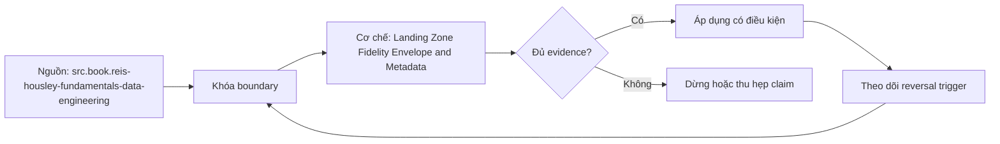

# Landing Zone Fidelity Envelope and Metadata

> [!abstract] Câu hỏi trung tâm
> Vùng raw cần giữ payload và metadata nào để replay, audit, privacy và reconciliation?

## 1. Fidelity envelope

Landing preserves source payload or lossless canonical representation plus metadata needed to interpret it. It is immutable/versioned evidence, not a cleaned serving table. Six minimum fields: source/entity identity, extraction boundary/cursor, ingestion/run/batch identity, event/extract/land times, schema/format/version, content checksum/object lineage. Add producer, file/page/chunk and privacy classification as required.

## 2. Why each field exists

Source/entity answers ownership and connector route. Boundary/cursor supports completeness/replay. Run/batch ID ties retries and logs. Multiple timestamps diagnose lateness without conflating clocks. Schema/version makes bytes interpretable. Checksum/lineage proves identity and integrity. If one is absent, document exact operational question that becomes unanswerable and containment.

## 3. Payload fidelity

Keep original bytes for files/API responses where rights/security allow, or record deterministic transformation and original hash. Do not silently coerce null/empty, timestamps, decimals, encodings or unknown fields. Raw can add envelope columns but must avoid collision with source names. Quarantine retains failed payload securely with reason and retry lineage.

## 4. Privacy and security

Classify sensitive fields/payloads before landing. Apply encryption in transit/at rest, least privilege, key rotation, audit, retention and deletion propagation. Raw access is narrower, not wider. Tokenization/masking may be required before persistence; then raw means earliest policy-compliant representation and transformation evidence. Secrets never land in payload/logs.

## 5. Retention and deletion

Retention separates active replay window, legal/audit requirements and source deletion obligations. Object lifecycle alone may delete evidence before downstream recovery. Erasure propagates across raw, manifests, backups and derived layers according to policy, with tombstone/audit where permitted. Immutable storage does not exempt privacy obligations; legal owner decides conflicts.

## 6. Three-source design

Design envelopes for API pages, database chunks/CDC and file batches. For each field map producer, format, validation, nullable conditions and operator query. Demonstrate replay from envelope without hidden scheduler state. Negative fixtures: duplicate batch, schema unknown, checksum mismatch, sensitive field, missing boundary. List content excluded: credentials, uncontrolled debug dumps and unbounded secrets/PII copies.

## 7. Ma trận kiểm chứng từng mệnh đề

Mỗi claim phải gắn source/entity boundary, exact fixture, checkpoint/input state, counterexample và independent reconciliation oracle. Connector chạy thành công hoặc API trả 2xx chưa chứng minh completeness.

### 7.1. Landing-envelope probe 1: metadata field, operational question, validation, privacy control và replay evidence phải rõ

**Mệnh đề cần kiểm.** Landing-envelope probe 1: metadata field, operational question, validation, privacy control và replay evidence phải rõ.

**Thiết kế phép thử cho `wiki.ingestion.landing-zone-fidelity-envelope-metadata`.** Khóa source/API version, entity, grain/key, time boundary, schema, pagination/cursor configuration và failure schedule. Tạo positive, boundary và negative fixtures; thay đổi đúng một assumption. Lưu request/query, response/raw extract hash, checkpoint trước/sau, landing objects, target state và source-at-boundary oracle.

**Điều kiện chấp nhận cho `wiki.ingestion.landing-zone-fidelity-envelope-metadata`.** Count, key set, typed field hash và delete state khớp contract; duplicates được giải thích và dedup có identity rõ. Observation, inference và unknown được báo riêng. Lab chưa chạy chỉ là protocol.

### 7.2. Landing-envelope probe 2: metadata field, operational question, validation, privacy control và replay evidence phải rõ

**Mệnh đề cần kiểm.** Landing-envelope probe 2: metadata field, operational question, validation, privacy control và replay evidence phải rõ.

**Thiết kế phép thử cho `wiki.ingestion.landing-zone-fidelity-envelope-metadata`.** Khóa source/API version, entity, grain/key, time boundary, schema, pagination/cursor configuration và failure schedule. Tạo positive, boundary và negative fixtures; thay đổi đúng một assumption. Lưu request/query, response/raw extract hash, checkpoint trước/sau, landing objects, target state và source-at-boundary oracle.

**Điều kiện chấp nhận cho `wiki.ingestion.landing-zone-fidelity-envelope-metadata`.** Count, key set, typed field hash và delete state khớp contract; duplicates được giải thích và dedup có identity rõ. Observation, inference và unknown được báo riêng. Lab chưa chạy chỉ là protocol.

### 7.3. Landing-envelope probe 3: metadata field, operational question, validation, privacy control và replay evidence phải rõ

**Mệnh đề cần kiểm.** Landing-envelope probe 3: metadata field, operational question, validation, privacy control và replay evidence phải rõ.

**Thiết kế phép thử cho `wiki.ingestion.landing-zone-fidelity-envelope-metadata`.** Khóa source/API version, entity, grain/key, time boundary, schema, pagination/cursor configuration và failure schedule. Tạo positive, boundary và negative fixtures; thay đổi đúng một assumption. Lưu request/query, response/raw extract hash, checkpoint trước/sau, landing objects, target state và source-at-boundary oracle.

**Điều kiện chấp nhận cho `wiki.ingestion.landing-zone-fidelity-envelope-metadata`.** Count, key set, typed field hash và delete state khớp contract; duplicates được giải thích và dedup có identity rõ. Observation, inference và unknown được báo riêng. Lab chưa chạy chỉ là protocol.

### 7.4. Landing-envelope probe 4: metadata field, operational question, validation, privacy control và replay evidence phải rõ

**Mệnh đề cần kiểm.** Landing-envelope probe 4: metadata field, operational question, validation, privacy control và replay evidence phải rõ.

**Thiết kế phép thử cho `wiki.ingestion.landing-zone-fidelity-envelope-metadata`.** Khóa source/API version, entity, grain/key, time boundary, schema, pagination/cursor configuration và failure schedule. Tạo positive, boundary và negative fixtures; thay đổi đúng một assumption. Lưu request/query, response/raw extract hash, checkpoint trước/sau, landing objects, target state và source-at-boundary oracle.

**Điều kiện chấp nhận cho `wiki.ingestion.landing-zone-fidelity-envelope-metadata`.** Count, key set, typed field hash và delete state khớp contract; duplicates được giải thích và dedup có identity rõ. Observation, inference và unknown được báo riêng. Lab chưa chạy chỉ là protocol.

### 7.5. Landing-envelope probe 5: metadata field, operational question, validation, privacy control và replay evidence phải rõ

**Mệnh đề cần kiểm.** Landing-envelope probe 5: metadata field, operational question, validation, privacy control và replay evidence phải rõ.

**Thiết kế phép thử cho `wiki.ingestion.landing-zone-fidelity-envelope-metadata`.** Khóa source/API version, entity, grain/key, time boundary, schema, pagination/cursor configuration và failure schedule. Tạo positive, boundary và negative fixtures; thay đổi đúng một assumption. Lưu request/query, response/raw extract hash, checkpoint trước/sau, landing objects, target state và source-at-boundary oracle.

**Điều kiện chấp nhận cho `wiki.ingestion.landing-zone-fidelity-envelope-metadata`.** Count, key set, typed field hash và delete state khớp contract; duplicates được giải thích và dedup có identity rõ. Observation, inference và unknown được báo riêng. Lab chưa chạy chỉ là protocol.

### 7.6. Landing-envelope probe 6: metadata field, operational question, validation, privacy control và replay evidence phải rõ

**Mệnh đề cần kiểm.** Landing-envelope probe 6: metadata field, operational question, validation, privacy control và replay evidence phải rõ.

**Thiết kế phép thử cho `wiki.ingestion.landing-zone-fidelity-envelope-metadata`.** Khóa source/API version, entity, grain/key, time boundary, schema, pagination/cursor configuration và failure schedule. Tạo positive, boundary và negative fixtures; thay đổi đúng một assumption. Lưu request/query, response/raw extract hash, checkpoint trước/sau, landing objects, target state và source-at-boundary oracle.

**Điều kiện chấp nhận cho `wiki.ingestion.landing-zone-fidelity-envelope-metadata`.** Count, key set, typed field hash và delete state khớp contract; duplicates được giải thích và dedup có identity rõ. Observation, inference và unknown được báo riêng. Lab chưa chạy chỉ là protocol.

### 7.7. Landing-envelope probe 7: metadata field, operational question, validation, privacy control và replay evidence phải rõ

**Mệnh đề cần kiểm.** Landing-envelope probe 7: metadata field, operational question, validation, privacy control và replay evidence phải rõ.

**Thiết kế phép thử cho `wiki.ingestion.landing-zone-fidelity-envelope-metadata`.** Khóa source/API version, entity, grain/key, time boundary, schema, pagination/cursor configuration và failure schedule. Tạo positive, boundary và negative fixtures; thay đổi đúng một assumption. Lưu request/query, response/raw extract hash, checkpoint trước/sau, landing objects, target state và source-at-boundary oracle.

**Điều kiện chấp nhận cho `wiki.ingestion.landing-zone-fidelity-envelope-metadata`.** Count, key set, typed field hash và delete state khớp contract; duplicates được giải thích và dedup có identity rõ. Observation, inference và unknown được báo riêng. Lab chưa chạy chỉ là protocol.

### 7.8. Landing-envelope probe 8: metadata field, operational question, validation, privacy control và replay evidence phải rõ

**Mệnh đề cần kiểm.** Landing-envelope probe 8: metadata field, operational question, validation, privacy control và replay evidence phải rõ.

**Thiết kế phép thử cho `wiki.ingestion.landing-zone-fidelity-envelope-metadata`.** Khóa source/API version, entity, grain/key, time boundary, schema, pagination/cursor configuration và failure schedule. Tạo positive, boundary và negative fixtures; thay đổi đúng một assumption. Lưu request/query, response/raw extract hash, checkpoint trước/sau, landing objects, target state và source-at-boundary oracle.

**Điều kiện chấp nhận cho `wiki.ingestion.landing-zone-fidelity-envelope-metadata`.** Count, key set, typed field hash và delete state khớp contract; duplicates được giải thích và dedup có identity rõ. Observation, inference và unknown được báo riêng. Lab chưa chạy chỉ là protocol.

### 7.9. Landing-envelope probe 9: metadata field, operational question, validation, privacy control và replay evidence phải rõ

**Mệnh đề cần kiểm.** Landing-envelope probe 9: metadata field, operational question, validation, privacy control và replay evidence phải rõ.

**Thiết kế phép thử cho `wiki.ingestion.landing-zone-fidelity-envelope-metadata`.** Khóa source/API version, entity, grain/key, time boundary, schema, pagination/cursor configuration và failure schedule. Tạo positive, boundary và negative fixtures; thay đổi đúng một assumption. Lưu request/query, response/raw extract hash, checkpoint trước/sau, landing objects, target state và source-at-boundary oracle.

**Điều kiện chấp nhận cho `wiki.ingestion.landing-zone-fidelity-envelope-metadata`.** Count, key set, typed field hash và delete state khớp contract; duplicates được giải thích và dedup có identity rõ. Observation, inference và unknown được báo riêng. Lab chưa chạy chỉ là protocol.

### 7.10. Landing-envelope probe 10: metadata field, operational question, validation, privacy control và replay evidence phải rõ

**Mệnh đề cần kiểm.** Landing-envelope probe 10: metadata field, operational question, validation, privacy control và replay evidence phải rõ.

**Thiết kế phép thử cho `wiki.ingestion.landing-zone-fidelity-envelope-metadata`.** Khóa source/API version, entity, grain/key, time boundary, schema, pagination/cursor configuration và failure schedule. Tạo positive, boundary và negative fixtures; thay đổi đúng một assumption. Lưu request/query, response/raw extract hash, checkpoint trước/sau, landing objects, target state và source-at-boundary oracle.

**Điều kiện chấp nhận cho `wiki.ingestion.landing-zone-fidelity-envelope-metadata`.** Count, key set, typed field hash và delete state khớp contract; duplicates được giải thích và dedup có identity rõ. Observation, inference và unknown được báo riêng. Lab chưa chạy chỉ là protocol.

### 7.11. Landing-envelope probe 11: metadata field, operational question, validation, privacy control và replay evidence phải rõ

**Mệnh đề cần kiểm.** Landing-envelope probe 11: metadata field, operational question, validation, privacy control và replay evidence phải rõ.

**Thiết kế phép thử cho `wiki.ingestion.landing-zone-fidelity-envelope-metadata`.** Khóa source/API version, entity, grain/key, time boundary, schema, pagination/cursor configuration và failure schedule. Tạo positive, boundary và negative fixtures; thay đổi đúng một assumption. Lưu request/query, response/raw extract hash, checkpoint trước/sau, landing objects, target state và source-at-boundary oracle.

**Điều kiện chấp nhận cho `wiki.ingestion.landing-zone-fidelity-envelope-metadata`.** Count, key set, typed field hash và delete state khớp contract; duplicates được giải thích và dedup có identity rõ. Observation, inference và unknown được báo riêng. Lab chưa chạy chỉ là protocol.

### 7.12. Landing-envelope probe 12: metadata field, operational question, validation, privacy control và replay evidence phải rõ

**Mệnh đề cần kiểm.** Landing-envelope probe 12: metadata field, operational question, validation, privacy control và replay evidence phải rõ.

**Thiết kế phép thử cho `wiki.ingestion.landing-zone-fidelity-envelope-metadata`.** Khóa source/API version, entity, grain/key, time boundary, schema, pagination/cursor configuration và failure schedule. Tạo positive, boundary và negative fixtures; thay đổi đúng một assumption. Lưu request/query, response/raw extract hash, checkpoint trước/sau, landing objects, target state và source-at-boundary oracle.

**Điều kiện chấp nhận cho `wiki.ingestion.landing-zone-fidelity-envelope-metadata`.** Count, key set, typed field hash và delete state khớp contract; duplicates được giải thích và dedup có identity rõ. Observation, inference và unknown được báo riêng. Lab chưa chạy chỉ là protocol.

### 7.13. Landing-envelope probe 13: metadata field, operational question, validation, privacy control và replay evidence phải rõ

**Mệnh đề cần kiểm.** Landing-envelope probe 13: metadata field, operational question, validation, privacy control và replay evidence phải rõ.

**Thiết kế phép thử cho `wiki.ingestion.landing-zone-fidelity-envelope-metadata`.** Khóa source/API version, entity, grain/key, time boundary, schema, pagination/cursor configuration và failure schedule. Tạo positive, boundary và negative fixtures; thay đổi đúng một assumption. Lưu request/query, response/raw extract hash, checkpoint trước/sau, landing objects, target state và source-at-boundary oracle.

**Điều kiện chấp nhận cho `wiki.ingestion.landing-zone-fidelity-envelope-metadata`.** Count, key set, typed field hash và delete state khớp contract; duplicates được giải thích và dedup có identity rõ. Observation, inference và unknown được báo riêng. Lab chưa chạy chỉ là protocol.

### 7.14. Landing-envelope probe 14: metadata field, operational question, validation, privacy control và replay evidence phải rõ

**Mệnh đề cần kiểm.** Landing-envelope probe 14: metadata field, operational question, validation, privacy control và replay evidence phải rõ.

**Thiết kế phép thử cho `wiki.ingestion.landing-zone-fidelity-envelope-metadata`.** Khóa source/API version, entity, grain/key, time boundary, schema, pagination/cursor configuration và failure schedule. Tạo positive, boundary và negative fixtures; thay đổi đúng một assumption. Lưu request/query, response/raw extract hash, checkpoint trước/sau, landing objects, target state và source-at-boundary oracle.

**Điều kiện chấp nhận cho `wiki.ingestion.landing-zone-fidelity-envelope-metadata`.** Count, key set, typed field hash và delete state khớp contract; duplicates được giải thích và dedup có identity rõ. Observation, inference và unknown được báo riêng. Lab chưa chạy chỉ là protocol.

### 7.15. Landing-envelope probe 15: metadata field, operational question, validation, privacy control và replay evidence phải rõ

**Mệnh đề cần kiểm.** Landing-envelope probe 15: metadata field, operational question, validation, privacy control và replay evidence phải rõ.

**Thiết kế phép thử cho `wiki.ingestion.landing-zone-fidelity-envelope-metadata`.** Khóa source/API version, entity, grain/key, time boundary, schema, pagination/cursor configuration và failure schedule. Tạo positive, boundary và negative fixtures; thay đổi đúng một assumption. Lưu request/query, response/raw extract hash, checkpoint trước/sau, landing objects, target state và source-at-boundary oracle.

**Điều kiện chấp nhận cho `wiki.ingestion.landing-zone-fidelity-envelope-metadata`.** Count, key set, typed field hash và delete state khớp contract; duplicates được giải thích và dedup có identity rõ. Observation, inference và unknown được báo riêng. Lab chưa chạy chỉ là protocol.

## 8. Quy trình phản biện

1. Chốt entity, grain, identity và immutable boundary.
2. Tách source fact, documentation claim và observed behavior.
3. Viết delete, retry, checkpoint và replay semantics trước code.
4. Dùng key/typed-hash reconciliation, không chỉ row count.
5. Pin version, retention, timezone, ordering và rate limits.
6. Ghi assumption bị falsify và extraction pattern thay thế.

## 9. Câu hỏi tự kiểm tra

1. Source thay đổi row/entity theo những operation nào?
2. Boundary nào định nghĩa complete?
3. Delete có xuất hiện trong interface không?
4. Cursor/order có total và immutable không?
5. Crash ở checkpoint boundary gây replay hay gap?
6. Bằng chứng nào chưa được chạy?

## 10. Giới hạn và điều chưa cho phép kết luận

- Chưa chạy mutation/pagination/watermark lab trên source thật.
- Product behavior phải pin version, retention và configuration.
- Decision matrices và failure protocols là synthesis của giáo trình.
- Note giữ trạng thái `review` tới khi chủ dự án duyệt.

## Reference
1. [[SRC-REIS-HOUSLEY-FUNDAMENTALS-DATA-ENGINEERING]]
2. [[SRC-AWS-S3-OBJECT-CHECKSUMS]]
3. [[SRC-NIST-SP-800-188-DEIDENTIFICATION]]
4. [[SRC-KLEPPMANN-DDIA-1E]]

## Source coverage

| Source slice | Nội dung sử dụng | Trạng thái |
|---|---|---|
| [[SRC-REIS-HOUSLEY-FUNDAMENTALS-DATA-ENGINEERING]] | Source/change/API contract hoặc engineering context | Đã đọc locator; không suy ngoài phạm vi |
| [[SRC-AWS-S3-OBJECT-CHECKSUMS]] | Source/change/API contract hoặc engineering context | Đã đọc locator; không suy ngoài phạm vi |
| [[SRC-NIST-SP-800-188-DEIDENTIFICATION]] | Source/change/API contract hoặc engineering context | Đã đọc locator; không suy ngoài phạm vi |
| [[SRC-KLEPPMANN-DDIA-1E]] | Source/change/API contract hoặc engineering context | Đã đọc locator; không suy ngoài phạm vi |

## Key takeaways
- Extraction pattern chỉ đúng khi source assumptions đúng.
- Completeness cần immutable boundary và reconciliation oracle.
- Retry/checkpoint ưu tiên replay có kiểm soát hơn silent gap.
- Connector không chuyển giao ownership về tính đúng.

<!-- ATOMIC-EXECUTION-CAPSULE:START -->

## Execution capsule: kiểm chứng `wiki.ingestion.landing-zone-fidelity-envelope-metadata`

> [!important] Phân loại mệnh đề
> Với `wiki.ingestion.landing-zone-fidelity-envelope-metadata`, sơ đồ, ví dụ và artifact về **Landing Zone Fidelity Envelope and Metadata** là **synthesis để kiểm chứng**; chúng không phải trích dẫn hay case nguyên văn của nguồn.

### Sơ đồ cơ chế và điểm kiểm soát



Đọc sơ đồ `wiki.ingestion.landing-zone-fidelity-envelope-metadata` từ trái sang phải: source chỉ cung cấp claim ban đầu cho **Landing Zone Fidelity Envelope and Metadata**; quyết định chỉ được đi tiếp sau khi boundary, evidence và điều kiện đảo quyết định đã hiện hữu.

### Ví dụ làm việc có thể bác bỏ

**Input.** Một đội cần trả lời: Vùng raw cần giữ payload và metadata nào để replay, audit, privacy và reconciliation? cho một phạm vi nhỏ, có owner và deadline rõ.

**Decision.** Đội áp dụng **Landing Zone Fidelity Envelope and Metadata** trên control và variant chỉ khác một assumption; expected result và hard constraints được khóa trước khi chạy.

**Outcome.** Với `wiki.ingestion.landing-zone-fidelity-envelope-metadata`, nếu observation vi phạm hard constraint hoặc oracle độc lập không xác nhận **Landing Zone Fidelity Envelope and Metadata**, đội thu hẹp claim hay đảo quyết định. Nếu đạt, kết luận vẫn kèm scope, version và review date; một lần thành công không được nâng thành quy luật phổ quát.

### Artifact thực thi tối thiểu

```sql
-- Verification harness for: Landing Zone Fidelity Envelope and Metadata
WITH evidence AS (
    SELECT 'wiki.ingestion.landing-zone-fidelity-envelope-metadata' AS concept_id,
           'boundary_declared' AS check_name, 1 AS passed
    UNION ALL
    SELECT 'wiki.ingestion.landing-zone-fidelity-envelope-metadata', 'independent_oracle', 1
    UNION ALL
    SELECT 'wiki.ingestion.landing-zone-fidelity-envelope-metadata', 'reversal_trigger_recorded', 1
)
SELECT concept_id,
       MIN(passed) AS all_hard_checks_pass,
       COUNT(*) AS evidence_items
FROM evidence
GROUP BY concept_id
HAVING MIN(passed) = 1;
```

Artifact của `wiki.ingestion.landing-zone-fidelity-envelope-metadata` buộc người dùng ghi boundary, oracle và reversal trigger cho **Landing Zone Fidelity Envelope and Metadata**. Các giá trị minh họa phải được thay bằng evidence thật trước khi dùng cho quyết định.

### Tự kiểm tra trước khi tái sử dụng

1. Bạn có thể trả lời `Vùng raw cần giữ payload và metadata nào để replay, audit, privacy và reconciliation?` bằng một câu mà không kéo thêm concept thứ hai không?
2. Source locator nào đỡ cho claim, và phần nào chỉ là synthesis trong note?
3. Observation nào khiến bạn dừng, thu hẹp hoặc đảo quyết định?
4. Artifact nào cho phép một reviewer độc lập tái hiện kết quả?

<!-- ATOMIC-EXECUTION-CAPSULE:END -->
