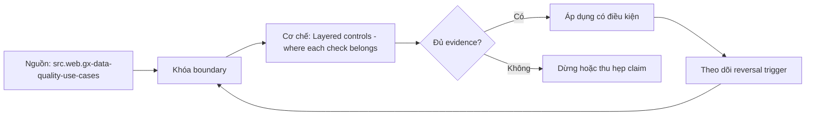

# Layered controls - where each check belongs

> [!abstract] Câu hỏi trung tâm
> Đặt check ở source, ingestion, transform, publish hay consumer boundary theo failure economics thế nào?

## 1. Source contract

Chặn schema/identity sai sớm khi source owner có thể sửa, nhưng không giả định source validation bảo vệ downstream semantics. Đừng bắt đầu bằng tên công cụ. Hãy bắt đầu bằng đối tượng được bảo vệ, boundary quan sát được và hậu quả nếu kết luận sai. Trong bài `Layered controls - where each check belongs`, câu hỏi thực dụng là: Đặt check ở source, ingestion, transform, publish hay consumer boundary theo failure economics thế nào? Ta ghi rõ grain, population, time window, owner và hành động sau failure; nếu một trường chưa biết thì đánh dấu unknown thay vì lấp bằng mặc định. Bằng chứng tối thiểu gồm fixture có version, cấu hình hoặc rule đã resolve, raw observation, expected result và limitation. Phần này là curriculum synthesis dựa trên các nguồn đã định danh, không phải lời hứa rằng mọi adapter hay deployment đều có cùng hành vi.

## 2. Ingestion boundary

Kiểm parse, envelope, completeness manifest, duplicates và quarantine trước khi raw evidence bị biến đổi. Điểm khó không nằm ở cú pháp mà ở identity và scope. Hai phép đo cùng tên vẫn có thể nói về hai population hoặc hai thời điểm khác nhau. Trong bài `Layered controls - where each check belongs`, câu hỏi thực dụng là: Đặt check ở source, ingestion, transform, publish hay consumer boundary theo failure economics thế nào? Ta ghi rõ grain, population, time window, owner và hành động sau failure; nếu một trường chưa biết thì đánh dấu unknown thay vì lấp bằng mặc định. Bằng chứng tối thiểu gồm fixture có version, cấu hình hoặc rule đã resolve, raw observation, expected result và limitation. Phần này là curriculum synthesis dựa trên các nguồn đã định danh, không phải lời hứa rằng mọi adapter hay deployment đều có cùng hành vi.

## 3. Transformation layer

Kiểm business invariants gần logic tạo chúng, dùng intermediate assertions để thu hẹp blast radius. Một dashboard xanh chỉ là tín hiệu. Muốn biến nó thành bằng chứng phải giữ input, phiên bản, rule, trạng thái trước–sau và cách tính độc lập. Trong bài `Layered controls - where each check belongs`, câu hỏi thực dụng là: Đặt check ở source, ingestion, transform, publish hay consumer boundary theo failure economics thế nào? Ta ghi rõ grain, population, time window, owner và hành động sau failure; nếu một trường chưa biết thì đánh dấu unknown thay vì lấp bằng mặc định. Bằng chứng tối thiểu gồm fixture có version, cấu hình hoặc rule đã resolve, raw observation, expected result và limitation. Phần này là curriculum synthesis dựa trên các nguồn đã định danh, không phải lời hứa rằng mọi adapter hay deployment đều có cùng hành vi.

## 4. Publication gate

Candidate chỉ được promote khi critical controls, reconciliation và freshness đạt; warning không âm thầm thành pass. Thiết kế tốt phải chịu được counterexample. Hãy chủ động tạo case sát boundary, case thiếu dữ liệu và case replay thay vì chỉ chạy happy path. Trong bài `Layered controls - where each check belongs`, câu hỏi thực dụng là: Đặt check ở source, ingestion, transform, publish hay consumer boundary theo failure economics thế nào? Ta ghi rõ grain, population, time window, owner và hành động sau failure; nếu một trường chưa biết thì đánh dấu unknown thay vì lấp bằng mặc định. Bằng chứng tối thiểu gồm fixture có version, cấu hình hoặc rule đã resolve, raw observation, expected result và limitation. Phần này là curriculum synthesis dựa trên các nguồn đã định danh, không phải lời hứa rằng mọi adapter hay deployment đều có cùng hành vi.

## 5. Consumer monitor

Kiểm use-case-visible totals, latency và availability vì upstream green vẫn có thể không phục vụ được decision. Chi phí vận hành thuộc contract. Một rule đúng nhưng quá đắt, quá ồn hoặc không có owner sẽ nhanh chóng bị tắt và mất tác dụng. Trong bài `Layered controls - where each check belongs`, câu hỏi thực dụng là: Đặt check ở source, ingestion, transform, publish hay consumer boundary theo failure economics thế nào? Ta ghi rõ grain, population, time window, owner và hành động sau failure; nếu một trường chưa biết thì đánh dấu unknown thay vì lấp bằng mặc định. Bằng chứng tối thiểu gồm fixture có version, cấu hình hoặc rule đã resolve, raw observation, expected result và limitation. Phần này là curriculum synthesis dựa trên các nguồn đã định danh, không phải lời hứa rằng mọi adapter hay deployment đều có cùng hành vi.

## 6. Defense without duplication

Lặp check khi failure cost biện minh; mỗi lớp có purpose và owner khác nhau, tránh copy cùng SQL vô chủ. Kết luận cần có điều kiện đảo chiều. Khi volume, latency, nguồn thẩm quyền hoặc topology đổi, quyết định cũ phải được xem xét lại bằng cùng một oracle. Trong bài `Layered controls - where each check belongs`, câu hỏi thực dụng là: Đặt check ở source, ingestion, transform, publish hay consumer boundary theo failure economics thế nào? Ta ghi rõ grain, population, time window, owner và hành động sau failure; nếu một trường chưa biết thì đánh dấu unknown thay vì lấp bằng mặc định. Bằng chứng tối thiểu gồm fixture có version, cấu hình hoặc rule đã resolve, raw observation, expected result và limitation. Phần này là curriculum synthesis dựa trên các nguồn đã định danh, không phải lời hứa rằng mọi adapter hay deployment đều có cùng hành vi.

## 7. Ma trận kiểm chứng từng mệnh đề

Với `wiki.data-quality.layered-controls`, command thành công không tự chứng minh dữ liệu đúng. Protocol riêng của bài là: Tạo positive/negative fixture ở đúng grain, chạy rule đã version hóa và so failing keys/metrics với một oracle độc lập. Mỗi probe dưới đây phải nối input boundary với failure signal và oracle có thể phản bác kết luận.

### 7.1. Layered controls - where each check belongs: kiểm `Source contract` bằng case 1, cụ thể chặn schema/identity sai sớm khi source owner có thể sửa, nhưng không giả định source validation bảo vệ downstream semantics

**Mệnh đề cần kiểm.** Layered controls - where each check belongs: kiểm `Source contract` bằng case 1, cụ thể chặn schema/identity sai sớm khi source owner có thể sửa, nhưng không giả định source validation bảo vệ downstream semantics.

**Thiết kế phép thử cho `wiki.data-quality.layered-controls`.** Trong ngữ cảnh `wiki.data-quality.layered-controls`, tạo positive control và negative control chỉ khác đúng một điều kiện. Khóa input snapshot, phiên bản và owner của rule; chạy đúng population được bài `Layered controls - where each check belongs` công bố.

**Bằng chứng cần giữ.** Đối với probe 1 của `Layered controls - where each check belongs`, giữ fixture, raw failing rows và lệnh tái hiện. Nếu chưa chạy lab, ghi expected evidence và giữ trạng thái review; không biến protocol thành observation.

### 7.2. Layered controls - where each check belongs: kiểm `Ingestion boundary` bằng case 2, cụ thể kiểm parse, envelope, completeness manifest, duplicates và quarantine trước khi raw evidence bị biến đổi

**Mệnh đề cần kiểm.** Layered controls - where each check belongs: kiểm `Ingestion boundary` bằng case 2, cụ thể kiểm parse, envelope, completeness manifest, duplicates và quarantine trước khi raw evidence bị biến đổi.

**Thiết kế phép thử cho `wiki.data-quality.layered-controls`.** Trong ngữ cảnh `wiki.data-quality.layered-controls`, đổi grain nhưng giữ tổng số dòng để lộ phép đo sai cấp. Khóa input snapshot, phiên bản và owner của rule; chạy đúng population được bài `Layered controls - where each check belongs` công bố.

**Bằng chứng cần giữ.** Đối với probe 2 của `Layered controls - where each check belongs`, báo numerator, denominator và key set ở cả hai grain. Nếu chưa chạy lab, ghi expected evidence và giữ trạng thái review; không biến protocol thành observation.

### 7.3. Layered controls - where each check belongs: kiểm `Transformation layer` bằng case 3, cụ thể kiểm business invariants gần logic tạo chúng, dùng intermediate assertions để thu hẹp blast radius

**Mệnh đề cần kiểm.** Layered controls - where each check belongs: kiểm `Transformation layer` bằng case 3, cụ thể kiểm business invariants gần logic tạo chúng, dùng intermediate assertions để thu hẹp blast radius.

**Thiết kế phép thử cho `wiki.data-quality.layered-controls`.** Trong ngữ cảnh `wiki.data-quality.layered-controls`, đưa một giá trị tới đúng boundary và một giá trị vượt boundary. Khóa input snapshot, phiên bản và owner của rule; chạy đúng population được bài `Layered controls - where each check belongs` công bố.

**Bằng chứng cần giữ.** Đối với probe 3 của `Layered controls - where each check belongs`, lưu hai observed values cùng rule đã resolve. Nếu chưa chạy lab, ghi expected evidence và giữ trạng thái review; không biến protocol thành observation.

### 7.4. Layered controls - where each check belongs: kiểm `Publication gate` bằng case 4, cụ thể candidate chỉ được promote khi critical controls, reconciliation và freshness đạt; warning không âm thầm thành pass

**Mệnh đề cần kiểm.** Layered controls - where each check belongs: kiểm `Publication gate` bằng case 4, cụ thể candidate chỉ được promote khi critical controls, reconciliation và freshness đạt; warning không âm thầm thành pass.

**Thiết kế phép thử cho `wiki.data-quality.layered-controls`.** Trong ngữ cảnh `wiki.data-quality.layered-controls`, kill tiến trình ngay trước rồi ngay sau durable side effect. Khóa input snapshot, phiên bản và owner của rule; chạy đúng population được bài `Layered controls - where each check belongs` công bố.

**Bằng chứng cần giữ.** Đối với probe 4 của `Layered controls - where each check belongs`, lưu checkpoint, external ledger và trạng thái sau restart. Nếu chưa chạy lab, ghi expected evidence và giữ trạng thái review; không biến protocol thành observation.

### 7.5. Layered controls - where each check belongs: kiểm `Consumer monitor` bằng case 5, cụ thể kiểm use-case-visible totals, latency và availability vì upstream green vẫn có thể không phục vụ được decision

**Mệnh đề cần kiểm.** Layered controls - where each check belongs: kiểm `Consumer monitor` bằng case 5, cụ thể kiểm use-case-visible totals, latency và availability vì upstream green vẫn có thể không phục vụ được decision.

**Thiết kế phép thử cho `wiki.data-quality.layered-controls`.** Trong ngữ cảnh `wiki.data-quality.layered-controls`, đảo thứ tự input và concurrency nhưng giữ logical population. Khóa input snapshot, phiên bản và owner của rule; chạy đúng population được bài `Layered controls - where each check belongs` công bố.

**Bằng chứng cần giữ.** Đối với probe 5 của `Layered controls - where each check belongs`, so canonical hash và business totals giữa các thứ tự. Nếu chưa chạy lab, ghi expected evidence và giữ trạng thái review; không biến protocol thành observation.

### 7.6. Layered controls - where each check belongs: kiểm `Defense without duplication` bằng case 6, cụ thể lặp check khi failure cost biện minh; mỗi lớp có purpose và owner khác nhau, tránh copy cùng sql vô chủ

**Mệnh đề cần kiểm.** Layered controls - where each check belongs: kiểm `Defense without duplication` bằng case 6, cụ thể lặp check khi failure cost biện minh; mỗi lớp có purpose và owner khác nhau, tránh copy cùng sql vô chủ.

**Thiết kế phép thử cho `wiki.data-quality.layered-controls`.** Trong ngữ cảnh `wiki.data-quality.layered-controls`, replay cùng identity với payload giống rồi payload xung đột. Khóa input snapshot, phiên bản và owner của rule; chạy đúng population được bài `Layered controls - where each check belongs` công bố.

**Bằng chứng cần giữ.** Đối với probe 6 của `Layered controls - where each check belongs`, tách duplicate replay khỏi identity collision bằng reason code. Nếu chưa chạy lab, ghi expected evidence và giữ trạng thái review; không biến protocol thành observation.

### 7.7. Layered controls - where each check belongs: kiểm `Source contract` bằng case 7, cụ thể chặn schema/identity sai sớm khi source owner có thể sửa, nhưng không giả định source validation bảo vệ downstream semantics

**Mệnh đề cần kiểm.** Layered controls - where each check belongs: kiểm `Source contract` bằng case 7, cụ thể chặn schema/identity sai sớm khi source owner có thể sửa, nhưng không giả định source validation bảo vệ downstream semantics.

**Thiết kế phép thử cho `wiki.data-quality.layered-controls`.** Trong ngữ cảnh `wiki.data-quality.layered-controls`, thêm record tới trễ trong horizon và ngoài horizon. Khóa input snapshot, phiên bản và owner của rule; chạy đúng population được bài `Layered controls - where each check belongs` công bố.

**Bằng chứng cần giữ.** Đối với probe 7 của `Layered controls - where each check belongs`, báo accepted-late, rejected-late và oldest outstanding timestamp. Nếu chưa chạy lab, ghi expected evidence và giữ trạng thái review; không biến protocol thành observation.

### 7.8. Layered controls - where each check belongs: kiểm `Ingestion boundary` bằng case 8, cụ thể kiểm parse, envelope, completeness manifest, duplicates và quarantine trước khi raw evidence bị biến đổi

**Mệnh đề cần kiểm.** Layered controls - where each check belongs: kiểm `Ingestion boundary` bằng case 8, cụ thể kiểm parse, envelope, completeness manifest, duplicates và quarantine trước khi raw evidence bị biến đổi.

**Thiết kế phép thử cho `wiki.data-quality.layered-controls`.** Trong ngữ cảnh `wiki.data-quality.layered-controls`, đổi schema theo một cách tương thích rồi một cách phá vỡ semantics. Khóa input snapshot, phiên bản và owner của rule; chạy đúng population được bài `Layered controls - where each check belongs` công bố.

**Bằng chứng cần giữ.** Đối với probe 8 của `Layered controls - where each check belongs`, giữ schema diff, classification và consumer-visible result. Nếu chưa chạy lab, ghi expected evidence và giữ trạng thái review; không biến protocol thành observation.

### 7.9. Layered controls - where each check belongs: kiểm `Transformation layer` bằng case 9, cụ thể kiểm business invariants gần logic tạo chúng, dùng intermediate assertions để thu hẹp blast radius

**Mệnh đề cần kiểm.** Layered controls - where each check belongs: kiểm `Transformation layer` bằng case 9, cụ thể kiểm business invariants gần logic tạo chúng, dùng intermediate assertions để thu hẹp blast radius.

**Thiết kế phép thử cho `wiki.data-quality.layered-controls`.** Trong ngữ cảnh `wiki.data-quality.layered-controls`, tạo missing và duplicate bù nhau để count tổng không đổi. Khóa input snapshot, phiên bản và owner của rule; chạy đúng population được bài `Layered controls - where each check belongs` công bố.

**Bằng chứng cần giữ.** Đối với probe 9 của `Layered controls - where each check belongs`, so key multiset và typed hashes thay vì chỉ row count. Nếu chưa chạy lab, ghi expected evidence và giữ trạng thái review; không biến protocol thành observation.

### 7.10. Layered controls - where each check belongs: kiểm `Publication gate` bằng case 10, cụ thể candidate chỉ được promote khi critical controls, reconciliation và freshness đạt; warning không âm thầm thành pass

**Mệnh đề cần kiểm.** Layered controls - where each check belongs: kiểm `Publication gate` bằng case 10, cụ thể candidate chỉ được promote khi critical controls, reconciliation và freshness đạt; warning không âm thầm thành pass.

**Thiết kế phép thử cho `wiki.data-quality.layered-controls`.** Trong ngữ cảnh `wiki.data-quality.layered-controls`, cho reviewer tái hiện chỉ từ evidence package. Khóa input snapshot, phiên bản và owner của rule; chạy đúng population được bài `Layered controls - where each check belongs` công bố.

**Bằng chứng cần giữ.** Đối với probe 10 của `Layered controls - where each check belongs`, package phải đủ để người khác dựng lại decision và limitation. Nếu chưa chạy lab, ghi expected evidence và giữ trạng thái review; không biến protocol thành observation.

### 7.11. Layered controls - where each check belongs: kiểm `Consumer monitor` bằng case 11, cụ thể kiểm use-case-visible totals, latency và availability vì upstream green vẫn có thể không phục vụ được decision

**Mệnh đề cần kiểm.** Layered controls - where each check belongs: kiểm `Consumer monitor` bằng case 11, cụ thể kiểm use-case-visible totals, latency và availability vì upstream green vẫn có thể không phục vụ được decision.

**Thiết kế phép thử cho `wiki.data-quality.layered-controls`.** Trong ngữ cảnh `wiki.data-quality.layered-controls`, so với oracle độc lập không dùng chung query hoặc parser. Khóa input snapshot, phiên bản và owner của rule; chạy đúng population được bài `Layered controls - where each check belongs` công bố.

**Bằng chứng cần giữ.** Đối với probe 11 của `Layered controls - where each check belongs`, independent result phải khớp ở grain đã công bố. Nếu chưa chạy lab, ghi expected evidence và giữ trạng thái review; không biến protocol thành observation.

### 7.12. Layered controls - where each check belongs: kiểm `Defense without duplication` bằng case 12, cụ thể lặp check khi failure cost biện minh; mỗi lớp có purpose và owner khác nhau, tránh copy cùng sql vô chủ

**Mệnh đề cần kiểm.** Layered controls - where each check belongs: kiểm `Defense without duplication` bằng case 12, cụ thể lặp check khi failure cost biện minh; mỗi lớp có purpose và owner khác nhau, tránh copy cùng sql vô chủ.

**Thiết kế phép thử cho `wiki.data-quality.layered-controls`.** Trong ngữ cảnh `wiki.data-quality.layered-controls`, chạy scope hẹp và population đầy đủ rồi công bố phần bị loại. Khóa input snapshot, phiên bản và owner của rule; chạy đúng population được bài `Layered controls - where each check belongs` công bố.

**Bằng chứng cần giữ.** Đối với probe 12 của `Layered controls - where each check belongs`, coverage phải nêu rõ excluded nodes, partitions hoặc incidents. Nếu chưa chạy lab, ghi expected evidence và giữ trạng thái review; không biến protocol thành observation.

### 7.13. Layered controls - where each check belongs: kiểm `Source contract` bằng case 13, cụ thể chặn schema/identity sai sớm khi source owner có thể sửa, nhưng không giả định source validation bảo vệ downstream semantics

**Mệnh đề cần kiểm.** Layered controls - where each check belongs: kiểm `Source contract` bằng case 13, cụ thể chặn schema/identity sai sớm khi source owner có thể sửa, nhưng không giả định source validation bảo vệ downstream semantics.

**Thiết kế phép thử cho `wiki.data-quality.layered-controls`.** Trong ngữ cảnh `wiki.data-quality.layered-controls`, thử timezone, precision hoặc partition ở hai phía của ranh giới. Khóa input snapshot, phiên bản và owner của rule; chạy đúng population được bài `Layered controls - where each check belongs` công bố.

**Bằng chứng cần giữ.** Đối với probe 13 của `Layered controls - where each check belongs`, UTC/local interval và rounding policy phải hiện trong output. Nếu chưa chạy lab, ghi expected evidence và giữ trạng thái review; không biến protocol thành observation.

### 7.14. Layered controls - where each check belongs: kiểm `Ingestion boundary` bằng case 14, cụ thể kiểm parse, envelope, completeness manifest, duplicates và quarantine trước khi raw evidence bị biến đổi

**Mệnh đề cần kiểm.** Layered controls - where each check belongs: kiểm `Ingestion boundary` bằng case 14, cụ thể kiểm parse, envelope, completeness manifest, duplicates và quarantine trước khi raw evidence bị biến đổi.

**Thiết kế phép thử cho `wiki.data-quality.layered-controls`.** Trong ngữ cảnh `wiki.data-quality.layered-controls`, đổi constraint đủ lớn để quyết định phải đảo. Khóa input snapshot, phiên bản và owner của rule; chạy đúng population được bài `Layered controls - where each check belongs` công bố.

**Bằng chứng cần giữ.** Đối với probe 14 của `Layered controls - where each check belongs`, ADR phải lưu changed constraint và reversal threshold. Nếu chưa chạy lab, ghi expected evidence và giữ trạng thái review; không biến protocol thành observation.

### 7.15. Layered controls - where each check belongs: kiểm `Transformation layer` bằng case 15, cụ thể kiểm business invariants gần logic tạo chúng, dùng intermediate assertions để thu hẹp blast radius

**Mệnh đề cần kiểm.** Layered controls - where each check belongs: kiểm `Transformation layer` bằng case 15, cụ thể kiểm business invariants gần logic tạo chúng, dùng intermediate assertions để thu hẹp blast radius.

**Thiết kế phép thử cho `wiki.data-quality.layered-controls`.** Trong ngữ cảnh `wiki.data-quality.layered-controls`, chạy lại từ môi trường sạch với versions và seed đã khóa. Khóa input snapshot, phiên bản và owner của rule; chạy đúng population được bài `Layered controls - where each check belongs` công bố.

**Bằng chứng cần giữ.** Đối với probe 15 của `Layered controls - where each check belongs`, canonical result phải ổn định hoặc mọi nondeterminism phải được giải thích. Nếu chưa chạy lab, ghi expected evidence và giữ trạng thái review; không biến protocol thành observation.

## 8. Quy trình phản biện

1. Viết consumer-visible invariant cho `Layered controls - where each check belongs` trước khi chọn query hoặc tool.
2. Khóa grain, identity, population, time window và authoritative source.
3. Phân biệt declared configuration, executed state và published state.
4. Chạy negative control, replay hoặc changed-assumption case phù hợp.
5. Đối soát bằng oracle độc lập; công bố coverage và phần không quan sát được.
6. Gắn owner, hành động, reversal trigger và hạn review cho kết luận.

## 9. Câu hỏi tự kiểm tra

1. `Layered controls - where each check belongs: kiểm `Source contract` bằng case 1, cụ thể chặn schema/identity sai sớm khi source owner có thể sửa, nhưng không giả định source validation bảo vệ downstream semantics` thất bại đầu tiên ở boundary nào?
2. Artifact nào mạnh nhất để trả lời `Layered controls - where each check belongs: kiểm `Transformation layer` bằng case 3, cụ thể kiểm business invariants gần logic tạo chúng, dùng intermediate assertions để thu hẹp blast radius`?
3. Counterexample nhỏ nhất cho `Layered controls - where each check belongs: kiểm `Defense without duplication` bằng case 6, cụ thể lặp check khi failure cost biện minh; mỗi lớp có purpose và owner khác nhau, tránh copy cùng sql vô chủ` gồm những state nào?
4. `Layered controls - where each check belongs: kiểm `Transformation layer` bằng case 9, cụ thể kiểm business invariants gần logic tạo chúng, dùng intermediate assertions để thu hẹp blast radius` có thể xanh giả ra sao?
5. Constraint nào khiến quyết định ở `Layered controls - where each check belongs: kiểm `Ingestion boundary` bằng case 14, cụ thể kiểm parse, envelope, completeness manifest, duplicates và quarantine trước khi raw evidence bị biến đổi` phải đảo?
6. Phần nào của `Layered controls - where each check belongs: kiểm `Transformation layer` bằng case 15, cụ thể kiểm business invariants gần logic tạo chúng, dùng intermediate assertions để thu hẹp blast radius` mới là protocol, chưa phải observation?

## 10. Giới hạn và điều chưa cho phép kết luận

- Lab của `Layered controls - where each check belongs` chưa chạy trên hệ thống production; nội dung là giáo trình và expected evidence.
- Hành vi phụ thuộc phiên bản, connector, scheduler, warehouse và catalog configuration phải được kiểm lại.
- Các ma trận, ladder và threshold do giáo trình tổng hợp không được gán nguyên văn cho vendor.
- Note giữ trạng thái `review` cho tới khi owner duyệt semantics và learner artifact.

## Reference
1. [[SRC-GX-DATA-QUALITY-USE-CASES]]
2. [[SRC-GX-EXPECTATIONS]]

## Source coverage

| Source slice | Nội dung sử dụng | Trạng thái |
|---|---|---|
| [[SRC-GX-DATA-QUALITY-USE-CASES]] | Contract hoặc cơ chế liên quan trực tiếp tới `Layered controls - where each check belongs` | Đã đọc locator; cần pin version khi chạy lab |
| [[SRC-GX-EXPECTATIONS]] | Contract hoặc cơ chế liên quan trực tiếp tới `Layered controls - where each check belongs` | Đã đọc locator; cần pin version khi chạy lab |

## Key takeaways
- Check thuộc lớp có thể phát hiện và xử lý failure với chi phí thấp nhất.
- Với `wiki.data-quality.layered-controls`, quality của kết luận phụ thuộc identity, coverage và oracle chứ không phụ thuộc màu dashboard.
- Câu hỏi `Đặt check ở source, ingestion, transform, publish hay consumer boundary theo failure economics thế nào?` chỉ được trả lời trong scope và version đã ghi.
- Các source IDs `src.web.gx-data-quality-use-cases, src.web.gx-expectations` đặt ranh giới cho source fact; phần còn lại là synthesis có nhãn.
- Trước khi lab chạy, đây là note đã kiểm cấu trúc và provenance, chưa phải chứng nhận production.

<!-- ATOMIC-EXECUTION-CAPSULE:START -->

## Execution capsule — kiểm chứng `wiki.data-quality.layered-controls`

> [!important] Phân loại mệnh đề
> Với `wiki.data-quality.layered-controls`, sơ đồ, ví dụ và artifact về **Layered controls - where each check belongs** là **synthesis để kiểm chứng**; chúng không phải trích dẫn hay case nguyên văn của nguồn.

### Sơ đồ cơ chế và điểm kiểm soát



Đọc sơ đồ `wiki.data-quality.layered-controls` từ trái sang phải: source chỉ cung cấp claim ban đầu cho **Layered controls - where each check belongs**; quyết định chỉ được đi tiếp sau khi boundary, evidence và điều kiện đảo quyết định đã hiện hữu.

### Artifact thực thi tối thiểu

```sql
-- Verification harness for: Layered controls - where each check belongs
WITH evidence AS (
    SELECT 'wiki.data-quality.layered-controls' AS concept_id,
           'boundary_declared' AS check_name, 1 AS passed
    UNION ALL
    SELECT 'wiki.data-quality.layered-controls', 'independent_oracle', 1
    UNION ALL
    SELECT 'wiki.data-quality.layered-controls', 'reversal_trigger_recorded', 1
)
SELECT concept_id,
       MIN(passed) AS all_hard_checks_pass,
       COUNT(*) AS evidence_items
FROM evidence
GROUP BY concept_id
HAVING MIN(passed) = 1;
```

Artifact của `wiki.data-quality.layered-controls` buộc người dùng ghi boundary, oracle và reversal trigger cho **Layered controls - where each check belongs**. Các giá trị minh họa phải được thay bằng evidence thật trước khi dùng cho quyết định.

### Tự kiểm tra trước khi tái sử dụng

1. Bạn có thể trả lời `Đặt check ở source, ingestion, transform, publish hay consumer boundary theo failure economics thế nào?` bằng một câu mà không kéo thêm concept thứ hai không?
2. Source locator nào đỡ cho claim, và phần nào chỉ là synthesis trong note?
3. Observation nào khiến bạn dừng, thu hẹp hoặc đảo quyết định?
4. Artifact nào cho phép một reviewer độc lập tái hiện kết quả?

<!-- ATOMIC-EXECUTION-CAPSULE:END -->
