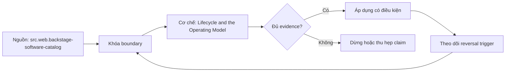

# Lifecycle and the Operating Model

> [!abstract] Câu hỏi trung tâm
> Sáu trạng thái data-product lifecycle được điều khiển bằng evidence gates, operating ownership, deprecation safeguards và support feedback như thế nào?

## 1. State machine có quyền và bằng chứng

Proposed, build, certified, operate, deprecated và removed cần entry criteria, allowed actions, exit evidence, accountable owner và audit event. State không phải label tự sửa trong catalog. Proposed chưa được dùng cho decision; build chỉ ở controlled context; certified đúng version/scope/evidence; operate có SLO/on-call; deprecated vẫn phục vụ trong window có migration; removed không còn resolve nhưng audit/retention artifact có thể còn. Transition failure giữ product ở state cũ; emergency exception có owner, expiry và compensating control.

## 2. Certification bundle và invalidation

Gate tổng hợp product boundary/owner/consumers, eight-attribute evidence của L188, contract/version, access/security negative tests, documentation hierarchy, findability/usability evidence, correctness/quality/freshness SLO, cost/adoption baselines và runbooks. Mỗi artifact có locator/hash, environment, evidence date và reviewer. Certification không vĩnh viễn: semantic/security/source change, evidence expiry, incident hoặc owner departure kích re-review/suspend. Catalog có thể hiển thị state nhưng không tự chứng nhận correctness; Backstage docs cũng phân biệt catalog hub với authoritative external systems.

## 3. Operating model

Mỗi product có business owner, technical owner, steward và on-call/escalation theo criticality; đội nhỏ có thể một người giữ nhiều role nhưng decision rights vẫn rõ. Severity matrix dựa impact, scope, security/privacy, decision deadline và workaround. Ghi response target khác resolution target, communication cadence, status channel, handoff và post-incident review. SLO budget liên kết operating capacity; không hứa operational response cho reverse-ETL workflow nếu analytics platform không có trực, replay và reconciliation.

## 4. Feedback phải được phân loại

Support event lưu persona, task, product/version, channel, category, severity, resolution, recurrence và linked artifact. Categories gồm product defect, data incident, docs/findability gap, access, skill, unsupported request và novel analysis. Roadmap nói câu hỏi lặp lại luôn là lỗi thiết kế thay vì training need; đây là tuyệt đối hóa. Repetition là signal điều tra: có thể do interface/docs, onboarding, role change, policy hoặc task ngoài scope. Chọn intervention bằng root-cause evidence; test lại recurrence và task outcome sau thay đổi.

## 5. Deprecation và removal an toàn

Trigger gồm replacement, no active decision, cost/risk, owner withdrawal hoặc compliance change. Inventory query logs, lineage, subscriptions, service accounts, offline exports và long-cadence users; zero recent queries không chứng minh zero consumer. Deprecation record có replacement/mapping, notices, window, telemetry, exceptions, retention, archive và rollback/restore. Block removal nếu critical consumer chưa migrate, legal/audit retention chưa giải quyết hoặc destination sync còn dependency. Removed catalog entry có thể giữ tombstone để ngăn asset cũ bị tái dùng.

## 6. Metrics điều khiển lifecycle

Certified/operated product theo correctness/SLO/security cùng adoption, support dependence, decision evidence, cost-to-serve và consumer satisfaction. Không dùng một composite score che automatic-fail gate. Trend và segment quan trọng hơn snapshot; metric definition/version đi cùng product. Low adoption mở discovery, không auto-retire; high adoption tăng change/incident rigor. Cost spike mở investigation; cutting quality không được coi là optimization. Feedback, incidents và failed tasks tạo backlog có owner và verification, không chỉ thêm training.

## 7. Lab ba products và fault cases

Dựng state-transition table và certification checklist. Product A đủ bundle đi certify→operate; B thiếu usability evidence bị chặn; C đang deprecated nhưng có hidden quarterly export nên removal fail. Tiêm owner departure, freshness breach, repeated question và security change để kiểm invalidation/escalation. Với ba repeated questions, phân loại root cause rồi đề xuất design/docs/training/policy change phù hợp; không ép tất cả thành design. Done khi transitions có evidence, blocked states giữ nguyên, consumer migration/retention đầy đủ và feedback change có retest plan.

## 8. Ma trận kiểm chứng từng mệnh đề

Mọi kết luận cần raw artifact, version và failure signal. Một dashboard xanh, sync completed, catalog label hoặc bảng cost có số không tự chứng minh correctness, security, value hay readiness.

### 8.1. lifecycle state có entry exit evidence và owner

**Mệnh đề cần kiểm.** lifecycle state có entry exit evidence và owner.

**Cách kiểm.** Đưa ba products qua transition table; inject missing usability evidence, owner departure, hidden long-cadence consumer, retention hold và repeated support questions. Mỗi state/gate/finding cần exact artifact, owner, decision và retest plan. Với mệnh đề này, ghi environment/product/policy version, input shape, expected observation, failure signal và boundary làm kết luận không còn đúng.

**Bằng chứng đạt cho `wiki.data-product.lifecycle-operating-model`.** Lưu contract/policy, fixture hoặc event extract, command/query, raw output, numerator–denominator hoặc cost reconciliation, reviewer và artifact hash. Nếu chưa chạy lab trên hệ được phép, chỉ ghi protocol; không biến expected result thành evidence.

### 8.2. catalog label không tự tạo certification

**Mệnh đề cần kiểm.** catalog label không tự tạo certification.

**Cách kiểm.** Đưa ba products qua transition table; inject missing usability evidence, owner departure, hidden long-cadence consumer, retention hold và repeated support questions. Mỗi state/gate/finding cần exact artifact, owner, decision và retest plan. Với mệnh đề này, ghi environment/product/policy version, input shape, expected observation, failure signal và boundary làm kết luận không còn đúng.

**Bằng chứng đạt cho `wiki.data-product.lifecycle-operating-model`.** Lưu contract/policy, fixture hoặc event extract, command/query, raw output, numerator–denominator hoặc cost reconciliation, reviewer và artifact hash. Nếu chưa chạy lab trên hệ được phép, chỉ ghi protocol; không biến expected result thành evidence.

### 8.3. certification gắn product version and scope

**Mệnh đề cần kiểm.** certification gắn product version and scope.

**Cách kiểm.** Đưa ba products qua transition table; inject missing usability evidence, owner departure, hidden long-cadence consumer, retention hold và repeated support questions. Mỗi state/gate/finding cần exact artifact, owner, decision và retest plan. Với mệnh đề này, ghi environment/product/policy version, input shape, expected observation, failure signal và boundary làm kết luận không còn đúng.

**Bằng chứng đạt cho `wiki.data-product.lifecycle-operating-model`.** Lưu contract/policy, fixture hoặc event extract, command/query, raw output, numerator–denominator hoặc cost reconciliation, reviewer và artifact hash. Nếu chưa chạy lab trên hệ được phép, chỉ ghi protocol; không biến expected result thành evidence.

### 8.4. evidence expiry kích recertification

**Mệnh đề cần kiểm.** evidence expiry kích recertification.

**Cách kiểm.** Đưa ba products qua transition table; inject missing usability evidence, owner departure, hidden long-cadence consumer, retention hold và repeated support questions. Mỗi state/gate/finding cần exact artifact, owner, decision và retest plan. Với mệnh đề này, ghi environment/product/policy version, input shape, expected observation, failure signal và boundary làm kết luận không còn đúng.

**Bằng chứng đạt cho `wiki.data-product.lifecycle-operating-model`.** Lưu contract/policy, fixture hoặc event extract, command/query, raw output, numerator–denominator hoặc cost reconciliation, reviewer và artifact hash. Nếu chưa chạy lab trên hệ được phép, chỉ ghi protocol; không biến expected result thành evidence.

### 8.5. response target khác resolution target

**Mệnh đề cần kiểm.** response target khác resolution target.

**Cách kiểm.** Đưa ba products qua transition table; inject missing usability evidence, owner departure, hidden long-cadence consumer, retention hold và repeated support questions. Mỗi state/gate/finding cần exact artifact, owner, decision và retest plan. Với mệnh đề này, ghi environment/product/policy version, input shape, expected observation, failure signal và boundary làm kết luận không còn đúng.

**Bằng chứng đạt cho `wiki.data-product.lifecycle-operating-model`.** Lưu contract/policy, fixture hoặc event extract, command/query, raw output, numerator–denominator hoặc cost reconciliation, reviewer và artifact hash. Nếu chưa chạy lab trên hệ được phép, chỉ ghi protocol; không biến expected result thành evidence.

### 8.6. on-call requirement theo product criticality

**Mệnh đề cần kiểm.** on-call requirement theo product criticality.

**Cách kiểm.** Đưa ba products qua transition table; inject missing usability evidence, owner departure, hidden long-cadence consumer, retention hold và repeated support questions. Mỗi state/gate/finding cần exact artifact, owner, decision và retest plan. Với mệnh đề này, ghi environment/product/policy version, input shape, expected observation, failure signal và boundary làm kết luận không còn đúng.

**Bằng chứng đạt cho `wiki.data-product.lifecycle-operating-model`.** Lưu contract/policy, fixture hoặc event extract, command/query, raw output, numerator–denominator hoặc cost reconciliation, reviewer và artifact hash. Nếu chưa chạy lab trên hệ được phép, chỉ ghi protocol; không biến expected result thành evidence.

### 8.7. support event cần task version and category

**Mệnh đề cần kiểm.** support event cần task version and category.

**Cách kiểm.** Đưa ba products qua transition table; inject missing usability evidence, owner departure, hidden long-cadence consumer, retention hold và repeated support questions. Mỗi state/gate/finding cần exact artifact, owner, decision và retest plan. Với mệnh đề này, ghi environment/product/policy version, input shape, expected observation, failure signal và boundary làm kết luận không còn đúng.

**Bằng chứng đạt cho `wiki.data-product.lifecycle-operating-model`.** Lưu contract/policy, fixture hoặc event extract, command/query, raw output, numerator–denominator hoặc cost reconciliation, reviewer và artifact hash. Nếu chưa chạy lab trên hệ được phép, chỉ ghi protocol; không biến expected result thành evidence.

### 8.8. repeated question là investigation signal không mặc nhiên design defect

**Mệnh đề cần kiểm.** repeated question là investigation signal không mặc nhiên design defect.

**Cách kiểm.** Đưa ba products qua transition table; inject missing usability evidence, owner departure, hidden long-cadence consumer, retention hold và repeated support questions. Mỗi state/gate/finding cần exact artifact, owner, decision và retest plan. Với mệnh đề này, ghi environment/product/policy version, input shape, expected observation, failure signal và boundary làm kết luận không còn đúng.

**Bằng chứng đạt cho `wiki.data-product.lifecycle-operating-model`.** Lưu contract/policy, fixture hoặc event extract, command/query, raw output, numerator–denominator hoặc cost reconciliation, reviewer và artifact hash. Nếu chưa chạy lab trên hệ được phép, chỉ ghi protocol; không biến expected result thành evidence.

### 8.9. training vẫn đúng khi root cause là skill or role change

**Mệnh đề cần kiểm.** training vẫn đúng khi root cause là skill or role change.

**Cách kiểm.** Đưa ba products qua transition table; inject missing usability evidence, owner departure, hidden long-cadence consumer, retention hold và repeated support questions. Mỗi state/gate/finding cần exact artifact, owner, decision và retest plan. Với mệnh đề này, ghi environment/product/policy version, input shape, expected observation, failure signal và boundary làm kết luận không còn đúng.

**Bằng chứng đạt cho `wiki.data-product.lifecycle-operating-model`.** Lưu contract/policy, fixture hoặc event extract, command/query, raw output, numerator–denominator hoặc cost reconciliation, reviewer và artifact hash. Nếu chưa chạy lab trên hệ được phép, chỉ ghi protocol; không biến expected result thành evidence.

### 8.10. zero recent queries không chứng minh zero consumer

**Mệnh đề cần kiểm.** zero recent queries không chứng minh zero consumer.

**Cách kiểm.** Đưa ba products qua transition table; inject missing usability evidence, owner departure, hidden long-cadence consumer, retention hold và repeated support questions. Mỗi state/gate/finding cần exact artifact, owner, decision và retest plan. Với mệnh đề này, ghi environment/product/policy version, input shape, expected observation, failure signal và boundary làm kết luận không còn đúng.

**Bằng chứng đạt cho `wiki.data-product.lifecycle-operating-model`.** Lưu contract/policy, fixture hoặc event extract, command/query, raw output, numerator–denominator hoặc cost reconciliation, reviewer và artifact hash. Nếu chưa chạy lab trên hệ được phép, chỉ ghi protocol; không biến expected result thành evidence.

### 8.11. deprecation record có replacement telemetry and exceptions

**Mệnh đề cần kiểm.** deprecation record có replacement telemetry and exceptions.

**Cách kiểm.** Đưa ba products qua transition table; inject missing usability evidence, owner departure, hidden long-cadence consumer, retention hold và repeated support questions. Mỗi state/gate/finding cần exact artifact, owner, decision và retest plan. Với mệnh đề này, ghi environment/product/policy version, input shape, expected observation, failure signal và boundary làm kết luận không còn đúng.

**Bằng chứng đạt cho `wiki.data-product.lifecycle-operating-model`.** Lưu contract/policy, fixture hoặc event extract, command/query, raw output, numerator–denominator hoặc cost reconciliation, reviewer và artifact hash. Nếu chưa chạy lab trên hệ được phép, chỉ ghi protocol; không biến expected result thành evidence.

### 8.12. removal bị chặn bởi retention or hidden consumer

**Mệnh đề cần kiểm.** removal bị chặn bởi retention or hidden consumer.

**Cách kiểm.** Đưa ba products qua transition table; inject missing usability evidence, owner departure, hidden long-cadence consumer, retention hold và repeated support questions. Mỗi state/gate/finding cần exact artifact, owner, decision và retest plan. Với mệnh đề này, ghi environment/product/policy version, input shape, expected observation, failure signal và boundary làm kết luận không còn đúng.

**Bằng chứng đạt cho `wiki.data-product.lifecycle-operating-model`.** Lưu contract/policy, fixture hoặc event extract, command/query, raw output, numerator–denominator hoặc cost reconciliation, reviewer và artifact hash. Nếu chưa chạy lab trên hệ được phép, chỉ ghi protocol; không biến expected result thành evidence.

### 8.13. composite score không che automatic fail gate

**Mệnh đề cần kiểm.** composite score không che automatic fail gate.

**Cách kiểm.** Đưa ba products qua transition table; inject missing usability evidence, owner departure, hidden long-cadence consumer, retention hold và repeated support questions. Mỗi state/gate/finding cần exact artifact, owner, decision và retest plan. Với mệnh đề này, ghi environment/product/policy version, input shape, expected observation, failure signal và boundary làm kết luận không còn đúng.

**Bằng chứng đạt cho `wiki.data-product.lifecycle-operating-model`.** Lưu contract/policy, fixture hoặc event extract, command/query, raw output, numerator–denominator hoặc cost reconciliation, reviewer và artifact hash. Nếu chưa chạy lab trên hệ được phép, chỉ ghi protocol; không biến expected result thành evidence.

### 8.14. high adoption làm tăng change rigor

**Mệnh đề cần kiểm.** high adoption làm tăng change rigor.

**Cách kiểm.** Đưa ba products qua transition table; inject missing usability evidence, owner departure, hidden long-cadence consumer, retention hold và repeated support questions. Mỗi state/gate/finding cần exact artifact, owner, decision và retest plan. Với mệnh đề này, ghi environment/product/policy version, input shape, expected observation, failure signal và boundary làm kết luận không còn đúng.

**Bằng chứng đạt cho `wiki.data-product.lifecycle-operating-model`.** Lưu contract/policy, fixture hoặc event extract, command/query, raw output, numerator–denominator hoặc cost reconciliation, reviewer và artifact hash. Nếu chưa chạy lab trên hệ được phép, chỉ ghi protocol; không biến expected result thành evidence.

### 8.15. feedback action cần retest evidence

**Mệnh đề cần kiểm.** feedback action cần retest evidence.

**Cách kiểm.** Đưa ba products qua transition table; inject missing usability evidence, owner departure, hidden long-cadence consumer, retention hold và repeated support questions. Mỗi state/gate/finding cần exact artifact, owner, decision và retest plan. Với mệnh đề này, ghi environment/product/policy version, input shape, expected observation, failure signal và boundary làm kết luận không còn đúng.

**Bằng chứng đạt cho `wiki.data-product.lifecycle-operating-model`.** Lưu contract/policy, fixture hoặc event extract, command/query, raw output, numerator–denominator hoặc cost reconciliation, reviewer và artifact hash. Nếu chưa chạy lab trên hệ được phép, chỉ ghi protocol; không biến expected result thành evidence.

## 9. Quy trình phản biện

1. Chốt product, consumer, decision, environment và criticality trước khi chọn metric hoặc control.
2. Tách tool capability, configured policy, observed behavior và business outcome.
3. Ghi stable IDs, versions, time window, denominator, allocation hoặc identity rules.
4. Kiểm negative/failure path, overload, retry, stale state, hidden consumer và changed constraint.
5. Phân loại source fact, curriculum synthesis, organizational policy và untested hypothesis.
6. Lưu uncertainty, unallocated/unknown set và stop condition; không ép bảng phải cho kết luận.
7. Chưa có execution evidence thì giữ trạng thái `review`.

## 10. Câu hỏi tự kiểm tra

1. Invariant hoặc decision nào đang được bảo vệ?
2. Chủ thể, resource, event hay cost unit được định danh bằng gì?
3. Denominator, time window và unknown/unallocated set là gì?
4. Failure nào vẫn cho tín hiệu xanh hoặc “completed”?
5. Thay đổi nào làm policy, metric, allocation hoặc state transition phải xem lại?
6. Ai có quyền duyệt, ai vận hành và bằng chứng nào còn chưa chạy?

## 11. Giới hạn và điều chưa cho phép kết luận

- Chưa chạy security/load test, adoption analysis, cost allocation, reverse-ETL fault injection hoặc lifecycle exercise; note mô tả protocol và expected evidence.
- Tài liệu web được kiểm ngày 2026-10-01; feature, pricing, law/guidance và vendor behavior có thể đổi.
- Metrics, cost categories, shadow-system constraints và six-state lifecycle là curriculum synthesis; không gán nguyên văn cho một nguồn.
- Guidance privacy không thay legal review; performance/security examples không thay threat model và production authorization.
- Note giữ trạng thái `review` cho tới khi chủ dự án duyệt semantic meaning.

## Reference
1. [[SRC-BACKSTAGE-SOFTWARE-CATALOG]]
2. [[SRC-SOMMERVILLE-SOFTWARE-ENGINEERING-10E]]
3. [[SRC-GOOGLE-SRE-POSTMORTEM-CULTURE]]

## Source coverage

| Source slice | Nội dung sử dụng | Trạng thái |
|---|---|---|
| [[SRC-BACKSTAGE-SOFTWARE-CATALOG]] | Khái niệm, mechanism hoặc governance boundary liên quan | Đã đọc locator trong source record; không suy ngoài phạm vi |
| [[SRC-SOMMERVILLE-SOFTWARE-ENGINEERING-10E]] | Khái niệm, mechanism hoặc governance boundary liên quan | Đã đọc locator trong source record; không suy ngoài phạm vi |
| [[SRC-GOOGLE-SRE-POSTMORTEM-CULTURE]] | Khái niệm, mechanism hoặc governance boundary liên quan | Đã đọc locator trong source record; không suy ngoài phạm vi |

## Key takeaways
- Lifecycle là state machine dựa evidence; catalog state, repeated ticket hay zero usage không tự quyết transition.
- Mọi phép đo hoặc gate cần stable version, owner, denominator/scope và failure evidence.
- Signal dễ lấy không được dùng thay decision outcome, correctness hoặc user safety.
- Unknown consumers, unallocated costs, rejected rows và expired evidence phải hiển thị, không mặc định bằng zero.
- Chưa chạy lab thì artifact là tài liệu học thuật đã kiểm cấu trúc, không phải chứng nhận production.

<!-- ATOMIC-EXECUTION-CAPSULE:START -->

## Execution capsule — kiểm chứng `wiki.data-product.lifecycle-operating-model`

> [!important] Phân loại mệnh đề
> Với `wiki.data-product.lifecycle-operating-model`, sơ đồ, ví dụ và artifact về **Lifecycle and the Operating Model** là **synthesis để kiểm chứng**; chúng không phải trích dẫn hay case nguyên văn của nguồn.

### Sơ đồ cơ chế và điểm kiểm soát



Đọc sơ đồ `wiki.data-product.lifecycle-operating-model` từ trái sang phải: source chỉ cung cấp claim ban đầu cho **Lifecycle and the Operating Model**; quyết định chỉ được đi tiếp sau khi boundary, evidence và điều kiện đảo quyết định đã hiện hữu.

### Artifact thực thi tối thiểu

```sql
-- Verification harness for: Lifecycle and the Operating Model
WITH evidence AS (
    SELECT 'wiki.data-product.lifecycle-operating-model' AS concept_id,
           'boundary_declared' AS check_name, 1 AS passed
    UNION ALL
    SELECT 'wiki.data-product.lifecycle-operating-model', 'independent_oracle', 1
    UNION ALL
    SELECT 'wiki.data-product.lifecycle-operating-model', 'reversal_trigger_recorded', 1
)
SELECT concept_id,
       MIN(passed) AS all_hard_checks_pass,
       COUNT(*) AS evidence_items
FROM evidence
GROUP BY concept_id
HAVING MIN(passed) = 1;
```

Artifact của `wiki.data-product.lifecycle-operating-model` buộc người dùng ghi boundary, oracle và reversal trigger cho **Lifecycle and the Operating Model**. Các giá trị minh họa phải được thay bằng evidence thật trước khi dùng cho quyết định.

### Tự kiểm tra trước khi tái sử dụng

1. Bạn có thể trả lời `Sáu trạng thái data-product lifecycle được điều khiển bằng evidence gates, operating ownership, deprecation safeguards và support feedback như thế nào?` bằng một câu mà không kéo thêm concept thứ hai không?
2. Source locator nào đỡ cho claim, và phần nào chỉ là synthesis trong note?
3. Observation nào khiến bạn dừng, thu hẹp hoặc đảo quyết định?
4. Artifact nào cho phép một reviewer độc lập tái hiện kết quả?

<!-- ATOMIC-EXECUTION-CAPSULE:END -->
