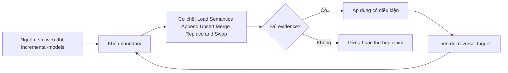

# Load Semantics Append Upsert Merge Replace and Swap

> [!abstract] Câu hỏi trung tâm
> Chọn load semantics nào để giữ grain, history, delete và atomic visibility của từng dataset?

## 1. Semantics trước câu lệnh

Append thêm records; upsert insert/update theo key; merge có matched/not-matched clauses và có thể xử lý delete; replace tái tạo whole target; swap publish một prepared version bằng pointer/name/catalog operation. Tên strategy trong tool không đủ: phải ghi key, grain, source boundary, history và visibility.

## 2. Append

Đúng cho immutable events hoặc version ledger khi duplicate identity được kiểm. Với mutable entity, append tạo nhiều versions và consumer cần current-view rule. Retry làm duplicate nếu không có event/batch identity. Partition append không đồng nghĩa exactly-once; manifest/checkpoint và dedup vẫn cần.

## 3. Upsert và merge

Unique key phải thật sự unique/stable ở source slice và target. Duplicate keys trong incoming batch có thể fail hoặc chọn nondeterministically tùy engine. Define precedence by source version/time with tie breaker. Hard delete cần tombstone/not-matched policy; absent row trong incremental batch không mặc nhiên delete.

## 4. Replace và overwrite

Whole replace đơn giản cho small snapshot nếu build off to side, validate rồi atomic publish. Truncate-then-load phơi partial/empty state và crash gap. Partition overwrite cần complete partition boundary và late-data policy; dynamic overwrite nhầm predicate có thể xóa rộng. Retain previous version for rollback.

## 5. Swap

Table/view/catalog pointer swap tách build khỏi publish, nhưng atomicity và reader snapshot phụ thuộc engine/catalog. Grants, comments, constraints, indexes, statistics và downstream references phải được preserve/test. Cross-object publication không mặc nhiên atomic. Garbage collection chỉ sau retention and active-reader safety.

## 6. Decision matrix lab

Chạy same entity/events dưới append, upsert, merge, replace và swap với update, delete, late arrival, duplicate batch và crash. Kiểm key/grain, current state, history, reader visibility, rerun equality và rollback. Ghi engine/version transaction semantics; không suy từ SQL syntax sang universal guarantee.

## 7. Ma trận kiểm chứng từng mệnh đề

Mỗi claim phải gắn source/entity boundary, exact fixture, checkpoint/input state, counterexample và independent reconciliation oracle. Connector chạy thành công hoặc API trả 2xx chưa chứng minh completeness.

### 7.1. Load-semantics probe 1: grain/key, change operation, publish boundary, reader observation và rerun oracle phải đủ

**Mệnh đề cần kiểm.** Load-semantics probe 1: grain/key, change operation, publish boundary, reader observation và rerun oracle phải đủ.

**Thiết kế phép thử cho `wiki.transformation.load-semantics-append-upsert-merge-replace-swap`.** Khóa source/API version, entity, grain/key, time boundary, schema, pagination/cursor configuration và failure schedule. Tạo positive, boundary và negative fixtures; thay đổi đúng một assumption. Lưu request/query, response/raw extract hash, checkpoint trước/sau, landing objects, target state và source-at-boundary oracle.

**Điều kiện chấp nhận cho `wiki.transformation.load-semantics-append-upsert-merge-replace-swap`.** Count, key set, typed field hash và delete state khớp contract; duplicates được giải thích và dedup có identity rõ. Observation, inference và unknown được báo riêng. Lab chưa chạy chỉ là protocol.

### 7.2. Load-semantics probe 2: grain/key, change operation, publish boundary, reader observation và rerun oracle phải đủ

**Mệnh đề cần kiểm.** Load-semantics probe 2: grain/key, change operation, publish boundary, reader observation và rerun oracle phải đủ.

**Thiết kế phép thử cho `wiki.transformation.load-semantics-append-upsert-merge-replace-swap`.** Khóa source/API version, entity, grain/key, time boundary, schema, pagination/cursor configuration và failure schedule. Tạo positive, boundary và negative fixtures; thay đổi đúng một assumption. Lưu request/query, response/raw extract hash, checkpoint trước/sau, landing objects, target state và source-at-boundary oracle.

**Điều kiện chấp nhận cho `wiki.transformation.load-semantics-append-upsert-merge-replace-swap`.** Count, key set, typed field hash và delete state khớp contract; duplicates được giải thích và dedup có identity rõ. Observation, inference và unknown được báo riêng. Lab chưa chạy chỉ là protocol.

### 7.3. Load-semantics probe 3: grain/key, change operation, publish boundary, reader observation và rerun oracle phải đủ

**Mệnh đề cần kiểm.** Load-semantics probe 3: grain/key, change operation, publish boundary, reader observation và rerun oracle phải đủ.

**Thiết kế phép thử cho `wiki.transformation.load-semantics-append-upsert-merge-replace-swap`.** Khóa source/API version, entity, grain/key, time boundary, schema, pagination/cursor configuration và failure schedule. Tạo positive, boundary và negative fixtures; thay đổi đúng một assumption. Lưu request/query, response/raw extract hash, checkpoint trước/sau, landing objects, target state và source-at-boundary oracle.

**Điều kiện chấp nhận cho `wiki.transformation.load-semantics-append-upsert-merge-replace-swap`.** Count, key set, typed field hash và delete state khớp contract; duplicates được giải thích và dedup có identity rõ. Observation, inference và unknown được báo riêng. Lab chưa chạy chỉ là protocol.

### 7.4. Load-semantics probe 4: grain/key, change operation, publish boundary, reader observation và rerun oracle phải đủ

**Mệnh đề cần kiểm.** Load-semantics probe 4: grain/key, change operation, publish boundary, reader observation và rerun oracle phải đủ.

**Thiết kế phép thử cho `wiki.transformation.load-semantics-append-upsert-merge-replace-swap`.** Khóa source/API version, entity, grain/key, time boundary, schema, pagination/cursor configuration và failure schedule. Tạo positive, boundary và negative fixtures; thay đổi đúng một assumption. Lưu request/query, response/raw extract hash, checkpoint trước/sau, landing objects, target state và source-at-boundary oracle.

**Điều kiện chấp nhận cho `wiki.transformation.load-semantics-append-upsert-merge-replace-swap`.** Count, key set, typed field hash và delete state khớp contract; duplicates được giải thích và dedup có identity rõ. Observation, inference và unknown được báo riêng. Lab chưa chạy chỉ là protocol.

### 7.5. Load-semantics probe 5: grain/key, change operation, publish boundary, reader observation và rerun oracle phải đủ

**Mệnh đề cần kiểm.** Load-semantics probe 5: grain/key, change operation, publish boundary, reader observation và rerun oracle phải đủ.

**Thiết kế phép thử cho `wiki.transformation.load-semantics-append-upsert-merge-replace-swap`.** Khóa source/API version, entity, grain/key, time boundary, schema, pagination/cursor configuration và failure schedule. Tạo positive, boundary và negative fixtures; thay đổi đúng một assumption. Lưu request/query, response/raw extract hash, checkpoint trước/sau, landing objects, target state và source-at-boundary oracle.

**Điều kiện chấp nhận cho `wiki.transformation.load-semantics-append-upsert-merge-replace-swap`.** Count, key set, typed field hash và delete state khớp contract; duplicates được giải thích và dedup có identity rõ. Observation, inference và unknown được báo riêng. Lab chưa chạy chỉ là protocol.

### 7.6. Load-semantics probe 6: grain/key, change operation, publish boundary, reader observation và rerun oracle phải đủ

**Mệnh đề cần kiểm.** Load-semantics probe 6: grain/key, change operation, publish boundary, reader observation và rerun oracle phải đủ.

**Thiết kế phép thử cho `wiki.transformation.load-semantics-append-upsert-merge-replace-swap`.** Khóa source/API version, entity, grain/key, time boundary, schema, pagination/cursor configuration và failure schedule. Tạo positive, boundary và negative fixtures; thay đổi đúng một assumption. Lưu request/query, response/raw extract hash, checkpoint trước/sau, landing objects, target state và source-at-boundary oracle.

**Điều kiện chấp nhận cho `wiki.transformation.load-semantics-append-upsert-merge-replace-swap`.** Count, key set, typed field hash và delete state khớp contract; duplicates được giải thích và dedup có identity rõ. Observation, inference và unknown được báo riêng. Lab chưa chạy chỉ là protocol.

### 7.7. Load-semantics probe 7: grain/key, change operation, publish boundary, reader observation và rerun oracle phải đủ

**Mệnh đề cần kiểm.** Load-semantics probe 7: grain/key, change operation, publish boundary, reader observation và rerun oracle phải đủ.

**Thiết kế phép thử cho `wiki.transformation.load-semantics-append-upsert-merge-replace-swap`.** Khóa source/API version, entity, grain/key, time boundary, schema, pagination/cursor configuration và failure schedule. Tạo positive, boundary và negative fixtures; thay đổi đúng một assumption. Lưu request/query, response/raw extract hash, checkpoint trước/sau, landing objects, target state và source-at-boundary oracle.

**Điều kiện chấp nhận cho `wiki.transformation.load-semantics-append-upsert-merge-replace-swap`.** Count, key set, typed field hash và delete state khớp contract; duplicates được giải thích và dedup có identity rõ. Observation, inference và unknown được báo riêng. Lab chưa chạy chỉ là protocol.

### 7.8. Load-semantics probe 8: grain/key, change operation, publish boundary, reader observation và rerun oracle phải đủ

**Mệnh đề cần kiểm.** Load-semantics probe 8: grain/key, change operation, publish boundary, reader observation và rerun oracle phải đủ.

**Thiết kế phép thử cho `wiki.transformation.load-semantics-append-upsert-merge-replace-swap`.** Khóa source/API version, entity, grain/key, time boundary, schema, pagination/cursor configuration và failure schedule. Tạo positive, boundary và negative fixtures; thay đổi đúng một assumption. Lưu request/query, response/raw extract hash, checkpoint trước/sau, landing objects, target state và source-at-boundary oracle.

**Điều kiện chấp nhận cho `wiki.transformation.load-semantics-append-upsert-merge-replace-swap`.** Count, key set, typed field hash và delete state khớp contract; duplicates được giải thích và dedup có identity rõ. Observation, inference và unknown được báo riêng. Lab chưa chạy chỉ là protocol.

### 7.9. Load-semantics probe 9: grain/key, change operation, publish boundary, reader observation và rerun oracle phải đủ

**Mệnh đề cần kiểm.** Load-semantics probe 9: grain/key, change operation, publish boundary, reader observation và rerun oracle phải đủ.

**Thiết kế phép thử cho `wiki.transformation.load-semantics-append-upsert-merge-replace-swap`.** Khóa source/API version, entity, grain/key, time boundary, schema, pagination/cursor configuration và failure schedule. Tạo positive, boundary và negative fixtures; thay đổi đúng một assumption. Lưu request/query, response/raw extract hash, checkpoint trước/sau, landing objects, target state và source-at-boundary oracle.

**Điều kiện chấp nhận cho `wiki.transformation.load-semantics-append-upsert-merge-replace-swap`.** Count, key set, typed field hash và delete state khớp contract; duplicates được giải thích và dedup có identity rõ. Observation, inference và unknown được báo riêng. Lab chưa chạy chỉ là protocol.

### 7.10. Load-semantics probe 10: grain/key, change operation, publish boundary, reader observation và rerun oracle phải đủ

**Mệnh đề cần kiểm.** Load-semantics probe 10: grain/key, change operation, publish boundary, reader observation và rerun oracle phải đủ.

**Thiết kế phép thử cho `wiki.transformation.load-semantics-append-upsert-merge-replace-swap`.** Khóa source/API version, entity, grain/key, time boundary, schema, pagination/cursor configuration và failure schedule. Tạo positive, boundary và negative fixtures; thay đổi đúng một assumption. Lưu request/query, response/raw extract hash, checkpoint trước/sau, landing objects, target state và source-at-boundary oracle.

**Điều kiện chấp nhận cho `wiki.transformation.load-semantics-append-upsert-merge-replace-swap`.** Count, key set, typed field hash và delete state khớp contract; duplicates được giải thích và dedup có identity rõ. Observation, inference và unknown được báo riêng. Lab chưa chạy chỉ là protocol.

### 7.11. Load-semantics probe 11: grain/key, change operation, publish boundary, reader observation và rerun oracle phải đủ

**Mệnh đề cần kiểm.** Load-semantics probe 11: grain/key, change operation, publish boundary, reader observation và rerun oracle phải đủ.

**Thiết kế phép thử cho `wiki.transformation.load-semantics-append-upsert-merge-replace-swap`.** Khóa source/API version, entity, grain/key, time boundary, schema, pagination/cursor configuration và failure schedule. Tạo positive, boundary và negative fixtures; thay đổi đúng một assumption. Lưu request/query, response/raw extract hash, checkpoint trước/sau, landing objects, target state và source-at-boundary oracle.

**Điều kiện chấp nhận cho `wiki.transformation.load-semantics-append-upsert-merge-replace-swap`.** Count, key set, typed field hash và delete state khớp contract; duplicates được giải thích và dedup có identity rõ. Observation, inference và unknown được báo riêng. Lab chưa chạy chỉ là protocol.

### 7.12. Load-semantics probe 12: grain/key, change operation, publish boundary, reader observation và rerun oracle phải đủ

**Mệnh đề cần kiểm.** Load-semantics probe 12: grain/key, change operation, publish boundary, reader observation và rerun oracle phải đủ.

**Thiết kế phép thử cho `wiki.transformation.load-semantics-append-upsert-merge-replace-swap`.** Khóa source/API version, entity, grain/key, time boundary, schema, pagination/cursor configuration và failure schedule. Tạo positive, boundary và negative fixtures; thay đổi đúng một assumption. Lưu request/query, response/raw extract hash, checkpoint trước/sau, landing objects, target state và source-at-boundary oracle.

**Điều kiện chấp nhận cho `wiki.transformation.load-semantics-append-upsert-merge-replace-swap`.** Count, key set, typed field hash và delete state khớp contract; duplicates được giải thích và dedup có identity rõ. Observation, inference và unknown được báo riêng. Lab chưa chạy chỉ là protocol.

### 7.13. Load-semantics probe 13: grain/key, change operation, publish boundary, reader observation và rerun oracle phải đủ

**Mệnh đề cần kiểm.** Load-semantics probe 13: grain/key, change operation, publish boundary, reader observation và rerun oracle phải đủ.

**Thiết kế phép thử cho `wiki.transformation.load-semantics-append-upsert-merge-replace-swap`.** Khóa source/API version, entity, grain/key, time boundary, schema, pagination/cursor configuration và failure schedule. Tạo positive, boundary và negative fixtures; thay đổi đúng một assumption. Lưu request/query, response/raw extract hash, checkpoint trước/sau, landing objects, target state và source-at-boundary oracle.

**Điều kiện chấp nhận cho `wiki.transformation.load-semantics-append-upsert-merge-replace-swap`.** Count, key set, typed field hash và delete state khớp contract; duplicates được giải thích và dedup có identity rõ. Observation, inference và unknown được báo riêng. Lab chưa chạy chỉ là protocol.

### 7.14. Load-semantics probe 14: grain/key, change operation, publish boundary, reader observation và rerun oracle phải đủ

**Mệnh đề cần kiểm.** Load-semantics probe 14: grain/key, change operation, publish boundary, reader observation và rerun oracle phải đủ.

**Thiết kế phép thử cho `wiki.transformation.load-semantics-append-upsert-merge-replace-swap`.** Khóa source/API version, entity, grain/key, time boundary, schema, pagination/cursor configuration và failure schedule. Tạo positive, boundary và negative fixtures; thay đổi đúng một assumption. Lưu request/query, response/raw extract hash, checkpoint trước/sau, landing objects, target state và source-at-boundary oracle.

**Điều kiện chấp nhận cho `wiki.transformation.load-semantics-append-upsert-merge-replace-swap`.** Count, key set, typed field hash và delete state khớp contract; duplicates được giải thích và dedup có identity rõ. Observation, inference và unknown được báo riêng. Lab chưa chạy chỉ là protocol.

### 7.15. Load-semantics probe 15: grain/key, change operation, publish boundary, reader observation và rerun oracle phải đủ

**Mệnh đề cần kiểm.** Load-semantics probe 15: grain/key, change operation, publish boundary, reader observation và rerun oracle phải đủ.

**Thiết kế phép thử cho `wiki.transformation.load-semantics-append-upsert-merge-replace-swap`.** Khóa source/API version, entity, grain/key, time boundary, schema, pagination/cursor configuration và failure schedule. Tạo positive, boundary và negative fixtures; thay đổi đúng một assumption. Lưu request/query, response/raw extract hash, checkpoint trước/sau, landing objects, target state và source-at-boundary oracle.

**Điều kiện chấp nhận cho `wiki.transformation.load-semantics-append-upsert-merge-replace-swap`.** Count, key set, typed field hash và delete state khớp contract; duplicates được giải thích và dedup có identity rõ. Observation, inference và unknown được báo riêng. Lab chưa chạy chỉ là protocol.

## 8. Quy trình phản biện

1. Chốt entity, grain, identity và immutable boundary.
2. Tách source fact, documentation claim và observed behavior.
3. Viết delete, retry, checkpoint và replay semantics trước code.
4. Dùng key/typed-hash reconciliation, không chỉ row count.
5. Pin version, retention, timezone, ordering và rate limits.
6. Ghi assumption bị falsify và extraction pattern thay thế.

## 9. Câu hỏi tự kiểm tra

1. Source thay đổi row/entity theo những operation nào?
2. Boundary nào định nghĩa complete?
3. Delete có xuất hiện trong interface không?
4. Cursor/order có total và immutable không?
5. Crash ở checkpoint boundary gây replay hay gap?
6. Bằng chứng nào chưa được chạy?

## 10. Giới hạn và điều chưa cho phép kết luận

- Chưa chạy mutation/pagination/watermark lab trên source thật.
- Product behavior phải pin version, retention và configuration.
- Decision matrices và failure protocols là synthesis của giáo trình.
- Note giữ trạng thái `review` tới khi chủ dự án duyệt.

## Reference
1. [[SRC-DBT-INCREMENTAL-MODELS]]
2. [[SRC-POSTGRESQL-TRANSACTIONS]]
3. [[SRC-REIS-HOUSLEY-FUNDAMENTALS-DATA-ENGINEERING]]

## Source coverage

| Source slice | Nội dung sử dụng | Trạng thái |
|---|---|---|
| [[SRC-DBT-INCREMENTAL-MODELS]] | Source/change/API contract hoặc engineering context | Đã đọc locator; không suy ngoài phạm vi |
| [[SRC-POSTGRESQL-TRANSACTIONS]] | Source/change/API contract hoặc engineering context | Đã đọc locator; không suy ngoài phạm vi |
| [[SRC-REIS-HOUSLEY-FUNDAMENTALS-DATA-ENGINEERING]] | Source/change/API contract hoặc engineering context | Đã đọc locator; không suy ngoài phạm vi |

## Key takeaways
- Extraction pattern chỉ đúng khi source assumptions đúng.
- Completeness cần immutable boundary và reconciliation oracle.
- Retry/checkpoint ưu tiên replay có kiểm soát hơn silent gap.
- Connector không chuyển giao ownership về tính đúng.

<!-- ATOMIC-EXECUTION-CAPSULE:START -->

## Execution capsule: kiểm chứng `wiki.transformation.load-semantics-append-upsert-merge-replace-swap`

> [!important] Phân loại mệnh đề
> Với `wiki.transformation.load-semantics-append-upsert-merge-replace-swap`, sơ đồ, ví dụ và artifact về **Load Semantics Append Upsert Merge Replace and Swap** là **synthesis để kiểm chứng**; chúng không phải trích dẫn hay case nguyên văn của nguồn.

### Sơ đồ cơ chế và điểm kiểm soát



Đọc sơ đồ `wiki.transformation.load-semantics-append-upsert-merge-replace-swap` từ trái sang phải: source chỉ cung cấp claim ban đầu cho **Load Semantics Append Upsert Merge Replace and Swap**; quyết định chỉ được đi tiếp sau khi boundary, evidence và điều kiện đảo quyết định đã hiện hữu.

### Ví dụ làm việc có thể bác bỏ

**Input.** Một đội cần trả lời: Chọn load semantics nào để giữ grain, history, delete và atomic visibility của từng dataset? cho một phạm vi nhỏ, có owner và deadline rõ.

**Decision.** Đội áp dụng **Load Semantics Append Upsert Merge Replace and Swap** trên control và variant chỉ khác một assumption; expected result và hard constraints được khóa trước khi chạy.

**Outcome.** Với `wiki.transformation.load-semantics-append-upsert-merge-replace-swap`, nếu observation vi phạm hard constraint hoặc oracle độc lập không xác nhận **Load Semantics Append Upsert Merge Replace and Swap**, đội thu hẹp claim hay đảo quyết định. Nếu đạt, kết luận vẫn kèm scope, version và review date; một lần thành công không được nâng thành quy luật phổ quát.

### Artifact thực thi tối thiểu

```sql
-- Verification harness for: Load Semantics Append Upsert Merge Replace and Swap
WITH evidence AS (
    SELECT 'wiki.transformation.load-semantics-append-upsert-merge-replace-swap' AS concept_id,
           'boundary_declared' AS check_name, 1 AS passed
    UNION ALL
    SELECT 'wiki.transformation.load-semantics-append-upsert-merge-replace-swap', 'independent_oracle', 1
    UNION ALL
    SELECT 'wiki.transformation.load-semantics-append-upsert-merge-replace-swap', 'reversal_trigger_recorded', 1
)
SELECT concept_id,
       MIN(passed) AS all_hard_checks_pass,
       COUNT(*) AS evidence_items
FROM evidence
GROUP BY concept_id
HAVING MIN(passed) = 1;
```

Artifact của `wiki.transformation.load-semantics-append-upsert-merge-replace-swap` buộc người dùng ghi boundary, oracle và reversal trigger cho **Load Semantics Append Upsert Merge Replace and Swap**. Các giá trị minh họa phải được thay bằng evidence thật trước khi dùng cho quyết định.

### Tự kiểm tra trước khi tái sử dụng

1. Bạn có thể trả lời `Chọn load semantics nào để giữ grain, history, delete và atomic visibility của từng dataset?` bằng một câu mà không kéo thêm concept thứ hai không?
2. Source locator nào đỡ cho claim, và phần nào chỉ là synthesis trong note?
3. Observation nào khiến bạn dừng, thu hẹp hoặc đảo quyết định?
4. Artifact nào cho phép một reviewer độc lập tái hiện kết quả?

<!-- ATOMIC-EXECUTION-CAPSULE:END -->
