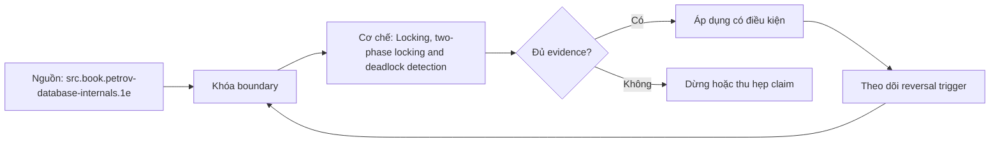

# Locking, two-phase locking and deadlock detection

> [!abstract] Câu hỏi trung tâm
> Làm thế nào phân biệt lock wait hợp lệ với deadlock, truy wait-for graph và retry mà không nhân đôi tác dụng?

## 1. Khoá bảo vệ điều gì

Lock manager điều phối quyền truy cập lên resource: relation, page, tuple, transaction ID hoặc advisory key. Shared/exclusive chỉ là mô hình tối giản; PostgreSQL có nhiều table- và row-lock modes với ma trận xung đột riêng. Lock được cấp không đồng nghĩa statement đã hoàn thành: session có thể giữ lock đến cuối transaction. Vì vậy phải quan sát holder, waiter, resource, mode, transaction age và query state cùng lúc.

## 2. Two-phase locking và strictness

Trong 2PL, growing phase chỉ lấy lock; sau lần nhả đầu tiên là shrinking phase và không lấy thêm. Quy tắc này cho conflict-serializability nhưng không tự nói recoverability. Strict 2PL giữ exclusive locks đến commit/abort, ngăn transaction khác đọc/ghi dữ liệu chưa commit và đơn giản hoá recovery. PostgreSQL MVCC không thể được mô tả như một strict-2PL engine thuần; row versions xử lý reads, locks vẫn điều phối write conflicts và DDL.

## 3. Chờ không phải deadlock

Một lock wait có cạnh T2→T1 nhưng chưa có cycle; nếu T1 tiến tới commit thì hệ tự thông. Deadlock có cycle trong wait-for graph, chẳng hạn T1 giữ A chờ B còn T2 giữ B chờ A. Thêm session thứ ba hoặc nhiều resource tạo cycle dài hơn. Chẩn đoán phải dựng cạnh từ waiter tới blocker thay vì chỉ liệt kê những session có trạng thái chờ.

## 4. Phát hiện và chọn nạn nhân

Engine có thể chạy detector sau deadlock timeout, tìm cycle rồi abort một participant để phá vòng. Nạn nhân không phải transaction có lỗi nghiệp vụ; đó là quyết định recovery của engine. PostgreSQL báo deadlock detected và rollback transaction hiện tại. Ứng dụng phải coi deadlock/serialization failure là transient, rollback toàn attempt, lấy state mới và retry có giới hạn.

## 5. Phòng ngừa và vận hành

Quy tắc thứ tự lock nhất quán loại cycle nếu mọi code path tuân thủ. Transaction ngắn, không chờ input/network trong transaction, index đúng để giảm số row bị chạm, batch có giới hạn và lock timeout giúp giảm blast radius. Kill backend hoặc restart database chỉ là biện pháp khẩn cấp có mất work; không thay root-cause analysis.

## 6. Retry an toàn

Retry nguyên logical transaction, không retry riêng statement sau khi transaction đã failed. Operation ID/idempotency key ngăn duplicate side effects; exponential backoff có jitter tránh herd. Log attempt, SQLSTATE, blocking PID, lock target, elapsed time và final outcome. Nếu transaction gọi HTTP/email trước commit, retry có thể lặp tác dụng; cần outbox hoặc compensation.

## 7. Ma trận kiểm chứng từng mệnh đề

Mỗi mệnh đề dưới đây phải được kiểm bằng một schedule hoặc phép đo có điều kiện đầu vào rõ ràng. Không dùng một ảnh màn hình cuối làm bằng chứng thay cho lệnh, timestamp, cấu hình và raw output.

### 7.1. Hai transaction update hai account theo thứ tự đảo ngược tạo cycle hai cạnh

**Giả thuyết.** Hai transaction update hai account theo thứ tự đảo ngược tạo cycle hai cạnh. **Cách kiểm.** Cố định phiên bản database, cấu hình, dữ liệu seed và thứ tự thao tác; ghi operation ID, transaction/session ID, thời điểm bắt đầu–kết thúc và trạng thái commit/abort. **Đối chứng.** Chạy một biến thể bỏ đúng yếu tố đang xét, không đổi đồng thời nhiều tham số. **Bằng chứng đạt cho `wiki.database.locking-2pl-deadlock`.** Lưu command/script, raw result và counter trước–sau; giải thích cơ chế tạo ra quan sát. Một lần không tái hiện không đủ bác bỏ hiện tượng concurrency; cần barrier xác định và lặp có giới hạn.

### 7.2. Một transaction giữ row lock rồi sleep tạo lock wait nhưng không tạo cycle

**Giả thuyết.** Một transaction giữ row lock rồi sleep tạo lock wait nhưng không tạo cycle. **Cách kiểm.** Cố định phiên bản database, cấu hình, dữ liệu seed và thứ tự thao tác; ghi operation ID, transaction/session ID, thời điểm bắt đầu–kết thúc và trạng thái commit/abort. **Đối chứng.** Chạy một biến thể bỏ đúng yếu tố đang xét, không đổi đồng thời nhiều tham số. **Bằng chứng đạt cho `wiki.database.locking-2pl-deadlock`.** Lưu command/script, raw result và counter trước–sau; giải thích cơ chế tạo ra quan sát. Một lần không tái hiện không đủ bác bỏ hiện tượng concurrency; cần barrier xác định và lặp có giới hạn.

### 7.3. Query thiếu index khoá nhiều row hơn dự kiến và làm tăng waiter count

**Giả thuyết.** Query thiếu index khoá nhiều row hơn dự kiến và làm tăng waiter count. **Cách kiểm.** Cố định phiên bản database, cấu hình, dữ liệu seed và thứ tự thao tác; ghi operation ID, transaction/session ID, thời điểm bắt đầu–kết thúc và trạng thái commit/abort. **Đối chứng.** Chạy một biến thể bỏ đúng yếu tố đang xét, không đổi đồng thời nhiều tham số. **Bằng chứng đạt cho `wiki.database.locking-2pl-deadlock`.** Lưu command/script, raw result và counter trước–sau; giải thích cơ chế tạo ra quan sát. Một lần không tái hiện không đủ bác bỏ hiện tượng concurrency; cần barrier xác định và lặp có giới hạn.

### 7.4. DDL lấy table lock xung đột với transaction đọc/ghi dài

**Giả thuyết.** DDL lấy table lock xung đột với transaction đọc/ghi dài. **Cách kiểm.** Cố định phiên bản database, cấu hình, dữ liệu seed và thứ tự thao tác; ghi operation ID, transaction/session ID, thời điểm bắt đầu–kết thúc và trạng thái commit/abort. **Đối chứng.** Chạy một biến thể bỏ đúng yếu tố đang xét, không đổi đồng thời nhiều tham số. **Bằng chứng đạt cho `wiki.database.locking-2pl-deadlock`.** Lưu command/script, raw result và counter trước–sau; giải thích cơ chế tạo ra quan sát. Một lần không tái hiện không đủ bác bỏ hiện tượng concurrency; cần barrier xác định và lặp có giới hạn.

### 7.5. deadlock_timeout thấp làm detector/log hoạt động dày nhưng không chữa thứ tự lock

**Giả thuyết.** deadlock_timeout thấp làm detector/log hoạt động dày nhưng không chữa thứ tự lock. **Cách kiểm.** Cố định phiên bản database, cấu hình, dữ liệu seed và thứ tự thao tác; ghi operation ID, transaction/session ID, thời điểm bắt đầu–kết thúc và trạng thái commit/abort. **Đối chứng.** Chạy một biến thể bỏ đúng yếu tố đang xét, không đổi đồng thời nhiều tham số. **Bằng chứng đạt cho `wiki.database.locking-2pl-deadlock`.** Lưu command/script, raw result và counter trước–sau; giải thích cơ chế tạo ra quan sát. Một lần không tái hiện không đủ bác bỏ hiện tượng concurrency; cần barrier xác định và lặp có giới hạn.

### 7.6. lock_timeout huỷ statement vì chờ lâu dù không có deadlock

**Giả thuyết.** lock_timeout huỷ statement vì chờ lâu dù không có deadlock. **Cách kiểm.** Cố định phiên bản database, cấu hình, dữ liệu seed và thứ tự thao tác; ghi operation ID, transaction/session ID, thời điểm bắt đầu–kết thúc và trạng thái commit/abort. **Đối chứng.** Chạy một biến thể bỏ đúng yếu tố đang xét, không đổi đồng thời nhiều tham số. **Bằng chứng đạt cho `wiki.database.locking-2pl-deadlock`.** Lưu command/script, raw result và counter trước–sau; giải thích cơ chế tạo ra quan sát. Một lần không tái hiện không đủ bác bỏ hiện tượng concurrency; cần barrier xác định và lặp có giới hạn.

### 7.7. statement_timeout và lock_timeout tạo failure semantics khác nhau

**Giả thuyết.** statement_timeout và lock_timeout tạo failure semantics khác nhau. **Cách kiểm.** Cố định phiên bản database, cấu hình, dữ liệu seed và thứ tự thao tác; ghi operation ID, transaction/session ID, thời điểm bắt đầu–kết thúc và trạng thái commit/abort. **Đối chứng.** Chạy một biến thể bỏ đúng yếu tố đang xét, không đổi đồng thời nhiều tham số. **Bằng chứng đạt cho `wiki.database.locking-2pl-deadlock`.** Lưu command/script, raw result và counter trước–sau; giải thích cơ chế tạo ra quan sát. Một lần không tái hiện không đủ bác bỏ hiện tượng concurrency; cần barrier xác định và lặp có giới hạn.

### 7.8. SELECT FOR UPDATE biến read thành locking read có phạm vi theo rows thực sự khoá

**Giả thuyết.** SELECT FOR UPDATE biến read thành locking read có phạm vi theo rows thực sự khoá. **Cách kiểm.** Cố định phiên bản database, cấu hình, dữ liệu seed và thứ tự thao tác; ghi operation ID, transaction/session ID, thời điểm bắt đầu–kết thúc và trạng thái commit/abort. **Đối chứng.** Chạy một biến thể bỏ đúng yếu tố đang xét, không đổi đồng thời nhiều tham số. **Bằng chứng đạt cho `wiki.database.locking-2pl-deadlock`.** Lưu command/script, raw result và counter trước–sau; giải thích cơ chế tạo ra quan sát. Một lần không tái hiện không đủ bác bỏ hiện tượng concurrency; cần barrier xác định và lặp có giới hạn.

### 7.9. SKIP LOCKED phù hợp work queue nhưng có thể tạo starvation/fairness trade-off

**Giả thuyết.** SKIP LOCKED phù hợp work queue nhưng có thể tạo starvation/fairness trade-off. **Cách kiểm.** Cố định phiên bản database, cấu hình, dữ liệu seed và thứ tự thao tác; ghi operation ID, transaction/session ID, thời điểm bắt đầu–kết thúc và trạng thái commit/abort. **Đối chứng.** Chạy một biến thể bỏ đúng yếu tố đang xét, không đổi đồng thời nhiều tham số. **Bằng chứng đạt cho `wiki.database.locking-2pl-deadlock`.** Lưu command/script, raw result và counter trước–sau; giải thích cơ chế tạo ra quan sát. Một lần không tái hiện không đủ bác bỏ hiện tượng concurrency; cần barrier xác định và lặp có giới hạn.

### 7.10. NOWAIT fail-fast và chuyển quyền quyết định sang caller

**Giả thuyết.** NOWAIT fail-fast và chuyển quyền quyết định sang caller. **Cách kiểm.** Cố định phiên bản database, cấu hình, dữ liệu seed và thứ tự thao tác; ghi operation ID, transaction/session ID, thời điểm bắt đầu–kết thúc và trạng thái commit/abort. **Đối chứng.** Chạy một biến thể bỏ đúng yếu tố đang xét, không đổi đồng thời nhiều tham số. **Bằng chứng đạt cho `wiki.database.locking-2pl-deadlock`.** Lưu command/script, raw result và counter trước–sau; giải thích cơ chế tạo ra quan sát. Một lần không tái hiện không đủ bác bỏ hiện tượng concurrency; cần barrier xác định và lặp có giới hạn.

### 7.11. advisory lock không được engine gắn với row invariant

**Giả thuyết.** advisory lock không được engine gắn với row invariant. **Cách kiểm.** Cố định phiên bản database, cấu hình, dữ liệu seed và thứ tự thao tác; ghi operation ID, transaction/session ID, thời điểm bắt đầu–kết thúc và trạng thái commit/abort. **Đối chứng.** Chạy một biến thể bỏ đúng yếu tố đang xét, không đổi đồng thời nhiều tham số. **Bằng chứng đạt cho `wiki.database.locking-2pl-deadlock`.** Lưu command/script, raw result và counter trước–sau; giải thích cơ chế tạo ra quan sát. Một lần không tái hiện không đủ bác bỏ hiện tượng concurrency; cần barrier xác định và lặp có giới hạn.

### 7.12. connection mất sau commit tạo outcome ambiguity ngoài deadlock

**Giả thuyết.** connection mất sau commit tạo outcome ambiguity ngoài deadlock. **Cách kiểm.** Cố định phiên bản database, cấu hình, dữ liệu seed và thứ tự thao tác; ghi operation ID, transaction/session ID, thời điểm bắt đầu–kết thúc và trạng thái commit/abort. **Đối chứng.** Chạy một biến thể bỏ đúng yếu tố đang xét, không đổi đồng thời nhiều tham số. **Bằng chứng đạt cho `wiki.database.locking-2pl-deadlock`.** Lưu command/script, raw result và counter trước–sau; giải thích cơ chế tạo ra quan sát. Một lần không tái hiện không đủ bác bỏ hiện tượng concurrency; cần barrier xác định và lặp có giới hạn.

### 7.13. retry không có idempotency key có thể nhân đôi external effect

**Giả thuyết.** retry không có idempotency key có thể nhân đôi external effect. **Cách kiểm.** Cố định phiên bản database, cấu hình, dữ liệu seed và thứ tự thao tác; ghi operation ID, transaction/session ID, thời điểm bắt đầu–kết thúc và trạng thái commit/abort. **Đối chứng.** Chạy một biến thể bỏ đúng yếu tố đang xét, không đổi đồng thời nhiều tham số. **Bằng chứng đạt cho `wiki.database.locking-2pl-deadlock`.** Lưu command/script, raw result và counter trước–sau; giải thích cơ chế tạo ra quan sát. Một lần không tái hiện không đủ bác bỏ hiện tượng concurrency; cần barrier xác định và lặp có giới hạn.

### 7.14. monitor chỉ active sessions bỏ sót idle in transaction holder

**Giả thuyết.** monitor chỉ active sessions bỏ sót idle in transaction holder. **Cách kiểm.** Cố định phiên bản database, cấu hình, dữ liệu seed và thứ tự thao tác; ghi operation ID, transaction/session ID, thời điểm bắt đầu–kết thúc và trạng thái commit/abort. **Đối chứng.** Chạy một biến thể bỏ đúng yếu tố đang xét, không đổi đồng thời nhiều tham số. **Bằng chứng đạt cho `wiki.database.locking-2pl-deadlock`.** Lưu command/script, raw result và counter trước–sau; giải thích cơ chế tạo ra quan sát. Một lần không tái hiện không đủ bác bỏ hiện tượng concurrency; cần barrier xác định và lặp có giới hạn.

### 7.15. restart xoá triệu chứng nhưng mất evidence về blocker chain

**Giả thuyết.** restart xoá triệu chứng nhưng mất evidence về blocker chain. **Cách kiểm.** Cố định phiên bản database, cấu hình, dữ liệu seed và thứ tự thao tác; ghi operation ID, transaction/session ID, thời điểm bắt đầu–kết thúc và trạng thái commit/abort. **Đối chứng.** Chạy một biến thể bỏ đúng yếu tố đang xét, không đổi đồng thời nhiều tham số. **Bằng chứng đạt cho `wiki.database.locking-2pl-deadlock`.** Lưu command/script, raw result và counter trước–sau; giải thích cơ chế tạo ra quan sát. Một lần không tái hiện không đủ bác bỏ hiện tượng concurrency; cần barrier xác định và lặp có giới hạn.

## 8. Khung chẩn đoán

1. Viết hiện tượng quan sát được và mốc thời gian, không nhảy thẳng tới nguyên nhân.
2. Ghi exact DBMS/version, topology, isolation/durability mode và workload.
3. Dựng state hoặc dependency graph nhỏ nhất giải thích hiện tượng.
4. Thu evidence ở cả client, engine và storage/replica nếu có.
5. Nêu giả thuyết có dự đoán phân biệt được; đổi một biến và chạy lại.
6. Phân biệt biện pháp giảm triệu chứng, sửa nguyên nhân và control ngăn tái diễn.
7. Giữ failed run; không xoá evidence chỉ vì kết quả không như dự kiến.

## 9. Câu hỏi tự kiểm tra

1. Contract chính của cơ chế trong bài là gì và failure class nào nằm ngoài contract?
2. Counter hoặc graph nào phân biệt symptom với root cause?
3. Một phát biểu nào chỉ đúng cho PostgreSQL, không được khái quát thành SQL chung?
4. Abort hoặc stale read khi nào là hành vi đúng theo cấu hình?
5. Lab cần barrier, operation ID và đối chứng nào để tái hiện được?
6. Biện pháp vận hành nào nguy hiểm nếu áp dụng trực tiếp lên production?

## 10. Giới hạn và điều chưa cho phép kết luận

- Chưa chạy lab database; mọi số đo phải được học viên tạo trong môi trường cô lập.
- Hành vi theo version/dialect phải kiểm manual đúng hệ; note không thay runbook production.
- Không suy benchmark, ngưỡng alert hay SLO phổ quát từ sách.
- Không coi synchronous, serializable, vacuum hoặc partitioning là bảo đảm tuyệt đối ngoài cấu hình và failure model đã nêu.

## Reference
1. [[SRC-PETROV-DATABASE-INTERNALS-1E]]
2. [[SRC-SILBERSCHATZ-DATABASE-SYSTEM-CONCEPTS-7E]]
3. [[SRC-POSTGRESQL-17-10-MANUAL]]
4. [[SRC-ROGOV-POSTGRESQL-14-INTERNALS]]

## Source coverage

| Source slice | Nội dung sử dụng | Trạng thái |
|---|---|---|
| [[SRC-PETROV-DATABASE-INTERNALS-1E]] | Cơ chế, ranh giới và phản ví dụ liên quan đến bài | Đã đọc phạm vi có locator và diễn giải |
| [[SRC-SILBERSCHATZ-DATABASE-SYSTEM-CONCEPTS-7E]] | Cơ chế, ranh giới và phản ví dụ liên quan đến bài | Đã đọc phạm vi có locator và diễn giải |
| [[SRC-POSTGRESQL-17-10-MANUAL]] | Cơ chế, ranh giới và phản ví dụ liên quan đến bài | Đã đọc phạm vi có locator và diễn giải |
| [[SRC-ROGOV-POSTGRESQL-14-INTERNALS]] | Cơ chế, ranh giới và phản ví dụ liên quan đến bài | Đã đọc phạm vi có locator và diễn giải |

## Key takeaways
- Bắt đầu từ invariant/failure model và bằng chứng, không bắt đầu từ tên tính năng.
- Phân biệt contract chung với hành vi PostgreSQL cụ thể.
- Concurrency và failover test phải có schedule, operation ID và raw output tái lập được.
- Một control làm giảm rủi ro này có thể tăng latency, abort, coordination hoặc chi phí vận hành khác.
- Chưa chạy lab thì trạng thái là tài liệu học thuật đã kiểm cấu trúc, không phải chứng nhận production.

<!-- ATOMIC-EXECUTION-CAPSULE:START -->

## Execution capsule — kiểm chứng `wiki.database.locking-2pl-deadlock`

> [!important] Phân loại mệnh đề
> Với `wiki.database.locking-2pl-deadlock`, sơ đồ, ví dụ và artifact về **Locking, two-phase locking and deadlock detection** là **synthesis để kiểm chứng**; chúng không phải trích dẫn hay case nguyên văn của nguồn.

### Sơ đồ cơ chế và điểm kiểm soát



Đọc sơ đồ `wiki.database.locking-2pl-deadlock` từ trái sang phải: source chỉ cung cấp claim ban đầu cho **Locking, two-phase locking and deadlock detection**; quyết định chỉ được đi tiếp sau khi boundary, evidence và điều kiện đảo quyết định đã hiện hữu.

### Artifact thực thi tối thiểu

```sql
-- Verification harness for: Locking, two-phase locking and deadlock detection
WITH evidence AS (
    SELECT 'wiki.database.locking-2pl-deadlock' AS concept_id,
           'boundary_declared' AS check_name, 1 AS passed
    UNION ALL
    SELECT 'wiki.database.locking-2pl-deadlock', 'independent_oracle', 1
    UNION ALL
    SELECT 'wiki.database.locking-2pl-deadlock', 'reversal_trigger_recorded', 1
)
SELECT concept_id,
       MIN(passed) AS all_hard_checks_pass,
       COUNT(*) AS evidence_items
FROM evidence
GROUP BY concept_id
HAVING MIN(passed) = 1;
```

Artifact của `wiki.database.locking-2pl-deadlock` buộc người dùng ghi boundary, oracle và reversal trigger cho **Locking, two-phase locking and deadlock detection**. Các giá trị minh họa phải được thay bằng evidence thật trước khi dùng cho quyết định.

### Tự kiểm tra trước khi tái sử dụng

1. Bạn có thể trả lời `Làm thế nào phân biệt lock wait hợp lệ với deadlock, truy wait-for graph và retry mà không nhân đôi tác dụng?` bằng một câu mà không kéo thêm concept thứ hai không?
2. Source locator nào đỡ cho claim, và phần nào chỉ là synthesis trong note?
3. Observation nào khiến bạn dừng, thu hẹp hoặc đảo quyết định?
4. Artifact nào cho phép một reviewer độc lập tái hiện kết quả?

<!-- ATOMIC-EXECUTION-CAPSULE:END -->
