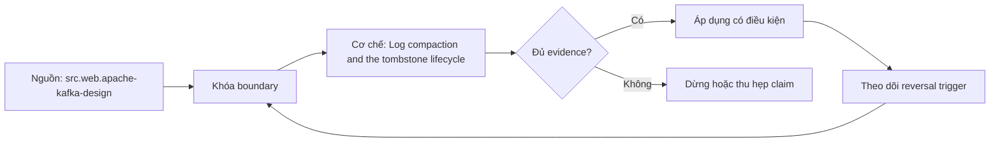

# Log compaction and the tombstone lifecycle

> [!abstract] Câu hỏi trung tâm
> Log compaction và tombstone giữ latest keyed state nhưng tạo những cửa sổ lịch sử/deletion nào?

## 1. Compaction invariant

Về lâu dài giữ ít nhất latest value cho mỗi key trong partition, không biến log ngay lập tức thành map chỉ một record. Đừng bắt đầu bằng tên công cụ. Hãy bắt đầu bằng đối tượng được bảo vệ, boundary quan sát được và hậu quả nếu kết luận sai. Trong bài `Log compaction and the tombstone lifecycle`, câu hỏi thực dụng là: Log compaction và tombstone giữ latest keyed state nhưng tạo những cửa sổ lịch sử/deletion nào? Ta ghi rõ grain, population, time window, owner và hành động sau failure; nếu một trường chưa biết thì đánh dấu unknown thay vì lấp bằng mặc định. Bằng chứng tối thiểu gồm fixture có version, cấu hình hoặc rule đã resolve, raw observation, expected result và limitation. Phần này là curriculum synthesis dựa trên các nguồn đã định danh, không phải lời hứa rằng mọi adapter hay deployment đều có cùng hành vi.

## 2. Cleaner behavior

Background cleaner xử lý eligible segments; duplicate historical values tồn tại trước khi cleaned và order/offsets không được renumber. Điểm khó không nằm ở cú pháp mà ở identity và scope. Hai phép đo cùng tên vẫn có thể nói về hai population hoặc hai thời điểm khác nhau. Trong bài `Log compaction and the tombstone lifecycle`, câu hỏi thực dụng là: Log compaction và tombstone giữ latest keyed state nhưng tạo những cửa sổ lịch sử/deletion nào? Ta ghi rõ grain, population, time window, owner và hành động sau failure; nếu một trường chưa biết thì đánh dấu unknown thay vì lấp bằng mặc định. Bằng chứng tối thiểu gồm fixture có version, cấu hình hoặc rule đã resolve, raw observation, expected result và limitation. Phần này là curriculum synthesis dựa trên các nguồn đã định danh, không phải lời hứa rằng mọi adapter hay deployment đều có cùng hành vi.

## 3. Tombstone

Null value với key biểu diễn delete marker; marker cần tồn tại đủ lâu cho consumers quan sát trước khi được eligible remove. Một dashboard xanh chỉ là tín hiệu. Muốn biến nó thành bằng chứng phải giữ input, phiên bản, rule, trạng thái trước-sau và cách tính độc lập. Trong bài `Log compaction and the tombstone lifecycle`, câu hỏi thực dụng là: Log compaction và tombstone giữ latest keyed state nhưng tạo những cửa sổ lịch sử/deletion nào? Ta ghi rõ grain, population, time window, owner và hành động sau failure; nếu một trường chưa biết thì đánh dấu unknown thay vì lấp bằng mặc định. Bằng chứng tối thiểu gồm fixture có version, cấu hình hoặc rule đã resolve, raw observation, expected result và limitation. Phần này là curriculum synthesis dựa trên các nguồn đã định danh, không phải lời hứa rằng mọi adapter hay deployment đều có cùng hành vi.

## 4. Consumer reconstruction

Bootstrap consumer phải đọc từ boundary phù hợp, apply records theo partition order và xử lý tombstone/delete semantics. Thiết kế tốt phải chịu được counterexample. Hãy chủ động tạo case sát boundary, case thiếu dữ liệu và case replay thay vì chỉ chạy happy path. Trong bài `Log compaction and the tombstone lifecycle`, câu hỏi thực dụng là: Log compaction và tombstone giữ latest keyed state nhưng tạo những cửa sổ lịch sử/deletion nào? Ta ghi rõ grain, population, time window, owner và hành động sau failure; nếu một trường chưa biết thì đánh dấu unknown thay vì lấp bằng mặc định. Bằng chứng tối thiểu gồm fixture có version, cấu hình hoặc rule đã resolve, raw observation, expected result và limitation. Phần này là curriculum synthesis dựa trên các nguồn đã định danh, không phải lời hứa rằng mọi adapter hay deployment đều có cùng hành vi.

## 5. Configuration interaction

Cleanup policy, dirty ratio, segment roll và tombstone retention ảnh hưởng lag/space; version config phải pin. Chi phí vận hành thuộc contract. Một rule đúng nhưng quá đắt, quá ồn hoặc không có owner sẽ nhanh chóng bị tắt và mất tác dụng. Trong bài `Log compaction and the tombstone lifecycle`, câu hỏi thực dụng là: Log compaction và tombstone giữ latest keyed state nhưng tạo những cửa sổ lịch sử/deletion nào? Ta ghi rõ grain, population, time window, owner và hành động sau failure; nếu một trường chưa biết thì đánh dấu unknown thay vì lấp bằng mặc định. Bằng chứng tối thiểu gồm fixture có version, cấu hình hoặc rule đã resolve, raw observation, expected result và limitation. Phần này là curriculum synthesis dựa trên các nguồn đã định danh, không phải lời hứa rằng mọi adapter hay deployment đều có cùng hành vi.

## 6. Lifecycle test

Produce updates/delete/recreate, pause consumer qua cleaner windows và verify reconstructed state cùng deleted-key behavior. Kết luận cần có điều kiện đảo chiều. Khi volume, latency, nguồn thẩm quyền hoặc topology đổi, quyết định cũ phải được xem xét lại bằng cùng một oracle. Trong bài `Log compaction and the tombstone lifecycle`, câu hỏi thực dụng là: Log compaction và tombstone giữ latest keyed state nhưng tạo những cửa sổ lịch sử/deletion nào? Ta ghi rõ grain, population, time window, owner và hành động sau failure; nếu một trường chưa biết thì đánh dấu unknown thay vì lấp bằng mặc định. Bằng chứng tối thiểu gồm fixture có version, cấu hình hoặc rule đã resolve, raw observation, expected result và limitation. Phần này là curriculum synthesis dựa trên các nguồn đã định danh, không phải lời hứa rằng mọi adapter hay deployment đều có cùng hành vi.

## 7. Ma trận kiểm chứng từng mệnh đề

Với `wiki.streaming.kafka-compaction-tombstone`, command thành công không tự chứng minh dữ liệu đúng. Protocol riêng của bài là: Chạy version-pinned Kafka fixture với keys/partitions rõ, inject leader/network/cleaner event và compare log/state bằng consumer oracle. Mỗi probe dưới đây phải nối input boundary với failure signal và oracle có thể phản bác kết luận.

### 7.1. Log compaction and the tombstone lifecycle: kiểm `Compaction invariant` bằng case 1, cụ thể về lâu dài giữ ít nhất latest value cho mỗi key trong partition, không biến log ngay lập tức thành map chỉ một record

**Mệnh đề cần kiểm.** Log compaction and the tombstone lifecycle: kiểm `Compaction invariant` bằng case 1, cụ thể về lâu dài giữ ít nhất latest value cho mỗi key trong partition, không biến log ngay lập tức thành map chỉ một record.

**Thiết kế phép thử cho `wiki.streaming.kafka-compaction-tombstone`.** Trong ngữ cảnh `wiki.streaming.kafka-compaction-tombstone`, tạo positive control và negative control chỉ khác đúng một điều kiện. Khóa input snapshot, phiên bản và owner của rule; chạy đúng population được bài `Log compaction and the tombstone lifecycle` công bố.

**Bằng chứng cần giữ.** Đối với probe 1 của `Log compaction and the tombstone lifecycle`, giữ fixture, raw failing rows và lệnh tái hiện. Nếu chưa chạy lab, ghi expected evidence và giữ trạng thái review; không biến protocol thành observation.

### 7.2. Log compaction and the tombstone lifecycle: kiểm `Cleaner behavior` bằng case 2, cụ thể background cleaner xử lý eligible segments; duplicate historical values tồn tại trước khi cleaned và order/offsets không được renumber

**Mệnh đề cần kiểm.** Log compaction and the tombstone lifecycle: kiểm `Cleaner behavior` bằng case 2, cụ thể background cleaner xử lý eligible segments; duplicate historical values tồn tại trước khi cleaned và order/offsets không được renumber.

**Thiết kế phép thử cho `wiki.streaming.kafka-compaction-tombstone`.** Trong ngữ cảnh `wiki.streaming.kafka-compaction-tombstone`, đổi grain nhưng giữ tổng số dòng để lộ phép đo sai cấp. Khóa input snapshot, phiên bản và owner của rule; chạy đúng population được bài `Log compaction and the tombstone lifecycle` công bố.

**Bằng chứng cần giữ.** Đối với probe 2 của `Log compaction and the tombstone lifecycle`, báo numerator, denominator và key set ở cả hai grain. Nếu chưa chạy lab, ghi expected evidence và giữ trạng thái review; không biến protocol thành observation.

### 7.3. Log compaction and the tombstone lifecycle: kiểm `Tombstone` bằng case 3, cụ thể null value với key biểu diễn delete marker; marker cần tồn tại đủ lâu cho consumers quan sát trước khi được eligible remove

**Mệnh đề cần kiểm.** Log compaction and the tombstone lifecycle: kiểm `Tombstone` bằng case 3, cụ thể null value với key biểu diễn delete marker; marker cần tồn tại đủ lâu cho consumers quan sát trước khi được eligible remove.

**Thiết kế phép thử cho `wiki.streaming.kafka-compaction-tombstone`.** Trong ngữ cảnh `wiki.streaming.kafka-compaction-tombstone`, đưa một giá trị tới đúng boundary và một giá trị vượt boundary. Khóa input snapshot, phiên bản và owner của rule; chạy đúng population được bài `Log compaction and the tombstone lifecycle` công bố.

**Bằng chứng cần giữ.** Đối với probe 3 của `Log compaction and the tombstone lifecycle`, lưu hai observed values cùng rule đã resolve. Nếu chưa chạy lab, ghi expected evidence và giữ trạng thái review; không biến protocol thành observation.

### 7.4. Log compaction and the tombstone lifecycle: kiểm `Consumer reconstruction` bằng case 4, cụ thể bootstrap consumer phải đọc từ boundary phù hợp, apply records theo partition order và xử lý tombstone/delete semantics

**Mệnh đề cần kiểm.** Log compaction and the tombstone lifecycle: kiểm `Consumer reconstruction` bằng case 4, cụ thể bootstrap consumer phải đọc từ boundary phù hợp, apply records theo partition order và xử lý tombstone/delete semantics.

**Thiết kế phép thử cho `wiki.streaming.kafka-compaction-tombstone`.** Trong ngữ cảnh `wiki.streaming.kafka-compaction-tombstone`, kill tiến trình ngay trước rồi ngay sau durable side effect. Khóa input snapshot, phiên bản và owner của rule; chạy đúng population được bài `Log compaction and the tombstone lifecycle` công bố.

**Bằng chứng cần giữ.** Đối với probe 4 của `Log compaction and the tombstone lifecycle`, lưu checkpoint, external ledger và trạng thái sau restart. Nếu chưa chạy lab, ghi expected evidence và giữ trạng thái review; không biến protocol thành observation.

### 7.5. Log compaction and the tombstone lifecycle: kiểm `Configuration interaction` bằng case 5, cụ thể cleanup policy, dirty ratio, segment roll và tombstone retention ảnh hưởng lag/space; version config phải pin

**Mệnh đề cần kiểm.** Log compaction and the tombstone lifecycle: kiểm `Configuration interaction` bằng case 5, cụ thể cleanup policy, dirty ratio, segment roll và tombstone retention ảnh hưởng lag/space; version config phải pin.

**Thiết kế phép thử cho `wiki.streaming.kafka-compaction-tombstone`.** Trong ngữ cảnh `wiki.streaming.kafka-compaction-tombstone`, đảo thứ tự input và concurrency nhưng giữ logical population. Khóa input snapshot, phiên bản và owner của rule; chạy đúng population được bài `Log compaction and the tombstone lifecycle` công bố.

**Bằng chứng cần giữ.** Đối với probe 5 của `Log compaction and the tombstone lifecycle`, so canonical hash và business totals giữa các thứ tự. Nếu chưa chạy lab, ghi expected evidence và giữ trạng thái review; không biến protocol thành observation.

### 7.6. Log compaction and the tombstone lifecycle: kiểm `Lifecycle test` bằng case 6, cụ thể produce updates/delete/recreate, pause consumer qua cleaner windows và verify reconstructed state cùng deleted-key behavior

**Mệnh đề cần kiểm.** Log compaction and the tombstone lifecycle: kiểm `Lifecycle test` bằng case 6, cụ thể produce updates/delete/recreate, pause consumer qua cleaner windows và verify reconstructed state cùng deleted-key behavior.

**Thiết kế phép thử cho `wiki.streaming.kafka-compaction-tombstone`.** Trong ngữ cảnh `wiki.streaming.kafka-compaction-tombstone`, replay cùng identity với payload giống rồi payload xung đột. Khóa input snapshot, phiên bản và owner của rule; chạy đúng population được bài `Log compaction and the tombstone lifecycle` công bố.

**Bằng chứng cần giữ.** Đối với probe 6 của `Log compaction and the tombstone lifecycle`, tách duplicate replay khỏi identity collision bằng reason code. Nếu chưa chạy lab, ghi expected evidence và giữ trạng thái review; không biến protocol thành observation.

### 7.7. Log compaction and the tombstone lifecycle: kiểm `Compaction invariant` bằng case 7, cụ thể về lâu dài giữ ít nhất latest value cho mỗi key trong partition, không biến log ngay lập tức thành map chỉ một record

**Mệnh đề cần kiểm.** Log compaction and the tombstone lifecycle: kiểm `Compaction invariant` bằng case 7, cụ thể về lâu dài giữ ít nhất latest value cho mỗi key trong partition, không biến log ngay lập tức thành map chỉ một record.

**Thiết kế phép thử cho `wiki.streaming.kafka-compaction-tombstone`.** Trong ngữ cảnh `wiki.streaming.kafka-compaction-tombstone`, thêm record tới trễ trong horizon và ngoài horizon. Khóa input snapshot, phiên bản và owner của rule; chạy đúng population được bài `Log compaction and the tombstone lifecycle` công bố.

**Bằng chứng cần giữ.** Đối với probe 7 của `Log compaction and the tombstone lifecycle`, báo accepted-late, rejected-late và oldest outstanding timestamp. Nếu chưa chạy lab, ghi expected evidence và giữ trạng thái review; không biến protocol thành observation.

### 7.8. Log compaction and the tombstone lifecycle: kiểm `Cleaner behavior` bằng case 8, cụ thể background cleaner xử lý eligible segments; duplicate historical values tồn tại trước khi cleaned và order/offsets không được renumber

**Mệnh đề cần kiểm.** Log compaction and the tombstone lifecycle: kiểm `Cleaner behavior` bằng case 8, cụ thể background cleaner xử lý eligible segments; duplicate historical values tồn tại trước khi cleaned và order/offsets không được renumber.

**Thiết kế phép thử cho `wiki.streaming.kafka-compaction-tombstone`.** Trong ngữ cảnh `wiki.streaming.kafka-compaction-tombstone`, đổi schema theo một cách tương thích rồi một cách phá vỡ semantics. Khóa input snapshot, phiên bản và owner của rule; chạy đúng population được bài `Log compaction and the tombstone lifecycle` công bố.

**Bằng chứng cần giữ.** Đối với probe 8 của `Log compaction and the tombstone lifecycle`, giữ schema diff, classification và consumer-visible result. Nếu chưa chạy lab, ghi expected evidence và giữ trạng thái review; không biến protocol thành observation.

### 7.9. Log compaction and the tombstone lifecycle: kiểm `Tombstone` bằng case 9, cụ thể null value với key biểu diễn delete marker; marker cần tồn tại đủ lâu cho consumers quan sát trước khi được eligible remove

**Mệnh đề cần kiểm.** Log compaction and the tombstone lifecycle: kiểm `Tombstone` bằng case 9, cụ thể null value với key biểu diễn delete marker; marker cần tồn tại đủ lâu cho consumers quan sát trước khi được eligible remove.

**Thiết kế phép thử cho `wiki.streaming.kafka-compaction-tombstone`.** Trong ngữ cảnh `wiki.streaming.kafka-compaction-tombstone`, tạo missing và duplicate bù nhau để count tổng không đổi. Khóa input snapshot, phiên bản và owner của rule; chạy đúng population được bài `Log compaction and the tombstone lifecycle` công bố.

**Bằng chứng cần giữ.** Đối với probe 9 của `Log compaction and the tombstone lifecycle`, so key multiset và typed hashes thay vì chỉ row count. Nếu chưa chạy lab, ghi expected evidence và giữ trạng thái review; không biến protocol thành observation.

### 7.10. Log compaction and the tombstone lifecycle: kiểm `Consumer reconstruction` bằng case 10, cụ thể bootstrap consumer phải đọc từ boundary phù hợp, apply records theo partition order và xử lý tombstone/delete semantics

**Mệnh đề cần kiểm.** Log compaction and the tombstone lifecycle: kiểm `Consumer reconstruction` bằng case 10, cụ thể bootstrap consumer phải đọc từ boundary phù hợp, apply records theo partition order và xử lý tombstone/delete semantics.

**Thiết kế phép thử cho `wiki.streaming.kafka-compaction-tombstone`.** Trong ngữ cảnh `wiki.streaming.kafka-compaction-tombstone`, cho reviewer tái hiện chỉ từ evidence package. Khóa input snapshot, phiên bản và owner của rule; chạy đúng population được bài `Log compaction and the tombstone lifecycle` công bố.

**Bằng chứng cần giữ.** Đối với probe 10 của `Log compaction and the tombstone lifecycle`, package phải đủ để người khác dựng lại decision và limitation. Nếu chưa chạy lab, ghi expected evidence và giữ trạng thái review; không biến protocol thành observation.

### 7.11. Log compaction and the tombstone lifecycle: kiểm `Configuration interaction` bằng case 11, cụ thể cleanup policy, dirty ratio, segment roll và tombstone retention ảnh hưởng lag/space; version config phải pin

**Mệnh đề cần kiểm.** Log compaction and the tombstone lifecycle: kiểm `Configuration interaction` bằng case 11, cụ thể cleanup policy, dirty ratio, segment roll và tombstone retention ảnh hưởng lag/space; version config phải pin.

**Thiết kế phép thử cho `wiki.streaming.kafka-compaction-tombstone`.** Trong ngữ cảnh `wiki.streaming.kafka-compaction-tombstone`, so với oracle độc lập không dùng chung query hoặc parser. Khóa input snapshot, phiên bản và owner của rule; chạy đúng population được bài `Log compaction and the tombstone lifecycle` công bố.

**Bằng chứng cần giữ.** Đối với probe 11 của `Log compaction and the tombstone lifecycle`, independent result phải khớp ở grain đã công bố. Nếu chưa chạy lab, ghi expected evidence và giữ trạng thái review; không biến protocol thành observation.

### 7.12. Log compaction and the tombstone lifecycle: kiểm `Lifecycle test` bằng case 12, cụ thể produce updates/delete/recreate, pause consumer qua cleaner windows và verify reconstructed state cùng deleted-key behavior

**Mệnh đề cần kiểm.** Log compaction and the tombstone lifecycle: kiểm `Lifecycle test` bằng case 12, cụ thể produce updates/delete/recreate, pause consumer qua cleaner windows và verify reconstructed state cùng deleted-key behavior.

**Thiết kế phép thử cho `wiki.streaming.kafka-compaction-tombstone`.** Trong ngữ cảnh `wiki.streaming.kafka-compaction-tombstone`, chạy scope hẹp và population đầy đủ rồi công bố phần bị loại. Khóa input snapshot, phiên bản và owner của rule; chạy đúng population được bài `Log compaction and the tombstone lifecycle` công bố.

**Bằng chứng cần giữ.** Đối với probe 12 của `Log compaction and the tombstone lifecycle`, coverage phải nêu rõ excluded nodes, partitions hoặc incidents. Nếu chưa chạy lab, ghi expected evidence và giữ trạng thái review; không biến protocol thành observation.

### 7.13. Log compaction and the tombstone lifecycle: kiểm `Compaction invariant` bằng case 13, cụ thể về lâu dài giữ ít nhất latest value cho mỗi key trong partition, không biến log ngay lập tức thành map chỉ một record

**Mệnh đề cần kiểm.** Log compaction and the tombstone lifecycle: kiểm `Compaction invariant` bằng case 13, cụ thể về lâu dài giữ ít nhất latest value cho mỗi key trong partition, không biến log ngay lập tức thành map chỉ một record.

**Thiết kế phép thử cho `wiki.streaming.kafka-compaction-tombstone`.** Trong ngữ cảnh `wiki.streaming.kafka-compaction-tombstone`, thử timezone, precision hoặc partition ở hai phía của ranh giới. Khóa input snapshot, phiên bản và owner của rule; chạy đúng population được bài `Log compaction and the tombstone lifecycle` công bố.

**Bằng chứng cần giữ.** Đối với probe 13 của `Log compaction and the tombstone lifecycle`, UTC/local interval và rounding policy phải hiện trong output. Nếu chưa chạy lab, ghi expected evidence và giữ trạng thái review; không biến protocol thành observation.

### 7.14. Log compaction and the tombstone lifecycle: kiểm `Cleaner behavior` bằng case 14, cụ thể background cleaner xử lý eligible segments; duplicate historical values tồn tại trước khi cleaned và order/offsets không được renumber

**Mệnh đề cần kiểm.** Log compaction and the tombstone lifecycle: kiểm `Cleaner behavior` bằng case 14, cụ thể background cleaner xử lý eligible segments; duplicate historical values tồn tại trước khi cleaned và order/offsets không được renumber.

**Thiết kế phép thử cho `wiki.streaming.kafka-compaction-tombstone`.** Trong ngữ cảnh `wiki.streaming.kafka-compaction-tombstone`, đổi constraint đủ lớn để quyết định phải đảo. Khóa input snapshot, phiên bản và owner của rule; chạy đúng population được bài `Log compaction and the tombstone lifecycle` công bố.

**Bằng chứng cần giữ.** Đối với probe 14 của `Log compaction and the tombstone lifecycle`, ADR phải lưu changed constraint và reversal threshold. Nếu chưa chạy lab, ghi expected evidence và giữ trạng thái review; không biến protocol thành observation.

### 7.15. Log compaction and the tombstone lifecycle: kiểm `Tombstone` bằng case 15, cụ thể null value với key biểu diễn delete marker; marker cần tồn tại đủ lâu cho consumers quan sát trước khi được eligible remove

**Mệnh đề cần kiểm.** Log compaction and the tombstone lifecycle: kiểm `Tombstone` bằng case 15, cụ thể null value với key biểu diễn delete marker; marker cần tồn tại đủ lâu cho consumers quan sát trước khi được eligible remove.

**Thiết kế phép thử cho `wiki.streaming.kafka-compaction-tombstone`.** Trong ngữ cảnh `wiki.streaming.kafka-compaction-tombstone`, chạy lại từ môi trường sạch với versions và seed đã khóa. Khóa input snapshot, phiên bản và owner của rule; chạy đúng population được bài `Log compaction and the tombstone lifecycle` công bố.

**Bằng chứng cần giữ.** Đối với probe 15 của `Log compaction and the tombstone lifecycle`, canonical result phải ổn định hoặc mọi nondeterminism phải được giải thích. Nếu chưa chạy lab, ghi expected evidence và giữ trạng thái review; không biến protocol thành observation.

## 8. Quy trình phản biện

1. Viết consumer-visible invariant cho `Log compaction and the tombstone lifecycle` trước khi chọn query hoặc tool.
2. Khóa grain, identity, population, time window và authoritative source.
3. Phân biệt declared configuration, executed state và published state.
4. Chạy negative control, replay hoặc changed-assumption case phù hợp.
5. Đối soát bằng oracle độc lập; công bố coverage và phần không quan sát được.
6. Gắn owner, hành động, reversal trigger và hạn review cho kết luận.

## 9. Câu hỏi tự kiểm tra

1. `Log compaction and the tombstone lifecycle: kiểm `Compaction invariant` bằng case 1, cụ thể về lâu dài giữ ít nhất latest value cho mỗi key trong partition, không biến log ngay lập tức thành map chỉ một record` thất bại đầu tiên ở boundary nào?
2. Artifact nào mạnh nhất để trả lời `Log compaction and the tombstone lifecycle: kiểm `Tombstone` bằng case 3, cụ thể null value với key biểu diễn delete marker; marker cần tồn tại đủ lâu cho consumers quan sát trước khi được eligible remove`?
3. Counterexample nhỏ nhất cho `Log compaction and the tombstone lifecycle: kiểm `Lifecycle test` bằng case 6, cụ thể produce updates/delete/recreate, pause consumer qua cleaner windows và verify reconstructed state cùng deleted-key behavior` gồm những state nào?
4. `Log compaction and the tombstone lifecycle: kiểm `Tombstone` bằng case 9, cụ thể null value với key biểu diễn delete marker; marker cần tồn tại đủ lâu cho consumers quan sát trước khi được eligible remove` có thể xanh giả ra sao?
5. Constraint nào khiến quyết định ở `Log compaction and the tombstone lifecycle: kiểm `Cleaner behavior` bằng case 14, cụ thể background cleaner xử lý eligible segments; duplicate historical values tồn tại trước khi cleaned và order/offsets không được renumber` phải đảo?
6. Phần nào của `Log compaction and the tombstone lifecycle: kiểm `Tombstone` bằng case 15, cụ thể null value với key biểu diễn delete marker; marker cần tồn tại đủ lâu cho consumers quan sát trước khi được eligible remove` mới là protocol, chưa phải observation?

## 10. Giới hạn và điều chưa cho phép kết luận

- Lab của `Log compaction and the tombstone lifecycle` chưa chạy trên hệ thống production; nội dung là giáo trình và expected evidence.
- Hành vi phụ thuộc phiên bản, connector, scheduler, warehouse và catalog configuration phải được kiểm lại.
- Các ma trận, ladder và threshold do giáo trình tổng hợp không được gán nguyên văn cho vendor.
- Note giữ trạng thái `review` cho tới khi owner duyệt semantics và learner artifact.

## Reference
1. [[SRC-APACHE-KAFKA-DESIGN]]

## Source coverage

| Source slice | Nội dung sử dụng | Trạng thái |
|---|---|---|
| [[SRC-APACHE-KAFKA-DESIGN]] | Contract hoặc cơ chế liên quan trực tiếp tới `Log compaction and the tombstone lifecycle` | Đã đọc locator; cần pin version khi chạy lab |

## Key takeaways
- Compaction giữ latest keyed state theo thời gian, tombstone có lifecycle riêng.
- Với `wiki.streaming.kafka-compaction-tombstone`, quality của kết luận phụ thuộc identity, coverage và oracle chứ không phụ thuộc màu dashboard.
- Câu hỏi `Log compaction và tombstone giữ latest keyed state nhưng tạo những cửa sổ lịch sử/deletion nào?` chỉ được trả lời trong scope và version đã ghi.
- Các source IDs `src.web.apache-kafka-design` đặt ranh giới cho source fact; phần còn lại là synthesis có nhãn.
- Trước khi lab chạy, đây là note đã kiểm cấu trúc và provenance, chưa phải chứng nhận production.

<!-- ATOMIC-EXECUTION-CAPSULE:START -->

## Execution capsule: kiểm chứng `wiki.streaming.kafka-compaction-tombstone`

> [!important] Phân loại mệnh đề
> Với `wiki.streaming.kafka-compaction-tombstone`, sơ đồ, ví dụ và artifact về **Log compaction and the tombstone lifecycle** là **synthesis để kiểm chứng**; chúng không phải trích dẫn hay case nguyên văn của nguồn.

### Sơ đồ cơ chế và điểm kiểm soát



Đọc sơ đồ `wiki.streaming.kafka-compaction-tombstone` từ trái sang phải: source chỉ cung cấp claim ban đầu cho **Log compaction and the tombstone lifecycle**; quyết định chỉ được đi tiếp sau khi boundary, evidence và điều kiện đảo quyết định đã hiện hữu.

### Artifact thực thi tối thiểu

```sql
-- Verification harness for: Log compaction and the tombstone lifecycle
WITH evidence AS (
    SELECT 'wiki.streaming.kafka-compaction-tombstone' AS concept_id,
           'boundary_declared' AS check_name, 1 AS passed
    UNION ALL
    SELECT 'wiki.streaming.kafka-compaction-tombstone', 'independent_oracle', 1
    UNION ALL
    SELECT 'wiki.streaming.kafka-compaction-tombstone', 'reversal_trigger_recorded', 1
)
SELECT concept_id,
       MIN(passed) AS all_hard_checks_pass,
       COUNT(*) AS evidence_items
FROM evidence
GROUP BY concept_id
HAVING MIN(passed) = 1;
```

Artifact của `wiki.streaming.kafka-compaction-tombstone` buộc người dùng ghi boundary, oracle và reversal trigger cho **Log compaction and the tombstone lifecycle**. Các giá trị minh họa phải được thay bằng evidence thật trước khi dùng cho quyết định.

### Tự kiểm tra trước khi tái sử dụng

1. Bạn có thể trả lời `Log compaction và tombstone giữ latest keyed state nhưng tạo những cửa sổ lịch sử/deletion nào?` bằng một câu mà không kéo thêm concept thứ hai không?
2. Source locator nào đỡ cho claim, và phần nào chỉ là synthesis trong note?
3. Observation nào khiến bạn dừng, thu hẹp hoặc đảo quyết định?
4. Artifact nào cho phép một reviewer độc lập tái hiện kết quả?

<!-- ATOMIC-EXECUTION-CAPSULE:END -->
