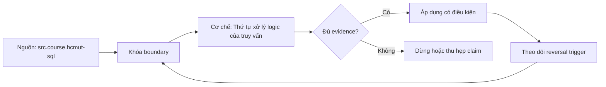

# Thứ tự xử lý logic của truy vấn

> [!abstract] Câu hỏi trung tâm
> Vì sao alias có chỗ dùng được chỗ không, WHERE khác HAVING, window result chưa tồn tại khi lọc, và tại sao tất cả điều đó không nói engine thật sự scan/join theo thứ tự nào?

## 1. Ba thứ tự phải tách

Thứ tự cú pháp là cách SQL được viết: SELECT, FROM, WHERE, GROUP BY, HAVING, ORDER BY, LIMIT. Thứ tự logic mô tả virtual table biến đổi về nghĩa. Thứ tự vật lý là plan optimizer chọn. Nhầm ba tầng tạo hai lỗi: giải thích syntax/name scope bằng plan, hoặc ép performance bằng đổi vị trí chữ.

Mô hình logic thực dụng: FROM/JOIN → WHERE → GROUP BY/aggregate → HAVING → window processing → SELECT projection → DISTINCT → set operations theo cấu trúc → ORDER BY → LIMIT/OFFSET. Chi tiết chuẩn/DBMS có ngoại lệ; dùng PostgreSQL 17 làm target của bài.

## 2. FROM và JOIN tạo input relation

FROM resolve table/subquery/CTE/lateral references, aliases và joins. Nhiều table reference comma tạo cross product rồi filter theo conditions. JOIN ON quyết định match trước outer-row preservation. Alias table sau khi đặt sẽ che original table name trong scope PostgreSQL.

Self-join cần aliases phân biệt roles. Column không qualified mà xuất hiện ở nhiều sources gây ambiguity. Qualify theo alias để contract đọc được và không vỡ khi thêm column cùng tên.

## 3. ON và WHERE không hoán đổi tự do

Với inner join, một số predicate có thể chuyển giữa ON và WHERE mà giữ result, dù plan có thể giống. Với left join, predicate right-side trong ON giới hạn rows được match nhưng vẫn giữ left rows; predicate trong WHERE chạy trên joined rows và loại null-extended rows nếu không TRUE.

```sql
LEFT JOIN payment p ON p.order_id=o.id AND p.status='paid'
```

trả mọi order. Đưa `p.status='paid'` xuống WHERE chỉ trả order có paid match. Đây là semantic difference, không phải style.

## 4. WHERE lọc rows trước grouping

WHERE nhận từng row của table expression và chỉ giữ TRUE. Aggregate chưa tồn tại ở đây; select-list alias cũng chưa phải output name. Filter sớm đúng nghĩa giảm input cho grouping. Điều kiện trên raw date/status/customer thuộc WHERE.

NULL predicate có thể UNKNOWN và bị loại. `WHERE amount <> 0` khác giữ NULL. Không giải thích missing row chỉ bằng processing order; kết hợp three-valued logic.

## 5. GROUP BY tạo groups

GROUP BY phân chia rows theo grouping expressions. Sau grouping, mỗi output group chỉ được tham chiếu grouping keys hoặc aggregate của rows, trừ functional-dependency relaxations DBMS hỗ trợ trong phạm vi cụ thể. Chọn non-grouped arbitrary column không phải SQL portable.

Không group để xóa duplicate nếu grain sai. Xác định desired grain và measure trước. NULL grouping keys thường vào một group theo SQL grouping rule.

## 6. Aggregate được tính trên group

`COUNT(*)` đếm rows, `COUNT(x)` bỏ NULL, SUM/AVG có NULL semantics. Join multiplication xảy ra trước aggregate, nên SUM sau join có thể bị phóng đại. Logical order giải thích vì sao cần pre-aggregate fact ở đúng grain trước khi join.

Aggregate filter `FILTER (WHERE ...)` trong PostgreSQL áp cho input của aggregate cụ thể; khác WHERE loại row khỏi mọi aggregates. Đây là công cụ biểu đạt nhiều measure condition trong cùng group.

## 7. HAVING lọc groups

HAVING chạy sau grouping/aggregate và dùng condition trên group. `HAVING order_date >= ...` khi order_date không group/aggregate thường sai scope hoặc sai nghĩa. Predicate chỉ phụ thuộc grouping key có thể được optimizer push nhưng người viết vẫn đặt theo semantics.

WHERE và HAVING có thể cho cùng result trong trường hợp đặc biệt, không có nghĩa thay nhau. Test hai dataset gồm group có mixed rows để thấy khác biệt.

## 8. Window processing

Window functions tính trên virtual table sau WHERE/GROUP BY/HAVING, nhưng không collapse rows như GROUP BY. Partition/order/frame quyết định window. Vì window result chưa tồn tại ở WHERE và thường không dùng trực tiếp để filter cùng query level; dùng subquery/CTE rồi WHERE bên ngoài.

```sql
SELECT * FROM (
  SELECT t.*, row_number() OVER (PARTITION BY key ORDER BY ts DESC, id DESC) rn
  FROM t
) s WHERE rn=1;
```

Tie-breaker cần deterministic. Không nhầm window ORDER BY với final output ORDER BY.

## 9. SELECT và alias

SELECT tính output expressions/projection. Alias output vì vậy không khả dụng trong WHERE cùng level theo logical model. PostgreSQL cho ORDER BY tham chiếu output alias, nhưng GROUP BY/ORDER BY ambiguity rules có chi tiết riêng; tránh đặt alias trùng input column.

Nếu cần tái dùng expression phức tạp ở filter, đặt vào subquery/CTE/lateral hoặc generated expression phù hợp. Copy-paste có nguy cơ drift.

## 10. DISTINCT

DISTINCT áp sau select expressions để loại output duplicates. Nó không sửa join grain hoặc aggregate sai; nó chỉ nhìn output columns. `DISTINCT ON` là PostgreSQL-specific và cần ORDER BY tương thích để chọn row có chủ đích. Không có deterministic order thì row được giữ không phải contract ổn định.

## 11. ORDER BY

ORDER BY sắp output và có thể dùng alias/ordinal trong PostgreSQL. Ordinal như `ORDER BY 2` dễ vỡ khi đổi select list; dùng tên/expression rõ. Không ORDER BY thì output order không được bảo đảm dù plan hiện tại trông ổn.

Sorting NULL cần `NULLS FIRST/LAST` khi contract yêu cầu. Collation ảnh hưởng text ordering. ORDER BY trong subquery không tự bảo đảm final order trừ semantics operator cần và outer query giữ.

## 12. LIMIT/OFFSET

LIMIT chạy logic sau ordering. Không ORDER BY tạo subset không xác định. OFFSET pagination có thể chậm và trùng/sót dưới concurrent changes; keyset pagination dùng stable total order và cursor predicate. LIMIT cũng ảnh hưởng planner physical choice nhưng không đổi logical placement.

## 13. CTE và subquery là query levels

Mỗi query level có scope/order riêng. CTE cung cấp name cho relation; optimization materialization behavior phụ thuộc version/hints/recursion, không được gọi CTE luôn là optimization fence. Dùng query level mới để biến window/alias thành input column ở outer level.

Correlated subquery thấy outer names theo scope, có thể tạo semantic và performance complexity. Qualify names tránh accidental correlation khi schema thêm column.

## 14. Logical order không phải physical plan

Optimizer có thể push predicates, reorder inner joins, prune columns và decorrelate nếu equivalence giữ. Nó không cần thực hiện full Cartesian product vật lý chỉ vì conceptual join có thể được giải thích như product + filter. `EXPLAIN` cho physical evidence; logical order giải thích semantics.

Không nói WHERE luôn chạy trước JOIN trên máy. Đúng hơn: WHERE thuộc logical transformation sau FROM table expression, nhưng optimizer có thể push safe predicate vào scan/join.

## 15. Tám lỗi chẩn đoán

1. alias SELECT trong WHERE;
2. aggregate trong WHERE;
3. row predicate đặt HAVING;
4. group predicate đặt WHERE;
5. window function trong WHERE;
6. ambiguous unqualified column;
7. LEFT JOIN right predicate đặt WHERE;
8. LIMIT không ORDER BY.

Với mỗi lỗi, ghi query level, bước tạo name/value, bước đang dùng, bản sửa và result difference. Bốn lỗi syntax và bốn lỗi chạy nhưng sai nghĩa cần tách.

## 15.1. Walkthrough một truy vấn nhiều tầng

Yêu cầu: với mọi customer, lấy doanh thu paid trong năm, xếp hạng trong region và giữ top 3. Query level trong cùng dùng FROM customer LEFT JOIN orders với paid/date predicates trong ON nếu vẫn muốn customer zero revenue. GROUP BY customer/region tạo một row mỗi customer; `COALESCE(SUM(...),0)` chỉ lúc output nếu zero đúng nghĩa. Query level kế tính `dense_rank()` partition region order revenue desc, customer_id để ổn định. Query level ngoài lọc rank <= 3 và ORDER BY final.

Nếu đặt paid predicate ở WHERE, customer không order biến mất. Nếu lọc SUM ở WHERE, syntax sai vì aggregate chưa tồn tại. Nếu lọc rank cùng level, window chưa tồn tại. Nếu dùng LIMIT 3, chỉ lấy ba customer toàn cục, không phải mỗi region. Walkthrough buộc mỗi requirement vào đúng logical stage.

Khi joins nhân lines/payments, aggregate result sai trước khi window. Processing order giúp định vị nhưng không tự sửa grain; pre-aggregate child relation ở query level riêng. Name scope đúng nhưng grain sai vẫn trả số sai.

## 15.2. Debug protocol

Rút query thành từng virtual table: chạy FROM/JOIN với keys, thêm WHERE, kiểm group input, group/aggregate, HAVING, window, projection/order/limit. Tại mỗi boundary ghi grain, row count và sample adversarial IDs. Không coi intermediate execution là physical order; đây là kỹ thuật kiểm semantics.

Với lỗi alias, hỏi name được tạo ở query level nào. Với missing rows, kiểm ON/WHERE và UNKNOWN. Với aggregate sai, kiểm fanout và denominator. Với unstable top-N, kiểm total order/ties. Protocol tạo lời giải thích tái hiện được thay vì thử đổi câu SQL ngẫu nhiên.

## 16. Câu hỏi tự kiểm tra

1. Vì sao select alias thường không dùng trong WHERE nhưng dùng ở ORDER BY?
2. WHERE và HAVING lọc đơn vị nào?
3. Window result muốn lọc cần query level mới ra sao?
4. ON và WHERE khác nhau thế nào với LEFT JOIN?
5. Không ORDER BY thì LIMIT có contract gì?
6. Predicate pushdown có mâu thuẫn logical order không?

## 17. Giới hạn và điều chưa cho phép kết luận

- Thứ tự trình bày là model PostgreSQL 17 thực dụng, không thay SQL standard formal text.
- Logical order không dự đoán physical scan/join order hoặc performance.
- Alias/name-resolution có DBMS-specific differences.
- Query result đúng trên một dataset không chứng minh điều kiện đặt đúng grain.

## Reference
1. [[SRC-HCMUT-SQL]]: PDF 29-32, 69-79.
2. [[SRC-POSTGRESQL-17-QUERY-EXPRESSIONS]]: table expression pipeline và SELECT.
3. [[SRC-HCMUT-RELATIONAL-ALGEBRA]]: logical expression foundation.

## Source coverage

| Source slice | Nội dung phải giữ | Vị trí trong note | Trạng thái |
|---|---|---|---|
| [[SRC-HCMUT-SQL]], PDF 29-32, 69-79 | SELECT, WHERE, GROUP, HAVING, ORDER | §§2-11 | Đã trình bày theo query levels |
| [[SRC-POSTGRESQL-17-QUERY-EXPRESSIONS]] | pipeline, join/alias/window semantics | §§2-14 | Đã giữ PostgreSQL scope |
| [[SRC-HCMUT-RELATIONAL-ALGEBRA]] | logical expression versus implementation | §§1, 14 | Đã nối nhưng không đồng nhất physical plan |
| Tổng hợp DE-L118 | eight-query diagnostic | §15 | Đã ghi thành acceptance evidence |

## Key takeaways
- Tách thứ tự cú pháp, logic và vật lý.
- WHERE lọc rows; HAVING lọc groups; window cần query level mới để filter.
- Alias chỉ tồn tại theo name scope của bước/query level.
- Predicate right-side trong WHERE có thể phá LEFT JOIN preservation.
- Optimizer được rewrite nhưng chỉ khi giữ semantics.

<!-- ATOMIC-EXECUTION-CAPSULE:START -->

## Execution capsule: kiểm chứng `wiki.database.logical-query-processing-order`

> [!important] Phân loại mệnh đề
> Với `wiki.database.logical-query-processing-order`, sơ đồ, ví dụ và artifact về **Thứ tự xử lý logic của truy vấn** là **synthesis để kiểm chứng**; chúng không phải trích dẫn hay case nguyên văn của nguồn.

### Sơ đồ cơ chế và điểm kiểm soát



Đọc sơ đồ `wiki.database.logical-query-processing-order` từ trái sang phải: source chỉ cung cấp claim ban đầu cho **Thứ tự xử lý logic của truy vấn**; quyết định chỉ được đi tiếp sau khi boundary, evidence và điều kiện đảo quyết định đã hiện hữu.

### Ví dụ làm việc có thể bác bỏ

**Input.** Một đội cần trả lời: Thứ tự xử lý logic của SELECT giải thích name scope, WHERE/HAVING, aggregate và window errors thế nào mà không bị nhầm với physical execution plan? cho một phạm vi nhỏ, có owner và deadline rõ.

**Decision.** Đội áp dụng **Thứ tự xử lý logic của truy vấn** trên control và variant chỉ khác một assumption; expected result và hard constraints được khóa trước khi chạy.

**Outcome.** Với `wiki.database.logical-query-processing-order`, nếu observation vi phạm hard constraint hoặc oracle độc lập không xác nhận **Thứ tự xử lý logic của truy vấn**, đội thu hẹp claim hay đảo quyết định. Nếu đạt, kết luận vẫn kèm scope, version và review date; một lần thành công không được nâng thành quy luật phổ quát.

### Tự kiểm tra trước khi tái sử dụng

1. Bạn có thể trả lời `Thứ tự xử lý logic của SELECT giải thích name scope, WHERE/HAVING, aggregate và window errors thế nào mà không bị nhầm với physical execution plan?` bằng một câu mà không kéo thêm concept thứ hai không?
2. Source locator nào đỡ cho claim, và phần nào chỉ là synthesis trong note?
3. Observation nào khiến bạn dừng, thu hẹp hoặc đảo quyết định?
4. Artifact nào cho phép một reviewer độc lập tái hiện kết quả?

<!-- ATOMIC-EXECUTION-CAPSULE:END -->
