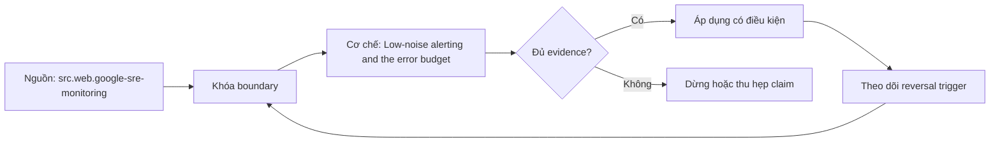

# Low-noise alerting and the error budget

> [!abstract] Câu hỏi trung tâm
> Alert và error budget được nối với hành động thế nào để giảm noise nhưng không che user harm?

## 1. Page criteria

Page chỉ khi cần hành động khẩn cấp để giảm harm; ticket và dashboard dành cho công việc không tức thời. Đừng bắt đầu bằng tên công cụ. Hãy bắt đầu bằng đối tượng được bảo vệ, boundary quan sát được và hậu quả nếu kết luận sai. Trong bài `Low-noise alerting and the error budget`, câu hỏi thực dụng là: Alert và error budget được nối với hành động thế nào để giảm noise nhưng không che user harm? Ta ghi rõ grain, population, time window, owner và hành động sau failure; nếu một trường chưa biết thì đánh dấu unknown thay vì lấp bằng mặc định. Bằng chứng tối thiểu gồm fixture có version, cấu hình hoặc rule đã resolve, raw observation, expected result và limitation. Phần này là curriculum synthesis dựa trên các nguồn đã định danh, không phải lời hứa rằng mọi adapter hay deployment đều có cùng hành vi.

## 2. Budget math

Error budget bằng phần không đạt SLO trên đúng eligible population/window, không phải số alert. Điểm khó không nằm ở cú pháp mà ở identity và scope. Hai phép đo cùng tên vẫn có thể nói về hai population hoặc hai thời điểm khác nhau. Trong bài `Low-noise alerting and the error budget`, câu hỏi thực dụng là: Alert và error budget được nối với hành động thế nào để giảm noise nhưng không che user harm? Ta ghi rõ grain, population, time window, owner và hành động sau failure; nếu một trường chưa biết thì đánh dấu unknown thay vì lấp bằng mặc định. Bằng chứng tối thiểu gồm fixture có version, cấu hình hoặc rule đã resolve, raw observation, expected result và limitation. Phần này là curriculum synthesis dựa trên các nguồn đã định danh, không phải lời hứa rằng mọi adapter hay deployment đều có cùng hành vi.

## 3. Burn-rate view

Fast burn bắt sự cố lớn sớm; slow burn phát hiện suy giảm kéo dài, cả hai cần minimum traffic. Một dashboard xanh chỉ là tín hiệu. Muốn biến nó thành bằng chứng phải giữ input, phiên bản, rule, trạng thái trước–sau và cách tính độc lập. Trong bài `Low-noise alerting and the error budget`, câu hỏi thực dụng là: Alert và error budget được nối với hành động thế nào để giảm noise nhưng không che user harm? Ta ghi rõ grain, population, time window, owner và hành động sau failure; nếu một trường chưa biết thì đánh dấu unknown thay vì lấp bằng mặc định. Bằng chứng tối thiểu gồm fixture có version, cấu hình hoặc rule đã resolve, raw observation, expected result và limitation. Phần này là curriculum synthesis dựa trên các nguồn đã định danh, không phải lời hứa rằng mọi adapter hay deployment đều có cùng hành vi.

## 4. Dedup and routing

Group theo incident/failure domain, route tới owner có runbook; suppress phải có expiry và audit. Thiết kế tốt phải chịu được counterexample. Hãy chủ động tạo case sát boundary, case thiếu dữ liệu và case replay thay vì chỉ chạy happy path. Trong bài `Low-noise alerting and the error budget`, câu hỏi thực dụng là: Alert và error budget được nối với hành động thế nào để giảm noise nhưng không che user harm? Ta ghi rõ grain, population, time window, owner và hành động sau failure; nếu một trường chưa biết thì đánh dấu unknown thay vì lấp bằng mặc định. Bằng chứng tối thiểu gồm fixture có version, cấu hình hoặc rule đã resolve, raw observation, expected result và limitation. Phần này là curriculum synthesis dựa trên các nguồn đã định danh, không phải lời hứa rằng mọi adapter hay deployment đều có cùng hành vi.

## 5. Policy action

Budget state phải kích hoạt hành động đã thỏa thuận như freeze, reliability work hay review, không dùng để phạt. Chi phí vận hành thuộc contract. Một rule đúng nhưng quá đắt, quá ồn hoặc không có owner sẽ nhanh chóng bị tắt và mất tác dụng. Trong bài `Low-noise alerting and the error budget`, câu hỏi thực dụng là: Alert và error budget được nối với hành động thế nào để giảm noise nhưng không che user harm? Ta ghi rõ grain, population, time window, owner và hành động sau failure; nếu một trường chưa biết thì đánh dấu unknown thay vì lấp bằng mặc định. Bằng chứng tối thiểu gồm fixture có version, cấu hình hoặc rule đã resolve, raw observation, expected result và limitation. Phần này là curriculum synthesis dựa trên các nguồn đã định danh, không phải lời hứa rằng mọi adapter hay deployment đều có cùng hành vi.

## 6. Noise evaluation

Đo actionable rate, duplicates, acknowledged-without-action, missed incidents và operator load theo thời gian. Kết luận cần có điều kiện đảo chiều. Khi volume, latency, nguồn thẩm quyền hoặc topology đổi, quyết định cũ phải được xem xét lại bằng cùng một oracle. Trong bài `Low-noise alerting and the error budget`, câu hỏi thực dụng là: Alert và error budget được nối với hành động thế nào để giảm noise nhưng không che user harm? Ta ghi rõ grain, population, time window, owner và hành động sau failure; nếu một trường chưa biết thì đánh dấu unknown thay vì lấp bằng mặc định. Bằng chứng tối thiểu gồm fixture có version, cấu hình hoặc rule đã resolve, raw observation, expected result và limitation. Phần này là curriculum synthesis dựa trên các nguồn đã định danh, không phải lời hứa rằng mọi adapter hay deployment đều có cùng hành vi.

## 7. Ma trận kiểm chứng từng mệnh đề

Với `wiki.data-quality.alerting-error-budget`, command thành công không tự chứng minh dữ liệu đúng. Protocol riêng của bài là: Replay một cửa sổ có good/bad events hoặc incident state, tính lại metric độc lập và kiểm action/routing đúng policy. Mỗi probe dưới đây phải nối input boundary với failure signal và oracle có thể phản bác kết luận.

### 7.1. Low-noise alerting and the error budget: kiểm `Page criteria` bằng case 1, cụ thể page chỉ khi cần hành động khẩn cấp để giảm harm; ticket và dashboard dành cho công việc không tức thời

**Mệnh đề cần kiểm.** Low-noise alerting and the error budget: kiểm `Page criteria` bằng case 1, cụ thể page chỉ khi cần hành động khẩn cấp để giảm harm; ticket và dashboard dành cho công việc không tức thời.

**Thiết kế phép thử cho `wiki.data-quality.alerting-error-budget`.** Trong ngữ cảnh `wiki.data-quality.alerting-error-budget`, tạo positive control và negative control chỉ khác đúng một điều kiện. Khóa input snapshot, phiên bản và owner của rule; chạy đúng population được bài `Low-noise alerting and the error budget` công bố.

**Bằng chứng cần giữ.** Đối với probe 1 của `Low-noise alerting and the error budget`, giữ fixture, raw failing rows và lệnh tái hiện. Nếu chưa chạy lab, ghi expected evidence và giữ trạng thái review; không biến protocol thành observation.

### 7.2. Low-noise alerting and the error budget: kiểm `Budget math` bằng case 2, cụ thể error budget bằng phần không đạt slo trên đúng eligible population/window, không phải số alert

**Mệnh đề cần kiểm.** Low-noise alerting and the error budget: kiểm `Budget math` bằng case 2, cụ thể error budget bằng phần không đạt slo trên đúng eligible population/window, không phải số alert.

**Thiết kế phép thử cho `wiki.data-quality.alerting-error-budget`.** Trong ngữ cảnh `wiki.data-quality.alerting-error-budget`, đổi grain nhưng giữ tổng số dòng để lộ phép đo sai cấp. Khóa input snapshot, phiên bản và owner của rule; chạy đúng population được bài `Low-noise alerting and the error budget` công bố.

**Bằng chứng cần giữ.** Đối với probe 2 của `Low-noise alerting and the error budget`, báo numerator, denominator và key set ở cả hai grain. Nếu chưa chạy lab, ghi expected evidence và giữ trạng thái review; không biến protocol thành observation.

### 7.3. Low-noise alerting and the error budget: kiểm `Burn-rate view` bằng case 3, cụ thể fast burn bắt sự cố lớn sớm; slow burn phát hiện suy giảm kéo dài, cả hai cần minimum traffic

**Mệnh đề cần kiểm.** Low-noise alerting and the error budget: kiểm `Burn-rate view` bằng case 3, cụ thể fast burn bắt sự cố lớn sớm; slow burn phát hiện suy giảm kéo dài, cả hai cần minimum traffic.

**Thiết kế phép thử cho `wiki.data-quality.alerting-error-budget`.** Trong ngữ cảnh `wiki.data-quality.alerting-error-budget`, đưa một giá trị tới đúng boundary và một giá trị vượt boundary. Khóa input snapshot, phiên bản và owner của rule; chạy đúng population được bài `Low-noise alerting and the error budget` công bố.

**Bằng chứng cần giữ.** Đối với probe 3 của `Low-noise alerting and the error budget`, lưu hai observed values cùng rule đã resolve. Nếu chưa chạy lab, ghi expected evidence và giữ trạng thái review; không biến protocol thành observation.

### 7.4. Low-noise alerting and the error budget: kiểm `Dedup and routing` bằng case 4, cụ thể group theo incident/failure domain, route tới owner có runbook; suppress phải có expiry và audit

**Mệnh đề cần kiểm.** Low-noise alerting and the error budget: kiểm `Dedup and routing` bằng case 4, cụ thể group theo incident/failure domain, route tới owner có runbook; suppress phải có expiry và audit.

**Thiết kế phép thử cho `wiki.data-quality.alerting-error-budget`.** Trong ngữ cảnh `wiki.data-quality.alerting-error-budget`, kill tiến trình ngay trước rồi ngay sau durable side effect. Khóa input snapshot, phiên bản và owner của rule; chạy đúng population được bài `Low-noise alerting and the error budget` công bố.

**Bằng chứng cần giữ.** Đối với probe 4 của `Low-noise alerting and the error budget`, lưu checkpoint, external ledger và trạng thái sau restart. Nếu chưa chạy lab, ghi expected evidence và giữ trạng thái review; không biến protocol thành observation.

### 7.5. Low-noise alerting and the error budget: kiểm `Policy action` bằng case 5, cụ thể budget state phải kích hoạt hành động đã thỏa thuận như freeze, reliability work hay review, không dùng để phạt

**Mệnh đề cần kiểm.** Low-noise alerting and the error budget: kiểm `Policy action` bằng case 5, cụ thể budget state phải kích hoạt hành động đã thỏa thuận như freeze, reliability work hay review, không dùng để phạt.

**Thiết kế phép thử cho `wiki.data-quality.alerting-error-budget`.** Trong ngữ cảnh `wiki.data-quality.alerting-error-budget`, đảo thứ tự input và concurrency nhưng giữ logical population. Khóa input snapshot, phiên bản và owner của rule; chạy đúng population được bài `Low-noise alerting and the error budget` công bố.

**Bằng chứng cần giữ.** Đối với probe 5 của `Low-noise alerting and the error budget`, so canonical hash và business totals giữa các thứ tự. Nếu chưa chạy lab, ghi expected evidence và giữ trạng thái review; không biến protocol thành observation.

### 7.6. Low-noise alerting and the error budget: kiểm `Noise evaluation` bằng case 6, cụ thể đo actionable rate, duplicates, acknowledged-without-action, missed incidents và operator load theo thời gian

**Mệnh đề cần kiểm.** Low-noise alerting and the error budget: kiểm `Noise evaluation` bằng case 6, cụ thể đo actionable rate, duplicates, acknowledged-without-action, missed incidents và operator load theo thời gian.

**Thiết kế phép thử cho `wiki.data-quality.alerting-error-budget`.** Trong ngữ cảnh `wiki.data-quality.alerting-error-budget`, replay cùng identity với payload giống rồi payload xung đột. Khóa input snapshot, phiên bản và owner của rule; chạy đúng population được bài `Low-noise alerting and the error budget` công bố.

**Bằng chứng cần giữ.** Đối với probe 6 của `Low-noise alerting and the error budget`, tách duplicate replay khỏi identity collision bằng reason code. Nếu chưa chạy lab, ghi expected evidence và giữ trạng thái review; không biến protocol thành observation.

### 7.7. Low-noise alerting and the error budget: kiểm `Page criteria` bằng case 7, cụ thể page chỉ khi cần hành động khẩn cấp để giảm harm; ticket và dashboard dành cho công việc không tức thời

**Mệnh đề cần kiểm.** Low-noise alerting and the error budget: kiểm `Page criteria` bằng case 7, cụ thể page chỉ khi cần hành động khẩn cấp để giảm harm; ticket và dashboard dành cho công việc không tức thời.

**Thiết kế phép thử cho `wiki.data-quality.alerting-error-budget`.** Trong ngữ cảnh `wiki.data-quality.alerting-error-budget`, thêm record tới trễ trong horizon và ngoài horizon. Khóa input snapshot, phiên bản và owner của rule; chạy đúng population được bài `Low-noise alerting and the error budget` công bố.

**Bằng chứng cần giữ.** Đối với probe 7 của `Low-noise alerting and the error budget`, báo accepted-late, rejected-late và oldest outstanding timestamp. Nếu chưa chạy lab, ghi expected evidence và giữ trạng thái review; không biến protocol thành observation.

### 7.8. Low-noise alerting and the error budget: kiểm `Budget math` bằng case 8, cụ thể error budget bằng phần không đạt slo trên đúng eligible population/window, không phải số alert

**Mệnh đề cần kiểm.** Low-noise alerting and the error budget: kiểm `Budget math` bằng case 8, cụ thể error budget bằng phần không đạt slo trên đúng eligible population/window, không phải số alert.

**Thiết kế phép thử cho `wiki.data-quality.alerting-error-budget`.** Trong ngữ cảnh `wiki.data-quality.alerting-error-budget`, đổi schema theo một cách tương thích rồi một cách phá vỡ semantics. Khóa input snapshot, phiên bản và owner của rule; chạy đúng population được bài `Low-noise alerting and the error budget` công bố.

**Bằng chứng cần giữ.** Đối với probe 8 của `Low-noise alerting and the error budget`, giữ schema diff, classification và consumer-visible result. Nếu chưa chạy lab, ghi expected evidence và giữ trạng thái review; không biến protocol thành observation.

### 7.9. Low-noise alerting and the error budget: kiểm `Burn-rate view` bằng case 9, cụ thể fast burn bắt sự cố lớn sớm; slow burn phát hiện suy giảm kéo dài, cả hai cần minimum traffic

**Mệnh đề cần kiểm.** Low-noise alerting and the error budget: kiểm `Burn-rate view` bằng case 9, cụ thể fast burn bắt sự cố lớn sớm; slow burn phát hiện suy giảm kéo dài, cả hai cần minimum traffic.

**Thiết kế phép thử cho `wiki.data-quality.alerting-error-budget`.** Trong ngữ cảnh `wiki.data-quality.alerting-error-budget`, tạo missing và duplicate bù nhau để count tổng không đổi. Khóa input snapshot, phiên bản và owner của rule; chạy đúng population được bài `Low-noise alerting and the error budget` công bố.

**Bằng chứng cần giữ.** Đối với probe 9 của `Low-noise alerting and the error budget`, so key multiset và typed hashes thay vì chỉ row count. Nếu chưa chạy lab, ghi expected evidence và giữ trạng thái review; không biến protocol thành observation.

### 7.10. Low-noise alerting and the error budget: kiểm `Dedup and routing` bằng case 10, cụ thể group theo incident/failure domain, route tới owner có runbook; suppress phải có expiry và audit

**Mệnh đề cần kiểm.** Low-noise alerting and the error budget: kiểm `Dedup and routing` bằng case 10, cụ thể group theo incident/failure domain, route tới owner có runbook; suppress phải có expiry và audit.

**Thiết kế phép thử cho `wiki.data-quality.alerting-error-budget`.** Trong ngữ cảnh `wiki.data-quality.alerting-error-budget`, cho reviewer tái hiện chỉ từ evidence package. Khóa input snapshot, phiên bản và owner của rule; chạy đúng population được bài `Low-noise alerting and the error budget` công bố.

**Bằng chứng cần giữ.** Đối với probe 10 của `Low-noise alerting and the error budget`, package phải đủ để người khác dựng lại decision và limitation. Nếu chưa chạy lab, ghi expected evidence và giữ trạng thái review; không biến protocol thành observation.

### 7.11. Low-noise alerting and the error budget: kiểm `Policy action` bằng case 11, cụ thể budget state phải kích hoạt hành động đã thỏa thuận như freeze, reliability work hay review, không dùng để phạt

**Mệnh đề cần kiểm.** Low-noise alerting and the error budget: kiểm `Policy action` bằng case 11, cụ thể budget state phải kích hoạt hành động đã thỏa thuận như freeze, reliability work hay review, không dùng để phạt.

**Thiết kế phép thử cho `wiki.data-quality.alerting-error-budget`.** Trong ngữ cảnh `wiki.data-quality.alerting-error-budget`, so với oracle độc lập không dùng chung query hoặc parser. Khóa input snapshot, phiên bản và owner của rule; chạy đúng population được bài `Low-noise alerting and the error budget` công bố.

**Bằng chứng cần giữ.** Đối với probe 11 của `Low-noise alerting and the error budget`, independent result phải khớp ở grain đã công bố. Nếu chưa chạy lab, ghi expected evidence và giữ trạng thái review; không biến protocol thành observation.

### 7.12. Low-noise alerting and the error budget: kiểm `Noise evaluation` bằng case 12, cụ thể đo actionable rate, duplicates, acknowledged-without-action, missed incidents và operator load theo thời gian

**Mệnh đề cần kiểm.** Low-noise alerting and the error budget: kiểm `Noise evaluation` bằng case 12, cụ thể đo actionable rate, duplicates, acknowledged-without-action, missed incidents và operator load theo thời gian.

**Thiết kế phép thử cho `wiki.data-quality.alerting-error-budget`.** Trong ngữ cảnh `wiki.data-quality.alerting-error-budget`, chạy scope hẹp và population đầy đủ rồi công bố phần bị loại. Khóa input snapshot, phiên bản và owner của rule; chạy đúng population được bài `Low-noise alerting and the error budget` công bố.

**Bằng chứng cần giữ.** Đối với probe 12 của `Low-noise alerting and the error budget`, coverage phải nêu rõ excluded nodes, partitions hoặc incidents. Nếu chưa chạy lab, ghi expected evidence và giữ trạng thái review; không biến protocol thành observation.

### 7.13. Low-noise alerting and the error budget: kiểm `Page criteria` bằng case 13, cụ thể page chỉ khi cần hành động khẩn cấp để giảm harm; ticket và dashboard dành cho công việc không tức thời

**Mệnh đề cần kiểm.** Low-noise alerting and the error budget: kiểm `Page criteria` bằng case 13, cụ thể page chỉ khi cần hành động khẩn cấp để giảm harm; ticket và dashboard dành cho công việc không tức thời.

**Thiết kế phép thử cho `wiki.data-quality.alerting-error-budget`.** Trong ngữ cảnh `wiki.data-quality.alerting-error-budget`, thử timezone, precision hoặc partition ở hai phía của ranh giới. Khóa input snapshot, phiên bản và owner của rule; chạy đúng population được bài `Low-noise alerting and the error budget` công bố.

**Bằng chứng cần giữ.** Đối với probe 13 của `Low-noise alerting and the error budget`, UTC/local interval và rounding policy phải hiện trong output. Nếu chưa chạy lab, ghi expected evidence và giữ trạng thái review; không biến protocol thành observation.

### 7.14. Low-noise alerting and the error budget: kiểm `Budget math` bằng case 14, cụ thể error budget bằng phần không đạt slo trên đúng eligible population/window, không phải số alert

**Mệnh đề cần kiểm.** Low-noise alerting and the error budget: kiểm `Budget math` bằng case 14, cụ thể error budget bằng phần không đạt slo trên đúng eligible population/window, không phải số alert.

**Thiết kế phép thử cho `wiki.data-quality.alerting-error-budget`.** Trong ngữ cảnh `wiki.data-quality.alerting-error-budget`, đổi constraint đủ lớn để quyết định phải đảo. Khóa input snapshot, phiên bản và owner của rule; chạy đúng population được bài `Low-noise alerting and the error budget` công bố.

**Bằng chứng cần giữ.** Đối với probe 14 của `Low-noise alerting and the error budget`, ADR phải lưu changed constraint và reversal threshold. Nếu chưa chạy lab, ghi expected evidence và giữ trạng thái review; không biến protocol thành observation.

### 7.15. Low-noise alerting and the error budget: kiểm `Burn-rate view` bằng case 15, cụ thể fast burn bắt sự cố lớn sớm; slow burn phát hiện suy giảm kéo dài, cả hai cần minimum traffic

**Mệnh đề cần kiểm.** Low-noise alerting and the error budget: kiểm `Burn-rate view` bằng case 15, cụ thể fast burn bắt sự cố lớn sớm; slow burn phát hiện suy giảm kéo dài, cả hai cần minimum traffic.

**Thiết kế phép thử cho `wiki.data-quality.alerting-error-budget`.** Trong ngữ cảnh `wiki.data-quality.alerting-error-budget`, chạy lại từ môi trường sạch với versions và seed đã khóa. Khóa input snapshot, phiên bản và owner của rule; chạy đúng population được bài `Low-noise alerting and the error budget` công bố.

**Bằng chứng cần giữ.** Đối với probe 15 của `Low-noise alerting and the error budget`, canonical result phải ổn định hoặc mọi nondeterminism phải được giải thích. Nếu chưa chạy lab, ghi expected evidence và giữ trạng thái review; không biến protocol thành observation.

## 8. Quy trình phản biện

1. Viết consumer-visible invariant cho `Low-noise alerting and the error budget` trước khi chọn query hoặc tool.
2. Khóa grain, identity, population, time window và authoritative source.
3. Phân biệt declared configuration, executed state và published state.
4. Chạy negative control, replay hoặc changed-assumption case phù hợp.
5. Đối soát bằng oracle độc lập; công bố coverage và phần không quan sát được.
6. Gắn owner, hành động, reversal trigger và hạn review cho kết luận.

## 9. Câu hỏi tự kiểm tra

1. `Low-noise alerting and the error budget: kiểm `Page criteria` bằng case 1, cụ thể page chỉ khi cần hành động khẩn cấp để giảm harm; ticket và dashboard dành cho công việc không tức thời` thất bại đầu tiên ở boundary nào?
2. Artifact nào mạnh nhất để trả lời `Low-noise alerting and the error budget: kiểm `Burn-rate view` bằng case 3, cụ thể fast burn bắt sự cố lớn sớm; slow burn phát hiện suy giảm kéo dài, cả hai cần minimum traffic`?
3. Counterexample nhỏ nhất cho `Low-noise alerting and the error budget: kiểm `Noise evaluation` bằng case 6, cụ thể đo actionable rate, duplicates, acknowledged-without-action, missed incidents và operator load theo thời gian` gồm những state nào?
4. `Low-noise alerting and the error budget: kiểm `Burn-rate view` bằng case 9, cụ thể fast burn bắt sự cố lớn sớm; slow burn phát hiện suy giảm kéo dài, cả hai cần minimum traffic` có thể xanh giả ra sao?
5. Constraint nào khiến quyết định ở `Low-noise alerting and the error budget: kiểm `Budget math` bằng case 14, cụ thể error budget bằng phần không đạt slo trên đúng eligible population/window, không phải số alert` phải đảo?
6. Phần nào của `Low-noise alerting and the error budget: kiểm `Burn-rate view` bằng case 15, cụ thể fast burn bắt sự cố lớn sớm; slow burn phát hiện suy giảm kéo dài, cả hai cần minimum traffic` mới là protocol, chưa phải observation?

## 10. Giới hạn và điều chưa cho phép kết luận

- Lab của `Low-noise alerting and the error budget` chưa chạy trên hệ thống production; nội dung là giáo trình và expected evidence.
- Hành vi phụ thuộc phiên bản, connector, scheduler, warehouse và catalog configuration phải được kiểm lại.
- Các ma trận, ladder và threshold do giáo trình tổng hợp không được gán nguyên văn cho vendor.
- Note giữ trạng thái `review` cho tới khi owner duyệt semantics và learner artifact.

## Reference
1. [[SRC-GOOGLE-SRE-MONITORING]]
2. [[SRC-GOOGLE-SRE-ERROR-BUDGET-POLICY]]

## Source coverage

| Source slice | Nội dung sử dụng | Trạng thái |
|---|---|---|
| [[SRC-GOOGLE-SRE-MONITORING]] | Contract hoặc cơ chế liên quan trực tiếp tới `Low-noise alerting and the error budget` | Đã đọc locator; cần pin version khi chạy lab |
| [[SRC-GOOGLE-SRE-ERROR-BUDGET-POLICY]] | Contract hoặc cơ chế liên quan trực tiếp tới `Low-noise alerting and the error budget` | Đã đọc locator; cần pin version khi chạy lab |

## Key takeaways
- Alert là yêu cầu hành động; error budget là cơ chế quyết định theo SLO.
- Với `wiki.data-quality.alerting-error-budget`, quality của kết luận phụ thuộc identity, coverage và oracle chứ không phụ thuộc màu dashboard.
- Câu hỏi `Alert và error budget được nối với hành động thế nào để giảm noise nhưng không che user harm?` chỉ được trả lời trong scope và version đã ghi.
- Các source IDs `src.web.google-sre-monitoring, src.web.google-sre-error-budget-policy` đặt ranh giới cho source fact; phần còn lại là synthesis có nhãn.
- Trước khi lab chạy, đây là note đã kiểm cấu trúc và provenance, chưa phải chứng nhận production.

<!-- ATOMIC-EXECUTION-CAPSULE:START -->

## Execution capsule — kiểm chứng `wiki.data-quality.alerting-error-budget`

> [!important] Phân loại mệnh đề
> Với `wiki.data-quality.alerting-error-budget`, sơ đồ, ví dụ và artifact về **Low-noise alerting and the error budget** là **synthesis để kiểm chứng**; chúng không phải trích dẫn hay case nguyên văn của nguồn.

### Sơ đồ cơ chế và điểm kiểm soát



Đọc sơ đồ `wiki.data-quality.alerting-error-budget` từ trái sang phải: source chỉ cung cấp claim ban đầu cho **Low-noise alerting and the error budget**; quyết định chỉ được đi tiếp sau khi boundary, evidence và điều kiện đảo quyết định đã hiện hữu.

### Artifact thực thi tối thiểu

```sql
-- Verification harness for: Low-noise alerting and the error budget
WITH evidence AS (
    SELECT 'wiki.data-quality.alerting-error-budget' AS concept_id,
           'boundary_declared' AS check_name, 1 AS passed
    UNION ALL
    SELECT 'wiki.data-quality.alerting-error-budget', 'independent_oracle', 1
    UNION ALL
    SELECT 'wiki.data-quality.alerting-error-budget', 'reversal_trigger_recorded', 1
)
SELECT concept_id,
       MIN(passed) AS all_hard_checks_pass,
       COUNT(*) AS evidence_items
FROM evidence
GROUP BY concept_id
HAVING MIN(passed) = 1;
```

Artifact của `wiki.data-quality.alerting-error-budget` buộc người dùng ghi boundary, oracle và reversal trigger cho **Low-noise alerting and the error budget**. Các giá trị minh họa phải được thay bằng evidence thật trước khi dùng cho quyết định.

### Tự kiểm tra trước khi tái sử dụng

1. Bạn có thể trả lời `Alert và error budget được nối với hành động thế nào để giảm noise nhưng không che user harm?` bằng một câu mà không kéo thêm concept thứ hai không?
2. Source locator nào đỡ cho claim, và phần nào chỉ là synthesis trong note?
3. Observation nào khiến bạn dừng, thu hẹp hoặc đảo quyết định?
4. Artifact nào cho phép một reviewer độc lập tái hiện kết quả?

<!-- ATOMIC-EXECUTION-CAPSULE:END -->
