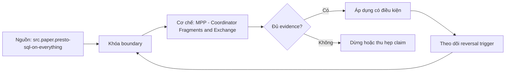

# MPP - Coordinator Fragments and Exchange

> [!abstract] Câu hỏi trung tâm
> Đọc distributed plan từ coordinator qua fragments/tasks/exchanges như thế nào để dự đoán network, skew, critical path và hiệu ứng tăng số worker?

## 1. Từ SQL tới work graph

Coordinator parse/analyze/optimize, tạo distributed plan, quản stage/task/split scheduling và thu trạng thái; workers scan qua connectors và chạy operators. Fragment/stage là subplan ngăn bởi exchange; mỗi stage có tasks trên một hoặc nhiều workers, mỗi task có drivers/operators. Tên khác nhau giữa engines nhưng graph cần đọc theo source splits, operator pipeline, distribution boundary và sink. Coordinator không nhất thiết xử lý data rows chính, nhưng planning, metadata, scheduling và final gather có thể thành bottleneck.

## 2. Exchange modes

Gather đưa partitions về một/few consumer, thường cho final aggregation/order/result. Repartition/hash gửi mỗi row theo key để cùng key gặp cùng worker cho join/group. Broadcast/replicate gửi build input tới mọi workers, tránh shuffle probe nhưng nhân bytes/memory. Round-robin/arbitrary cân rows khi không cần key. Local exchange chỉ rearrange giữa threads/tasks cùng node; remote exchange qua network hoặc spooled storage. Plan phải ghi input/output rows/bytes, partition keys, fanout và materialization/backpressure.

## 3. Exchange không phải network duy nhất

Roadmap nói exchange là chỗ duy nhất dữ liệu đi qua mạng; điều này sai với scans từ object storage/remote connectors, broadcast control/data, spill/exchange storage, result transfer và service traffic. Remote exchange thường là intermediate network boundary lớn và controllable, nên được soi đầu tiên nhưng không duy nhất. Tách source-read bytes, exchange bytes, spill bytes và output bytes. Network estimate trong EXPLAIN có thể là cost-model unit/estimate; runtime stage/task counters mới là observation.

## 4. Local/co-located join

Nếu both sides có compatible hash partitioning trên exact join keys, hash function/version, bucket count/mapping và data validity, engine có thể colocate join, giảm repartition. Partition pruning/storage layout không tự đồng nghĩa worker distribution. Small build có thể broadcast tốt hơn, nhưng phải fit memory trên mỗi worker sau filter. Partial aggregation trước exchange giảm rows/bytes nếu groups compress nhiều; high-cardinality groups có thể giảm ít. Dynamic filtering có thể prune probe nhưng đến trễ hoặc threshold-limited.

## 5. Skew và stragglers

Hash key hot/null/default làm một partition lớn; range partitions có uneven distribution; source splits/files cũng skew. Stage completion bị worker/task chậm nhất giữ critical path. Average rows/task che max/p99, CPU time, blocked time, peak memory, spill và output bytes. Salting, split hot keys, broadcast small side, two-phase aggregation hoặc better partition keys có trade-offs và correctness. Thêm nodes không sửa một hot partition nếu partitioning/granularity không đổi; có thể tăng scheduling/network overhead.

## 6. Strong scaling và weak scaling

Gấp đôi workers với fixed data/query là strong scaling; ideal half time chỉ khi parallel fraction lớn, đủ splits và overhead nhỏ. Serial/coordinator/final gather, exchange, skew, remote storage bandwidth và startup tạo Amdahl limit. Weak scaling tăng data cùng workers và hỏi time có giữ gần constant; Gustafson-style reasoning áp cho scaled problem, không chứng minh fixed job linear speedup. Báo speedup `T1/Tp`, efficiency `speedup/p`, cost/work và per-stage critical path. Một run nhanh hơn do cache/autoscaling không phải scaling proof.

## 7. Estimates và actuals

EXPLAIN cho fragment/distribution và estimated rows/bytes/cost; missing/stale stats làm chọn broadcast/repartition hoặc join order sai. EXPLAIN ANALYZE/UI cho actual input/output, tasks, CPU/scheduled/blocked time, memory, network/spill và skew tùy engine. Estimate-vs-actual ratio ở exchange input/build side quan trọng hơn total query only. Plan text có `RemoteExchange` chứng minh boundary, không chứng minh bytes là bottleneck. Capture query ID, engine/config, connector, cluster size và runtime JSON.

## 8. Lab ba layouts và node counts

Cùng query/data chạy: both sides colocated compatible; one/both sides mismatched cần repartition; small filtered build broadcast. Với mỗi plan đánh dấu fragments, local/remote exchanges, keys/modes, estimated và actual bytes, task skew. Chạy p và 2p workers sau warm-up với fixed data, đồng thời một weak-scaling case nếu resource cho phép. Dự đoán trước critical stage và speedup interval; sau run giải thích deviation bằng counters. Kết luận đạt nếu nhận đúng boundaries và 2/3 predictions trong tolerance đã đặt, không đổi layout giữa prediction và run.

## 8. Ma trận kiểm chứng từng mệnh đề

Mỗi mệnh đề hiệu năng cần counterfactual, correctness oracle và counter ở đúng tầng. Elapsed time, plan label hoặc tên công nghệ riêng lẻ không đủ quy nguyên nhân.

### 8.1. coordinator lập plan schedule và có thể bottleneck metadata

**Mệnh đề cần kiểm.** coordinator lập plan schedule và có thể bottleneck metadata.

**Cách kiểm.** Capture distributed plan và runtime JSON; đánh dấu fragments/exchanges, source/exchange/spill/output bytes, task skew, critical stage. Chạy fixed-data p/2p và một scaled-data case nếu có. Với mệnh đề này, ghi engine/compiler/format version, data shape, controlled variables, expected counter, failure signal và boundary làm kết luận không còn đúng.

**Bằng chứng đạt cho `wiki.olap.mpp-fragments-exchange`.** Lưu generator/hash, configuration, query/source, plan/profile/compiler proof, raw counters, result oracle, repetitions và reviewer. Nếu chưa chạy lab được phép, chỉ ghi protocol; không biến expected result thành số đo đã quan sát.

### 8.2. fragment boundary thường tương ứng remote exchange

**Mệnh đề cần kiểm.** fragment boundary thường tương ứng remote exchange.

**Cách kiểm.** Capture distributed plan và runtime JSON; đánh dấu fragments/exchanges, source/exchange/spill/output bytes, task skew, critical stage. Chạy fixed-data p/2p và một scaled-data case nếu có. Với mệnh đề này, ghi engine/compiler/format version, data shape, controlled variables, expected counter, failure signal và boundary làm kết luận không còn đúng.

**Bằng chứng đạt cho `wiki.olap.mpp-fragments-exchange`.** Lưu generator/hash, configuration, query/source, plan/profile/compiler proof, raw counters, result oracle, repetitions và reviewer. Nếu chưa chạy lab được phép, chỉ ghi protocol; không biến expected result thành số đo đã quan sát.

### 8.3. local exchange khác remote exchange

**Mệnh đề cần kiểm.** local exchange khác remote exchange.

**Cách kiểm.** Capture distributed plan và runtime JSON; đánh dấu fragments/exchanges, source/exchange/spill/output bytes, task skew, critical stage. Chạy fixed-data p/2p và một scaled-data case nếu có. Với mệnh đề này, ghi engine/compiler/format version, data shape, controlled variables, expected counter, failure signal và boundary làm kết luận không còn đúng.

**Bằng chứng đạt cho `wiki.olap.mpp-fragments-exchange`.** Lưu generator/hash, configuration, query/source, plan/profile/compiler proof, raw counters, result oracle, repetitions và reviewer. Nếu chưa chạy lab được phép, chỉ ghi protocol; không biến expected result thành số đo đã quan sát.

### 8.4. gather repartition broadcast round robin có semantics khác

**Mệnh đề cần kiểm.** gather repartition broadcast round robin có semantics khác.

**Cách kiểm.** Capture distributed plan và runtime JSON; đánh dấu fragments/exchanges, source/exchange/spill/output bytes, task skew, critical stage. Chạy fixed-data p/2p và một scaled-data case nếu có. Với mệnh đề này, ghi engine/compiler/format version, data shape, controlled variables, expected counter, failure signal và boundary làm kết luận không còn đúng.

**Bằng chứng đạt cho `wiki.olap.mpp-fragments-exchange`.** Lưu generator/hash, configuration, query/source, plan/profile/compiler proof, raw counters, result oracle, repetitions và reviewer. Nếu chưa chạy lab được phép, chỉ ghi protocol; không biến expected result thành số đo đã quan sát.

### 8.5. exchange không phải nguồn network bytes duy nhất

**Mệnh đề cần kiểm.** exchange không phải nguồn network bytes duy nhất.

**Cách kiểm.** Capture distributed plan và runtime JSON; đánh dấu fragments/exchanges, source/exchange/spill/output bytes, task skew, critical stage. Chạy fixed-data p/2p và một scaled-data case nếu có. Với mệnh đề này, ghi engine/compiler/format version, data shape, controlled variables, expected counter, failure signal và boundary làm kết luận không còn đúng.

**Bằng chứng đạt cho `wiki.olap.mpp-fragments-exchange`.** Lưu generator/hash, configuration, query/source, plan/profile/compiler proof, raw counters, result oracle, repetitions và reviewer. Nếu chưa chạy lab được phép, chỉ ghi protocol; không biến expected result thành số đo đã quan sát.

### 8.6. source scan và result output phải đo riêng

**Mệnh đề cần kiểm.** source scan và result output phải đo riêng.

**Cách kiểm.** Capture distributed plan và runtime JSON; đánh dấu fragments/exchanges, source/exchange/spill/output bytes, task skew, critical stage. Chạy fixed-data p/2p và một scaled-data case nếu có. Với mệnh đề này, ghi engine/compiler/format version, data shape, controlled variables, expected counter, failure signal và boundary làm kết luận không còn đúng.

**Bằng chứng đạt cho `wiki.olap.mpp-fragments-exchange`.** Lưu generator/hash, configuration, query/source, plan/profile/compiler proof, raw counters, result oracle, repetitions và reviewer. Nếu chưa chạy lab được phép, chỉ ghi protocol; không biến expected result thành số đo đã quan sát.

### 8.7. colocated join cần compatible partition contract

**Mệnh đề cần kiểm.** colocated join cần compatible partition contract.

**Cách kiểm.** Capture distributed plan và runtime JSON; đánh dấu fragments/exchanges, source/exchange/spill/output bytes, task skew, critical stage. Chạy fixed-data p/2p và một scaled-data case nếu có. Với mệnh đề này, ghi engine/compiler/format version, data shape, controlled variables, expected counter, failure signal và boundary làm kết luận không còn đúng.

**Bằng chứng đạt cho `wiki.olap.mpp-fragments-exchange`.** Lưu generator/hash, configuration, query/source, plan/profile/compiler proof, raw counters, result oracle, repetitions và reviewer. Nếu chưa chạy lab được phép, chỉ ghi protocol; không biến expected result thành số đo đã quan sát.

### 8.8. storage partition không tự đồng nghĩa worker distribution

**Mệnh đề cần kiểm.** storage partition không tự đồng nghĩa worker distribution.

**Cách kiểm.** Capture distributed plan và runtime JSON; đánh dấu fragments/exchanges, source/exchange/spill/output bytes, task skew, critical stage. Chạy fixed-data p/2p và một scaled-data case nếu có. Với mệnh đề này, ghi engine/compiler/format version, data shape, controlled variables, expected counter, failure signal và boundary làm kết luận không còn đúng.

**Bằng chứng đạt cho `wiki.olap.mpp-fragments-exchange`.** Lưu generator/hash, configuration, query/source, plan/profile/compiler proof, raw counters, result oracle, repetitions và reviewer. Nếu chưa chạy lab được phép, chỉ ghi protocol; không biến expected result thành số đo đã quan sát.

### 8.9. broadcast nhân build memory trên mỗi worker

**Mệnh đề cần kiểm.** broadcast nhân build memory trên mỗi worker.

**Cách kiểm.** Capture distributed plan và runtime JSON; đánh dấu fragments/exchanges, source/exchange/spill/output bytes, task skew, critical stage. Chạy fixed-data p/2p và một scaled-data case nếu có. Với mệnh đề này, ghi engine/compiler/format version, data shape, controlled variables, expected counter, failure signal và boundary làm kết luận không còn đúng.

**Bằng chứng đạt cho `wiki.olap.mpp-fragments-exchange`.** Lưu generator/hash, configuration, query/source, plan/profile/compiler proof, raw counters, result oracle, repetitions và reviewer. Nếu chưa chạy lab được phép, chỉ ghi protocol; không biến expected result thành số đo đã quan sát.

### 8.10. partial aggregation giảm shuffle chỉ khi groups coalesce

**Mệnh đề cần kiểm.** partial aggregation giảm shuffle chỉ khi groups coalesce.

**Cách kiểm.** Capture distributed plan và runtime JSON; đánh dấu fragments/exchanges, source/exchange/spill/output bytes, task skew, critical stage. Chạy fixed-data p/2p và một scaled-data case nếu có. Với mệnh đề này, ghi engine/compiler/format version, data shape, controlled variables, expected counter, failure signal và boundary làm kết luận không còn đúng.

**Bằng chứng đạt cho `wiki.olap.mpp-fragments-exchange`.** Lưu generator/hash, configuration, query/source, plan/profile/compiler proof, raw counters, result oracle, repetitions và reviewer. Nếu chưa chạy lab được phép, chỉ ghi protocol; không biến expected result thành số đo đã quan sát.

### 8.11. skew cần max p99 task counters không dùng average

**Mệnh đề cần kiểm.** skew cần max p99 task counters không dùng average.

**Cách kiểm.** Capture distributed plan và runtime JSON; đánh dấu fragments/exchanges, source/exchange/spill/output bytes, task skew, critical stage. Chạy fixed-data p/2p và một scaled-data case nếu có. Với mệnh đề này, ghi engine/compiler/format version, data shape, controlled variables, expected counter, failure signal và boundary làm kết luận không còn đúng.

**Bằng chứng đạt cho `wiki.olap.mpp-fragments-exchange`.** Lưu generator/hash, configuration, query/source, plan/profile/compiler proof, raw counters, result oracle, repetitions và reviewer. Nếu chưa chạy lab được phép, chỉ ghi protocol; không biến expected result thành số đo đã quan sát.

### 8.12. thêm node không chia được hot partition cố định

**Mệnh đề cần kiểm.** thêm node không chia được hot partition cố định.

**Cách kiểm.** Capture distributed plan và runtime JSON; đánh dấu fragments/exchanges, source/exchange/spill/output bytes, task skew, critical stage. Chạy fixed-data p/2p và một scaled-data case nếu có. Với mệnh đề này, ghi engine/compiler/format version, data shape, controlled variables, expected counter, failure signal và boundary làm kết luận không còn đúng.

**Bằng chứng đạt cho `wiki.olap.mpp-fragments-exchange`.** Lưu generator/hash, configuration, query/source, plan/profile/compiler proof, raw counters, result oracle, repetitions và reviewer. Nếu chưa chạy lab được phép, chỉ ghi protocol; không biến expected result thành số đo đã quan sát.

### 8.13. strong scaling fixed work khác weak scaling scaled work

**Mệnh đề cần kiểm.** strong scaling fixed work khác weak scaling scaled work.

**Cách kiểm.** Capture distributed plan và runtime JSON; đánh dấu fragments/exchanges, source/exchange/spill/output bytes, task skew, critical stage. Chạy fixed-data p/2p và một scaled-data case nếu có. Với mệnh đề này, ghi engine/compiler/format version, data shape, controlled variables, expected counter, failure signal và boundary làm kết luận không còn đúng.

**Bằng chứng đạt cho `wiki.olap.mpp-fragments-exchange`.** Lưu generator/hash, configuration, query/source, plan/profile/compiler proof, raw counters, result oracle, repetitions và reviewer. Nếu chưa chạy lab được phép, chỉ ghi protocol; không biến expected result thành số đo đã quan sát.

### 8.14. Amdahl limit gồm coordinator gather exchange và skew

**Mệnh đề cần kiểm.** Amdahl limit gồm coordinator gather exchange và skew.

**Cách kiểm.** Capture distributed plan và runtime JSON; đánh dấu fragments/exchanges, source/exchange/spill/output bytes, task skew, critical stage. Chạy fixed-data p/2p và một scaled-data case nếu có. Với mệnh đề này, ghi engine/compiler/format version, data shape, controlled variables, expected counter, failure signal và boundary làm kết luận không còn đúng.

**Bằng chứng đạt cho `wiki.olap.mpp-fragments-exchange`.** Lưu generator/hash, configuration, query/source, plan/profile/compiler proof, raw counters, result oracle, repetitions và reviewer. Nếu chưa chạy lab được phép, chỉ ghi protocol; không biến expected result thành số đo đã quan sát.

### 8.15. plan estimate không thay runtime actual counters

**Mệnh đề cần kiểm.** plan estimate không thay runtime actual counters.

**Cách kiểm.** Capture distributed plan và runtime JSON; đánh dấu fragments/exchanges, source/exchange/spill/output bytes, task skew, critical stage. Chạy fixed-data p/2p và một scaled-data case nếu có. Với mệnh đề này, ghi engine/compiler/format version, data shape, controlled variables, expected counter, failure signal và boundary làm kết luận không còn đúng.

**Bằng chứng đạt cho `wiki.olap.mpp-fragments-exchange`.** Lưu generator/hash, configuration, query/source, plan/profile/compiler proof, raw counters, result oracle, repetitions và reviewer. Nếu chưa chạy lab được phép, chỉ ghi protocol; không biến expected result thành số đo đã quan sát.

## 9. Quy trình phản biện

1. Vẽ data path và xác định tầng storage, reader, engine, compiler, ISA hoặc network đang được nói tới.
2. Khóa semantics, dataset và correctness oracle trước khi đo performance.
3. Thay một mechanism; giữ các mechanisms còn lại cố định hoặc ghi confounder.
4. Đọc plans/remarks nhưng xác nhận bằng runtime counters hoặc assembly khi phù hợp.
5. Báo distribution và critical path, không dùng một average che skew hoặc tails.
6. Viết reversal case và stop condition trước khi chạy.
7. Chưa có execution evidence thì giữ trạng thái `review`.

## 10. Câu hỏi tự kiểm tra

1. Mechanism nằm ở tầng nào và counter trực tiếp của nó là gì?
2. Kết quả đúng được xác minh độc lập ra sao?
3. Biến nào thực sự đổi giữa hai cấu hình?
4. Overhead cố định, bandwidth, skew hoặc tail nào có thể che kết quả?
5. Constraint nào làm lựa chọn hiện tại phải đảo?
6. Kết luận nào mới là protocol, chưa phải observation?

## 11. Giới hạn và điều chưa cho phép kết luận

- Chưa chạy pruning, vectorization, layout hoặc MPP benchmarks; note mô tả protocol và expected evidence.
- Tài liệu engine/compiler được kiểm ngày 2026-10-01; version, plan format, counters và optimizer support có thể đổi.
- Taxonomy và lab matrices là curriculum synthesis; không gán nguyên văn cho một paper hoặc vendor.
- Microbenchmark không chứng minh production speedup nếu data, concurrency, cache, compiler, storage hoặc network khác.
- Note giữ trạng thái `review` cho tới khi chủ dự án duyệt semantic meaning.

## Reference
1. [[SRC-PRESTO-SQL-ON-EVERYTHING]]
2. [[SRC-TRINO-DISTRIBUTED-PLANS]]
3. [[SRC-CSTORE-COLUMN-ORIENTED-DBMS]]

## Source coverage

| Source slice | Nội dung sử dụng | Trạng thái |
|---|---|---|
| [[SRC-PRESTO-SQL-ON-EVERYTHING]] | Khái niệm, mechanism hoặc evidence boundary liên quan | Đã đọc locator trong source record; không suy ngoài phạm vi |
| [[SRC-TRINO-DISTRIBUTED-PLANS]] | Khái niệm, mechanism hoặc evidence boundary liên quan | Đã đọc locator trong source record; không suy ngoài phạm vi |
| [[SRC-CSTORE-COLUMN-ORIENTED-DBMS]] | Khái niệm, mechanism hoặc evidence boundary liên quan | Đã đọc locator trong source record; không suy ngoài phạm vi |

## Key takeaways
- Distributed plan được đọc qua fragment/exchange/critical path; tăng worker chỉ giúp phần thực sự chia được và không skew.
- Correctness oracle và controlled variables đi trước mọi speedup claim.
- Plan estimate, compiler flag hoặc engine feature không thay runtime evidence.
- Average phải đi cùng tails, skew, bytes/units và critical-path counters.
- Chưa chạy lab thì artifact là giáo trình đã kiểm cấu trúc, không phải benchmark result hay production certification.

<!-- ATOMIC-EXECUTION-CAPSULE:START -->

## Execution capsule — kiểm chứng `wiki.olap.mpp-fragments-exchange`

> [!important] Phân loại mệnh đề
> Với `wiki.olap.mpp-fragments-exchange`, sơ đồ, ví dụ và artifact về **MPP - Coordinator Fragments and Exchange** là **synthesis để kiểm chứng**; chúng không phải trích dẫn hay case nguyên văn của nguồn.

### Sơ đồ cơ chế và điểm kiểm soát



Đọc sơ đồ `wiki.olap.mpp-fragments-exchange` từ trái sang phải: source chỉ cung cấp claim ban đầu cho **MPP - Coordinator Fragments and Exchange**; quyết định chỉ được đi tiếp sau khi boundary, evidence và điều kiện đảo quyết định đã hiện hữu.

### Ví dụ làm việc có thể bác bỏ

**Input.** Một đội cần trả lời: “Đọc distributed plan từ coordinator qua fragments/tasks/exchanges như thế nào để dự đoán network, skew, critical path và hiệu ứng tăng số worker?” cho một phạm vi nhỏ, có owner và deadline rõ.

**Decision.** Đội áp dụng **MPP - Coordinator Fragments and Exchange** trên control và variant chỉ khác một assumption; expected result và hard constraints được khóa trước khi chạy.

**Outcome.** Với `wiki.olap.mpp-fragments-exchange`, nếu observation vi phạm hard constraint hoặc oracle độc lập không xác nhận **MPP - Coordinator Fragments and Exchange**, đội thu hẹp claim hay đảo quyết định. Nếu đạt, kết luận vẫn kèm scope, version và review date; một lần thành công không được nâng thành quy luật phổ quát.

### Artifact thực thi tối thiểu

```sql
-- Verification harness for: MPP - Coordinator Fragments and Exchange
WITH evidence AS (
    SELECT 'wiki.olap.mpp-fragments-exchange' AS concept_id,
           'boundary_declared' AS check_name, 1 AS passed
    UNION ALL
    SELECT 'wiki.olap.mpp-fragments-exchange', 'independent_oracle', 1
    UNION ALL
    SELECT 'wiki.olap.mpp-fragments-exchange', 'reversal_trigger_recorded', 1
)
SELECT concept_id,
       MIN(passed) AS all_hard_checks_pass,
       COUNT(*) AS evidence_items
FROM evidence
GROUP BY concept_id
HAVING MIN(passed) = 1;
```

Artifact của `wiki.olap.mpp-fragments-exchange` buộc người dùng ghi boundary, oracle và reversal trigger cho **MPP - Coordinator Fragments and Exchange**. Các giá trị minh họa phải được thay bằng evidence thật trước khi dùng cho quyết định.

### Tự kiểm tra trước khi tái sử dụng

1. Bạn có thể trả lời `Đọc distributed plan từ coordinator qua fragments/tasks/exchanges như thế nào để dự đoán network, skew, critical path và hiệu ứng tăng số worker?` bằng một câu mà không kéo thêm concept thứ hai không?
2. Source locator nào đỡ cho claim, và phần nào chỉ là synthesis trong note?
3. Observation nào khiến bạn dừng, thu hẹp hoặc đảo quyết định?
4. Artifact nào cho phép một reviewer độc lập tái hiện kết quả?

<!-- ATOMIC-EXECUTION-CAPSULE:END -->
