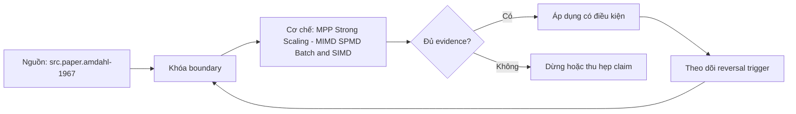

# MPP Strong Scaling - MIMD SPMD Batch and SIMD

> [!abstract] Câu hỏi trung tâm
> Làm sao truy vết ba tầng parallelism của một MPP query và xác định strong-scaling ceiling bằng evidence thay vì gán mọi speedup cho số worker?

## 1. Bốn khái niệm không đồng cấp

Flynn MIMD mô tả nhiều processing elements có instruction stream và data stream riêng; trong cụm MPP, workers/tasks có tiến độ và failure mode độc lập. SPMD là programming/execution pattern: nhiều workers chạy cùng program fragment trên partitions khác nhau, nhưng không đồng bộ từng instruction. Vectorized execution là interface theo batch bên trong một task. SIMD là instruction-level execution trên lanes trong một core. Một query có thể đồng thời là distributed MIMD, tổ chức theo SPMD, chạy vector batches và dùng SIMD. Bốn nhãn trả lời bốn câu hỏi; không được cộng chúng thành một con số parallelism duy nhất.

## 2. Strong scaling và đại lượng đo

Strong scaling giữ nguyên query, input snapshot và output rồi tăng resources. Với thời gian `T_1` và `T_p`, speedup là `S_p = T_1/T_p`; efficiency là `E_p = S_p/p`. Efficiency dưới một không tự chứng minh lỗi: startup, split granularity, coordinator, exchange, contention và measurement noise đều góp phần. Cost thường tăng dù latency giảm, nên báo node-seconds hoặc compute-unit-seconds bên cạnh time. Nếu configuration một node không chạy được vì memory, baseline hợp lệ có thể là số node nhỏ nhất; ký hiệu speedup relative và không gọi nó là `T_1`.

## 3. Amdahl là boundary, không phải diagnosis

Với fraction song song lý tưởng `f`, upper-bound cổ điển là `1 / ((1-f)+f/p)`. Fraction suy ngược từ timings là effective serial fraction: nó hấp thụ coordinator, communication, barriers, skew, fixed startup và external bandwidth. Nó không chỉ ra nguyên nhân vật lý. Dùng stage/task counters để phân rã compute, blocked/network, source read, spill và final gather. Nếu dataset không vừa cache hoặc engine đổi algorithm khi tăng p, giả định cùng công việc bị phá; đường cong vẫn hữu ích nhưng không còn là thí nghiệm một biến.

## 4. Weak scaling và Gustafson

Weak scaling tăng input/work cùng resources và hỏi time hoặc throughput per node có giữ ổn định. Gustafson-style scaled speedup phù hợp câu hỏi capacity: với cùng elapsed budget, cụm lớn giải được bài toán lớn hơn bao nhiêu. Nó không thay strong-scaling result cho fixed query. Một hệ có weak scaling tốt nhưng latency một query fixed-size không giảm sau bốn nodes; ngược lại cache locality có thể tạo superlinear point tạm thời. Báo data per worker, output cardinality, query semantics và bottleneck khi so hai curves.

## 5. Barrier và critical path

Stage kết thúc theo task chậm nhất, không theo average. Remote exchange, final aggregation/order, build completion hoặc explicit materialization tạo synchronization boundaries. Với mỗi stage lưu task duration distribution, max/median ratio, rows/bytes, CPU, scheduled/blocked time, peak memory và spill. Straggler có thể do hot key, uneven files/splits, remote storage, GC, retry, noisy neighbor hoặc hardware. Chênh task time là symptom; chỉ gọi skew khi input/output distribution hoặc key frequency ủng hộ.

## 6. External ceilings

Thêm workers không tăng source bandwidth nếu object store, connector database, API, metadata service hoặc client sink đã saturated. Coordinator có thể nghẽn planning/scheduling/final result; network bisection và exchange serialization có thể chi phối. Dùng resource-level counters và control query để nhận biết. Nếu aggregate source throughput không tăng từ p=4 tới p=8 trong khi CPU workers idle/blocked, ceiling thuộc upstream path. Nếu one partition/task max giữ nguyên, nghi granularity/skew. Nếu coordinator CPU/queue tăng, không quy cho SIMD hay vector batches.

## 7. Truy xuống batch và SIMD

Chọn một task trong critical stage, ghi operator pipeline, batch/chunk size, rows/batch và CPU counters. Sau đó dùng engine profile, compiler remarks hoặc disassembly nếu được phép để xác minh vector instructions. Cluster speedup không chứng minh SIMD; SIMD instruction count không chứng minh end-to-end benefit nếu network dominant. Phân tích theo nested boundary: query wall time → stage critical path → task/operator CPU → batch loop → instructions. Mỗi tầng cần counterfactual riêng và correctness oracle giống nhau.

## 8. Lab 1-2-4-8 workers

Khóa snapshot, query text, statistics, layout, caches, concurrency, engine version, worker shape và output hash. Randomize hoặc interleave node counts, chạy warm-up tách biệt và lặp đủ để báo median cùng dispersion. Với mỗi mức ghi wall time, node-seconds, source/exchange/output bytes, stage/task distributions và retries. Tính speedup/efficiency, xác định đoạn marginal gain giảm. Gán ceiling vào serial/coordinator, communication, skew/granularity hoặc external bottleneck chỉ khi counter trực tiếp thay đổi theo dự đoán. Thêm weak-scaling run riêng; không trộn vào strong-scaling table.

## 9. Ma trận kiểm chứng từng mệnh đề

Mỗi mệnh đề về latency, scaling, cache, concurrency hoặc cost cần counterfactual, correctness oracle và counter ở đúng boundary. Tên kiến trúc, plan label, elapsed time hoặc rate card riêng lẻ chưa đủ để quy nguyên nhân.

### 9.1. MIMD là taxonomy của instruction/data streams chứ không phải đồng hồ chung

**Mệnh đề cần kiểm.** MIMD là taxonomy của instruction/data streams chứ không phải đồng hồ chung.

**Cách kiểm.** Khóa fixed snapshot/query/config; chạy 1, 2, 4, 8 workers, lưu stage/task counters, node-seconds và output hash; thêm weak-scaling series riêng. Ghi engine/version, workload shape, controlled variables, expected counter, failure signal và reversal condition.

**Bằng chứng đạt cho `wiki.olap.mpp-strong-scaling-mimd-spmd-batch-simd`.** Lưu source/query/config hashes, plans/profiles, raw counters, result oracle, repetitions, units và reviewer. Khi lab chưa chạy, chỉ giữ protocol và expected observations; không viết chúng như kết quả thực nghiệm.

### 9.2. SPMD tasks có thể tiến triển và hỏng độc lập

**Mệnh đề cần kiểm.** SPMD tasks có thể tiến triển và hỏng độc lập.

**Cách kiểm.** Khóa fixed snapshot/query/config; chạy 1, 2, 4, 8 workers, lưu stage/task counters, node-seconds và output hash; thêm weak-scaling series riêng. Ghi engine/version, workload shape, controlled variables, expected counter, failure signal và reversal condition.

**Bằng chứng đạt cho `wiki.olap.mpp-strong-scaling-mimd-spmd-batch-simd`.** Lưu source/query/config hashes, plans/profiles, raw counters, result oracle, repetitions, units và reviewer. Khi lab chưa chạy, chỉ giữ protocol và expected observations; không viết chúng như kết quả thực nghiệm.

### 9.3. batch execution thuộc engine còn SIMD thuộc ISA

**Mệnh đề cần kiểm.** batch execution thuộc engine còn SIMD thuộc ISA.

**Cách kiểm.** Khóa fixed snapshot/query/config; chạy 1, 2, 4, 8 workers, lưu stage/task counters, node-seconds và output hash; thêm weak-scaling series riêng. Ghi engine/version, workload shape, controlled variables, expected counter, failure signal và reversal condition.

**Bằng chứng đạt cho `wiki.olap.mpp-strong-scaling-mimd-spmd-batch-simd`.** Lưu source/query/config hashes, plans/profiles, raw counters, result oracle, repetitions, units và reviewer. Khi lab chưa chạy, chỉ giữ protocol và expected observations; không viết chúng như kết quả thực nghiệm.

### 9.4. strong scaling giữ fixed work và fixed result

**Mệnh đề cần kiểm.** strong scaling giữ fixed work và fixed result.

**Cách kiểm.** Khóa fixed snapshot/query/config; chạy 1, 2, 4, 8 workers, lưu stage/task counters, node-seconds và output hash; thêm weak-scaling series riêng. Ghi engine/version, workload shape, controlled variables, expected counter, failure signal và reversal condition.

**Bằng chứng đạt cho `wiki.olap.mpp-strong-scaling-mimd-spmd-batch-simd`.** Lưu source/query/config hashes, plans/profiles, raw counters, result oracle, repetitions, units và reviewer. Khi lab chưa chạy, chỉ giữ protocol và expected observations; không viết chúng như kết quả thực nghiệm.

### 9.5. relative baseline nhiều node phải được ghi rõ

**Mệnh đề cần kiểm.** relative baseline nhiều node phải được ghi rõ.

**Cách kiểm.** Khóa fixed snapshot/query/config; chạy 1, 2, 4, 8 workers, lưu stage/task counters, node-seconds và output hash; thêm weak-scaling series riêng. Ghi engine/version, workload shape, controlled variables, expected counter, failure signal và reversal condition.

**Bằng chứng đạt cho `wiki.olap.mpp-strong-scaling-mimd-spmd-batch-simd`.** Lưu source/query/config hashes, plans/profiles, raw counters, result oracle, repetitions, units và reviewer. Khi lab chưa chạy, chỉ giữ protocol và expected observations; không viết chúng như kết quả thực nghiệm.

### 9.6. speedup cần đi cùng parallel efficiency và node-seconds

**Mệnh đề cần kiểm.** speedup cần đi cùng parallel efficiency và node-seconds.

**Cách kiểm.** Khóa fixed snapshot/query/config; chạy 1, 2, 4, 8 workers, lưu stage/task counters, node-seconds và output hash; thêm weak-scaling series riêng. Ghi engine/version, workload shape, controlled variables, expected counter, failure signal và reversal condition.

**Bằng chứng đạt cho `wiki.olap.mpp-strong-scaling-mimd-spmd-batch-simd`.** Lưu source/query/config hashes, plans/profiles, raw counters, result oracle, repetitions, units và reviewer. Khi lab chưa chạy, chỉ giữ protocol và expected observations; không viết chúng như kết quả thực nghiệm.

### 9.7. effective serial fraction không tự chỉ ra root cause

**Mệnh đề cần kiểm.** effective serial fraction không tự chỉ ra root cause.

**Cách kiểm.** Khóa fixed snapshot/query/config; chạy 1, 2, 4, 8 workers, lưu stage/task counters, node-seconds và output hash; thêm weak-scaling series riêng. Ghi engine/version, workload shape, controlled variables, expected counter, failure signal và reversal condition.

**Bằng chứng đạt cho `wiki.olap.mpp-strong-scaling-mimd-spmd-batch-simd`.** Lưu source/query/config hashes, plans/profiles, raw counters, result oracle, repetitions, units và reviewer. Khi lab chưa chạy, chỉ giữ protocol và expected observations; không viết chúng như kết quả thực nghiệm.

### 9.8. Amdahl upper bound cần giả định cùng algorithm và workload

**Mệnh đề cần kiểm.** Amdahl upper bound cần giả định cùng algorithm và workload.

**Cách kiểm.** Khóa fixed snapshot/query/config; chạy 1, 2, 4, 8 workers, lưu stage/task counters, node-seconds và output hash; thêm weak-scaling series riêng. Ghi engine/version, workload shape, controlled variables, expected counter, failure signal và reversal condition.

**Bằng chứng đạt cho `wiki.olap.mpp-strong-scaling-mimd-spmd-batch-simd`.** Lưu source/query/config hashes, plans/profiles, raw counters, result oracle, repetitions, units và reviewer. Khi lab chưa chạy, chỉ giữ protocol và expected observations; không viết chúng như kết quả thực nghiệm.

### 9.9. weak scaling trả lời capacity chứ không trả lời fixed-query latency

**Mệnh đề cần kiểm.** weak scaling trả lời capacity chứ không trả lời fixed-query latency.

**Cách kiểm.** Khóa fixed snapshot/query/config; chạy 1, 2, 4, 8 workers, lưu stage/task counters, node-seconds và output hash; thêm weak-scaling series riêng. Ghi engine/version, workload shape, controlled variables, expected counter, failure signal và reversal condition.

**Bằng chứng đạt cho `wiki.olap.mpp-strong-scaling-mimd-spmd-batch-simd`.** Lưu source/query/config hashes, plans/profiles, raw counters, result oracle, repetitions, units và reviewer. Khi lab chưa chạy, chỉ giữ protocol và expected observations; không viết chúng như kết quả thực nghiệm.

### 9.10. superlinear point có thể đến từ cache hoặc algorithm transition

**Mệnh đề cần kiểm.** superlinear point có thể đến từ cache hoặc algorithm transition.

**Cách kiểm.** Khóa fixed snapshot/query/config; chạy 1, 2, 4, 8 workers, lưu stage/task counters, node-seconds và output hash; thêm weak-scaling series riêng. Ghi engine/version, workload shape, controlled variables, expected counter, failure signal và reversal condition.

**Bằng chứng đạt cho `wiki.olap.mpp-strong-scaling-mimd-spmd-batch-simd`.** Lưu source/query/config hashes, plans/profiles, raw counters, result oracle, repetitions, units và reviewer. Khi lab chưa chạy, chỉ giữ protocol và expected observations; không viết chúng như kết quả thực nghiệm.

### 9.11. critical path theo max task không theo average

**Mệnh đề cần kiểm.** critical path theo max task không theo average.

**Cách kiểm.** Khóa fixed snapshot/query/config; chạy 1, 2, 4, 8 workers, lưu stage/task counters, node-seconds và output hash; thêm weak-scaling series riêng. Ghi engine/version, workload shape, controlled variables, expected counter, failure signal và reversal condition.

**Bằng chứng đạt cho `wiki.olap.mpp-strong-scaling-mimd-spmd-batch-simd`.** Lưu source/query/config hashes, plans/profiles, raw counters, result oracle, repetitions, units và reviewer. Khi lab chưa chạy, chỉ giữ protocol và expected observations; không viết chúng như kết quả thực nghiệm.

### 9.12. straggler không đồng nghĩa data skew

**Mệnh đề cần kiểm.** straggler không đồng nghĩa data skew.

**Cách kiểm.** Khóa fixed snapshot/query/config; chạy 1, 2, 4, 8 workers, lưu stage/task counters, node-seconds và output hash; thêm weak-scaling series riêng. Ghi engine/version, workload shape, controlled variables, expected counter, failure signal và reversal condition.

**Bằng chứng đạt cho `wiki.olap.mpp-strong-scaling-mimd-spmd-batch-simd`.** Lưu source/query/config hashes, plans/profiles, raw counters, result oracle, repetitions, units và reviewer. Khi lab chưa chạy, chỉ giữ protocol và expected observations; không viết chúng như kết quả thực nghiệm.

### 9.13. external source bandwidth có thể tạo ceiling

**Mệnh đề cần kiểm.** external source bandwidth có thể tạo ceiling.

**Cách kiểm.** Khóa fixed snapshot/query/config; chạy 1, 2, 4, 8 workers, lưu stage/task counters, node-seconds và output hash; thêm weak-scaling series riêng. Ghi engine/version, workload shape, controlled variables, expected counter, failure signal và reversal condition.

**Bằng chứng đạt cho `wiki.olap.mpp-strong-scaling-mimd-spmd-batch-simd`.** Lưu source/query/config hashes, plans/profiles, raw counters, result oracle, repetitions, units và reviewer. Khi lab chưa chạy, chỉ giữ protocol và expected observations; không viết chúng như kết quả thực nghiệm.

### 9.14. cluster speedup không chứng minh SIMD

**Mệnh đề cần kiểm.** cluster speedup không chứng minh SIMD.

**Cách kiểm.** Khóa fixed snapshot/query/config; chạy 1, 2, 4, 8 workers, lưu stage/task counters, node-seconds và output hash; thêm weak-scaling series riêng. Ghi engine/version, workload shape, controlled variables, expected counter, failure signal và reversal condition.

**Bằng chứng đạt cho `wiki.olap.mpp-strong-scaling-mimd-spmd-batch-simd`.** Lưu source/query/config hashes, plans/profiles, raw counters, result oracle, repetitions, units và reviewer. Khi lab chưa chạy, chỉ giữ protocol và expected observations; không viết chúng như kết quả thực nghiệm.

### 9.15. ba tầng phải có evidence riêng rồi mới nối causal chain

**Mệnh đề cần kiểm.** ba tầng phải có evidence riêng rồi mới nối causal chain.

**Cách kiểm.** Khóa fixed snapshot/query/config; chạy 1, 2, 4, 8 workers, lưu stage/task counters, node-seconds và output hash; thêm weak-scaling series riêng. Ghi engine/version, workload shape, controlled variables, expected counter, failure signal và reversal condition.

**Bằng chứng đạt cho `wiki.olap.mpp-strong-scaling-mimd-spmd-batch-simd`.** Lưu source/query/config hashes, plans/profiles, raw counters, result oracle, repetitions, units và reviewer. Khi lab chưa chạy, chỉ giữ protocol và expected observations; không viết chúng như kết quả thực nghiệm.

## 10. Quy trình phản biện

1. Viết câu hỏi đo lường và decision cần hỗ trợ trước khi chọn metric.
2. Khóa query semantics, snapshot, output oracle và unit của mọi số.
3. Vẽ boundaries: client, queue, planner, source, worker, exchange, cache, spill và billing.
4. Thay một cơ chế; ghi mọi thay đổi algorithm/config do engine tự thực hiện.
5. Dùng distribution và critical path; không để average che tails hoặc skew.
6. Viết counterexample, reversal condition và stop threshold trước khi chạy.
7. Tách estimate, configured intent, runtime observation và invoice fact.
8. Nếu không kiểm soát được cache, resource hoặc rate contract, ghi giới hạn thay vì kết luận nhân quả.

## 11. Câu hỏi tự kiểm tra

1. Mệnh đề đang nằm ở tầng kiến trúc, scheduler, operator, hardware hay billing?
2. Counter nào quan sát trực tiếp cơ chế đó và proxy nào dễ gây nhầm?
3. Correctness/SLO nào phải giữ trước khi gọi một phương án tốt hơn?
4. Cache, concurrency, statistics, data shape hay rate card nào có thể đảo kết luận?
5. Intervention nào bác bỏ diagnosis hiện tại?
6. Kết luận nào mới là protocol, chưa phải observation?

## 12. Giới hạn và điều chưa cho phép kết luận

- Chưa chạy cluster scaling, join/spill, cache, concurrency hoặc billing reconciliation lab; note mô tả protocol và evidence contract.
- Tài liệu sản phẩm được kiểm ngày 2026-10-01; field, feature, pricing và behavior có thể đổi theo version, region và contract.
- Amdahl, Gustafson, workload matrices và cost equations là mô hình; chúng không thay runtime counters hay invoice export.
- Không suy vendor superiority từ paper hoặc một benchmark; workload, correctness, SLO, operation và price contract phải cùng phạm vi.
- Note giữ trạng thái `review` cho tới khi chủ dự án duyệt semantic meaning.

## Reference
1. [[SRC-AMDAHL-1967]]
2. [[SRC-GUSTAFSON-1988]]
3. [[SRC-PRESTO-SQL-ON-EVERYTHING]]
4. [[SRC-TRINO-DISTRIBUTED-PLANS]]

## Source coverage

| Source slice | Nội dung sử dụng | Trạng thái |
|---|---|---|
| [[SRC-AMDAHL-1967]] | Khái niệm, mechanism hoặc evidence boundary liên quan | Đã đọc locator trong source record; không suy ngoài phạm vi |
| [[SRC-GUSTAFSON-1988]] | Khái niệm, mechanism hoặc evidence boundary liên quan | Đã đọc locator trong source record; không suy ngoài phạm vi |
| [[SRC-PRESTO-SQL-ON-EVERYTHING]] | Khái niệm, mechanism hoặc evidence boundary liên quan | Đã đọc locator trong source record; không suy ngoài phạm vi |
| [[SRC-TRINO-DISTRIBUTED-PLANS]] | Khái niệm, mechanism hoặc evidence boundary liên quan | Đã đọc locator trong source record; không suy ngoài phạm vi |

## Key takeaways
- Strong scaling, weak scaling, MIMD/SPMD, batch và SIMD phải được đo ở các boundary riêng rồi mới nối causal chain.
- Estimate và configured intent phải được tách khỏi runtime observation và invoice fact.
- Correctness oracle, units, cache state, workload shape và controlled variables đi trước performance/cost claim.
- Average phải đi cùng distributions, tails, critical path và per-class hoặc per-task counters.
- Chưa chạy lab thì artifact là giáo trình đã kiểm cấu trúc, chưa phải benchmark hay production certification.

<!-- ATOMIC-EXECUTION-CAPSULE:START -->

## Execution capsule: kiểm chứng `wiki.olap.mpp-strong-scaling-mimd-spmd-batch-simd`

> [!important] Phân loại mệnh đề
> Với `wiki.olap.mpp-strong-scaling-mimd-spmd-batch-simd`, sơ đồ, ví dụ và artifact về **MPP Strong Scaling - MIMD SPMD Batch and SIMD** là **synthesis để kiểm chứng**; chúng không phải trích dẫn hay case nguyên văn của nguồn.

### Sơ đồ cơ chế và điểm kiểm soát



Đọc sơ đồ `wiki.olap.mpp-strong-scaling-mimd-spmd-batch-simd` từ trái sang phải: source chỉ cung cấp claim ban đầu cho **MPP Strong Scaling - MIMD SPMD Batch and SIMD**; quyết định chỉ được đi tiếp sau khi boundary, evidence và điều kiện đảo quyết định đã hiện hữu.

### Ví dụ làm việc có thể bác bỏ

**Input.** Một đội cần trả lời: Làm sao truy vết ba tầng parallelism của một MPP query và xác định strong-scaling ceiling bằng evidence thay vì gán mọi speedup cho số worker? cho một phạm vi nhỏ, có owner và deadline rõ.

**Decision.** Đội áp dụng **MPP Strong Scaling - MIMD SPMD Batch and SIMD** trên control và variant chỉ khác một assumption; expected result và hard constraints được khóa trước khi chạy.

**Outcome.** Với `wiki.olap.mpp-strong-scaling-mimd-spmd-batch-simd`, nếu observation vi phạm hard constraint hoặc oracle độc lập không xác nhận **MPP Strong Scaling - MIMD SPMD Batch and SIMD**, đội thu hẹp claim hay đảo quyết định. Nếu đạt, kết luận vẫn kèm scope, version và review date; một lần thành công không được nâng thành quy luật phổ quát.

### Artifact thực thi tối thiểu

```sql
-- Verification harness for: MPP Strong Scaling - MIMD SPMD Batch and SIMD
WITH evidence AS (
    SELECT 'wiki.olap.mpp-strong-scaling-mimd-spmd-batch-simd' AS concept_id,
           'boundary_declared' AS check_name, 1 AS passed
    UNION ALL
    SELECT 'wiki.olap.mpp-strong-scaling-mimd-spmd-batch-simd', 'independent_oracle', 1
    UNION ALL
    SELECT 'wiki.olap.mpp-strong-scaling-mimd-spmd-batch-simd', 'reversal_trigger_recorded', 1
)
SELECT concept_id,
       MIN(passed) AS all_hard_checks_pass,
       COUNT(*) AS evidence_items
FROM evidence
GROUP BY concept_id
HAVING MIN(passed) = 1;
```

Artifact của `wiki.olap.mpp-strong-scaling-mimd-spmd-batch-simd` buộc người dùng ghi boundary, oracle và reversal trigger cho **MPP Strong Scaling - MIMD SPMD Batch and SIMD**. Các giá trị minh họa phải được thay bằng evidence thật trước khi dùng cho quyết định.

### Tự kiểm tra trước khi tái sử dụng

1. Bạn có thể trả lời `Làm sao truy vết ba tầng parallelism của một MPP query và xác định strong-scaling ceiling bằng evidence thay vì gán mọi speedup cho số worker?` bằng một câu mà không kéo thêm concept thứ hai không?
2. Source locator nào đỡ cho claim, và phần nào chỉ là synthesis trong note?
3. Observation nào khiến bạn dừng, thu hẹp hoặc đảo quyết định?
4. Artifact nào cho phép một reviewer độc lập tái hiện kết quả?

<!-- ATOMIC-EXECUTION-CAPSULE:END -->
